# Sensitive Data Detection with Amazon Macie

---

## Overview

**Amazon Macie** là dịch vụ bảo mật được quản lý hoàn toàn bởi AWS, sử dụng **machine learning** và **pattern matching** để tự động phát hiện, phân loại và bảo vệ **dữ liệu nhạy cảm** được lưu trữ trong **Amazon S3**.

> **Vấn đề thực tế nó giải quyết:** Các tổ chức thường lưu trữ hàng petabyte dữ liệu trong S3 mà không biết rõ đâu là dữ liệu nhạy cảm — số thẻ tín dụng, số an sinh xã hội, thông tin y tế, thông tin định danh cá nhân (PII). Macie tự động quét và cảnh báo trước khi xảy ra vi phạm dữ liệu, giúp tuân thủ GDPR, HIPAA, PCI-DSS.

**Hai chức năng cốt lõi:**

- **Data discovery** — Tự động quét S3 buckets, phân loại và phát hiện sensitive data
- **Security monitoring** — Liên tục đánh giá cấu hình S3, phát hiện bucket public hoặc không mã hóa

---

## Key Concepts & Keywords

| Từ khóa                     | Bản chất                                                           |
| --------------------------- | ------------------------------------------------------------------ |
| **Sensitive Data**          | Dữ liệu cần bảo vệ: PII, tài chính, y tế, thông tin xác thực       |
| **Data Identifier**         | Quy tắc/pattern để nhận diện sensitive data trong file             |
| **Managed Data Identifier** | Built-in identifier do AWS duy trì, nhận diện 100+ loại data       |
| **Custom Data Identifier**  | Identifier tự định nghĩa bằng regex + keywords                     |
| **Sensitivity Score**       | Điểm đánh giá mức độ nhạy cảm của một S3 object (0–100)            |
| **Discovery Job**           | Tác vụ quét S3 bucket để tìm sensitive data                        |
| **Finding**                 | Báo cáo phát hiện — chi tiết về sensitive data hoặc vấn đề bảo mật |
| **Policy Finding**          | Cảnh báo về cấu hình S3 không an toàn (bucket public, v.v.)        |
| **Sensitive Data Finding**  | Cảnh báo khi phát hiện sensitive data trong object                 |
| **Allow List**              | Danh sách patterns được miễn trừ — không báo cáo khi match         |
| **Multi-account**           | Quản lý Macie tập trung qua AWS Organizations                      |

---

## Detailed Deep Dive

### Kiến trúc tổng quan của Macie

Macie phân loại phát hiện (findings) thành hai luồng chính: **Policy Findings** (cấu hình S3 sai) và **Sensitive Data Findings** (phát hiện PII/dữ liệu nhạy cảm).

<p align="center"></p>

---

### Data Identifiers — 3 Cơ chế nhận diện

Để nhận diện dữ liệu, Macie sử dụng các Identifier (bộ nhận diện). Quá trình quét bao gồm 3 cơ chế cốt lõi:

<p align="center"></p>

#### Managed Data Identifiers (Built-in)

AWS duy trì và cập nhật liên tục hơn **100+ loại sensitive data** được nhận diện tự động, không cần cấu hình thêm.

| Danh mục                    | Ví dụ cụ thể                                                     |
| --------------------------- | ---------------------------------------------------------------- |
| **PII — Định danh cá nhân** | Tên, địa chỉ, email, số điện thoại, ngày sinh                    |
| **Tài chính**               | Số thẻ tín dụng (Visa, Mastercard, Amex), số tài khoản ngân hàng |
| **Chính phủ**               | SSN (Mỹ), số hộ chiếu, số CMND/CCCD                              |
| **Y tế**                    | Mã ICD, số hồ sơ bệnh nhân, thông tin thuốc                      |
| **Thông tin xác thực**      | AWS keys, private keys, OAuth tokens, passwords                  |
| **Mạng**                    | Địa chỉ IP, MAC address                                          |

> **Lợi thế:** AWS tự cập nhật khi có loại sensitive data mới, không cần bảo trì từ phía khách hàng.

#### Custom Data Identifiers (Tự định nghĩa)

Dùng khi tổ chức có loại dữ liệu đặc thù không có trong managed identifiers.

**Thành phần:**

- **Regex pattern** — biểu thức chính quy để match
- **Keywords** — từ khóa phải xuất hiện gần pattern (trong 50 ký tự)
- **Maximum match distance** — khoảng cách tối đa giữa keyword và pattern
- **Ignore words** — từ loại trừ để giảm false positive

**Ví dụ thực tế — Mã nhân viên nội bộ:**

```
Pattern:   EMP-\d{6}
Keywords:  "employee", "staff", "nhân viên"
→ Match: "employee ID: EMP-123456"
→ No match: "EMP-123456" (không có keyword gần đó)
```

#### Allow Lists — Giảm false positive

Allow List cho phép **miễn trừ** các patterns cụ thể không cần báo cáo — tránh tình trạng Macie liên tục cảnh báo về dữ liệu test hoặc dữ liệu đã được che giấu hợp lệ.

| Loại Allow List        | Mô tả                              |
| ---------------------- | ---------------------------------- |
| **Predefined text**    | Danh sách text cụ thể lưu trong S3 |
| **Regular expression** | Pattern regex để bỏ qua            |

**Ví dụ:** Bỏ qua các số thẻ test `4111-1111-1111-1111` thường dùng trong môi trường dev.

---

### Sensitivity Score — Đánh giá mức độ nhạy cảm

Macie gán **Sensitivity Score** từ 0 đến 100 cho mỗi S3 object và bucket:

```
Score 0        Score 25-50       Score 75-100
   │               │                  │
   ▼               ▼                  ▼
Not sensitive    Low-medium         Highly sensitive
(no findings)    sensitivity        (SSN, credit card,
                                     health records)
```

**Score của bucket** = tổng hợp từ score của tất cả objects bên trong, giúp ưu tiên bucket nào cần xem xét trước.

---

### Discovery Jobs — Cách quét S3

Có hai chế độ quét:

| Chế độ            | Mô tả                                           | Dùng khi                        |
| ----------------- | ----------------------------------------------- | ------------------------------- |
| **One-time job**  | Quét một lần tại thời điểm chỉ định             | Audit định kỳ, compliance check |
| **Scheduled job** | Quét định kỳ (hàng ngày, hàng tuần, hàng tháng) | Monitoring liên tục             |

**Automated sensitive data discovery** (tính năng mới): Macie tự động liên tục lấy mẫu và đánh giá toàn bộ S3 estate mà không cần tạo job thủ công — phù hợp cho môi trường lớn với hàng nghìn buckets.

**Phạm vi job có thể thu hẹp:**

- Chỉ quét bucket cụ thể
- Chỉ quét objects có tag nhất định
- Chỉ quét objects được tạo trong khoảng thời gian nhất định
- Loại trừ file extension cụ thể

---

### Findings — Hai loại cảnh báo

#### Policy Findings (Vấn đề cấu hình S3)

Macie liên tục monitor cấu hình S3 và cảnh báo khi phát hiện:

| Finding Type                                  | Ý nghĩa                                                         |
| --------------------------------------------- | --------------------------------------------------------------- |
| `Policy:IAMUser/S3BucketPublic`               | Bucket đang public — bất kỳ ai trên internet cũng truy cập được |
| `Policy:IAMUser/S3BucketEncryptionDisabled`   | Bucket không bật server-side encryption                         |
| `Policy:IAMUser/S3BucketSharedExternally`     | Bucket được share với AWS account ngoài tổ chức                 |
| `Policy:IAMUser/S3BucketReplicatedExternally` | Replication đang copy data ra account bên ngoài                 |
| `Policy:IAMUser/S3BlockPublicAccessDisabled`  | Block Public Access bị tắt                                      |

#### Sensitive Data Findings (Phát hiện dữ liệu nhạy cảm)

| Finding Type                              | Ý nghĩa                                          |
| ----------------------------------------- | ------------------------------------------------ |
| `SensitiveData:S3Object/Financial`        | Tìm thấy thông tin tài chính (số thẻ, tài khoản) |
| `SensitiveData:S3Object/Personal`         | Tìm thấy PII (tên, SSN, địa chỉ)                 |
| `SensitiveData:S3Object/Medical`          | Tìm thấy dữ liệu y tế                            |
| `SensitiveData:S3Object/Credentials`      | Tìm thấy thông tin xác thực (API key, password)  |
| `SensitiveData:S3Object/CustomIdentifier` | Match với custom data identifier                 |

**Thông tin chi tiết trong finding:**

- Tên bucket và object path
- Loại sensitive data và số lượng occurrences
- Sample của dữ liệu tìm thấy (đã che giấu một phần)
- Severity: Low / Medium / High

---

### Tích hợp với AWS Services

```
                    Amazon Macie
                         │
              ┌──────────┼──────────────┐
              ▼          ▼              ▼
        EventBridge   Security Hub   S3 (export)
              │          │              │
              ▼          ▼              ▼
           Lambda    Centralized    Athena/QuickSight
           SNS/SQS   findings       (analytics)
           Step Fn   dashboard
```

---

### So Sánh Các Dịch Vụ Bảo Mật (Exam Essentials)

Khi thiết kế giải pháp bảo mật hoặc thi chứng chỉ AWS, cần phân biệt rõ phạm vi của các dịch vụ sau:

<p align="center"></p>

- **Macie**: Nhìn vào **Data** trong S3.
- **GuardDuty**: Theo dõi **Hành vi/Traffic** bất thường.
- **Inspector**: Tìm kiếm **Lỗ hổng (CVE/Vulnerability)**.
- **Security Hub**: Gộp tất cả findings lại chung một chỗ.

**Các tích hợp quan trọng:**

**EventBridge** — Mỗi finding tạo ra event trong EventBridge, cho phép trigger tự động:

- Lambda để revoke public access ngay lập tức
- SNS để notify security team
- Step Functions để chạy remediation workflow

**AWS Security Hub** — Macie findings được tổng hợp vào Security Hub cùng với GuardDuty, Inspector → một dashboard bảo mật tập trung

**AWS Organizations** — Quản lý Macie tập trung cho multi-account:

- Một account làm Macie administrator
- Các member accounts được quản lý tập trung
- Findings được tổng hợp về account administrator

---

### File Formats được hỗ trợ

Macie có thể phân tích nội dung của nhiều định dạng file:

| Nhóm                 | Format                                                   |
| -------------------- | -------------------------------------------------------- |
| **Text**             | `.txt`, `.csv`, `.tsv`, `.json`, `.jsonl`, `.xml`        |
| **Office**           | `.docx`, `.xlsx`, `.pptx`                                |
| **Database exports** | `.sql`, Parquet                                          |
| **Email**            | `.eml`, `.msg`                                           |
| **Code**             | `.py`, `.js`, `.java`, `.html`, `.css`                   |
| **Compressed**       | `.zip`, `.gz`, `.tar` (Macie giải nén và quét bên trong) |
| **Binary**           | Một số format binary có metadata                         |

> **Giới hạn:** File size tối đa 20 MB để phân tích nội dung. File lớn hơn chỉ được phân tích metadata.

---

## Practical Examples & Scenarios

### Scenario 1 — Healthcare Compliance (HIPAA)

**Vấn đề:** Bệnh viện lưu hàng triệu file bệnh án trong S3, cần đảm bảo không có PHI (Protected Health Information) bị lưu sai bucket.

```
S3 Buckets
├── prod-patient-records/    ← PHI cho phép, có encryption + access control
├── dev-test-data/           ← Không cho phép có PHI thật
└── public-reports/          ← Tuyệt đối không có PHI

         Macie Discovery Job (scheduled daily)
                    │
                    ▼
         Phát hiện SSN trong dev-test-data/patient_123.csv
                    │
              SensitiveData Finding
                    │
              EventBridge
                    │
         ┌──────────┼──────────┐
         ▼          ▼          ▼
      Lambda      SNS         Security
      (tag obj   (alert      Hub
      quarantine) CISO team)
```

**Kết quả:** File chứa PHI thật trong môi trường dev bị tag ngay lập tức, team nhận alert trong vài phút thay vì phát hiện khi audit hàng năm.

---

### Scenario 2 — Financial Institution (PCI-DSS)

**Vấn đề:** Ngân hàng cần đảm bảo số thẻ tín dụng không bị lưu dưới dạng plaintext trong bất kỳ S3 bucket nào.

```
Macie Automated Discovery (liên tục)
          │
          ├──► Scan 5,000+ S3 buckets
          │
          ├──► PHẾ THẢI: transaction_logs_2024.csv
          │    Managed identifier: Credit Card Numbers
          │    Count: 15,000 occurrences
          │    Severity: HIGH
          │
          └──► Finding → EventBridge
                              │
                         Lambda function
                              │
                    ┌─────────┴──────────┐
                    ▼                    ▼
             Block S3 bucket        Notify PCI
             public access          compliance team
             (immediate)            + create Jira ticket
```

---

### Scenario 3 — Multi-account Enterprise (AWS Organizations)

**Vấn đề:** Tập đoàn có 50 AWS accounts, cần quản lý Macie tập trung.

```
AWS Organizations
├── Management Account
│   └── Macie Administrator (delegated)
│         │ Tập trung tất cả findings
│         │ Quản lý custom identifiers chung
│         ▼
├── Account A (Dev)   ─── Macie member
├── Account B (Prod)  ─── Macie member
├── Account C (Data)  ─── Macie member
└── Account D (Shared)─── Macie member

→ Security team thấy toàn bộ findings từ 50 accounts
  trong một Security Hub dashboard duy nhất
```

---

## Exam Essentials & Tips

### Macie vs. các dịch vụ bảo mật AWS khác

> **Exam tip quan trọng:** Hay bị nhầm lẫn giữa Macie, GuardDuty và Inspector.

| Service              | Mục tiêu                          | Phát hiện                                         |
| -------------------- | --------------------------------- | ------------------------------------------------- |
| **Amazon Macie**     | S3 sensitive data                 | PII, thông tin tài chính, credentials trong files |
| **Amazon GuardDuty** | Threat detection (toàn tài khoản) | Unauthorized access, malware, crypto mining       |
| **Amazon Inspector** | Vulnerability assessment          | CVE trong EC2/Lambda/Container                    |
| **AWS Security Hub** | Tổng hợp findings                 | Aggregator từ Macie + GuardDuty + Inspector       |

**Ghi nhớ nhanh:** Macie = **S3 data** / GuardDuty = **behavior threats** / Inspector = **vulnerabilities**

---

### Billing — Chi phí cần biết

Macie tính phí theo **hai chiều:**

**1. Bucket monitoring và evaluation:**

- Tính theo số S3 buckets được monitor mỗi tháng
- 30 ngày miễn phí khi bật Macie lần đầu

**2. Sensitive data discovery:**

- Tính theo **GB data được xử lý** trong discovery jobs
- Automated discovery tính theo GB được lấy mẫu
- File không được hỗ trợ (video, audio) không tính phí processing

> **Cost optimization:** Dùng job scope để thu hẹp phạm vi quét — chỉ quét bucket/object thực sự cần thiết. Loại trừ file types không liên quan (`.mp4`, `.png`...).

---

### Security Best Practices

**Kết hợp Macie với:**

- **S3 Block Public Access** — Bật ở account level để ngăn bucket public
- **S3 Bucket Policies** — Chỉ cho phép access từ VPC endpoint
- **AWS KMS** — Encrypt tất cả S3 data at rest
- **S3 Object Lock** — Bảo vệ data khỏi bị xóa (WORM compliance)
- **CloudTrail** — Log tất cả S3 API calls

**Remediation tự động khi phát hiện:**

```
Macie Finding → EventBridge → Lambda → S3 putBucketPublicAccessBlock
                                     → SNS notify
                                     → SSM run remediation playbook
```

---

### Các điểm thường ra trong kỳ thi

- Macie chỉ hoạt động với **Amazon S3** — không phải EBS, EFS, hay RDS
- **Custom Data Identifiers** dùng regex — không phải ML model
- **Managed Data Identifiers** do AWS maintain — luôn up-to-date
- **Allow List** để giảm false positive — không phải để tắt Macie
- Macie **không tự động remediate** — chỉ phát hiện và báo cáo; remediation phải qua EventBridge + Lambda
- Để quản lý **multi-account**, dùng AWS Organizations với delegated administrator
- **Sensitivity Score** từ 0–100 — score cao = cần ưu tiên xem xét

---

