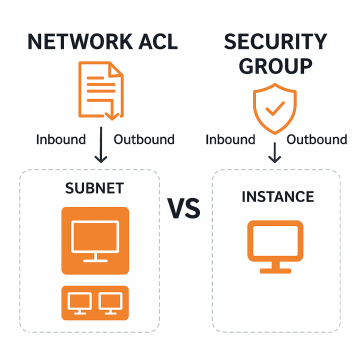
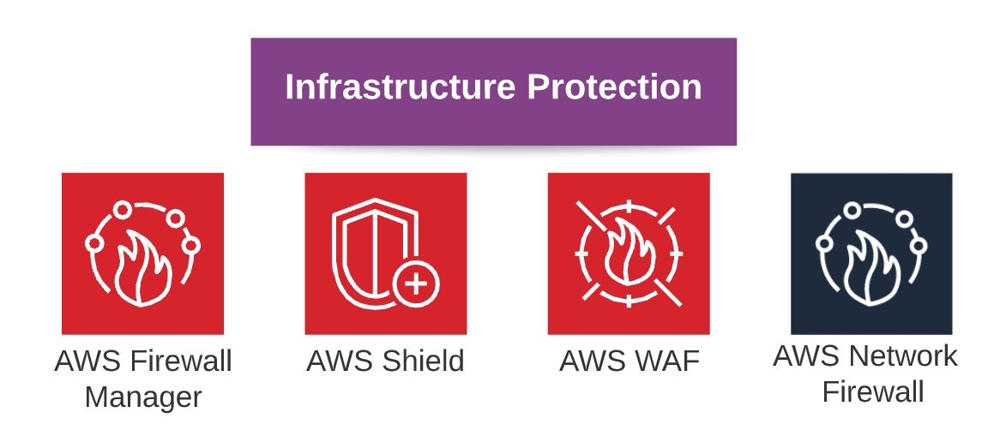

# Concept 2: Bảo mật Mạng - Security Groups & NACLs

Trong AWS, bảo mật mạng được thiết kế theo mô hình **"Phòng thủ đa lớp" (Layered Defense)**. Hai "người gác cổng" chính mà bạn đã học là **Security Groups (SG)** và **Network Access Control Lists (NACLs)**

  

## 1. Bảng so sánh nhanh (Quick Summary)

| Đặc điểm | Security Group (SG) | Network ACL (NACL) |
| :--- | :--- | :--- |
| **Cấp độ bảo vệ** | **Instance Level** (gắn vào EC2, RDS...) | **Subnet Level** (gắn vào dải mạng) |
| **Trạng thái** | **Stateful** (Có trạng thái) | **Stateless** (Không trạng thái) |
| **Quy tắc** | Chỉ có luật **Allow** (Cho phép) | Hỗ trợ cả **Allow** và **Deny** |
| **Thứ tự xét** | Kiểm tra tất cả các luật | Xét theo **Rule Number** (thấp đến cao) |
| **Áp dụng** | Chỉ áp dụng nếu được gán | Áp dụng cho mọi tài nguyên trong Subnet |

---

## 2. Security Groups (SG) - Tường lửa cấp Instance

Security Group hoạt động như một tường lửa ảo kiểm soát lưu lượng đến và đi cho các thực thể tính toán.

### 2.1 Đặc điểm cốt lõi
* **Stateful (Có trạng thái):** Đây là đặc điểm quan trọng nhất. Nếu bạn mở cổng 80 (Inbound) để cho phép người dùng vào web, thì luồng dữ liệu phản hồi (Outbound) sẽ **tự động được mở** để trả về cho người dùng đó, bất kể luật Outbound có quy định gì.
* **Mặc định:** * Mọi Inbound traffic bị **Chặn** (Deny).
    * Mọi Outbound traffic được **Cho phép** (Allow).
* **Đối tượng gán:** Card mạng ảo (Elastic Network Interface - ENI).

---

## 3. Network Access Control Lists (NACL) - Tường lửa cấp Subnet

NACL là lớp bảo mật bổ sung cho VPC, hoạt động ở cấp độ mạng để kiểm soát lưu lượng ra vào toàn bộ Subnet.

### 3.1 Đặc điểm cốt lõi
* **Stateless (Không trạng thái):** NACL không ghi nhớ các kết nối. Nếu bạn cho phép cổng 80 đi vào (Inbound), bạn **BẮT BUỘC** phải mở tay cổng tương ứng ở phần Outbound (thường là dải cổng Ephemeral 1024-65535) để dữ liệu có thể đi ra.
* **Thứ tự ưu tiên:** Các luật được đánh số (vd: 100, 200, 300). AWS sẽ kiểm tra từ số nhỏ nhất. Nếu luật 100 đã khớp, các luật sau sẽ bị bỏ qua.
* **Luật Deny:** NACL cho phép bạn chặn đích danh một địa chỉ IP cụ thể (Blacklist IP), điều mà Security Group không làm được.

---

## 4. Mô hình phối hợp: "Phòng thủ chiều sâu"

Hãy tưởng tượng hệ thống của bạn như một tòa nhà văn phòng:
1. **VPC:** Là hàng rào bao quanh cả khu đất.
2. **NACL:** Là **Cổng bảo vệ** ngoài cùng của tầng hầm (Subnet). Ai muốn vào khu vực này đều phải qua máy quét ở cổng.
3. **Security Group:** Là **Cửa khóa vân tay** của từng căn phòng (Instance). Chỉ những người có chìa khóa riêng mới được vào phòng đó.

### Luồng đi của một gói tin (Packet):
**Chiều vào (Inbound):**
Internet ➡️ Internet Gateway ➡️ **NACL (Subnet)** ➡️ **Security Group (Instance)** ➡️ EC2.

**Chiều ra (Outbound):**
EC2 ➡️ **Security Group (Tự động mở)** ➡️ **NACL (Phải có luật mở)** ➡️ Internet Gateway ➡️ Internet.

---
## 5. Infrastucture as Code (IaC)

  

---

## 6. AWS WAF (Web Application Firewall)
* **Vị trí bảo vệ:** Tầng ứng dụng (**Layer 7** trong mô hình OSI).
* **Cách hoạt động:** Cho phép bạn tạo các quy tắc (Rules) để lọc lưu lượng dựa trên IP, tiêu đề HTTP (Headers), chuỗi truy vấn (Body).
* **Chống lại các lỗi phổ biến:**
    * **SQL Injection:** Ngăn chặn mã độc can thiệp vào cơ sở dữ liệu.
    * **Cross-site Scripting (XSS):** Chặn các script độc hại thực thi trên trình duyệt người dùng.
* **Tích hợp:** Amazon CloudFront, Application Load Balancer (ALB), Amazon API Gateway.

---

## 7. AWS Shield (Bảo vệ DDoS)
Dịch vụ được thiết kế chuyên biệt để chống lại các cuộc tấn công từ chối dịch vụ (DDoS).

* **Shield Standard:** * **Miễn phí** cho mọi khách hàng AWS.
    * Bảo vệ tự động trước các cuộc tấn công phổ biến nhất ở tầng mạng (Layer 3) và tầng vận chuyển (Layer 4).
* **Shield Advanced:** * Dịch vụ **trả phí** (có cam kết chi phí cao).
    * Cung cấp khả năng bảo vệ nâng cao ở tầng ứng dụng (Layer 7).
    * Hỗ trợ 24/7 từ Đội phản ứng nhanh DDoS (DRT).
    * Có bảo hiểm chi phí (không phải trả thêm tiền nếu tài nguyên tự động mở rộng do bị tấn công).

---

## 8. Amazon GuardDuty (Phát hiện mối đe dọa thông minh)
GuardDuty giống như một "thám tử" liên tục giám sát tài khoản của bạn.

* **Bản chất:** Dịch vụ phát hiện mối đe dọa (Threat Detection) sử dụng **Machine Learning**.
* **Nguồn dữ liệu đầu vào:** GuardDuty tự động phân tích:
    * **VPC Flow Logs:** Các luồng giao tiếp mạng.
    * **AWS CloudTrail:** Các hoạt động gọi API trong tài khoản.
    * **DNS Logs:** Các truy vấn tên miền.
* **Khả năng:** Phát hiện các dấu hiệu máy chủ bị chiếm quyền điều khiển (Crypto-mining), tấn công brute force, hoặc hành vi đăng nhập bất thường.

---

## 9. AWS KMS (Key Management Service)
Dịch vụ giúp bạn tạo và quản lý các khóa mã hóa (Encryption Keys) để bảo vệ dữ liệu.

* **Bản chất:** Quản lý tập trung các **Customer Master Keys (CMKs)**.
* **Mã hóa phong bì (Envelope Encryption):** KMS sử dụng một khóa chính (Master Key) để mã hóa khóa dữ liệu (Data Key), sau đó dùng Data Key này để mã hóa dữ liệu thực tế.
* **Tích hợp:** Hầu hết các dịch vụ lưu trữ của AWS (S3, EBS, RDS) đều tích hợp sẵn với KMS. Bạn chỉ cần chọn "Enable Encryption" và chọn khóa KMS tương ứng.
* **Tính tuân thủ:** KMS sử dụng thiết bị phần cứng (Hardware Security Modules - HSM) đạt chuẩn **FIPS 140-2 Level 2** để lưu giữ khóa, đảm bảo không ai (kể cả nhân viên AWS) có thể đọc được khóa của bạn.

