# AWS Network Connectivity Options

---

## 1. Overview & The "Why"

**AWS Network Connectivity Options** là tập hợp các dịch vụ và kiến trúc mạng giúp kết nối các tài nguyên AWS với nhau, giữa các VPC, giữa các Region, và giữa AWS Cloud với hạ tầng on-premises truyền thống.

### Vấn đề thực tế

Trong môi trường doanh nghiệp hiện đại, các tổ chức thường phải đối mặt với:

- **Kiến trúc phân tán phức tạp**: Ứng dụng được triển khai trên nhiều VPC, nhiều Region, và cả on-premises
- **Nhu cầu kết nối Hybrid Cloud**: Cần kết nối liền mạch giữa data center truyền thống và AWS Cloud
- **Yêu cầu High Availability**: Tránh gián đoạn dịch vụ do lỗi mạng
- **Quản lý routing phức tạp**: Hàng chục/hàng trăm VPC peering connections gây khó khăn trong vận hành
- **Tối ưu hiệu năng**: Giảm latency, tăng throughput cho người dùng toàn cầu

AWS Network Connectivity Options cung cấp các công cụ để giải quyết những thách thức này một cách có hệ thống và mở rộng quy mô.

### **Analogy: Hệ thống Giao thông Đô thị Thông minh**

Hãy tưởng tượng AWS như một thành phố lớn:

- **VPC** = Các khu phố/quận riêng biệt với hàng rào an ninh
- **Subnets** = Các khu dân cư trong quận
- **VPC Peering** = Cầu trực tiếp nối 2 quận (point-to-point)
- **AWS Transit Gateway** = Nút giao thông trung tâm (hub) như bến xe bus trung tâm, tất cả các quận đều kết nối vào đây thay vì xây cầu riêng lẻ
- **Direct Connect** = Đường cao tốc riêng biệt, chuyên dụng từ văn phòng công ty đến AWS (không qua Internet công cộng)
- **Site-to-Site VPN** = Đường hầm an toàn qua đường công cộng (mã hóa)
- **Internet Gateway** = Cổng ra vào thành phố từ đường công cộng

Khi thành phố phát triển (scaling), thay vì xây hàng trăm cây cầu giữa các quận (mesh architecture), bạn xây một trung tâm giao thông hiện đại (Transit Gateway) để quản lý tập trung.

---

## 2. Core Components & Keywords

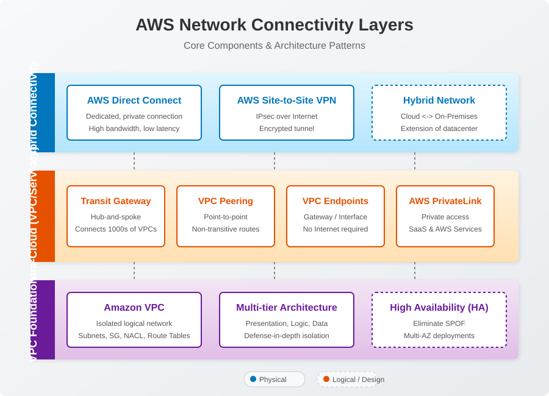

> **Mục đích sơ đồ:** Trực quan hóa các thành phần mạng AWS chia thành 3 lớp phân tầng từ nền tảng (VPC Foundation), kết nối nội bộ đám mây (Intra-Cloud) đến môi trường lai (Hybrid Connectivity).

### **Multi-tier Architecture**

Phân chia ứng dụng thành các tầng chức năng riêng biệt (thường là 3 tầng):

- **Presentation Tier**: Giao diện người dùng (UI)
- **Application/Logic Tier**: Xử lý business logic
- **Data Tier**: Lưu trữ và quản lý dữ liệu

> **Mục đích**: Tăng tính bảo mật bằng cách tạo các lớp phòng thủ (defense-in-depth), cách ly tài nguyên nhạy cảm khỏi các điểm tiếp xúc bên ngoài.

### **Amazon VPC (Virtual Private Cloud)**

Mạng ảo logic được cách ly, cho phép khách hàng định nghĩa và kiểm soát hoàn toàn môi trường mạng của mình trong AWS Cloud (CIDR block, subnets, route tables, security groups, NACLs).

### **Multi-VPC Architecture**

Kiến trúc sử dụng nhiều VPC độc lập, mỗi VPC phục vụ một ứng dụng, môi trường (dev/staging/prod), hoặc đơn vị kinh doanh khác nhau. Các VPC có thể được kết nối qua VPC Peering, Transit Gateway, hoặc PrivateLink.

### **High Availability (HA)**

Thiết kế mạng nhằm giảm thiểu downtime và tránh mất kết nối giữa các endpoint. Đạt được bằng cách:

- Loại bỏ Single Points of Failure (SPOF)
- Triển khai các thành phần dự phòng (redundant components)
- Phân phối tải (load distribution)

### **Hybrid Network**

Kiến trúc kết nối giữa ít nhất hai môi trường độc lập (ví dụ: AWS Cloud + On-premises data center), cho phép các dịch vụ giao tiếp với nhau như trong mạng truyền thống.

### **AWS Transit Gateway**

Dịch vụ hub trung tâm giúp kết nối hàng nghìn VPC và mạng on-premises thông qua một điểm kết nối duy nhất. Đơn giản hóa routing và quản lý mạng quy mô lớn.

### **VPC Peering**

Kết nối point-to-point giữa hai VPC, cho phép routing traffic trực tiếp thông qua địa chỉ IP private. **Non-transitive**: VPC A peering VPC B, VPC B peering VPC C → VPC A KHÔNG thể giao tiếp với VPC C qua B.

### **AWS Direct Connect**

Kết nối mạng chuyên dụng (dedicated network connection) từ on-premises đến AWS, không qua Internet công cộng. Cung cấp băng thông cao, latency thấp, và bảo mật hơn.

### **AWS Site-to-Site VPN**

Kết nối IPsec VPN được mã hóa giữa mạng on-premises và AWS VPC qua Internet công cộng.

### **AWS PrivateLink**

Dịch vụ cung cấp kết nối private, bảo mật giữa VPC, AWS services, và các ứng dụng on-premises mà không cần Internet Gateway, NAT, VPC Peering.

### **VPC Endpoints**

Cho phép kết nối private từ VPC đến các AWS services mà không cần đi qua Internet. Có 2 loại:

- **Gateway Endpoints**: S3, DynamoDB
- **Interface Endpoints**: Powered by PrivateLink, hỗ trợ hầu hết AWS services khác

### **Route Propagation**

Tính năng tự động cập nhật route tables với các routes được quảng bá từ Virtual Private Gateway (VGW) hoặc Transit Gateway, thay vì cấu hình thủ công.

---

## 3. Visual Theory & Architecture

### 3.1. Multi-tier Architecture trong AWS VPC

> **Mục đích sơ đồ:** Minh họa kiến trúc 3 tầng (Web, App, Data) tiêu chuẩn bên trong một VPC. Biểu diễn cách kiểm soát mức độ bảo mật thông qua việc cô lập từng nhóm tài nguyên tại các Subnet Public và Private riêng biệt.

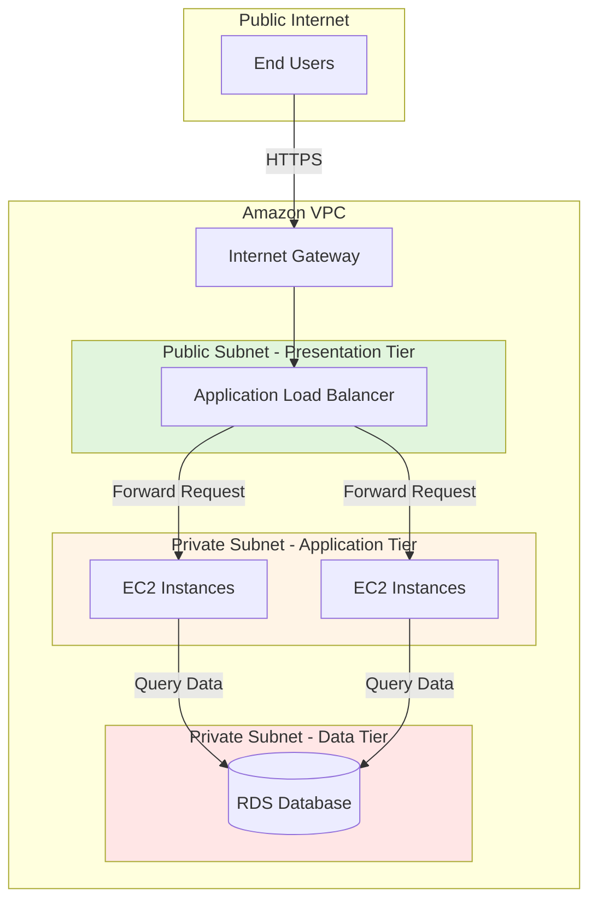

**Diagram Explanation:**

1. **Layer 1 - Presentation Tier (Public Subnet)**: End users truy cập ứng dụng qua Internet → Internet Gateway → Application Load Balancer đặt trong Public Subnet. ALB là điểm tiếp xúc duy nhất với Internet.

2. **Layer 2 - Application Tier (Private Subnet)**: ALB forward request đến các EC2 instances trong Private Subnet. Các instances này KHÔNG có IP public, không thể truy cập trực tiếp từ Internet → tăng bảo mật.

3. **Layer 3 - Data Tier (Private Subnet isolated)**: EC2 instances truy vấn database (RDS) nằm trong Private Subnet riêng biệt. Database hoàn toàn cách ly với Internet, chỉ nhận kết nối từ Application Tier.

> **Security Benefit**: Kẻ tấn công phải vượt qua 2 lớp phòng thủ (ALB + EC2) trước khi tiếp cận dữ liệu nhạy cảm.

---

### 3.2. VPC Peering vs Transit Gateway

#### **Vấn đề: Mesh Architecture với VPC Peering**

Giả sử có **9 VPCs** cần kết nối với nhau:

- **VPC Peering**: Cần tạo **36 peering connections** (công thức: n*(n-1)/2 = 9*8/2 = 36)
- Mỗi VPC cần duy trì **8 routing configurations** riêng biệt
- Tổng **72 routing entries** cần quản lý

> **Mục đích sơ đồ:** Biểu diễn vấn đề giao tiếp phức tạp trong kiến trúc Mesh. Khi số lượng VPC tăng lên, việc cấu hình VPC Peering chéo nhau (Point-to-Point) sẽ trở nên rườm rà, khó vận hành và theo dõi.

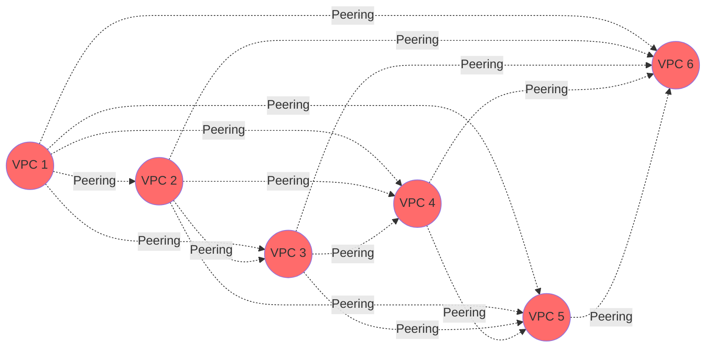

#### **Giải pháp: Hub-and-Spoke với Transit Gateway**

> **Mục đích sơ đồ:** Minh họa sức mạnh của Transit Gateway trong kiến trúc Hub-and-Spoke. TGW đóng vai trò là hub trung tâm để kết nối gọn gàng nhiều VPCs và trung tâm dữ liệu On-Premises, giảm triệt để số lượng đường truyền so với Mesh.

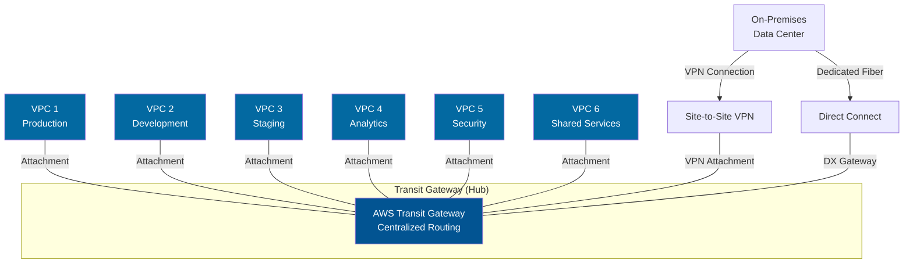

**Diagram Explanation:**

1. **Centralized Hub**: Transit Gateway đóng vai trò hub trung tâm, tất cả VPCs attach vào TGW thay vì peer trực tiếp với nhau.

2. **Simplified Routing**: Chỉ cần **6 attachments** (thay vì 15 peering connections cho 6 VPCs). Routing được quản lý tập trung tại TGW.

3. **Hybrid Integration**: On-premises data center kết nối vào TGW qua VPN hoặc Direct Connect. Tất cả VPCs tự động có khả năng giao tiếp với on-premises mà không cần cấu hình riêng lẻ.

4. **Scalability**: Thêm VPC mới chỉ cần 1 attachment, không cần tạo peering với tất cả VPC hiện có.

> **Operational Benefit**: Giảm 83% số lượng connections cần quản lý (6 attachments vs 36 peerings cho 9 VPCs).

---

### 3.3. High Availability Hybrid Network Architecture

> **Mục đích sơ đồ:** Trình bày mô hình thiết kế Mạng Lai (Hybrid) với tính sẵn sàng cao (High Availability). Thể hiện cách định tuyến Active-Active hoặc Active-Passive qua 2 đường Direct Connect và thiết lập VPN làm kênh dự phòng (Failover) để tránh lỗi một điểm (SPOF).

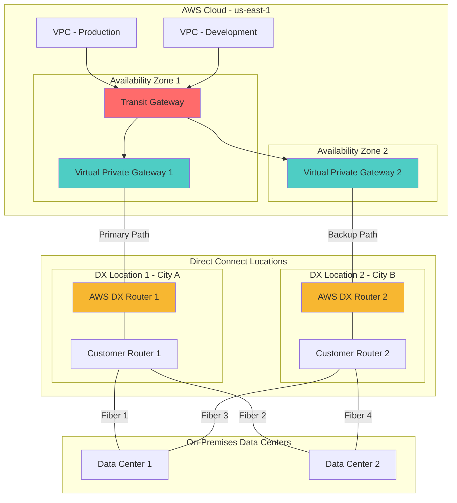

**Diagram Explanation - Eliminating Single Points of Failure:**

1. **Multiple Direct Connect Locations**: 2 DX locations riêng biệt ở 2 thành phố khác nhau → nếu 1 location gặp sự cố (thiên tai, mất điện), location còn lại vẫn hoạt động.

2. **Redundant Customer Routers**: Mỗi DX location có router riêng → nếu 1 router hỏng, traffic tự động failover sang router còn lại.

3. **Dual Virtual Private Gateways**: 2 VGWs được deploy ở 2 AZ khác nhau → nếu 1 AZ gặp sự cố, AZ còn lại vẫn duy trì kết nối.

4. **Multiple Physical Circuits**: 4 fiber connections từ 2 data centers đến 2 DX locations → ngay cả khi 1-2 circuits bị đứt, vẫn còn đường dự phòng.

5. **BGP Automatic Failover**: Sử dụng BGP routing protocol để tự động phát hiện failure và chuyển traffic sang đường dự phòng trong vài giây.

> **HA Result**: Đạt được 99.99% uptime SLA bằng cách loại bỏ mọi điểm lỗi đơn lẻ trong kiến trúc.

---

### 3.4. Inter-Regional Transit Gateway Peering

> **Mục đích sơ đồ:** Minh họa khả năng kết nối mạng toàn cầu. Sơ đồ cho thấy cách kết nối hai Transit Gateways nằm ở hai vùnh (Regions) địa lý riêng biệt để tạo ra một mạng lưới hợp nhất thống nhất xuyên biên giới.

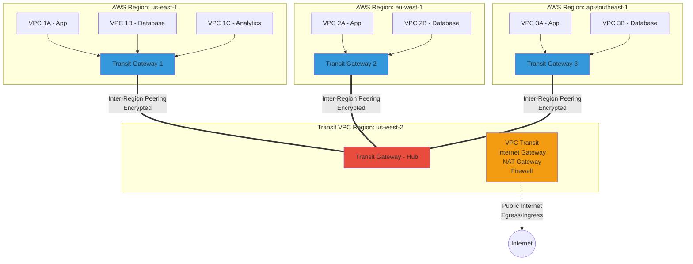

**Diagram Explanation - Global Multi-Region Architecture:**

1. **Regional Transit Gateways**: Mỗi Region có TGW riêng quản lý routing cho các VPCs trong Region đó.

2. **Transit VPC - Central Internet Gateway**: Region us-west-2 được chỉ định làm Transit VPC, chứa Internet Gateway, NAT Gateway, và tường lửa tập trung. Tất cả traffic public đi ra/vào AWS environment phải đi qua đây.

3. **Inter-Region Peering Connections**: 3 peering connections từ TGW của mỗi Region đến Transit TGW. Traffic được **mã hóa tự động** và **không rời khỏi AWS backbone** (không qua Internet công cộng).

4. **Non-Transitive Routing**: Transit Gateway peering là **non-transitive**. VPC ở Region 1 KHÔNG thể giao tiếp trực tiếp với VPC ở Region 2 qua Transit VPC. Để làm được điều này, cần tạo mesh peering giữa TGW1 ↔ TGW2 ↔ TGW3.

5. **Centralized Security Controls**: Tất cả traffic public được kiểm tra tại Transit VPC trước khi ra Internet → dễ dàng áp dụng security policies, DDoS protection, inspection.

> **Global Routing**: Traffic giữa các Region được route tối ưu qua AWS global network với latency thấp và băng thông cao.

---

### 3.5. Cross-Regional High Availability with Route 53

> **Mục đích sơ đồ:** Diễn giải trình tự (Sequence) chuyển hướng linh hoạt của Amazon Route 53. Khi khu vực (Region) chính gặp sự cố (Failover), luồng truy cập của người dùng được tự động chuyển hướng sang khu vực dự phòng.

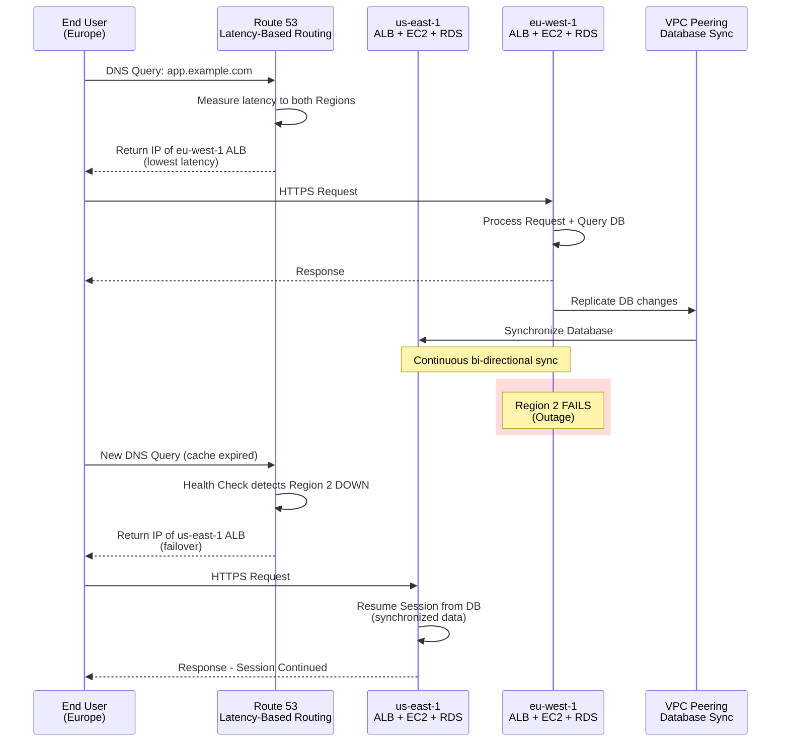

**Diagram Explanation - Disaster Recovery & Global Performance:**

1. **Latency-Based Routing**: Route 53 đo latency từ user location đến mỗi Region và route user đến Region gần nhất → giảm response time.

2. **Database Synchronization**: RDS databases ở 2 Regions liên tục đồng bộ hóa qua VPC Peering connection → user session data có sẵn ở cả 2 Regions.

3. **Automatic Failover**: Khi Region 2 gặp sự cố:
   - Route 53 health checks phát hiện failure
   - DNS resolution tự động chuyển sang Region 1
   - User reconnect và tiếp tục session mà không mất dữ liệu (vì DB đã được sync)

4. **Multi-Region Active-Active**: Cả 2 Regions đều chạy ứng dụng đồng thời (active-active), không phải active-standby → tối ưu sử dụng tài nguyên.

> **Business Continuity**: Đảm bảo RPO (Recovery Point Objective) < 1 phút và RTO (Recovery Time Objective) < 5 phút.

---

## 4. Detailed Deep Dive

### 4.1. VPC Peering

#### **Đặc điểm kỹ thuật**

| Đặc điểm                  | Chi tiết                                                                    |
| ------------------------- | --------------------------------------------------------------------------- |
| **Connection Type**       | Point-to-point, 1:1 mapping                                                 |
| **Transitivity**          | **Non-transitive** (VPC A ↔ VPC B ↔ VPC C → A không thể nói chuyện với C)   |
| **IP Address Space**      | CIDR blocks của 2 VPCs **KHÔNG được overlap**                               |
| **Cross-Region Support**  | ✅ Có, Inter-Region VPC Peering                                             |
| **Cross-Account Support** | ✅ Có, hỗ trợ peering giữa các AWS accounts khác nhau                       |
| **Encryption**            | ✅ Tự động mã hóa cho Inter-Region peering                                  |
| **Bandwidth**             | Không giới hạn, phụ thuộc vào instance type                                 |
| **Pricing**               | Miễn phí trong cùng AZ, tính phí data transfer cho cross-AZ và cross-Region |

#### **Use Cases**

1. **Shared Services VPC**: Kết nối Production VPC với Shared Services VPC (Active Directory, DNS, monitoring tools)
2. **Development Environment Isolation**: Peering Development VPC với Shared Database VPC, tách biệt khỏi Production
3. **Partner Integration**: Peering với VPC của đối tác/vendor để chia sẻ dữ liệu an toàn

#### **Limitations**

- Maximum **125 peering connections** per VPC
- Không hỗ trợ **transitive routing** → cần full mesh topology cho N VPCs (N\*(N-1)/2 peerings)
- Không thể sử dụng edge-to-edge routing (ví dụ: VPC A không thể route qua VPC B để đến Internet Gateway của B)

---

### 4.2. AWS Transit Gateway

#### **Core Features**

| Feature            | Mô tả                                                                                       |
| ------------------ | ------------------------------------------------------------------------------------------- |
| **Attachments**    | VPC, VPN, Direct Connect Gateway, Transit Gateway Peering, Connect (SD-WAN)                 |
| **Route Tables**   | Hỗ trợ multiple route tables cho traffic segmentation (ví dụ: Production vs Non-Production) |
| **Bandwidth**      | Up to **50 Gbps per VPC attachment**, **5 Gbps per VPN attachment**                         |
| **MTU**            | 8500 bytes (Jumbo frames) cho VPC attachments                                               |
| **Multicast**      | ✅ Hỗ trợ multicast routing                                                                 |
| **Appliance Mode** | ✅ Hỗ trợ routing qua network appliances (firewalls, IDS/IPS)                               |

#### **Transit Gateway Route Tables - Advanced Segmentation**

Transit Gateway hỗ trợ **multiple route tables**, cho phép tạo các isolated routing domains:

**Scenario**: Tách biệt Production traffic khỏi Development traffic

- **Production Route Table**: Chỉ cho phép Production VPCs và On-Premises giao tiếp với nhau
- **Development Route Table**: Chỉ cho phép Dev/Test VPCs giao tiếp với nhau, KHÔNG thể access Production

```
Transit Gateway
├── Route Table: Production
│   ├── Attachments: VPC-Prod-1, VPC-Prod-2, DX-Gateway
│   └── Routes: 10.0.0.0/8 → VPC-Prod, 192.168.0.0/16 → On-Prem
│
└── Route Table: Development
    ├── Attachments: VPC-Dev-1, VPC-Dev-2, VPN
    └── Routes: 172.16.0.0/12 → VPC-Dev
```

#### **Transit Gateway Connect (SD-WAN Integration)**

Hỗ trợ kết nối với SD-WAN appliances qua **GRE tunnel** và **BGP routing**:

- Bandwidth: Up to 5 Gbps per tunnel
- Protocol: GRE encapsulation + BGP peering
- Use case: Tích hợp với Cisco SD-WAN, VMware SD-WAN, Silver Peak

---

### 4.3. AWS Direct Connect

#### **Connection Types**

| Type                     | Bandwidth Options         | Lead Time | Use Case                                         |
| ------------------------ | ------------------------- | --------- | ------------------------------------------------ |
| **Dedicated Connection** | 1 Gbps, 10 Gbps, 100 Gbps | 2-4 weeks | Production workloads, large data transfers       |
| **Hosted Connection**    | 50 Mbps - 10 Gbps         | 1-2 weeks | Smaller workloads, PoC, cost-sensitive scenarios |

#### **Virtual Interfaces (VIFs)**

Direct Connect sử dụng **Virtual Interfaces** để phân loại traffic:

1. **Private VIF**:
   - Kết nối đến VPC qua Virtual Private Gateway (VGW) hoặc Direct Connect Gateway
   - Traffic: Private IP, không ra Internet
   - Use case: Truy cập EC2, RDS, nội bộ resources

2. **Public VIF**:
   - Kết nối đến AWS Public Services (S3, DynamoDB, EC2 public APIs)
   - Traffic: Public IP addresses
   - Use case: Upload/download S3 objects, API calls

3. **Transit VIF**:
   - Kết nối đến Transit Gateway qua Direct Connect Gateway
   - Bandwidth: Up to 50 Gbps per Transit VIF
   - Use case: Kết nối nhiều VPCs/Regions qua 1 Direct Connect

#### **Direct Connect Gateway**

Cho phép kết nối **1 Direct Connect** đến **nhiều VPCs** ở **nhiều Regions**:

- Maximum: **10 Virtual Private Gateways** per Direct Connect Gateway
- Maximum: **20 Transit Gateways** per Direct Connect Gateway (khi dùng Transit VIF)
- Benefit: Không cần tạo riêng Direct Connect cho từng Region

#### **LAG (Link Aggregation Group)**

Gộp nhiều connections thành 1 logical connection:

- Maximum: **4 connections** per LAG
- Bandwidth: Tổng bandwidth của các connections (ví dụ: 4 x 10 Gbps = 40 Gbps)
- Requirement: Tất cả connections phải cùng bandwidth và terminate tại cùng Direct Connect location

#### **Resilient Direct Connect Architecture**

AWS khuyến nghị **dual Direct Connect setup**:

```
On-Premises
├── Router 1 → DX Location A → DX Connection 1 → AWS Region (VGW 1)
└── Router 2 → DX Location B → DX Connection 2 → AWS Region (VGW 2)
```

- **SLA**: AWS SLA chỉ áp dụng từ AWS Router, không cover customer router và fiber circuits
- **Recommendation**: Sử dụng 2 DX locations khác nhau + 2 customer routers để đạt 99.99% availability

---

### 4.4. AWS Site-to-Site VPN

#### **VPN Connection Components**

| Component                         | Mô tả                                                        |
| --------------------------------- | ------------------------------------------------------------ |
| **Virtual Private Gateway (VGW)** | AWS-side VPN endpoint, attach vào VPC                        |
| **Customer Gateway (CGW)**        | On-premises VPN device (physical hoặc software)              |
| **VPN Tunnel**                    | IPsec encrypted tunnel, mỗi VPN connection có 2 tunnels (HA) |

#### **VPN Tunnel Redundancy**

Mỗi VPN connection tự động tạo **2 tunnels** terminate ở 2 AZ khác nhau:

```
Customer Gateway (On-Prem)
├── Tunnel 1 → AWS VPN Endpoint (AZ-a)
└── Tunnel 2 → AWS VPN Endpoint (AZ-b)
```

> **Best Practice**: Cấu hình **BGP routing** để tự động failover giữa 2 tunnels. Nếu không dùng BGP, chỉ có 1 tunnel active tại 1 thời điểm (active/standby).

#### **VPN Performance**

| Metric                  | Value                                       |
| ----------------------- | ------------------------------------------- |
| **Bandwidth**           | Up to 1.25 Gbps per tunnel                  |
| **Aggregate Bandwidth** | Up to 2.5 Gbps (sử dụng ECMP với 2 tunnels) |
| **Latency**             | Cao hơn Direct Connect (qua Internet)       |
| **MTU**                 | 1400 bytes (do IPsec overhead)              |

#### **Accelerated Site-to-Site VPN**

Sử dụng **AWS Global Accelerator** để cải thiện performance:

- Traffic route qua AWS global network thay vì Internet
- Latency giảm up to 60%
- Pricing: +$0.05/hour per VPN connection

---

### 4.5. VPC Endpoints & AWS PrivateLink

#### **Gateway Endpoints (S3 & DynamoDB)**

| Đặc điểm               | Chi tiết                                   |
| ---------------------- | ------------------------------------------ |
| **Supported Services** | S3, DynamoDB only                          |
| **Routing**            | Sử dụng prefix lists trong route tables    |
| **Pricing**            | **Miễn phí**                               |
| **Availability**       | Regional service, tự động highly available |

**Example Route Table Entry:**

```
Destination         Target
10.0.0.0/16         local
0.0.0.0/0           igw-xxxxx
pl-xxxxxx (S3)      vpce-xxxxx  ← Gateway Endpoint
```

#### **Interface Endpoints (PrivateLink)**

| Đặc điểm               | Chi tiết                                                      |
| ---------------------- | ------------------------------------------------------------- |
| **Supported Services** | 100+ AWS services (EC2, SNS, SQS, KMS, etc.) + 3rd party SaaS |
| **Implementation**     | Elastic Network Interface (ENI) với private IP trong subnet   |
| **DNS**                | Private DNS tự động resolve đến ENI IP                        |
| **Pricing**            | $0.01/hour + $0.01/GB data processed                          |
| **Availability**       | Deploy trong multiple AZs cho HA                              |

**Use Case - Accessing S3 from Private Subnet without NAT:**

> **Mục đích sơ đồ:** Minh họa cách một Gateway Endpoint (cho S3) cung cấp tuyến đường kết nối trực tiếp từ Private Subnet tới S3 qua mạng nội bộ AWS, giúp bảo mật hơn mà không cần qua NAT Gateway hay mạng Internet.

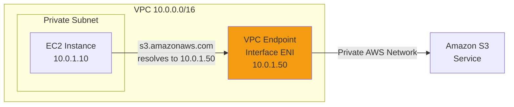

> **Security Benefit**: Traffic không rời VPC, không cần Internet Gateway hoặc NAT Gateway → giảm attack surface.

---

### 4.6. AWS PrivateLink for SaaS

#### **Architecture**

PrivateLink cho phép expose **private services** (ứng dụng của bạn) cho customers mà không cần VPC Peering:

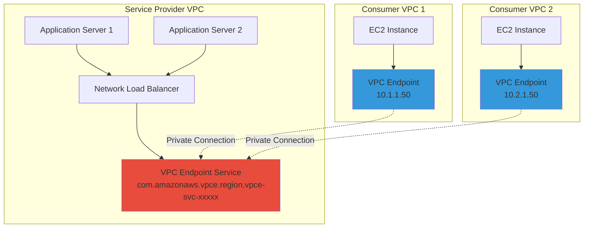

**Benefits for SaaS Providers:**

1. **No IP Overlap Issues**: Consumers không cần lo CIDR conflict với Provider
2. **Scalability**: Hàng nghìn customers có thể kết nối mà không cần peering
3. **Security**: Consumers không nhìn thấy kiến trúc nội bộ của Provider
4. **Compliance**: Traffic không rời AWS, đáp ứng yêu cầu data residency

---

## 5. Practical Scenarios & Integration

### 5.1. Scenario 1: Hub-and-Spoke Migration for Merged Company

#### **Business Context**

Công ty A sáp nhập với công ty B. Cả 2 đều có AWS footprint:

- Company A: 3 VPCs (Production, Staging, Development)
- Company B: 2 VPCs (Production, Analytics)
- Kết nối hiện tại: 10 VPC Peering connections + 3 Site-to-Site VPNs

**Problem Statement:**

- Configuration conflicts khi deploy hệ thống mới do routing phức tạp
- Downtime cao khi troubleshoot (trung bình 2 hours/incident)
- Không có centralized security monitoring
- Operational overhead: 3 network engineers fulltime để manage

#### **Solution Architecture**

Triển khai **Transit Gateway Hub-and-Spoke**:

```
Phase 1: Deploy Transit Gateway
├── Create Transit Gateway in us-east-1
├── Create 2 Route Tables: Production, Non-Production
└── Configure route propagation

Phase 2: Migrate VPCs
├── Attach VPC-A-Production → TGW (Production RT)
├── Attach VPC-A-Staging → TGW (Non-Production RT)
├── Attach VPC-A-Development → TGW (Non-Production RT)
├── Attach VPC-B-Production → TGW (Production RT)
└── Attach VPC-B-Analytics → TGW (Non-Production RT)

Phase 3: Consolidate VPN
├── Terminate existing 3 VPNs
├── Create 1 VPN attachment to TGW
└── Configure BGP for automatic failover

Phase 4: Remove VPC Peering
├── Test connectivity via TGW
├── Delete peering connections incrementally
└── Update route tables
```

#### **Results**

| Metric                   | Before                 | After                     | Improvement   |
| ------------------------ | ---------------------- | ------------------------- | ------------- |
| **Connections**          | 10 peerings + 3 VPNs   | 5 VPC attachments + 1 VPN | 62% reduction |
| **Routing Entries**      | 50+ routes distributed | 10 routes centralized     | 80% reduction |
| **Mean Time to Resolve** | 2 hours                | 20 minutes                | 83% faster    |
| **Operational Cost**     | 3 FTE engineers        | 1 FTE engineer            | 67% savings   |

#### **Infrastructure as Code (Terraform)**

```hcl
# Transit Gateway
resource "aws_ec2_transit_gateway" "main" {
  description                     = "Merged Company Hub TGW"
  default_route_table_association = "disable"
  default_route_table_propagation = "disable"

  tags = {
    Name = "hub-tgw-merged-company"
  }
}

# Production Route Table
resource "aws_ec2_transit_gateway_route_table" "production" {
  transit_gateway_id = aws_ec2_transit_gateway.main.id

  tags = {
    Name = "production-rt"
    Environment = "production"
  }
}

# VPC Attachment - Production
resource "aws_ec2_transit_gateway_vpc_attachment" "vpc_a_prod" {
  subnet_ids         = [aws_subnet.vpc_a_prod_subnet.id]
  transit_gateway_id = aws_ec2_transit_gateway.main.id
  vpc_id             = aws_vpc.vpc_a_production.id

  transit_gateway_default_route_table_association = false
  transit_gateway_default_route_table_propagation = false

  tags = {
    Name = "vpc-a-production-attachment"
  }
}

# Associate VPC Attachment with Production RT
resource "aws_ec2_transit_gateway_route_table_association" "vpc_a_prod_assoc" {
  transit_gateway_attachment_id  = aws_ec2_transit_gateway_vpc_attachment.vpc_a_prod.id
  transit_gateway_route_table_id = aws_ec2_transit_gateway_route_table.production.id
}

# VPN Attachment
resource "aws_vpn_connection" "on_prem" {
  customer_gateway_id = aws_customer_gateway.main.id
  transit_gateway_id  = aws_ec2_transit_gateway.main.id
  type                = "ipsec.1"

  static_routes_only = false  # Enable BGP

  tags = {
    Name = "on-prem-vpn-consolidated"
  }
}
```

---

### 5.2. Scenario 2: Privacy-by-Design Healthcare Platform

#### **Business Context**

Startup xây dựng nền tảng telemedicine (khám bệnh từ xa) phải tuân thủ:

- **HIPAA compliance**: Protected Health Information (PHI) không được traverse Internet
- **Data residency**: Patient data phải lưu trong US Region
- **Audit trail**: Log tất cả network traffic flows

#### **Solution Architecture - Zero Trust Network**

> **Mục đích sơ đồ:** Minh họa kiến trúc Zero Trust Endpoint, ngăn chặn hoàn toàn kết nối từ qua public internet bằng việc sử dụng Client VPN đi riêng lẻ tới Private Subnets nhằm bảo vệ dữ liệu siêu nhạy cảm.

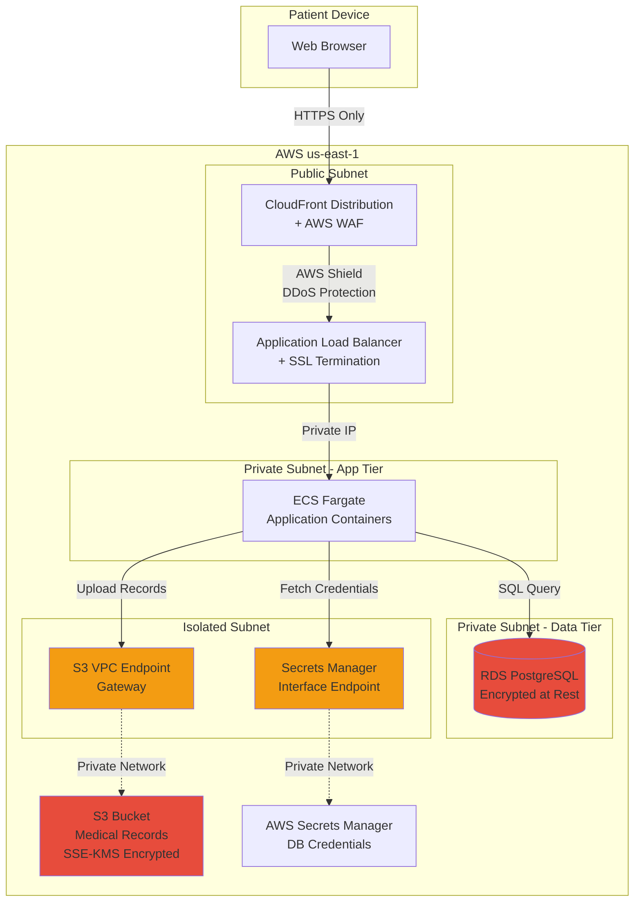

#### **Security Implementation Details**

1. **No Internet Access for Data Tier**:
   - RDS và S3 VPC Endpoint nằm trong subnets KHÔNG có route đến Internet Gateway
   - Sử dụng **VPC Flow Logs** để verify không có outbound traffic đến 0.0.0.0/0

2. **TLS Everywhere**:
   - CloudFront → ALB: TLS 1.3
   - ALB → ECS: TLS 1.2 (internal)
   - ECS → RDS: SSL/TLS enforced
   - S3: Bucket policy reject non-HTTPS requests

3. **Network Segmentation**:

```
Security Group: ALB-SG
├── Inbound: Port 443 from CloudFront IPs only
└── Outbound: Port 8080 to ECS-SG only

Security Group: ECS-SG
├── Inbound: Port 8080 from ALB-SG only
└── Outbound: Port 5432 to RDS-SG, Port 443 to VPCE-SG

Security Group: RDS-SG
├── Inbound: Port 5432 from ECS-SG only
└── Outbound: Deny all

Security Group: VPCE-SG
├── Inbound: Port 443 from ECS-SG only
└── Outbound: N/A (managed by AWS)
```

4. **Audit & Compliance**:
   - **VPC Flow Logs** → CloudWatch Logs → S3 (long-term storage)
   - **AWS Config Rules**: Monitor security group changes, encryption settings
   - **CloudTrail**: Log all API calls for S3, Secrets Manager, RDS
   - **AWS GuardDuty**: Detect unauthorized access attempts

#### **Terraform IaC Structure**

```
healthcare-platform/
├── main.tf                 # Provider, backend config
├── vpc.tf                  # VPC, subnets, route tables
├── security_groups.tf      # All SG definitions
├── alb.tf                  # ALB + Target Groups
├── ecs.tf                  # ECS cluster, task definitions
├── rds.tf                  # RDS instance, subnet group
├── s3.tf                   # S3 bucket + bucket policies
├── vpc_endpoints.tf        # S3, Secrets Manager endpoints
├── cloudfront.tf           # CloudFront distribution
├── monitoring.tf           # VPC Flow Logs, CloudWatch
└── variables.tf            # Input variables
```

**Key Terraform Snippet - S3 VPC Endpoint:**

```hcl
# S3 Gateway Endpoint
resource "aws_vpc_endpoint" "s3" {
  vpc_id       = aws_vpc.main.id
  service_name = "com.amazonaws.us-east-1.s3"

  route_table_ids = [
    aws_route_table.private_subnet_rt.id,
    aws_route_table.isolated_subnet_rt.id
  ]

  policy = jsonencode({
    Version = "2012-10-17"
    Statement = [
      {
        Effect    = "Allow"
        Principal = "*"
        Action    = "s3:*"
        Resource  = [
          aws_s3_bucket.medical_records.arn,
          "${aws_s3_bucket.medical_records.arn}/*"
        ]
      }
    ]
  })

  tags = {
    Name = "s3-gateway-endpoint-hipaa"
  }
}

# S3 Bucket Policy - Enforce VPC Endpoint + HTTPS
resource "aws_s3_bucket_policy" "medical_records_policy" {
  bucket = aws_s3_bucket.medical_records.id

  policy = jsonencode({
    Version = "2012-10-17"
    Statement = [
      {
        Sid       = "DenyNonVPCEndpointAccess"
        Effect    = "Deny"
        Principal = "*"
        Action    = "s3:*"
        Resource  = [
          aws_s3_bucket.medical_records.arn,
          "${aws_s3_bucket.medical_records.arn}/*"
        ]
        Condition = {
          StringNotEquals = {
            "aws:SourceVpce" = aws_vpc_endpoint.s3.id
          }
        }
      },
      {
        Sid       = "DenyInsecureTransport"
        Effect    = "Deny"
        Principal = "*"
        Action    = "s3:*"
        Resource  = [
          aws_s3_bucket.medical_records.arn,
          "${aws_s3_bucket.medical_records.arn}/*"
        ]
        Condition = {
          Bool = {
            "aws:SecureTransport" = "false"
          }
        }
      }
    ]
  })
}
```

---

### 5.3. Scenario 3: Real-Time Data Migration with Direct Connect

#### **Business Context**

Enterprise migrating **500 TB** on-premises Oracle database đến AWS Aurora PostgreSQL:

- **Downtime requirement**: < 4 hours
- **Data compliance**: Data must not traverse Internet
- **Network bandwidth**: On-prem has 10 Gbps capacity

#### **Solution Architecture**

> **Mục đích sơ đồ:** Biểu diễn giải pháp chuyển đổi và đồng bộ lượng dữ liệu lớn từ trung tâm dữ liệu cục bộ (On-premises) lên Cloud. Sử dụng kết hợp AWS Direct Connect (để có đường truyền băng thông lớn ổn định) nối đến VPC, sau đó chạy AWS DMS (Database Migration Service) để sao chép vào Amazon Aurora liên tục.

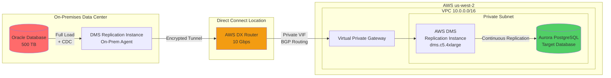

#### **Migration Phases**

**Phase 1: Direct Connect Setup (Week 1-2)**

```bash
# 1. Order 10 Gbps Dedicated Connection
# Lead time: 2-3 weeks (coordinate with AWS account team)

# 2. Create Virtual Private Gateway
aws ec2 create-vpn-gateway \
  --type ipsec.1 \
  --amazon-side-asn 64512

# 3. Attach VGW to VPC
aws ec2 attach-vpn-gateway \
  --vpn-gateway-id vgw-xxxxx \
  --vpc-id vpc-xxxxx

# 4. Create Private Virtual Interface
aws directconnect create-private-virtual-interface \
  --connection-id dxcon-xxxxx \
  --new-private-virtual-interface \
    virtualInterfaceName=Oracle-Migration-VIF,\
    vlan=100,\
    asn=65000,\
    addressFamily=ipv4,\
    virtualGatewayId=vgw-xxxxx
```

**Phase 2: AWS DMS Configuration (Week 3)**

```hcl
# DMS Replication Instance
resource "aws_dms_replication_instance" "migration" {
  replication_instance_id   = "oracle-to-aurora-migration"
  replication_instance_class = "dms.c5.4xlarge"  # 16 vCPU, 32 GB RAM
  allocated_storage         = 1000  # 1 TB for caching

  vpc_security_group_ids = [aws_security_group.dms_sg.id]
  replication_subnet_group_id = aws_dms_replication_subnet_group.main.id

  publicly_accessible = false
  multi_az            = true  # HA setup

  tags = {
    Name = "oracle-aurora-migration"
  }
}

# Source Endpoint - Oracle
resource "aws_dms_endpoint" "oracle_source" {
  endpoint_id   = "oracle-source"
  endpoint_type = "source"
  engine_name   = "oracle"

  server_name = "oracle.onprem.company.internal"
  port        = 1521
  database_name = "PRODDB"
  username      = "dms_user"
  password      = var.oracle_password

  extra_connection_attributes = "useLogminerReader=N;useBfile=Y"

  ssl_mode = "require"
}

# Target Endpoint - Aurora PostgreSQL
resource "aws_dms_endpoint" "aurora_target" {
  endpoint_id   = "aurora-target"
  endpoint_type = "target"
  engine_name   = "aurora-postgresql"

  server_name = aws_rds_cluster.aurora.endpoint
  port        = 5432
  database_name = "migrateddb"
  username      = "postgres"
  password      = var.aurora_password

  ssl_mode = "require"
}

# Migration Task - Full Load + CDC
resource "aws_dms_replication_task" "migration_task" {
  replication_task_id      = "oracle-to-aurora-full-cdc"
  migration_type           = "full-load-and-cdc"
  replication_instance_arn = aws_dms_replication_instance.migration.replication_instance_arn
  source_endpoint_arn      = aws_dms_endpoint.oracle_source.endpoint_arn
  target_endpoint_arn      = aws_dms_endpoint.aurora_target.endpoint_arn
  table_mappings           = file("table_mappings.json")

  replication_task_settings = jsonencode({
    TargetMetadata = {
      SupportLobs = true
      LobChunkSize = 64  # KB
      LimitedSizeLobMode = true
      LobMaxSize = 32  # MB
    }
    FullLoadSettings = {
      TargetTablePrepMode = "DROP_AND_CREATE"
      MaxFullLoadSubTasks = 8  # Parallel threads
    }
    ChangeProcessingTuning = {
      BatchApplyEnabled = true
      BatchApplyTimeoutMin = 1
      BatchApplyTimeoutMax = 30
    }
  })
}
```

**Phase 3: Migration Execution (Week 4)**

```
Day 1-3: Full Load (500 TB)
├── Expected duration: ~46 hours at 10 Gbps
│   └── Calculation: 500 TB * 8 / 10 Gbps / 3600 = 111 hours theoretical
│       └── Actual with DMS overhead: ~46 hours (compression + dedup)
├── Monitor DMS CloudWatch metrics
└── Validate row counts: SELECT COUNT(*) on critical tables

Day 4-6: CDC (Change Data Capture)
├── Oracle → DMS captures transaction logs
├── DMS → Aurora applies changes in near real-time
├── Lag: Monitor "CDCLatencySource" and "CDCLatencyTarget" metrics
└── Target: Keep lag < 60 seconds

Day 7: Cutover Window (4 hours)
├── Hour 1: Stop application writes to Oracle
├── Hour 2: Wait for CDC lag to reach 0
├── Hour 3: Data validation + Testing
└── Hour 4: Redirect application to Aurora + Go-live
```

#### **Network Performance Tuning**

```bash
# On-Premises: Linux Kernel Tuning
cat << EOF >> /etc/sysctl.conf
# Increase TCP window sizes for high-bandwidth, high-latency networks
net.core.rmem_max = 134217728
net.core.wmem_max = 134217728
net.ipv4.tcp_rmem = 4096 87380 67108864
net.ipv4.tcp_wmem = 4096 65536 67108864

# Enable TCP window scaling
net.ipv4.tcp_window_scaling = 1

# Increase max number of packets in flight
net.ipv4.tcp_congestion_control = htcp
EOF

sysctl -p

# Verify Direct Connect Throughput
iperf3 -c <aurora-private-ip> -t 300 -P 8  # 8 parallel streams, 5 min test
```

#### **Cost Analysis**

| Component                 | Cost            | Duration             | Total       |
| ------------------------- | --------------- | -------------------- | ----------- |
| Direct Connect 10 Gbps    | $2,190/month    | 1 month              | $2,190      |
| DMS c5.4xlarge (Multi-AZ) | $1.632/hour x 2 | 168 hours (7 days)   | $548        |
| Data Transfer Out (DX)    | $0.02/GB        | 500 TB               | $10,240     |
| Aurora Storage            | $0.10/GB        | 500 GB (first month) | $50         |
| **Total Migration Cost**  |                 |                      | **$13,028** |

> **Alternative (Internet-based)**: Snowball Edge (100 TB x 5 devices) = $1,500 + shipping + 2 weeks delay. Direct Connect = faster, more secure, lower risk.

---

## 6. Exam Essentials & Pro Tips

### 6.1. Common Exam Traps

#### **Trap 1: VPC Peering Transitivity**

❌ **Incorrect Assumption**: "VPC A peers with VPC B, VPC B peers with VPC C → VPC A can talk to VPC C"

✅ **Reality**: VPC Peering is **NON-TRANSITIVE**. Cần tạo peering trực tiếp A ↔ C.

**Exam Question Example:**

> You have 3 VPCs: VPC-A (10.0.0.0/16), VPC-B (10.1.0.0/16), VPC-C (10.2.0.0/16). VPC-A peers with VPC-B, VPC-B peers with VPC-C. An EC2 instance in VPC-A (10.0.1.10) cannot ping an EC2 instance in VPC-C (10.2.1.10). What is the issue?

**Answer:** VPC Peering does not support transitive routing. Create a direct peering connection between VPC-A and VPC-C.

---

#### **Trap 2: Direct Connect vs VPN Bandwidth**

❌ **Incorrect**: "VPN is always slower than Direct Connect"

✅ **Nuance**:

- **Site-to-Site VPN**: Up to **1.25 Gbps per tunnel**, **2.5 Gbps aggregate** (ECMP)
- **Direct Connect**: Dedicated bandwidth (1/10/100 Gbps), nhưng cần **LAG** để exceed single connection limit

**Exam Question Example:**

> A company needs 5 Gbps bandwidth from on-premises to AWS with encryption. Which option is MOST cost-effective?

**Correct Answer:** Use **Direct Connect 10 Gbps + MACsec encryption** OR **2x Direct Connect 10 Gbps in LAG** (không phải VPN vì VPN max 2.5 Gbps).

---

#### **Trap 3: VPC Endpoint Types**

❌ **Confusion**: "Tất cả AWS services đều dùng Gateway Endpoint"

✅ **Reality**:

- **Gateway Endpoints**: Chỉ S3 và DynamoDB
- **Interface Endpoints (PrivateLink)**: Tất cả services khác (EC2, SNS, SQS, Lambda, v.v.)

**Exam Question Example:**

> You want to access Amazon SQS from a private subnet without Internet Gateway. What should you create?

**Answer:** Create an **Interface VPC Endpoint** for SQS (not Gateway Endpoint).

---

#### **Trap 4: Transit Gateway Route Propagation**

❌ **Assumption**: "Bật route propagation là đủ, không cần configure thêm gì"

✅ **Reality**:

- Route propagation chỉ **tự động thêm routes từ VGW/TGW vào route table**
- Vẫn cần **manually configure route table associations** cho mỗi VPC attachment

**Exam Question Example:**

> After attaching 5 VPCs to Transit Gateway and enabling route propagation, VPCs still cannot communicate. What is missing?

**Answer:** Associate each VPC attachment with the Transit Gateway route table and ensure propagation is enabled **in both directions**.

---

### 6.2. Cost Optimization Best Practices

#### **1. VPC Peering Data Transfer Pricing**

| Scenario                   | Price                     |
| -------------------------- | ------------------------- |
| **Same AZ**                | **$0.00/GB** (FREE)       |
| **Cross-AZ (same Region)** | $0.01/GB (each direction) |
| **Cross-Region**           | $0.02/GB (each direction) |

> **Pro Tip**: Deploy tightly-coupled applications trong cùng AZ để tránh data transfer charges, nhưng cân nhắc trade-off với high availability.

---

#### **2. Transit Gateway Pricing**

```
Hourly Charge:
- Transit Gateway: $0.05/hour (~$36/month)
- VPC Attachment: $0.05/hour per attachment

Data Processing:
- Data processed: $0.02/GB
```

**Cost Comparison (10 VPCs, 1 TB/month traffic):**

| Option              | Connections    | Hourly Cost     | Data Transfer   | Monthly Total |
| ------------------- | -------------- | --------------- | --------------- | ------------- |
| **VPC Peering**     | 45 peering     | $0              | $10 (cross-AZ)  | ~$10          |
| **Transit Gateway** | 10 attachments | $36 + $36 = $72 | $20 (processed) | ~$92          |

> **When to use Transit Gateway**: Khi số lượng VPCs > 5 hoặc cần centralized management. Với < 5 VPCs và ít traffic, VPC Peering rẻ hơn.

---

#### **3. Direct Connect vs VPN Cost Comparison**

**Scenario**: 1 TB/month data transfer, 24/7 connection

| Option                     | Setup Cost       | Monthly Recurring            | Data Transfer  | Total/Month |
| -------------------------- | ---------------- | ---------------------------- | -------------- | ----------- |
| **Site-to-Site VPN**       | $0               | $0.05/hour x 2 tunnels = $73 | $0.09/GB = $90 | **$163**    |
| **Direct Connect 1 Gbps**  | $0 (hosted)      | $0.30/hour = $219            | $0.02/GB = $20 | **$239**    |
| **Direct Connect 10 Gbps** | $1,000 (LoA fee) | $2,190/month (port hour)     | $0.02/GB = $20 | **$2,210**  |

> **Pro Tip**:
>
> - < 50 GB/month: Sử dụng VPN
> - 50 GB - 10 TB/month: Direct Connect 1 Gbps (hosted connection)
> - > 10 TB/month hoặc cần low latency: Direct Connect 10 Gbps

---

### 6.3. Security Best Practices

#### **1. Defense-in-Depth with Security Groups**

```
Best Practice: "Least Privilege" Security Group Rules

Web Tier SG:
├── Inbound: Port 443 from 0.0.0.0/0 (HTTPS only, NO port 80)
└── Outbound: Port 8080 to App-Tier-SG (NOT 0.0.0.0/0)

App Tier SG:
├── Inbound: Port 8080 from Web-Tier-SG ONLY
└── Outbound: Port 5432 to DB-Tier-SG + Port 443 to VPC Endpoint SG

DB Tier SG:
├── Inbound: Port 5432 from App-Tier-SG ONLY
└── Outbound: DENY ALL (stateful, allow responses automatically)
```

> **Exam Tip**: Security Groups are **stateful**. Nếu allow inbound, không cần explicit outbound rule cho response traffic.

---

#### **2. VPC Endpoint Policies**

**Problem**: Default VPC Endpoint policy allows access to ALL resources in service.

**Solution**: Restrict bằng endpoint policy:

```json
{
  "Version": "2012-10-17",
  "Statement": [
    {
      "Effect": "Allow",
      "Principal": "*",
      "Action": ["s3:GetObject", "s3:PutObject"],
      "Resource": ["arn:aws:s3:::my-production-bucket/*"],
      "Condition": {
        "StringEquals": {
          "aws:PrincipalOrgID": "o-xxxxxxxxxx"
        }
      }
    }
  ]
}
```

> **Security Benefit**: Chỉ cho phép access đến specific S3 bucket và chỉ từ resources trong cùng AWS Organization.

---

#### **3. Direct Connect MACsec Encryption**

**Requirement**: Encrypt Direct Connect traffic end-to-end.

**Solution**: Enable **MACsec** (Media Access Control Security):

```bash
# Supported on 10 Gbps and 100 Gbps connections only
aws directconnect associate-mac-sec-key \
  --connection-id dxcon-xxxxx \
  --secret-arn arn:aws:secretsmanager:region:account:secret:macsec-key
```

**Benefits:**

- Layer 2 encryption (faster than IPsec)
- Encrypts từ customer router đến AWS router
- No performance impact (line-rate encryption)

> **Exam Tip**: MACsec chỉ available cho **10 Gbps và 100 Gbps** Direct Connect. Với 1 Gbps, phải dùng **Site-to-Site VPN over Direct Connect** (IPsec).

---

### 6.4. Performance Optimization

#### **1. Transit Gateway Maximum Bandwidth**

| Connection Type                  | Bandwidth per Attachment              |
| -------------------------------- | ------------------------------------- |
| **VPC Attachment**               | **50 Gbps** (burst to 100 Gbps)       |
| **VPN Attachment**               | 5 Gbps (ECMP across multiple tunnels) |
| **Direct Connect (Transit VIF)** | 50 Gbps                               |
| **Peering Attachment**           | 50 Gbps                               |

> **Scaling Tip**: Nếu cần > 50 Gbps giữa 2 VPCs, sử dụng **multiple Transit Gateways với peering** hoặc **Direct VPC Peering**.

---

#### **2. Direct Connect Link Aggregation (LAG)**

**Scenario**: Cần 40 Gbps bandwidth với high availability.

**Solution**:

```bash
# Create LAG with 4x 10 Gbps connections
aws directconnect create-lag \
  --number-of-connections 4 \
  --location EqDC2 \
  --connections-bandwidth 10Gbps \
  --lag-name production-lag-40gbps
```

**Benefits:**

- **Aggregate bandwidth**: 40 Gbps (4 x 10 Gbps)
- **Active-Active**: Tất cả connections đều active (không phải active/standby)
- **Automatic Failover**: Nếu 1 connection fail, traffic redistribute sang 3 connections còn lại

**Requirements:**

- Tất cả connections phải **cùng bandwidth**
- Phải terminate tại **cùng Direct Connect location**
- Maximum **4 connections** per LAG

---

#### **3. VPC Flow Logs Performance Impact**

| Setting                   | Performance Impact  | Cost                        |
| ------------------------- | ------------------- | --------------------------- |
| **All traffic**           | ~0.5% CPU overhead  | $0.50/GB ingested           |
| **Rejected traffic only** | < 0.1% CPU overhead | ~$0.05/GB (10x less volume) |
| **No Flow Logs**          | 0%                  | $0                          |

> **Best Practice**: Enable Flow Logs cho **rejected traffic only** trong production để troubleshooting mà không impact performance. Chỉ enable **all traffic** khi cần deep analysis.

---

### 6.5. High Availability Checklist

#### **Multi-AZ Deployment Checklist**

```
☑ Application Load Balancer deployed in >= 2 AZs
☑ Auto Scaling Group spans >= 2 AZs
☑ RDS Multi-AZ enabled (automatic failover < 60s)
☑ Transit Gateway attachments in multiple AZs
☑ Direct Connect: 2 connections in different locations
☑ Site-to-Site VPN: 2 tunnels (automatic, AWS-managed)
☑ Route 53 Health Checks enabled for critical endpoints
☑ Elastic IPs associated with NAT Gateways in each AZ
```

---

#### **Regional Failover Architecture**

> **Mục đích sơ đồ:** Minh họa giải pháp cân bằng tải và chịu lỗi liên vùng (Cross-Region). Dựa trên Global Accelerator để tự động phân luồng (Routing) người dùng đến Region gần nhất hoặc chuyển hướng tất cả lưu lượng sang Region phụ nếu Region chính sập (Disaster Recovery).

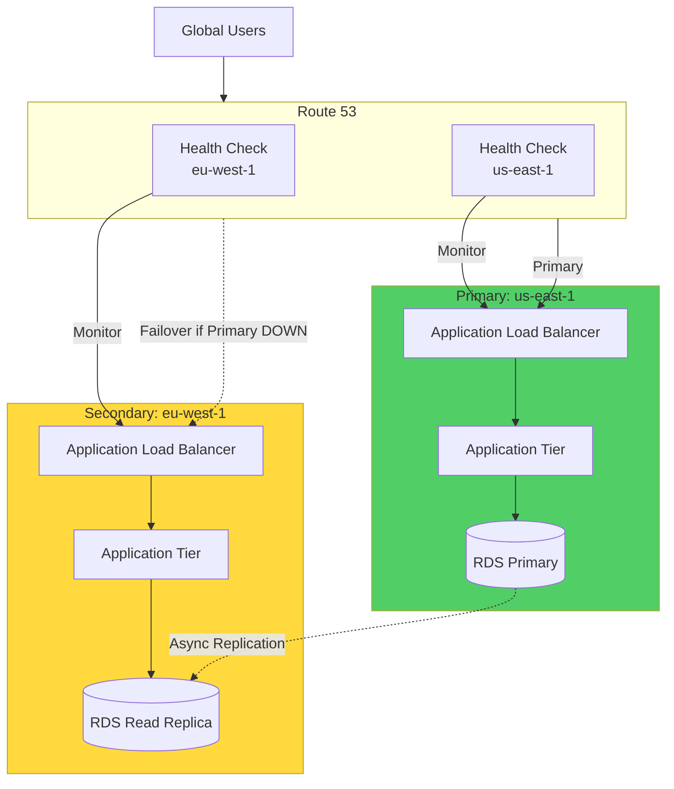

**Configuration:**

```hcl
# Route 53 Health Check
resource "aws_route53_health_check" "primary" {
  fqdn              = "alb-us-east-1.example.com"
  port              = 443
  type              = "HTTPS"
  resource_path     = "/health"
  failure_threshold = 3
  request_interval  = 30

  tags = {
    Name = "primary-region-health-check"
  }
}

# Route 53 Failover Record - Primary
resource "aws_route53_record" "primary" {
  zone_id = aws_route53_zone.main.zone_id
  name    = "app.example.com"
  type    = "A"

  set_identifier = "primary"
  failover_routing_policy {
    type = "PRIMARY"
  }

  alias {
    name                   = aws_lb.alb_us_east_1.dns_name
    zone_id                = aws_lb.alb_us_east_1.zone_id
    evaluate_target_health = true
  }

  health_check_id = aws_route53_health_check.primary.id
}

# Route 53 Failover Record - Secondary
resource "aws_route53_record" "secondary" {
  zone_id = aws_route53_zone.main.zone_id
  name    = "app.example.com"
  type    = "A"

  set_identifier = "secondary"
  failover_routing_policy {
    type = "SECONDARY"
  }

  alias {
    name                   = aws_lb.alb_eu_west_1.dns_name
    zone_id                = aws_lb.alb_eu_west_1.zone_id
    evaluate_target_health = true
  }
}
```

**RTO/RPO:**

- **RTO (Recovery Time Objective)**: < 2 minutes (DNS TTL 60s + health check interval 30s)
- **RPO (Recovery Point Objective)**: < 5 minutes (RDS async replication lag)

---

### 6.6. Exam Strategy Tips

#### **Keyword Recognition Table**

| Keyword in Question                          | Think About                                    |
| -------------------------------------------- | ---------------------------------------------- |
| "Private connectivity between VPCs"          | VPC Peering hoặc Transit Gateway               |
| "Hundreds of VPCs"                           | Transit Gateway (không phải VPC Peering)       |
| "Transitive routing"                         | Transit Gateway (VPC Peering KHÔNG support)    |
| "On-premises to AWS, consistent performance" | Direct Connect (không phải VPN)                |
| "Quick setup, encrypted, over Internet"      | Site-to-Site VPN                               |
| "Access S3 without Internet Gateway"         | S3 Gateway Endpoint hoặc S3 Interface Endpoint |
| "Access AWS services privately"              | VPC Endpoints (Gateway hoặc Interface)         |
| "Cross-Region, low latency, encrypted"       | Inter-Region VPC Peering hoặc TGW Peering      |
| "Shared services to multiple accounts"       | AWS PrivateLink (VPC Endpoint Services)        |
| "Central egress/ingress point"               | Transit VPC hoặc Transit Gateway + NAT Gateway |

---

#### **Elimination Strategy**

**Example Question:**

> A company needs to connect 50 VPCs across 3 AWS Regions. Traffic between VPCs must be encrypted and not traverse the Internet. What is the MOST scalable solution?

**Options:**
A. VPC Peering between all VPCs  
B. AWS Transit Gateway in each Region with Inter-Region Peering  
C. AWS PrivateLink  
D. Site-to-Site VPN mesh

**Elimination Process:**

1. ❌ **Option A**: 50 VPCs = 1,225 peering connections (50\*49/2). Không scalable, operational nightmare.

2. ✅ **Option B**: 3 Transit Gateways (1 per Region) + 3 peering connections. Scalable, encrypted, centralized management. **CORRECT ANSWER.**

3. ❌ **Option C**: PrivateLink is for service-to-VPC, không phải VPC-to-VPC connectivity.

4. ❌ **Option D**: VPN is for on-prem to AWS, không phải VPC to VPC. Cũng không scalable.

---
