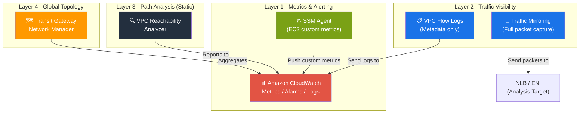
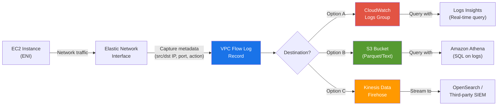
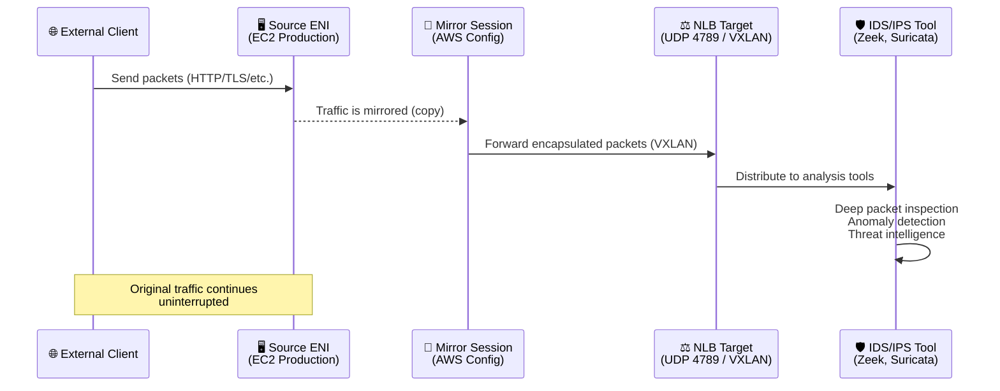
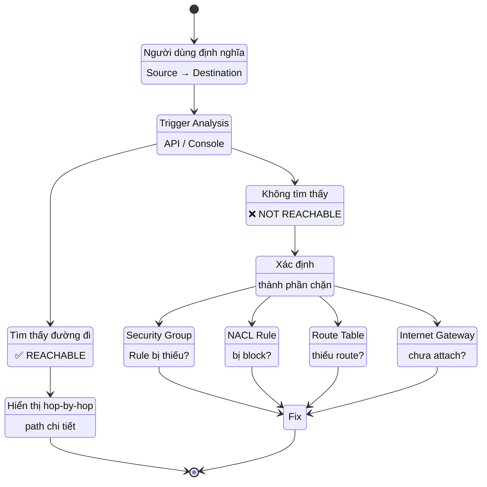
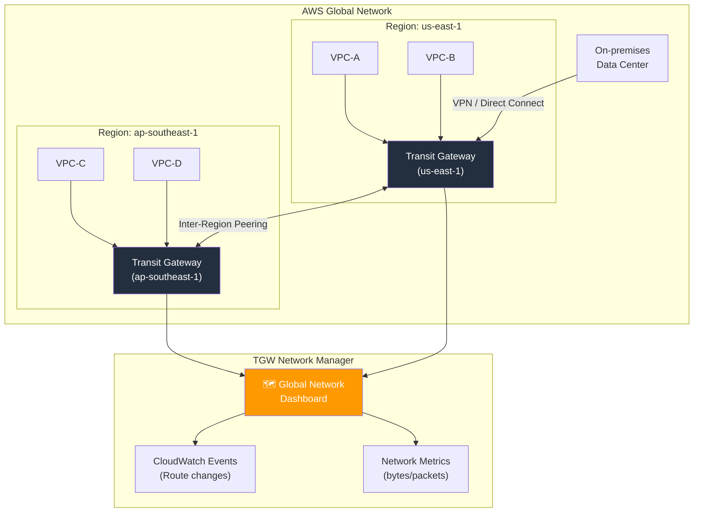

# AWS Network - Monitoring and Troubleshooting

> **Phạm vi:** Tài liệu này bao gồm 4 module cốt lõi: Tổng quan giám sát mạng, Amazon CloudWatch, Traffic Visibility & Analysis, và Network Mapping — được thiết kế cho kỳ thi AWS Certified Solutions Architect.

---

## 1. Overview & The "Why"

### Định nghĩa

**AWS Network Monitoring & Troubleshooting** là tập hợp các dịch vụ, công cụ và phương pháp luận cho phép kỹ sư mạng quan sát trạng thái, phân tích lưu lượng, và chẩn đoán sự cố trong hạ tầng mạng AWS — bao gồm `VPC`, `Subnet`, `Transit Gateway`, `VPN`, và các kết nối ngang hàng (`Peering`).

### Vấn đề thực tế cần giải quyết

Khi một ứng dụng trên AWS đột ngột chậm hoặc mất kết nối, kỹ sư cần trả lời ngay các câu hỏi:

- **Lưu lượng có đến được đích không?** → Reachability Analyzer
- **Traffic thực tế đi qua đâu?** → VPC Flow Logs / Traffic Mirroring
- **Có ngưỡng nào bị vi phạm không?** → CloudWatch Alarms
- **Kiến trúc mạng tổng thể trông như thế nào?** → Transit Gateway Network Manager

Nếu không có các công cụ này, việc gỡ lỗi sẽ phụ thuộc hoàn toàn vào phỏng đoán — cực kỳ nguy hiểm trong môi trường production với yêu cầu **SLA cao**.

### Analogy

> **Hãy tưởng tượng mạng AWS như một hệ thống đường cao tốc nội đô phức tạp.**
>
> - **CloudWatch** = Camera giao thông và biển báo điện tử theo dõi tốc độ, mật độ xe.
> - **VPC Flow Logs** = Nhật ký tự động ghi lại mọi phương tiện đi qua từng trạm thu phí.
> - **Traffic Mirroring** = Xe tuần tra bí mật chạy theo, ghi hình toàn bộ hành trình của xe mục tiêu.
> - **Reachability Analyzer** = Bản đồ GPS kiểm tra xem con đường từ A đến B có thực sự thông không (mà không cần phải lái xe thử).
> - **Transit Gateway Network Manager** = Trung tâm điều phối giao thông trung ương, hiển thị bản đồ toàn bộ hệ thống đường cao tốc.

---

## 2. Core Components & Keywords

| Từ khóa                             | Bản chất                                                                                                         |
| ----------------------------------- | ---------------------------------------------------------------------------------------------------------------- |
| **VPC Flow Logs**                   | Bản ghi metadata của mọi luồng IP đi vào/ra khỏi ENI, Subnet, hoặc VPC. Không capture payload.                   |
| **Traffic Mirroring**               | Sao chép toàn bộ gói tin (packet-level) từ ENI nguồn đến một target để phân tích sâu.                            |
| **CloudWatch Metrics**              | Dữ liệu định lượng theo thời gian (time-series) thu thập từ tài nguyên AWS.                                      |
| **CloudWatch Alarms**               | Cơ chế kích hoạt hành động tự động khi metric vượt ngưỡng.                                                       |
| **CloudWatch Logs Insights**        | Công cụ query log với ngôn ngữ riêng để phân tích dữ liệu log quy mô lớn.                                        |
| **SSM Agent**                       | Agent cài trên EC2 cho phép AWS Systems Manager thực thi lệnh và thu thập metrics mà không cần SSH.              |
| **VPC Reachability Analyzer**       | Công cụ phân tích tĩnh (static analysis) kiến trúc mạng — kiểm tra đường đi lý thuyết mà không gửi traffic thực. |
| **Transit Gateway Network Manager** | Dashboard trung tâm quản lý và giám sát toàn bộ topology của Transit Gateway trên nhiều Region/Account.          |
| **ENI (Elastic Network Interface)** | Card mạng ảo — đơn vị cơ bản để đính kèm Flow Logs và Traffic Mirroring.                                         |
| **ACCEPT / REJECT**                 | Trạng thái trong Flow Log cho biết gói tin có được `Security Group` / `NACL` cho phép hay không.                 |

---

## 3. Visual Theory & Architecture

### 3.1 Kiến trúc Tổng quan: Các Lớp Giám Sát Mạng



**Giải thích sơ đồ:** Hệ thống giám sát mạng AWS được tổ chức theo **4 lớp từ thấp đến cao**:

- **Layer 1** là nền tảng: CloudWatch thu thập metrics từ tài nguyên, SSM Agent đẩy các custom metrics từ bên trong EC2.
- **Layer 2** xử lý khả năng quan sát traffic: Flow Logs ghi metadata và đẩy vào CloudWatch/S3, trong khi Traffic Mirroring sao chép gói tin đến target riêng để phân tích sâu.
- **Layer 3** cho phép kiểm tra đường đi mạng mà không cần gửi traffic thực, rất hữu ích để gỡ lỗi cấu hình Security Group và NACL.
- **Layer 4** cung cấp tầm nhìn vĩ mô về toàn bộ topology mạng đa-Region.

---

### 3.2 VPC Flow Logs — Vòng đời và Luồng Dữ liệu



**Giải thích sơ đồ:**

1. **Capture:** Flow Logs thu thập metadata (không phải nội dung gói tin) từ ENI, Subnet, hoặc toàn bộ VPC.
2. **Destination:** Log có thể được gửi đến 3 đích: `CloudWatch Logs` (phân tích real-time), `S3` (lưu trữ dài hạn, chi phí thấp), hoặc `Kinesis Firehose` (stream đến SIEM bên thứ ba).
3. **Analysis:** Tùy đích đến, dùng `Logs Insights` (query nhanh), `Athena` (SQL analytics quy mô lớn), hoặc OpenSearch (dashboard real-time).

---

### 3.3 Traffic Mirroring — Kiến trúc Packet Capture



**Giải thích sơ đồ:**

1. Client gửi traffic đến EC2 production như bình thường — **không có interruption**.
2. AWS tạo một **bản sao** (mirror) của mọi gói tin tại ENI nguồn.
3. Gói tin được đóng gói bằng **VXLAN** (UDP port 4789) và gửi đến NLB hoặc ENI target.
4. Công cụ phân tích mã nguồn mở (Zeek, Suricata, Wireshark) nhận và giải mã gói tin để thực hiện **deep packet inspection**.

> **Lưu ý quan trọng:** Traffic Mirroring hoạt động ở **tầng packet (L2/L3)**, khác với Flow Logs chỉ ghi metadata. Đây là công cụ duy nhất cho phép phân tích **nội dung thực tế của gói tin** trên AWS.

---

### 3.4 VPC Reachability Analyzer — Luồng Phân Tích



**Giải thích sơ đồ:**

1. Người dùng định nghĩa **Source** (EC2, IGW, VPN, TGW) và **Destination** tương tự.
2. Reachability Analyzer thực hiện **phân tích tĩnh** (không gửi traffic thực) trên toàn bộ cấu hình mạng.
3. Nếu **REACHABLE**: hiển thị đường đi chi tiết từng hop.
4. Nếu **NOT REACHABLE**: chỉ ra chính xác thành phần nào đang chặn (SG, NACL, Route Table, IGW) — giúp tiết kiệm hàng giờ gỡ lỗi thủ công.

---

### 3.5 Transit Gateway Network Manager — Topology toàn cầu



**Giải thích sơ đồ:** Transit Gateway Network Manager cung cấp **một dashboard duy nhất** để quan sát toàn bộ topology mạng phức tạp gồm nhiều Region, nhiều Account, kết nối VPN/Direct Connect với On-premises. Mọi sự kiện thay đổi route đều được đẩy vào CloudWatch Events để có thể alert hoặc trigger automation.

---

## 4. Detailed Deep Dive

### 4.1 Amazon CloudWatch — Giám sát toàn diện

#### 4.1.1 Metrics và Namespaces

CloudWatch tổ chức metrics theo **Namespace** → **Dimension** → **Metric Name**.

| Namespace          | Ví dụ Metrics                                      | Ý nghĩa                             |
| ------------------ | -------------------------------------------------- | ----------------------------------- |
| `AWS/EC2`          | `NetworkIn`, `NetworkOut`                          | Bytes in/out tại instance level     |
| `AWS/VPN`          | `TunnelState`, `TunnelDataIn`                      | Trạng thái và throughput VPN tunnel |
| `AWS/DX`           | `ConnectionState`, `VirtualInterfaceBpsIngress`    | Direct Connect metrics              |
| `AWS/TGW`          | `BytesIn`, `PacketsIn`, `PacketDropCountBlackhole` | Transit Gateway traffic             |
| `CWAgent` (Custom) | `mem_used_percent`, `disk_used_percent`            | Metrics từ SSM/CloudWatch Agent     |

#### 4.1.2 CloudWatch Agent & SSM Agent

- **SSM Agent** chạy trên EC2, cho phép AWS Systems Manager quản lý instance (Run Command, Session Manager, Patch Manager) mà **không cần SSH hay bastion host**.
- **CloudWatch Agent** (cài qua SSM) thu thập metrics hệ điều hành mà AWS không thể thấy từ ngoài: `RAM usage`, `disk I/O`, `process count`, `network connections`.

```
EC2 Instance
    └── SSM Agent (quản lý, cấu hình)
        └── CloudWatch Agent (thu thập & đẩy metrics)
            └── CloudWatch Metrics / Logs
```

#### 4.1.3 CloudWatch Dashboards

- Tạo **multi-metric dashboard** kết hợp metrics từ nhiều service, nhiều Region.
- Hỗ trợ **Automatic Dashboard** (pre-built theo service) và **Custom Dashboard**.
- Cho phép nhúng **Logs Insights queries** dưới dạng widget trực tiếp.

#### 4.1.4 CloudWatch Logs Insights

Query language riêng với các lệnh: `fields`, `filter`, `stats`, `sort`, `limit`.

```sql
-- Ví dụ: Tìm các IP bị REJECT nhiều nhất trong Flow Logs
fields srcAddr, dstAddr, action
| filter action = "REJECT"
| stats count(*) as rejections by srcAddr
| sort rejections desc
| limit 20
```

#### 4.1.5 CloudWatch Alarms

| Thành phần             | Mô tả                                                         |
| ---------------------- | ------------------------------------------------------------- |
| **Metric**             | Nguồn dữ liệu (ví dụ: `NetworkPacketLoss`)                    |
| **Threshold**          | Ngưỡng kích hoạt (ví dụ: `> 5%` trong 5 phút)                 |
| **Period**             | Tần suất đánh giá (60s, 300s...)                              |
| **Evaluation Periods** | Số lần liên tiếp vượt ngưỡng trước khi alarm                  |
| **Actions**            | SNS notify, Auto Scaling, EC2 action, Systems Manager OpsItem |
| **States**             | `OK`, `ALARM`, `INSUFFICIENT_DATA`                            |

> **Composite Alarms:** Kết hợp nhiều alarm bằng logic AND/OR để giảm alert fatigue — chỉ notify khi nhiều điều kiện đồng thời xảy ra.

---

### 4.2 VPC Flow Logs — Chi tiết kỹ thuật

#### 4.2.1 Cấu trúc một Flow Log Record (Default Format)

```
version account-id interface-id srcaddr dstaddr srcport dstport protocol packets bytes windowstart windowend action log-status
```

| Field        | Ví dụ                        | Ý nghĩa                           |
| ------------ | ---------------------------- | --------------------------------- |
| `srcaddr`    | `10.0.1.5`                   | IP nguồn                          |
| `dstaddr`    | `52.94.1.1`                  | IP đích                           |
| `action`     | `ACCEPT` / `REJECT`          | Cho phép hay bị block bởi SG/NACL |
| `log-status` | `OK` / `NODATA` / `SKIPDATA` | Trạng thái ghi log                |
| `protocol`   | `6` (TCP), `17` (UDP)        | Số hiệu giao thức IANA            |

#### 4.2.2 Phạm vi Capture

| Cấp độ           | Capture gì                               | Use case                       |
| ---------------- | ---------------------------------------- | ------------------------------ |
| **ENI level**    | Traffic qua một network interface cụ thể | Debug một instance cụ thể      |
| **Subnet level** | Tất cả ENI trong subnet                  | Giám sát một tier (web/app/db) |
| **VPC level**    | Tất cả ENI trong toàn VPC                | Giám sát tổng thể, compliance  |

#### 4.2.3 Những gì Flow Logs KHÔNG capture

- Traffic đến DNS server (169.254.169.253)
- Traffic metadata DHCP, Windows license activation
- Traffic đến Instance Metadata Service (169.254.169.254)
- **Nội dung gói tin (payload)** — dùng Traffic Mirroring cho mục đích này

---

### 4.3 Traffic Mirroring — Chi tiết kỹ thuật

#### 4.3.1 Các thành phần cấu hình

| Thành phần         | Mô tả                                                              |
| ------------------ | ------------------------------------------------------------------ |
| **Mirror Source**  | ENI của instance cần monitor (chỉ hỗ trợ Nitro-based instances)    |
| **Mirror Target**  | ENI hoặc NLB nhận traffic được mirror                              |
| **Mirror Filter**  | Rules quyết định traffic nào được mirror (protocol, port, src/dst) |
| **Mirror Session** | Kết nối Source → Target với Filter, có priority                    |

#### 4.3.2 Encapsulation & Protocol

Traffic được đóng gói bằng **VXLAN (Virtual Extensible LAN)** trên **UDP port 4789** trước khi gửi đến target. Công cụ phân tích cần giải mã (decapsulate) VXLAN trước khi đọc gói tin gốc.

#### 4.3.3 Open-Source Tools tích hợp

| Tool                    | Mục đích                                    | Tích hợp                             |
| ----------------------- | ------------------------------------------- | ------------------------------------ |
| **Zeek (formerly Bro)** | Network traffic analyzer, tạo logs cấu trúc | Nhận traffic từ Mirror Target ENI    |
| **Suricata**            | IDS/IPS, phát hiện threat với rule sets     | Chạy trên EC2 nhận mirror traffic    |
| **Wireshark**           | Deep packet inspection thủ công             | Analyze pcap files từ mirror session |
| **tcpdump**             | Capture và filter packets dòng lệnh         | Debug nhanh trên instance            |

---

### 4.4 VPC Reachability Analyzer — Giới hạn và Khả năng

#### 4.4.1 Nguồn và Đích hỗ trợ

| Loại                   | Hỗ trợ làm Source/Destination |
| ---------------------- | ----------------------------- |
| EC2 Instance           | ✅                            |
| Internet Gateway       | ✅                            |
| VPN Gateway            | ✅                            |
| Transit Gateway        | ✅                            |
| VPC Peering Connection | ✅                            |
| NAT Gateway            | ✅                            |
| Network Load Balancer  | ✅                            |

#### 4.4.2 Yếu tố được phân tích

Reachability Analyzer kiểm tra các yếu tố sau theo thứ tự:

- **Security Group rules** (inbound/outbound)
- **Network ACL rules** (stateless, inbound/outbound)
- **Route Tables** (có route đến đích chưa)
- **Internet Gateway** (có attach vào VPC không)
- **NAT Gateway** (có trong route table đúng không)
- **VPC Peering** (route peering có thiếu không)

> **Lưu ý:** Reachability Analyzer tính phí **$0.10 per analysis**. Nó là công cụ one-time analysis, không phải continuous monitoring.

---

### 4.5 Transit Gateway Network Manager

#### 4.5.1 Tính năng chính

- **Global Network View:** Hiển thị topology dạng đồ thị toàn cầu — TGW, VPC, VPN, Direct Connect, SD-WAN devices.
- **Route Analyzer:** Phân tích đường đi của traffic qua TGW routing tables.
- **Events & Metrics:** Tích hợp với CloudWatch Events để alert khi topology thay đổi.
- **On-premises Integration:** Hỗ trợ đăng ký thiết bị SD-WAN của bên thứ ba.

#### 4.5.2 Route Analyzer

Tương tự Reachability Analyzer nhưng **tập trung vào Transit Gateway routing tables** — kiểm tra xem một gói tin từ Attachment A có được route đúng đến Attachment B không.

---

## 5. Practical Scenarios & Integration

### Scenario 1: Phát hiện Data Exfiltration (Security Use Case)

**Tình huống:** Security team nghi ngờ một EC2 instance đang gửi dữ liệu bất thường ra ngoài internet.

**Kiến trúc giải pháp:**

```
EC2 (Suspect) → VPC Flow Logs → CloudWatch Logs
                                    ↓
                         Logs Insights Query:
                         "Tìm ACCEPT traffic đến
                          IP ngoài VPC CIDR,
                          bytes > 1GB/hour"
                                    ↓
                         CloudWatch Alarm → SNS → Security Team
                                    ↓
                     (Nếu cần điều tra sâu hơn)
                    Traffic Mirroring → NLB → Suricata IDS
                    (Full packet inspection để xác định payload)
```

**Các bước thực hiện:**

1. Bật **VPC Flow Logs** ở cấp VPC, gửi đến CloudWatch Logs.
2. Tạo **Logs Insights query** lọc traffic `ACCEPT` đến IP ngoài VPC, sort theo `bytes desc`.
3. Tạo **CloudWatch Alarm** trên custom metric `DataTransferOutAnomaly`.
4. Nếu alarm kích hoạt, tạo **Traffic Mirroring session** trên ENI của instance nghi ngờ, target là NLB.
5. **Suricata** trên instance phân tích nhận mirror traffic thực hiện deep packet inspection.

---

### Scenario 2: Gỡ lỗi kết nối Database không thành công (Troubleshooting Use Case)

**Tình huống:** Ứng dụng trên EC2 (subnet: `app-subnet`) không kết nối được đến RDS (subnet: `db-subnet`) qua port 5432. Developer đã verify code — vấn đề là mạng.

**Quy trình gỡ lỗi có hệ thống:**

```
Bước 1: Reachability Analyzer
  Source: EC2 instance (app-subnet)
  Destination: RDS ENI (db-subnet)
  Port: 5432 (TCP)
  → Kết quả: NOT REACHABLE
  → Nguyên nhân: Security Group của RDS không có inbound rule cho port 5432 từ app-subnet CIDR

Bước 2: Sửa Security Group
  Thêm inbound rule: TCP 5432 from sg-app (app security group)

Bước 3: Chạy lại Reachability Analyzer
  → Kết quả: REACHABLE ✅
  → Hiển thị path: EC2 → ENI → app-subnet NACL → route → db-subnet NACL → RDS ENI

Bước 4: Verify bằng VPC Flow Logs
  Query: filter dstport = 5432 and action = "ACCEPT"
  → Xác nhận traffic thực tế đang đi thành công
```

---

### Infrastructure as Code (Terraform)

```hcl
# VPC Flow Logs → CloudWatch Logs
resource "aws_flow_log" "vpc_flow_log" {
  iam_role_arn    = aws_iam_role.flow_log_role.arn
  log_destination = aws_cloudwatch_log_group.flow_logs.arn
  traffic_type    = "ALL"
  vpc_id          = aws_vpc.main.id

  tags = {
    Name = "vpc-flow-log-production"
  }
}

resource "aws_cloudwatch_log_group" "flow_logs" {
  name              = "/aws/vpc/flow-logs"
  retention_in_days = 90
}

# CloudWatch Alarm cho high REJECT rate
resource "aws_cloudwatch_metric_alarm" "high_reject_rate" {
  alarm_name          = "vpc-high-reject-rate"
  comparison_operator = "GreaterThanThreshold"
  evaluation_periods  = 2
  metric_name         = "RejectedPackets"
  namespace           = "Custom/VPCFlowLogs"
  period              = 300
  statistic           = "Sum"
  threshold           = 1000
  alarm_description   = "Số lượng gói tin bị REJECT cao bất thường"
  alarm_actions       = [aws_sns_topic.security_alerts.arn]
}

# Traffic Mirroring Session
resource "aws_ec2_traffic_mirror_session" "analysis" {
  description              = "Mirror traffic for IDS analysis"
  network_interface_id     = aws_instance.suspicious.primary_network_interface_id
  traffic_mirror_filter_id = aws_ec2_traffic_mirror_filter.all_traffic.id
  traffic_mirror_target_id = aws_ec2_traffic_mirror_target.nlb_target.id
  session_number           = 1
}
```

---

## 6. Exam Essentials & Pro Tips

### 🎯 Các "bẫy" thường gặp trong kỳ thi

| Tình huống                                                    | Câu trả lời SAI             | Câu trả lời ĐÚNG                                                        |
| ------------------------------------------------------------- | --------------------------- | ----------------------------------------------------------------------- |
| Cần phân tích **nội dung gói tin** để tìm malware             | VPC Flow Logs               | **Traffic Mirroring**                                                   |
| Cần kiểm tra **lý do tại sao** EC2 không kết nối được đến RDS | Dùng ping/traceroute từ EC2 | **VPC Reachability Analyzer** (phân tích tĩnh, không cần traffic thực)  |
| Flow Log record có `REJECT` nhưng Security Group đã allow     | Sai Security Group rule     | **NACL bị block** (NACL là stateless — kiểm tra cả inbound và outbound) |
| Muốn giám sát **RAM và disk usage** của EC2                   | Xem CloudWatch mặc định     | Cài **CloudWatch Agent** (metric này không có trong default namespace)  |
| Flow Logs không capture traffic đến `169.254.169.254`         | Bug của Flow Logs           | **Đây là by design** — IMDS traffic bị loại trừ                         |
| Traffic Mirroring không hoạt động trên instance cũ            | Lỗi cấu hình                | Traffic Mirroring chỉ hỗ trợ **Nitro-based instances**                  |

---

### 💡 Best Practices

#### Cost Optimization

- **VPC Flow Logs**: Dùng **S3 với Parquet format** thay vì CloudWatch Logs để giảm chi phí lưu trữ dài hạn tới 70%. Dùng Athena để query thay vì Logs Insights.
- **Traffic Mirroring**: Sử dụng **Mirror Filter** để chỉ capture traffic cần thiết (ví dụ: chỉ port 443, 80) thay vì ALL traffic — giảm chi phí xử lý.
- **Reachability Analyzer**: Chạy phân tích on-demand khi gỡ lỗi, không schedule liên tục — tính phí $0.10/lần.
- **CloudWatch Metrics**: Dùng **metric math** để tạo computed metrics thay vì push nhiều custom metrics riêng lẻ.

#### Security (IAM & Security Groups)

- **Nguyên tắc Least Privilege** cho IAM Role của Flow Logs: chỉ cần `logs:CreateLogGroup`, `logs:CreateLogStream`, `logs:PutLogEvents`.
- **Encrypt Flow Logs** khi gửi đến S3 bằng SSE-KMS.
- **Restrict** quyền tạo/xóa Traffic Mirroring session — đây là capability nhạy cảm có thể bị dùng để exfiltrate traffic.
- Dùng **Resource-based policy** trên S3 bucket nhận Flow Logs để chặn public access.

#### Performance

- Đặt **CloudWatch Alarm evaluation period** tối thiểu bằng 2 periods để tránh false alarm do spike ngắn hạn.
- Sử dụng **CloudWatch Contributor Insights** để tự động xác định top contributors (IP nào gây traffic cao nhất) thay vì viết query thủ công.
- Với hạ tầng lớn, dùng **Transit Gateway Network Manager** thay vì theo dõi từng VPC riêng lẻ.

---

### 📋 Bảng so sánh nhanh: Chọn công cụ nào?

| Câu hỏi cần trả lời                                 | Công cụ phù hợp                   |
| --------------------------------------------------- | --------------------------------- |
| "Traffic có đến được đích không?" (lý thuyết)       | VPC Reachability Analyzer         |
| "Traffic thực tế có đang đi đến đích không?"        | VPC Flow Logs                     |
| "Gói tin thực sự chứa gì?"                          | Traffic Mirroring                 |
| "Có metric nào bất thường không?"                   | CloudWatch Metrics + Alarms       |
| "Log nói gì về sự cố 30 phút trước?"                | CloudWatch Logs Insights          |
| "Topology mạng toàn cầu của tôi trông như thế nào?" | Transit Gateway Network Manager   |
| "RAM của EC2 đang ở mức bao nhiêu?"                 | CloudWatch Agent (Custom Metrics) |

> **Quy tắc vàng cho kỳ thi:** Nếu câu hỏi đề cập đến "**packet payload**", "**deep inspection**", hoặc "**IDS/IPS**" → đáp án là **Traffic Mirroring**. Nếu đề cập đến "**why can't connect**" hoặc "**troubleshoot connectivity**" mà không cần gửi traffic thực → **Reachability Analyzer**.
