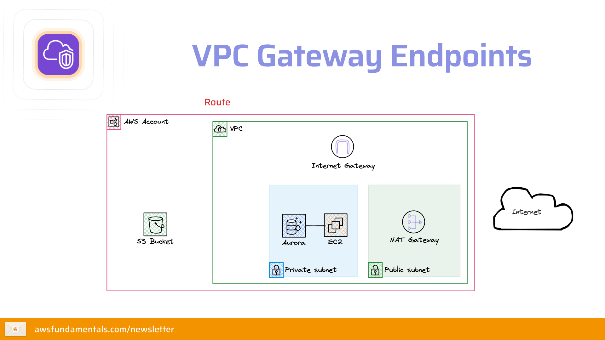
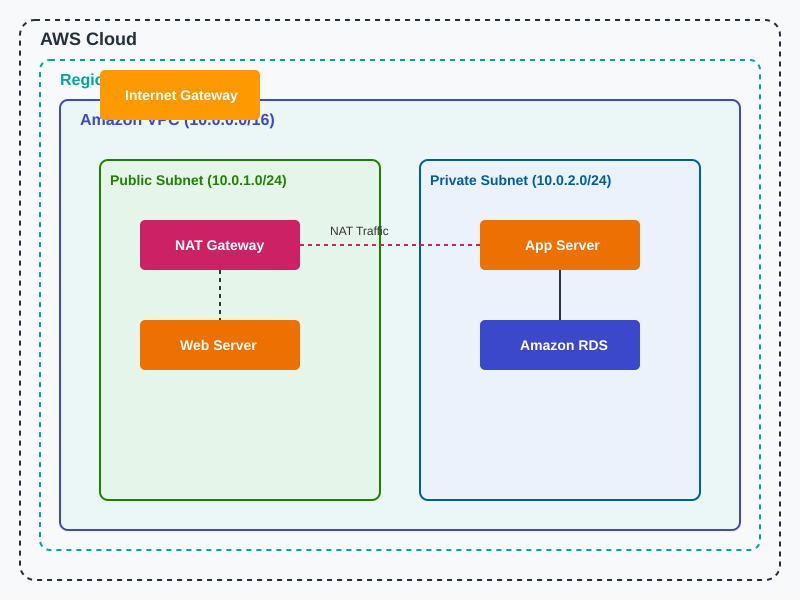

# Concept 1: Amazon VPC - Nền tảng mạng lõi

**Amazon Virtual Private Cloud (VPC)** là một mạng ảo riêng biệt về mặt logic dành riêng cho tài khoản AWS của bạn. Tại đây, bạn có toàn quyền kiểm soát môi trường mạng, bao gồm dải địa chỉ IP, tạo các phân mạng (Subnets) và cấu hình bảng định tuyến (Route Tables).

  
   
  <i>Minh họa: VPC Gateway Endpoints</i>

### Sơ đồ Kiến trúc VPC Tiêu chuẩn

Sơ đồ dưới đây do AI tự động tạo nhằm mang đến cái nhìn trực quan về một VPC chuẩn (gồm Internet Gateway, NAT Gateway, Public và Private Subnet).

  

## 1. Phân mạng (Subnets)

VPC được chia nhỏ thành các dải IP gọi là Subnet để quản lý tài nguyên dễ dàng và tăng tính bảo mật.

### Public Subnet (Phân mạng công khai)

- **Định nghĩa:** Là Subnet có bảng định tuyến trỏ trực tiếp ra **Internet Gateway (IGW)**.
- **Mục đích:** Chứa các tài nguyên cần được truy cập trực tiếp từ Internet (vd: Web Server, Load Balancer).
- **Đặc điểm:** Các Instance trong này cần có **Public IP** hoặc **Elastic IP**.

### Private Subnet (Phân mạng riêng tư)

- **Định nghĩa:** Là Subnet **không** có đường dẫn trực tiếp đến Internet Gateway.
- **Mục đích:** Chứa các tài nguyên nhạy cảm (vd: Cơ sở dữ liệu, Backend server).
- **Đặc điểm:** Chỉ có **Private IP**, không thể bị truy cập trực tiếp từ bên ngoài Internet.

---

## 2. Các thành phần điều hướng (Traffic Control)

### Internet Gateway (IGW)

- **Bản chất:** Một thành phần có độ sẵn sàng cao, cho phép giao tiếp giữa VPC và Internet.
- **Chức năng:** Giống như một "cánh cửa" mở ra thế giới bên ngoài. Một VPC chỉ có thể gắn với **một** IGW tại một thời điểm.

### Route Table (Bảng định tuyến)

- **Chức năng:** Chứa một tập hợp các quy tắc (Routes) để xác định nơi lưu lượng mạng từ Subnet hoặc Gateway được hướng tới.
- **Cách hoạt động:** Khi một gói tin muốn đi đâu đó, nó sẽ tra bảng này. Nếu đích đến là Internet (`0.0.0.0/0`), nó sẽ được gửi tới IGW (trong Public Subnet).

### Elastic Load Balancing (ELB)

- **Bản chất:** Dịch vụ cân bằng tải tự động phân phối lưu lượng đến nhiều Instance.
- **Đặc điểm:** Có thể đặt trong Public Subnet để nhận traffic từ Internet, sau đó phân phối đến các Instance trong Private Subnet, giúp tăng tính bảo mật và khả năng mở rộng.
- **Loại ELB:** Application Load Balancer (ALB) hoạt động ở tầng 7, Network Load Balancer (NLB) hoạt động ở tầng 4, và Classic Load Balancer hỗ trợ cả hai.

---

## 3. Kết nối an toàn cho Private Subnet

### NAT Gateway (Network Address Translation)

Đây là giải pháp để các máy chủ trong **Private Subnet** có thể đi ra Internet (để cập nhật phần mềm, tải bản vá) nhưng **ngăn chặn** Internet tự khởi tạo kết nối vào bên trong.

- **Vị trí đặt:** Bắt buộc phải đặt ở **Public Subnet**.
- **Đặc điểm:**
  - Sử dụng một **Elastic IP** cố định.
  - Quản lý bởi AWS (Managed Service), tự động mở rộng băng thông.
  - Hoạt động một chiều: Chỉ cho phép Outbound traffic đi ra và nhận phản hồi về.

---

## Tóm tắt luồng dữ liệu (Data Flow)

1.  **Public Instance:** EC2 ➡️ Route Table (0.0.0.0/0 -> IGW) ➡️ **Internet**. (2 chiều)
2.  **Private Instance (Cần cập nhật):** EC2 ➡️ Route Table (0.0.0.0/0 -> NAT GW) ➡️ NAT Gateway (nằm ở Public Subnet) ➡️ IGW ➡️ **Internet**. (Chỉ 1 chiều đi ra).

---
