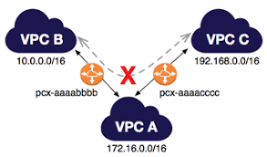
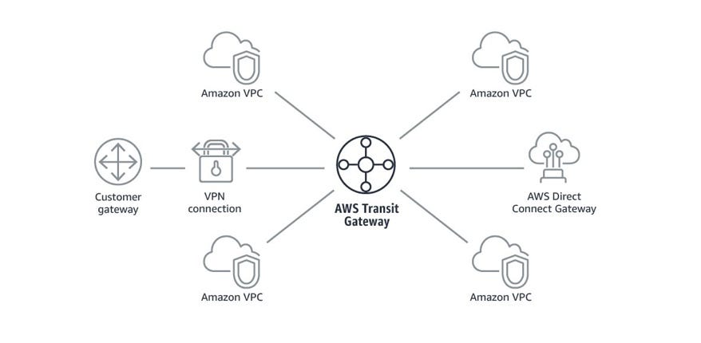
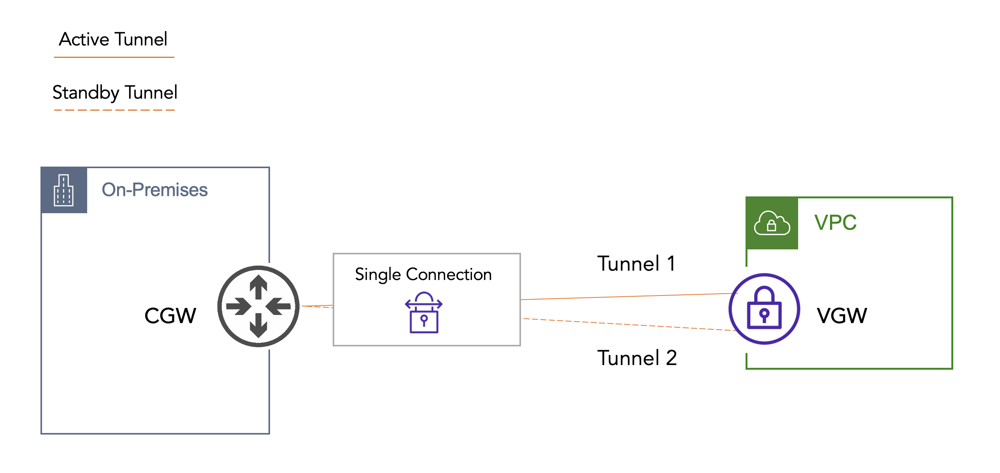

# Concept 2: Connectivity - Kết nối mạng nâng cao

Khi hệ thống phát triển, bạn sẽ không chỉ có một VPC đơn lẻ. Bạn sẽ cần kết nối hàng chục VPC hoặc kết nối mạng nội bộ của công ty với AWS. Đây là các giải pháp chìa khóa:

## 1. Kết nối nội bộ AWS (Inter-VPC Connection)

### VPC Peering (Kết nối ngang hàng)
* **Bản chất:** Kết nối trực tiếp 1-1 giữa hai VPC.
* **Đặc điểm chuyên sâu:**
    * **Không có tính chất bắc cầu (Non-transitive):** Nếu VPC A peer với B, B peer với C, thì A **KHÔNG** thể liên lạc với C. Muốn A nối C, bạn phải tạo thêm một Peering giữa A và C.
    * **Không trùng dải IP:** Hai VPC muốn peer với nhau thì dải CIDR không được phép chồng lấn.
    * **Hiệu suất:** Không có điểm nghẽn (bottleneck) vì traffic đi trên mạng xương sống của AWS, không đi qua Internet Gateway.
<figure  align="center">
  
  <figcaption align="center"><i> Hình 1 :  Mô hình kết nối VPC Peering(Example) </i></figcaption>
</figure>

### 🏢 AWS Transit Gateway (Bộ định tuyến trung tâm)
* **Bản chất:** Đóng vai trò như một **Cloud Router** trung tâm (Hub-and-spoke).
* **Đặc điểm chuyên sâu:**
    * **Transitive Routing:** Cho phép hàng ngàn VPC và mạng On-premises kết nối với nhau thông qua một điểm duy nhất.
    * **Quản lý tập trung:** Thay vì quản lý hàng trăm kết nối Peering (mô hình mạng nhện), bạn chỉ cần quản lý bảng định tuyến tại Transit Gateway.
    * **Hỗ trợ Multicast:** Đây là dịch vụ duy nhất hỗ trợ giao thức mạng này trên Cloud.
<figure  align="center">
  
  <figcaption align="center"><i> Hình 2 : Mô hình kết nối AWS Transit Gateway (Example) </i></figcaption>
</figure>

---

## 2. Kết nối Hybrid (Nối AWS với On-premises)
### AWS Site-to-Site VPN
* **Cơ chế:** Tạo một đường hầm mã hóa (**IPsec VPN**) qua môi trường Internet công cộng.
* **Thành phần:**
    * **Customer Gateway (CGW):** Thiết bị firewall/router tại văn phòng bạn.
    * **Virtual Private Gateway (VGW)** hoặc Transit Gateway tại AWS.
* **Ưu điểm:** Triển khai cực nhanh (vài phút), chi phí thấp.
* **Nhược điểm:** Phụ thuộc vào tốc độ Internet, độ trễ không ổn định.
<figure  align="center">
  
  <figcaption align="center"><i> Hình 3 : Mô hình kết nối Site-to-Site VPN (Example) </i></figcaption>
</figure>

### AWS Direct Connect (DX)
* **Cơ chế:** Một kết nối vật lý **chuyên dụng (dedicated)** từ trung tâm dữ liệu của bạn đến AWS qua một đối tác mạng. **Bỏ qua hoàn toàn Internet.**
* **Ưu điểm:**
    * Băng thông cực lớn (1Gbps, 10Gbps, 100Gbps).
    * Độ trễ (Latency) thấp và cực kỳ ổn định.
    * Tăng tính bảo mật cho dữ liệu nhạy cảm.
* **Nhược điểm:** Chi phí cao, thời gian triển khai lâu (từ vài tuần đến vài tháng).
<figure  align="center">
  
  <figcaption align="center"><i> Hình 4 : Mô hình kết nối AWS Direct Connect (Example) </i></figcaption>
</figure>

---

## 3. Truy cập từ xa (Remote Access)

### AWS Client VPN
* **Bản chất:** Dịch vụ VPN dựa trên phần mềm (OpenVPN) cho phép nhân viên truy cập an toàn vào tài nguyên AWS từ bất kỳ đâu (nhà riêng, quán cafe).
* **Đặc điểm:** Tích hợp với **IAM Identity Center** hoặc Active Directory để xác thực người dùng.

---

## Bảng so sánh chiến lược: VPN vs Direct Connect

| Tiêu chí | Site-to-Site VPN | Direct Connect (DX) |
| :--- | :--- | :--- |
| **Đường truyền** | Internet công cộng (Mã hóa IPsec) | Đường cáp vật lý riêng biệt |
| **Thời gian thiết lập** | Ngay lập tức | Vài tuần/tháng |
| **Độ ổn định** | Trung bình (phụ thuộc ISP) | Rất cao |
| **Chi phí** | Rẻ (trả theo giờ + data) | Đắt (phí cổng + phí vật lý) |
| **Bảo mật** | Mã hóa tốt nhưng đi qua Internet | Bảo mật tuyệt đối (cách ly Internet) |

