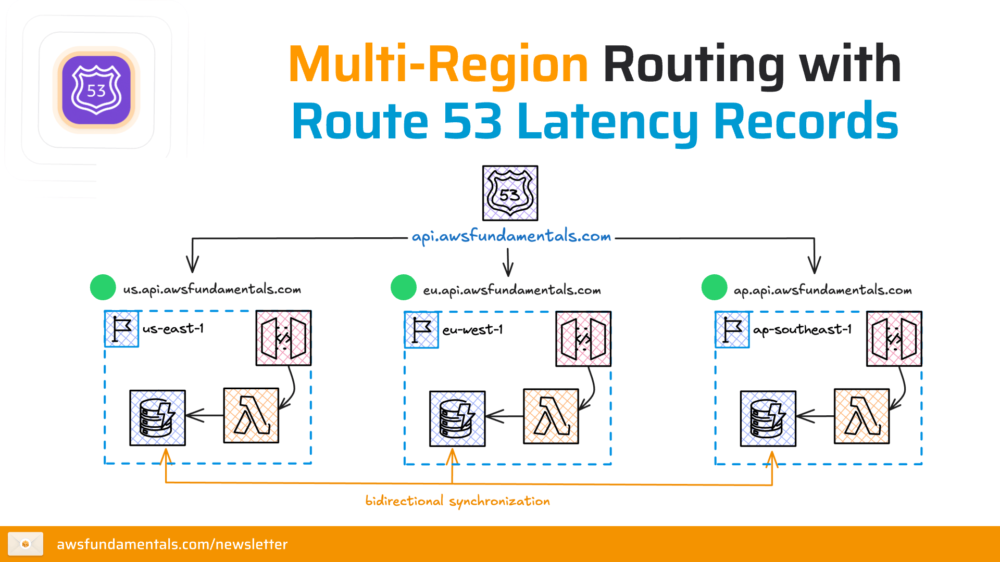
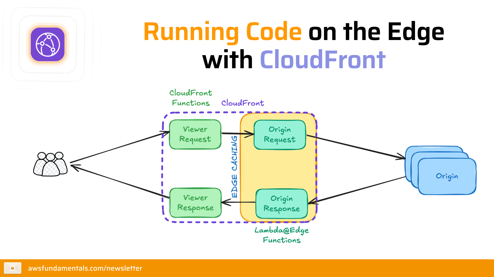
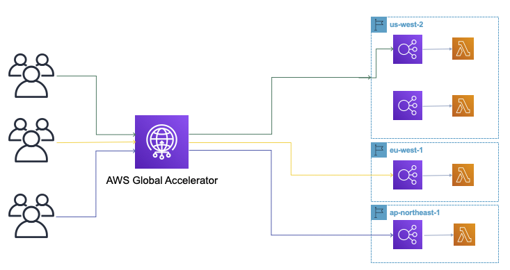

# Concept 3: Edge Services - Tối ưu hóa hiệu năng toàn cầu

Dịch vụ biên của AWS tận dụng mạng lưới **Edge Locations** rộng khắp thế giới để đưa dữ liệu và khả năng tính toán đến gần người dùng nhất có thể.

## 1. Amazon Route 53 (Dịch vụ DNS)
Route 53 không chỉ là nơi đăng ký tên miền, mà còn là một hệ thống định tuyến thông minh.

### Các tính năng chính:
* **DNS Management:** Chuyển đổi tên miền (vd: `duy-dev.com`) thành địa chỉ IP.
* **Health Checks:** Tự động giám sát tình trạng máy chủ. Nếu máy chủ sập, Route 53 sẽ ngừng điều hướng người dùng đến đó.
* **Routing Policies (Chiến lược định tuyến):** Đây là phần quan trọng nhất:
    * **Simple Routing:** Trỏ tên miền về 1 địa chỉ IP duy nhất.
    * **Weighted Routing:** Chia lưu lượng theo tỷ lệ (vd: 70% vào server cũ, 30% vào server mới để thử nghiệm).
    * **Latency Routing:** Điều hướng người dùng đến Region nào có độ trễ thấp nhất với họ.
    * **Failover Routing:** Tự động chuyển sang server dự phòng khi server chính gặp sự cố (Active-Passive).
    * **Geolocation Routing:** Điều hướng dựa trên vị trí địa lý của người dùng (vd: người dùng ở VN sẽ thấy giao diện tiếng Việt).
<figure  align="center">
  
  <figcaption align="center"><i> Hình 1 : Các chiến lược định tuyến của Amazon Route 53 </i></figcaption>
</figure>

---

## 2. Amazon CloudFront (Dịch vụ CDN)
CloudFront là mạng phân phối nội dung (Content Delivery Network - CDN) giúp tăng tốc độ tải trang web, video, hình ảnh.

### Cơ chế hoạt động:
1.  **Origin:** Nơi lưu trữ gốc (vd: S3 Bucket, EC2, hoặc Application Load Balancer).
2.  **Edge Location:** Trạm trung chuyển dữ liệu gần người dùng.
3.  **Caching:** Khi người dùng đầu tiên yêu cầu một tấm ảnh, CloudFront lấy từ Origin và lưu bản sao tại Edge Location. Những người dùng sau đó ở cùng khu vực sẽ lấy ảnh từ Edge Location ngay lập tức mà không cần quay về Origin.

### Lợi ích đi kèm:
* **Bảo mật:** Tích hợp cực sâu với **AWS WAF** (chặn mã độc) và **AWS Shield** (chống DDoS).
* **Chi phí:** Truyền dữ liệu từ S3 sang CloudFront là **miễn phí**, giúp giảm chi phí Data Transfer Out.

<figure  align="center">
  
  <figcaption align="center"><i> Hình 2 : Cơ chế hoạt động của Amazon CloudFront </i></figcaption>
</figure>

---

## 3. AWS Global Accelerator
Nhiều bạn thường nhầm dịch vụ này với CloudFront. Đây là giải pháp tối ưu hóa đường truyền mạng ở tầng thấp hơn.

* **Cơ chế:** Cung cấp cho bạn 2 địa chỉ **Static Anycast IP** cố định.
* **Điểm khác biệt:** Thay vì đi qua nhiều trạm trung gian của Internet công cộng đầy rủi ro, Global Accelerator đưa traffic của người dùng vào **mạng cáp quang nội bộ của AWS** sớm nhất có thể.
* **Tốc độ:** Giảm tối đa hiện tượng "rớt gói tin" (packet loss) và jitter cho các ứng dụng như Game online, VoIP hoặc giao dịch tài chính.

<figure  align="center">
  
  <figcaption align="center"><i> Hình 3 : Cơ chế hoạt động của AWS Global Accelerator </i></figcaption>
</figure>

---

## Bảng so sánh: CloudFront vs Global Accelerator

| Tiêu chí | Amazon CloudFront | AWS Global Accelerator |
| :--- | :--- | :--- |
| **Mục đích** | Tối ưu hóa nội dung (Cache hình ảnh, video, web) | Tối ưu hóa đường truyền mạng (TCP/UDP) |
| **Cơ chế** | Sử dụng bộ nhớ đệm (Caching) | Sử dụng mạng trục (Backbone) của AWS |
| **Ứng dụng** | Website, Streaming, nội dung tĩnh/động | Game, IoT, Voice qua IP, API đòi hỏi tốc độ cao |
| **IP Address** | Thay đổi theo DNS | Cố định (Static IP) |

---
