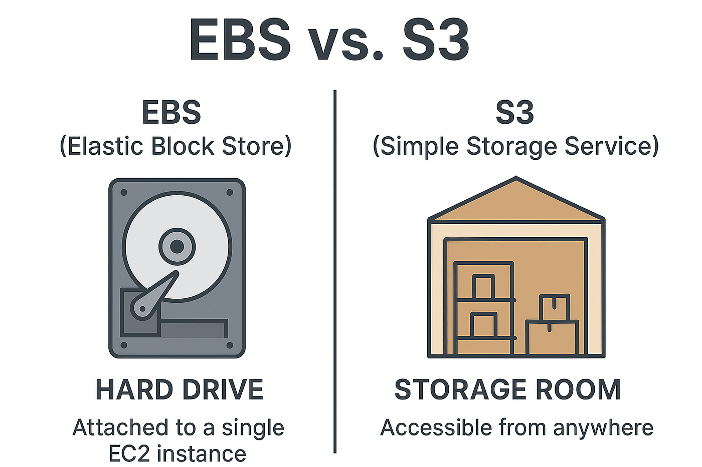

# Concept 3 :  AMAZON ELASTIC BLOCK STORE (EBS)

## 1. Tổng quan về Amazon EBS
Amazon EBS cung cấp các ổ đĩa lưu trữ dạng khối (block-level storage) hiệu suất cao, được thiết kế để sử dụng riêng cho các phiên bản **Amazon EC2**. 

* **Bản chất:** EBS giống như một ổ cứng vật lý (HDD/SSD) mà bạn có thể gắn vào máy chủ.
* **Tính bền vững (Persistence):** Khác với *Instance Store* (dữ liệu mất khi instance bị stop/terminate), dữ liệu trên EBS tồn tại độc lập với vòng đời của instance.
* **Khả năng kết nối:** Một volume EBS thường được gắn vào một instance trong cùng Availability Zone (AZ), nhưng tính năng **Multi-Attach** (trên các dòng io1/io2) cho phép một ổ đĩa kết nối đồng thời với nhiều instance.
  
<figure  align="center">
  
  <figcaption align="center"><i> Hình 1 : Tổng quan về Amazon EBS </i></figcaption>
</figure>

## 2. Kiến trúc và Tính sẵn sàng cao (High Availability)
EBS được thiết kế để đạt độ tin cậy cực cao trong môi trường doanh nghiệp:

* **Replication trong AZ:** Mỗi volume EBS được tự động sao chép qua nhiều máy chủ vật lý bên trong một Availability Zone (AZ) để ngăn ngừa mất dữ liệu khi có lỗi phần cứng đơn lẻ.
* **Thiết kế cho 99.999%:** AWS cam kết độ sẵn sàng cao, giúp ứng dụng hoạt động liên tục.
* **Vị trí mạng:** Volume EBS kết nối với EC2 thông qua mạng nội bộ chuyên dụng của AWS, đảm bảo độ trễ thấp và băng thông ổn định.

## 3. Phân tích chi tiết các loại ổ đĩa (Volume Types)
AWS chia EBS thành 2 nhóm chính dựa trên công nghệ lưu trữ, tối ưu cho các mục đích khác nhau:

### A. Nhóm SSD (Tối ưu cho Giao dịch - Latency-sensitive)
Dùng cho các tác vụ yêu cầu phản hồi nhanh (IOPS cao).
* **General Purpose SSD (gp3/gp2):** * *gp3 (Thế hệ mới):* Cho phép cấu hình độc lập IOPS và Throughput mà không cần tăng dung lượng đĩa. Giá rẻ hơn gp2 khoảng 20%.
    * *Ứng dụng:* Web server, môi trường phát triển, boot volumes.
* **Provisioned IOPS SSD (io2 Block Express/io1):**
    * *io2 Block Express:* Cung cấp độ trễ dưới 1 mili giây và IOPS lên tới 256,000. Đây là dòng mạnh nhất của AWS.
    * *Ứng dụng:* Cơ sở dữ liệu quy mô lớn (SAP HANA, Oracle, SQL Server).

### B. Nhóm HDD (Tối ưu cho Thông lượng - Throughput-intensive)
Dùng cho các tác vụ xử lý dữ liệu tuần tự lớn, ưu tiên giá rẻ.
* **Throughput Optimized HDD (st1):** Tối ưu cho dữ liệu truy cập thường xuyên với băng thông lớn.
    * *Ứng dụng:* Big Data, Data Warehousing, Log processing.
* **Cold HDD (sc1):** Chi phí thấp nhất trong tất cả các loại EBS.
    * *Ứng dụng:* Lưu trữ dữ liệu ít truy cập (Archive).

## 4. Cơ chế Bảo mật và Sao lưu dữ liệu

### A. EBS Snapshots (Ảnh chụp nhanh)
Đây là cách chính để sao lưu và bảo vệ dữ liệu trên EBS:
* **Lưu trữ trên S3:** Snapshots được lưu trữ bền vững trên Amazon S3.
* **Cơ chế Incremental (Gia tăng):** Chỉ các khối dữ liệu (blocks) đã thay đổi kể từ lần snapshot gần nhất mới được lưu lại. Điều này giúp tiết kiệm không gian lưu trữ và chi phí.
* **Tạo ổ đĩa mới:** Bạn có thể dùng snapshot để tạo volume mới ở bất kỳ AZ nào hoặc sao chép sang Region khác.

### B. EBS Encryption (Mã hóa)
* **Mã hóa toàn diện:** EBS hỗ trợ mã hóa dữ liệu ở trạng thái nghỉ (at rest), dữ liệu đang di chuyển (in transit) và tất cả các snapshot đi kèm.
* **Quản lý khóa:** Tích hợp trực tiếp với **AWS KMS** (Key Management Service) để quản lý chìa khóa mã hóa một cách bảo mật.
* **Hiệu năng:** Việc mã hóa diễn ra trên phần cứng của EC2 (Nitro System), do đó không gây ảnh hưởng đến hiệu suất của ứng dụng.

