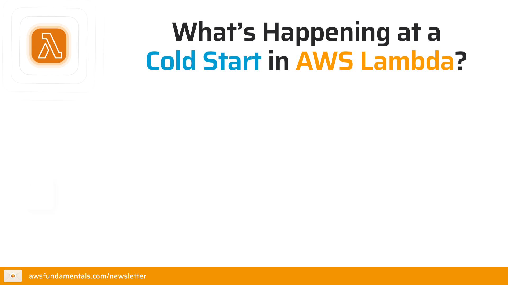
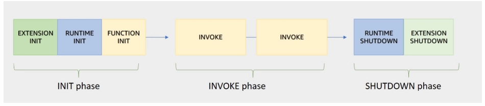
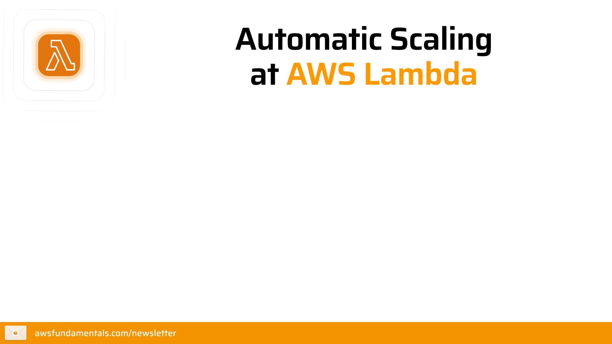
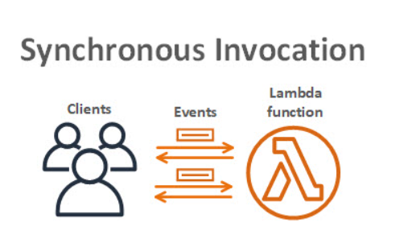
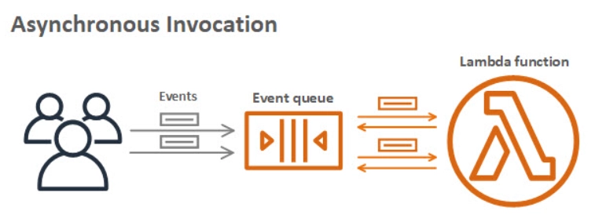
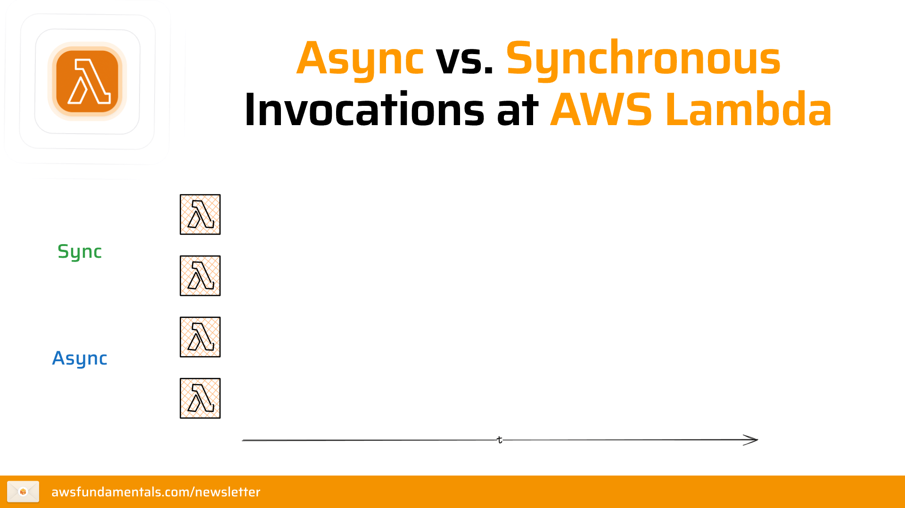

# Concept 2 : AWS Lambda - Foundations of Serverless Computing
## 1. Vòng đời môi trường thực thi (Execution Environment Lifecycle)
Mỗi khi một hàm Lambda được gọi, AWS sẽ tạo ra một môi trường thực thi (Execution Environment) để chạy mã của bạn. Vòng đời của môi trường này bao gồm 3 giai đoạn chính:
* **Init Phase** (Khởi tạo): AWS Lambda tải mã nguồn và các thư viện cần thiết vào môi trường. Đây là giai đoạn tốn thời gian nhất, thường gọi là "cold start".
 
  <figure  align="center">
    
    <figcaption align="center"><i> Hình 1 : Hiện tượng "cold start" trong AWS Lambda </i></figcaption>
    </figure>

* **Invoke Phase** (Thực thi): Môi trường đã sẵn sàng, Lambda thực thi mã của bạn để xử lý sự kiện. Nếu có nhiều yêu cầu đến cùng lúc, AWS sẽ tạo thêm nhiều môi trường thực thi mới để đáp ứng.
* **Idle Phase** (Không hoạt động): Sau khi hoàn thành nhiệm vụ, môi trường sẽ không bị hủy ngay mà được giữ lại trong một khoảng thời gian (thường là vài phút) để phục vụ các yêu cầu tiếp theo, giúp giảm thiểu độ trễ cho các lần gọi sau (warm start).

<figure  align="center">
  
  <figcaption align="center"><i> Hình 1 : Vòng đời môi trường thực thi của AWS Lambda </i></figcaption>
</figure>

## 2. Tổng quan về vai trò của AWS Lambda trong EDA
AWS Lambda là một dịch vụ điện toán hướng sự kiện (Event-driven).Trong kiến trúc hiện đại, nó đóng vai trò là "trái tim" xử lý logic, phản ứng tức thì với các thay đổi dữ liệu hoặc yêu cầu từ người dùng mà không cần duy trì máy chủ liên tục.

  
    <figcaption align="center"><i> Hình 1 : Kiến trúc hướng sự kiện (EDA) với AWS Lambda </i></figcaption>

---

## 3. Phân tích 3 cơ chế gọi hàm (Invocation Types)
Tùy thuộc vào nguồn kích hoạt (Trigger), Lambda sẽ thực thi theo một trong ba cơ chế sau:

### A. Đồng bộ (Synchronous Invocation)
***Cơ chế:** Bên gọi (Client) gửi yêu cầu và **chờ đợi** cho đến khi hàm Lambda xử lý xong và trả về phản hồi.
* **Đặc điểm:** Nếu hàm lỗi hoặc quá thời gian (timeout), Client sẽ nhận trực tiếp thông báo lỗi và phải tự xử lý việc thử lại (retry).

    * **Application Load Balancer (ALB):** Điều hướng yêu cầu HTTP trực tiếp đến Lambda.
  * **AWS SDK:** Khi ứng dụng gọi Lambda qua SDK, nó có thể chọn chế độ đồng bộ để nhận kết quả ngay lập tức.
  * **Amazon API Gateway:** Khi API Gateway được cấu hình để tích hợp với Lambda, nó sẽ gọi hàm theo cơ chế đồng bộ để trả về phản hồi HTTP cho người dùng cuối.
  
<figure  align="center">
  
  <figcaption align="center"><i> Hình 2 : Cơ chế đồng bộ (Synchronous Invocation) của AWS Lambda </i></figcaption>
</figure>

### B. Bất đồng bộ (Asynchronous Invocation)
***Cơ chế:** Bên gọi gửi sự kiện đến Lambda và nhận ngay phản hồi "Thành công" (accepted 200 ) mà **không chờ** hàm chạy xong.
* **Đặc điểm:** Sự kiện được đẩy vào một hàng đợi nội bộ của AWS Lambda.Dịch vụ Lambda sẽ tự động quản lý việc thử lại (tối đa 2 lần mặc định) nếu hàm bị lỗi.
<figure  align="center">
  
  <figcaption align="center"><i> Hình 3 : Cơ chế bất đồng bộ (Asynchronous Invocation) của AWS Lambda </i></figcaption>
</figure>

### C. Thăm dò / Ánh xạ nguồn sự kiện (Polling / Event Source Mapping)
***Cơ chế:** AWS Lambda định kỳ **quét (poll)** các dịch vụ dựa trên hàng đợi hoặc luồng dữ liệu để tìm bản ghi mới, sau đó gom thành các lô (batches) để gửi vào hàm xử lý.
* **Đặc điểm:** Phù hợp cho xử lý dữ liệu lớn hoặc luồng tin nhắn liên tục.

### D. Synchronous vs Asynchronous
<figure  align="center">
  
  <figcaption align="center"><i> Hình 4 : So sánh cơ chế đồng bộ và bất đồng bộ của AWS Lambda </i></figcaption>
</figure>

## 4. Kiến trúc hướng sự kiện (EDA) với Lambda
Kiến trúc EDA của Lambda được chia thành 3 phần chính giúp hệ thống có khả năng mở rộng cực cao và giảm thiểu sự phụ thuộc lẫn nhau (decoupling):

### Phần 1: Producers (Nguồn phát sinh sự kiện)Đây là các dịch vụ hoặc ứng dụng tạo ra dữ liệu/sự kiện đầu vào.
* **Ví dụ:**
  * **Amazon DynamoDB:** Khi có bản ghi mới được thêm vào bảng, DynamoDB có thể kích hoạt Lambda để xử lý (ví dụ: gửi thông báo, cập nhật chỉ mục tìm kiếm).
  * **Amazon S3:** Khi có file mới được tải lên, S3 có thể kích hoạt Lambda để xử lý (ví dụ: nén ảnh, trích xuất metadata).

### Phần 2: Routers (Bộ định tuyến sự kiện)
Đóng vai trò là "người vận chuyển" hoặc "người phân loại", quyết định sự kiện nào sẽ được gửi đến đâu.
* **Ví dụ:**
  * **Amazon EventBridge:** Bộ định tuyến sự kiện linh hoạt nhất, lọc và đẩy sự kiện dựa trên các quy tắc (rules).
  * **Amazon SNS:** Đẩy một sự kiện đến nhiều đích cùng lúc (Fan-out).
  * **API Gateway:** Định tuyến yêu cầu HTTP đến đúng hàm Lambda tương ứng.

### Phần 3: Consumers (Nguồn tiêu thụ/xử lý)Chính là các hàm **AWS Lambda** nhận dữ liệu từ Router và thực hiện logic nghiệp vụ.

***Ví dụ:** Lambda nhận sự kiện thanh toán để ghi vào DB, hoặc nhận file ảnh để thực hiện nén và lưu vào kho lưu trữ.
<figure  align="center">
  
  <figcaption align="center"><i> Hình 4 : Kiến trúc hướng sự kiện (EDA) với AWS Lambda </i></figcaption>
</figure>

## 4. Lamda permissions & Security
AWS Lambda sử dụng **IAM Execution Role** để xác định quyền hạn của hàm khi thực thi. Điều này giúp đảm bảo rằng Lambda chỉ có thể truy cập vào các tài nguyên cần thiết, giảm thiểu rủi ro bảo mật.
* **Execution Role:** Khi tạo hàm Lambda, bạn sẽ gán một IAM Role cho nó. Role này chứa các chính sách (policies) xác định những hành động nào Lambda được phép thực hiện trên các dịch vụ AWS khác (ví dụ: đọc từ S3, ghi vào DynamoDB).
* **Principle of Least Privilege:** Luôn áp dụng nguyên tắc này khi thiết lập quyền cho Lambda, chỉ cấp những quyền cần thiết nhất để thực hiện nhiệm vụ của hàm, tránh việc cấp quá nhiều quyền có thể dẫn đến lỗ hổng bảo mật.

<figure  align="center">
  
  <figcaption align="center"><i> Hình 5 : Cơ chế IAM Execution Role của AWS Lambda </i></figcaption>
</figure>

## 5. Các dịch vụ đi kèm & Tính năng nâng cao
1. **IAM Execution Role:** Cấp quyền cho Lambda thực thi các tác vụ (như đọc S3, ghi CloudWatch)[cite: 202].
2. **Amazon CloudWatch:** Dịch vụ mặc định để thu thập logs và giám sát hiệu suất[cite: 1].
3.  **DLQ (Dead Letter Queue):** Nơi chứa các sự kiện bất đồng bộ bị lỗi sau khi đã thử lại hết số lần quy định, giúp tránh mất mát dữ liệu.
4. **Lambda Layers:** Cách để chia sẻ mã nguồn chung hoặc thư viện dùng chung giữa nhiều hàm Lambda khác nhau.
5. **Provisioned Concurrency:** Tính năng giúp giảm thiểu độ trễ khởi động (cold start) bằng cách giữ sẵn một số lượng instance Lambda luôn sẵn sàng để phục vụ yêu cầu.