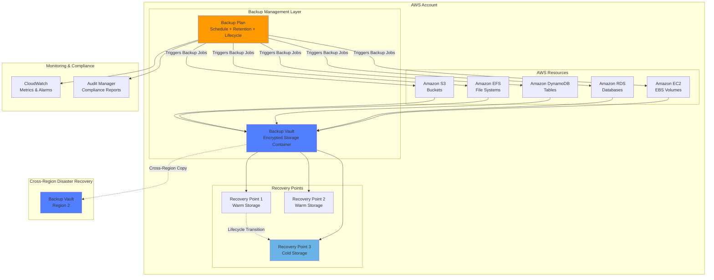
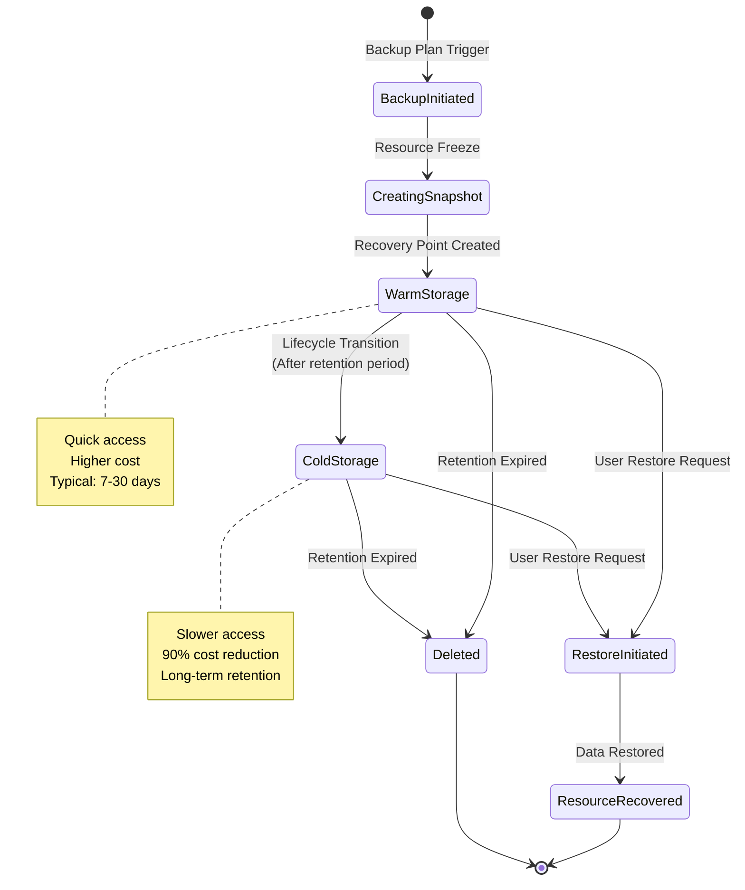
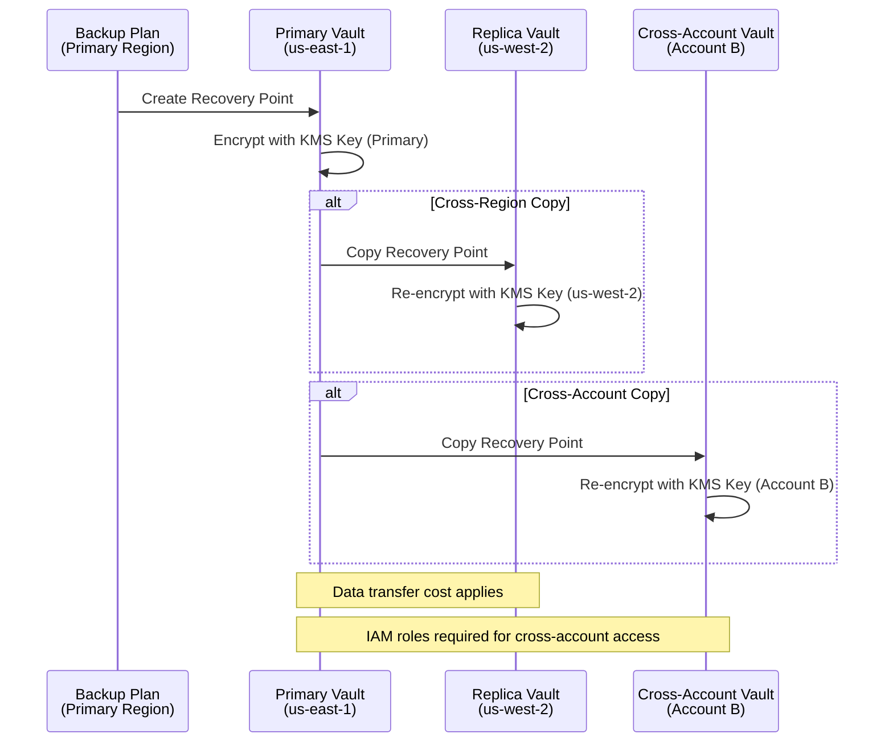
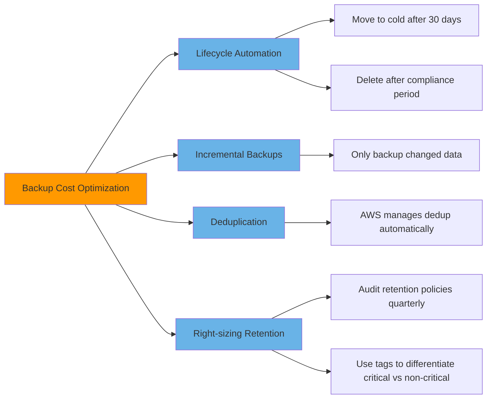
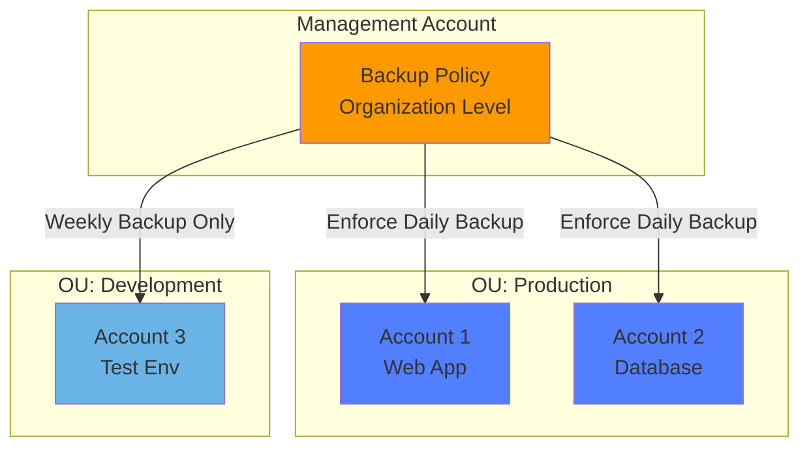
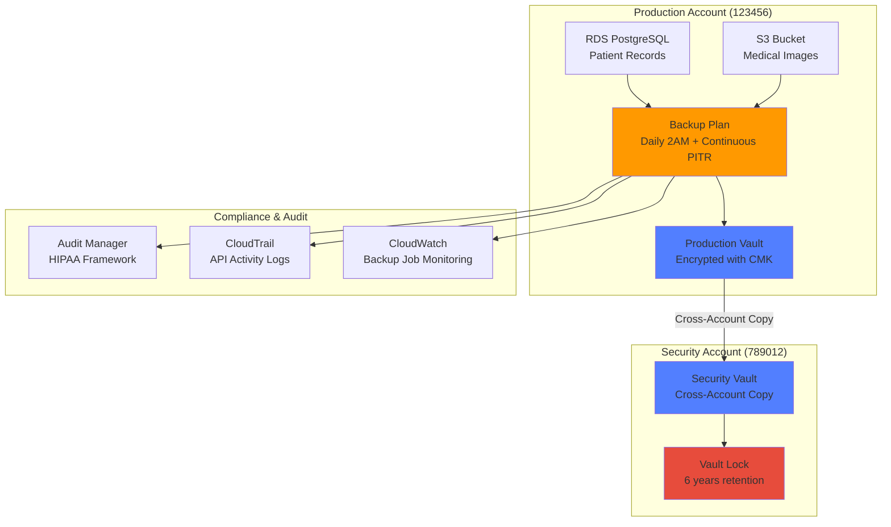
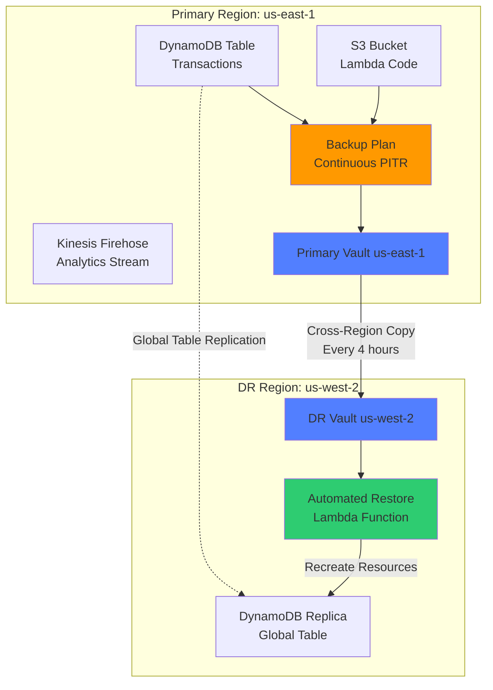
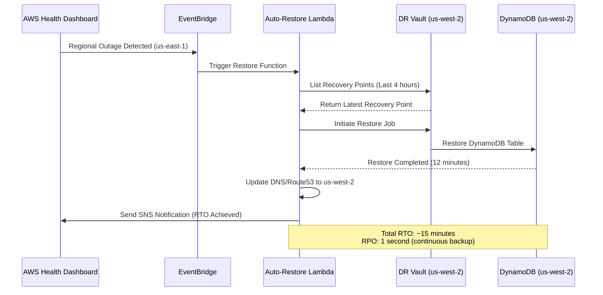
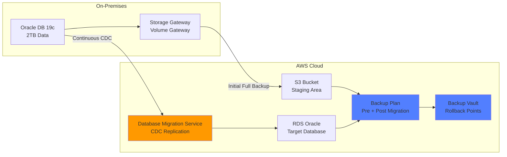
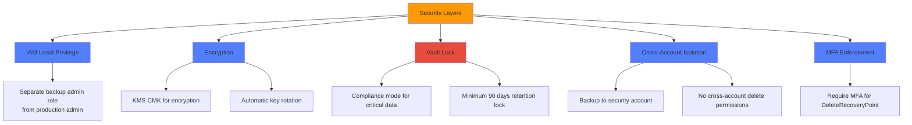

# AWS Backup

## 1. Overview & The "Why"

**AWS Backup** là dịch vụ quản lý sao lưu tập trung, tự động hóa hoàn toàn giúp bạn tạo, quản lý và phục hồi dữ liệu trên các dịch vụ AWS, môi trường cloud và hạ tầng on-premises. Dịch vụ này cung cấp giải pháp bảo vệ dữ liệu toàn diện cho cả môi trường cloud và hybrid.

### Vấn đề thực tế AWS Backup giải quyết

Trước khi có AWS Backup, các tổ chức phải đối mặt với:

- **Phân mảnh công cụ:** Mỗi dịch vụ AWS (EC2, RDS, DynamoDB) yêu cầu công cụ sao lưu riêng biệt
- **Quản lý thủ công:** Scripts riêng lẻ, dễ lỗi do con người, thiếu tính nhất quán
- **Khó kiểm toán:** Không có cái nhìn tổng thể về trạng thái sao lưu trên toàn hệ thống
- **Tuân thủ phức tạp:** Khó chứng minh compliance với các yêu cầu pháp lý
- **Lãng phí tài nguyên:** Sao lưu không đồng nhất, dẫn đến chi phí cao và rủi ro mất dữ liệu

### **Analogy: AWS Backup như hệ thống bảo hiểm tự động**

Hãy tưởng tượng AWS Backup như một **hệ thống bảo hiểm tự động cho ngôi nhà thông minh**:

- **Backup Plans** = Hợp đồng bảo hiểm với lịch trình định kỳ (hàng ngày, hàng tuần)
- **Backup Vaults** = Két sắt chống cháy nơi lưu trữ tài liệu quan trọng
- **Recovery Points** = Bản sao tài liệu tại thời điểm cụ thể (snapshot)
- **Lifecycle Management** = Tự động chuyển tài liệu cũ vào kho lưu trữ lạnh (cold storage) để tiết kiệm không gian
- **Cross-Region Backup** = Giữ bản sao ở ngân hàng chi nhánh khác thành phố để phòng thiên tai

Thay vì phải nhớ và thực hiện thủ công việc sao chép tài liệu quan trọng hàng ngày cho từng phòng trong nhà, hệ thống tự động làm mọi thứ theo lịch đã cài đặt, lưu trữ an toàn, và sẵn sàng khôi phục khi cần.

---

## 2. Core Components & Keywords

| Thuật ngữ | Bản chất & Ý nghĩa |
|-----------|-------------------|
| **Backup Plan** | Chính sách (policy) định nghĩa **KHI NÀO** sao lưu, **BAO LÂU** giữ dữ liệu, và **CÁCH** quản lý vòng đời. Đây là "bộ não" của chiến lược backup. |
| **Backup Vault** | Vùng chứa an toàn (container) để lưu trữ các recovery points. Được mã hóa bằng `AWS KMS` và có thể áp dụng kiểm soát truy cập riêng biệt. |
| **Recovery Point** | Snapshot đại diện cho trạng thái tài nguyên tại một thời điểm cụ thể. Chứa đủ thông tin để khôi phục tài nguyên về đúng trạng thái đó. |
| **Resource Assignment** | Quy trình kết nối tài nguyên AWS (EC2, RDS, EFS...) với backup plan, thực hiện qua tag hoặc chỉ định trực tiếp từng resource. |
| **Backup Rule** | Thành phần của backup plan định nghĩa tham số cụ thể: tần suất (frequency), backup window, và lifecycle configurations. |
| **Cold Storage** | Tầng lưu trữ chi phí thấp cho các backup ít truy cập, giúp tối ưu chi phí mà vẫn đáp ứng compliance. |
| **Continuous Backup** | Tính năng cho phép **Point-in-Time Recovery (PITR)** bằng cách duy trì backup liên tục, khôi phục về bất kỳ thời điểm nào trong khung thời gian chỉ định. |
| **Incremental Backup** | Công nghệ chỉ sao lưu **phần dữ liệu thay đổi** sau lần full backup đầu tiên, giúp tăng hiệu suất và giảm chi phí lưu trữ. |
| **Cross-Region Backup** | Khả năng sao chép backup sang các AWS Region khác nhau để đảm bảo disaster recovery. |
| **Cross-Account Backup** | Khả năng sao chép backup sang tài khoản AWS khác để bảo vệ đa lớp và tách biệt môi trường. |

---

## 3. Visual Theory & Architecture

### 3.1. Kiến trúc tổng quan AWS Backup



### **Diagram Explanation: Luồng hoạt động của AWS Backup**

1. **Backup Plan (Bộ não trung tâm):**
   - Định nghĩa lịch trình sao lưu (hàng ngày lúc 2:00 AM, hàng tuần vào Chủ nhật...)
   - Thiết lập retention policy (giữ 30 ngày warm storage, sau đó chuyển cold storage)
   - Tự động trigger backup jobs cho các resources được assign

2. **Resource Assignment (Liên kết tài nguyên):**
   - Backup Plan kết nối với các AWS resources thông qua tags (ví dụ: `Environment:Production`) hoặc chỉ định trực tiếp resource ID
   - Hỗ trợ đa dạng dịch vụ: EC2 (EBS snapshots), RDS (automated snapshots), DynamoDB, EFS, S3

3. **Backup Vault (Két sắt số):**
   - Recovery points được lưu trữ trong Backup Vault được mã hóa bằng AWS KMS
   - Có thể thiết lập resource-based policies để kiểm soát quyền truy cập chi tiết
   - Vault Lock: Ngăn chặn xóa backup trong khoảng thời gian nhất định (WORM compliance)

4. **Lifecycle Management (Tự động hóa chi phí):**
   - Recovery Point 1-2 ở **Warm Storage**: Truy cập nhanh, chi phí cao hơn
   - Recovery Point 3 ở **Cold Storage**: Truy cập chậm hơn, chi phí thấp (giảm tới 90%)
   - Lifecycle rules tự động transition và delete based on retention policies

5. **Cross-Region Disaster Recovery:**
   - Backup tự động replicate sang Region 2 (ví dụ: từ `us-east-1` sang `us-west-2`)
   - Đảm bảo business continuity khi xảy ra regional outage

6. **Monitoring & Compliance:**
   - **CloudWatch**: Theo dõi metrics như backup job status, backup size, duration
   - **Audit Manager**: Tạo compliance reports, kiểm tra tuân thủ policies tự động

---

### 3.2. Backup Lifecycle & State Transition



### **Diagram Explanation: Vòng đời của một Recovery Point**

1. **Backup Initiated → Creating Snapshot:**
   - Backup Plan trigger job tại thời điểm đã lịch
   - Resource freeze (application-consistent or crash-consistent snapshot)
   - Incremental backup: Chỉ capture dữ liệu thay đổi so với lần backup trước

2. **Warm Storage (Giai đoạn hoạt động cao):**
   - Recovery point lưu ở tier có tốc độ truy cập cao
   - Sử dụng cho frequent restore scenarios
   - Thời gian lưu trữ điển hình: 7-30 ngày

3. **Lifecycle Transition to Cold Storage:**
   - Sau khi hết retention period ở Warm Storage, tự động chuyển sang Cold Storage
   - Chi phí giảm ~90%, nhưng restore time tăng lên
   - Phù hợp với compliance requirements (giữ 7 năm cho financial records)

4. **Restore Initiated → Resource Recovered:**
   - User trigger restore từ AWS Console, CLI, hoặc API
   - Warm storage: Restore trong vài phút
   - Cold storage: Restore có thể mất vài giờ (cần thời gian retrieval)

5. **Deleted (Kết thúc vòng đời):**
   - Tự động delete khi hết retention period cuối cùng
   - Hoặc manual delete bởi admin (nếu không có Vault Lock)

---

### 3.3. Cross-Region & Cross-Account Backup Flow



### **Diagram Explanation: Sao lưu Cross-Region và Cross-Account**

1. **Primary Backup Creation:**
   - Backup Plan tạo recovery point trong Primary Vault (`us-east-1`)
   - Encrypt ngay lập tức bằng AWS KMS key của region đó

2. **Cross-Region Replication:**
   - Tự động copy recovery point sang Replica Vault ở region khác (`us-west-2`)
   - **Re-encryption**: Dữ liệu được decrypt ở primary region, transfer encrypted, và re-encrypt bằng KMS key của destination region
   - **Data transfer cost**: AWS tính phí cho traffic giữa các region

3. **Cross-Account Protection:**
   - Copy recovery point sang Backup Vault thuộc AWS Account B (ví dụ: security account riêng biệt)
   - **IAM roles required**: Account A cần assume role để write vào vault của Account B
   - **Use case**: Tách biệt môi trường production và backup để chống ransomware

> **Lưu ý bảo mật:** Cross-account backup là best practice quan trọng. Nếu hacker chiếm quyền điều khiển production account, họ không thể xóa backup ở security account khác.

---

## 4. Detailed Deep Dive

### 4.1. Backup Plans - Bộ não của chiến lược sao lưu

Backup Plan là trung tâm điều phối toàn bộ hoạt động backup. Một plan bao gồm:

#### **Thành phần của Backup Plan**

```json
{
  "BackupPlan": {
    "BackupPlanName": "DailyBackupWithLifecycle",
    "Rules": [
      {
        "RuleName": "DailyBackup",
        "TargetBackupVault": "ProductionVault",
        "ScheduleExpression": "cron(0 2 * * ? *)",
        "StartWindowMinutes": 60,
        "CompletionWindowMinutes": 120,
        "Lifecycle": {
          "MoveToColdStorageAfterDays": 30,
          "DeleteAfterDays": 365
        },
        "RecoveryPointTags": {
          "Environment": "Production",
          "Compliance": "GDPR"
        },
        "CopyActions": [
          {
            "DestinationBackupVaultArn": "arn:aws:backup:us-west-2:123456789012:backup-vault:DRVault",
            "Lifecycle": {
              "DeleteAfterDays": 90
            }
          }
        ]
      }
    ]
  }
}
```

#### **Chi tiết các tham số:**

| Tham số | Mục đích | Best Practice |
|---------|----------|---------------|
| `ScheduleExpression` | Định nghĩa tần suất backup bằng cron hoặc rate expressions | Chạy backup trong off-peak hours (2-4 AM) để giảm impact |
| `StartWindowMinutes` | Khoảng thời gian bắt đầu backup job | Set 60-120 phút để đảm bảo backup không bị skip nếu job delay |
| `CompletionWindowMinutes` | Thời gian tối đa để hoàn thành backup | Tùy vào data size; large databases cần 8-12 giờ |
| `Lifecycle.MoveToColdStorageAfterDays` | Số ngày trước khi chuyển sang cold storage | 7-30 ngày cho production; 90+ ngày cho compliance data |
| `Lifecycle.DeleteAfterDays` | Thời gian lưu trữ tổng cộng trước khi xóa | Tuân thủ compliance: GDPR (6 năm), SOX (7 năm), HIPAA (6 năm) |
| `CopyActions` | Sao chép sang vault khác (cross-region/cross-account) | Luôn enable cho critical workloads; chọn region ít rủi ro thiên tai |

---

### 4.2. Backup Vaults - Bảo mật và Kiểm soát Truy cập

Backup Vault không chỉ là storage container, mà còn là **security boundary** với nhiều layer bảo vệ:

#### **Các tính năng bảo mật của Vault**

1. **Encryption at Rest:**
   ```bash
   # Tạo vault với custom KMS key
   aws backup create-backup-vault \
     --backup-vault-name SecureVault \
     --encryption-key-arn arn:aws:kms:us-east-1:123456789012:key/abcd1234
   ```

2. **Vault Lock (WORM Compliance):**
   - **Governance Mode**: Admins có thể override lock
   - **Compliance Mode**: Không ai (kể cả root user) có thể xóa backup trong thời gian lock
   ```bash
   # Enable Vault Lock
   aws backup put-backup-vault-lock-configuration \
     --backup-vault-name ComplianceVault \
     --min-retention-days 2555  # 7 năm
   ```

3. **Resource-based Access Policy:**
   ```json
   {
     "Version": "2012-10-17",
     "Statement": [
       {
         "Effect": "Deny",
         "Principal": "*",
         "Action": "backup:DeleteRecoveryPoint",
         "Resource": "*",
         "Condition": {
           "NumericLessThan": {
             "backup:CopyJobAge": "90"
           }
         }
       }
     ]
   }
   ```
   **Ý nghĩa:** Ngăn chặn xóa recovery point trước 90 ngày (anti-ransomware)

---

### 4.3. Supported Services & Backup Types

| AWS Service | Backup Type | Point-in-Time Recovery | Cross-Region Support | Notes |
|-------------|-------------|------------------------|---------------------|-------|
| **Amazon EC2** | EBS Snapshots (crash-consistent) | ❌ | ✅ | Sử dụng AMI backup cho full instance recovery |
| **Amazon RDS** | Automated Snapshots | ✅ (5 minutes granularity) | ✅ | PITR cho MySQL, PostgreSQL, MariaDB, Oracle, SQL Server |
| **Amazon DynamoDB** | On-demand + Continuous | ✅ (1 second granularity) | ✅ | Continuous backup tính phí riêng (read capacity units) |
| **Amazon EFS** | Incremental Backups | ✅ | ✅ | Chỉ backup phần thay đổi, rất cost-effective |
| **Amazon S3** | Continuous Backup | ✅ | ✅ | Yêu cầu S3 Versioning enabled |
| **AWS Storage Gateway** | Volume, Tape Backups | ❌ | ✅ | Dùng cho hybrid cloud scenarios |
| **Amazon FSx** | File System Snapshots | ❌ | ✅ | Hỗ trợ FSx for Windows, Lustre, NetApp ONTAP |

---

### 4.4. Cost Optimization Strategies

#### **Bảng so sánh chi phí Storage Tiers**

| Storage Tier | Cost (USD/GB/month) | Restore Time | Use Case |
|--------------|---------------------|--------------|----------|
| **Warm Storage** | $0.05 | Instant | Frequent access, recent backups (7-30 days) |
| **Cold Storage** | $0.01 (90% savings) | 3-5 hours | Long-term retention (compliance, archival) |

#### **Chi phí bổ sung cần lưu ý:**

1. **Data Transfer Costs:**
   - Cross-region copy: $0.02/GB (giữa các US regions)
   - Internet egress (restore về on-premises): $0.09/GB

2. **Restore Requests:**
   - Warm storage: $0.02 per request
   - Cold storage: $0.03 per GB restored (retrieval fee)

3. **AWS Backup Audit Manager:**
   - $0.002 per backup job evaluated
   - $0.001 per resource evaluated per month

#### **Cost Optimization Tactics:**



---

### 4.5. Integration with AWS Organizations

AWS Backup tích hợp sâu với AWS Organizations để quản lý backup policies ở cấp độ doanh nghiệp:



**Use Case:** Tổ chức có 50+ AWS accounts, muốn enforce backup policy cho tất cả production resources tagged `Environment:Production`, nhưng giảm tần suất backup cho development environments.

---

## 5. Practical Scenarios & Integration

### Scenario 1: **Privacy-by-Design Architecture for Healthcare Data (HIPAA Compliance)**

#### **Yêu cầu:**
- Startup healthcare cần lưu trữ hồ sơ bệnh nhân (PHI - Protected Health Information)
- HIPAA yêu cầu: Backup mã hóa, lưu trữ 6 năm, audit trail đầy đủ
- Dữ liệu phải tách biệt giữa production account và backup account để chống ransomware

#### **Kiến trúc giải pháp:**



#### **Cấu hình Backup Plan:**

```hcl
# Terraform configuration
resource "aws_backup_plan" "hipaa_compliance" {
  name = "HIPAA-Patient-Records-Backup"

  rule {
    rule_name         = "DailyContinuousBackup"
    target_vault_name = aws_backup_vault.production.name
    schedule          = "cron(0 2 * * ? *)"  # 2 AM daily
    
    lifecycle {
      move_to_cold_storage_after_days = 90   # Sau 3 tháng chuyển cold
      delete_after_days              = 2190  # 6 năm (HIPAA requirement)
    }
    
    copy_action {
      destination_vault_arn = "arn:aws:backup:us-east-1:789012:backup-vault:SecurityVault"
      
      lifecycle {
        delete_after_days = 2190  # Cross-account copy cũng giữ 6 năm
      }
    }
    
    recovery_point_tags = {
      Compliance = "HIPAA"
      DataType   = "PHI"
      Criticality = "High"
    }
  }
  
  # Enable continuous backup for RDS (PITR)
  advanced_backup_setting {
    backup_options = {
      WindowsVSS = "enabled"  # Application-consistent backup for Windows
    }
    resource_type = "RDS"
  }
}

# Security Vault with Lock
resource "aws_backup_vault" "security" {
  provider = aws.security_account
  name     = "SecurityVault"
  kms_key_arn = aws_kms_key.backup_key.arn
}

resource "aws_backup_vault_lock_configuration" "hipaa_lock" {
  backup_vault_name   = aws_backup_vault.security.name
  min_retention_days  = 2190  # Không ai xóa được trước 6 năm
}
```

#### **Best Practices được áp dụng:**
1. ✅ **Encryption**: KMS CMK riêng cho backup (rotate annually)
2. ✅ **Immutability**: Vault Lock ở compliance mode
3. ✅ **Separation of Duties**: Cross-account backup ngăn insider threat
4. ✅ **Audit Trail**: AWS Backup Audit Manager tích hợp HIPAA framework controls
5. ✅ **PITR**: Continuous backup cho RDS, khôi phục về bất kỳ giây nào trong 90 ngày

---

### Scenario 2: **Real-time Data Processing Pipeline with Disaster Recovery**

#### **Yêu cầu:**
- Fintech startup xử lý giao dịch thời gian thực (DynamoDB Streams → Lambda → Kinesis)
- RTO (Recovery Time Objective): 15 phút
- RPO (Recovery Point Objective): 1 phút
- Cần backup cả DynamoDB tables, Lambda code (S3), và Kinesis Firehose configurations

#### **Kiến trúc giải pháp:**



#### **Cấu hình Infrastructure as Code (Terraform):**

```hcl
# DynamoDB Global Table với Continuous Backup
resource "aws_dynamodb_table" "transactions" {
  name           = "Transactions"
  billing_mode   = "PAY_PER_REQUEST"
  hash_key       = "transaction_id"
  
  attribute {
    name = "transaction_id"
    type = "S"
  }
  
  point_in_time_recovery {
    enabled = true  # Enable PITR (required for continuous backup)
  }
  
  replica {
    region_name = "us-west-2"
    point_in_time_recovery = true
  }
  
  tags = {
    BackupPlan = "ContinuousPITR"
    Criticality = "Mission-Critical"
  }
}

# Backup Plan with aggressive schedule
resource "aws_backup_plan" "fintech_realtime" {
  name = "Fintech-Realtime-Backup"
  
  rule {
    rule_name         = "Every4Hours"
    target_vault_name = aws_backup_vault.primary.name
    schedule          = "cron(0 */4 * * ? *)"  # Every 4 hours
    
    lifecycle {
      delete_after_days = 35  # Keep 35 days only (short retention for cost)
    }
    
    copy_action {
      destination_vault_arn = "arn:aws:backup:us-west-2:123456:backup-vault:DRVault"
      
      lifecycle {
        delete_after_days = 35
      }
    }
  }
  
  # Continuous backup for DynamoDB (1-second RPO)
  rule {
    rule_name         = "ContinuousPITR"
    target_vault_name = aws_backup_vault.primary.name
    
    enable_continuous_backup = true
    
    lifecycle {
      delete_after_days = 35
    }
  }
}

# Automated Disaster Recovery Lambda
resource "aws_lambda_function" "auto_restore" {
  function_name = "BackupAutoRestore"
  role          = aws_iam_role.restore_lambda.arn
  
  environment {
    variables = {
      BACKUP_VAULT_NAME = "DRVault"
      RESTORE_REGION    = "us-west-2"
      RTO_MINUTES       = "15"
    }
  }
}

# EventBridge Rule: Trigger restore on regional failure
resource "aws_cloudwatch_event_rule" "regional_failure" {
  name        = "DetectRegionalFailure"
  description = "Trigger DR restore on us-east-1 failure"
  
  event_pattern = jsonencode({
    source      = ["aws.health"]
    detail-type = ["AWS Health Event"]
    detail = {
      service           = ["DYNAMODB"]
      eventTypeCategory = ["issue"]
      affectedRegions   = ["us-east-1"]
    }
  })
}

resource "aws_cloudwatch_event_target" "trigger_restore" {
  rule      = aws_cloudwatch_event_rule.regional_failure.name
  target_id = "RestoreLambda"
  arn       = aws_lambda_function.auto_restore.arn
}
```

#### **Disaster Recovery Workflow:**



#### **KPIs đạt được:**
- **RPO**: 1 giây (nhờ DynamoDB Continuous Backup)
- **RTO**: 12-15 phút (automated restore Lambda)
- **Cost**: ~$150/month cho continuous backup + cross-region copy (cho 500GB data)

---

### Scenario 3: **Database Migration with Zero Data Loss**

#### **Yêu cầu:**
- Migrate Oracle database từ on-premises sang AWS RDS
- Downtime window: 4 giờ vào cuối tuần
- Zero data loss tolerance (RPO = 0)

#### **Migration Strategy với AWS Backup:**



#### **Migration Steps:**

1. **Pre-Migration Backup (T-7 days):**
   ```bash
   # Backup on-premises Oracle qua Storage Gateway
   aws backup start-backup-job \
     --backup-vault-name MigrationVault \
     --resource-arn arn:aws:storagegateway:us-east-1:123456:gateway/sgw-12345678/volume/vol-12345678 \
     --iam-role-arn arn:aws:iam::123456:role/BackupRole
   ```

2. **Continuous Replication (T-7 to T-0):**
   - DMS task với CDC (Change Data Capture) để sync realtime changes
   - Backup RDS target mỗi 6 giờ

3. **Cutover Window (T-0):**
   ```bash
   # Final snapshot trước khi switch traffic
   aws backup start-backup-job \
     --backup-vault-name MigrationVault \
     --resource-arn arn:aws:rds:us-east-1:123456:db:target-oracle-rds \
     --iam-role-arn arn:aws:iam::123456:role/BackupRole \
     --recovery-point-tags Key=MigrationPhase,Value=FinalCutover
   ```

4. **Rollback Plan (if needed):**
   - Restore RDS từ recovery point `FinalCutover`
   - Revert DNS back to on-premises Oracle
   - RTO: 30 phút

---

## 6. Exam Essentials & Pro Tips

### 🎯 **Các "bẫy" thường gặp trong kỳ thi AWS Certified Solutions Architect**

#### **Scenario-based Questions:**

1. **Câu hỏi:** "A company needs to retain backups for 10 years for compliance, but wants to minimize cost. What should they do?"
   - ❌ **Sai:** Use Warm Storage for all backups
   - ❌ **Sai:** Use S3 Glacier Deep Archive directly (AWS Backup không quản lý)
   - ✅ **Đúng:** Configure Lifecycle rules to transition to Cold Storage after 30 days, retain for 10 years

2. **Câu hỏi:** "An application requires point-in-time recovery with 5-minute granularity. Which service supports this?"
   - ❌ **Sai:** Amazon EC2 (chỉ snapshot, không PITR)
   - ❌ **Sai:** Amazon EFS (PITR nhưng không 5-minute granularity)
   - ✅ **Đúng:** Amazon RDS with automated backups (PITR mỗi 5 phút)

3. **Câu hỏi:** "A ransomware attack encrypted production data. How can AWS Backup help prevent this?"
   - ❌ **Sai:** Use S3 Versioning (không phải AWS Backup feature)
   - ✅ **Đúng:** Enable Vault Lock in Compliance mode + Cross-account backup copy
   - **Giải thích:** Vault Lock ngăn xóa, cross-account ngăn hacker chiếm cả 2 accounts

---

### 💡 **Best Practices theo từng góc độ**

#### **1. Cost Optimization:**

| Strategy | Savings | Implementation |
|----------|---------|----------------|
| Use Lifecycle to Cold Storage | 90% cost reduction | Transition after 30-90 days for non-critical workloads |
| Incremental backups only | 70-80% storage savings | AWS Backup tự động làm, không cần config |
| Right-size retention policies | 20-30% reduction | Audit quarterly, delete old backups không cần thiết |
| Tag-based backup plans | 15-25% reduction | Chỉ backup resources tagged `Backup:Required` |

**Ví dụ Cost Calculation:**
```
Scenario: 1TB RDS database, daily backup, retain 90 days
- Full backup daily (không incremental): 1TB x 90 days x $0.05/GB = $4,500/month
- Incremental + Cold Storage:
  - First full: 1TB x $0.05/GB x 30 days = $1,500
  - Cold storage: 1TB x $0.01/GB x 60 days = $600
  - Incremental (10% change daily): 100GB x 30 days x $0.05/GB = $150
  - Total: $2,250/month (50% savings!)
```

---

#### **2. Security Best Practices:**



**Critical IAM Policy - Prevent Backup Deletion:**
```json
{
  "Version": "2012-10-17",
  "Statement": [
    {
      "Effect": "Deny",
      "Action": [
        "backup:DeleteBackupVault",
        "backup:DeleteRecoveryPoint",
        "backup:PutBackupVaultAccessPolicy"
      ],
      "Resource": "*",
      "Condition": {
        "BoolIfExists": {
          "aws:MultiFactorAuthPresent": "false"
        }
      }
    }
  ]
}
```

---

#### **3. Performance & Reliability:**

| Metric | Target | Monitoring Tool |
|--------|--------|-----------------|
| Backup Success Rate | > 99.9% | CloudWatch Metric: `NumberOfBackupJobsCompleted` |
| Backup Duration | < 2 hours for daily | CloudWatch Metric: `BackupJobDuration` |
| Restore Time (Warm) | < 5 minutes | Test monthly with `StartRestoreJob` API |
| Restore Time (Cold) | < 4 hours | Test quarterly |
| Cross-Region Replication Lag | < 1 hour | CloudWatch Metric: `CopyJobDuration` |

**CloudWatch Alarm Example:**
```hcl
resource "aws_cloudwatch_metric_alarm" "backup_failure" {
  alarm_name          = "BackupJobFailureRate"
  comparison_operator = "GreaterThanThreshold"
  evaluation_periods  = "1"
  metric_name         = "NumberOfBackupJobsFailed"
  namespace           = "AWS/Backup"
  period              = "3600"  # 1 hour
  statistic           = "Sum"
  threshold           = "1"  # Alert on any failure
  alarm_description   = "Alert when backup jobs fail"
  
  alarm_actions = [aws_sns_topic.ops_team.arn]
}
```

---

### 🚨 **Common Pitfalls (Những lỗi phổ biến cần tránh)**

1. **Không test restore procedure:**
   - ❌ Backup thành công ≠ restore được
   - ✅ Test restore ít nhất quarterly, tính RTO/RPO thực tế

2. **Quên enable PITR cho RDS:**
   - ❌ Chỉ có snapshot, không thể restore về 10 minutes ago
   - ✅ Enable automated backups + PITR retention 7-35 days

3. **Không sử dụng cross-account backup:**
   - ❌ Hacker xóa production + backup trong cùng account
   - ✅ Luôn copy sang security account riêng biệt

4. **Over-retention (giữ backup quá lâu):**
   - ❌ Giữ 5 năm cho dev environment → waste money
   - ✅ Differentiate retention: Production (2 năm), Dev (30 ngày)

5. **Ignore data transfer costs:**
   - ❌ Cross-region copy 10TB/day = $6,000/month (chỉ riêng transfer)
   - ✅ Consolidate backups, compress, hoặc sử dụng AWS Direct Connect

---

### 🏆 **Pro Tips từ AWS Solutions Architects**

1. **Use Tags Strategically:**
   ```bash
   # Tag resources để tự động assign vào backup plan
   aws ec2 create-tags \
     --resources i-1234567890abcdef0 \
     --tags Key=BackupPlan,Value=DailyProduction Key=Compliance,Value=SOX
   ```

2. **Automate Compliance Reporting:**
   ```python
   # Lambda function gửi weekly compliance report
   import boto3
   backup = boto3.client('backup')
   
   response = backup.describe_backup_job(BackupJobId='job-123')
   if response['State'] == 'COMPLETED':
       compliance_status = 'PASSED'
   else:
       compliance_status = 'FAILED'
   
   # Send to audit team
   sns.publish(TopicArn='arn:aws:sns:us-east-1:123456:AuditTeam', 
               Message=f'Backup compliance: {compliance_status}')
   ```

3. **Use AWS Backup for Centralized Multi-Account Management:**
   - Thiết lập backup policies ở Organization level
   - Inheritance: Child accounts tự động inherit policies từ parent OU
   - Override: Cho phép exceptions cho specific accounts (dev environment)

4. **Leverage Backup Plans as Templates:**
   ```bash
   # Export backup plan làm JSON template
   aws backup get-backup-plan --backup-plan-id <plan-id> > backup-plan-template.json
   
   # Reuse across accounts/regions
   aws backup create-backup-plan --backup-plan file://backup-plan-template.json
   ```

---

### 📚 **Quick Reference - Cheat Sheet**

#### **AWS Backup Commands Cheatsheet:**

```bash
# Tạo backup plan
aws backup create-backup-plan --backup-plan file://plan.json

# Assign resources vào plan
aws backup create-backup-selection \
  --backup-plan-id <plan-id> \
  --backup-selection file://selection.json

# Trigger backup thủ công
aws backup start-backup-job \
  --backup-vault-name MyVault \
  --resource-arn arn:aws:ec2:us-east-1:123456:volume/vol-123 \
  --iam-role-arn arn:aws:iam::123456:role/BackupRole

# List recovery points
aws backup list-recovery-points-by-backup-vault \
  --backup-vault-name MyVault

# Restore from recovery point
aws backup start-restore-job \
  --recovery-point-arn <arn> \
  --iam-role-arn <role-arn> \
  --metadata file://restore-metadata.json

# Enable Vault Lock
aws backup put-backup-vault-lock-configuration \
  --backup-vault-name MyVault \
  --min-retention-days 365
```

---

### 🎓 **Exam-Ready Summary**

| Concept | Key Points for Exam |
|---------|---------------------|
| **Backup Plan** | Defines WHEN, HOW LONG, và lifecycle rules; schedule via cron expressions |
| **Backup Vault** | Encrypted storage container; supports Vault Lock (WORM compliance) |
| **Recovery Point** | Snapshot tại thời điểm cụ thể; warm = fast restore, cold = cheap storage |
| **PITR** | Supported by RDS (5 min), DynamoDB (1 sec), EFS; EC2 không support PITR |
| **Cross-Region** | Data transfer costs apply; re-encryption với KMS key của destination region |
| **Cross-Account** | Best practice cho anti-ransomware; requires IAM assume role permissions |
| **Vault Lock** | Governance vs Compliance mode; minimum retention enforcement |
| **Lifecycle** | Transition to cold storage (90% savings) sau retention period; auto-delete |
| **Incremental Backup** | Tự động cho EBS, EFS, RDS; chỉ backup changed blocks/data |
| **AWS Organizations** | Enforce backup policies across multiple accounts; centralized compliance |

