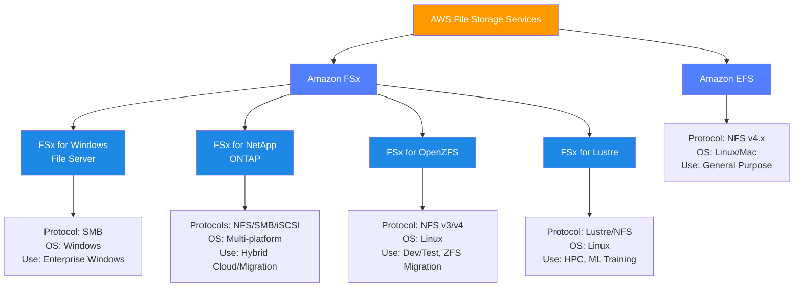
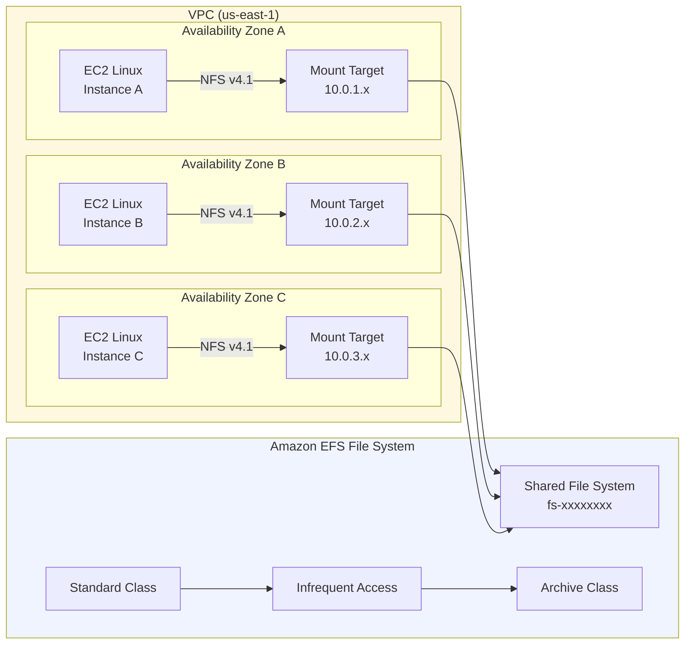
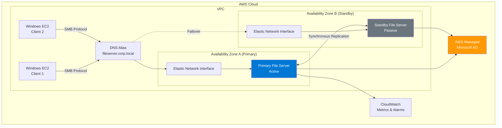
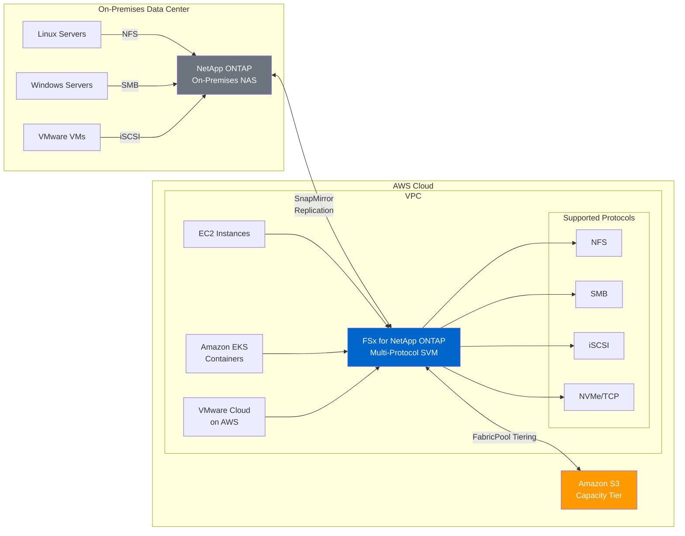
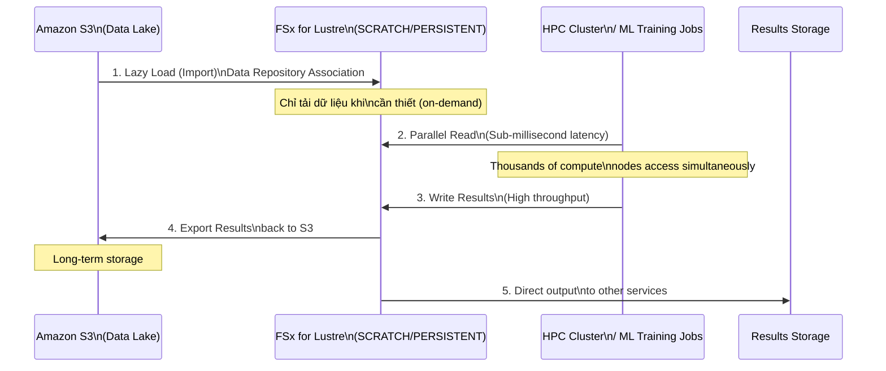

# AWS File Storage Services: Hướng Dẫn Học Tập Toàn Diện

---

## 1. Overview & The "Why"

### Định nghĩa

**File Storage** là mô hình lưu trữ dữ liệu theo cấu trúc phân cấp thư mục (hierarchical directory structure), nơi dữ liệu được tổ chức thành các tệp và thư mục giống như hệ thống tệp truyền thống. Trên AWS, các dịch vụ File Storage được quản lý hoàn toàn (managed), nghĩa là AWS chịu trách nhiệm về hạ tầng, patching, và tính sẵn sàng cao.

### Vấn đề thực tế được giải quyết

Trong môi trường doanh nghiệp, nhiều ứng dụng yêu cầu chia sẻ dữ liệu đồng thời từ nhiều máy chủ (EC2, on-premises, containers). Các giải pháp truyền thống như NAS tự quản lý đòi hỏi đầu tư phần cứng lớn, khó scale, và rủi ro về single point of failure. AWS File Storage Services giải quyết các vấn đề:

- **Chia sẻ tệp đồng thời** giữa hàng nghìn instance/client mà không cần quản lý hạ tầng.
- **Tương thích giao thức** (NFS, SMB, iSCSI, NVMe/TCP) với hệ thống hiện có.
- **Tự động scale** dung lượng theo nhu cầu thực tế.
- **Độ bền và tính sẵn sàng cao** theo SLA của AWS.

### Analogy

> **Hãy tưởng tượng AWS File Storage như một hệ thống tủ hồ sơ chia sẻ trong văn phòng lớn.**
> - **Amazon EFS** = Tủ hồ sơ mở (không khóa) ở hành lang chung — ai cũng có thể lấy tài liệu cùng lúc, tủ tự động mở rộng khi bạn bỏ thêm hồ sơ vào.
> - **FSx for Windows** = Tủ hồ sơ trong phòng IT của công ty Microsoft — chỉ máy tính Windows mới có chìa khóa, tích hợp hệ thống phân quyền Active Directory.
> - **FSx for NetApp ONTAP** = Tủ hồ sơ cao cấp của ngân hàng — hỗ trợ mọi loại chìa khóa (NFS, SMB, iSCSI), có tính năng snapshot tức thì và nhân bản dữ liệu.
> - **FSx for OpenZFS** = Tủ hồ sơ kỹ thuật cao với khả năng nén và snapshot siêu nhanh — lý tưởng cho lập trình viên cần môi trường dev/test.
> - **FSx for Lustre** = Kho lưu trữ siêu tốc trong nhà máy — thiết kế cho luồng dữ liệu khổng lồ với tốc độ cực cao, dùng cho HPC và AI/ML.

---

## 2. Core Components & Keywords

| Thuật ngữ | Giải thích |
|---|---|
| **NFS (Network File System)** | Giao thức chia sẻ tệp của Linux/Unix, cho phép mount từ xa qua mạng TCP/IP. |
| **SMB (Server Message Block)** | Giao thức chia sẻ tệp của Windows (còn gọi là CIFS), tích hợp với Active Directory. |
| **iSCSI** | Giao thức truyền lệnh SCSI qua mạng IP, dùng cho block storage. |
| **NVMe/TCP** | Giao thức NVMe (Non-Volatile Memory Express) trên TCP/IP, độ trễ cực thấp. |
| **Multi-AZ** | Triển khai tự động trên nhiều Availability Zone, đảm bảo High Availability. |
| **Single-AZ** | Triển khai trong một AZ duy nhất, chi phí thấp hơn nhưng ít redundancy. |
| **Mount Target** | Endpoint mạng (ENI) trong từng AZ để client kết nối đến EFS. |
| **Storage Classes** | Các tầng lưu trữ (Standard, IA, Archive) với chi phí và latency khác nhau. |
| **Intelligent-Tiering** | Tự động chuyển dữ liệu giữa các storage class dựa trên tần suất truy cập. |
| **Active Directory (AD)** | Dịch vụ thư mục của Microsoft, quản lý xác thực và phân quyền trong Windows. |
| **DFS Namespaces** | Distributed File System — cho phép tạo logical namespace chung cho nhiều share. |
| **Snapshot** | Bản sao điểm-thời-gian (point-in-time copy) của file system, dùng để backup/restore. |
| **Replication** | Nhân bản dữ liệu sang region/AZ khác để Disaster Recovery. |
| **Data Deduplication** | Loại bỏ dữ liệu trùng lặp để tiết kiệm dung lượng lưu trữ. |
| **Data Compression** | Nén dữ liệu trong suốt (transparent) để tối ưu storage. |
| **POSIX Compliance** | Tuân thủ chuẩn POSIX — đảm bảo tương thích với ứng dụng Linux/Unix truyền thống. |
| **Throughput Mode** | Cấu hình băng thông: Bursting, Provisioned, hoặc Elastic. |
| **FlexClone (ONTAP)** | Tạo bản sao (clone) tức thì của volume mà không tiêu tốn thêm dung lượng ban đầu. |
| **SCRATCH / PERSISTENT (Lustre)** | Hai loại deployment của FSx for Lustre: tạm thời vs bền vững. |

---

## 3. Visual Theory & Architecture

### 3.1 Tổng quan so sánh các dịch vụ File Storage



**Giải thích:** Sơ đồ cho thấy AWS chia file storage thành hai nhánh chính: **Amazon EFS** (native AWS, NFS-based) và **Amazon FSx** (managed third-party file systems). FSx gồm bốn biến thể phục vụ các use case đặc thù: Windows workloads, multi-protocol enterprise, ZFS-based dev/test, và HPC.

---

### 3.2 Kiến trúc Amazon EFS



**Giải thích từng bước:**
1. **Mount Target** được tạo trong mỗi AZ — đây là ENI (Elastic Network Interface) với IP nội bộ VPC.
2. Các EC2 instance kết nối đến Mount Target trong cùng AZ của mình qua giao thức `NFS v4.1`.
3. Tất cả Mount Target đều trỏ đến **cùng một EFS File System** — mọi instance đọc/ghi dữ liệu giống nhau.
4. **Lifecycle Management** tự động chuyển file từ `Standard` → `Infrequent Access` → `Archive` dựa trên thời gian không truy cập, giảm chi phí đáng kể.

---

### 3.3 Kiến trúc FSx for Windows File Server (Multi-AZ)



**Giải thích từng bước:**
1. **Primary File Server** chạy ở AZ-A, nhận toàn bộ traffic từ Windows clients qua SMB.
2. Dữ liệu được **replication đồng bộ** sang Standby File Server ở AZ-B liên tục.
3. Client kết nối qua **DNS Alias** — khi xảy ra failover, DNS tự động chuyển sang AZ-B mà không cần cấu hình lại client.
4. Cả hai server đều **join vào Active Directory** (AWS Managed AD hoặc Self-Managed AD on-premises).
5. **CloudWatch** giám sát các metric về throughput, IOPS, và disk usage.

---

### 3.4 Kiến trúc FSx for NetApp ONTAP — Hybrid Cloud Migration



**Giải thích từng bước:**
1. **SnapMirror** nhân bản dữ liệu từ ONTAP on-premises lên FSx for NetApp ONTAP trên AWS — đây là con đường migration chính.
2. **SVM (Storage Virtual Machine)** trong FSx ONTAP hỗ trợ đồng thời NFS, SMB, iSCSI, và NVMe/TCP — tất cả workload đều tương thích ngay lập tức.
3. **FabricPool Tiering** tự động chuyển cold data từ FSx ONTAP sang Amazon S3, giảm chi phí lưu trữ.
4. Sau migration, EC2, EKS containers, và VMware Cloud on AWS đều có thể truy cập cùng dữ liệu qua các giao thức phù hợp.

---

### 3.5 Kiến trúc FSx for Lustre — HPC & ML Workflow



**Giải thích từng bước:**
1. **Data Repository Association** liên kết FSx for Lustre với S3 bucket — dữ liệu được tải về **lazily** (chỉ khi file được request lần đầu).
2. HPC cluster hoặc ML training jobs đọc dữ liệu song song từ Lustre với **throughput lên đến hàng trăm GB/s** và độ trễ dưới millisecond.
3. Kết quả tính toán được ghi trở lại vào Lustre.
4. Kết quả được **export ngược về S3** để lưu trữ lâu dài với chi phí thấp.
5. Toàn bộ pipeline này phù hợp với Deep Learning training, genomics, financial modeling.

---

## 4. Detailed Deep Dive

### 4.1 Amazon EFS (Elastic File System)

#### Tính năng chính

- **Fully managed NFS**: Không cần provision dung lượng — tự động tăng/giảm theo dữ liệu thực.
- **Multi-AZ redundancy**: Dữ liệu được lưu trữ redundant trên nhiều AZ trong cùng Region.
- **Concurrent access**: Hàng nghìn EC2, Lambda, ECS, EKS instances cùng mount.
- **POSIX compliant**: Hỗ trợ đầy đủ file permissions, symbolic links, hard links.
- **Encryption**: At-rest (KMS) và in-transit (TLS).

#### Storage Classes & Lifecycle

| Storage Class | Use Case | Availability | Chi phí |
|---|---|---|---|
| `EFS Standard` | Dữ liệu truy cập thường xuyên | Multi-AZ | Cao nhất |
| `EFS Standard-IA` | Dữ liệu không thường xuyên | Multi-AZ | ~92% rẻ hơn Standard |
| `EFS One Zone` | Dev/test, không cần multi-AZ | Single-AZ | Rẻ hơn Standard |
| `EFS One Zone-IA` | Dev/test, ít truy cập | Single-AZ | Rẻ nhất |
| `EFS Archive` | Truy cập vài lần/năm | Multi-AZ | Rẻ nhất cho cold data |

#### Throughput Modes

| Mode | Phù hợp với | Cách tính |
|---|---|---|
| `Elastic` (mặc định) | Unpredictable workloads | Tự động scale, trả theo dùng |
| `Provisioned` | Consistent high throughput | Đặt trước băng thông cụ thể |
| `Bursting` | Legacy mode | Throughput tỷ lệ với dung lượng |

#### Performance Modes

- **`General Purpose`** (mặc định): Độ trễ thấp nhất, phù hợp hầu hết use cases.
- **`Max I/O`**: Throughput cao hơn, độ trễ cao hơn một chút — dùng cho big data, media processing.

> **Lưu ý quan trọng:** Performance Mode không thể thay đổi sau khi tạo file system.

---

### 4.2 Amazon FSx for Windows File Server

#### Tính năng chính

- **SMB Protocol**: Tương thích hoàn toàn với Windows, MacOS, và Linux (Samba).
- **Active Directory Integration**: Hỗ trợ AWS Managed Microsoft AD hoặc Self-Managed AD.
- **DFS Namespaces**: Tạo logical namespace thống nhất cho nhiều file shares.
- **Shadow Copies**: VSS-based snapshots cho phép self-service restore.
- **Data Deduplication**: Giảm dung lượng cho general purpose và user data workloads.
- **SSD và HDD storage**: Linh hoạt theo nhu cầu I/O.

#### Deployment Options

| Option | Mô tả | RTO | Chi phí |
|---|---|---|---|
| `Multi-AZ` | Primary + Standby, tự động failover | ~30 giây | Cao hơn |
| `Single-AZ` | Một AZ duy nhất, HA trong AZ | N/A (no failover) | Thấp hơn |

#### Các trường hợp đặc biệt

- **Windows Authentication**: Native Kerberos, NTLM authentication.
- **Audit Logging**: Ghi lại các hoạt động file truy cập vào CloudWatch Logs.
- **Storage Capacity**: 32 GiB đến 65,536 GiB.
- **Throughput**: 8 MBps đến 2,048 MBps.

---

### 4.3 Amazon FSx for NetApp ONTAP

#### Tính năng chính

- **Multi-Protocol**: NFS (v3, v4.1), SMB (v2, v3), iSCSI, NVMe/TCP trong một file system.
- **SVM (Storage Virtual Machine)**: Logical partition — mỗi SVM có thể có giao thức và phân quyền riêng.
- **FlexClone**: Tạo clone tức thì (writable snapshot) không tốn thêm dung lượng ban đầu.
- **SnapMirror**: Replication sang region khác hoặc sang ONTAP on-premises.
- **FabricPool**: Tự động tier cold data xuống S3.
- **Data Compression & Deduplication**: Inline và post-process.
- **NetApp SnapLock**: WORM (Write Once Read Many) cho compliance.

#### Deployment Architecture

```
FSx for NetApp ONTAP File System
├── SVM 1 (Production)
│   ├── NFS Volumes (Linux workloads)
│   └── SMB Shares (Windows workloads)
├── SVM 2 (DR/Backup)
│   └── SnapMirror destination volumes
└── SVM 3 (Dev/Test)
    └── FlexClone volumes (from Production)
```

#### Tại sao chọn ONTAP?

ONTAP là lựa chọn lý tưởng khi:
- **Lift-and-shift** từ NetApp on-premises lên AWS (dùng SnapMirror).
- Cần hỗ trợ **đồng thời nhiều giao thức** trên cùng dữ liệu.
- Môi trường **VMware on AWS** (vSphere NFS datastores).
- Yêu cầu **FlexClone** cho dev/test environments nhanh.

---

### 4.4 Amazon FSx for OpenZFS

#### Tính năng chính

- **ZFS File System**: Hỗ trợ NFS v3 và v4.x, tương thích Linux/Mac.
- **Sub-millisecond latency**: Phù hợp cho I/O-intensive workloads.
- **Copy-on-Write Snapshots**: Snapshot tức thì, không ảnh hưởng performance.
- **Data Compression**: LZ4 (mặc định), ZSTD, GZIP — transparent compression.
- **Native ZFS Features**: Checksums, data integrity verification.
- **Up to 1 million IOPS**: Với SSD-based deployment.

#### Deployment Types

| Type | Availability | Use Case |
|---|---|---|
| `Single-AZ 1` | 1 AZ | Dev/test, cost-sensitive |
| `Single-AZ 2` | 1 AZ, HA within AZ | Production within single AZ |
| `Multi-AZ` | 2 AZ, automatic failover | Production HA workloads |

#### ZFS Migration Scenario

OpenZFS là lựa chọn tốt nhất khi cần migrate workload từ **ZFS on-premises** (FreeBSD, Linux ZFS, Solaris) lên AWS mà không cần refactor ứng dụng.

---

### 4.5 Amazon FSx for Lustre

#### Tính năng chính

- **Lustre Protocol**: Parallel distributed file system, chuẩn công nghiệp trong HPC.
- **Massive Throughput**: Lên đến **1,000 GB/s** và hàng triệu IOPS.
- **S3 Integration**: Import/export dữ liệu với Amazon S3 (Data Repository Association).
- **POSIX Compliant**: Tương thích với Linux applications.
- **NVIDIA GPU direct storage**: Direct memory access từ GPU cluster.

#### Deployment Types

| Type | Persistence | Use Case | Chi phí |
|---|---|---|---|
| `SCRATCH_1` | Không persistent (không replicated) | Xử lý tạm thời, cost-first | Thấp nhất |
| `SCRATCH_2` | Không persistent nhưng higher throughput | Short burst jobs | Thấp |
| `PERSISTENT_1` | SSD-backed, replicated | Long-running HPC | Trung bình |
| `PERSISTENT_2` | SSD-backed, highest IOPS | Latency-sensitive ML | Cao nhất |

#### Data Repository Association (DRA)

```
S3 Bucket (s3://my-data-bucket/)
    └── Linked to FSx Lustre File System
        ├── Auto-import: Mới tạo/sửa trong S3 → tự động visible trong Lustre
        ├── Auto-export: Ghi trong Lustre → tự động push về S3
        └── Lazy load: File chỉ tải về khi được access lần đầu
```

> **Lưu ý quan trọng:** SCRATCH deployments **không thích hợp cho dữ liệu quan trọng** — dùng PERSISTENT khi cần durability. Khi file system bị xóa, SCRATCH data mất hoàn toàn.

---

## 5. Practical Scenarios & Integration

### Kịch bản 1: Kiến trúc CI/CD với EFS cho Shared Build Artifacts

**Bài toán:** Một công ty SaaS có pipeline CI/CD trên AWS CodeBuild cần chia sẻ build cache và artifacts giữa nhiều build job chạy song song.

**Giải pháp kiến trúc:**
- **EFS Standard** mount vào CodeBuild project qua VPC configuration.
- Build cache (node_modules, Maven dependencies) được lưu trên EFS — mỗi job đọc cache thay vì download lại.
- **EFS Lifecycle Policy**: Tự động chuyển cache cũ hơn 7 ngày sang `EFS-IA` để tiết kiệm chi phí.
- **Access Points** với UID/GID mapping đảm bảo mỗi project có thư mục riêng biệt với phân quyền POSIX đúng.

**Lợi ích:** Giảm 60–70% thời gian build, tiết kiệm chi phí data transfer và compute.

**IaC (Terraform):**

```hcl
resource "aws_efs_file_system" "build_cache" {
  creation_token   = "ci-cd-build-cache"
  throughput_mode  = "elastic"
  encrypted        = true
  kms_key_id       = aws_kms_key.efs_key.arn

  lifecycle_policy {
    transition_to_ia = "AFTER_7_DAYS"
  }

  lifecycle_policy {
    transition_to_archive = "AFTER_90_DAYS"
  }

  tags = {
    Name        = "CI/CD Build Cache"
    Environment = "production"
  }
}

resource "aws_efs_mount_target" "az_a" {
  file_system_id  = aws_efs_file_system.build_cache.id
  subnet_id       = aws_subnet.private_a.id
  security_groups = [aws_security_group.efs_sg.id]
}

resource "aws_efs_access_point" "project_ap" {
  file_system_id = aws_efs_file_system.build_cache.id

  posix_user {
    gid = 1000
    uid = 1000
  }

  root_directory {
    path = "/project-builds"
    creation_info {
      owner_gid   = 1000
      owner_uid   = 1000
      permissions = "755"
    }
  }
}
```

---

### Kịch bản 2: Hybrid Cloud Migration với FSx for NetApp ONTAP

**Bài toán:** Một tổ chức tài chính cần migrate 200 TB dữ liệu từ NetApp FAS on-premises lên AWS với **downtime gần bằng 0** và duy trì tính tương thích với cả Windows (SMB) và Linux (NFS) clients.

**Giải pháp kiến trúc:**
1. **Bước 1 — Setup:** Tạo FSx for NetApp ONTAP với Multi-AZ deployment trong VPC.
2. **Bước 2 — Replication:** Thiết lập **SnapMirror relationship** từ ONTAP on-premises → FSx ONTAP. Dữ liệu ban đầu được transfer qua AWS Direct Connect hoặc VPN.
3. **Bước 3 — Sync:** SnapMirror chạy incremental replication liên tục, giữ FSx ONTAP đồng bộ với on-premises.
4. **Bước 4 — Cutover:** Vào maintenance window, thực hiện **final SnapMirror sync**, break SnapMirror relationship, update DNS để client trỏ về FSx ONTAP endpoint.
5. **Bước 5 — Decommission:** Sau khi verify, tắt NAS on-premises.

**Privacy-by-Design:** Toàn bộ dữ liệu mã hóa in-transit (TLS) và at-rest (KMS). **NetApp SnapLock** enable cho volumes chứa dữ liệu giao dịch tài chính để đảm bảo compliance (WORM).

**IaC (Terraform):**

```hcl
resource "aws_fsx_ontap_file_system" "main" {
  storage_capacity    = 204800  # 200 TB in GB
  subnet_ids          = [aws_subnet.private_a.id, aws_subnet.private_b.id]
  deployment_type     = "MULTI_AZ_1"
  preferred_subnet_id = aws_subnet.private_a.id
  throughput_capacity = 1024  # MB/s

  disk_iops_configuration {
    mode = "AUTOMATIC"
  }

  tags = {
    Name    = "Financial Data FSx ONTAP"
    Project = "Cloud Migration"
  }
}

resource "aws_fsx_ontap_storage_virtual_machine" "prod_svm" {
  file_system_id = aws_fsx_ontap_file_system.main.id
  name           = "prod-svm"

  active_directory_configuration {
    netbios_name = "FSPROD"
    self_managed_active_directory_configuration {
      dns_ips                                = ["10.0.1.10", "10.0.1.11"]
      domain_name                            = "corp.example.com"
      password                               = var.ad_password
      username                               = var.ad_username
      organizational_unit_distinguished_name = "OU=FSx,DC=corp,DC=example,DC=com"
    }
  }
}
```

---

### Kịch bản 3: ML Training Pipeline với FSx for Lustre

**Bài toán:** Team Data Science cần train một Large Language Model với 10 TB training data lưu trên S3, sử dụng cluster EC2 P4d instances.

**Giải pháp kiến trúc:**
1. Tạo **FSx for Lustre PERSISTENT_2** và associate với S3 bucket chứa training data.
2. Configure **Data Repository Association** với `auto_import_policy = "NEW_CHANGED"`.
3. Launch EC2 P4d cluster và mount Lustre file system.
4. Training job đọc data song song từ Lustre — throughput đạt **500+ GB/s**.
5. Model checkpoints được ghi vào Lustre, auto-export về S3.
6. Sau khi training xong, xóa FSx Lustre để tiết kiệm chi phí (data an toàn trên S3).

**IaC (Terraform):**

```hcl
resource "aws_fsx_lustre_file_system" "ml_training" {
  storage_capacity              = 12000  # GB, covers 10 TB + buffer
  subnet_ids                    = [aws_subnet.private_a.id]
  deployment_type               = "PERSISTENT_2"
  per_unit_storage_throughput   = 500  # MB/s per TiB
  data_compression_type         = "LZ4"

  tags = {
    Name    = "ML Training Lustre"
    Project = "LLM-Training-2025"
  }
}

resource "aws_fsx_data_repository_association" "s3_link" {
  file_system_id       = aws_fsx_lustre_file_system.ml_training.id
  data_repository_path = "s3://my-ml-datasets/"
  file_system_path     = "/datasets"

  s3 {
    auto_import_policy {
      events = ["NEW", "CHANGED", "DELETED"]
    }
    auto_export_policy {
      events = ["NEW", "CHANGED", "DELETED"]
    }
  }
}
```

---

## 6. Exam Essentials & Pro Tips

### 6.1 Bẫy thường gặp trong kỳ thi (Exam Traps)

| Tình huống | Câu trả lời SAI (Bẫy) | Câu trả lời ĐÚNG |
|---|---|---|
| Windows file share + AD integration | EFS | **FSx for Windows File Server** |
| Lift-and-shift từ NetApp on-premises | FSx for OpenZFS | **FSx for NetApp ONTAP** (SnapMirror support) |
| HPC workload cần throughput cực cao + S3 integration | EFS | **FSx for Lustre** |
| Linux workloads, multiple EC2, auto-scaling storage | EBS Multi-Attach | **Amazon EFS** |
| Dev/test environment cần snapshot nhanh + ZFS migration | FSx for Lustre | **FSx for OpenZFS** |
| EFS Performance Mode sau khi tạo | Có thể thay đổi | **Không thể thay đổi** sau khi tạo |
| FSx Lustre SCRATCH data sau khi xóa file system | Được giữ lại | **Mất hoàn toàn** — cần PERSISTENT nếu cần durability |
| EFS vs EBS cho Lambda | EBS (không mount được) | **EFS** — Lambda hỗ trợ EFS mount |

---

### 6.2 So sánh nhanh: Khi nào dùng gì?

| Tiêu chí | EFS | FSx Windows | FSx ONTAP | FSx OpenZFS | FSx Lustre |
|---|---|---|---|---|---|
| **OS chính** | Linux | Windows | Multi | Linux | Linux |
| **Protocol** | NFS | SMB | NFS/SMB/iSCSI | NFS | Lustre |
| **Multi-protocol** | ❌ | ❌ | ✅ | ❌ | ❌ |
| **AD Integration** | ❌ | ✅ Native | ✅ | ❌ | ❌ |
| **S3 Integration** | ❌ | ❌ | FabricPool | ❌ | ✅ Native DRA |
| **Max Throughput** | ~3 GB/s | ~2 GB/s | ~36 GB/s | ~21 GB/s | **>1 TB/s** |
| **Auto-scale capacity** | ✅ | ❌ | ❌ | ❌ | ❌ |
| **Lowest Latency** | ~1ms | ~1ms | Sub-ms | **Sub-ms** | Sub-ms |
| **On-prem migration** | Phức tạp | Windows NAS | **SnapMirror** | ZFS migration | ❌ |

---

### 6.3 Best Practices

#### Cost Optimization

- **EFS Lifecycle Policy**: Luôn enable lifecycle management để tự động chuyển cold data sang IA/Archive. Tiết kiệm được đến **92%** so với Standard class.
- **EFS One Zone**: Dùng cho dev/test environments — rẻ hơn ~47% so với Standard.
- **FSx Lustre SCRATCH**: Chỉ dùng cho transient data — đừng dùng cho data cần giữ lâu dài.
- **FSx ONTAP FabricPool**: Configure tiering để cold blocks tự động xuống S3.
- **Right-sizing**: Với FSx Windows và ONTAP, chọn đúng throughput capacity — đây là thông số ảnh hưởng lớn đến chi phí.

#### Security (IAM & Network)

- **EFS**: Dùng **IAM policies** kết hợp với **EFS Access Points** để enforce POSIX identity. Enable encryption at-rest với KMS Customer Managed Keys.
- **Security Groups**: Chỉ allow inbound port `2049` (NFS) từ EC2 Security Group, không dùng CIDR rộng.
- **FSx Windows**: Integrate với AWS Managed AD thay vì self-managed khi có thể — đơn giản hơn và AWS-managed.
- **Network ACLs**: Đặt file systems trong **private subnets**, không bao giờ expose ra public subnet.
- **VPC Endpoints**: Dùng Interface VPC Endpoints cho management API calls để traffic không đi ra internet.
- **AWS Backup**: Sử dụng AWS Backup để tập trung quản lý backup policy cho tất cả FSx file systems.

#### Performance

- **EFS Elastic Throughput**: Sử dụng làm mặc định cho hầu hết workloads — Provisioned chỉ khi biết chính xác throughput cần.
- **FSx Lustre**: Chọn `per_unit_storage_throughput` phù hợp (125, 250, 500, 1000 MB/s/TiB) trước khi tạo — không thể thay đổi sau.
- **Mount Options**: Luôn dùng `amazon-efs-utils` với `tls` option khi mount EFS để có encryption in-transit và optimized performance.
- **Lustre Client**: Cài đặt và sử dụng đúng phiên bản Lustre client tương thích với kernel version của EC2.

> **Pro Tip cho kỳ thi:** Khi câu hỏi đề cập đến **"Windows workload" + "Active Directory"** → Ngay lập tức nghĩ đến **FSx for Windows**. Khi đề cập **"HPC" hoặc "machine learning" + "high throughput" + "S3"** → Đây là **FSx for Lustre**. Khi đề cập **"migrate NetApp" hoặc "multi-protocol"** → Đây là **FSx for NetApp ONTAP**.

