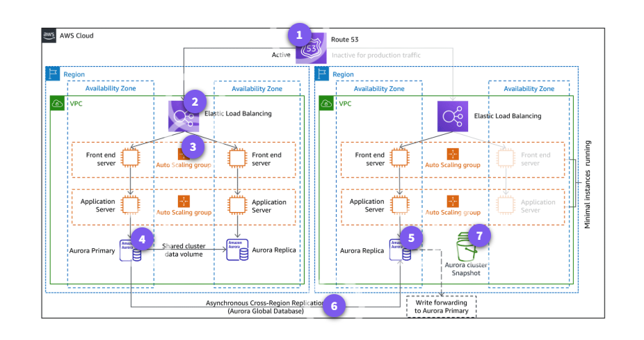

Chào bạn, với tư cách là một **AWS Certified Solutions Architect**, tôi đã hệ thống lại toàn bộ nội dung về **Amazon Aurora** dựa trên yêu cầu và hình ảnh sơ đồ kiến trúc bạn cung cấp. Đây là tài liệu học tập chuyên nghiệp dành cho lộ trình chinh phục chứng chỉ AWS.

---

# Amazon Aurora: Giải pháp Cơ sở dữ liệu Quan hệ Thế hệ mới (Cloud-Native)

## Overview

**Amazon Aurora** là một cơ sở dữ liệu quan hệ (RDBMS) được xây dựng riêng cho điện toán đám mây, tương thích hoàn toàn với **MySQL** và **PostgreSQL**.

**Mục đích:**

- Kết hợp tốc độ và tính khả dụng của các cơ sở dữ liệu thương mại cao cấp (như Oracle, SQL Server) với sự đơn giản và chi phí thấp của các cơ sở dữ liệu mã nguồn mở.

**Vấn đề giải quyết:**

- Loại bỏ các giới hạn về hạ tầng truyền thống như việc quản lý ổ đĩa, độ trễ khi sao chép dữ liệu (replication lag) và quá trình phục hồi sau sự cố chậm chạp.

---

## Key Concepts & Keywords

Để hiểu về Aurora, bạn cần nắm vững các thuật ngữ "sống còn" sau:

- **Shared Storage Volume:** Một lớp lưu trữ ảo duy nhất, dùng chung cho tất cả các Instances trong Cluster. Nó tự động mở rộng lên đến **128 TiB**.
- **Aurora Replicas:** Các bản sao chỉ đọc (Read Replicas). Aurora hỗ trợ tối đa lên đến **15 Replicas** với độ trễ cực thấp (thường < 10ms).
- **Quorum-based Storage:** Dữ liệu được sao chép thành **6 bản** tại **3 Availability Zones (AZs)**. Chỉ cần 4/6 bản để xác nhận ghi thành công và 3/6 bản để đọc thành công.
- **Aurora Global Database:** Cho phép một cơ sở dữ liệu duy nhất trải dài trên nhiều AWS Regions, giúp phục hồi sau thảm họa cấp châu lục và giảm độ trễ cho người dùng toàn cầu.
- **Aurora Serverless:** Phiên bản tự động bật/tắt và tăng/giảm tài nguyên dựa trên lưu lượng thực tế, giúp tối ưu chi phí cho các tải công việc không ổn định.

---

## Detailed Deep Dive

### 1. Kiến trúc lưu trữ (The Storage Layer)

Khác với RDS thông thường gắn vào EBS, Aurora tách biệt lớp tính toán (Compute) và lớp lưu trữ (Storage).

- **Tính tự phục hồi:** Nếu một bản sao dữ liệu bị hỏng, Aurora tự động quét và sửa chữa dựa trên các bản sao còn lại mà không ảnh hưởng đến hiệu suất.
- **Backup không gây gián đoạn:** Việc sao lưu được thực hiện liên tục lên **Amazon S3** mà không gây ảnh hưởng đến hiệu năng của Database Instance.

### 2. Phân tích sơ đồ High Availability & Disaster Recovery

**Hình 1:** Kiến trúc Aurora Multi-Region với High Availability và Disaster Recovery

Sơ đồ minh họa một kiến trúc **Multi-Region** với khả năng chịu lỗi cực cao:

- **(1) Route 53:** Đóng vai trò điều hướng traffic. Nếu một Region gặp sự cố, Route 53 sẽ chuyển hướng người dùng sang Region dự phòng.
- **(2) & (3) Elastic Load Balancing & Auto Scaling:** Đảm bảo lớp Application (Frontend/App Server) luôn sẵn sàng và co giãn theo tải.
- **(4) Aurora Primary (Region A):** Nơi thực hiện các tác vụ Ghi (Write). Dữ liệu được lưu trữ trong một **Shared Cluster Volume** trải dài các AZs.
- **(5) & (6) Aurora Global Database:** Dữ liệu được sao chép **không đồng bộ (Asynchronous)** từ Region chính sang Region phụ. Điều này đảm bảo nếu toàn bộ Region A sụp đổ, Region B có thể được nâng cấp lên thành Primary chỉ trong vài giây.
- **(7) Aurora Cluster Snapshot:** Các bản sao lưu được lưu trữ an toàn trên **Amazon S3**.

### 3. Khả năng tương tác giữa các thành phần

- **Compute Instances:** Chỉ làm nhiệm vụ xử lý câu lệnh SQL.
- **Log Processing:** Thay vì đẩy toàn bộ khối dữ liệu lớn qua mạng, Aurora chỉ đẩy các **Log Records** đến lớp lưu trữ, giúp giảm lưu lượng mạng và tăng tốc độ ghi gấp 5 lần so với MySQL tiêu chuẩn.

---

## Practical Examples & Scenarios

**Kịch bản 1: Hệ thống E-commerce toàn cầu**

- Sử dụng **Aurora Global Database**. Người dùng ở Mỹ đọc dữ liệu từ Region Mỹ, người dùng ở Việt Nam đọc từ Region Châu Á. Dữ liệu vẫn đồng nhất nhưng tốc độ truy cập (Latency) cực nhanh.

**Kịch bản 2: Ứng dụng quản lý nội bộ có lượng truy cập thất thường**

- Sử dụng **Aurora Serverless**. Database sẽ tự "ngủ" vào ban đêm (khi không có ai dùng) để tiết kiệm 100% chi phí tài nguyên tính toán và tự động "thức dậy" khi có yêu cầu vào sáng hôm sau.

---

## Exam Essentials & Tips

> **Lưu ý quan trọng:** Amazon Aurora thường xuyên xuất hiện trong các câu hỏi |
> | **Tính sẵn sàng** | Mặc định lưu 6 bản sao trên 3 AZs. Chịu được việc mất 1 AZ + 1 node dữ liệu mà vẫn ghi được |
> | **Chi phí (Billing)** | Tính dựa trên: Instance type (theo giờ), Dung lượng lưu trữ (GB/tháng), và số lượng I/O request |
> | **Failover** | Thời gian Failover thường dưới 30 giây (nhanh hơn nhiều so với RDS Multi-AZ thông thường) |
> | **Bảo mật** | Hỗ trợ mã hóa dữ liệu khi nghỉ (at rest) bằng **AWS KMS** và mã hóa trên đường truyền (in transit) bằng SSL |

**Lời khuyên từ Architect:** Khi gặp câu hỏi yêu cầu một Database có khả năng mở rộng (Scalability) cao cho các ứng dụng Enterprise mà vẫn đảm bảo tính tương thích SQL, **Amazon Aurora** luôn là câu trả lời ưu tiên hàng đầu.

