# Data Modeling for Amazon ElastiCache for Redis

---

## Overview

**Amazon ElastiCache for Redis** là dịch vụ in-memory data store được quản lý hoàn toàn bởi AWS, tương thích với Redis engine. Khác với cơ sở dữ liệu quan hệ (SQL) vốn tổ chức dữ liệu theo bảng và mối quan hệ, ElastiCache được thiết kế tối ưu cho **tốc độ và khả năng mở rộng** (speed & scalability).

> **Vấn đề thực tế nó giải quyết:** Khi ứng dụng có lượng truy cập lớn, việc truy vấn trực tiếp vào cơ sở dữ liệu quan hệ (RDS, Aurora...) mỗi request sẽ gây quá tải và làm chậm trải nghiệm người dùng. ElastiCache đứng giữa ứng dụng và database, lưu trữ dữ liệu thường dùng trong bộ nhớ RAM để trả về kết quả gần như tức thì.

**Hai engine được hỗ trợ:**

- `ElastiCache for Redis` — đa dạng data types, hỗ trợ persistence, pub/sub, streams
- `ElastiCache for Memcached` — đơn giản hơn, chỉ lưu string

> Khóa học này tập trung vào **Redis engine**.

---

## Key Concepts & Keywords

| Từ khóa                | Bản chất                                                                                   |
| ---------------------- | ------------------------------------------------------------------------------------------ |
| **Data Modeling**      | Phân tích access patterns và cấu trúc dữ liệu tối ưu _trước_ khi xây dựng                  |
| **Key-Value Store**    | Mọi dữ liệu được truy cập qua một **key** duy nhất — không có quan hệ giữa các key         |
| **Flat Keyspace**      | Tất cả keys nằm cùng một không gian phẳng, không có phân cấp hay folder                    |
| **Key Immutability**   | Key không thể đổi tên sau khi tạo — chỉ có thể xóa và tạo lại                              |
| **TTL (Time To Live)** | Hẹn giờ tự động xóa key, dùng lệnh `EXPIRE`                                                |
| **Time Complexity**    | Mỗi Redis command có độ phức tạp riêng (O(1), O(n)...) — ảnh hưởng trực tiếp đến hiệu năng |
| **Binary Safe Keys**   | Key có thể là bất kỳ chuỗi bytes nào, kể cả binary                                         |

---

## Detailed Deep Dive

### Keys — Cách duy nhất để truy cập dữ liệu

Key trong Redis là **cổng vào duy nhất** để truy cập mọi giá trị. Không có bảng, không có index phụ — chỉ có key.

#### Quy tắc đặt tên key

Vì ElastiCache không có khái niệm "bảng" như SQL, thông tin ngữ cảnh phải được nhúng thẳng vào tên key. Quy ước chuẩn:

```
object-type:id:field
```

**Ví dụ so sánh:**

```
SQL:        TABLE students  →  row WHERE id = 8976
Redis:      KEY "student:8976"  →  lưu toàn bộ thông tin sinh viên đó
```

> **Lưu ý quan trọng:** Key size tối đa là **512 MB**. Tuy nhiên, key ngắn gọn và có ý nghĩa là best practice.

#### Tránh ghi đè dữ liệu ngoài ý muốn

Redis **không cảnh báo** khi bạn ghi đè lên một key đã tồn tại. Luôn kiểm tra trước bằng `EXISTS`:

```
EXISTS student:8976   → trả về 1 (tồn tại) hoặc 0 (không tồn tại)
```

#### Key-level Operations (hoạt động trên mọi data type)

| Lệnh                 | Chức năng                            |
| -------------------- | ------------------------------------ |
| `DEL key`            | Xóa toàn bộ key và giá trị liên quan |
| `EXISTS key`         | Kiểm tra key có tồn tại không        |
| `EXPIRE key seconds` | Đặt TTL — key tự xóa sau N giây      |
| `TTL key`            | Xem thời gian sống còn lại của key   |

---

### Time Complexity — Chọn command đúng để tối ưu hiệu năng

Mỗi Redis command có một độ phức tạp thời gian. Đây là yếu tố **quyết định hiệu năng** khi dữ liệu tăng trưởng.

```
Ưu tiên chọn theo thứ tự: O(1) > O(log n) > O(n) > O(n²)
```

| Độ phức tạp  | Ý nghĩa                                          | Ví dụ Redis command                |
| ------------ | ------------------------------------------------ | ---------------------------------- |
| **O(1)**     | Hằng số — nhanh nhất, không phụ thuộc kích thước | `SET`, `GET`, `LPUSH`, `RPOP`      |
| **O(log n)** | Logarithmic — nhanh, "worst case" là n           | `ZRANK` trên sorted set            |
| **O(n)**     | Tuyến tính — chậm dần khi data lớn               | `HGETALL`, `LINDEX`, `LINSERT`     |
| **O(n²)**    | Mũ — tốn kém nhất, tránh dùng trong production   | `SINTER` (intersection nhiều sets) |

> **Quy tắc thực tế:** Trước khi chọn data type, hãy đọc mục **Performance** trong Redis docs của data type đó. Một list lớn mà dùng `LINDEX` ở giữa sẽ rất chậm — hãy dùng `LPUSH/RPOP` (O(1)) thay thế.

---

### Data Types — Trái tim của Redis Data Modeling

Đây là lý do chính khiến data modeling với Redis quan trọng: **chọn sai data type = hiệu năng kém**.

```
┌─────────────────────────────────────────────────────────────────┐
│                   ElastiCache for Redis                          │
│                                                                  │
│  ┌──────────┐  ┌──────────┐  ┌──────────┐  ┌──────────────┐   │
│  │ Strings  │  │  Hashes  │  │  Lists   │  │    Sets      │   │
│  └──────────┘  └──────────┘  └──────────┘  └──────────────┘   │
│  ┌─────────────┐  ┌─────────────┐  ┌──────────────────────┐   │
│  │ Sorted Sets │  │ Geospatial  │  │       Streams        │   │
│  └─────────────┘  └─────────────┘  └──────────────────────┘   │
└─────────────────────────────────────────────────────────────────┘
```

#### Strings

- **Bản chất:** Lưu bất kỳ chuỗi bytes nào — text, JSON, binary, serialized objects
- **Giới hạn:** Tối đa `512 MB`
- **Dùng khi:** Cache database response, session token, counter (dùng `INCR`)
- **TTL:** Rất phổ biến — đặt expire để tự xóa cache cũ

```
Ví dụ: Cache kết quả query "Newly Added Books" → lưu JSON response dưới 1 string key
Key: "cache:homepage:new_books"
Value: "[{title: 'Book A', ...}, ...]"
EXPIRE cache:homepage:new_books 3600   ← tự xóa sau 1 giờ
```

#### Hashes

- **Bản chất:** Tập hợp các cặp field-value — giống một object/record
- **Dùng khi:** Lưu object có nhiều thuộc tính (user profile, product info)
- **Lợi thế:** Có thể cập nhật từng field riêng lẻ, không cần đọc-ghi toàn bộ object

```
Ví dụ: User profile
Key: "user:9876"
Fields: username="jsouza", firstname="jorge", lastname="souza", tier="premium"

Tốt hơn String vì: chỉ cần HGET user:9876 username thay vì parse cả JSON
```

> **So sánh:** Dùng Hash khi object có nhiều thuộc tính riêng biệt. Dùng String khi chỉ cần lưu/đọc toàn bộ giá trị một lúc.

#### Lists

- **Bản chất:** Linked list các string, duy trì thứ tự chèn vào
- **Giới hạn:** Tối đa `2^32` elements
- **Dùng khi:** Queue (FIFO), Stack (LIFO), activity feed, task queue
- **Hiệu năng:** Truy cập đầu/cuối là `O(1)` — truy cập giữa là `O(n)`

```
Ví dụ: Task queue cho workers
LPUSH tasks "send_email:user123"    ← thêm vào đầu
RPOP tasks                          ← worker lấy từ cuối (FIFO)
```

#### Sets

- **Bản chất:** Tập hợp các string **không trùng lặp**, không có thứ tự
- **Giới hạn:** Tối đa `2^32` members
- **Dùng khi:** Tracking unique values (order IDs, user IDs đã xem bài viết)
- **Lợi thế:** Tự động reject duplicate — không cần kiểm tra trước khi thêm

```
Ví dụ: Tracking user đã xem sản phẩm
SADD product:456:viewers "user:111" "user:222" "user:111"
→ Set chỉ chứa: {"user:111", "user:222"}  (trùng bị loại tự động)
```

> **Cảnh báo O(n²):** `SINTER` (giao của nhiều sets) có complexity cao — tránh dùng trên sets lớn trong production.

#### Sorted Sets

- **Bản chất:** Giống Set nhưng mỗi member có thêm một **score** (số thực) để sắp xếp
- **Dùng khi:** Leaderboard, ranking sản phẩm theo rating, bảng xếp hạng game
- **Lợi thế:** Việc sắp xếp được **tính sẵn** khi insert — query rank rất nhanh

```
Ví dụ: Game leaderboard
ZADD leaderboard 2450 "gamer:alice"
ZADD leaderboard 1890 "gamer:bob"
ZADD leaderboard 3100 "gamer:carol"

ZRANK leaderboard "gamer:alice"     → vị trí của alice (O(log n))
ZRANGE leaderboard 0 9 WITHSCORES  → top 10 (O(log n + k))
```

#### Geospatial

- **Bản chất:** Extension của Sorted Set — lưu tọa độ (longitude, latitude)
- **Dùng khi:** Ứng dụng cần tìm địa điểm gần nhất, tính khoảng cách
- **Use cases:** Food delivery, rideshare, dating apps, logistics

```
Ví dụ: Tìm điểm du lịch trong bán kính 5km
GEOADD locations 13.361389 38.115556 "Colosseum"
GEOADD locations 12.482369 41.897605 "Vatican"
GEODIST locations "Colosseum" "Vatican" km  → 233.59 km
GEORADIUS locations 13.0 38.0 50 km         → các địa điểm trong 50km
```

#### Streams

- **Bản chất:** Append-only log — dữ liệu chỉ được thêm vào, không sửa hay xóa
- **Dùng khi:** Buffer giữa producer và consumer, IoT data ingestion, event sourcing
- **Lợi thế:**
  - Đảm bảo **at-least-once delivery** (đọc không xóa message)
  - Duy trì **thứ tự** nhận message
  - Nhiều consumer group có thể đọc độc lập

```
Ví dụ: IoT sensor data pipeline
XADD temperature:sensors * location "Atlantic-17" temp "28.8"
XADD temperature:sensors * location "Atlantic-42" temp "31.2"

→ Nhiều microservices đọc và xử lý bất đồng bộ
→ Message không mất dù consumer xử lý chậm hơn producer
```

---

## Practical Examples & Scenarios

### Scenario 1 — Database Caching (Cache-aside Pattern)

**Nhân vật:** Diego — developer cho chuỗi nhà sách  
**Vấn đề:** Homepage "Newly Added Books" bị truy cập liên tục, gây quá tải RDS/Aurora.
**Description:** Ứng dụng kiểm tra Redis trước. Nếu `Cache HIT` thì trả kết quả ngay; nếu `Cache MISS` thì truy vấn RDS/Aurora, ghi lại vào Redis kèm TTL, rồi trả về cho người dùng.

<p align="center"></p>

Cache HIT: ứng dụng đọc từ ElastiCache và trả kết quả gần như tức thì.  
Cache MISS: ứng dụng query RDS/Aurora, sau đó ghi ngược vào Redis với TTL để các request sau dùng lại.

**Data type:** `String`  
**Key pattern:** `cache:homepage:new_books`  
**TTL khuyến nghị:** `EXPIRE 3600`

---

### Scenario 2 — Session Store cho Serverless Application

**Nhân vật:** Team backend ứng dụng serverless  
**Vấn đề:** Nhiều Lambda instance cần chia sẻ session, không thể phụ thuộc sticky session.
**Description:** ElastiCache đóng vai trò session store tập trung để mọi Lambda instance đọc/ghi cùng một trạng thái người dùng, đảm bảo request đi vào instance nào cũng giữ được phiên làm việc nhất quán.

<p align="center"></p>

Mỗi Lambda đọc/ghi session qua Redis (`HGET`/`HSET`) với key dạng `session:<token>`. Session nhất quán dù request đi vào bất kỳ instance nào.

**Data type:** `Hash`  
**Key pattern:** `session:<token>`  
**TTL khuyến nghị:** `EXPIRE 1800`

---

### Scenario 3 — Real-time Leaderboard cho Game

**Nhân vật:** Ana — database engineer cho game studio  
**Vấn đề:** Leaderboard tải chậm và thứ hạng không cập nhật kịp thời.
**Description:** Game server ghi điểm vào Sorted Set bằng `ZADD`; Redis tự duy trì thứ tự theo score, giúp truy vấn top bảng và thứ hạng cá nhân theo thời gian thực với độ trễ thấp.

<p align="center"></p>

Game server ghi điểm bằng `ZADD`, Redis tự sắp xếp theo score. Client lấy top N bằng `ZREVRANGE` và lấy hạng cá nhân bằng `ZRANK`.

**Data type:** `Sorted Set`  
**Lệnh chính:** `ZADD`, `ZRANK`, `ZREVRANGE`, `ZSCORE`  
**Độ phức tạp:** Truy vấn rank ở mức `O(log n)`

---

### Scenario 4 — Real-time IoT Data Streaming

**Nhân vật:** Li — technical lead cơ quan khí tượng  
**Vấn đề:** Hàng nghìn sensor IoT gửi dữ liệu liên tục, cần nhiều consumer xử lý độc lập.
**Description:** Redis Streams tiếp nhận dữ liệu cảm biến theo dạng append-only log; nhiều consumer group có thể đọc độc lập để phân tích bất thường, dự báo và lưu trữ mà không làm mất message.

<p align="center"></p>

Sensors ghi event bằng `XADD` vào Redis Stream. Nhiều consumer group xử lý song song: phát hiện bất thường, dự báo, lưu trữ archive.

**Data type:** `Streams`  
**Lệnh chính:** `XADD`, `XREADGROUP`, `XACK`  
**Lợi ích:** At-least-once delivery, giữ thứ tự, chịu lỗi tốt khi consumer chậm/crash

---

## Exam Essentials & Tips

### Data Type Selection — Chọn đúng từ đầu, khó đổi sau

> **Critical:** Data structures trong ElastiCache **không dễ thay đổi sau khi tạo**. Access patterns cần được xác định kỹ trước khi design.

| Use Case                        | Data Type phù hợp | Lý do                         |
| ------------------------------- | ----------------- | ----------------------------- |
| Cache database response         | **String**        | Đơn giản, TTL dễ quản lý      |
| Lưu user profile (nhiều fields) | **Hash**          | Truy cập từng field riêng     |
| Task queue / Message queue      | **List**          | FIFO/LIFO, O(1) ở đầu/cuối    |
| Unique tracking (order IDs)     | **Set**           | Auto-reject duplicate         |
| Leaderboard, ranking            | **Sorted Set**    | Sort sẵn, query rank O(log n) |
| Location-based features         | **Geospatial**    | Built-in distance calculation |
| IoT / Event streaming           | **Streams**       | At-least-once, multi-consumer |

---

### Performance — Time Complexity là kiến thức bắt buộc

> **Exam tip:** Câu hỏi hay hỏi "command nào phù hợp cho use case cần phản hồi nhanh?". Luôn ưu tiên `O(1)` hoặc `O(log n)`.

- `LPUSH` / `RPOP` → `O(1)` ✅ dùng cho queue
- `LINDEX` / `LINSERT` → `O(n)` ⚠️ tránh trên list lớn
- `SINTER` (set intersection) → `O(n²)` ❌ tránh trong production
- `ZRANK` (sorted set rank) → `O(log n)` ✅ dùng cho leaderboard

---

### Key Design — Tránh lỗi phổ biến

- **Flat keyspace:** Không có folder hay hierarchy — toàn bộ keys cùng một cấp
- **Key immutable:** Không đổi tên được — đặt tên cẩn thận từ đầu
- **Không có warning khi overwrite:** Luôn dùng `EXISTS` trước `SET` nếu muốn an toàn
- **Naming convention:** Dùng format `object-type:id` (ví dụ: `student:8976`, `user:9876`)

---

### Billing & Resource Optimization

- **TTL là công cụ tiết kiệm chi phí:** Dữ liệu cache không còn cần thiết nên tự xóa để giải phóng RAM
- **Memory là tài nguyên giới hạn:** Khác với S3 hay RDS, ElastiCache lưu hoàn toàn trong RAM — chọn data type nhỏ gọn
- **Eviction policy:** Khi RAM đầy, ElastiCache có thể tự xóa keys theo policy (LRU, LFU...) — cấu hình phù hợp với use case

---

### Security

- ElastiCache nằm trong **VPC** — không expose ra internet trực tiếp
- Dùng **Security Groups** để kiểm soát access từ EC2/Lambda
- **Encryption in transit** (TLS) và **at rest** được hỗ trợ
- **Auth token** (Redis AUTH) để xác thực client kết nối

---
