# Amazon Neptune — Technical Guide

Tài liệu này chuyển thể nội dung khóa học về Amazon Neptune thành một hướng dẫn chuyên sâu, có cấu trúc rõ ràng, bảng so sánh, mã ví dụ và chèn hình minh họa. Mục tiêu: giúp kiến trúc sư giải pháp và kỹ sư dữ liệu thiết kế, nạp và vận hành graph database với Neptune trên AWS.

---

## 1. Giới thiệu ngắn

**Amazon Neptune** là dịch vụ managed graph database trên AWS, hỗ trợ hai mô hình chính: **Property Graph (Gremlin)** và **RDF (SPARQL)**. Neptune tối ưu cho các truy vấn traversal phức tạp trên mối quan hệ giữa thực thể.

---

## 2. Basics & Fundamentals

### 2.1 Data Modeling Basics

**Data modeling** trong graph tập trung vào **thực thể (nodes/vertices)** và **mối quan hệ (edges)** thay vì bảng và cột. Khi model graph, luôn trả lời các câu hỏi sau:

- **Ai/cái gì là thực thể chính?** → `Vertex` / `Node`
- **Mối quan hệ giữa chúng là gì?** → `Edge`
- **Thuộc tính cần lưu là gì?** → `Properties`

> **Lưu ý:** Thiết kế model sớm sẽ quyết định hiệu năng traverse và khả năng mở rộng.

### 2.2 Basic Graph Constructs

<p align="center"></p>

- **Vertex (Node):** Thực thể, ví dụ `User`, `Product`, `Order`.
- **Edge:** Mối quan hệ có hướng, ví dụ `PLACED`, `CONTAINS`, `VIEWED`.
- **Label:** Loại của node/edge (ví dụ label `User`, `Product`).
- **Properties:** Cặp key-value gắn vào node hoặc edge (ví dụ `name: "Alice"`, `amount: 299`).

### 2.3 Graph vs Relational Databases

| Tiêu chí          |                              Relational DB (RDS / Aurora) |                                         Graph DB (Neptune) |
| ----------------- | --------------------------------------------------------: | ---------------------------------------------------------: |
| Lưu trữ           |                                     Bảng (rows & columns) |                               Nodes & Edges với properties |
| Quan hệ           |               Foreign key + JOIN — tốn kém khi nhiều bảng | Edge là first-class citizen — truy vấn traversal trực tiếp |
| Query phức tạp    |                             Chậm khi nhiều JOIN lồng nhau |                              Nhanh cho multi-hop traversal |
| Schema            |                            Cứng, cần migrate khi thay đổi |              Linh hoạt, có thể thêm property/label dễ dàng |
| Use case tốt nhất |                          OLTP, báo cáo, dữ liệu dạng bảng |               Mạng xã hội, fraud detection, recommendation |
| Ví dụ query       | `SELECT * FROM users JOIN orders JOIN products WHERE ...` |   `g.V().has('User','id',1).out('PLACED').out('CONTAINS')` |
| AWS Service       |                                       Amazon RDS / Aurora |                                             Amazon Neptune |

> **Điểm mấu chốt:** Graph DB lưu con trỏ (edge) giữa các thực thể, cho phép traversal theo bước cố định — phù hợp cho bài toán kết nối phức tạp mà SQL phải thực hiện nhiều JOIN.

---

## 3. Khi nào dùng Graph (Ví dụ thực tế)

### 3.1 Fraud Detection (Phát hiện gian lận)

Kịch bản: Có hàng triệu giao dịch; cần phát hiện các pattern như **chung thiết bị/IP**, **cùng merchant** trong khoảng thời gian ngắn, hoặc **mạng lưới account liên quan**.

<p align="center"></p>

Luồng điển hình trên AWS:

- Ứng dụng gửi giao dịch → **Amazon Kinesis** (stream)
- **Lambda** tiêu thụ stream, trích xuất feature và upsert node/edge vào **Neptune**
- **Neptune Analytics** hoặc các graph algorithms (PageRank, community detection) phân tích cấu trúc mạng
- **SageMaker** hoặc engine ML dùng feature từ Neptune để dự đoán
- Kết quả gửi alert qua **SNS**, lưu snapshot vào **DynamoDB**, hiển thị trên **QuickSight**

---

## 4. Neptune-Specific Modeling

### 4.1 Mô hình lưu trữ: Property Graph vs RDF

- **Property Graph (PG):** truy vấn bằng **Gremlin** (tương tác step-by-step traversal). Thích hợp cho ứng dụng nghiệp vụ (e‑commerce, social graph).

```gremlin
g.V().hasLabel('User').has('name','Alice').out('FRIENDS').values('name')
```

- **RDF (Resource Description Framework):** dữ liệu triple (subject–predicate–object), truy vấn bằng **SPARQL**, phù hợp cho knowledge graph và semantic linking.

```sparql
SELECT ?name WHERE { :Alice :friendOf ?person . ?person :name ?name . }
```

> **Ghi nhớ:** Neptune hỗ trợ đồng thời cả hai mô hình; chọn dựa trên yêu cầu truy vấn và hệ sinh thái (Gremlin cho traversal thao tác, SPARQL cho dữ liệu tri thức).

#### Lưu ý về lưu trữ nội bộ

Neptune sử dụng cấu trúc **adjacency list**: mỗi vertex lưu các edge liên quan giúp traverse chi phí O(degree) thay vì scan toàn bộ tập dữ liệu.

### 4.2 Neptune Data Model Internals & Behaviors

- **Vertex ID:** Chuỗi độc nhất (UUID khuyến nghị). Nếu không cung cấp, Neptune sẽ sinh tự động.
- **Edge có hướng:** Luôn từ `out-vertex` → `in-vertex`; có thể truy vấn hai chiều bằng `both()`.
- **Multi-properties:** Một property có thể có nhiều giá trị (ví dụ nhiều số điện thoại).
- **Meta-properties:** Property trên property (chỉ trong Property Graph).
- **Cardinality:** Mặc định là `list` — cần chú ý khi upsert để tránh duplication.

> **Lưu ý quan trọng:** Quy tắc upsert và cardinality ảnh hưởng trực tiếp tới kích thước lưu trữ và hành vi truy vấn; test kỹ trên dữ liệu mẫu trước khi áp dụng production.

---

## 5. Loading Data & Transforming Data Model

### 5.1 Chuyển từ RDS sang Neptune — nguyên tắc cơ bản

- **Row** trong bảng → **Vertex**
- **Foreign key** → **Edge**
- **Junction table (many-to-many)** → edge có properties **hoặc** node trung gian (tùy query patterns)
- **Cột thuộc tính** → **Property** của vertex

<p align="center"></p>

### 5.2 ETL Approaches (so sánh)

| Phương pháp                          | Khi dùng                                    | Ưu điểm                                           | Hạn chế                                       |
| ------------------------------------ | ------------------------------------------- | ------------------------------------------------- | --------------------------------------------- |
| Bulk Load (S3 + Neptune Bulk Loader) | Initial load hàng triệu–tỷ record           | Rất nhanh, tối ưu cho scale lớn                   | Không phù hợp cho low-latency cập nhật đơn lẻ |
| AWS Glue (Spark)                     | Transform phức tạp trước khi nạp            | Tương thích data engineering, có thể ETL phức tạp | Chi phí và độ phức tạp cao hơn                |
| AWS DMS (CDC)                        | Di chuyển từ RDBMS với replication liên tục | Hỗ trợ ongoing replication                        | Cấu hình phức tạp cho map sang graph          |
| Lambda (realtime)                    | Event-driven updates                        | Low-latency, phù hợp stream                       | Cần xử lý idempotency và concurrency          |

<p align="center"></p>

#### Bulk Load — lưu ý định dạng

Bulk loader yêu cầu file CSV / JSON theo định dạng Neptune (cột đặc biệt `~id`, `~label`, `~from`, `~to`). Quy trình chung:

1. Chuẩn bị file theo định dạng Neptune
2. Upload lên S3
3. Gọi Neptune Bulk Loader API (IAM role cho phép truy cập S3)

> **Lưu ý:** Test small batch trước khi load toàn bộ; kiểm tra mapping `~id` và `~label` để tránh duplication.

---

## 6. Advanced Modeling Considerations

### 6.1 Edge vs Node

- Nếu quan hệ chứa nhiều thuộc tính, cần query riêng (ví dụ `qty`, `price`, `timestamp`) → **tạo Node trung gian** (ví dụ `Rating`, `Transaction`).
- Nếu quan hệ đơn giản, không cần query riêng → **dùng Edge**.

### 6.2 Supernode problem

Node có rất nhiều edge (ví dụ celebrity với triệu followers) gây ra hotspot và làm chậm traversal.

Giải pháp:

- Partitioning / sharding logic
- Denormalize một phần hoặc tách thành subgraphs
- Dùng Neptune Analytics để chạy batch graph algorithms trên dữ liệu lớn

---

## 7. Kết luận / Điểm mấu chốt

> **Điểm mấu chốt:** Chọn model (PG vs RDF) và chiến lược nạp dữ liệu dựa trên pattern truy vấn: Gremlin cho traversal thao tác, SPARQL cho knowledge graph. Thiết kế node/edge cẩn trọng để tránh supernode và đảm bảo hiệu năng.

Nếu bạn muốn tôi: tạo ví dụ Gremlin/Gremlin-Python cụ thể, scaffold một job AWS Glue transform, hoặc soạn checklist cho production deployment, hãy nói rõ mục tiêu — tôi sẽ triển khai tiếp.
