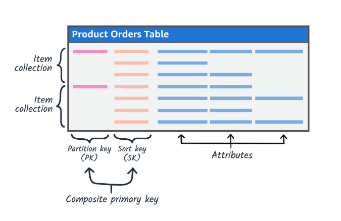

# Các Mô hình Thiết kế Amazon DynamoDB

## Mục lục

1. [Giới thiệu](#giới-thiệu)
2. [Phi chuẩn hóa](#phi-chuẩn-hóa)
3. [Tập hợp các mục](#tập-hợp-các-mục)
4. [Danh sách kề](#danh-sách-kề)
5. [Chỉ mục thứ cấp toàn cầu](#chỉ-mục-thứ-cấp-toàn-cầu)
6. [So sánh & Thực tiễn tốt nhất](#so-sánh--thực-tiễn-tốt-nhất)

---

## Giới thiệu

DynamoDB là dịch vụ cơ sở dữ liệu NoSQL được quản lý toàn phần, đòi hỏi một cách tiếp cận hoàn toàn khác với cơ sở dữ liệu SQL truyền thống. Tài liệu này đề cập đến các mô hình thiết kế thiết yếu cần thiết để xây dựng các ứng dụng có khả năng mở rộng và hiệu quả về chi phí trên DynamoDB.

### Nguyên tắc chủ yếu

> Không giống như cơ sở dữ liệu SQL tuân thủ normalization thông qua khóa ngoại (Foreign Keys) và JOINs, DynamoDB yêu cầu **phi chuẩn hóa (denormalization)** để đạt được độ trễ dưới 10 mili giây mà không cần quản lý máy chủ.

---

## Denormalization (Phi chuẩn hóa)

### 1. CÁC KHÁI NIỆM CƠ BẢN: DENORMALIZATION

Trong SQL, bạn chia nhỏ dữ liệu ra nhiều bảng để tránh trùng lặp (Normalization). Trong DynamoDB, chúng ta làm ngược lại: Denormalization.

#### Định nghĩa

Phi chuẩn hóa là quá trình gom nhóm dữ liệu liên quan vào cùng một Item hoặc cùng một phân vùng (Partition), chấp nhận sự trùng lặp dữ liệu để tối ưu hóa hiệu năng.

#### Tại sao DynamoDB cần Phi chuẩn hóa?

- DynamoDB **không hỗ trợ lệnh JOIN**
- Để lấy dữ liệu từ một đơn hàng + thông tin khách hàng trong **một lần gọi duy nhất**, bạn phải lưu chúng cùng nhau
- Sự đánh đổi: Tăng dung lượng lưu trữ để giảm độ trễ

#### Lợi ích chính

| Lợi ích                  | Tác động                                  |
| ------------------------ | ----------------------------------------- |
| **Một lần gọi duy nhất** | Giảm network round-trips từ N xuống 1     |
| **Độ trễ thấp hơn**      | Từ hàng chục ms xuống dưới 10ms           |
| **Code đơn giản hơn**    | Không cần logic join ở tầng ứng dụng      |
| **Mở rộng tốt hơn**      | Hiệu năng không phụ thuộc vào số lần join |

<p align="center">
    
    <figcaption><i>Hình 1: So sánh Chuẩn hóa (SQL) so với Phi chuẩn hóa (DynamoDB)</i></figcaption>
</p>

**Thực tiễn tốt nhất:** Phi chuẩn hóa là phương pháp mặc định cho DynamoDB. Chỉ cân nhắc lưu trữ tách biệt khi dữ liệu thay đổi độc lập.

---

## Tập hợp các mục

### 2. ITEM COLLECTIONS (Tập hợp các mục)

Đây là khái niệm then chốt để quản lý mối quan hệ 1-N (một - nhiều) trong DynamoDB.

<p align="center">
    
    <figcaption><i>Hình 2: Tập hợp các mục - Tập hợp các items có cùng Partition Key</i></figcaption>
</p>

### A. Single Table Design (Thiết kế Đơn bảng) - KHUYÊN DÙNG

#### Khái niệm

Tất cả các loại thực thể khác nhau (User, Order, Product, Review) đều nằm chung trong **một bảng duy nhất** thay vì tách thành nhiều bảng.

#### Cơ chế

Sử dụng các tên khóa theo mẫu `TYPE#ID`:

```
Khóa phân vùng (PK): USER#123
Khóa sắp xếp (SK): PROFILE

Khóa phân vùng (PK): USER#123
Khóa sắp xếp (SK): ORDER#999

Khóa phân vùng (PK): USER#123
Khóa sắp xếp (SK): INVOICE#888
```

Tất cả các items này nằm trong cùng một partition → Query 1 lần là có toàn bộ dữ liệu.

#### Ưu điểm

| Lợi ích                 | Mô tả                                               |
| ----------------------- | --------------------------------------------------- |
| **Tối ưu hóa chi phí**  | Một bảng = một bộ throughput được cấp phát          |
| **Truy vấn duy nhất**   | Lấy tất cả dữ liệu liên quan với một lệnh Query     |
| **Giao dịch nguyên tử** | TransactWriteItems qua nhiều items liên quan        |
| **Khả năng mở rộng**    | Mô hình mở rộng ngang (horizontal scaling) tự nhiên |

#### Ví dụ cấu trúc

```json
{
  "PK": "USER#123",
  "SK": "PROFILE",
  "name": "John Doe",
  "email": "john@example.com",
  "joinDate": "2024-01-15"
}

{
  "PK": "USER#123",
  "SK": "ORDER#999",
  "status": "SHIPPED",
  "totalAmount": 150.50,
  "createdAt": "2024-05-03"
}
```

### B. Multiple Table Design (Thiết kế Đa bảng)

#### Khái niệm

Mỗi thực thể loại một bảng riêng (User table, Order table, Product table...), giống như SQL schema truyền thống.

#### So sánh

| Khía cạnh          | Vấn đề                                            |
| ------------------ | ------------------------------------------------- |
| **Lần gọi mạng**   | Cần 2+ lần gọi API để lấy đủ dữ liệu              |
| **Độ trễ**         | Tăng từ 5ms lên 20-50ms (2-3 calls)               |
| **Logic ứng dụng** | Phải tự ghép dữ liệu bằng code (client-side join) |
| **Tính nhất quán** | Rủi ro mất tính nhất quán giữa các bảng           |

#### Khi nào dùng?

Chỉ khi:

- Dữ liệu hoàn toàn độc lập (không cần query cùng lúc)
- Có team riêng quản lý từng bảng
- Các mô hình truy cập không yêu cầu độ trễ thấp

**Khuyên cáo:** Tránh trừ khi thực sự cần thiết. Thực tiễn tốt nhất của AWS là Thiết kế Đơn bảng.

---

## Danh sách kề

### 3. ADJACENCY LISTS (Danh sách kề)

Đây là mẫu thiết kế mạnh mẽ nhất để biểu diễn các mối quan hệ phức tạp (N-N hoặc phân cấp, many-to-many relationships).

#### Định nghĩa

Mô hình Danh sách kề tạo ra các Item đại diện cho **các cạnh (edges)** giữa các nút (nodes) trong một đồ thị. Mỗi cạnh có thể được truy vấn từ hai hướng.

#### Các trường hợp sử dụng

- **Mối quan hệ Nhiều-nhiều**: Users ↔ Projects, Products ↔ Categories
- **Mô hình Đồ thị**: Mạng xã hội, các engine khuyến nghị
- **Phân cấp**: Cấu trúc tổ chức, hệ thống tệp
- **Khuyến nghị**: Ai theo dõi ai, sản phẩm nào liên quan đến nhau

#### Ví dụ: Hệ thống Quản lý Dự án

```json
// Mối quan hệ: User 1 làm việc trên Dự án A
{
  "PK": "PROJ#A",
  "SK": "USER#1",
  "role": "Lập trình viên",
  "joinedAt": "2024-01-15"
}

// Mối quan hệ ngược: Dự án A có User 1
{
  "PK": "USER#1",
  "SK": "PROJ#A",
  "role": "Lập trình viên",
  "joinedAt": "2024-01-15"
}

// Người dùng khác trên cùng dự án
{
  "PK": "PROJ#A",
  "SK": "USER#2",
  "role": "Quản lý",
  "joinedAt": "2024-02-01"
}

// User 1 cũng làm việc trên Dự án B
{
  "PK": "USER#1",
  "SK": "PROJ#B",
  "role": "Kiến trúc sư Chính",
  "joinedAt": "2024-03-10"
}
```

#### Ví dụ Truy vấn

```
// Tìm tất cả người dùng trên Dự án A
Truy vấn: PK = "PROJ#A" và SK bắt đầu bằng "USER#"

// Tìm tất cả dự án cho User 1
Truy vấn: PK = "USER#1" và SK bắt đầu bằng "PROJ#"
```

#### Ưu điểm

| Tính năng         | Lợi ích                                                       |
| ----------------- | ------------------------------------------------------------- |
| **Hai chiều**     | Truy vấn từ cả 2 phía (User→Project, Project→User)            |
| **Ghép hiệu quả** | Thay thế cho Graph DB (Neptune)                               |
| **Linh hoạt**     | Mô hình hóa các quan hệ phức tạp mà không cần thay đổi schema |
| **Chi phí**       | Rẻ hơn dùng Neptune nếu các mô hình truy vấn đơn giản         |

**Lưu ý:** Mô hình Danh sách kề yêu cầu **duy trì tính nhất quán dữ liệu** thủ công (khi xóa một mối quan hệ, xóa cả 2 cạnh).

---

## Chỉ mục Thứ cấp Toàn cầu

### 4. GLOBAL SECONDARY INDEXES (Chỉ mục Thứ cấp Toàn cầu)

GSI cho phép bạn **query dữ liệu qua các access patterns khác nhau** mà không cần tạo bảng mới. Đó là "vũ khí" chủ yếu để hỗ trợ multiple access patterns.

#### Khái niệm

- **Bảng cơ sở PK/SK:** Thường dùng để truy cập dữ liệu theo thực thể chính (ví dụ: UserId)
- **GSI PK/SK:** Hoàn toàn khác, cho phép truy cập theo thực thể thứ cấp (ví dụ: Email, Status, CreatedDate)
- **Tính độc lập:** GSI tồn tại độc lập với bảng cơ sở

#### Ví dụ: Các Mô hình Truy cập Khác nhau

```json
// Bảng cơ sở - Truy cập theo User
"PK": "USER#123", "SK": "PROFILE"
"Email": "john@example.com", "Status": "ACTIVE"

// GSI1 - Truy cập theo Email
"GSI1PK": "EMAIL#john@example.com"
"GSI1SK": "USER#123"
// Cho phép truy vấn: "Tìm người dùng theo email"

// GSI2 - Truy cập theo Status + CreatedDate
"GSI2PK": "STATUS#ACTIVE"
"GSI2SK": "CREATED#2024-05-03"
// Cho phép truy vấn: "Tìm tất cả người dùng hoạt động được tạo hôm nay"
```

#### Sparse Index (Chỉ mục Thưa) - MỘT MÔ HÌNH MẠNH MẼ

##### Định nghĩa

DynamoDB chỉ đưa một Item vào GSI nếu Item **có chứa thuộc tính** được dùng làm khóa cho GSI. Các items không có thuộc tính đó sẽ bị bỏ qua.

##### Ví dụ Thực tế

**Tình huống:** Bạn có 1 triệu đơn hàng, nhưng chỉ có 100 đơn hàng đang ở trạng thái "LỖI" (Error).

**Phương pháp Truyền thống:**

```
Truy vấn: Quét 1,000,000 items với bộ lọc Status = ERROR
Chi phí: 1,000,000 RCU (đơn vị dung lượng đọc)
Thời gian: Hàng giây
```

**Phương pháp Chỉ mục Thưa:**

```
// Tạo GSI chỉ với items có ErrorDate
GSI-PK: STATUS#ERROR
GSI-SK: ERROR_DATE

// Chỉ 100 items này có ErrorDate → chỉ 100 items trong GSI
Truy vấn: GSI với PK = "ERROR"
Chi phí: 100 RCU (rẻ hơn 99%)
Thời gian: <100ms
```

##### Cách hoạt động của Chỉ mục Thưa

```json
// Item 1 - Trạng thái SHIPPED (không có ErrorDate) → KHÔNG trong GSI
{
  "PK": "ORDER#001",
  "SK": "#",
  "Status": "SHIPPED",
  "TotalAmount": 100
}

// Item 2 - Trạng thái ERROR (có ErrorDate) → TRONG GSI
{
  "PK": "ORDER#002",
  "SK": "#",
  "Status": "ERROR",
  "ErrorDate": "2024-05-03T14:30:00Z",
  "ErrorReason": "Thanh toán bị từ chối"
}
```

| Khía cạnh            | Tác động                      |
| -------------------- | ----------------------------- |
| **Kích thước Index** | 100 items thay vì 1 triệu     |
| **Chi phí Truy vấn** | 100 RCU thay vì 1,000,000 RCU |
| **Tốc độ Truy vấn**  | <100ms thay vì hàng giây      |
| **Lưu trữ**          | Tiết kiệm 99% so với quét     |

**Trường hợp sử dụng:** Chuyển đổi trạng thái (PENDING, FAILED, ARCHIVED), cờ (HasError, IsDeleted), mô hình TTL.

---

## So sánh & Thực tiễn tốt nhất

### Tóm tắt: So sánh các Mô hình Thiết kế

| Mẫu thiết kế                 | Trường hợp sử dụng                            | Ưu điểm                      | Nhược điểm            |
| :--------------------------- | :-------------------------------------------- | :--------------------------- | :-------------------- |
| **Denormalization**          | Quan hệ 1-1, dữ liệu thường truy vấn cùng lúc | Độ trễ thấp, query đơn giản  | Dung lượng lớn hơn    |
| **Single Table Design**      | Hầu hết các ứng dụng hiện đại                 | Chi phí rẻ, hiệu năng cao    | Thiết kế phức tạp hơn |
| **Adjacency Lists**          | Mối quan hệ N-N, đồ thị, phân cấp             | Linh hoạt, mô phỏng graph    | Query phức tạp hơn    |
| **Global Secondary Indexes** | Cần query theo multiple access patterns       | Linh hoạt, tìm kiếm đa hướng | Tăng chi phí lưu trữ  |

---

## Những Điểm Chính

| Nguyên tắc                                        | Chi tiết                                               |
| ------------------------------------------------- | ------------------------------------------------------ |
| **Denormalization không phải là điều xấu**        | Nó là yêu cầu cho hiệu năng DynamoDB                   |
| **Single Table Design > Nhiều bảng**              | Trừ khi dữ liệu thực sự độc lập                        |
| **Adjacency Lists = Giải pháp thay thế Graph DB** | Mô hình các quan hệ mà không có Neptune                |
| **Sparse Index = Tối ưu hóa chi phí**             | Hoàn hảo cho cờ trạng thái, xử lý lỗi                  |
| **Các mô hình Truy cập trước tiên**               | Thiết kế schema dựa trên truy vấn, không phải thực thể |

---

## Các Dịch vụ AWS Liên quan

| Dịch vụ             | Trường hợp sử dụng                                         |
| ------------------- | ---------------------------------------------------------- |
| **Amazon Neptune**  | Các thuật toán đồ thị phức tạp, khuyến nghị thời gian thực |
| **ElastiCache**     | Lưu dữ liệu nóng từ DynamoDB                               |
| **S3**              | Lưu trữ dữ liệu lạnh/lịch sử từ DynamoDB                   |
| **Amazon Redshift** | Các truy vấn phân tích (OLAP) trên dữ liệu DynamoDB        |
