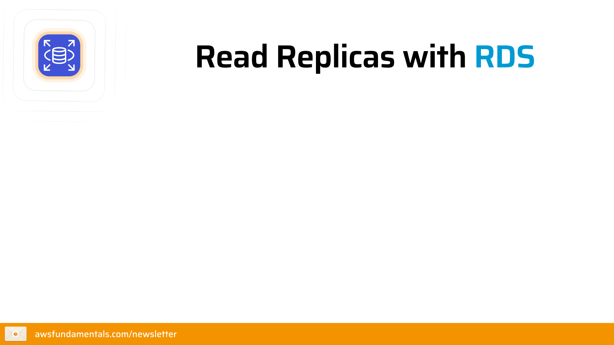
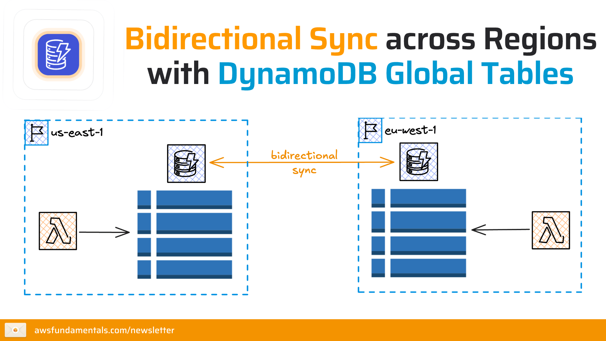

# CONCEPT 2: AWS DATABASE SERVICES 
## 1. Bản chất của dữ liệu (Nature of Data)

AWS phân loại dữ liệu thành 3 dạng chính để xác định loại DB cần thiết:
* **Structured Data (Dữ liệu có cấu trúc):** Dữ liệu được định nghĩa rõ ràng trong các bảng với hàng và cột (Ví dụ: thông tin giao dịch ngân hàng). Phù hợp với **RDS, Aurora**.
* **Semi-structured Data (Dữ liệu bán cấu trúc):** Không khớp với mô hình bảng cứng nhắc nhưng có các thẻ (tags) định danh dữ liệu (Ví dụ: JSON, XML). Phù hợp với **DynamoDB, DocumentDB**.
* **Unstructured Data (Dữ liệu phi cấu trúc):** Các tệp không có mô hình dữ liệu định sẵn (Ví dụ: Hình ảnh, Video, PDF). Thường được lưu trên **Amazon S3**.

---

## 2. Nhóm Cơ sở dữ liệu Quan hệ (SQL)

Mô hình này lưu trữ dữ liệu trong các bảng được xác định trước, liên kết với nhau qua các ràng buộc chặt chẽ.

### A. Khái niệm Khóa (Keys in SQL)
* **Khóa chính (Primary Key - PK):** Định danh duy nhất cho một bản ghi trong bảng.
* **Khóa ngoại (Foreign Key - FK):** Một cột trỏ đến khóa chính của bảng khác, thiết lập mối quan hệ giữa các thực thể và đảm bảo tính toàn vẹn dữ liệu.

### B. Tính chất ACID (Cốt lõi của SQL)
Các DB quan hệ trên AWS tuân thủ nghiêm ngặt chuẩn ACID để đảm bảo độ tin cậy giao dịch:
* **Atomicity (Tính nguyên tử):** Giao dịch là "tất cả hoặc không có gì".
* **Consistency (Tính nhất quán):** Dữ liệu luôn hợp lệ theo các quy tắc đã định.
* **Isolation (Tính cô lập):** Các giao dịch đồng thời không ảnh hưởng lẫn nhau.
* **Durability (Tính bền vững):** Khi đã xác nhận (commit), dữ liệu sẽ được lưu vĩnh viễn.

### C. Các dịch vụ chủ chốt
1.  **Amazon RDS (Relational Database Service):** Dịch vụ quản lý cho phép thiết lập và mở rộng dễ dàng. Hỗ trợ 6 engine: MySQL, PostgreSQL, MariaDB, Oracle, SQL Server, và IBM Db2.
2.  **Amazon Aurora:** DB quan hệ xây dựng riêng cho Cloud.
    * **Hiệu suất:** Nhanh gấp 3 lần PostgreSQL và 5 lần MySQL tiêu chuẩn.
    * **Độ tin cậy:** Tự động sao chép **6 bản sao** dữ liệu qua **3 Vùng sẵn sàng (AZ)**.
    * **Tối ưu:** Chi phí chỉ bằng 1/10 so với các DB thương mại truyền thống.
<figure  align="center">
  
    <figcaption align="center"><i> Hình 1 : Cơ chế Read Replicas của Amazon RDS </i></figcaption>
</figure>

> **Phân biệt OLTP vs OLAP:**
> * **OLTP (Online Transaction Processing):** Tập trung vào ghi/cập nhật dữ liệu nhanh, ngắn (Ví dụ: ATM).
> * **OLAP (Online Analytical Processing):** Tập trung vào phân tích dữ liệu lịch sử, truy vấn phức tạp để ra quyết định (Ví dụ: Business Intelligence).

---

## 3. Nhóm Cơ sở dữ liệu Phi quan hệ (NoSQL)

NoSQL sử dụng lược đồ linh hoạt (flexible schemas), cho phép mở rộng ngang (Horizontal Scaling) với độ trễ cực thấp.

### A. Phân loại NoSQL Types
* **Key-Value:** Lưu dưới dạng cặp khóa-giá trị. Mở rộng cực lớn, độ trễ mili giây một con số. (**DynamoDB**)
* **Document:** Lưu dưới dạng JSON. Lý tưởng cho hồ sơ người dùng, quản lý nội dung. (**DocumentDB**)
* **Graph:** Lưu dưới dạng nút (entity) và cạnh (relationship). Dành cho dữ liệu có mối liên hệ chằng chịt. (**Neptune**)
* **In-Memory:** Lưu trên RAM để đạt tốc độ micro-giây. Dành cho caching, bảng xếp hạng. (**ElastiCache**)
* **Search:** Tối ưu cho việc lập chỉ mục và tìm kiếm log/văn bản. (**OpenSearch**)

### B. Deep Dive: Amazon DynamoDB
Cơ sở dữ liệu NoSQL Serverless hàng đầu của AWS.
* **Cơ chế khóa:**
    * **Partition Key:** Xác định vị trí lưu trữ vật lý của dữ liệu (node).
    * **Sort Key:** Sắp xếp dữ liệu có cùng Partition Key, hỗ trợ truy vấn dải (range query).
* **Ưu điểm:** Hiệu suất ổn định ở bất kỳ quy mô nào mà không cần quản lý server.
<figure  align="center">
  
    <figcaption align="center"><i> Hình 2 : DynamoDB Global Tables - Cơ chế sao chép đa vùng (Multi-Region Replication) </i></figcaption>
</figure>

### C. Deep Dive: Amazon Neptune (Graph Database)
Chuyên giải quyết các bài toán về mối quan hệ phức tạp.
* **Thành phần:**
    * **Primary DB Instance:** Xử lý toàn bộ các thao tác Đọc/Ghi.
    * **Neptune Replicas:** Lên đến 15 bản sao chỉ đọc (Read-only) để phân phối tải và đảm bảo tính sẵn sàng cao.
    * **Cluster Volume:** Lớp lưu trữ ảo tự phục hồi (self-healing), sao chép dữ liệu đa vùng (Multi-AZ).
* **Ngôn ngữ truy vấn:** Hỗ trợ Gremlin, openCypher (của Neo4j), và SPARQL.

---

## 4. Phân tích Dữ liệu & Bộ nhớ đệm (Analytics & Caching)

### A. Amazon Redshift (Data Warehouse)
Đây là kho dữ liệu (OLAP) quy mô Petabyte.
* **Tính năng Zero-ETL:** Cho phép phân tích dữ liệu trực tiếp từ Aurora hoặc DynamoDB mà không cần xây dựng pipeline phức tạp.
* **Mục đích:** Chạy các báo cáo BI phức tạp trên tập dữ liệu khổng lồ.

### B. Amazon ElastiCache (Caching)
Dịch vụ bộ nhớ đệm giúp tăng tốc ứng dụng bằng cách giảm tải cho DB chính.
* **Redis:** Hỗ trợ cấu trúc dữ liệu phức tạp, bền vững dữ liệu, tính năng Pub/Sub.
* **Memcached:** Đơn giản, dùng cho các object nhỏ, không yêu cầu tính bền vững cao.

---

## 5. Di chuyển Cơ sở dữ liệu (Database Migration)

AWS cung cấp các công cụ để đưa dữ liệu từ On-premises hoặc các đám mây khác lên AWS:
* **AWS Database Migration Service (DMS):** Giúp di chuyển DB nhanh chóng và an toàn. DB nguồn vẫn hoạt động trong suốt quá trình (Downtime cực thấp).
* **AWS Schema Conversion Tool (SCT):** Tự động chuyển đổi lược đồ (schema) và mã code của DB nguồn sang định dạng tương thích với AWS target (Ví dụ: Chuyển Oracle sang Aurora PostgreSQL).

<figure  align="center">
  
    <figcaption align="center"><i> Hình 3 : Cơ chế di chuyển cơ sở dữ liệu với AWS DMS </i></figcaption>
</figure>
---

## 6. So sánh Kiến trúc: Server-Based vs Serverless

| Đặc điểm | Server-Based (Provisioned) | Serverless |
| :--- | :--- | :--- |
| **Quản lý** | Bạn chọn CPU, RAM, Storage cụ thể. | AWS tự động quản lý hạ tầng. |
| **Chi phí** | Trả cho tài nguyên đã đặt trước (dù có dùng hay không). | Chỉ trả cho dung lượng/request thực tế sử dụng. |
| **Co giãn** | Phải cấu hình thủ công hoặc theo lịch. | Tự động tăng/giảm theo traffic (thậm chí về 0). |
| **Ví dụ** | Amazon RDS, Redshift Provisioned. | DynamoDB, Aurora Serverless. |
