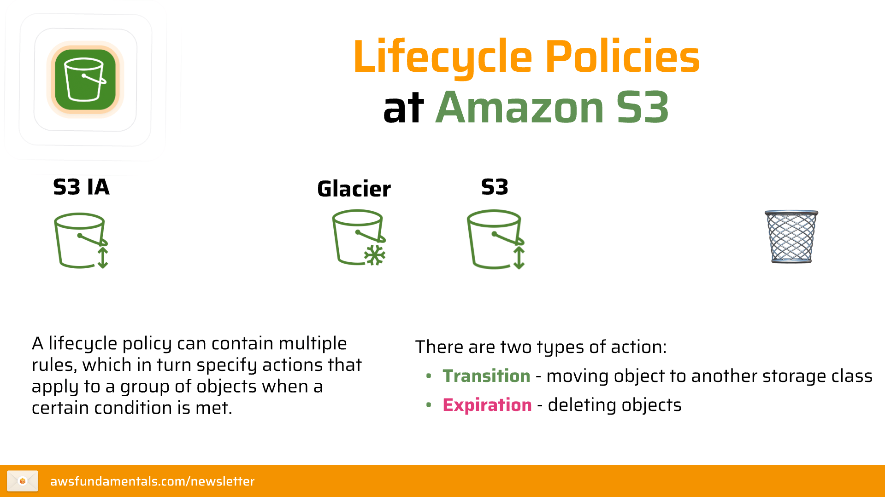
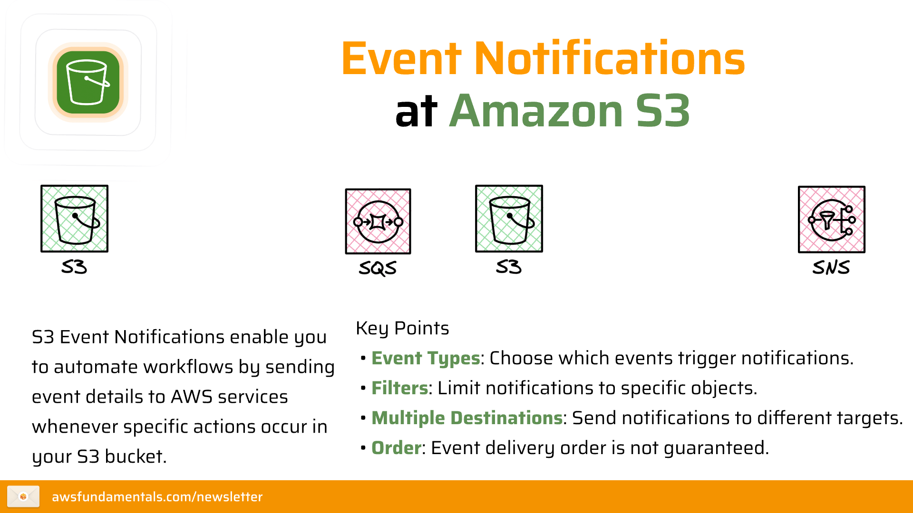
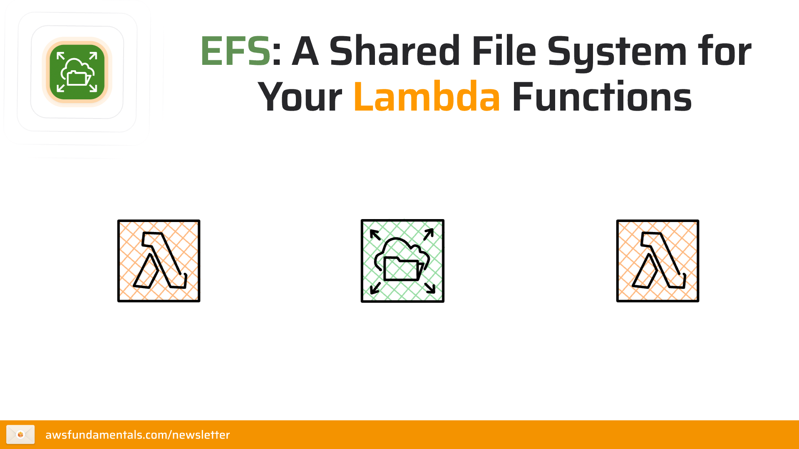

# Concept 1: Storage Service

## 1. Phân loại 3 kiểu lưu trữ dữ liệu chính

| Đặc điểm | **Object Storage (Đối tượng)** | **Block Storage (Khối)** | **File Storage (Tệp)** |
| :--- | :--- | :--- | :--- |
| **Bản chất** | Dữ liệu được lưu dưới dạng thực thể độc lập (Object) kèm Metadata và ID. | Dữ liệu được chia nhỏ thành các khối (blocks) có địa chỉ riêng. | Dữ liệu được tổ chức theo cấu trúc phân cấp (Thư mục/Tệp). |
| **Dịch vụ AWS** | **Amazon S3**, S3 Glacier | **Amazon EBS**, Instance Store | **Amazon EFS**, Amazon FSx |
| **Ví dụ kiểu dữ liệu** | Ảnh, Video, Log files, tệp sao lưu (Backup), nội dung web tĩnh. | Hệ điều hành (OS Boot), Cơ sở dữ liệu (Oracle, SAP), ERP. | Hồ sơ người dùng, nội dung ứng dụng dùng chung, tài liệu văn phòng. |
| **Cách truy cập** | Qua Web/API (Giao thức HTTP/HTTPS). | Gắn trực tiếp vào máy chủ ảo (Instance) như ổ cứng vật lý. | Truy cập đồng thời từ nhiều máy chủ qua mạng (NFS/SMB). |

---

## 2. Amazon S3 (Simple Storage Service) - Object storage

Amazon S3 được thiết kế để cung cấp độ bền vững (durability) lên tới **99.999999999% (11 số 9)**, đảm bảo dữ liệu của bạn hầu như không bao giờ bị mất.

### A. S3 Lifecycle Policies (Chính sách vòng đời) 
Giúp bạn tự động hóa việc quản lý dữ liệu để tiết kiệm chi phí:
* **Transition Actions:** Tự động chuyển Object sang lớp lưu trữ rẻ hơn sau một khoảng thời gian (ví dụ: Chuyển từ Standard sang Glacier sau 30 ngày).
* **Expiration Actions:** Tự động xóa vĩnh viễn các Object cũ không còn giá trị (ví dụ: Xóa log sau 365 ngày).
  
<figure  align="center">
  
  <figcaption align="center"><i> Hình 1 : Cơ chế Lifecycle Policies của Amazon S3 </i></figcaption>
</figure>

### B. S3 Event Notifications (Thông báo sự kiện) 
Biến S3 thành một thành phần chủ động trong kiến trúc hướng sự kiện:
* **Cơ chế:** Kích hoạt thông báo khi có hành động `ObjectCreated`, `ObjectRemoved`.
* **Các đích đến:**
    * **AWS Lambda:** Tự động chạy code xử lý (ví dụ: Resize ảnh ngay khi user upload).
    * **Amazon SNS/SQS:** Gửi thông báo hoặc đưa vào hàng đợi để các hệ thống khác xử lý sau.

<figure  align="center">
  
  <figcaption align="center"><i> Hình 2 : Cơ chế Event Notifications của Amazon S3 </i></figcaption>
</figure>

---

## 3. Amazon EBS (Elastic Block Store) - Lưu trữ khối cho EC2

Amazon EBS cung cấp các ổ đĩa có hiệu suất cao, độ trễ thấp dành riêng cho các thực thể EC2.

* **Các loại ổ đĩa (Volume Types):**
    * **SSD-backed (gp3, io2):** Dành cho các tác vụ cần tốc độ đọc/ghi (IOPS) cao như cơ sở dữ liệu.
    * **HDD-backed (st1, sc1):** Dành cho các tác vụ cần thông lượng (Throughput) lớn nhưng chi phí rẻ như xử lý Big Data, log processing.
* **Tính năng Snapshot:** Cho phép bạn "chụp ảnh" dữ liệu tại một thời điểm để sao lưu. Các bản snapshot được lưu trữ trên S3 để tăng độ bền vững.
* **EBS Block Express :** Thế hệ ổ đĩa mới cung cấp hiệu năng tiệm cận mạng lưu trữ SAN, độ trễ dưới 1 mili giây.

---

## 4. Amazon EFS (Elastic File System) - Lưu trữ tệp dùng chung

Khác với EBS chỉ gắn được vào một vài Instance, EFS cho phép **hàng nghìn instance** kết nối đồng thời.

* **Đặc điểm:** Tự động mở rộng hoặc thu hẹp dung lượng khi bạn thêm/xóa tệp (Elastic). Bạn không cần quản lý kích thước ổ đĩa.
* **Các tùy chọn lưu trữ:**
    * **EFS Regional:** Lưu trữ dữ liệu trên nhiều Availability Zones (AZs), độ sẵn sàng cực cao.
    * **EFS One Zone:** Chỉ lưu trên 1 AZ để giảm chi phí đến 47% (phù hợp cho dữ liệu có thể tạo lại được).

<figure  align="center">
  
  <figcaption align="center"><i> Hình 3 : EFS : A shared file System </i></figcaption>
</figure>

---

## 5. Amazon S3 Glacier - Lưu trữ lưu trữ lâu dài (Archive)

Đây là giải pháp lưu trữ cực rẻ cho các dữ liệu ít khi truy cập (truy cập vài lần một năm).

* **Các lớp lưu trữ chuyên biệt:**
    * **Glacier Instant Retrieval:** Lấy dữ liệu trong vòng mili giây.
    * **Glacier Flexible Retrieval:** Thời gian lấy dữ liệu linh hoạt từ vài phút đến vài giờ.
    * **Glacier Deep Archive:** Chi phí rẻ nhất trên AWS, thời gian lấy dữ liệu từ 12-48 giờ (phù hợp cho mục đích tuân thủ pháp luật, lưu giữ hồ sơ y tế/tài chính).
* **S3 Vault Lock:** Tính năng bảo mật cho phép bạn thiết lập chính sách "Write Once, Read Many" (WORM) – dữ liệu đã lưu là không thể xóa hoặc sửa trong một khoảng thời gian nhất định (ví dụ: lưu hồ sơ trong 7 năm).

---

## 6. Tóm tắt và So sánh các dịch vụ lưu trữ AWS

| Dịch vụ | Khi nào nên dùng? | Hiệu suất |
| :--- | :--- | :--- |
| **Amazon S3** | Lưu ảnh, video, tệp web tĩnh, Data Lake. | Thông lượng cao, độ trễ trung bình. |
| **Amazon EBS** | Cài đặt hệ điều hành, chạy Database hiệu năng cao. | Độ trễ cực thấp (micro-seconds). |
| **Amazon EFS** | Cần một thư mục dùng chung cho nhiều server. | Có thể mở rộng lên Petabyte. |
| **S3 Glacier** | Sao lưu dữ liệu dự phòng, hồ sơ cũ cần lưu trữ. | Chi phí thấp nhất, lấy dữ liệu chậm. |

