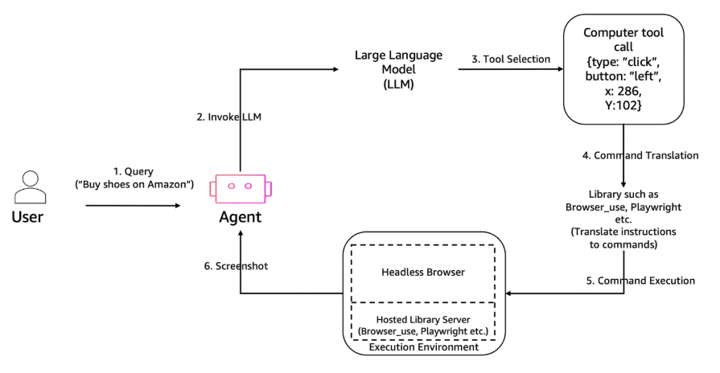

# [AWS Service Deep Dive] Amazon Bedrock AgentCore (Advanced)

Tài liệu này tập trung vào khía cạnh kỹ thuật khi sử dụng SDK cho Browser Tool và phân tích chi tiết các học phần của Code Interpreter trong Amazon Bedrock AgentCore.

---

## Overview

Amazon Bedrock AgentCore là hạ tầng nền tảng giúp chuyển đổi AI từ "kẻ biết tuốt" (LLM) thành "người thực hiện" (Agent). Dịch vụ này cung cấp các công cụ được quản lý để Agent tương tác với thế giới thực (qua trình duyệt) và thực hiện tư duy logic cấp cao (qua Code Interpreter) trong một môi trường an toàn, cô lập.

---

## Key Concepts & Keywords

- **Agentic Frameworks**: Các bộ khung như LangChain hoặc Strands giúp định nghĩa logic luồng công việc cho Agent.
- **Sandbox Environment**: Môi trường "hộp cát" hoàn toàn tách biệt; mọi mã nguồn hoặc trình duyệt chỉ hoạt động trong container này, không ảnh hưởng đến hạ tầng gốc.
- **UI Grounding**: Kỹ thuật giúp AI hiểu và xác định tọa độ các thành phần trên giao diện web để thao tác chính xác.
- **Episodic Memory**: Khả năng ghi nhớ ngữ cảnh trong một phiên làm việc, được hỗ trợ bởi AgentCore Memory.

---

    
     
    <em>Hình 1: Kiến trúc tổng quan của Amazon Bedrock AgentCore</em>

## Detailed Deep Dive

### 1. Browser Tool: Tích hợp SDK và Quan sát trực quan

Việc điều khiển trình duyệt thông qua mã nguồn (SDK) mang lại khả năng tùy biến cao hơn so với giao diện đồ họa.

- **Browser Tool usage with SDK**
  - Sử dụng **Nova Act SDK** để tự động hóa các quy trình nghiệp vụ (Business Workflows) với độ tin cậy cao nhờ mô hình được huấn luyện bằng học tăng cường (RL).
  - Sử dụng **Browser-Use SDK** khi cần sự linh hoạt, tận dụng thư viện Python và khả năng tích hợp nhanh với các mô hình đa phương thức mã nguồn mở.
- **Live-view with SDK**
  - **Cơ chế**: SDK kết nối với AgentCore qua WebSocket để stream luồng ảnh chụp màn hình liên tục.
  - **Ứng dụng**: Giám sát Agent theo thời gian thực (real-time monitoring). Người phát triển có thể thấy chính xác nút nào Agent đang click hoặc ô nào đang được điền dữ liệu.
- **Live-view with Browser-Use SDK**
  - Hỗ trợ tham số `display_web_browser=True`, cho phép hiển thị một cửa sổ trình duyệt cục bộ phản chiếu (mirror) các thao tác mà Agent đang thực hiện trong môi trường managed của AWS.

### 2. Code Interpreter: Trung tâm thực thi logic và phân tích

Đây là "bộ não thực thi" cho phép Agent tự lập trình để giải quyết vấn đề.

- **Introduction**: Cung cấp môi trường thực thi Python cô lập. Khi Agent nhận được yêu cầu cần tính toán hoặc xử lý dữ liệu, nó sẽ tự viết code, chạy thử và nhận kết quả.
- **File Operations**: Agent có năng lực đọc/ghi tệp mạnh mẽ. Nó có thể nạp dữ liệu từ các tệp đầu vào (được tải lên session) và xuất ra các tệp kết quả (như báo cáo PDF, đồ thị PNG).
- **Agent-Based Code Execution**
  - **LangChain**: Tích hợp thông qua `BedrockTool`, cho phép Agent trong hệ sinh thái LangChain gọi năng lực Code Interpreter của AWS.
  - **Strands**: Cung cấp cách tiếp cận native hơn, hỗ trợ Agent tự nhận diện lỗi code và thực hiện các vòng lặp tự sửa lỗi (self-healing code).
- **Advanced Data Analysis**
  - Sử dụng các thư viện như `pandas`, `matplotlib`.
  - Hỗ trợ phân tích xu hướng dữ liệu từ các tập tin CSV/Excel lớn mà các mô hình ngôn ngữ thông thường không thể xử lý trực tiếp qua prompt.
- **Running Commands**: Ngoài Python, môi trường này cho phép chạy các lệnh terminal cơ bản để cài đặt thêm thư viện hoặc quản lý cấu trúc thư mục trong session.

---

## Practical Examples & Scenarios

1. **Phân tích dữ liệu bán hàng (Code Interpreter + LangChain)**
   - Người dùng tải lên một tệp Excel 100,000 dòng.
   - Agent sử dụng LangChain để điều phối, gọi Code Interpreter viết mã Python tính toán tỷ lệ tăng trưởng và vẽ biểu đồ hình cột. Kết quả được trả về dưới dạng file nén chứa tệp đã làm sạch và hình ảnh biểu đồ.
2. **Trợ lý QA Web (Browser Tool + Strands)**
   - Agent sử dụng Strands SDK để điều khiển trình duyệt kiểm tra một luồng thanh toán mới.
   - Nếu gặp lỗi giao diện, Agent tự động chụp ảnh màn hình qua Live-view, phân tích lỗi và đề xuất cách sửa trong báo cáo.

---
