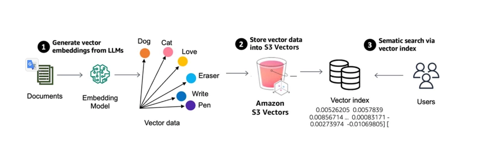
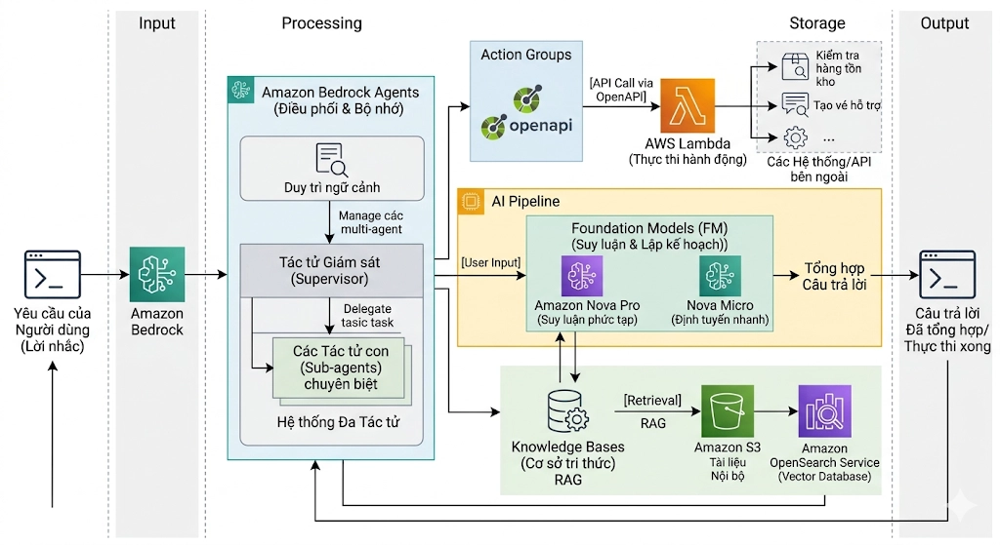

# CONCEPT 3: RAG & KNOWLEDGE BASES

## 1. Dữ liệu RAG được lưu dưới dạng gì? (Vector Embeddings)

Dữ liệu trong hệ thống RAG không được lưu dưới dạng văn bản thuần túy (Text) mà được chuyển đổi sang một định dạng toán học gọi là **Vector Embeddings**.

- **Bản chất:** Đây là một chuỗi các con số (mảng đa chiều) đại diện cho **ý nghĩa ngữ nghĩa** của một đoạn văn bản.
- **Tại sao phải lưu dạng Vector?** Máy tính không hiểu từ ngữ, nhưng nó có thể tính toán khoảng cách giữa các Vector. Các đoạn văn có nội dung tương tự nhau sẽ có các Vector nằm gần nhau trong không gian toán học.
- **Nơi lưu trữ:** Các Vector này được lưu trong một **Vector Store**. Dựa trên ghi chú của bạn, **Amazon S3 Vector Engine** là một bước đột phá vì nó cho phép lưu và truy vấn các Vector này trực tiếp trên S3 với tốc độ cực cao thay vì phải cài đặt một cơ sở dữ liệu chuyên dụng phức tạp.

---

## 2. Bedrock Knowledge Bases có thể "học" được những gì?

Amazon Bedrock Knowledge Bases được thiết kế để hấp thụ dữ liệu từ nhiều nguồn khác nhau, chủ yếu ở dạng **Dữ liệu phi cấu trúc (Unstructured Data)**.

### A. Các định dạng file hỗ trợ (Data Formats):

- **Văn bản:** `.pdf`, `.txt`, `.md`, `.html`.
- **Tài liệu văn phòng:** `.docx`, `.csv` (dạng bảng đơn giản).
- **Dữ liệu thô:** Các file log hoặc tài liệu kỹ thuật không có cấu trúc cố định.

### B. Nguồn cấp dữ liệu (Data Sources):

Dữ liệu ban đầu thường được bạn tải lên **Amazon S3** (Object Storage). Knowledge Bases sẽ quét (Sync) các file này để bắt đầu quá trình "học" (Ingestion).

---

## 3. Kiến trúc cơ bản của Amazon Bedrock Knowledge Bases

Kiến trúc này chia làm hai giai đoạn chính: **Hấp thụ (Ingestion)** và **Truy xuất (Retrieval)**.

  

<b>Hình 1:</b> Kiến trúc cơ bản của Amazon Bedrock Knowledge Bases cho RAG.

### Giai đoạn 1: Ingestion Workflow (Nạp tri thức)

1.  **Source:** Tài liệu của bạn nằm trong **Amazon S3**.
2.  **Chunking:** Hệ thống tự động chia nhỏ tài liệu dài thành các đoạn (chunks) để AI dễ quản lý.
3.  **Embedding:** Bedrock gọi một **Embedding Model** (như Amazon Titan Text Embeddings) để biến các đoạn văn thành Vector.
4.  **Vector Store:** Các Vector này được ghi vào **S3 Vector Engine** (hoặc OpenSearch Serverless, Pinecone...).

### Giai đoạn 2: Retrieval & Generation Workflow (Trả lời người dùng)

1.  **Query:** Người dùng gửi câu hỏi.
2.  **Convert:** Câu hỏi cũng được biến thành Vector.
3.  **Search:** Hệ thống tìm kiếm trong **Vector Store** để lấy ra các "Chunks" có ý nghĩa gần nhất với câu hỏi.
4.  **Augment:** Các đoạn văn bản tìm được (ngữ cảnh) được ghép vào câu hỏi gốc.
5.  **Generate:** Gửi toàn bộ gói thông tin (Câu hỏi + Ngữ cảnh) tới **Foundation Model (Claude, Titan...)** để tạo ra câu trả lời chính xác, có dẫn chứng rõ ràng.

  

<b>Hình 2:</b> Quy trình RAG từ câu hỏi đến câu trả lời.

---

## TỔNG KẾT KIẾN THỨC CHO NHÀ PHÁT TRIỂN

| Thành phần           | Vai trò thực tế                                                                              |
| :------------------- | :------------------------------------------------------------------------------------------- |
| **Dữ liệu đầu vào**  | Các file PDF, Docx, Markdown trên S3.                                                        |
| **Dạng lưu trữ RAG** | **Vector Embeddings** (Toán học hóa ý nghĩa).                                                |
| **Công cụ quản lý**  | **Amazon Bedrock Knowledge Bases** (Tự động hóa toàn bộ quy trình).                          |
| **Điểm nhấn mới**    | **S3 Vector Engine** giúp triển khai RAG nhanh, rẻ và không cần quản lý DB Vector bên ngoài. |

> **Lưu ý :** Knowledge Bases không "huấn luyện lại" (retrain) mô hình. Nó chỉ đơn giản là cung cấp thêm "tài liệu tham khảo" cho mô hình tại thời điểm người dùng đặt câu hỏi. Dữ liệu của bạn luôn được bảo mật và không bao giờ bị sử dụng để huấn luyện các mô hình công cộng.
