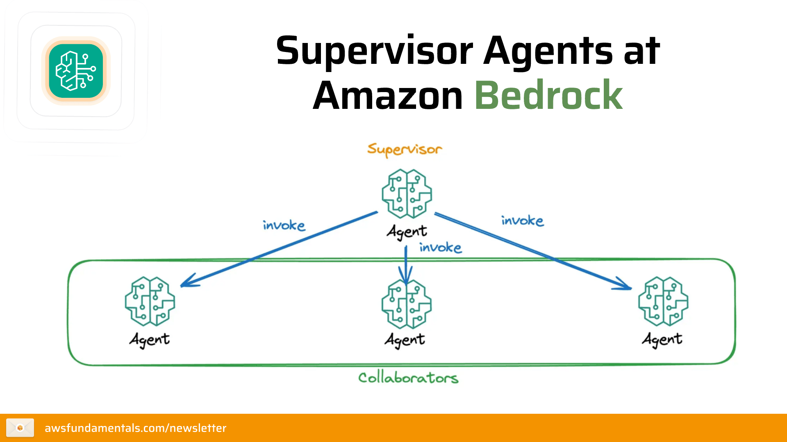

# CONCEPT 1 : Bedrock Foundation Models (Mô hình nền tảng)

<figure style="text-align: center;">
  
    <figcaption><b>Hình 1:</b> Amazon Bedrock Foundation Models - Nền tảng cho mọi ứng dụng AI.</figcaption>
</figure>

## 1. Tổng quan về Amazon Bedrock và các mô hình nền tảng (Foundation Models - FMs)

### A. Amazon Bedrock là gì?
**Amazon Bedrock** là một dịch vụ được quản lý toàn phần (Serverless), cung cấp các **Mô hình nền tảng (Foundation Models - FMs)** từ các công ty khởi nghiệp AI hàng đầu và Amazon thông qua một API duy nhất.

* **Ý nghĩa:** Thay vì phải tự xây dựng, huấn luyện và quản lý hạ tầng phần cứng (GPU) cực kỳ tốn kém, Bedrock cho phép bạn sử dụng AI mạnh mẽ chỉ bằng những dòng code đơn giản.
* **Tính chất:** Serverless (không cần quản lý máy chủ), bảo mật dữ liệu tuyệt đối (dữ liệu của bạn không được dùng để huấn luyện mô hình gốc).

### B. Foundation Models (FMs) - Các mô hình nền tảng
Mô hình nền tảng là các mô hình AI khổng lồ đã được huấn luyện sẵn trên một lượng dữ liệu cực lớn, có khả năng thực hiện nhiều tác vụ khác nhau: từ viết văn bản, tóm tắt, dịch thuật đến tạo hình ảnh và lập trình.

**Các nhà cung cấp mô hình chính trên Bedrock:**
1.  **Amazon (Dòng Titan):** Tối ưu cho hiệu suất và chi phí, bao gồm các mô hình về Text, Image và Multimodal (đa phương thức).
2.  **Anthropic (Dòng Claude):** Nổi tiếng với sự thông minh vượt trội, an toàn và có cửa sổ ngữ cảnh (Context Window) cực lớn. Bản Claude 3.5 Sonnet hiện đang dẫn đầu thị trường về hiệu năng.
3.  **Meta (Dòng Llama):** Các mô hình mã nguồn mở mạnh mẽ, phù hợp cho nhiều mục đích sử dụng linh hoạt.
4.  **Mistral AI:** Các mô hình từ Châu Âu với khả năng tư vấn và xử lý ngôn ngữ tự nhiên hiệu quả.
5.  **Stability AI (Dòng Stable Diffusion):** Chuyên gia trong việc tạo hình ảnh chất lượng cao từ văn bản.
6.  **AI21 Labs (Dòng Jurassic):** Tập trung vào việc hiểu và tạo văn bản theo ngữ cảnh phức tạp.

### C. Khả năng tùy chỉnh mô hình (Model Customization) - *Deep Dive*
Dựa trên tài liệu nguồn, bạn không chỉ sử dụng AI "có sẵn", mà còn có thể tinh chỉnh chúng:
* **Fine-tuning (Tinh chỉnh):** Sử dụng dữ liệu có nhãn (labeled data) để dạy mô hình thực hiện các tác vụ chuyên biệt cho doanh nghiệp bạn.
* **Continued Pre-training (Tiền huấn luyện tiếp tục):** Sử dụng dữ liệu không có nhãn (unlabeled data) để cung cấp kiến thức chuyên sâu về một lĩnh vực (ví dụ: y tế, luật pháp) cho mô hình.

### D. Responsible AI & Guardrails (Bảo vệ và An toàn) - *Kiến thức mới*
Để đưa AI vào thực tế, bảo mật và an toàn là ưu tiên số 1:
* **Guardrails for Amazon Bedrock:** Cho phép bạn thiết lập các chính sách lọc nội dung độc hại, xóa thông tin cá nhân nhạy cảm (PII) và đảm bảo AI hoạt động trong khuôn khổ đạo đức của công ty.
* **Bảo mật dữ liệu:** Mọi dữ liệu bạn gửi lên Bedrock đều được mã hóa và **không bao giờ rời khỏi VPC của bạn**.

---

## TỔNG KẾT NHANH CHO NHÀ PHÁT TRIỂN

| Đặc điểm | Lợi ích thực tế |
| :--- | :--- |
| **Lựa chọn đa dạng** | Chọn mô hình phù hợp nhất về chi phí và độ thông minh (Claude cho logic, Titan cho chi phí). |
| **API Duy nhất** | Dễ dàng chuyển đổi giữa các mô hình mà không cần đổi cấu trúc code. |
| **Serverless** | Chỉ trả tiền cho những gì bạn sử dụng (On-demand) hoặc thuê băng thông riêng (Provisioned Throughput). |
| **Bảo mật** | Đáp ứng các tiêu chuẩn khắt khe nhất như HIPAA hay GDPR. |
| **Tùy chỉnh mô hình** | Tinh chỉnh mô hình để phù hợp với nhu cầu kinh doanh cụ thể của bạn. |