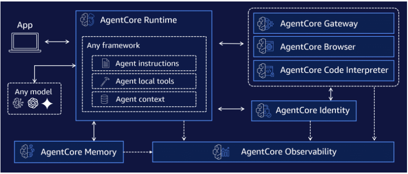
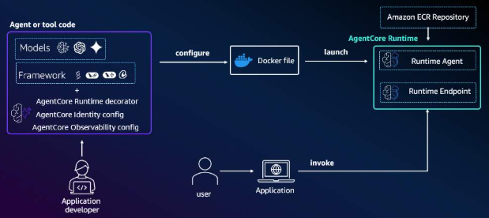
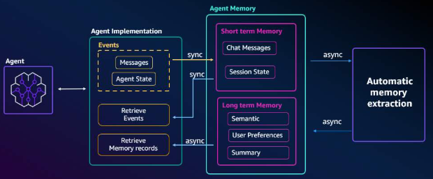
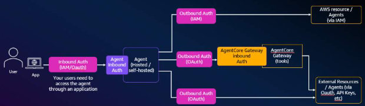
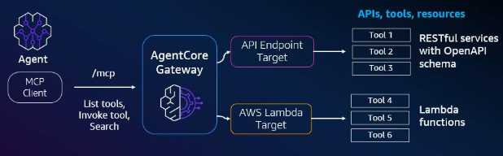
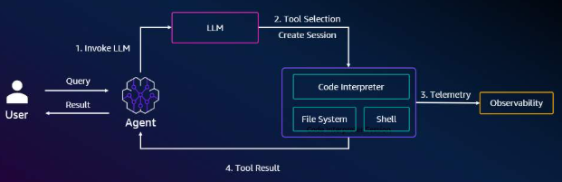
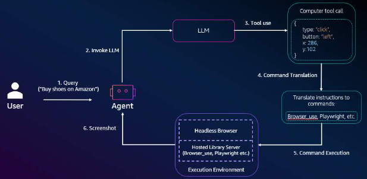
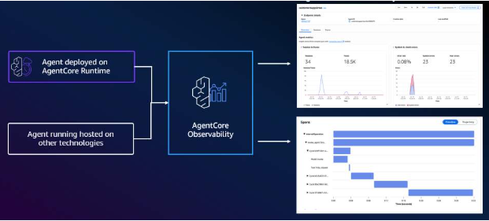

# Amazon Bedrock AgentCore: Hệ thống Tác tử AI Quy mô Doanh nghiệp

## Overview

Amazon Bedrock AgentCore là một tập hợp các dịch vụ và công cụ quản lý chuyên sâu, được thiết kế để đưa các tác tử AI (AI Agents) từ giai đoạn thử nghiệm (prototype) sang môi trường sản xuất (production) thực tế. Dịch vụ này giải quyết các thách thức về bảo mật cô lập, duy trì ngữ cảnh dài hạn, quản lý danh tính phức tạp và khả năng quan sát ở quy mô lớn mà các doanh nghiệp thường gặp phải.

  
  <figcaption>Hình 1: Quy trình hoàn chỉnh của Amazon Bedrock AgentCore</figcaption>

## Key Concepts & Keywords

- **AgentCore Runtime**: Hạ tầng phi máy chủ (serverless) để thực thi Agent trong môi trường cô lập tuyệt đối.
- **AgentCore Memory**: Khả năng lưu trữ ngữ cảnh hội thoại theo cả hai dạng: ngắn hạn (phiên làm việc) và dài hạn (sở thích người dùng).
- **AgentCore Identity**: Hệ thống quản lý định danh và quyền hạn (scoped permissions) cho riêng từng Agent.
- **AgentCore Gateway**: Cổng kết nối hợp nhất, sử dụng giao thức MCP để tương tác với các API nội bộ và bên thứ ba.
- **Code Interpreter**: Công cụ thực thi mã nguồn để xử lý các phép tính toán logic phức tạp.
- **AgentCore Browser**: Công cụ cho phép Agent tự động điều hướng và thu thập dữ liệu từ các trang web không có API.
- **Observability (Khả năng quan sát)**: Hệ thống giám sát thời gian thực, dấu vết (tracing) và phân tích lỗi.

---

## Detailed Deep Dive

### 1. AgentCore Runtime: Nền tảng triển khai an toàn

Runtime cung cấp môi trường thực thi giúp bảo vệ dữ liệu khách hàng:

- **Isolation (Cô lập)**: Mỗi phiên làm việc (session) của người dùng được chạy trong một sandbox riêng biệt, ngăn chặn hoàn toàn rò rỉ dữ liệu chéo giữa các khách hàng.
- **Scalability**: Tự động điều chỉnh quy mô mà không cần quản lý máy chủ hay tài nguyên bên dưới.
  

    
    <figcaption>Hình 2: Kiến trúc AgentCore Runtime với cô lập và khả năng mở rộng</figcaption>
  

### 2. AgentCore Memory: "Bộ não" ghi nhớ ngữ cảnh

Giúp Agent cá nhân hóa trải nghiệm thông qua việc học hỏi:

- **Short-term Memory**: Lưu trữ các lượt trao đổi gần nhất để duy trì luồng hội thoại.
- **Long-term Memory**: Sử dụng các chính sách (policies) để trích xuất sở thích, thói quen của người dùng từ các tương tác cũ.
- **Semantic Query**: Cho phép Agent truy vấn bộ nhớ dựa trên ý nghĩa (ngữ nghĩa) để tìm lại thông tin liên quan từ quá khứ.
  

    
    <figcaption>Hình 3: Hệ thống bộ nhớ hai tầng của AgentCore Memory</figcaption>
  

### 3. AgentCore Identity: Bảo mật cấp độ doanh nghiệp

Kiểm soát quyền truy cập dựa trên ngữ cảnh của tác tử:

- **Workload Identity**: Gán cho Agent một định danh duy nhất trong hệ thống.
- **Secure Token Vault**: Lưu trữ an toàn các Access Token (OAuth 2.0) và API Keys.
- **OAuth 2.0 flow**: Cho phép người dùng cấp quyền (consent) cho Agent thực hiện hành động thay mặt mình trên các ứng dụng khác (như Salesforce, Slack).
  

    
    <figcaption>Hình 4: Quản lý định danh và quyền hạn an toàn trong AgentCore Identity</figcaption>
  

### 4. AgentCore Gateway: Cổng kết nối hợp nhất

Sử dụng giao thức MCP để mở rộng sức mạnh của Agent:

- **Hỗ trợ đa giao thức**: Smithy models (AWS services), OpenAPI (Third-party), và Lambda functions (Legacy systems).
- **Dual Authentication**: Xác thực cả yêu cầu gửi đến Gateway và kết nối từ Gateway tới tài nguyên đích.
- **Tool Selection**: Tự động chọn công cụ phù hợp nhất cho từng tác vụ cụ thể của Agent.
  

    
    <figcaption>Hình 5: Cổng kết nối hợp nhất AgentCore Gateway với xác thực kép</figcaption>
  

### 5. AgentCore Code Interpreter

**Mục đích**: Xử lý các yêu cầu yêu cầu độ chính xác về toán học hoặc logic mà LLM thuần túy không đảm bảo được.

**Cách thức**: Tích hợp qua SDK, cho phép Agent tự viết và thực thi các đoạn mã (thường là Python) để trả ra kết quả cuối cùng.

  
  <figcaption>Hình 6: Công cụ thực thi mã AgentCore Code Interpreter cho xử lý logic phức tạp</figcaption>

### 6. AgentCore Browser

**Mục đích**: Truy cập các nguồn dữ liệu chỉ có giao diện web (không có API lập trình).

**Khả năng**: Tự động điều hướng trang web, tìm kiếm thông tin và "đọc" nội dung trên trình duyệt giống như con người.

  
  <figcaption>Hình 7: AgentCore Browser cho phép tự động hóa tương tác web</figcaption>

### 7. AgentCore Observability (Khả năng quan sát)

Cung cấp cái nhìn toàn diện để gỡ lỗi và tối ưu hóa:

- **Traces & Spans**: Visual hóa luồng công việc từ đầu đến cuối, nắm bắt từng bước thực thi của Agent.
- **Operational Metrics**: Theo dõi thời gian thực các thông số:
  - Token usage: Kiểm soát chi phí mô hình.
  - Latency: Độ trễ phản hồi.
  - Error rates: Tỷ lệ lỗi.
- **CloudWatch & OpenTelemetry**: Hỗ trợ gửi dữ liệu giám sát tới Amazon CloudWatch hoặc các nền tảng quan sát tiêu chuẩn khác.
  

    
    <figcaption>Hình 8: Hệ thống quan sát toàn diện của AgentCore Observability</figcaption>
  

