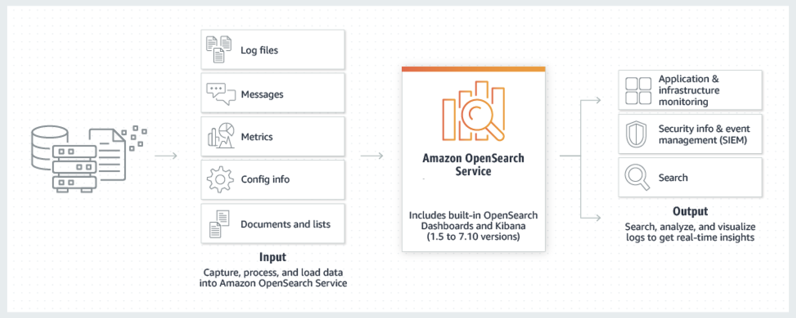

# Amazon OpenSearch Service

## 1. KHÁI NIỆM (CONCEPT)

Amazon OpenSearch Service là một dịch vụ được AWS quản lý toàn phần (fully managed), cho phép bạn dễ dàng triển khai, vận hành và điều chỉnh quy mô các cụm OpenSearch.

**Nguồn gốc**: Nó là một bản nhánh (fork) nguồn mở từ Elasticsearch và Kibana (sau khi dự án này thay đổi giấy phép).

**Bản chất**: Nó không chỉ là một công cụ tìm kiếm mà là một bộ công cụ (suite) bao gồm công cụ tìm kiếm, trực quan hóa dữ liệu và phân tích bảo mật.

    
    <figcaption><i> Hình 1 : Tổng quan về Amazon OpenSearch Service </i></figcaption>

---

## 2. CHỨC NĂNG CHÍNH (MAIN FUNCTIONS)

### Tìm kiếm (Search)

Cung cấp khả năng tìm kiếm văn bản nhanh chóng cho ứng dụng.

### Khả năng quan sát (Observability)

Giám sát tình trạng hệ thống thông qua dữ liệu nhật ký (log) và số liệu (metrics).

### Cơ sở dữ liệu Véc-tơ (Vector Database)

Lưu trữ và tìm kiếm các bản nhúng véc-tơ (embeddings) cho các ứng dụng Trí tuệ nhân tạo tạo sinh (Generative AI).

---

## 3. CÁC TÍNH NĂNG CỐT LÕI (CORE FUNCTIONALITY)

### Full-text search and analysis

**Tìm kiếm mờ (Fuzzy matching)**: Cho phép tìm thấy kết quả ngay cả khi người dùng nhập sai chính tả.

**Phân tích ngôn ngữ tự nhiên**: Hiểu các quy tắc ngôn ngữ để trả về kết quả liên quan nhất thay vì chỉ khớp từ khóa đơn thuần.

### Log analytics and visualization

**Phân tích log**: Gom log từ hàng nghìn máy chủ về một nơi để tìm lỗi hoặc hành vi bất thường.

**Visualization**: Sử dụng OpenSearch Dashboards để biến các con số log khô khan thành biểu đồ, bản đồ nhiệt (heatmap) và dashboard thời gian thực.

### Real-time data ingestion and analysis

Dữ liệu được nạp vào và có thể truy vấn được gần như ngay lập tức (độ trễ dưới 1 giây). Điều này cực kỳ quan trọng cho các hệ thống giám sát sự cố (incident monitoring).

---

## 4. CÁC KHÁI NIỆM KỸ THUẬT (TECHNICAL CONCEPTS)

### Domains and clusters

**Domain**: Là một thực thể dịch vụ OpenSearch hoàn chỉnh (bao gồm cấu hình, bảo mật).

**Cluster (Cụm)**: Tập hợp các Node (máy chủ) làm việc cùng nhau để xử lý dữ liệu.

### Indices and documents

**Document**: Một bản ghi dữ liệu dưới dạng JSON (tương đương với một "dòng" trong DB quan hệ).

**Index**: Một tập hợp các Document có chung logic (tương đương với một "bảng").

### Shards and replicas

**Shard**: Một Index được chia nhỏ ra nhiều phần (shards) để lưu trên nhiều Node khác nhau nhằm tăng hiệu năng.

**Replica**: Bản sao của Shard để đảm bảo dữ liệu không bị mất nếu một Node bị hỏng (High Availability).

### Query DSL

Ngôn ngữ truy vấn dựa trên JSON mạnh mẽ để thực hiện các tìm kiếm phức tạp.

### Analyzers and tokenizers

Quy trình bóc tách văn bản (ví dụ: chia câu "AWS Cloud" thành hai token ["aws", "cloud"]) trước khi đánh chỉ mục.

### Mappings and field types

Định nghĩa kiểu dữ liệu cho từng trường (ví dụ: text cho tìm kiếm, keyword cho lọc dữ liệu, date cho thời gian).

### Aggregations

Khả năng gom nhóm dữ liệu để tính toán (như Tính tổng, Trung bình, Đếm số lượng theo danh mục) giống như GROUP BY trong SQL.

### Node roles

- **Cluster Manager (Master)**: Điều phối hoạt động toàn cụm.
- **Data Nodes**: Lưu dữ liệu và thực hiện truy vấn.
- **Ingest Nodes**: Tiền xử lý dữ liệu trước khi lưu vào Index.

---

## 5. CÁC TÍNH NĂNG VÀ KHẢ NĂNG THEN CHỐT (KEY FEATURES)

### Auto snapshots

Hệ thống tự động sao lưu dữ liệu của bạn vào Amazon S3 theo định kỳ. Bạn có thể khôi phục lại cụm (cluster) trong trường hợp xảy ra sai sót dữ liệu.

### Fine-grained access control (FGAC)

Đây là tính năng bảo mật nâng cao. Bạn không chỉ chặn quyền truy cập vào Cụm mà còn có thể chặn quyền truy cập đến từng chỉ mục (index), từng tài liệu (document), hoặc thậm chí là từng trường dữ liệu (field) bên trong.

### Encryption at rest and in transit

**At rest**: Mã hóa dữ liệu khi nằm trên ổ đĩa (sử dụng AWS KMS).

**In transit**: Mã hóa dữ liệu khi di chuyển giữa các Node hoặc từ ứng dụng đến Cụm (sử dụng TLS).

### Monitoring and alerting

**Monitoring**: Tích hợp với Amazon CloudWatch để theo dõi CPU, RAM, dung lượng đĩa.

**Alerting**: Bạn có thể thiết lập thông báo (ví dụ: gửi tin nhắn qua Slack/Email) nếu phát hiện lỗi 404 tăng đột biến trong log hoặc cụm sắp hết dung lượng.

---

## 6. KIẾN TRÚC DỊCH VỤ AMAZON OPENSEARCH (ARCHITECTURE)

Kiến trúc của OpenSearch được thiết kế theo dạng phân tán (distributed), giúp nó có khả năng mở rộng (scale) gần như vô hạn.

### A. Cấu trúc Cụm (Cluster & Nodes)

Một Domain OpenSearch thực chất là một Cluster gồm nhiều máy chủ (Nodes) phối hợp:

#### Cluster Manager (Master) Nodes

"Bộ não" điều phối. Nó không lưu dữ liệu mà quản lý trạng thái cụm, theo dõi các Node khác và quyết định Shard nào nằm ở đâu. AWS khuyến nghị dùng 3 Node Master chuyên dụng (Dedicated Master Nodes) để đảm bảo tính ổn định.

#### Data Nodes

"Cơ bắp" của hệ thống. Đây là nơi lưu trữ dữ liệu thực tế và thực hiện các phép tính toán tìm kiếm/phân tích.

#### UltraWarm & Cold Storage Nodes

Để tối ưu chi phí, AWS chia tầng dữ liệu:

- **Hot**: Dữ liệu mới, truy vấn liên tục (lưu trên SSD/EBS).
- **Warm/Cold**: Dữ liệu cũ (ví dụ log từ 1 tháng trước) được chuyển sang các Node này với chi phí lưu trữ cực rẻ (S3-backed).

### B. Cơ chế Phân mảnh và Bản sao (Shards & Replicas)

**Shards**: Một Index lớn được chia nhỏ thành các phần gọi là Shard. Việc này giúp thực hiện tìm kiếm song song trên nhiều Node cùng lúc (tăng tốc độ).

**Replicas**: Mỗi Shard sẽ có bản sao (Replica). Nếu một Node chứa Shard chính bị hỏng, bản Replica sẽ ngay lập tức được đẩy lên thay thế, giúp hệ thống không bao giờ bị mất dữ liệu hay ngừng hoạt động.

### C. Tùy chọn Triển khai: Managed vs Serverless

**Managed Cluster**: Bạn có quyền kiểm soát hoàn toàn việc chọn loại Instance (C5, R5, M5...) và số lượng Node.

**OpenSearch Serverless**: Bạn không cần quản lý Node. AWS tự động cấp phát tài nguyên dựa trên lưu lượng (OCU - OpenSearch Compute Units), cực kỳ phù hợp khi bạn không biết trước tải của hệ thống.

---

## 7. TÍCH HỢP DỊCH VỤ OPENSEARCH (INTEGRATIONS)

Điểm mạnh nhất của OpenSearch trên AWS là khả năng "bắt tay" với các dịch vụ khác để tạo thành một đường ống dữ liệu (Data Pipeline) hoàn chỉnh.

### A. Nhóm Nạp Dữ liệu (Data Ingestion)

Đây là cách bạn đưa dữ liệu vào OpenSearch mà không cần viết code phức tạp:

#### Amazon Data Firehose

Tích hợp phổ biến nhất. Dữ liệu từ App đổ vào Firehose → Firehose tự động chuyển đổi định dạng và đẩy vào OpenSearch.

#### DynamoDB Zero-ETL

Đây là tính năng "hot" hiện nay. Bạn chỉ cần bật lên, dữ liệu từ DynamoDB sẽ tự động đồng bộ sang OpenSearch để bạn có thể thực hiện tìm kiếm Full-text mà không cần quan tâm đến pipeline.

#### CloudWatch Logs

Bạn có thể tạo "Subscription filter" để log từ hệ thống tự động đẩy thẳng vào OpenSearch để phân tích lỗi.

### B. Nhóm Trực quan hóa (Visualization)

**OpenSearch Dashboards**: Tích hợp sẵn trong dịch vụ. Đây là giao diện web để bạn vẽ biểu đồ, theo dõi tình trạng hệ thống theo thời gian thực.

### C. Nhóm AI & Generative AI (Hiện đại nhất)

#### Amazon Bedrock

OpenSearch hoạt động như một Vector Database cho Bedrock.

**Quy trình**:

- Bạn lưu kiến thức tri thức công ty vào OpenSearch (dưới dạng Vector)
- Bedrock (AI) sẽ truy vấn OpenSearch để lấy thông tin trả lời người dùng (Mô hình RAG)

#### Amazon S3 Vectors

OpenSearch có thể truy vấn trực tiếp các véc-tơ được lưu trữ trên S3 với độ trễ dưới 1 giây, giúp tối ưu chi phí lưu trữ cho AI.

---
