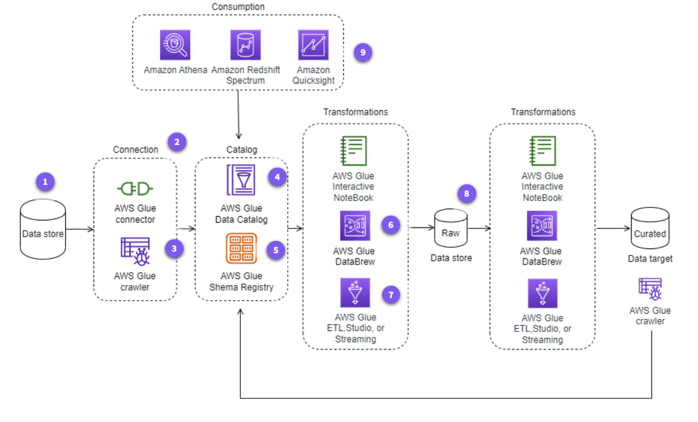

# AWS Glue: Toàn Tập về Tích Hợp Dữ Liệu Phi Máy Chủ (Serverless Data Integration)

## Overview

**AWS Glue** là dịch vụ tích hợp dữ liệu phi máy chủ (serverless), được quản lý hoàn toàn, giúp bạn dễ dàng khám phá, chuẩn bị, kết hợp và hiện đại hóa dữ liệu cho các mục đích phân tích, học máy (ML) và phát triển ứng dụng.

- **Vấn đề thực tế giải quyết:** Loại bỏ gánh nặng thiết lập và quản lý hạ tầng cho các quy trình ETL (Extract, Transform, Load). Nó giải quyết tình trạng "silo dữ liệu" bằng cách tự động hóa việc lập danh mục và chuẩn hóa dữ liệu từ nhiều nguồn khác nhau.
- **Mục đích sử dụng:** Xây dựng hồ dữ liệu (Data Lake), kho dữ liệu (Data Warehouse) và các đường ống dữ liệu (Data Pipelines) tự động.

    
     
    <em>Hình 1: Quy trình xử lý dữ liệu trong AWS Glue</em>

---

## Key Concepts & Keywords

- **ETL (Extract, Transform, Load):** Quy trình trích xuất dữ liệu từ nguồn, chuyển đổi định dạng và nạp vào đích.
- **Data Catalog:** Một kho lưu trữ siêu dữ liệu (metadata) tập trung, đóng vai trò như "mục lục" cho mọi tài sản dữ liệu của bạn.
- **Serverless:** Không cần quản lý máy chủ; tài nguyên tự động co giãn theo khối lượng công việc.
- **DynamicFrame:** Một cấu trúc dữ liệu đặc thù của Glue (tương tự Spark DataFrame) nhưng linh hoạt hơn, cho phép xử lý các schema không đồng nhất.
- **Job Bookmarks:** Cơ chế theo dõi trạng thái để chỉ xử lý dữ liệu mới được thêm vào (xử lý tăng trưởng - incremental processing).
- **Schema:** Cấu trúc của dữ liệu (tên cột, kiểu dữ liệu).

---

## Detailed Deep Dive

### 1. Kiến trúc và Thành phần Cốt lõi

AWS Glue hoạt động như một "nhà máy xử lý dữ liệu" kết nối giữa Nguồn (Sources) và Đích (Targets).

- **Data Integration Engines:** Glue hỗ trợ nhiều engine mạnh mẽ:
  - **Apache Spark:** Cho các tác vụ xử lý hàng loạt (Batch) quy mô lớn.
  - **Python Shell:** Cho các tác vụ nhẹ, script Python đơn giản.
  - **Ray:** Engine mới cho các ứng dụng tính toán phân tán hiệu năng cao.

### 2. AWS Glue Studio: Kỹ thuật ETL Trực quan

Đây là giao diện đồ họa giúp bạn thiết kế các luồng ETL mà không cần viết code phức tạp.

- **Connection:** Cấu hình thông tin kết nối tới các kho dữ liệu (như RDS, Redshift, On-premises).
- **Crawler:** "Con nhện" tự động quét các kho dữ liệu để xác định schema và tạo bảng trong `Data Catalog`.
- **Datastore, Source & Target:** Glue Studio phân biệt rõ ràng giữa nơi chứa dữ liệu thô (Source) và nơi lưu dữ liệu đã xử lý (Target).
- **AWS Glue Interactive Sessions:** Cho phép nhà phát triển chạy thử các đoạn code ETL ngay lập tức để kiểm tra kết quả, giảm thời gian debug.
- **Transforms:** Các thao tác thay đổi dữ liệu như `SelectFields`, `DropFields`, `Filter`, `Join` hoặc các đoạn mã `Custom Code`.
- **Triggers:** Cơ chế kích hoạt Job (theo lịch trình, theo sự kiện hoặc theo yêu cầu).

### 3. AWS Glue DataBrew: Chuẩn bị Dữ liệu không cần Code

Dành cho Data Analysts và Data Scientists cần làm sạch dữ liệu một cách nhanh chóng.

- **Dataset:** Tập dữ liệu đầu vào.
- **Profiling:** Tự động phân tích chất lượng dữ liệu (tìm giá trị trống, ngoại lệ, thống kê phân phối).
- **Recipes:** Tập hợp các bước làm sạch dữ liệu (ví dụ: đổi tên cột, chuẩn hóa ngày tháng).
- **Project:** Môi trường làm việc để tạo và thử nghiệm Recipe trên dữ liệu mẫu.

### 4. Các Trường hợp Sử dụng & Tính năng Nâng cao

- **Partitioning:** Kỹ thuật chia nhỏ dữ liệu trên S3 (ví dụ theo năm/tháng/ngày) để tăng tốc độ truy vấn cho Athena/Redshift.
- **Auto Scaling:** Tự động thêm/bớt DPU (Data Processing Units) dựa trên tải của Job để tối ưu hiệu suất và chi phí.
- **Transactional Data Lake:** Sử dụng Glue kết hợp với các định dạng như **Apache Iceberg**, **Hudi** để hỗ trợ các giao dịch ACID trên hồ dữ liệu (cho phép cập nhật/xóa từng dòng).
- **Amazon Q Developer:** Trợ lý AI giúp viết mã ETL và khắc phục lỗi trực tiếp trong Glue.

---

## Practical Examples & Scenarios

### **Kịch bản: Hiện đại hóa dữ liệu bán hàng từ SQL Server lên S3 Data Lake**

1.  **Thiết lập:** Tạo một `S3 Bucket` để làm đích.
2.  **Khám phá:** Chạy một `Glue Crawler` quét database SQL Server tại chỗ. Crawler này tự động tạo schema trong `Data Catalog`.
3.  **Xử lý:** Sử dụng **Glue Studio** để tạo một Job:
    - `Source`: Bảng từ SQL Server.
    - `Transform`: Đổi kiểu dữ liệu từ `String` sang `Timestamp`, loại bỏ các cột nhạy cảm (PII).
    - `Target`: Lưu dưới định dạng `Parquet` trên S3 (định dạng nén giúp tiết kiệm chi phí lưu trữ và tăng tốc Athena).
4.  **Tối ưu:** Bật `Job Bookmarks` để ngày mai Job chỉ trích xuất các đơn hàng mới phát sinh.

---

## Exam Essentials & Tips

### **1. Tối ưu Chi phí (Billing)**

- **DPU (Data Processing Unit):** Bạn trả tiền theo số lượng DPU và thời gian chạy Job.
- **Lưu ý:** Luôn sử dụng `Auto Scaling` để Glue tự điều chỉnh DPU, tránh lãng phí khi Job chạy ít dữ liệu.
- **Glue DataBrew:** Tính phí theo số lượng phiên (session) và Job thực thi.

### **2. Bảo mật (IAM & Encryption)**

- **IAM Roles:** Glue Job cần một Role có quyền đọc nguồn (ví dụ `s3:GetObject`) và ghi vào đích.
- **Encryption:** Sử dụng **AWS KMS** để mã hóa dữ liệu tĩnh (At-rest) trong Data Catalog và các file kết quả trên S3.
- > **Lưu ý quan trọng:** Để Glue Crawler truy cập được vào các database trong Subnet riêng tư, bạn phải cấu hình `Glue Connection` với đầy đủ VPC, Subnet và Security Groups.

### **3. Hiệu suất & Thực thi**

- **Incremental Processing:** Luôn ưu tiên `Job Bookmarks` thay vì quét lại toàn bộ dữ liệu.
- **File Formats:** Ưu tiên `Parquet` hoặc `ORC` thay vì `CSV/JSON` để đạt hiệu suất truy vấn tốt nhất trên hồ dữ liệu.
- **Run Locally:** Hãy thử nghiệm script ETL trên máy cục bộ hoặc qua Interactive Session trước khi triển khai Job thật để tránh tốn phí DPU vô ích khi code lỗi.

---

> **Architect's Advice:** AWS Glue là "keo dính" kết nối toàn bộ hệ sinh thái dữ liệu của bạn. Hãy coi `Data Catalog` là trái tim của kiến trúc dữ liệu hiện đại (Modern Data Architecture), nơi mọi dịch vụ từ Athena đến SageMaker đều nhìn vào để hiểu dữ liệu của bạn là gì.
