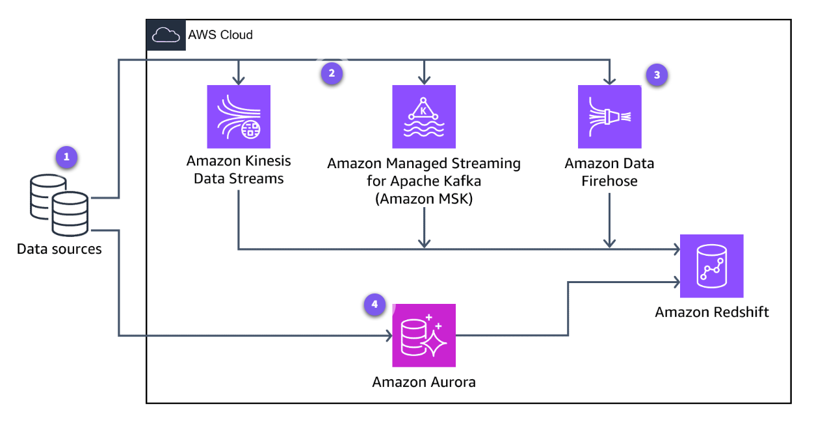

# Amazon Redshift: Giải pháp Kho dữ liệu quy mô Petabyte

## Overview

**Amazon Redshift** là một dịch vụ **Data Warehouse** (Kho dữ liệu) được quản lý toàn phần, có khả năng mở rộng đến quy mô petabyte trên đám mây. Dịch vụ này được thiết kế để xử lý các tác vụ phân tích phức tạp (**OLAP - Online Analytical Processing**) trên những tập dữ liệu khổng lồ với hiệu năng cực cao và chi phí thấp.

**Vấn đề thực tế giải quyết:**

- **Quá tải hệ thống truyền thống:** Các cơ sở dữ liệu quan hệ truyền thống (như MySQL, PostgreSQL) thường bị chậm khi chạy các báo cáo phân tích trên hàng tỷ dòng dữ liệu.
- **Chi phí mở rộng:** Việc đầu tư vào phần cứng để xây dựng kho dữ liệu tại chỗ (On-premises) rất tốn kém và khó điều chỉnh quy mô linh hoạt.
- **Tách biệt xử lý:** Giúp tách biệt dữ liệu phục vụ vận hành (Transaction) và dữ liệu phục vụ phân tích (Analytics), đảm bảo hiệu suất cho cả hai hệ thống.

---

## Key Concepts & Keywords

- **Massively Parallel Processing (MPP):** Kiến trúc xử lý song song khối lượng lớn, cho phép phân phối dữ liệu và truy vấn trên tất cả các tài nguyên có sẵn để tăng tốc độ xử lý.
- **Columnar Storage:** Lưu trữ dữ liệu theo **cột** thay vì theo hàng, giúp giảm đáng kể lượng I/O trên đĩa khi thực hiện các câu lệnh `SELECT` trên các cột cụ thể.
- **Leader Node:** "Bộ não" của cụm Redshift, chịu trách nhiệm nhận truy vấn, tối ưu hóa và điều phối các lệnh xuống các **Compute Nodes**.
- **Compute Nodes:** Các nút thực thi công việc tính toán thực sự và lưu trữ dữ liệu.
- **Redshift Spectrum:** Một tính năng cho phép truy vấn trực tiếp dữ liệu từ **Amazon S3** mà không cần nạp (load) dữ liệu vào các ổ đĩa của Redshift.
- **AQUA (Advanced Query Accelerator):** Lớp bộ nhớ đệm (cache) phân tán giúp tăng tốc truy vấn nhanh hơn gấp nhiều lần so với các kho dữ liệu đám mây khác.

---

## Detailed Deep Dive

### 1. Kiến trúc kỹ thuật cốt lõi

Amazon Redshift vận hành dựa trên kiến trúc **Cluster** (Cụm), bao gồm một **Leader Node** và nhiều **Compute Nodes**.

- **Cơ chế MPP:** Khi bạn gửi một câu lệnh SQL, **Leader Node** sẽ phân tích và tạo ra một kế hoạch thực thi song song. Kế hoạch này được gửi đến các **Compute Nodes** để xử lý đồng thời trên các phân mảnh dữ liệu (slices) của chúng.
- **Lợi thế của Columnar Storage:** Trong phân tích, chúng ta thường chỉ quan tâm đến một vài cột (ví dụ: `Tổng doanh thu` theo `Năm`). Thay vì đọc toàn bộ hàng, Redshift chỉ đọc đúng các cột đó, giúp giảm 90% lượng dữ liệu cần quét.
- Redshift lưu trữ dữ liệu theo columnar, nhưng khi nạp dữ liệu, nó sẽ tự động chuyển đổi từ định dạng hàng (row-based) sang cột (columnar) để tối ưu cho truy vấn phân tích.

### 2. Luồng dữ liệu (Data Ingestion & Consumption)

Sức mạnh của Redshift nằm ở khả năng liên kết mạnh mẽ với hệ sinh thái AWS:

- **Data Ingestion (Nạp dữ liệu):**
  - **COPY Command:** Đây là phương pháp nhanh nhất. Redshift sử dụng MPP để nạp dữ liệu song song từ **Amazon S3**, **DynamoDB**, hoặc **Amazon EMR**.
  - **Amazon Data Firehose:** Truyền luồng dữ liệu thời gian thực trực tiếp vào Redshift.
  - **AWS Glue:** Đóng vai trò là công cụ **ETL** để làm sạch và chuyển đổi dữ liệu trước khi nạp vào kho.

**Hình 1:** Kiến trúc luồng dữ liệu từ các nguồn đến Amazon Redshift và khai thác bằng các công cụ phân tích

- **Data Consumption (Khai thác dữ liệu):**
  - **BI Tools:** Kết nối với các công cụ như **Amazon QuickSight**, Tableau, PowerBI qua JDBC/ODBC.
  - **Redshift ML:** Cho phép các Data Analyst tạo và huấn luyện các mô hình Machine Learning ngay bằng câu lệnh SQL đơn giản.

### 3. Thành phần bổ sung: Redshift Spectrum & Lakehouse

Kiến trúc **Lakehouse** cho phép bạn truy cập dữ liệu ở cả hai nơi:

- Dữ liệu thường dùng (Hot data) được lưu trong **Redshift local storage** để đạt tốc độ tối đa.
- Dữ liệu ít dùng hoặc cực lớn (Cold data) được lưu trên **Amazon S3** và truy vấn qua **Redshift Spectrum**.

---

## Practical Examples & Scenarios

**Kịch bản: Phân tích xu hướng mua sắm của một sàn thương mại điện tử.**

1. **Thu thập:** Dữ liệu giao dịch từ **DynamoDB** và log người dùng từ **S3** được nạp vào Redshift qua **AWS Glue**.
2. **Xử lý:** Người dùng sử dụng lệnh `SQL` để tính toán doanh thu theo từng vùng miền trong 5 năm qua.
3. **Vận hành:** Nhờ kiến trúc **Columnar Storage**, thay vì quét hàng tỷ bản ghi thông tin cá nhân, Redshift chỉ quét cột `Giá tiền` và `Vùng miền`, trả về kết quả trong vài giây thay vì vài giờ.
4. **Trực quan hóa:** Kết quả được đẩy lên **Amazon QuickSight** để ban giám đốc theo dõi biểu đồ tăng trưởng theo thời gian thực.

---

## Exam Essentials & Tips

### 1. Tối ưu chi phí (Billing)

- **Node Types:**
  - **RA3:** Tối ưu khi bạn cần lưu trữ lượng dữ liệu cực lớn (tách biệt tính toán và lưu trữ).
  - **DC2:** Tối ưu cho hiệu suất tính toán cao với dữ liệu vừa phải.

- **Reserved Instances:** Cam kết sử dụng 1-3 năm để giảm chi phí lên đến 75% so với **On-demand**.

### 2. Bảo mật (Security)

- **IAM Roles:** Cấp quyền cho Redshift truy cập vào các Bucket S3 cụ thể qua IAM Roles.
- **VPC Isolation:** Redshift nên được triển khai trong **Private Subnet** để đảm bảo an toàn mạng.
- **Encryption:** Luôn bật mã hóa dữ liệu tĩnh (At-rest) bằng **AWS KMS** và dữ liệu đang truyền (In-transit) bằng **SSL/TLS**.

### 3. Hiệu suất (Performance)

> **Ghi chú quan trọng:** Để đạt hiệu năng tối đa, hãy chú ý thiết lập **Distribution Key** (Cách phân phối dữ liệu giữa các node) và **Sort Key** (Thứ tự sắp xếp dữ liệu trên đĩa). Việc chọn sai các khóa này có thể gây ra hiện tượng "Data Skew" (dữ liệu dồn vào một node duy nhất), làm mất đi lợi thế của MPP.

- **Workload Management (WLM):** Giúp ưu tiên tài nguyên cho các truy vấn quan trọng của giám đốc thay vì các truy vấn nhỏ của nhân viên kỹ thuật.

---