# Processing Amazon Connect Data Streams

---

## Overview

**Amazon Connect** là contact center cloud của AWS, có khả năng export dữ liệu thời gian thực ra ngoài thông qua **Kinesis Data Streams** và **Firehose**. Dữ liệu được stream ra gồm ba loại chính:

- **Contact Records** — chi tiết từng cuộc tương tác với khách hàng
- **Agent Events** — trạng thái và hoạt động của agent
- **Customer Profiles** — hồ sơ khách hàng hợp nhất, cập nhật real-time

<p align="center"></p>

> **Vấn đề thực tế nó giải quyết:** Contact center tạo ra lượng lớn dữ liệu hành vi — agent, khách hàng, cuộc gọi. Thay vì chỉ lưu trong Connect, các tổ chức cần đẩy dữ liệu này vào hệ thống CRM, BI, alerting hoặc compliance để khai thác giá trị thực sự.

---

## Key Concepts & Keywords

| Từ khóa                  | Bản chất                                                                                                        |
| ------------------------ | --------------------------------------------------------------------------------------------------------------- |
| **Contact Record**       | JSON document ghi lại toàn bộ thông tin một cuộc tương tác (thời gian, số điện thoại, agent, queue, attributes) |
| **Agent Events**         | Bốn sự kiện: login, logout, status change, heartbeat — published qua Kinesis                                    |
| **Customer Profiles**    | Hồ sơ khách hàng hợp nhất — export real-time khi có thay đổi                                                    |
| **Kinesis Data Streams** | Serverless streaming — linh hoạt, hỗ trợ custom processing, nhiều consumer                                      |
| **Firehose**             | Fully managed delivery — đơn giản hơn, tự scale, giao thẳng đến S3/Redshift/OpenSearch                          |
| **Producer**             | Ứng dụng/service ghi dữ liệu vào Kinesis stream (ở đây: Amazon Connect)                                         |
| **Consumer**             | Ứng dụng đọc và xử lý dữ liệu từ stream (Lambda, custom app)                                                    |
| **Fan-out**              | Một stream được nhiều consumer đọc song song, độc lập                                                           |
| **Enhanced Fan-out**     | Tính năng của Kinesis cho phép mỗi consumer có throughput riêng (2 MB/s/shard)                                  |

---

## Detailed Deep Dive

### Kinesis Data Streams vs. Firehose — Chọn cái nào?

```
                ┌─────────────────────────────────────────────────┐
                │              Amazon Connect                      │
                │  Contact Records │ Agent Events │ Profiles      │
                └──────────────────┬──────────────────────────────┘
                                   │ export
                    ┌──────────────┴──────────────┐
                    ▼                             ▼
         ┌─────────────────────┐      ┌─────────────────────┐
         │  Kinesis Data       │      │  Amazon Data        │
         │  Streams            │      │  Firehose           │
         │  (flexible,         │      │  (simple,           │
         │   custom logic)     │      │   fully managed)    │
         └─────────────────────┘      └─────────────────────┘
                    │                             │
          Lambda / custom app           S3 / Redshift / OpenSearch
```

| Tiêu chí            | **Kinesis Data Streams**                  | **Firehose**                          |
| ------------------- | ----------------------------------------- | ------------------------------------- |
| **Data processing** | Custom logic qua Lambda hoặc consumer app | Transform cơ bản, giao thẳng đến đích |
| **Management**      | Developer tự quản lý shard, retention     | Fully managed — tự scale              |
| **Data storage**    | Giữ data trong stream 1–365 ngày          | Không lưu — giao đến destination      |
| **Consumer**        | Nhiều consumer độc lập (fan-out)          | Một destination mỗi stream            |
| **Pricing**         | Theo shard + data volume                  | Theo data volume delivered            |
| **Dùng khi**        | Real-time analytics, complex processing   | Basic delivery, ETL đơn giản          |

> **Quy tắc chọn:** Nếu cần nhiều team/service xử lý cùng một stream → **Kinesis Data Streams**. Nếu chỉ cần dump data vào S3/Redshift → **Firehose**.

---

### Ba loại dữ liệu có thể stream từ Amazon Connect

#### Contact Records

Contact record là JSON document, published **ít nhất một lần** khi contact kết thúc. Nếu sau đó có cập nhật (ví dụ gọi `UpdateContactAttributes` API), Amazon Connect **republishes** record đó.

**Trường dữ liệu điển hình:**

| Field                 | Nội dung                                  |
| --------------------- | ----------------------------------------- |
| `InitiationTimestamp` | Thời điểm bắt đầu contact                 |
| `CustomerEndpoint`    | Số điện thoại khách hàng                  |
| `Queue`               | Queue xử lý contact                       |
| `Agent`               | Agent đã phục vụ                          |
| `ContactAttributes`   | Custom attributes do developer định nghĩa |
| `DisconnectTimestamp` | Thời điểm kết thúc contact                |

**Use cases:**

- Lưu trữ dữ liệu phục vụ **compliance** (data retention)
- Sync sang **CRM** hoặc **workforce management** (WFM) của bên thứ ba
- Phân tích lịch sử tương tác cho báo cáo kinh doanh

#### Agent Events

Kinesis publishes bốn loại agent event:

```
Agent Login ──► Agent Status Change ──► Heartbeat ──► Agent Logout
     │                  │                   │               │
  Bắt đầu ca       Thay đổi trạng       Periodic         Kết thúc ca
                  thái (Available,      check-in
                  Offline, Custom)
```

**Use cases:**

- Xây dựng **real-time dashboard** hiển thị trạng thái agent
- **Supervisor alerting** — thông báo khi agent offline bất thường hoặc handle time quá dài
- Phân tích **agent performance** để lên kế hoạch coaching

#### Customer Profiles

Customer Profiles export dữ liệu khi:

- Một profile mới được tạo
- Một profile hiện có bị cập nhật (ví dụ agent thay đổi địa chỉ khách hàng)

**Use cases:**

- Tự động cập nhật **CRM** với thông tin mới nhất
- Đồng bộ hóa **marketing automation tools**
- Duy trì single source of truth cho customer data

---

### Design Patterns — Producer/Consumer

#### Pattern 1: One Producer → One Consumer

Đơn giản nhất — Connect export thẳng vào một consumer duy nhất.

```
Amazon Connect ──► Kinesis Data Streams ──► Lambda (xử lý) ──► CRM
  (producer)                                 (consumer)
```

**Dùng khi:** Chỉ có một hệ thống cần dữ liệu, logic xử lý đơn giản.

#### Pattern 2: One Producer → Firehose → Storage

Không cần custom processing — chỉ cần lưu trữ.

```
Amazon Connect ──► Kinesis Data Streams ──► Firehose ──► Amazon S3
  (producer)                                              (data lake)
                                                   └───► Redshift
                                                         (analytics)
```

**Dùng khi:** Mục tiêu là data archiving, compliance, hoặc BI analytics.

#### Pattern 3: One Producer → Fan-out → Many Consumers

Mạnh nhất — nhiều team/service xử lý cùng stream độc lập.

```
                              ┌──► Lambda A — CRM update
Amazon Connect ──► Kinesis ──┤──► Lambda B — Supervisor alert
  (producer)       Stream    └──► Lambda C — BI dashboard
```

<p align="center"></p>

**Dùng khi:** Nhiều downstream application cần cùng dữ liệu, mỗi cái xử lý khác nhau.

---

### Cấu hình Streaming — Các bước chính

#### Cấu hình Contact Records & Agent Events

```
AWS Console → Amazon Connect instance
    │
    ├─► Data streaming → Contact Records
    │       └─► Chọn Kinesis Data Stream hoặc Firehose
    │
    └─► Data streaming → Agent Events
            └─► Chọn Kinesis Data Stream
```

> **Lưu ý:** Agent Events chỉ hỗ trợ Kinesis Data Streams (không hỗ trợ Firehose trực tiếp vì cần custom processing).

#### Cấu hình Customer Profiles Export

```
AWS Console → Amazon Connect → Customer Profiles
    │
    └─► Enable data streaming
            └─► Chọn Kinesis Data Stream (existing hoặc tạo mới)
            └─► Save → Tự động nhận updates real-time
```

---

### Processing & Transforming — Lambda là công cụ chính

Lambda được dùng để transform dữ liệu ở **hai điểm**:

```
Amazon Connect ──► Kinesis Stream ──► Lambda Transform ──► Downstream
                                           │
                            ┌──────────────┼──────────────┐
                            ▼              ▼              ▼
                    Update contact   Convert format   Decompress
                    attributes       JSON → Parquet   CloudWatch
                    (business rules) (for S3/Athena)  Logs
```

#### Ba loại transformation phổ biến

**1. Transform source record (business logic)**

- Đọc contact record từ stream
- Áp dụng business rules — ví dụ cập nhật `ContactAttributes` dựa trên sentiment score
- Ghi record đã enriched vào downstream (CRM, S3)

**2. Convert record format**

- Firehose có thể convert JSON → **Apache Parquet** hoặc **Apache ORC** trước khi lưu vào S3
- Parquet/ORC tối ưu cho Athena và analytics queries — tiết kiệm cost đáng kể
- Với format không phải JSON (CSV, structured text): Lambda convert sang JSON trước, rồi Firehose tiếp tục

**3. Decompress CloudWatch Logs**

- Khi source là CloudWatch Logs (compressed gzip), Lambda decompress trước khi xử lý

---

## Practical Examples & Scenarios

### Scenario 1 — Supervisor Dashboard (AnyCompany Retail)

**Nhân vật:** Diego Ramirez — supervisor tại AnyCompany Retail  
**Vấn đề:** Muốn theo dõi agent performance và customer sentiment để lên kế hoạch coaching

```
Amazon Connect
(Agent Events stream)
        │
        ▼
Kinesis Data Streams
        │
        ├──► Lambda ──► DynamoDB ──► Real-time Dashboard
        │                                (agent status,
        └──► Lambda ──► SNS ──► Email     handle time,
                                          sentiment score)
```

**Dữ liệu dùng:** Agent Events (login/logout/status) + Contact Lens sentiment  
**Outcome:** Diego thấy agent nào cần coaching, lên kế hoạch ngay trong ca làm việc

---

### Scenario 2 — Automated CRM Case Creation (AnyBank)

**Nhân vật:** Nikki Wolf — product manager tại AnyBank  
**Vấn đề:** Tự động mở case trong CRM khi sentiment score âm

<p align="center"></p>

```
Amazon Connect Contact Lens
(real-time segments + sentiment)
        │
        ▼
Kinesis Data Streams
        │
        ▼
Lambda Consumer
        │
        ├─ sentiment score < threshold? ──► YES ──► Mở case trong CRM
        │                                            + Gắn transcript vào case
        └─ sentiment OK ──► Không action
```

**Data type:** Contact Lens real-time segments với `SentimentScore`  
**Trigger:** Score âm vượt ngưỡng → Lambda tự động tạo case → team review

---

### Scenario 3 — Customer Profile Sync với CRM

**Nhân vật:** Agent thay đổi địa chỉ khách hàng trong Agent Workspace

```
Agent Workspace ──► Customer Profiles updated
                            │
                            ▼
                    Kinesis Data Streams
                    (auto-published khi profile thay đổi)
                            │
                            ▼
                    Lambda Consumer
                            │
                            ▼
                    CRM / Marketing Platform
                    (address updated trong <1 giây)
```

**Kết quả:** CRM luôn có dữ liệu mới nhất, không cần batch sync hàng đêm.

---

## Exam Essentials & Tips

### Kinesis vs. Firehose — Phân biệt cho kỳ thi

> **Exam tip:** Câu hỏi thường hỏi "dùng service nào cho use case X?". Ghi nhớ: **Kinesis = flexibility + custom** / **Firehose = simple + managed delivery**.

| Câu hỏi                                       | Đáp án                                         |
| --------------------------------------------- | ---------------------------------------------- |
| Cần nhiều consumer xử lý cùng stream?         | **Kinesis Data Streams** với fan-out           |
| Chỉ cần lưu vào S3 không cần processing?      | **Firehose**                                   |
| Agent Events dùng service nào?                | **Kinesis Data Streams** (không phải Firehose) |
| Muốn convert JSON → Parquet trước khi vào S3? | **Firehose** với format conversion             |
| Cần transform data theo business rules?       | **Lambda** kết hợp Kinesis hoặc Firehose       |

---

### Contact Records — Điểm quan trọng

- Published **ít nhất một lần** (at-least-once) khi contact kết thúc
- Có thể **republished** nếu attributes được update sau đó (qua `UpdateContactAttributes` API)
- Consumer phải xử lý **duplicate records** — implement idempotency

---

### Security Considerations

- **IAM Roles:** Amazon Connect cần IAM role với permission `kinesis:PutRecord` để ghi vào stream
- **KMS Encryption:** Kinesis Data Streams hỗ trợ server-side encryption với KMS — bật cho data nhạy cảm (PII, tài chính)
- **VPC Endpoints:** Lambda consumer nên dùng VPC endpoint để truy cập Kinesis mà không qua internet
- **Data Retention:** Kinesis lưu data mặc định 24 giờ, tối đa 365 ngày — tăng retention cho compliance

---

### Architecture Best Practices

- **Dùng fan-out** khi có ≥2 team cần cùng dữ liệu — tránh tạo nhiều stream riêng
- **Lambda timeout:** Contact record processing nên hoàn thành trong <15 phút (Lambda limit)
- **Error handling:** Dùng **Dead Letter Queue (DLQ)** trên Lambda để capture failed records
- **Monitoring:** CloudWatch metrics quan trọng: `GetRecords.IteratorAgeMilliseconds` — nếu tăng cao, consumer đang không theo kịp producer

---
