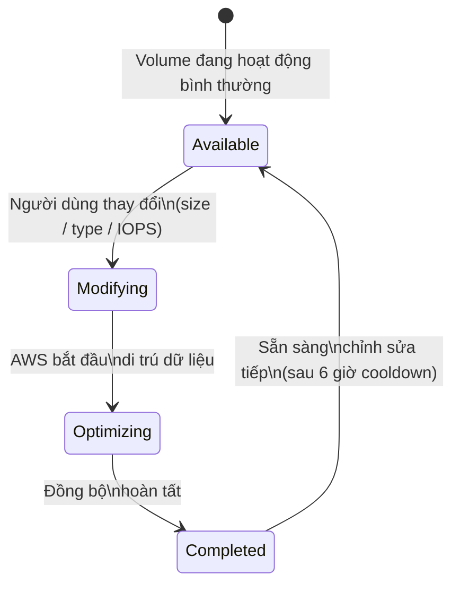
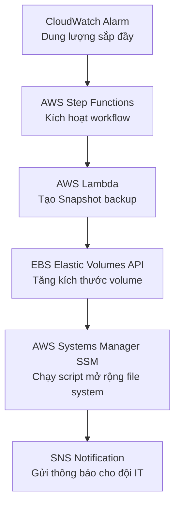
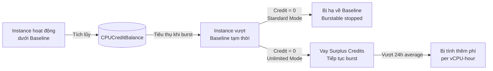

# Amazon EBS: Performance Optimization

## 1. Overview & The "Why"

**Amazon EBS (Elastic Block Store)** là dịch vụ lưu trữ dạng block có thể gắn vào EC2 instance, hoạt động như một ổ cứng ảo trên cloud.

**Vấn đề thực tế:** Ứng dụng chạy chậm, query database lâu, hoặc hệ thống bị nghẽn I/O mà không rõ nguyên nhân — phần lớn xuất phát từ việc chọn sai loại volume, cấu hình quá thấp, hoặc không hiểu giới hạn của hardware.

> **Analogy:** EBS giống như ổ cứng gắn ngoài (external SSD/HDD). Bạn có thể chọn loại ổ nhanh/chậm, dung lượng lớn/nhỏ, và cắm vào máy tính (EC2) bất kỳ lúc nào. Hiệu năng phụ thuộc vào cả **chất lượng ổ đĩa** lẫn **cổng kết nối của máy tính**.

---

## 2. Core Components & Keywords

| Thuật ngữ | Ý nghĩa |
|---|---|
| **IOPS** | Số tác vụ đọc/ghi trong 1 giây — quan trọng với workload ngẫu nhiên (database) |
| **Throughput (MB/s)** | Tốc độ truyền dữ liệu thực tế — quan trọng với workload tuần tự (log, backup) |
| **Latency** | Thời gian từ khi gửi yêu cầu I/O đến khi nhận phản hồi (ms) |
| **Block Size** | Kích thước một đơn vị dữ liệu trong một thao tác I/O (4KB, 64KB...) |
| **BurstBalance** | "Xô tín dụng" tích lũy cho phép vượt mức baseline tạm thời (gp2, st1, sc1) |
| **VolumeQueueLength** | Số I/O đang xếp hàng chờ — tăng cao = volume đang bị quá tải |
| **Micro-bursting** | Đỉnh tải cực ngắn (<5s) bị ẩn bởi trung bình 60s của CloudWatch |
| **EBS-Optimized** | Instance có đường truyền I/O riêng biệt, không tranh chấp với network |

**Công thức cốt lõi:**

$$\text{Throughput (MB/s)} = \frac{\text{IOPS} \times \text{Block Size (KB)}}{1024}$$

> **Quan trọng:** Volume EBS có 2 ngưỡng độc lập: **Giới hạn IOPS** và **Giới hạn Throughput**. Hệ thống bị throttle khi chạm **bất kỳ** ngưỡng nào trước.

---

## 3. Visual Theory & Architecture

### 3.1 Vòng đời Elastic Volumes Modification

**Giải thích từng bước:**
- **Modifying:** AWS tiếp nhận lệnh thay đổi, bắt đầu tính phí theo cấu hình mới ngay lập tức.
- **Optimizing:** Dữ liệu đang được di trú sang cấu hình mới. Hiệu năng chạy ở mức trung gian (không thấp hơn cấu hình cũ). Giai đoạn này có thể kéo dài đến **24 giờ** với volume đầy dữ liệu.
- **Completed:** Cấu hình mới hoàn toàn có hiệu lực. Cần **6 giờ cooldown** trước khi thay đổi tiếp.
- **Lưu ý OS:** Sau khi AWS mở rộng volume, bạn phải chạy lệnh mở rộng file system ở tầng Linux/Windows thủ công.

---

### 3.2 Luồng tự động hóa Resize Volume

**Giải thích:** Toàn bộ quy trình từ phát hiện sắp đầy ổ đến mở rộng hoàn tất đều tự động, không cần downtime hay can thiệp thủ công.

---

### 3.3 Cơ chế CPU Credit (Họ Instance T)

**Giải thích:** Chế độ **Standard** an toàn về chi phí nhưng có thể bị giảm hiệu năng đột ngột. Chế độ **Unlimited** giữ ổn định hiệu năng nhưng có rủi ro chi phí nếu workload liên tục cao.

---

## 4. Detailed Deep Dive

### 4.1 Phân loại Volume EBS

| Loại | Công nghệ | Tốt cho | Cảnh báo |
|---|---|---|---|
| `gp3` | SSD | Hầu hết workload, baseline ổn định | Mặc định nên chọn |
| `gp2` | SSD | Cũ hơn gp3, dùng BurstBalance | Nên migrate sang gp3 |
| `io1/io2` | SSD | Database cần IOPS cực cao, nhạy cảm latency | Chi phí cao |
| `st1` | HDD | Log files, data warehouse — tuần tự, khối lớn | Không phù hợp I/O ngẫu nhiên |
| `sc1` | HDD | Cold storage, chi phí thấp nhất | Chỉ tuần tự, hiệu năng thấp nhất |

### 4.2 SSD vs HDD — Khi nào dùng?

- **SSD (gp3, io2):** Hiệu năng cao và ổn định cho cả I/O **ngẫu nhiên** lẫn tuần tự.
- **HDD (st1, sc1):** Chỉ đạt tối ưu với I/O **tuần tự khối lớn**. I/O ngẫu nhiên sẽ gây sụt giảm hiệu năng nghiêm trọng.

### 4.3 RAID với EBS

| Cấu hình | Hiệu năng | Dự phòng | Khuyến nghị |
|---|---|---|---|
| **RAID 0** | Tổng cộng các ổ (×N IOPS, ×N Throughput) | Không có — mất 1 ổ = mất toàn bộ data | ✅ Dùng khi cần vượt giới hạn 1 volume |
| **RAID 1** | Không tăng thêm | Mirror song song | ❌ Lãng phí băng thông, không cải thiện gì |
| **RAID 5/6** | Kém hơn RAID 0 tới 20-30% IOPS | Có parity | ❌ Chi phí cao, IOPS kém, không phù hợp EBS |

> **Ví dụ RAID 0:** 2 × io1 (4,000 IOPS, 500 MiB/s) → **8,000 IOPS và 1,000 MiB/s**. Nhưng phải có snapshot strategy nghiêm ngặt.

### 4.4 Phát hiện Micro-bursting

CloudWatch lấy mẫu trung bình **60 giây**, nên có thể che giấu đỉnh tải ngắn:

**Cách tính:** Nếu `VolumeIdleTime = 55s` trong 1 phút, nghĩa là toàn bộ I/O dồn vào **5 giây**.
→ IOPS thực tế tại đỉnh = `(VolumeReadOps + VolumeWriteOps) ÷ 5`

Nếu con số này vượt giới hạn provisioned IOPS của volume → đây là nguyên nhân bị throttle dù CloudWatch trông "bình thường".

---

## 5. Practical Scenarios & Integration

### Kịch bản 1: Database Production bị chậm bất thường

**Triệu chứng:** Query latency tăng đột biến vào giờ cao điểm, nhưng CloudWatch IOPS trông ổn.

**Nguyên nhân & Giải pháp:**
1. Kiểm tra `VolumeIdleTime` — nếu thấp → Micro-bursting đang xảy ra
2. Kiểm tra `VolumeQueueLength` — nếu > 1 liên tục → volume đang quá tải
3. Nếu đang dùng `gp2`, kiểm tra `BurstBalance` — nếu về 0 → **migrate sang gp3** với IOPS cố định
4. Cân nhắc upgrade lên `io2` nếu cần IOPS cao và ổn định hoàn toàn

### Kịch bản 2: Data Pipeline xử lý log khổng lồ

**Yêu cầu:** Đọc tuần tự file log kích thước lớn (GB/file), chi phí thấp.

**Giải pháp kiến trúc:**
- OS và ứng dụng: `gp3` — ổn định, chi phí hợp lý
- Volume lưu log raw: `st1` — throughput tuần tự cao, chi phí chỉ bằng ~1/2 SSD
- Volume cold archive: `sc1` — chi phí thấp nhất
- Dùng **Elastic Volumes** để tự động tăng dung lượng `st1` khi sắp đầy (kết hợp Lambda + Step Functions)

### Infrastructure as Code

Khi triển khai EBS bằng **Terraform**, cấu trúc cơ bản gồm: resource `aws_ebs_volume` (khai báo loại, size, IOPS, throughput) và resource `aws_volume_attachment` (gắn volume vào EC2). Với môi trường production, nên bật `encrypted = true` và đặt `delete_on_termination = false` để tránh mất data khi terminate instance.

---

## 6. Exam Essentials & Pro Tips

### Các "bẫy" thường gặp trong kỳ thi

- ❗ **gp2 vs gp3:** gp3 có IOPS baseline cố định (3,000), gp2 dùng BurstBalance — câu hỏi hay hỏi khi nào BurstBalance cạn kiệt
- ❗ **Elastic Volumes cooldown:** Phải chờ **6 giờ** giữa các lần modify — đừng nhầm với thời gian hoàn tất modify
- ❗ **RAID 5/6 không được khuyến nghị** trên EBS vì parity writes tiêu tốn IOPS nghiêm trọng
- ❗ **Snapshot initialization:** Volume tạo từ snapshot sẽ bị latency cao lần đọc đầu tiên — cần pre-warm trước khi production
- ❗ **Chỉ tăng, không giảm kích thước:** EBS không hỗ trợ shrink volume — chỉ có thể tăng size

### Best Practices

**Hiệu năng:**
- Luôn dùng **EBS-Optimized instances** để có đường I/O riêng biệt
- Chọn `gp3` làm mặc định thay vì `gp2` — hiệu năng tốt hơn, giá tương đương hoặc rẻ hơn
- Với database IOPS cao: dùng `io2 Block Express` cho latency sub-millisecond

**Chi phí:**
- Tách biệt workload: app trên `gp3`, backup/log trên `st1`, cold data trên `sc1`
- Xóa các **unattached volumes** — vẫn bị tính tiền dù không dùng
- Dùng **Compute Savings Plans** kết hợp với right-sizing định kỳ

**Giám sát:**
- Thiết lập CloudWatch Alarm cho `BurstBalance < 20%`, `VolumeQueueLength > 5`
- Dùng `VolumeIdleTime` để phát hiện micro-bursting ẩn
- Với họ T instance: theo dõi `CPUSurplusCreditsCharged` để tránh chi phí bất ngờ