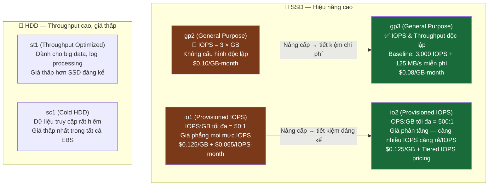
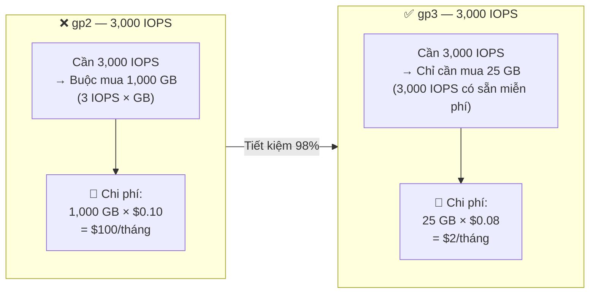
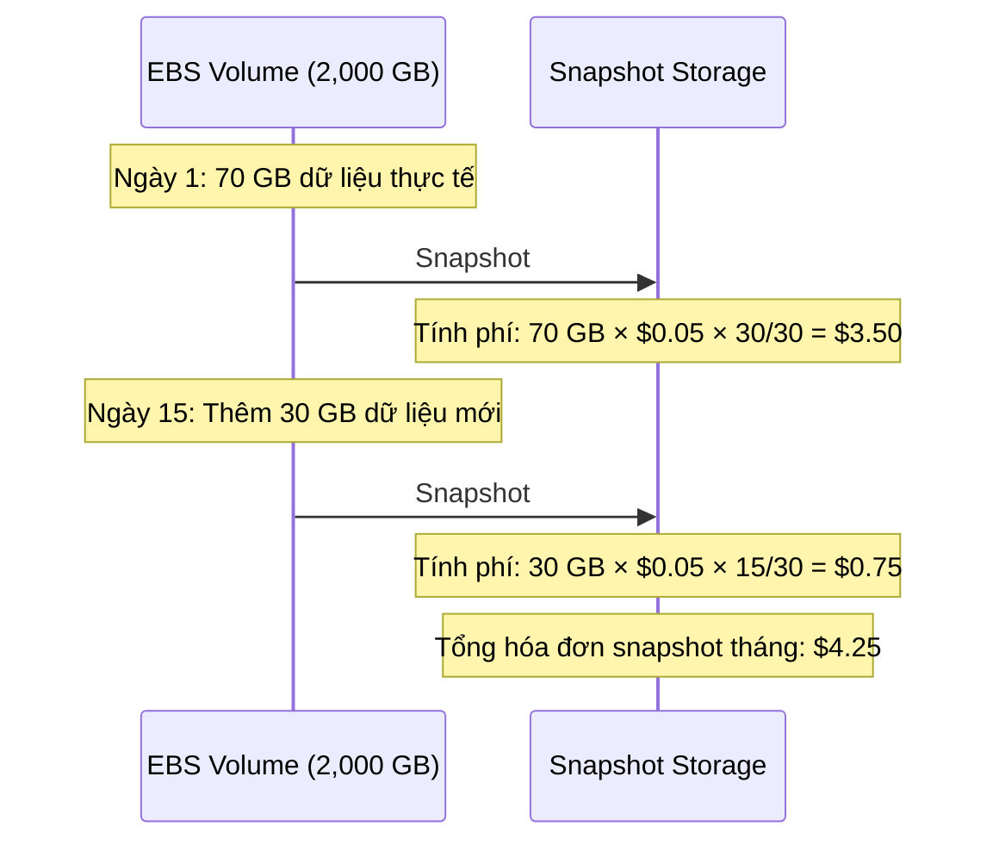

# Amazon EBS Cost Optimization: Tối Ưu Hóa Chi Phí Lưu Trữ Khối

---

## 1. Overview & The "Why"

### Định nghĩa

**Amazon EBS Cost Optimization** là tập hợp các chiến lược giúp giảm chi phí lưu trữ khối (block storage) trên AWS bằng cách chọn đúng loại volume, định cỡ chính xác, giám sát liên tục và quản lý vòng đời snapshot — tất cả thuộc **Trụ cột Cost Optimization** của AWS Well-Architected Framework.

### Vấn đề thực tế

> **Nguyên tắc tính phí cốt lõi:** Bạn bị tính phí cho EBS volume **miễn là chúng còn tồn tại** — bất kể volume đang được dùng 2% hay 90% dung lượng, đang gắn vào instance đang chạy, đang dừng (stopped), hay thậm chí đã bị unattached hoàn toàn.

Các lãng phí phổ biến nhất:
- Volume **unattached** (gỡ ra nhưng không xóa) vẫn bị tính phí đầy đủ.
- **Over-provisioning** dung lượng hoặc IOPS vượt nhu cầu thực tế.
- Dùng loại volume thế hệ cũ (`gp2`, `io1`) khi thế hệ mới (`gp3`, `io2`) rẻ hơn nhiều.
- **Incomplete Snapshots** tích lũy theo thời gian mà không có chính sách dọn dẹp.

### Analogy

EBS giống như **bãi đỗ xe tính phí theo tháng**: dù xe bạn có chạy hay không, có ở đó hay không — miễn là bạn còn giữ chỗ, tiền vẫn chạy đều đặn mỗi ngày.

---

## 2. Core Components & Keywords

| Thuật ngữ | Bản chất |
|---|---|
| **EBS Volume Type** | Loại ổ đĩa EBS — xác định hiệu năng, giá và use case phù hợp. |
| **Provisioned IOPS** | Số lượng I/O operations/giây được cấu hình trước — bị tính phí dù có dùng hết hay không. |
| **Throughput** | Băng thông đọc/ghi (MB/s) — tham số độc lập với IOPS trên `gp3`. |
| **Elastic Volumes** | Tính năng cho phép thay đổi loại volume, dung lượng và IOPS **không cần downtime**. Chỉ cho phép **tăng** kích thước, không thể giảm trực tiếp. |
| **EBS Snapshot** | Bản sao lưu incremental của volume, lưu trong S3 (managed). Tính phí theo dung lượng thực tế thay đổi. |
| **Snapshot Archive** | Tầng lưu trữ snapshot dài hạn — giá thấp hơn ~75% so với Standard, có phí retrieval. |
| **Data Lifecycle Manager (DLM)** | Dịch vụ tự động hóa tạo và xóa snapshots theo chính sách vòng đời định nghĩa trước. |
| **AWS Compute Optimizer** | Dịch vụ phân tích CloudWatch metrics và đề xuất loại volume/thông số tối ưu hơn. |
| **Instance Store** | Bộ nhớ khối gắn trực tiếp vào phần cứng — đã bao gồm trong giá EC2, nhưng dữ liệu mất khi instance stopped/terminated. |
| **IOPS:GB Ratio** | Tỷ lệ IOPS tối đa trên dung lượng — quan trọng khi tính chi phí thực tế cho mỗi loại volume. |

---

## 3. Visual Theory & Architecture

### 3.1 — Cơ chế định giá EBS theo loại volume



**Giải thích:** Mũi tên thể hiện hướng nâng cấp được khuyến nghị. `gp3` và `io2` là thế hệ mới hơn, rẻ hơn và linh hoạt hơn so với người tiền nhiệm `gp2`/`io1` trong cùng nhóm hiệu năng.

---

### 3.2 — Tại sao gp3 luôn rẻ hơn gp2 với cùng IOPS?



**Giải thích:** Với `gp2`, IOPS bị ràng buộc vào dung lượng — muốn có IOPS cao, bạn **bắt buộc phải mua thêm GB** dù không cần. Với `gp3`, IOPS và dung lượng hoàn toàn độc lập, loại bỏ hoàn toàn sự lãng phí này.

---

### 3.3 — Vòng đời EBS Snapshot (Incremental)



**Giải thích:** Chi phí snapshot **không phụ thuộc** vào kích thước cấu hình của volume (2,000 GB). Snapshot đầu tiên copy toàn bộ dữ liệu thực tế; các snapshot kế tiếp chỉ lưu các **block thay đổi**. Công thức tính: `Đơn giá × Dung lượng thực tế × Số ngày / 30`.

---

## 4. Detailed Deep Dive

### 4.1 So sánh chi phí thực tế theo kịch bản IOPS

Giả định: Dữ liệu thực tế tối thiểu **25 GB**. Giá tại US East (N. Virginia).

| Yêu cầu IOPS | gp2 | gp3 | io1 | io2 |
|---|---|---|---|---|
| **3,000 IOPS** | $100.00/tháng (cần 1,000 GB) | **$2.00/tháng** (25 GB) | $202.50/tháng | $198.13/tháng |
| **6,000 IOPS** | $200.00/tháng (cần 2,000 GB) | **$17.00/tháng** (25 GB + 3k IOPS) | $405.00/tháng | $393.13/tháng |
| **12,000 IOPS** | $400.00/tháng (cần 4,000 GB) | **$47.00/tháng** (25 GB + 9k IOPS) | $810.00/tháng | $783.13/tháng |

> **Kết luận:** Với workload dưới 16,000 IOPS và dưới 1,000 MB/s throughput, **`gp3` luôn là lựa chọn kinh tế nhất** — thường rẻ hơn `gp2` tới 98% trong các kịch bản IOPS-dominated.

---

### 4.2 Khi nào nên dùng io2 thay io1?

Dữ liệu yêu cầu: **150 GB**. Tại mức IOPS cao (≥16,000 IOPS), `io2` luôn rẻ hơn `io1` vì hai lý do:

- **Tỷ lệ IOPS:GB = 500:1** (io2) vs **50:1** (io1) → io1 buộc phải mua thêm GB lãng phí.
- **Giá phân tầng** (io2): Trên 32,000 IOPS, đơn giá/IOPS của io2 giảm xuống thấp hơn mức phẳng của io1.

| Mức IOPS | io1 cần GB | io2 cần GB | io2 tiết kiệm (chỉ phần GB) |
|---|---|---|---|
| 16,000 IOPS | 320 GB | 150 GB | $21.25 |
| 32,000 IOPS | 640 GB | 150 GB | $61.25 |
| 64,000 IOPS | 1,280 GB | 150 GB | $141.25 |

---

### 4.3 Instance Store vs EBS — Khi nào tiết kiệm 100% chi phí EBS?

| Tiêu chí | EC2 Instance Store | Amazon EBS |
|---|---|---|
| **Giá** | Đã bao gồm trong giá EC2 | Tính phí riêng theo GB/IOPS |
| **Độ trễ** | Sub-millisecond | Phụ thuộc loại ổ đĩa |
| **Dữ liệu khi stop/terminate** | **Mất hoàn toàn** | Còn nguyên vẹn |
| **Snapshot/Backup** | Không hỗ trợ | Hỗ trợ đầy đủ |
| **Use case phù hợp** | Buffer, cache, temp data có thể tái tạo | Persistent data, database, OS volume |

> **Cơ hội tối ưu:** Nếu dữ liệu là **tạm thời và có thể tái tạo** (cache, tmp files, intermediate results) → dùng Instance Store để giảm 100% chi phí EBS cho phần dữ liệu đó.

---

### 4.4 AWS Compute Optimizer cho EBS

- **Cơ chế:** Phân tích CloudWatch utilization metrics → đề xuất loại volume và thông số tối ưu hơn.
- **Opt-in:** Phải chủ động bật — không tự động phân tích.
- **Phạm vi:** EC2 instances, Auto Scaling Groups, EBS volumes, Lambda functions.
- **Output:** Biểu đồ so sánh actual vs projected — giúp đánh giá trade-off giữa giá và hiệu năng trước khi thay đổi.

---

### 4.5 Quản lý EBS Snapshot tiết kiệm chi phí

| Công cụ | Vai trò |
|---|---|
| **Data Lifecycle Manager (DLM)** | Tự động tạo và xóa snapshot theo schedule — tránh snapshot zombie tích lũy. |
| **EBS Snapshot Archive** | Tầng lưu trữ dài hạn: ~$0.0125/GB-month (vs $0.05 Standard) — rẻ hơn ~75%, nhưng có phí retrieval $0.03/GB. |
| **AWS Backup** | Quản lý backup tập trung, hỗ trợ tiering xuống tầng thấp hơn, đáp ứng compliance. |

---

## 5. Practical Scenarios & Integration

### Kịch bản 1: Migrate từ gp2 sang gp3 — giảm chi phí ngay lập tức

**Bối cảnh:** Database server dùng `gp2` 500 GB, yêu cầu 6,000 IOPS bền vững.

```
gp2 hiện tại: Cần 2,000 GB để có 6,000 IOPS → $200/tháng
gp3 mới:      Chỉ cần 500 GB + 3,000 IOPS bổ sung → (500 × $0.08) + (3,000 × $0.005) = $55/tháng
Tiết kiệm:    $145/tháng (~72.5%)
```

**Thực thi:** Dùng **Elastic Volumes** để chuyển type từ `gp2` sang `gp3` không cần downtime, sau đó điều chỉnh IOPS và Throughput theo nhu cầu thực tế từ Compute Optimizer.

---

### Kịch bản 2: Chiến lược Snapshot cho hệ thống tuân thủ pháp lý

**Bối cảnh:** Cần giữ snapshot 7 năm theo yêu cầu tài chính. Snapshot hiện tại: 100 GB.

```
Standard tier toàn bộ:  100 GB × $0.05 × 84 tháng = $420 tổng
Archive tier sau 90 ngày: 100 GB × $0.0125 × 81 tháng = $101.25 tổng
Tiết kiệm:              ~$319 (~76%) cho cùng dữ liệu
```

**Kiến trúc:**
```
Snapshot mới tạo → Standard tier (90 ngày đầu — truy cập thường)
                → Archive tier (90 ngày+ — lưu trữ pháp lý, hiếm khi truy xuất)
DLM Policy:     Tự động chuyển tầng và xóa khi hết hạn 7 năm
```

---

## 6. Exam Essentials & Pro Tips

### 🎯 Các "bẫy" phổ biến trong kỳ thi

| Tình huống | Câu trả lời đúng |
|---|---|
| Volume đang **unattached** (không gắn vào EC2) | **Vẫn bị tính phí** — phải xóa mới dừng tính tiền. |
| Muốn **giảm kích thước** EBS volume bằng Elastic Volumes | **Không thể** — phải tạo volume mới nhỏ hơn rồi copy data. |
| Workload cần **3,000–16,000 IOPS** với chi phí thấp nhất | Chọn **`gp3`**, không phải `gp2` hay `io1`. |
| Workload cần **>16,000 IOPS**, phải dùng Provisioned IOPS | Chọn **`io2`** — tỷ lệ 500:1 và tiered pricing rẻ hơn `io1`. |
| Snapshot tính phí theo gì? | Theo **dung lượng thực tế thay đổi** — không phải kích thước cấu hình volume. |
| Dữ liệu tạm thời, có thể tái tạo, cần latency cực thấp | Dùng **Instance Store** — tiết kiệm 100% chi phí EBS cho use case đó. |
| AWS Compute Optimizer không hiển thị gợi ý | Dịch vụ cần được **opt-in** và cần thời gian tích lũy CloudWatch metrics. |

### 💡 Best Practices

**Cost:**
- Dùng **DLM** để tự động hóa vòng đời snapshot — tránh snapshot tích lũy không kiểm soát.
- Migrate toàn bộ `gp2` sang `gp3` — tiết kiệm ngay lập tức, không cần downtime.
- Chạy **Compute Optimizer** định kỳ để phát hiện volume over-provisioned.
- Thiết lập cảnh báo **CloudWatch** cho các volume unattached.

**Security:**
- Bật **EBS Encryption** mặc định ở cấp account — áp dụng cho mọi volume mới.
- Dùng **AWS KMS** với Customer Managed Keys (CMK) cho dữ liệu nhạy cảm.
- Kiểm soát quyền snapshot sharing qua **Resource-based Policy**.

**Performance:**
- Với database I/O-intensive: dùng `io2 Block Express` cho latency sub-millisecond và IOPS lên tới 256,000.
- Đặt EBS volume **cùng AZ** với EC2 instance để tránh phí data transfer và giảm latency.
- Với big data / log processing: `st1` (Throughput Optimized HDD) rẻ hơn SSD và phù hợp hơn về throughput pattern.

> **Key Takeaway:** EBS cost optimization = **Đúng loại** (`gp3` cho phần lớn workload) + **Đúng kích thước** (không over-provision) + **Đúng vòng đời** (DLM cho snapshot) + **Liên tục giám sát** (Compute Optimizer + CloudWatch). Mọi thứ đều có thể thay đổi không cần downtime nhờ Elastic Volumes.