# Disaster Recovery (DR) & Multi-Region Failover Architecture

## 1. Fundamentals of Disaster Recovery (DR)

Disaster Recovery (DR) is a set of policies, tools, and procedures to enable the recovery or continuation of vital technology infrastructure and systems following a natural or human-induced disaster (such as regional outages, network failures, or data center destruction).

### Two Core DR Metrics

- **RPO (Recovery Point Objective)**: The maximum acceptable amount of data loss measured in time back from the point of failure.
- **RTO (Recovery Time Objective)**: The maximum acceptable duration of service downtime before the system is restored to normal operation.

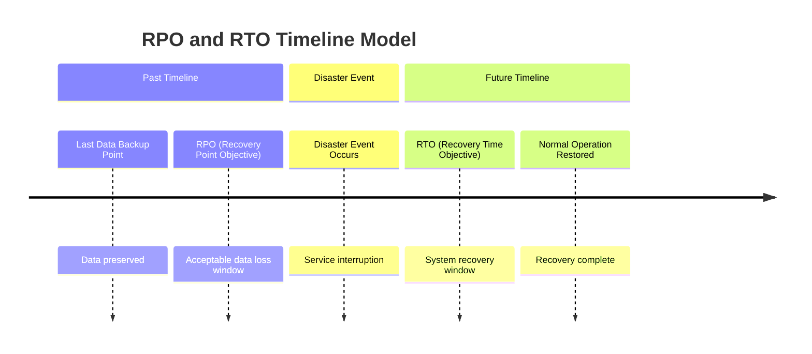

*Diagram Description:* The timeline diagram places the disaster event at the center. The time window extending backward to the last backup point defines the RPO (the amount of data potentially lost). The time window extending forward to full service restoration defines the RTO (the duration of system downtime).

---

## 2. Cloud Disaster Recovery Architecture Strategies

AWS defines four primary DR strategies with increasing levels of cost, complexity, and availability:

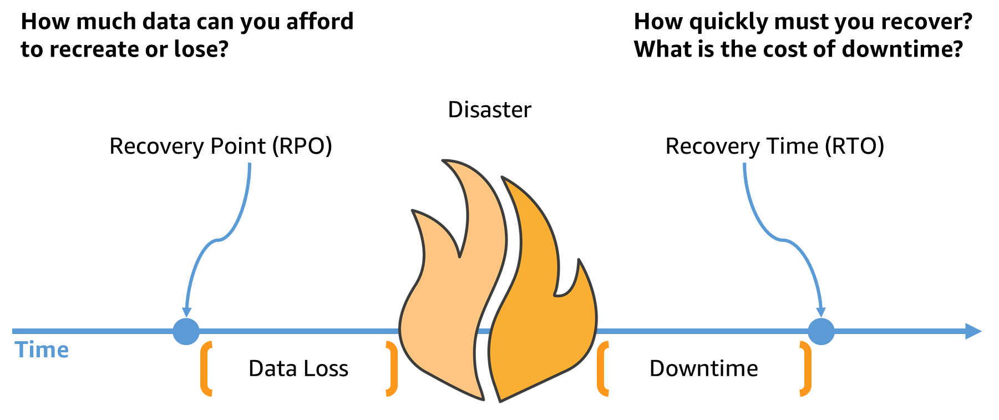

*AWS Diagram Description (DR Strategies Spectrum):* Official AWS Disaster Recovery Strategy Spectrum comparing RTO/RPO requirements against cost and complexity trade-offs across Backup & Restore, Pilot Light, Warm Standby, and Multi-Site Active-Active.

### Detailed Breakdown of the 4 DR Strategies

#### 2.1 Backup & Restore
- **Mechanism**: Data and application packages (AMIs, S3 Snapshots, EBS Snapshots) are periodically backed up to a secondary recovery Region. In a disaster event, a completely new infrastructure stack is provisioned from the backups.
- **Best Suited For**: Non-critical workloads or internal applications that do not require continuous uptime.

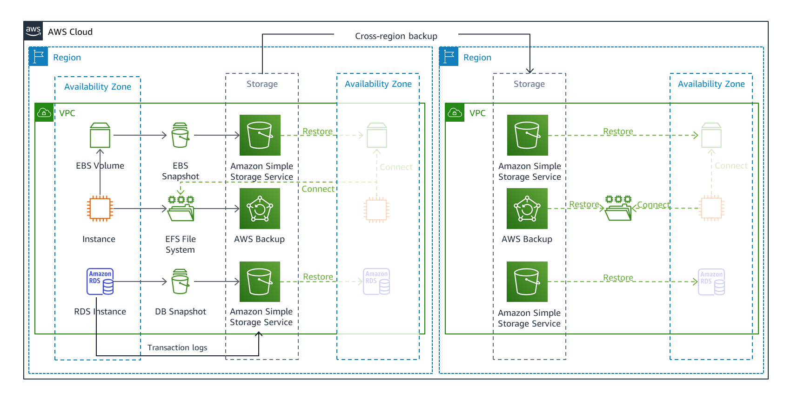

*AWS Diagram Description (Backup & Restore):* Shows automated periodic backup replication from the Primary Region to S3/EBS/RDS backups in the Secondary Region. Compute infrastructure in the Secondary Region is provisioned manually or via scripts only when a disaster occurs.

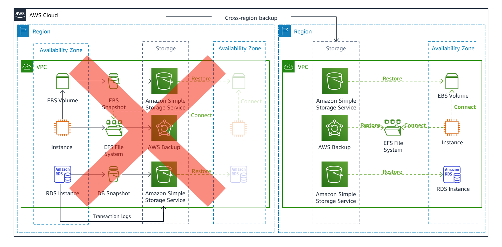

*AWS Diagram Description (Cross-Region Restore Workflow):* Demonstrates the multi-region backup failover process: Route 53 health check detects primary outage, triggers recovery execution, restores S3/EBS/RDS snapshots in the recovery Region, rebuilds compute instances using AWS CloudFormation/AMI, and promotes secondary endpoints.

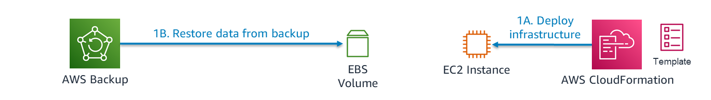

*AWS Diagram Description (Restoring Data & Rebuilding Infrastructure):* Illustrates the sequence of extracting EBS/S3 snapshots, provisioning EC2 instances in private subnets, attaching elastic IPs/load balancers, and running health checks prior to cutting over production DNS.

#### 2.2 Pilot Light
- **Mechanism**: Core data layer (Databases) is continuously replicated in real-time to the recovery Region. Compute resources (EC2, ECS, Lambda) remain turned off (OFF) or maintain only deployment templates (CloudFormation/Terraform). During failover, compute resources are automatically ignited and scaled up to handle production traffic.
- **Best Suited For**: Critical business applications requiring a balance between infrastructure holding costs and recovery time.

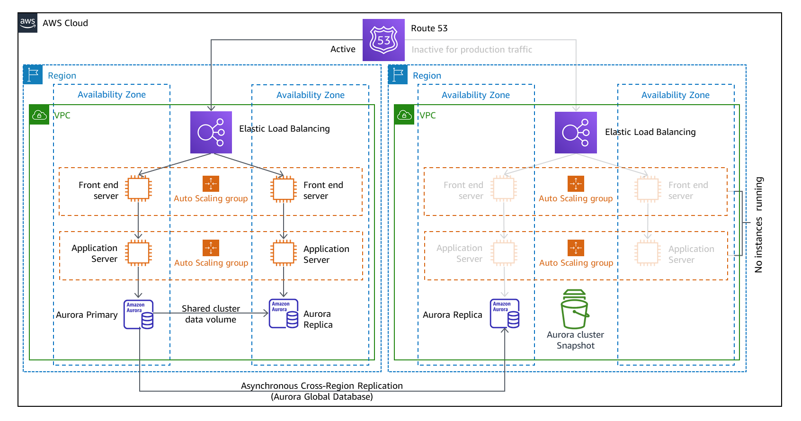

*AWS Diagram Description (Pilot Light):* The core data layer (Database) is actively replicated 24/7 from Primary to Secondary Region. The compute fleet (EC2) in the Secondary Region remains OFF. When a disaster occurs, CloudFormation/Auto Scaling provisions and launches the compute fleet to handle traffic.

#### 2.3 Warm Standby
- **Mechanism**: Maintains a scaled-down, fully functional "shadow" version of the entire infrastructure running 24/7 in the Secondary Region at minimal capacity (e.g., 1-2 instances). Upon failover, traffic is immediately served at reduced capacity while Auto Scaling rapidly scales out the fleet to handle 100% load.
- **Best Suited For**: Core business applications demanding RTO measured in minutes.

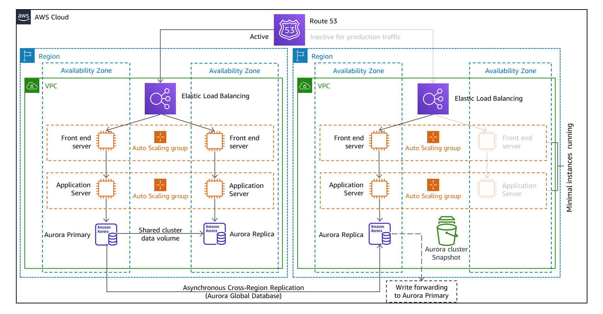

*AWS Diagram Description (Warm Standby):* All tiers (Web, App, DB) in the Secondary Region are running 24/7 in a scaled-down capacity. When Route 53 detects a failure and reroutes traffic, requests are processed immediately while Auto Scaling Group quickly expands fleet capacity to 100%.

#### 2.4 Active-Active Multi-Site
- **Mechanism**: Full infrastructure and applications run concurrently across two or more Regions. User traffic is actively distributed across Regions. Data is synchronized using multi-region bi-directional replication.
- **Best Suited For**: Mission-critical banking, payment processing, and high-frequency trading platforms requiring 99.99%+ availability (Zero Downtime).

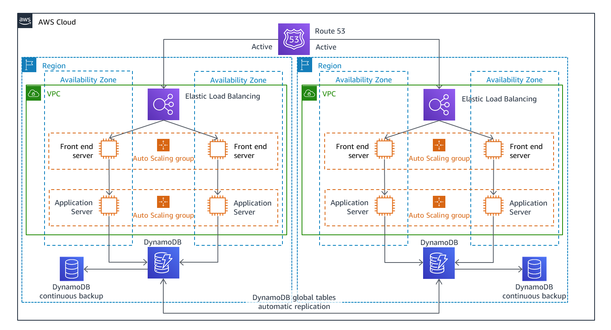

*AWS Diagram Description (Active-Active Multi-Site):* Both Regions are active, processing live user traffic concurrently with multi-region read/write capabilities and continuous bi-directional data replication.

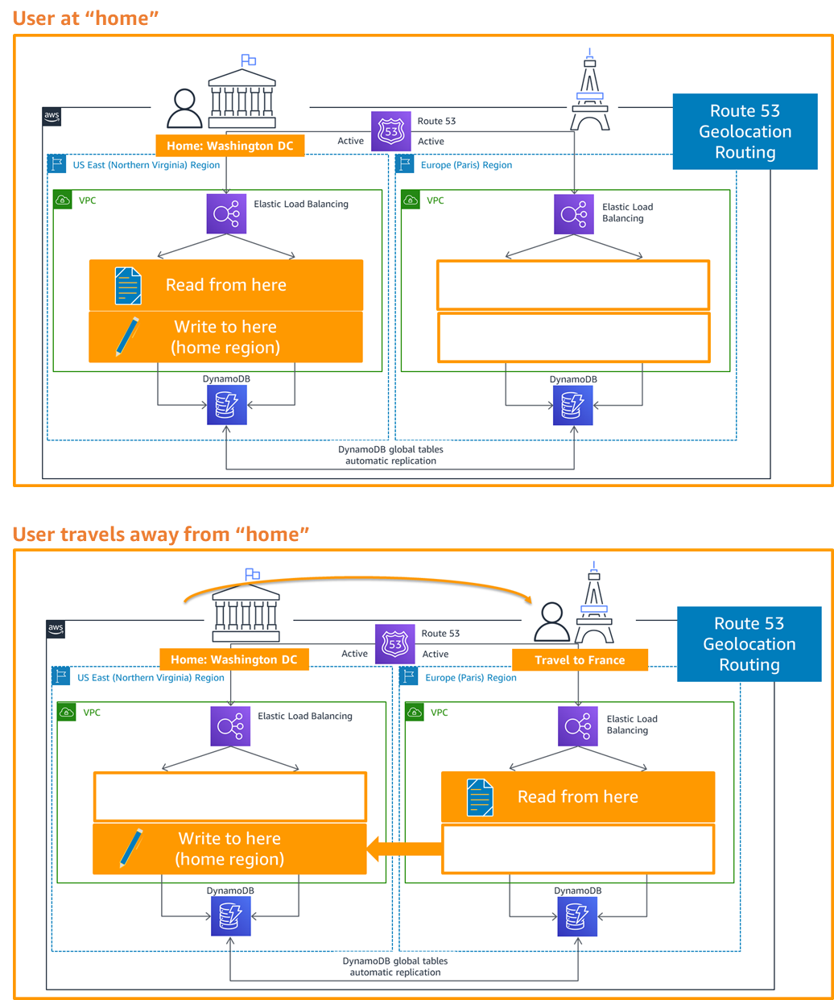

*AWS Diagram Description (Read-Local Write-Partitioned Pattern):* Architectural design pattern for Multi-Site Active-Active systems: Users read data locally from the nearest Region to reduce latency, while write operations are partitioned (e.g., by user ID range or geography) to avoid multi-region write conflict resolution penalties.

### Summary Comparison Table of DR Strategies

| DR Strategy | RPO | RTO | Holding Cost | Implementation Complexity |
| :--- | :--- | :--- | :--- | :--- |
| **Backup & Restore** | Hours / Days | Hours / Days | Lowest | Lowest |
| **Pilot Light** | Seconds / Minutes | Minutes / Hours | Low - Medium | Medium |
| **Warm Standby** | Near Instant | Minutes | Medium - High | High |
| **Active-Active** | Near Zero | Near Zero | Highest | Very High |

---

## 3. Multi-Region Event-Driven Failover Architecture (EventBridge & Route 53)

An Active-Passive Multi-Region architecture designed for Event-Driven applications ensures high availability and automatic resilience when an entire AWS Region experiences a major disruption.

### 3.1 Key Architectural Components

1. **Amazon Route 53**: Manages DNS Failover Routing and Health Checks monitoring the Primary Region API Endpoint.
2. **AWS Certificate Manager (ACM)**: Issues SSL/TLS certificates for a single shared Custom Domain Name across both Regions.
3. **Amazon API Gateway**: Acts as the HTTP Ingress endpoint utilizing Direct Service Integration to forward events straight to EventBridge without intermediate Lambda functions.
4. **Amazon EventBridge Bus**: Routes incoming events to target processing queues.
5. **Amazon SQS Queue**: Buffers event streams to guarantee zero event loss during failover transition periods.
### 3.1.1 Architectural Rationale: Why EventBridge, SQS, and AWS Lambda?

This architecture is specifically built for **Asynchronous Event-Driven Systems** (such as online payment processing, e-commerce order processing, financial transactions, and IoT data ingestion). In these workloads, loss of an event or request during a regional failover carries significant business consequences.

The specific role and technical necessity of each component in this pipeline:

1. **Amazon EventBridge (Event Router & Ingress Integration)**:
   - **Direct Service Integration**: API Gateway routes incoming HTTPS events directly into EventBridge *without requiring an intermediary ingress Lambda function*. This reduces glue code, lowers end-to-end latency, and eliminates cold start delays at the ingress boundary.
   - **Decoupled Event Routing & Extensibility**: EventBridge acts as a central bus filtering and routing events. Additional subscribers (such as audit logs, fraud detection, or analytics) can be attached via EventBridge rules without modifying API Gateway or client applications.

2. **Amazon SQS Queue (Buffering & Zero-Data-Loss Guard)**:
   - **Absorbing Traffic Spikes**: SQS acts as a load leveler, buffering high-volume bursts of events (e.g., flash sales or peak IoT ingestion) to protect downstream processing services from crashing.
   - **Zero Event Loss During Failover Window**: Route 53 DNS failover requires a short evaluation and propagation window (typically 10-60 seconds) to switch traffic. SQS ensures any events arriving at the Primary Region during this transition window are safely buffered and preserved until processing resumes.
   - **Decoupling Producer from Consumer**: Producers (API Gateway/EventBridge) receive an immediate `202 Accepted` response, decoupling client ingestion from heavy background processing.

3. **AWS Lambda (Event-Driven Auto Scaling Compute)**:
   - **On-Demand Execution & Auto Scaling**: Lambda polls messages from SQS Queues and automatically scales concurrency out/in based on queue depth (from zero up to thousands of concurrent executions).
   - **Cost Efficiency**: Operates strictly on a pay-per-use Serverless model, incurring zero compute cost when no events are present in standby state.
   - **Writing to Global Database**: Lambda executes core business logic and writes results to DynamoDB Global Tables, which then seamlessly handle cross-region data replication.

---

### 3.2 Normal Operating State Flow

Under normal conditions, all incoming user traffic is routed by Route 53 to the Primary Region.

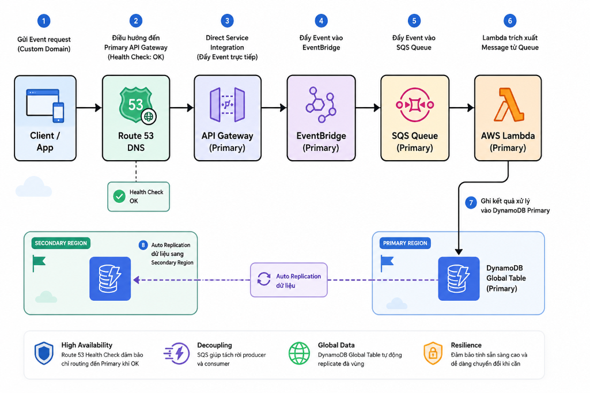

*Diagram Workflow Description (Normal Operating State):*
1. **Client / App**: Sends Event request to the shared Custom Domain.
2. **Route 53 DNS**: Verifies Health Check is OK and routes traffic to Primary API Gateway.
3. **API Gateway (Primary)**: Employs AWS Direct Service Integration to pass events directly into EventBridge (zero ingress Lambda overhead).
4. **EventBridge (Primary)**: Filters and pushes event to SQS Queue.
5. **SQS Queue (Primary)**: Buffers messages securely.
6. **AWS Lambda (Primary)**: Polling consumer extracts messages from SQS Queue.
7. **DynamoDB Global Table (Primary)**: Lambda writes processing results to Primary DynamoDB Table.
8. **Auto Replication**: DynamoDB Global Table asynchronously replicates data to Secondary Region in near real-time.

---

### 3.3 Failover State Flow

When the Primary Region experiences an infrastructure or network failure, Route 53 Health Check detects the failure and automatically shifts traffic to the Secondary Region.

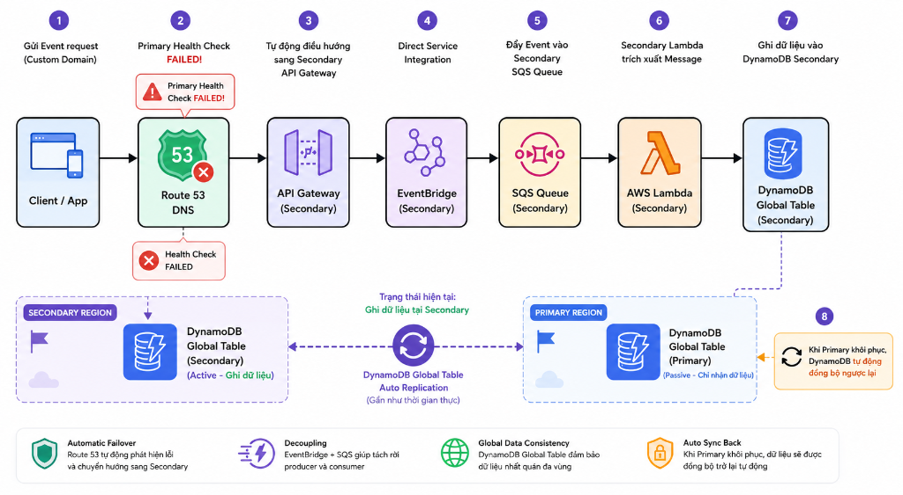

*Diagram Workflow Description (Failover State):*
1. **Client / App**: Sends Event request.
2. **Primary Health Check FAILED**: Route 53 detects Primary endpoint failure.
3. **Automatic Rerouting to Secondary API Gateway**: Route 53 redirects 100% of DNS traffic to Secondary Region.
4. **Direct Service Integration**: Secondary API Gateway forwards events straight into Secondary EventBridge.
5. **Secondary SQS Queue**: Buffers incoming events in Secondary Region.
6. **Secondary AWS Lambda**: Polling consumer processes messages from Secondary Queue.
7. **Write to DynamoDB Secondary**: Writes data directly into Secondary DynamoDB Table (now Active).
8. **Auto Sync Back**: Once Primary Region recovers, DynamoDB Global Table automatically synchronizes missing data back to Primary.

---

### 3.4 Core Architectural Advantages

1. **Zero Manual Intervention**: Route 53 Failover Routing based on automated Health Checks switches traffic seamlessly without requiring human operator intervention.
2. **Reduced Ingress Latency & Glue Code**: Direct AWS Service Integration between API Gateway and EventBridge bypasses intermediate ingress Lambda functions, lowering invocation costs and end-to-end latency.
3. **Global Data Consistency**: DynamoDB Global Tables maintain active-active data replication so the Secondary Region always possesses up-to-date state.
4. **Loose Coupling & Resilience**: Clear separation between Ingress (API Gateway/EventBridge), Buffer (SQS), and Compute (Lambda) isolates components and guarantees event preservation during DNS switch-over windows.

---

### 3.5 Implementation Considerations & Trade-offs

1. **DNS Failover Propagation Delay**:
   - Route 53 evaluation period (`Evaluation Period = TTL + Health Check Interval * Failure Threshold`) introduces a short window before DNS updates.
   - Set low DNS record TTL values (e.g., 10-60 seconds) to minimize client-side DNS caching delay.
2. **SSL/TLS ACM Certificate Configuration**:
   - Must issue and validate identical Custom Domain ACM certificates independently in both Regions.
3. **Multi-Region Cost Overhead**:
   - Duplicating resources across two Regions and paying inter-region data transfer fees increases total AWS bill compared to single-region setups.
4. **Resource Cleanup Order**:
   - When tearing down IaC stacks (CloudFormation/Terraform), delete the Secondary Stack first before Primary Stack because Primary Stack owns the initial DynamoDB Global Table definition.

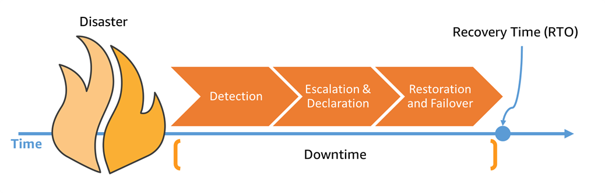

*AWS Diagram Description (RTO Breakdown Components):* Shows the sequential phase breakdown contributing to total RTO: Detection time (identifying regional failure), Notification time (alerting operators/systems), Execution time (DNS failover or CloudFormation provisioning), and Recovery Verification time (validating health checks before cutover).

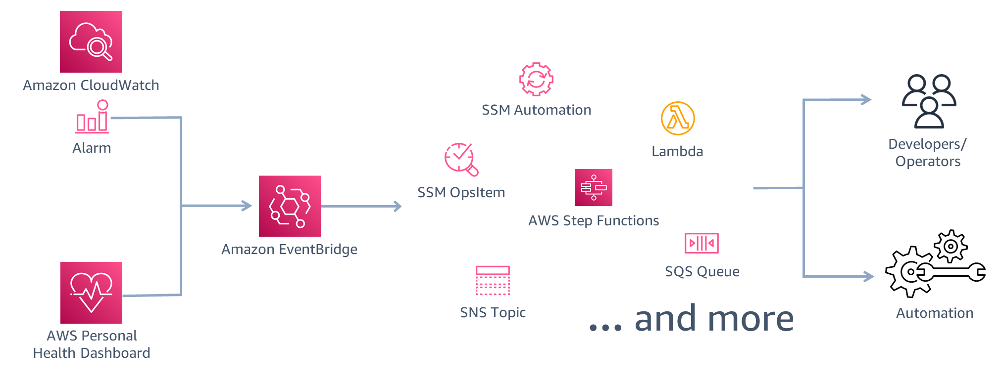

*AWS Diagram Description (Automated Detection with EventBridge):* Demonstrates using EventBridge rules to capture AWS Health / CloudWatch alarm events, triggering automated failover Lambda functions or Systems Manager Automation runbooks instantly upon anomaly detection.

---

### 3.6 Best Use Cases

- **Financial & Payment Processing Systems**: Where data loss or connection drops carry severe financial liability.
- **E-Commerce Order Fulfillment**: Requiring 24/7 continuous order ingestion without downtime.
- **IoT & Telemetry Data Streams**: Ingesting high-throughput telemetry events with strict zero-data-loss guarantees.
- **Planned Maintenance & Traffic Migration**: Enables proactive traffic shifting to a standby region during scheduled maintenance without impacting end users.

---

## 4. References

- AWS Architecture Blog: [Disaster Recovery (DR) Architecture on AWS Part III: Pilot Light and Warm Standby](https://aws.amazon.com/vi/blogs/architecture/disaster-recovery-dr-architecture-on-aws-part-iii-pilot-light-and-warm-standby/)
- AWS Compute Blog: [Multi-Region event-driven failover architecture with Amazon EventBridge and Route 53](https://aws.amazon.com/blogs/compute/multi-region-event-driven-failover-architecture-with-amazon-eventbridge-and-route-53/)
- Amazon EventBridge Documentation: [AWS EventBridge User Guide](https://docs.aws.amazon.com/eventbridge/)
- Amazon Route 53 Developer Guide: [Amazon Route 53 Health Checks and DNS Failover](https://docs.aws.amazon.com/Route53/latest/DeveloperGuide/dns-failover.html)
