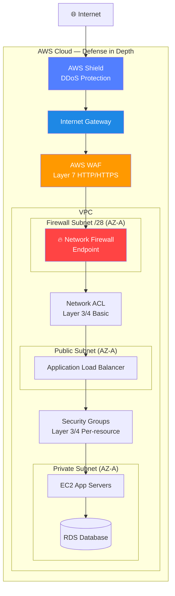
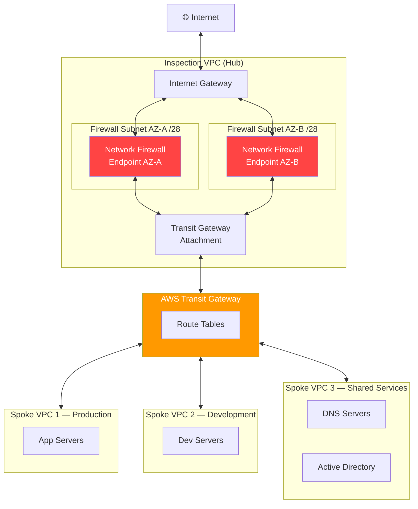
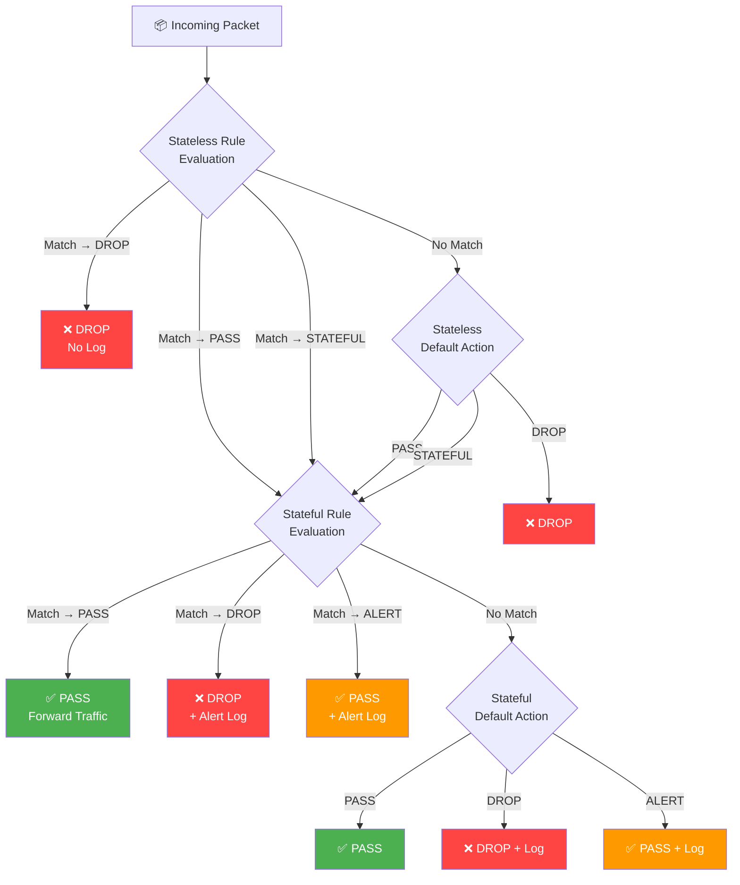
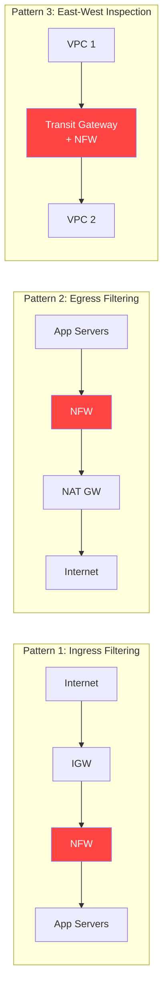

# AWS Network Firewall: Hướng Dẫn Học Tập Toàn Diện

---

## 1. Overview & The "Why"

### Định nghĩa

**AWS Network Firewall** là dịch vụ tường lửa mạng **stateful, managed** ở cấp độ VPC, cho phép kiểm soát và lọc traffic ở Layer 3, Layer 4, và Layer 7 (Application Layer). Dịch vụ này được tích hợp sâu vào hạ tầng VPC của AWS, hỗ trợ **deep packet inspection (DPI)**, lọc domain, và phát hiện/ngăn chặn xâm nhập (IDS/IPS) thông qua rule engine Suricata tương thích.

### Vấn đề thực tế được giải quyết

Trong một VPC điển hình, **Security Groups** và **Network ACLs** chỉ hoạt động ở Layer 3/4 với các rule IP/port đơn giản — chúng **không thể**:

- Lọc traffic dựa trên **domain name** (e.g., chặn `*.malicious.com`).
- Thực hiện **deep packet inspection** để phát hiện payload độc hại.
- Áp dụng **IDS/IPS rules** để ngăn chặn các khai thác zero-day.
- Kiểm soát traffic theo **protocol state** phức tạp (stateful inspection).
- Tập trung quản lý policy bảo mật mạng cho **toàn bộ Organization** qua AWS Firewall Manager.

AWS Network Firewall lấp đầy khoảng trống này — cung cấp một lớp bảo vệ mạng sâu hơn, linh hoạt hơn, và quản lý tập trung hơn.

### Analogy

> **Hãy hình dung bảo mật mạng của bạn như hệ thống kiểm soát vào ra của một tòa nhà doanh nghiệp:**
>
> - **Security Groups** = Bảo vệ ở cửa từng phòng — chỉ kiểm tra số phòng và thẻ từ (IP/port), không hỏi bạn đến làm gì.
> - **Network ACL** = Danh sách kiểm soát ở cổng tầng — cũng chỉ dựa trên danh sách IP cho phép/cấm.
> - **AWS Network Firewall** = Cổng kiểm soát an ninh trung tâm có **máy quét X-quang và nhận diện khuôn mặt** — kiểm tra cả nội dung bên trong túi (deep packet inspection), nhận diện người đến từ tổ chức nào (domain filtering), và tự động so khớp với cơ sở dữ liệu nghi phạm đã biết (Suricata IPS rules).

---

## 2. Core Components & Keywords

| Thuật ngữ                        | Giải thích                                                                                                           |
| -------------------------------- | -------------------------------------------------------------------------------------------------------------------- |
| **Firewall**                     | Tài nguyên chính — liên kết Firewall Policy với VPC cụ thể và triển khai Firewall Endpoints.                         |
| **Firewall Policy**              | Bộ cấu hình trung tâm gắn kết Rule Groups thành một policy hoàn chỉnh. Một Policy có thể gắn với nhiều Firewall.     |
| **Rule Group**                   | Container chứa các firewall rules (stateless hoặc stateful). Có thể tái sử dụng giữa nhiều Firewall Policies.        |
| **Stateless Rule Group**         | Xử lý từng packet độc lập, không theo dõi connection state. Quyết định dựa trên IP/port/protocol.                    |
| **Stateful Rule Group**          | Theo dõi toàn bộ connection state. Hỗ trợ Suricata-compatible IPS rules, domain list, 5-tuple.                       |
| **Firewall Endpoint**            | ENI (Elastic Network Interface) được AWS Network Firewall tạo ra trong một subnet riêng (Firewall Subnet).           |
| **Firewall Subnet**              | Subnet chuyên dụng `/28` tối thiểu, **chỉ** chứa Firewall Endpoint — không đặt tài nguyên khác vào đây.              |
| **Suricata**                     | Open-source IDS/IPS engine — AWS Network Firewall hỗ trợ cú pháp Suricata rules tương thích cho stateful inspection. |
| **Deep Packet Inspection (DPI)** | Kiểm tra nội dung thực của packet (payload), không chỉ header — phát hiện malware, exploits, data exfiltration.      |
| **Domain List Rules**            | Lọc traffic HTTP/HTTPS dựa trên domain name (SNI cho HTTPS, Host header cho HTTP).                                   |
| **5-Tuple Rules**                | Rules dựa trên 5 yếu tố: source IP, source port, destination IP, destination port, protocol.                         |
| **Default Action**               | Hành động mặc định khi traffic không khớp bất kỳ rule nào: `PASS`, `DROP`, hoặc `ALERT`.                             |
| **Alert Logs**                   | Log các traffic match với `ALERT` action — gửi đến CloudWatch Logs, S3, hoặc Kinesis Firehose.                       |
| **Flow Logs**                    | Log metadata của tất cả network flows qua firewall.                                                                  |
| **AWS Firewall Manager**         | Dịch vụ quản lý tập trung — deploy và enforce Network Firewall Policy trên toàn bộ AWS Organization.                 |
| **Capacity Units**               | Đơn vị đo lường cho Rule Groups — mỗi rule tiêu thụ một số capacity units nhất định.                                 |
| **Managed Rule Groups**          | Rule Groups được AWS hoặc đối tác (e.g., CrowdStrike, Trend Micro) quản lý, cập nhật tự động.                        |
| **Ingress Traffic**              | Traffic đi vào VPC từ Internet hoặc nguồn bên ngoài.                                                                 |
| **Egress Traffic**               | Traffic đi ra khỏi VPC ra Internet hoặc đích bên ngoài.                                                              |
| **East-West Traffic**            | Traffic giữa các workload nội bộ (VPC-to-VPC, subnet-to-subnet).                                                     |

---

## 3. Visual Theory & Architecture

### 3.1 Vị trí AWS Network Firewall trong Defense-in-Depth



**Giải thích — Các lớp bảo vệ từ ngoài vào trong:**

1. **AWS Shield**: Lớp ngoài cùng — hấp thụ DDoS attacks trước khi vào hạ tầng.
2. **AWS WAF**: Layer 7 HTTP/HTTPS inspection — chặn SQL injection, XSS, bad bots.
3. **AWS Network Firewall**: Stateful network inspection — DPI, IPS rules, domain filtering cho **mọi loại traffic** (không chỉ HTTP).
4. **Network ACL**: Stateless packet filtering cơ bản ở subnet level.
5. **Security Groups**: Stateful per-resource firewall ở instance level.

> **Điểm khác biệt quan trọng:** WAF chỉ xử lý HTTP/HTTPS. Network Firewall xử lý **mọi giao thức** (TCP, UDP, ICMP, TLS, SSH, DNS, v.v.).

---

### 3.2 Kiến trúc triển khai — Centralized Inspection VPC



**Giải thích — Centralized Inspection Architecture:**

1. **Inspection VPC (Hub)** chứa Network Firewall Endpoints — tất cả traffic buộc phải đi qua đây.
2. **Spoke VPCs** (Production, Development, Shared Services) kết nối với Hub qua **Transit Gateway**.
3. **Route Tables** của Transit Gateway được cấu hình để route tất cả traffic (0.0.0.0/0 cho egress, và traffic giữa spokes) qua Inspection VPC trước.
4. **Lợi ích:** Một Network Firewall Policy duy nhất kiểm soát toàn bộ network — không cần deploy firewall riêng ở mỗi VPC. Tiết kiệm chi phí và đơn giản hóa quản lý.

---

### 3.3 Luồng Traffic qua Network Firewall (Route Table Logic)

```mermaid
sequenceDiagram
    participant Client as Internet Client
    participant IGW as Internet Gateway
    participant NFW as "Network Firewall
Endpoint"
    participant ALB as ALB / EC2

    Note over IGW,NFW: "Ingress Route Table:
0.0.0.0/0 → NFW Endpoint"
    Note over NFW,ALB: "Private Route Table:
0.0.0.0/0 → NFW Endpoint"

    Client->>IGW: 1. Packet arrives at IGW
    IGW->>NFW: "2. IGW Route Table
directs to NFW Endpoint"

    alt Packet matches DROP rule
        NFW-->>Client: "3a. Packet DROPPED
(Alert logged)"
    else Packet matches ALERT rule
        NFW->>ALB: "3b. Packet PASSED
+ Alert logged to CloudWatch/S3"
    else No rule match → Default PASS
        NFW->>ALB: 3c. Packet forwarded
    end

    ALB->>NFW: "4. Response traffic returns
via NFW (stateful)"
    NFW->>IGW: "5. Response forwarded
(connection tracked)"
    IGW->>Client: 6. Response delivered
```

**Giải thích từng bước:**

1. **Packet đến IGW**: Internet client gửi request đến public IP trong VPC.
2. **IGW Route Table redirect**: Route table của IGW được cấu hình với entry đặc biệt — thay vì route thẳng đến subnet, nó route đến **Firewall Endpoint** (đây là điểm cấu hình then chốt).
3. **Firewall inspection**: Network Firewall kiểm tra packet theo thứ tự — Stateless rules trước, Stateful rules sau.
4. **Kết quả**: `DROP` (hủy packet + log), `ALERT` (cho qua + log cảnh báo), hoặc `PASS` (cho qua không log).
5. **Return traffic**: Vì Network Firewall là **stateful**, traffic trở về tự động được track và forward đúng — không cần rule riêng cho chiều về.

> **Điểm cấu hình quan trọng nhất:** Phải cấu hình **cả hai** route tables — Ingress Route Table (gắn với IGW) và Subnet Route Table (của protected subnet) — đều trỏ traffic qua Network Firewall Endpoint. Nếu thiếu một trong hai, traffic sẽ **bypass** firewall.

---

### 3.4 Rule Processing Order — Stateless vs Stateful



**Giải thích luồng xử lý:**

1. **Stateless Rules** được đánh giá **đầu tiên** theo priority (số nhỏ hơn = ưu tiên cao hơn). Mỗi packet được đánh giá độc lập, không có state context.
2. Packet được stateless rules gửi sang **Stateful** evaluation, `DROP`, hoặc `PASS` thẳng.
3. **Stateful Rules** được đánh giá với đầy đủ connection context. Suricata engine phân tích payload.
4. **Default Action** của từng layer là "lưới an toàn" cuối cùng — best practice là set default stateful action là `DROP_ESTABLISHED` hoặc `ALERT_ESTABLISHED` để tránh traffic lọt qua mà không được kiểm tra.

---

### 3.5 Các Pattern Kiến trúc phổ biến



**Ba pattern triển khai chính:**

- **Ingress Filtering**: Kiểm tra traffic từ Internet vào VPC — ngăn chặn attacks, exploits từ bên ngoài.
- **Egress Filtering**: Kiểm tra traffic từ VPC ra Internet — ngăn chặn data exfiltration, kết nối đến C2 servers, chặn domain độc hại.
- **East-West Inspection**: Kiểm tra traffic giữa các VPC — Zero Trust model, ngăn chặn lateral movement.

---

## 4. Detailed Deep Dive

### 4.1 Rule Groups — Phân loại và Cấu trúc

#### Stateless Rule Groups

Stateless rules xử lý từng packet **độc lập**, không có context về connection. Tốc độ xử lý nhanh nhất.

**Các trường có thể match:**

- Source/Destination IP hoặc CIDR
- Source/Destination Port
- Protocol (TCP, UDP, ICMP, v.v.)
- TCP Flags (SYN, ACK, FIN, RST, URG, PSH)

**Actions:**

- `PASS` — Forward packet, dừng stateless evaluation
- `DROP` — Hủy packet ngay lập tức
- `STATEFUL` — Chuyển sang stateful engine để phân tích sâu hơn
- `CUSTOM_ACTION` — Forward đến CloudWatch metric + một trong các action trên

#### Stateful Rule Groups

Ba định dạng rule stateful:

| Định dạng              | Mô tả                                                      | Use Case                                               |
| ---------------------- | ---------------------------------------------------------- | ------------------------------------------------------ |
| **5-Tuple**            | Source IP, Source Port, Dest IP, Dest Port, Protocol       | Rules đơn giản, tương tự Security Group nhưng stateful |
| **Domain List**        | Danh sách domain cho phép/chặn (allow-list hoặc deny-list) | Egress control, web filtering                          |
| **Suricata IPS Rules** | Cú pháp rule Suricata đầy đủ với keyword inspection        | IDS/IPS, DPI, protocol anomaly detection               |

#### Suricata Rule Examples

```
# Chặn traffic đến domain C2 đã biết
drop dns $HOME_NET any -> any 53 (
    dns.query; content:"malicious-c2.com"; nocase;
    msg:"Blocked C2 domain"; sid:1000001; rev:1;
)

# Alert khi phát hiện SSH brute force
alert ssh any any -> $HOME_NET 22 (
    msg:"SSH brute force attempt";
    threshold:type both, track by_src, count 5, seconds 60;
    sid:1000002; rev:1;
)

# Chặn HTTP request với User-Agent của scanner
drop http any any -> any any (
    http.user_agent; content:"Nmap Scripting Engine";
    msg:"Nmap scan detected"; sid:1000003; rev:1;
)
```

---

### 4.2 Domain List Rules — Web Filtering

Domain List là cách đơn giản nhất để kiểm soát egress HTTP/HTTPS traffic:

```
# Allow-list (chặn tất cả, chỉ cho phép domain trong danh sách)
Type: ALLOWLIST
Domains:
  - .amazonaws.com
  - .github.com
  - updates.myapp.com

# Deny-list (cho phép tất cả, chặn domain trong danh sách)
Type: DENYLIST
Domains:
  - .malware-site.com
  - .phishing-example.net
```

**Cách hoạt động:**

- Với **HTTPS**: Network Firewall đọc **SNI (Server Name Indication)** trong TLS ClientHello — không decrypt nội dung.
- Với **HTTP**: Đọc `Host` header trong HTTP request.
- Hỗ trợ **wildcard** với dấu chấm đầu (`.example.com` match `sub.example.com` và `example.com`).

> **Quan trọng:** Domain List rules cho HTTPS hoạt động dựa trên **SNI, không decrypt traffic**. Nếu client không gửi SNI (ví dụ: kết nối bằng IP trực tiếp), rule sẽ không hoạt động.

---

### 4.3 Logging Configuration

AWS Network Firewall hỗ trợ ba loại log:

| Loại Log       | Nội dung                                                | Destination                           |
| -------------- | ------------------------------------------------------- | ------------------------------------- |
| **Alert Logs** | Chi tiết packets khớp với ALERT/DROP rules              | CloudWatch Logs, S3, Kinesis Firehose |
| **Flow Logs**  | Metadata của mọi network flow (5-tuple + bytes/packets) | CloudWatch Logs, S3, Kinesis Firehose |
| **TLS Logs**   | Thông tin TLS handshake (SNI, certificate details)      | CloudWatch Logs, S3, Kinesis Firehose |

**Best practice:** Gửi logs đến **S3** cho long-term retention (cost-effective) và đồng thời đến **CloudWatch Logs** cho real-time alerting qua CloudWatch Alarms.

---

### 4.4 High Availability và Scaling

- **Per-AZ Deployment**: Network Firewall **tự động** triển khai endpoint trong mỗi AZ được chỉ định. Traffic trong một AZ luôn đi qua endpoint trong chính AZ đó (tránh cross-AZ charges và giảm latency).
- **Auto-scaling**: Firewall capacity tự động scale theo traffic — không cần provision instance size.
- **Multi-AZ resilience**: Nếu một AZ bị lỗi, traffic trong các AZ khác không bị ảnh hưởng (mỗi AZ có endpoint riêng).

> **Lưu ý quan trọng về Route Tables:** Phải cấu hình route tables **riêng cho từng AZ**. Traffic từ Subnet-A phải đi qua Firewall Endpoint trong AZ-A, không phải AZ-B (asymmetric routing gây lỗi).

---

### 4.5 AWS Firewall Manager Integration

**AWS Firewall Manager** cho phép quản lý Network Firewall tập trung trên toàn bộ AWS Organization:

```
AWS Organizations
├── Management Account (Firewall Manager Admin)
│   └── Firewall Manager Policy
│       ├── Scope: All accounts / Specific OUs
│       ├── Network Firewall Policy (Rule Groups)
│       └── Remediation: Auto-create firewall in non-compliant VPCs
├── Account A (Production) ← Auto-deployed firewall
├── Account B (Development) ← Auto-deployed firewall
└── Account C (Staging) ← Auto-deployed firewall
```

**Lợi ích:**

- **Centralized governance**: Một policy áp dụng cho toàn bộ organization.
- **Auto-remediation**: Tự động tạo firewall trong VPC mới không tuân thủ policy.
- **Compliance visibility**: Dashboard hiển thị trạng thái compliance của từng account.

---

## 5. Practical Scenarios & Integration

### Kịch bản 1: Egress Security — Ngăn chặn Data Exfiltration (Privacy-by-Design)

**Bài toán:** Một công ty healthcare lưu trữ PHI (Protected Health Information) trên EC2 trong private subnets. Yêu cầu: chỉ cho phép EC2 kết nối đến các domain đã được approve, ngăn chặn mọi kết nối ra ngoài ngoài whitelist — đảm bảo tuân thủ HIPAA.

**Kiến trúc:**

```
EC2 (Private Subnet)
    ↓ Route: 0.0.0.0/0 → NFW Endpoint
Network Firewall Endpoint (Firewall Subnet)
    ↓ Rule: Allow-list domains only
NAT Gateway (Public Subnet)
    ↓
Internet Gateway → Internet
```

**Rule Configuration:**

```
# Stateful Rule Group: Egress Allow-list
Type: Domain List — ALLOWLIST
Action: DROP (drop anything NOT in list)

Allowed Domains:
  - .amazonaws.com          # AWS services (S3, KMS, etc.)
  - .cloudwatch.amazonaws.com
  - updates.softwarename.com # Approved vendor updates
  - .pki.goog               # Google certificate validation

# Stateful Rule Group: Block High-Risk Ports
5-Tuple Rules:
  - DROP TCP any → any 4444  # Common C2 port
  - DROP TCP any → any 1337  # Common C2 port
  - ALERT TCP any → any 443 (destination not in approved CIDR)
```

**IaC (Terraform):**

```hcl
resource "aws_networkfirewall_firewall_policy" "egress_policy" {
  name = "healthcare-egress-policy"

  firewall_policy {
    stateless_default_actions          = ["aws:forward_to_sfe"]
    stateless_fragment_default_actions = ["aws:forward_to_sfe"]

    stateful_rule_group_reference {
      resource_arn = aws_networkfirewall_rule_group.domain_allowlist.arn
      priority     = 100
    }

    stateful_rule_group_reference {
      resource_arn = aws_networkfirewall_rule_group.block_c2_ports.arn
      priority     = 200
    }

    stateful_default_actions = ["aws:drop_established"]
  }
}

resource "aws_networkfirewall_rule_group" "domain_allowlist" {
  capacity = 100
  name     = "healthcare-domain-allowlist"
  type     = "STATEFUL"

  rule_group {
    rules_source {
      rules_source_list {
        generated_rules_type = "ALLOWLIST"
        target_types         = ["HTTP_HOST", "TLS_SNI"]
        targets = [
          ".amazonaws.com",
          ".cloudwatch.amazonaws.com",
          "updates.softwarename.com",
        ]
      }
    }
  }
}

resource "aws_networkfirewall_firewall" "main" {
  name                = "healthcare-vpc-firewall"
  firewall_policy_arn = aws_networkfirewall_firewall_policy.egress_policy.arn
  vpc_id              = aws_vpc.main.id

  subnet_mapping {
    subnet_id = aws_subnet.firewall_az_a.id
  }

  subnet_mapping {
    subnet_id = aws_subnet.firewall_az_b.id
  }

  tags = {
    Name        = "Healthcare Egress Firewall"
    Compliance  = "HIPAA"
    Environment = "production"
  }
}

resource "aws_networkfirewall_logging_configuration" "main" {
  firewall_arn = aws_networkfirewall_firewall.main.arn

  logging_configuration {
    log_destination_config {
      log_destination = {
        bucketName = aws_s3_bucket.firewall_logs.bucket
        prefix     = "alert-logs/"
      }
      log_destination_type = "S3"
      log_type             = "ALERT"
    }

    log_destination_config {
      log_destination = {
        logGroup = aws_cloudwatch_log_group.firewall_flow.name
      }
      log_destination_type = "CloudWatchLogs"
      log_type             = "FLOW"
    }
  }
}
```

---

### Kịch bản 2: Centralized Ingress Inspection với IPS — Multi-Account Architecture

**Bài toán:** Một tổ chức tài chính có 20+ AWS accounts trong Organization. Yêu cầu: **mọi** traffic từ Internet vào bất kỳ workload nào đều phải đi qua một Network Firewall tập trung với IPS rules để phát hiện các cuộc tấn công phổ biến (OWASP Top 10, CVE exploits).

**Kiến trúc:**

```
Internet
    ↓
Internet Gateway (Shared Services Account)
    ↓
Network Firewall — Centralized Inspection VPC
    ├── Suricata IPS Rules (AWS Managed + Custom)
    ├── Alert Logs → Security Information & Event Management (SIEM)
    └── Flow Logs → S3 (compliance archive)
    ↓
Transit Gateway
    ├── Production Account VPCs
    ├── Development Account VPCs
    └── Staging Account VPCs
```

**Firewall Manager Policy (JSON):**

```json
{
  "type": "NETWORK_FIREWALL",
  "networkFirewallStatefulRuleGroupReferences": [
    {
      "resourceARN": "arn:aws:network-firewall::aws-managed:stateful-rulegroup/ThreatSignaturesWebAttacks",
      "priority": 100
    },
    {
      "resourceARN": "arn:aws:network-firewall::aws-managed:stateful-rulegroup/ThreatSignaturesMalware",
      "priority": 200
    }
  ],
  "networkFirewallStatelessDefaultActions": ["aws:forward_to_sfe"],
  "networkFirewallStatelessFragmentDefaultActions": ["aws:forward_to_sfe"],
  "networkFirewallStatefulDefaultActions": ["aws:alert_established"]
}
```

**AWS Managed Rule Groups có sẵn:**

- `ThreatSignaturesWebAttacks` — SQLi, XSS, RCE web exploits
- `ThreatSignaturesMalware` — Known malware communication patterns
- `ThreatSignaturesDoS` — DoS/DDoS attack signatures
- `ThreatSignaturesBotnet` — Botnet C2 communication
- `ThreatSignaturesEmergingEvents` — Recently discovered threats (updated by AWS)

---

### Kịch bản 3: East-West Inspection — Zero Trust giữa các Microservices

**Bài toán:** Sau khi bị tấn công lateral movement (kẻ tấn công compromise một service, sau đó di chuyển sang các service khác trong cùng VPC), công ty muốn áp dụng Zero Trust: **mọi traffic giữa microservices đều phải được kiểm tra**, kể cả traffic nội bộ.

**Rule Example — Microservice Communication Control:**

```
# Chỉ cho phép Payment Service gọi đến Database
PASS tcp 10.0.1.0/24 any -> 10.0.2.0/24 5432  # Payment → DB (PostgreSQL)
DROP tcp 10.0.3.0/24 any -> 10.0.2.0/24 5432  # Block Frontend → DB (direct)

# Alert bất thường: service gọi SSH
ALERT ssh any any -> 10.0.0.0/8 22 (
    msg:"Unusual SSH from microservice";
    sid:2000001; rev:1;
)

# Block DNS queries đến non-corporate resolvers (DNS tunneling prevention)
DROP dns any any -> !10.0.0.2 53 (
    msg:"DNS to unauthorized resolver";
    sid:2000002; rev:1;
)
```

---

## 6. Exam Essentials & Pro Tips

### 6.1 Bẫy thường gặp trong kỳ thi (Exam Traps)

| Tình huống trong đề thi                                | Câu trả lời SAI (Bẫy)            | Câu trả lời ĐÚNG                                                         |
| ------------------------------------------------------ | -------------------------------- | ------------------------------------------------------------------------ |
| Cần lọc traffic theo **domain name** (không phải HTTP) | WAF                              | **Network Firewall** (domain list rules)                                 |
| Cần **IPS/IDS** cho mọi protocol                       | WAF (chỉ HTTP/HTTPS)             | **Network Firewall** (Suricata rules)                                    |
| Cần **deep packet inspection** cho SSH, DNS, SMTP      | Security Group                   | **Network Firewall**                                                     |
| Traffic **bypass firewall** dù đã tạo Firewall         | Lỗi rule                         | **Lỗi Route Table** — thiếu cấu hình Ingress route hoặc Subnet route     |
| Cần stateful inspection cho mọi TCP connection         | NACL (stateless)                 | **Network Firewall** hoặc Security Groups (SG chỉ stateful per-resource) |
| Firewall chỉ ở một AZ, traffic từ AZ khác bị lỗi       | Rule issue                       | **Route table asymmetry** — mỗi AZ cần endpoint và route table riêng     |
| Cần **centralized** policy trên nhiều accounts         | Deploy riêng từng account        | **AWS Firewall Manager**                                                 |
| Cần decrypt HTTPS để inspect nội dung                  | Network Firewall (không decrypt) | **AWS WAF** + **Certificate Manager** hoặc giải pháp TLS inspection      |

---

### 6.2 So sánh Network Firewall vs Các dịch vụ liên quan

| Tiêu chí             | Security Group  | NACL            | AWS WAF                   | Network Firewall    |
| -------------------- | --------------- | --------------- | ------------------------- | ------------------- |
| **Layer**            | L3/L4           | L3/L4           | L7 (HTTP/S)               | L3–L7               |
| **Stateful**         | ✅              | ❌              | ✅                        | ✅ (Stateful rules) |
| **Protocol Support** | IP/TCP/UDP/ICMP | IP/TCP/UDP/ICMP | HTTP/HTTPS                | **All protocols**   |
| **DPI**              | ❌              | ❌              | Partial                   | ✅                  |
| **Domain Filtering** | ❌              | ❌              | ✅                        | ✅                  |
| **IPS/IDS**          | ❌              | ❌              | ❌                        | ✅ (Suricata)       |
| **Scope**            | Per-ENI         | Per-Subnet      | Per-ALB/API GW/CloudFront | Per-VPC             |
| **Managed**          | Yes             | Yes             | Yes                       | Yes                 |
| **Cost**             | Free            | Free            | Pay-per-use               | Pay-per-hour + data |

---

### 6.3 Best Practices

#### Cost Optimization

- **Firewall Endpoint per AZ**: Chỉ tạo endpoint ở những AZ có workload thực sự — mỗi endpoint tính phí theo giờ (~$0.395/giờ).
- **Rule Group Capacity**: Plan capacity cẩn thận — mỗi rule tiêu thụ capacity units, và capacity không thể giảm sau khi tạo (chỉ tăng được).
- **Logging**: Dùng **S3** cho long-term logs (rẻ hơn nhiều so với CloudWatch Logs cho volume lớn). Chỉ dùng CloudWatch Logs cho alerting real-time.
- **Managed Rules vs Custom**: Dùng AWS Managed Rule Groups cho common threats — không cần maintain, luôn được cập nhật.

#### Security Best Practices

- **Default Action = DROP**: Set `stateful_default_actions = ["aws:drop_established"]` — deny-by-default, chỉ cho phép traffic đã được explicitly allow.
- **Separate Rule Groups by Function**: Tách rule groups theo mục đích (egress-control, ingress-ips, lateral-movement) để dễ quản lý và audit.
- **Rule Priority**: Sử dụng khoảng cách priority (100, 200, 300) thay vì liên tiếp (1, 2, 3) để dễ chèn rule mới sau này.
- **Enable TLS Logging**: Giúp phát hiện bất thường trong TLS handshakes mà không cần decrypt.
- **Use Access Points**: Kết hợp Network Firewall với **VPC Endpoint** cho AWS services để traffic đến S3, KMS không cần ra Internet.
- **Least Privilege cho Rule Group**: Dùng IAM conditions để giới hạn ai có thể modify rule groups production.

#### Performance Best Practices

- **Stateless trước Stateful**: Đặt rules đơn giản (IP/port based) ở Stateless layer để giảm tải cho Stateful engine.
- **Specific Rules trước General**: Rules cụ thể (IP cụ thể, port cụ thể) đặt ở priority cao hơn rules rộng.
- **Avoid Overlapping Rules**: Rules trùng lặp gây lãng phí capacity và có thể gây kết quả không mong muốn.
- **Test với ALERT trước khi DROP**: Khi triển khai rule mới, dùng `ALERT` action trước để quan sát traffic bị ảnh hưởng — sau khi verify mới chuyển sang `DROP`.

> **Pro Tip cho kỳ thi:** Khi câu hỏi đề cập **"chặn traffic ra Internet trừ các domain đã approve"** → Đây là **Egress Filtering với Domain List Rules** của Network Firewall. Khi đề cập **"phát hiện và ngăn chặn exploits, malware trong network traffic"** → Đây là **Stateful IPS Rules (Suricata)** của Network Firewall. Khi đề cập **"traffic bypass firewall dù đã cấu hình"** → Kiểm tra **Route Tables** ngay — đây là nguyên nhân phổ biến nhất.

> **Route Table là chìa khóa:** AWS Network Firewall chỉ kiểm tra traffic khi Route Table cấu hình **đúng** để route traffic qua Firewall Endpoint. Đây là điểm khác biệt lớn nhất so với Security Groups (tự động áp dụng) — Network Firewall yêu cầu explicit routing.

---

_Tài liệu được biên soạn dựa trên AWS Documentation và best practices cho kỳ thi AWS Certified Solutions Architect._  
_Phiên bản: 1.0 | Cập nhật: 2025_
