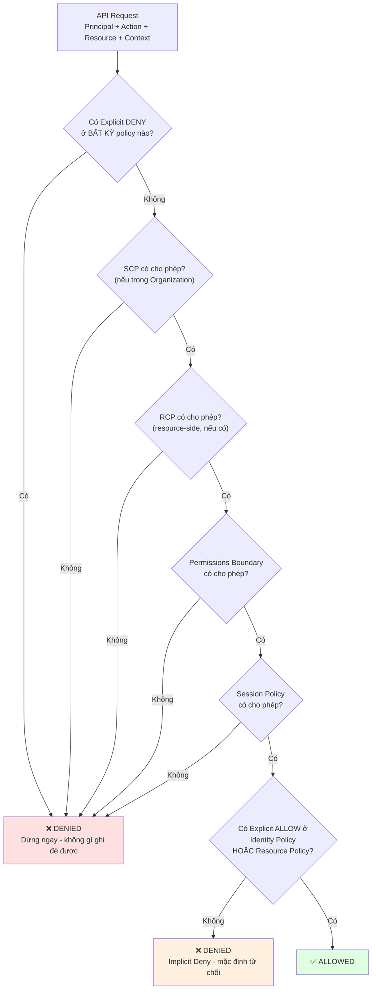
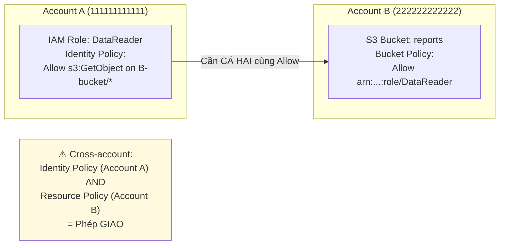
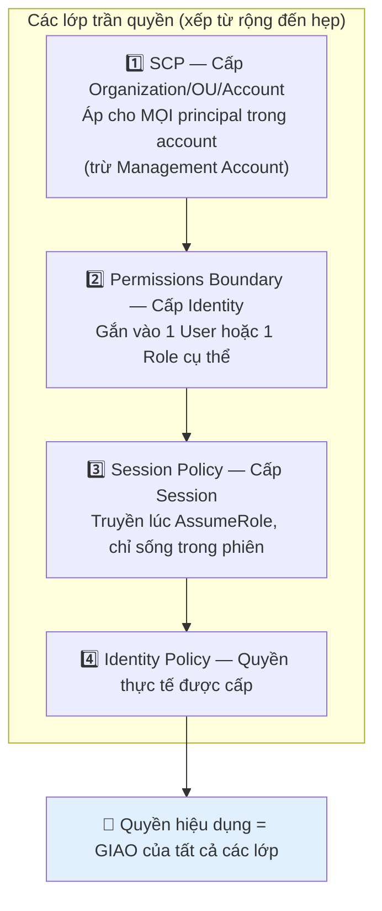
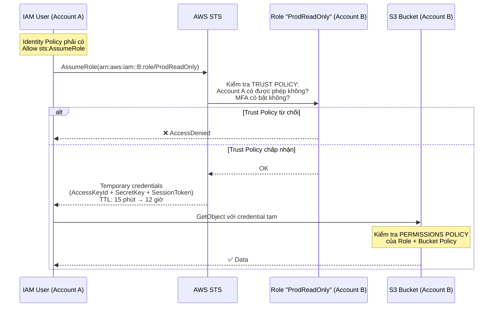
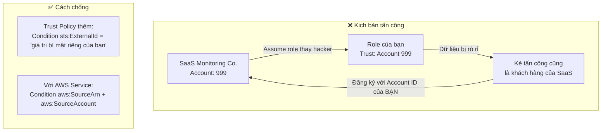
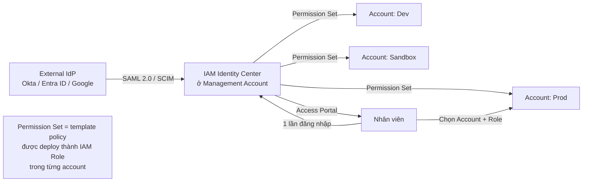
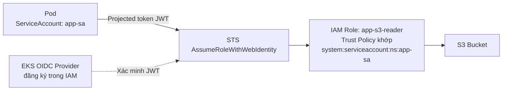

# AWS IAM Deep Dive v2: Policy Evaluation, Trust & Advanced Access Control

> Đây là bản mở rộng của **[IAM Deep Dive](./IAM_DeepDive.md)** — tài liệu gốc bao phủ các thực thể cơ bản (User, Group, Role, Policy). Bản v2 tập trung vào **cơ chế đánh giá quyền**, **các loại policy nâng cao**, và **IAM trong môi trường multi-account**.

---

## 1. Overview & The "Why"

IAM cơ bản trả lời "Ai được làm gì". Nhưng trong hệ thống thật, câu hỏi khó hơn nhiều:

- Tại sao user có policy `AdministratorAccess` mà vẫn bị **Access Denied**?
- Khi Lambda ở Account A đọc S3 bucket ở Account B, **bao nhiêu policy** phải cùng cho phép?
- Làm sao ngăn nhân viên tạo IAM user mới có quyền cao hơn chính họ (**privilege escalation**)?
- Làm sao cấp quyền cho 500 developer mà không phải viết 500 policy?

> **Analogy:** Nếu IAM cơ bản là "chìa khóa và ổ khóa", thì IAM nâng cao là **hệ thống an ninh của một tòa nhà chính phủ**. Bạn cần thẻ nhân viên (Identity Policy), phòng đó phải cho phép loại thẻ của bạn (Resource Policy), tòa nhà có giờ giới nghiêm áp cho tất cả (SCP), và trong một số phòng bạn phải tự nguyện bỏ bớt quyền ở cửa (Permissions Boundary / Session Policy). Chỉ cần **một** lớp nói "không" là bạn không vào được.

---

## 2. Key Concepts & Keywords

| Thuật ngữ                    | Ý nghĩa                                                                              |
| ---------------------------- | ------------------------------------------------------------------------------------ |
| **Principal**                | Thực thể thực hiện request: IAM User, Role session, AWS service, hoặc anonymous       |
| **Trust Policy**             | Resource-based policy gắn vào Role — quy định **AI được phép assume** role đó         |
| **Permissions Policy**       | Policy quy định role được **làm gì** sau khi assume thành công                        |
| **Permissions Boundary**     | Trần quyền tối đa cho một Identity — **không cấp quyền**, chỉ giới hạn                |
| **Session Policy**           | Policy truyền vào lúc `AssumeRole`/`GetFederationToken` — giới hạn phiên hiện tại      |
| **SCP**                      | Service Control Policy — trần quyền cấp Organization/OU/Account                       |
| **RCP**                      | Resource Control Policy — trần quyền phía tài nguyên, cấp Organization                |
| **ABAC**                     | Attribute-Based Access Control — cấp quyền dựa trên tag thay vì liệt kê ARN           |
| **Condition Key**            | Điều kiện áp lên statement: `aws:SourceIp`, `aws:PrincipalOrgID`, `aws:MultiFactorAuthPresent` |
| **Confused Deputy**          | Lỗ hổng khi service bị lừa dùng quyền của nó để hành động thay cho kẻ tấn công        |
| **IAM Identity Center**      | (Trước là AWS SSO) — quản lý danh tính tập trung cho multi-account                    |
| **IAM Access Analyzer**      | Phát hiện tài nguyên chia sẻ ra ngoài + sinh policy least-privilege từ CloudTrail     |
| **STS**                      | Security Token Service — cấp credential tạm thời                                      |

---

## 3. Visual Theory & Architecture

### 3.1 Policy Evaluation Logic — Trái tim của IAM

Đây là sơ đồ quan trọng nhất của toàn bộ IAM. Mỗi API request đều đi qua chuỗi này:



**Ba quy tắc bất biến:**

1. **Mặc định là Deny (Implicit Deny).** Không có Allow nào = từ chối.
2. **Explicit Deny thắng tất cả.** Không có ngoại lệ, không thể ghi đè bằng bất kỳ Allow nào.
3. **Mọi lớp "trần quyền" (SCP, RCP, Boundary, Session) phải CÙNG cho phép.** Chúng là phép **giao (AND)**, không phải phép hợp.

> **Đây là lý do phổ biến nhất của Access Denied:** User có `AdministratorAccess` nhưng SCP ở OU cha chặn action đó → vẫn Denied. Hoặc Permissions Boundary chỉ cho phép `s3:*` nhưng user cần `ec2:*` → Denied dù identity policy cho phép.

---

### 3.2 Ngoại lệ quan trọng: Cross-Account



**Quy tắc phân biệt:**

| Trường hợp                      | Yêu cầu                                                                                   |
| ------------------------------- | ----------------------------------------------------------------------------------------- |
| **Same-account**                | Identity Policy **HOẶC** Resource Policy cho phép là đủ (phép **HỢP**)                     |
| **Cross-account**               | Identity Policy **VÀ** Resource Policy đều phải cho phép (phép **GIAO**)                   |
| **Ngoại lệ: KMS, S3 Access Point, Lambda** | Resource policy (Key Policy) luôn bắt buộc, kể cả same-account                  |

> **Bẫy KMS kinh điển:** Bạn có `AdministratorAccess` nhưng vẫn không giải mã được dữ liệu, vì **KMS Key Policy** không liệt kê bạn. Key Policy là "hiến pháp" của key — IAM policy chỉ có hiệu lực nếu Key Policy ủy quyền lại cho IAM (`"Principal": {"AWS": "arn:aws:iam::111111111111:root"}`).

---

### 3.3 Bốn cơ chế giới hạn quyền — So sánh trực quan



| Cơ chế                   | Cấp áp dụng           | Cấp quyền? | Áp cho Management Account? | Use case điển hình                              |
| ------------------------ | --------------------- | ---------- | -------------------------- | ------------------------------------------------ |
| **SCP**                  | Org / OU / Account    | ❌ Không    | ❌ Không                    | Chặn region, chặn service, bảo vệ CloudTrail     |
| **RCP**                  | Org / OU / Account    | ❌ Không    | ✅ Có                       | Chặn truy cập tài nguyên từ ngoài Organization   |
| **Permissions Boundary** | 1 User / 1 Role       | ❌ Không    | N/A                        | Cho phép dev tự tạo role nhưng không leo thang quyền |
| **Session Policy**       | 1 phiên STS           | ❌ Không    | N/A                        | Ứng dụng multi-tenant, giới hạn theo tenant      |

---

### 3.4 Assume Role Flow — Cơ chế hai policy



**Điểm mấu chốt — Role có HAI policy hoàn toàn khác nhau:**

- **Trust Policy** (`AssumeRolePolicyDocument`): "AI được vào?" — đây là resource-based policy.
- **Permissions Policy**: "Vào rồi thì làm được gì?" — đây là identity-based policy.

Cả hai bên đều phải đồng ý: **Account A phải cho phép user gọi `sts:AssumeRole`**, và **Trust Policy của Role ở Account B phải tin tưởng Account A**. Đây là mô hình "bắt tay hai chiều".

**Ví dụ Trust Policy chặt chẽ:**

```json
{
  "Version": "2012-10-17",
  "Statement": [{
    "Effect": "Allow",
    "Principal": { "AWS": "arn:aws:iam::111111111111:root" },
    "Action": "sts:AssumeRole",
    "Condition": {
      "Bool":        { "aws:MultiFactorAuthPresent": "true" },
      "StringEquals":{ "sts:ExternalId": "unique-secret-string-2026" },
      "NumericLessThan": { "aws:MultiFactorAuthAge": "3600" }
    }
  }]
}
```

- `MultiFactorAuthPresent` — bắt buộc MFA khi vào production.
- `sts:ExternalId` — chống **Confused Deputy** khi cấp quyền cho bên thứ ba (SaaS monitoring, MSP).
- `MultiFactorAuthAge` — MFA phải được xác thực trong vòng 1 giờ, không dùng lại phiên cũ.

---

### 3.5 Confused Deputy — Lỗ hổng và cách chống



**Với AWS Service (ví dụ: S3 gọi Lambda, CloudWatch gọi SNS):**

```json
"Condition": {
  "StringEquals": { "aws:SourceAccount": "111111111111" },
  "ArnLike":      { "aws:SourceArn": "arn:aws:s3:::my-specific-bucket" }
}
```

Không có điều kiện này, một bucket ở account khác cũng có thể trigger Lambda của bạn.

---

## 4. Detailed Deep Dive

### 4.1 Cấu trúc Policy đầy đủ

```json
{
  "Version": "2012-10-17",
  "Statement": [{
    "Sid": "AllowS3ReadDuringOfficeHours",
    "Effect": "Allow",
    "Principal": { "AWS": "arn:aws:iam::111111111111:role/DataReader" },
    "Action": ["s3:GetObject", "s3:ListBucket"],
    "NotAction": [],
    "Resource": ["arn:aws:s3:::reports/*"],
    "Condition": {
      "IpAddress":   { "aws:SourceIp": ["203.0.113.0/24"] },
      "DateGreaterThan": { "aws:CurrentTime": "2026-01-01T00:00:00Z" },
      "StringEquals":{ "aws:PrincipalTag/Department": "Finance" }
    }
  }]
}
```

| Phần tử       | Ghi chú                                                                          |
| ------------- | -------------------------------------------------------------------------------- |
| `Version`     | **Luôn là `2012-10-17`** — không phải ngày tạo policy. Bỏ đi = mất tính năng variable |
| `Sid`         | Nhãn tùy chọn, hữu ích khi debug                                                 |
| `Principal`   | **Chỉ có trong resource-based policy.** Identity policy không có trường này      |
| `NotAction`   | "Tất cả trừ..." — dùng cẩn thận, rất dễ cấp quyền quá rộng ngoài ý muốn          |
| `Condition`   | Nơi đặt phần lớn sức mạnh bảo mật thực sự                                        |

---

### 4.2 Condition Keys quan trọng nhất

| Condition Key                     | Mục đích                                                         |
| --------------------------------- | ----------------------------------------------------------------- |
| `aws:PrincipalOrgID`              | **Chỉ cho phép principal trong Organization của tôi** — cực mạnh   |
| `aws:PrincipalOrgPaths`           | Giới hạn tới một OU cụ thể trong cây Organization                 |
| `aws:SourceIp`                    | Giới hạn theo IP nguồn (⚠️ không hoạt động qua VPC Endpoint)      |
| `aws:SourceVpce`                  | Chỉ cho phép truy cập qua một VPC Endpoint cụ thể                 |
| `aws:MultiFactorAuthPresent`      | Yêu cầu MFA                                                       |
| `aws:RequestedRegion`             | Giới hạn region — nền tảng của SCP chặn region                    |
| `aws:PrincipalTag/<key>`          | Tag của principal → nền tảng của **ABAC**                         |
| `aws:ResourceTag/<key>`           | Tag của tài nguyên → nền tảng của **ABAC**                        |
| `aws:RequestTag/<key>`            | Tag đang được gán trong request — bắt buộc tag khi tạo tài nguyên |
| `aws:SecureTransport`             | Bắt buộc HTTPS                                                    |
| `aws:PrincipalIsAWSService`       | Phân biệt request từ AWS service với request từ người dùng        |

> **`aws:PrincipalOrgID` là condition key đáng giá nhất cho enterprise.** Một dòng duy nhất trong bucket policy chặn mọi truy cập từ ngoài tổ chức — không cần liệt kê từng account ID và không cần cập nhật khi có account mới.

---

### 4.3 ABAC — Attribute-Based Access Control

**Vấn đề với RBAC (Role-Based):** 50 team × 3 môi trường = 150 policy phải viết và bảo trì. Mỗi project mới lại phải sửa policy.

**Giải pháp ABAC:** Một policy duy nhất, quyền được suy ra từ tag.

```json
{
  "Version": "2012-10-17",
  "Statement": [{
    "Effect": "Allow",
    "Action": ["ec2:StartInstances", "ec2:StopInstances", "ec2:RebootInstances"],
    "Resource": "arn:aws:ec2:*:*:instance/*",
    "Condition": {
      "StringEquals": {
        "aws:ResourceTag/Team": "${aws:PrincipalTag/Team}",
        "aws:ResourceTag/Environment": "${aws:PrincipalTag/Environment}"
      }
    }
  }]
}
```

**Ý nghĩa:** "Bạn được start/stop EC2 **chỉ khi** tag `Team` của instance khớp tag `Team` của bạn." Thêm team mới chỉ cần gán tag cho user — **không sửa policy**.

**Kết hợp bắt buộc:**

- **Tag Policy** trong Organizations để chuẩn hóa tag key (tránh `team` vs `Team`).
- SCP chặn `ec2:CreateTags`/`ec2:DeleteTags` cho tag nhạy cảm — nếu user tự sửa được tag `Team` của mình thì ABAC vô nghĩa.
- Với IAM Identity Center: map attribute từ IdP (Okta/Entra ID) → session tag tự động.

| | **RBAC** | **ABAC** |
|---|---|---|
| Số policy | Tăng theo số team × môi trường | Một policy dùng chung |
| Thêm team mới | Viết policy mới | Chỉ gán tag |
| Dễ audit | ✅ Nhìn policy biết ngay ai làm gì | ❌ Phải kiểm tra tag mới biết |
| Rủi ro | Policy sprawl | Tag sai = quyền sai |

---

### 4.4 Permissions Boundary — Chống Privilege Escalation

**Bài toán:** Team platform muốn cho developer tự tạo IAM Role cho Lambda của họ (giảm ticket). Nhưng nếu dev có `iam:CreateRole` + `iam:AttachRolePolicy`, họ có thể tạo role `AdministratorAccess` rồi assume nó → **leo thang lên admin**.

**Giải pháp:** Bắt buộc mọi role dev tạo phải có Permissions Boundary.

```json
{
  "Version": "2012-10-17",
  "Statement": [
    {
      "Sid": "AllowRoleCreationOnlyWithBoundary",
      "Effect": "Allow",
      "Action": ["iam:CreateRole", "iam:AttachRolePolicy", "iam:PutRolePolicy"],
      "Resource": "arn:aws:iam::*:role/dev-*",
      "Condition": {
        "StringEquals": {
          "iam:PermissionsBoundary": "arn:aws:iam::111111111111:policy/DevBoundary"
        }
      }
    },
    {
      "Sid": "ProtectTheBoundaryItself",
      "Effect": "Deny",
      "Action": ["iam:DeleteRolePermissionsBoundary", "iam:DeletePolicy", "iam:CreatePolicyVersion"],
      "Resource": "arn:aws:iam::111111111111:policy/DevBoundary"
    }
  ]
}
```

**Cơ chế:** Dev tạo được role, thậm chí gắn `AdministratorAccess` vào role đó — nhưng quyền hiệu dụng vẫn bị chặn bởi `DevBoundary`. **Statement thứ hai cực kỳ quan trọng:** nếu không chặn, dev sẽ sửa hoặc xóa chính boundary đó.

---

### 4.5 IAM Identity Center — Danh tính tập trung cho Multi-Account



**Tại sao quan trọng:**

- **Không còn IAM User dài hạn.** Không còn access key vĩnh viễn nằm trong laptop dev.
- **Nghỉ việc = tắt tài khoản ở IdP** → mất quyền trên toàn bộ 50 account ngay lập tức. Với IAM User, bạn phải xóa thủ công ở từng account.
- **Permission Set** được deploy tự động thành IAM Role trong mọi account được gán.
- Hỗ trợ **ABAC qua session tag** — attribute từ IdP (department, cost center) trở thành principal tag.

> **Best practice hiện đại:** IAM User chỉ nên tồn tại cho các trường hợp không thể dùng federation (một số legacy tool, service account cực đặc thù). Mọi thứ khác → Identity Center + Role.

---

### 4.6 IAM Access Analyzer — Ba năng lực

| Năng lực                      | Giải quyết vấn đề gì                                                           |
| ----------------------------- | -------------------------------------------------------------------------------- |
| **External Access Findings**  | Phát hiện S3 bucket/Role/KMS key đang chia sẻ ra ngoài Organization (thường vô ý) |
| **Unused Access Findings**    | Tìm role/permission không dùng trong 90 ngày → cắt bỏ để đạt least privilege     |
| **Policy Generation**         | Đọc CloudTrail 90 ngày → **tự sinh policy least-privilege** dựa trên hành vi thật |
| **Policy Validation**         | Kiểm tra policy trước khi deploy (tích hợp CI/CD) — cảnh báo cú pháp và bảo mật  |
| **Custom Policy Checks**      | "Policy mới này có cấp thêm quyền so với policy cũ không?" — dùng trong PR check |

> **Quy trình least-privilege thực dụng:** Cấp quyền rộng trong dev → chạy 30 ngày → dùng Policy Generation sinh policy chính xác → áp policy đó cho production. Đây là cách duy nhất thực tế để đạt least privilege mà không đoán mò.

---

### 4.7 STS — Các API và thời hạn credential

| API                            | Dùng khi                                       | Thời hạn tối đa                   |
| ------------------------------ | ---------------------------------------------- | --------------------------------- |
| `AssumeRole`                   | Cross-account, EC2/Lambda role                 | 1h mặc định, tối đa 12h           |
| `AssumeRoleWithSAML`           | Federation qua Active Directory / SAML IdP     | 12h                               |
| `AssumeRoleWithWebIdentity`    | Cognito, Google, hoặc **EKS IRSA**             | 12h                               |
| `GetSessionToken`              | Thêm MFA cho IAM User                          | 12h (36h cho non-root)            |
| `GetFederationToken`           | Federation tùy chỉnh                           | 36h                               |

> **Role Chaining** (role A → assume role B → assume role C) bị **giới hạn cứng 1 giờ**, không thể mở rộng lên 12h. Đây là bẫy hay gặp trong pipeline CI/CD dài.

---

## 5. Practical Scenarios

### Kịch bản 1: Debug "Access Denied" một cách có hệ thống

**Thứ tự kiểm tra (từ ngoài vào trong):**

1. **SCP** — `aws organizations describe-effective-policy --policy-type SERVICE_CONTROL_POLICY`. Có chặn action/region này không?
2. **Explicit Deny** ở bất kỳ đâu — grep toàn bộ policy tìm `"Effect": "Deny"`.
3. **Permissions Boundary** — role/user này có boundary không? Boundary có cho phép action không?
4. **Resource Policy** — với cross-account, S3/KMS/Lambda, resource policy có liệt kê principal không?
5. **Condition không khớp** — MFA chưa bật? IP ngoài dải cho phép? Tag không khớp?
6. **Identity Policy** — cuối cùng mới đến đây.

**Công cụ:**

- **IAM Policy Simulator** — mô phỏng request mà không thực thi thật.
- **`aws sts decode-authorization-message`** — giải mã message lỗi encoded, cho biết chính xác policy nào chặn.
- **CloudTrail** — event `errorCode: AccessDenied` chứa đầy đủ context của request.

---

### Kịch bản 2: Cấp quyền cho ứng dụng chạy trên EKS (IRSA)

**Sai lầm phổ biến:** Gắn quyền S3 vào **Node IAM Role** → **mọi pod trên node đó** đều có quyền, kể cả pod của team khác.

**Đúng: IRSA (IAM Roles for Service Accounts)**



Trust policy khóa chặt tới đúng namespace và service account:

```json
"Condition": {
  "StringEquals": {
    "oidc.eks.ap-southeast-1.amazonaws.com/id/EXAMPLE:sub": "system:serviceaccount:production:app-sa",
    "oidc.eks.ap-southeast-1.amazonaws.com/id/EXAMPLE:aud": "sts.amazonaws.com"
  }
}
```

> Với EC2, tương tự: **luôn bật IMDSv2** (`HttpTokens: required`) để chống SSRF đánh cắp credential từ metadata endpoint.

---

### Kịch bản 3: Bảo vệ S3 bucket dữ liệu nhạy cảm

```json
{
  "Version": "2012-10-17",
  "Statement": [
    {
      "Sid": "DenyOutsideOrganization",
      "Effect": "Deny",
      "Principal": "*",
      "Action": "s3:*",
      "Resource": ["arn:aws:s3:::sensitive-data", "arn:aws:s3:::sensitive-data/*"],
      "Condition": {
        "StringNotEquals": { "aws:PrincipalOrgID": "o-abc123xyz" }
      }
    },
    {
      "Sid": "DenyUnencryptedTransport",
      "Effect": "Deny",
      "Principal": "*",
      "Action": "s3:*",
      "Resource": ["arn:aws:s3:::sensitive-data", "arn:aws:s3:::sensitive-data/*"],
      "Condition": { "Bool": { "aws:SecureTransport": "false" } }
    },
    {
      "Sid": "RequireKMSEncryption",
      "Effect": "Deny",
      "Principal": "*",
      "Action": "s3:PutObject",
      "Resource": "arn:aws:s3:::sensitive-data/*",
      "Condition": {
        "StringNotEquals": { "s3:x-amz-server-side-encryption": "aws:kms" }
      }
    }
  ]
}
```

Ba lớp Deny này là **template chuẩn** cho mọi bucket chứa dữ liệu nhạy cảm. Kết hợp với **Amazon Macie** để phát hiện dữ liệu nhạy cảm lọt vào bucket không được bảo vệ.

---

## 6. Exam Essentials & Pro Tips

### 🔑 Điểm mấu chốt

- **Explicit Deny > mọi thứ.** Không có ngoại lệ.
- **Implicit Deny là mặc định.** Không Allow = Deny.
- **SCP, Permissions Boundary, Session Policy KHÔNG cấp quyền** — chỉ giới hạn.
- **Cross-account cần CẢ identity policy VÀ resource policy.**
- **KMS Key Policy luôn bắt buộc**, kể cả same-account.
- **Role = Trust Policy (ai vào) + Permissions Policy (làm gì).**
- **SCP không áp lên Management Account.** RCP thì có.
- **Role chaining giới hạn 1 giờ.**
- **IAM là dịch vụ global** — không có region, endpoint luôn ở `us-east-1`.

### ⚠️ Bẫy thường gặp

| Bẫy                                                        | Hậu quả                                                          |
| ---------------------------------------------------------- | ---------------------------------------------------------------- |
| Dùng `"Version": "2024-01-01"`                             | Policy variable (`${aws:username}`) không hoạt động              |
| `NotAction` với `Effect: Allow`                            | Cấp quyền rộng khủng khiếp ngoài ý muốn                          |
| Quên `s3:ListBucket` khi cấp `s3:GetObject`                | `aws s3 ls` báo lỗi dù đọc được file (2 action khác resource ARN) |
| Access key nằm trong source code / biến môi trường         | Rò rỉ credential — dùng Role thay thế                            |
| `aws:SourceIp` với request qua VPC Endpoint                | Không match — phải dùng `aws:SourceVpce`                         |
| Cấp `iam:PassRole` với `Resource: "*"`                     | Cho phép leo thang quyền qua service                             |
| Cho phép `iam:CreateRole` mà không bắt Permissions Boundary| Dev tự tạo role admin                                            |
| Không đặt `ExternalId` khi cấp quyền cho SaaS bên thứ ba   | Confused Deputy — account khác đọc được dữ liệu của bạn          |
| Gắn quyền vào EKS Node Role thay vì IRSA                   | Mọi pod trên node đều có quyền đó                                |

### 🎯 Checklist Best Practice (thứ tự ưu tiên)

1. **Bật MFA cho root, khóa root credential** — không dùng root cho việc hàng ngày.
2. **Chuyển sang IAM Identity Center** — loại bỏ IAM User dài hạn.
3. **Dùng Role cho mọi workload** — EC2 Instance Profile, Lambda Execution Role, IRSA cho EKS.
4. **Bật IAM Access Analyzer** ở cấp Organization, review findings hàng tuần.
5. **Áp Permissions Boundary** cho mọi role do dev tự tạo.
6. **Thêm `aws:PrincipalOrgID`** vào mọi resource policy nhạy cảm.
7. **Bật IMDSv2 bắt buộc** trên tất cả EC2.
8. **Dùng Access Analyzer Policy Generation** thay vì đoán quyền cần thiết.
9. **Quản lý policy bằng IaC** (Terraform/CDK) — mọi thay đổi quyền đi qua Pull Request.
10. **Bật CloudTrail organization-wide** và bảo vệ nó bằng SCP.

---

## 7. Liên kết kiến thức

- **[IAM Deep Dive (cơ bản)](./IAM_DeepDive.md)** — User, Group, Role, Policy nền tảng
- **[AWS Organizations Deep Dive](../12_Cloud_Governance/AWS_Organizations_DeepDive.md)** — SCP, RCP và IAM trong multi-account
- **[Cloud Governance](../12_Cloud_Governance/Cloud_Governance.md)** — Tag Policy, Config, Security Hub
- **[Amazon Macie](./Amazon_Macie_Sensitive_Data.md)** — Phát hiện dữ liệu nhạy cảm bị lộ
- **[Network Security SG/NACL](./Network_Security_SG_NACL.md)** — Bảo mật tầng mạng bổ sung cho IAM
