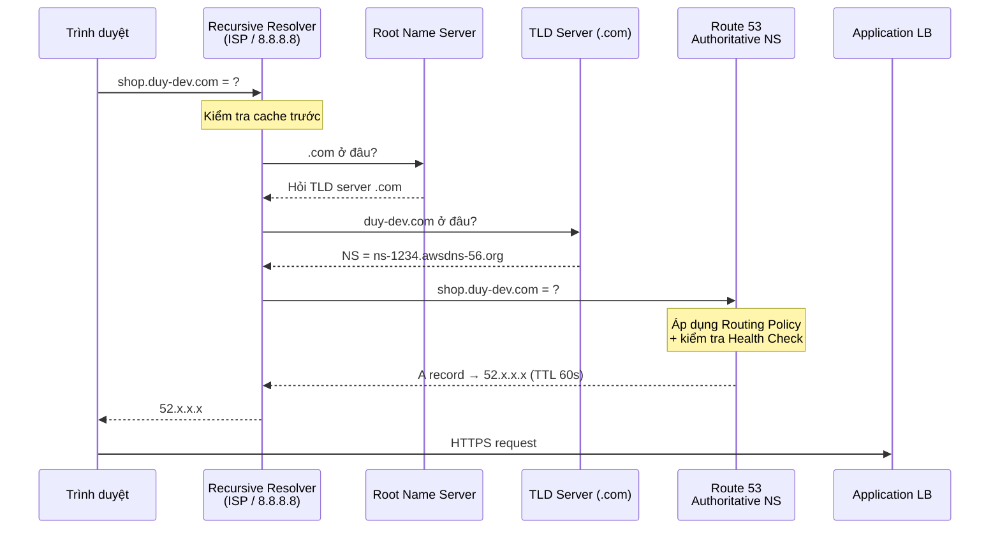
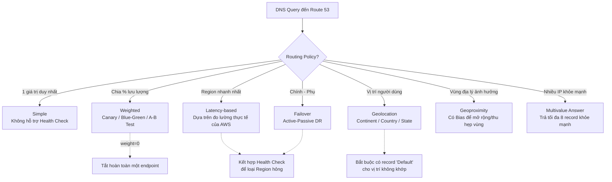
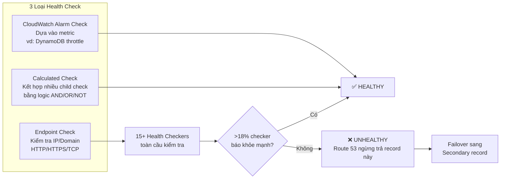
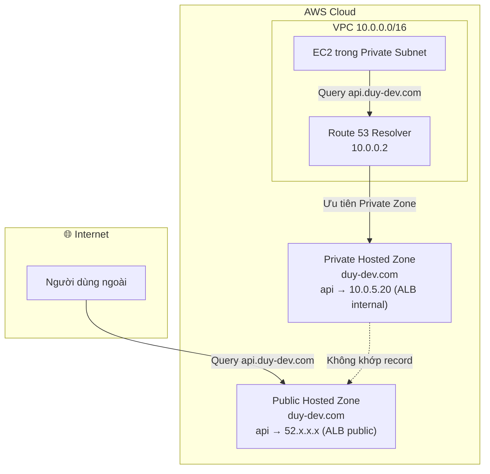
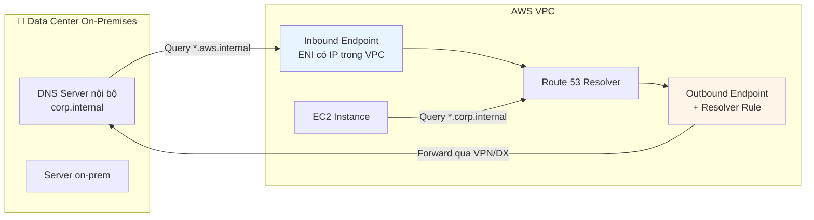

# Amazon Route 53: DNS, Routing Policies & Global Traffic Management

## 1. Overview & The "Why"

**Amazon Route 53** là dịch vụ **DNS (Domain Name System) có tính khả dụng cao và khả năng mở rộng toàn cầu**, đồng thời là **domain registrar** và **health-check engine**. Tên "53" xuất phát từ **port 53** — cổng chuẩn của giao thức DNS.

**Vấn đề thực tế:** Người dùng không nhớ địa chỉ IP. Nhưng sâu hơn thế: khi hệ thống của bạn chạy ở nhiều Region, có nhiều phiên bản (blue/green), và có server đôi lúc sập — thì việc "trỏ tên miền về IP" là chưa đủ. Bạn cần một lớp **điều phối lưu lượng thông minh ở tầng DNS**, quyết định *người dùng nào* đi về *endpoint nào* dựa trên độ trễ, vị trí, sức khỏe hệ thống và tỷ lệ phân bổ.

> **Analogy:** Route 53 giống như **tổng đài điều phối taxi của một thành phố lớn**. Khách gọi tổng đài (query DNS) và nói "tôi cần đi tới nhà hàng ABC". Tổng đài không chỉ tra địa chỉ — nó còn biết xe nào đang gần khách nhất (Latency), xe nào đang hỏng (Health Check), xe nào cần được ưu tiên để thử nghiệm (Weighted), và khách đang ở quận nào để gửi xe phù hợp (Geolocation).

**Điểm đặc biệt về SLA:** Route 53 là dịch vụ AWS duy nhất có **SLA 100% availability**. Đây là hệ quả của kiến trúc Anycast — cùng một IP của name server được quảng bá từ hàng trăm edge locations.

---

## 2. Key Concepts & Keywords

| Thuật ngữ                       | Ý nghĩa                                                                                     |
| ------------------------------- | ------------------------------------------------------------------------------------------- |
| **Hosted Zone**                 | "Container" chứa các bản ghi DNS của một domain. Có 2 loại: Public và Private                |
| **Record (Resource Record)**    | Một bản ghi DNS: `name` + `type` + `value` + `TTL`                                          |
| **TTL (Time To Live)**          | Thời gian (giây) resolver được phép cache kết quả — ảnh hưởng trực tiếp tới tốc độ failover |
| **Alias Record**                | Bản ghi đặc thù AWS, trỏ tới tài nguyên AWS (ALB, CloudFront, S3) — **miễn phí query**      |
| **Routing Policy**              | Thuật toán quyết định trả về giá trị nào khi có nhiều bản ghi cùng tên                      |
| **Health Check**                | Cơ chế giám sát endpoint từ nhiều vị trí toàn cầu, đầu vào cho failover                      |
| **NS Record**                   | Chỉ ra name servers có thẩm quyền cho zone — dùng để delegation                             |
| **SOA Record**                  | Start of Authority — metadata của zone (primary NS, email admin, TTL mặc định)               |
| **Route 53 Resolver**           | DNS resolver trong VPC (địa chỉ `VPC_CIDR_base + 2`), xử lý query nội bộ và ra ngoài        |
| **Resolver Endpoint**           | Inbound/Outbound endpoint để chuyển tiếp DNS giữa VPC và mạng on-premises                    |
| **Traffic Flow**                | Trình soạn thảo trực quan để kết hợp nhiều routing policy thành cây quyết định              |
| **Route 53 ARC**                | Application Recovery Controller — kiểm soát failover cấp ứng dụng với routing control        |

---

## 3. Visual Theory & Architecture

### 3.1 Luồng phân giải DNS đầy đủ (End-to-End Resolution)



**Giải thích:**

- Route 53 chỉ tham gia ở bước cuối — với tư cách **authoritative name server**. Nó không phải resolver của người dùng.
- **Điểm mấu chốt:** Route 53 chỉ "thấy" IP của **recursive resolver**, không phải IP thật của người dùng cuối. Đây là lý do Geolocation routing đôi khi sai — nếu người dùng ở Việt Nam nhưng dùng DNS của Google đặt tại Singapore, Route 53 tưởng họ ở Singapore. (Cơ chế `EDNS Client Subnet` giúp giảm vấn đề này nhưng không phải resolver nào cũng hỗ trợ.)
- **TTL là con dao hai lưỡi:** TTL cao = ít query = rẻ hơn, nhưng failover chậm. TTL 60s là điểm cân bằng phổ biến cho production.

---

### 3.2 Bản đồ 7 Routing Policies



**Giải thích chi tiết từng policy:**

| Policy               | Khi nào dùng                                     | Bẫy cần tránh                                                                        |
| -------------------- | ------------------------------------------------ | ------------------------------------------------------------------------------------ |
| **Simple**           | 1 endpoint duy nhất, không cần DR                | **Không hỗ trợ Health Check.** Nếu server sập, DNS vẫn trả IP đó                     |
| **Weighted**         | Canary deploy, A/B test, dịch chuyển dần traffic | Tổng weight không cần bằng 100. Weight = 0 nghĩa là tắt. Tất cả = 0 → trả về tất cả |
| **Latency**          | Multi-region, tối ưu trải nghiệm                 | Latency đo giữa **resolver ↔ AWS Region**, không phải người dùng ↔ region            |
| **Failover**         | DR Active-Passive                                | Primary **bắt buộc** phải có Health Check, nếu không sẽ không bao giờ failover        |
| **Geolocation**      | Tuân thủ pháp lý, nội dung theo ngôn ngữ         | Phải có record `Default`, nếu không người dùng ngoài danh sách sẽ nhận `NODATA`      |
| **Geoproximity**     | Điều chỉnh linh hoạt vùng phục vụ                | Chỉ dùng được qua **Traffic Flow**. Bias từ -99 đến +99                              |
| **Multivalue**       | Load balancing "kiểu nghèo", có health check     | **Không thay thế được ELB** — không có sticky session, không cân bằng thực sự        |

---

### 3.3 Health Check — 3 loại và cơ chế Calculated



**Giải thích:**

- Health checker của Route 53 đặt ở **hơn 15 vị trí toàn cầu**. Endpoint chỉ bị đánh dấu unhealthy khi **dưới 18% checker** báo thành công — tránh false positive do sự cố mạng cục bộ.
- **Quan trọng cho private resource:** Health checker của Route 53 nằm **ngoài Internet công cộng**, nên **không kiểm tra được endpoint trong private subnet**. Giải pháp: dùng **CloudWatch Alarm-based Health Check** (metric từ CloudWatch nội bộ) hoặc đặt một custom metric.
- **Calculated Health Check** giải quyết bài toán: "Chỉ coi Region này khỏe khi cả web server VÀ database VÀ cache đều khỏe" — kết hợp tối đa 256 child health check.
- Nhớ **allow-list IP range của Route 53 Health Checkers** trong Security Group, nếu không mọi check đều fail.

---

### 3.4 Public vs Private Hosted Zone & Split-Horizon DNS



**Giải thích — Split-Horizon DNS:**

- Cùng một tên miền `api.duy-dev.com`, nhưng **bên trong VPC** trả về IP nội bộ, **bên ngoài** trả về IP public. Ứng dụng dùng chung một hostname trong config cho mọi môi trường.
- Điều kiện bắt buộc để Private Hosted Zone hoạt động: VPC phải bật **`enableDnsHostnames`** và **`enableDnsSupport`**.
- **Thứ tự ưu tiên:** Private Hosted Zone luôn được kiểm tra trước. Nếu record tồn tại trong Private Zone, Public Zone bị bỏ qua hoàn toàn cho tên đó.
- Một Private Hosted Zone có thể được **associate với nhiều VPC**, kể cả VPC ở account khác (cross-account association).

---

### 3.5 Route 53 Resolver — Hybrid DNS với On-Premises



**Giải thích:**

- **Inbound Endpoint:** cho phép **on-premises → AWS**. Server on-prem có thể phân giải tên trong Private Hosted Zone.
- **Outbound Endpoint + Resolver Rule:** cho phép **AWS → on-premises**. Rule kiểu `FORWARD` nói: "domain `corp.internal` thì chuyển tiếp tới DNS server `192.168.1.10`".
- Cả hai đều cần kết nối mạng sẵn có (**Site-to-Site VPN** hoặc **Direct Connect**) — Resolver Endpoint không tự tạo kết nối.
- **Resolver Rules có thể share qua AWS RAM** cho toàn Organization — mô hình tập trung: một Networking Account sở hữu rule, share cho tất cả account con.

---

## 4. Detailed Deep Dive

### 4.1 Alias Record vs CNAME — Sự khác biệt quyết định

| Tiêu chí                    | Alias Record                                | CNAME Record                              |
| --------------------------- | ------------------------------------------- | ----------------------------------------- |
| **Dùng ở Zone Apex**        | ✅ Có (`duy-dev.com`)                        | ❌ Không (vi phạm RFC 1034)                |
| **Chi phí query**           | **Miễn phí** khi trỏ tới tài nguyên AWS     | Tính phí theo triệu query                 |
| **Trỏ tới đâu**             | ALB, NLB, CloudFront, S3 website, API GW, Global Accelerator, record khác cùng zone | Bất kỳ domain nào |
| **TTL**                     | Không tự đặt — kế thừa từ tài nguyên đích   | Tự cấu hình                               |
| **Health check tự động**    | ✅ Với ELB (Evaluate Target Health)          | ❌ Phải tạo health check riêng             |
| **Loại record trả về**      | A hoặc AAAA (Route 53 tự phân giải)         | Thêm 1 vòng lookup nữa                    |

> **Quy tắc thực chiến:** Trỏ tới tài nguyên AWS → **luôn dùng Alias**. Không có lý do chính đáng nào để dùng CNAME trong trường hợp đó.

**Evaluate Target Health** là tính năng bị đánh giá thấp: khi Alias trỏ tới ALB và bật cờ này, Route 53 tự động biết ALB có target khỏe mạnh hay không mà **không cần tạo Health Check riêng (miễn phí)**.

---

### 4.2 Các loại Record thường gặp

| Type      | Mục đích                                  | Ví dụ                                              |
| --------- | ----------------------------------------- | -------------------------------------------------- |
| **A**     | Domain → IPv4                             | `duy-dev.com → 52.10.1.5`                          |
| **AAAA**  | Domain → IPv6                             | `duy-dev.com → 2001:db8::1`                        |
| **CNAME** | Domain → Domain khác                      | `www → duy-dev.com`                                |
| **MX**    | Mail exchange (có priority)               | `10 mail.duy-dev.com`                              |
| **TXT**   | Metadata — SPF, DKIM, xác minh sở hữu     | `v=spf1 include:amazonses.com ~all`                |
| **NS**    | Delegation sang name server khác          | Dùng để ủy quyền subdomain cho team khác           |
| **SRV**   | Chỉ định service + port                   | `_sip._tcp 10 60 5060 sipserver.duy-dev.com`       |
| **CAA**   | Kiểm soát CA nào được cấp cert cho domain | `0 issue "amazon.com"` — chỉ ACM được cấp cert     |
| **PTR**   | Reverse DNS (IP → domain)                 | Thường dùng cho email deliverability               |

---

### 4.3 DNSSEC — Chống DNS Spoofing

Route 53 hỗ trợ **DNSSEC signing** cho Public Hosted Zone:

- Ký cryptographic mỗi response DNS bằng **KSK (Key Signing Key)** lưu trong **AWS KMS** (bắt buộc là asymmetric key ở `us-east-1`).
- Resolver hỗ trợ DNSSEC sẽ xác minh chữ ký — ngăn kẻ tấn công giả mạo response (cache poisoning).
- **Cảnh báo vận hành:** DNSSEC là con dao hai lưỡi. Nếu key hết hạn hoặc cấu hình sai chuỗi tin cậy (DS record ở registrar), **toàn bộ domain biến mất khỏi Internet**. Bắt buộc phải có CloudWatch alarm `DNSSECInternalFailure` và `DNSSECKeySigningKeysNeedingAction`.

---

### 4.4 Route 53 Application Recovery Controller (ARC)

Vấn đề với Health Check truyền thống: **failover tự động đôi khi là điều bạn không muốn**. Một glitch mạng ngắn có thể kích hoạt failover không cần thiết, gây "flapping".

ARC cung cấp:

- **Routing Control:** một "công tắc" ON/OFF thủ công cho từng cell/region, độc lập với health check. Data plane của ARC được thiết kế cực kỳ đơn giản và chạy ở 5 Region riêng biệt — vẫn hoạt động ngay cả khi Region chính sập hoàn toàn.
- **Readiness Check:** liên tục so sánh capacity/quota/cấu hình giữa các Region — trả lời câu hỏi "Nếu tôi failover ngay bây giờ, Region dự phòng có đủ sức chịu tải không?"
- **Safety Rules:** ngăn thao tác nguy hiểm, ví dụ "không được tắt cả 2 Region cùng lúc".

> Dùng ARC khi RTO tính bằng phút và bạn cần **failover có kiểm soát của con người**, không phải phản ứng tự động của DNS.

---

### 4.5 Chi phí — Điều thường bị bỏ qua

| Hạng mục                      | Chi phí (tham khảo)                                      |
| ----------------------------- | -------------------------------------------------------- |
| Hosted Zone                   | $0.50/zone/tháng (25 zone đầu)                           |
| Standard Query                | $0.40 / triệu query (1 tỷ đầu)                           |
| Latency/Geo/Geoproximity      | $0.60 - $0.70 / triệu query (**đắt hơn**)                |
| **Alias tới tài nguyên AWS**  | **$0 — miễn phí hoàn toàn**                              |
| Health Check (AWS endpoint)   | $0.50/check/tháng                                        |
| Health Check (non-AWS)        | $0.75/check/tháng + phụ phí tính năng (HTTPS, String match)|
| Domain registration           | Tùy TLD, ~$12/năm cho `.com`                             |
| Route 53 Resolver Endpoint    | ~$0.125/ENI/giờ (~$90/tháng cho 2 ENI HA)                |

> **Tối ưu chi phí:** Alias record miễn phí là đòn bẩy lớn nhất. Với site có 500 triệu query/tháng, chuyển từ CNAME sang Alias tiết kiệm ~$200/tháng. TTL cao hơn cũng giảm query (đánh đổi với tốc độ failover).

---

## 5. Practical Scenarios

### Kịch bản 1: Blue-Green Deployment không downtime

**Yêu cầu:** Deploy phiên bản mới, chuyển traffic dần từ 0% → 100%, rollback tức thì nếu có lỗi.

```
api.duy-dev.com (Weighted)
├── Record A, Set ID "blue",  Weight 100 → ALB-v1  [Health Check HC-blue]
└── Record A, Set ID "green", Weight 0   → ALB-v2  [Health Check HC-green]
```

**Quy trình:**

1. Deploy v2, đặt `weight = 0` — chưa có traffic thật nào đi vào.
2. Smoke test qua hostname riêng `green.duy-dev.com`.
3. Tăng dần: `green = 5` → theo dõi CloudWatch error rate 15 phút → `green = 25` → `green = 50` → `green = 100`, `blue = 0`.
4. **Rollback:** đặt `green = 0`, `blue = 100`. Với **TTL = 60s**, traffic quay về trong dưới 1 phút.

> **Bẫy:** TTL cao (300s+) khiến rollback chậm. Trước khi deploy, hạ TTL xuống 60s **ít nhất 1 chu kỳ TTL cũ trước đó** để cache của resolver kịp hết hạn.

---

### Kịch bản 2: Multi-Region Active-Active kết hợp DR

**Yêu cầu:** Ứng dụng chạy ở `ap-southeast-1` (Singapore) và `us-east-1` (Virginia). Người dùng đi tới region gần nhất. Khi một region sập, toàn bộ traffic dồn về region còn lại.

```
app.duy-dev.com (Latency-based + Health Check)
├── Alias → ALB ap-southeast-1  [Region: ap-southeast-1]  [Evaluate Target Health: Yes]
└── Alias → ALB us-east-1       [Region: us-east-1]       [Evaluate Target Health: Yes]
```

**Cách hoạt động:**

- Người dùng ở Việt Nam → resolver ở VN → Route 53 đo latency thấp nhất tới Singapore → trả IP ALB Singapore.
- Nếu ALB Singapore không còn healthy target → `Evaluate Target Health` đánh dấu unhealthy → Route 53 **tự động loại record đó** → người dùng VN nhận IP của Virginia (chậm hơn nhưng vẫn chạy).
- **Lớp bảo vệ cuối:** Thêm một record Failover trỏ tới **S3 static website hiển thị trang bảo trì** khi cả 2 region đều sập.

**Kiến trúc hoàn chỉnh:** Kết hợp với **Aurora Global Database** (replicate < 1s) hoặc **DynamoDB Global Tables** để dữ liệu cũng có mặt ở cả hai Region — DNS failover vô nghĩa nếu database chỉ tồn tại ở một nơi.

---

### Kịch bản 3: Tuân thủ pháp lý bằng Geolocation

**Yêu cầu:** Dữ liệu công dân EU phải xử lý trong EU (GDPR). Người dùng Trung Quốc không được truy cập.

```
service.duy-dev.com (Geolocation)
├── Continent = EU        → ALB eu-west-1
├── Country   = VN        → ALB ap-southeast-1
├── Country   = CN        → IP của trang thông báo "Service unavailable"
└── Default              → ALB us-east-1   ⚠️ BẮT BUỘC PHẢI CÓ
```

> **Bẫy nghiêm trọng:** Thiếu record `Default` → mọi người dùng từ quốc gia không nằm trong danh sách nhận `NODATA` — website "chết" với họ mà log không báo lỗi gì.
>
> **Giới hạn cần biết:** Geolocation dựa trên IP của resolver và không phải cơ chế bảo mật. Người dùng dùng VPN hoặc DNS công cộng có thể vượt qua dễ dàng. **Muốn chặn thật sự phải dùng AWS WAF Geo Match Rule ở tầng ứng dụng** — DNS chỉ là gợi ý, WAF mới là hàng rào.

---

### Kịch bản 4: Zone Apex + www + Email + Xác minh SSL

Cấu hình đầy đủ cho một domain production:

```
duy-dev.com          A     Alias → CloudFront Distribution     (miễn phí query)
www.duy-dev.com      A     Alias → duy-dev.com                 (record cùng zone)
api.duy-dev.com      A     Alias → ALB                          [Evaluate Target Health]
duy-dev.com          MX    10 inbound-smtp.us-east-1.amazonaws.com
duy-dev.com          TXT   "v=spf1 include:amazonses.com ~all"
_dmarc.duy-dev.com   TXT   "v=DMARC1; p=quarantine; rua=mailto:dmarc@duy-dev.com"
_acme.duy-dev.com    CNAME <giá trị ACM cấp>                    (DNS validation cho SSL)
duy-dev.com          CAA   0 issue "amazon.com"                 (chỉ ACM được cấp cert)
```

**Điểm nhấn:** `CAA` record là lớp bảo vệ ít người dùng — nó ngăn bất kỳ Certificate Authority nào ngoài Amazon cấp certificate cho domain của bạn, chống lại tấn công mis-issuance.

---

## 6. Exam Essentials & Pro Tips

### 🔑 Điểm mấu chốt

- **Route 53 = Authoritative DNS + Registrar + Health Check + Traffic Management.** Nó KHÔNG phải load balancer — không có sticky session, không phân bổ theo tải thật.
- **SLA 100%** — dịch vụ AWS duy nhất có cam kết này.
- **Alias miễn phí, hỗ trợ zone apex, tự động health check với ELB.** CNAME thì không.
- **Simple Routing không hỗ trợ Health Check.** Cần health check → phải dùng policy khác.
- **Geolocation bắt buộc có record Default.**
- **Failover Routing bắt buộc Primary có Health Check.**
- **Multivalue trả tối đa 8 record khỏe mạnh** — client tự chọn.
- **Health checker của Route 53 không truy cập được private resource** → dùng CloudWatch Alarm health check.

### ⚠️ Bẫy thường gặp

| Bẫy                                                                        | Hậu quả                                                            |
| -------------------------------------------------------------------------- | ------------------------------------------------------------------ |
| Dùng CNAME ở zone apex                                                     | Không tạo được record, phải dùng Alias                             |
| TTL cao trong lúc migration                                                | Rollback chậm, người dùng vẫn vào server cũ hàng chục phút         |
| Quên `Default` record trong Geolocation                                    | Người dùng ngoài danh sách gặp NODATA — không có lỗi rõ ràng       |
| Không allow-list IP của Health Checker trong Security Group                | Health check luôn FAIL, failover sai                               |
| Đổi NS record ở registrar mà không đợi TTL của TLD                         | Downtime khi chuyển domain sang Route 53                           |
| Dùng Geolocation làm cơ chế bảo mật                                        | Bypass bằng VPN — phải dùng WAF Geo Match                          |
| DNSSEC key hết hạn / DS record sai                                         | Toàn bộ domain không phân giải được                                |
| Private Hosted Zone không hoạt động                                        | Quên bật `enableDnsHostnames` + `enableDnsSupport` trên VPC        |
| Failover DNS nhưng database chỉ ở 1 Region                                 | Region dự phòng không có dữ liệu — failover vô nghĩa               |

### 💡 So sánh nhanh: Khi nào dùng gì

| Nhu cầu                                        | Giải pháp                                     |
| ---------------------------------------------- | --------------------------------------------- |
| Cache nội dung tĩnh gần người dùng             | **CloudFront**                                |
| IP tĩnh + tối ưu đường truyền TCP/UDP          | **Global Accelerator**                        |
| Chọn Region theo độ trễ ở tầng DNS             | **Route 53 Latency Routing**                  |
| Failover cực nhanh (giây), không phụ thuộc TTL | **Global Accelerator** (không dùng DNS cache) |
| Failover có kiểm soát con người                | **Route 53 ARC Routing Control**              |
| Cân bằng tải trong 1 Region                    | **ELB** (không phải Route 53 Multivalue)      |

> **Điểm phân biệt quan trọng:** Route 53 failover phụ thuộc vào **TTL và cache của resolver** — thực tế có thể mất vài phút. Global Accelerator failover trong **~30 giây** vì IP không đổi, chỉ đường đi thay đổi trong mạng AWS. Ứng dụng cần RTO cực thấp nên cân nhắc Global Accelerator.

---

## 7. Liên kết kiến thức

- **[Edge Services](./Edge_services.md)** — CloudFront, Global Accelerator và so sánh với Route 53
- **[AWS Network Connectivity Options](./AWS_Network_Connectivity_Options.md)** — VPN/Direct Connect làm nền cho Resolver Endpoint
- **[Amazon VPC v2](./Amazon_VPC_v2.md)** — Private Hosted Zone và DNS trong VPC
- **[IAM Deep Dive v2](../02_Security_Identity/IAM_DeepDive_v2.md)** — Kiểm soát ai được sửa DNS record
- **[AWS Organizations Deep Dive](../12_Cloud_Governance/AWS_Organizations_DeepDive.md)** — Chia sẻ Resolver Rule qua RAM cho toàn Organization
