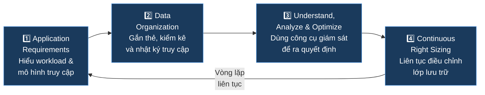
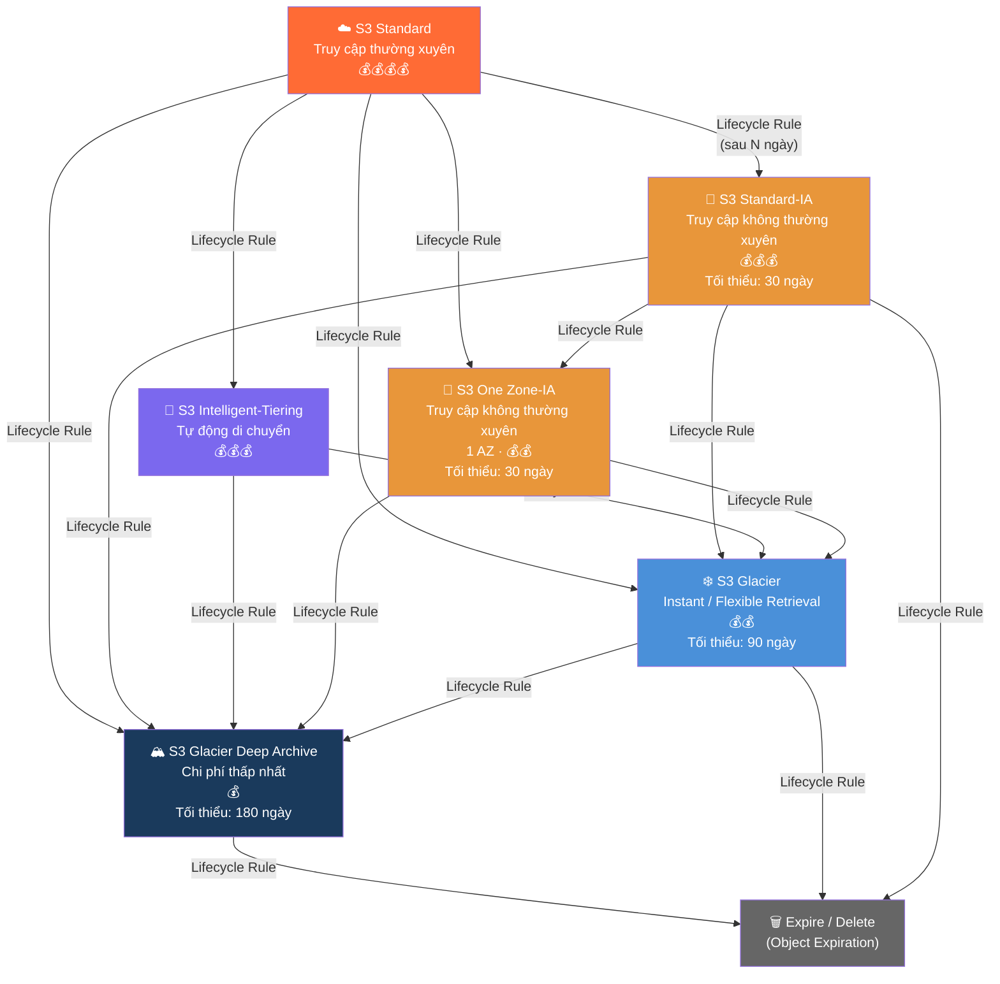
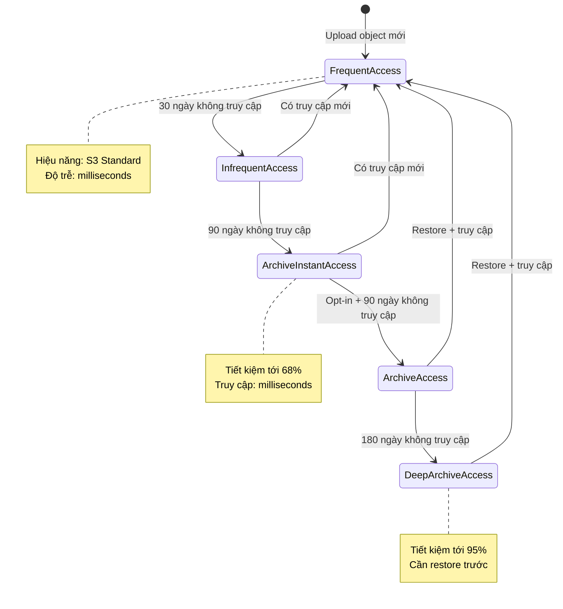
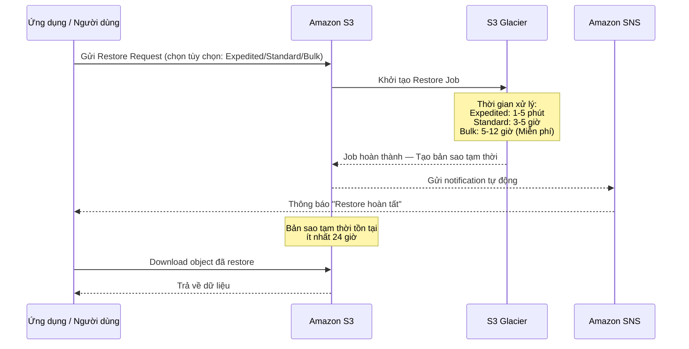

# Amazon S3 Cost Optimization: Tối Ưu Hóa Chi Phí Lưu Trữ

---

## 1. Overview & The "Why"

### Định nghĩa

**Amazon S3 Cost Optimization** là tập hợp các chiến lược, công cụ và thực tiễn tốt nhất giúp doanh nghiệp giảm thiểu chi phí lưu trữ trên Amazon S3 mà không hy sinh hiệu năng hay tính khả dụng của dữ liệu. Tối ưu hóa chi phí S3 không phải là một sự kiện đơn lẻ mà là một **quy trình liên tục** — từ việc phân tích mô hình truy cập, tổ chức dữ liệu, đến việc điều chỉnh lớp lưu trữ phù hợp theo thời gian.

### Vấn đề thực tế

Trong các tổ chức lớn, dữ liệu trên S3 tích lũy theo thời gian theo nhiều dạng: log ứng dụng, backup, media, dữ liệu phân tích... Phần lớn dữ liệu này **chỉ được truy cập dày đặc trong giai đoạn đầu**, sau đó trở nên nguội lạnh (cold) hoặc hiếm khi dùng tới. Nếu toàn bộ dữ liệu đều nằm ở lớp `S3 Standard` — lớp đắt nhất — chi phí lưu trữ sẽ tăng nhanh chóng mà không mang lại giá trị tương xứng.

> **Vấn đề cốt lõi:** Hầu hết các tổ chức trả tiền như thể **mọi dữ liệu đều quan trọng như nhau**, trong khi thực tế chỉ một phần nhỏ dữ liệu cần tốc độ truy cập cao và liên tục.

### Analogy

Hãy tưởng tượng văn phòng của bạn có 3 loại tủ lưu trữ:

- **Ngăn kéo trên bàn làm việc** (S3 Standard): Đắt nhất, truy cập tức thì — chỉ dành cho tài liệu đang dùng hằng ngày.
- **Tủ hồ sơ trong phòng** (S3 Infrequent Access): Rẻ hơn, cần vài giây để lấy — dùng cho tài liệu tháng trước.
- **Kho lưu trữ ở tầng hầm** (S3 Glacier): Rẻ nhất, cần vài giờ để lấy — dùng cho hồ sơ năm cũ theo yêu cầu pháp lý.

Tối ưu hóa chi phí S3 chính là việc **tự động hóa quá trình chuyển tài liệu** từ ngăn kéo xuống tủ hồ sơ rồi xuống kho tầng hầm, dựa trên tần suất sử dụng thực tế.

---

## 2. Core Components & Keywords

| Thuật ngữ                        | Bản chất                                                                                |
| -------------------------------- | --------------------------------------------------------------------------------------- |
| **Storage Class**                | Lớp lưu trữ S3 — xác định mức giá, độ trễ truy xuất và SLA độ bền.                      |
| **S3 Intelligent-Tiering**       | Lớp lưu trữ tự động di chuyển objects giữa các tầng dựa trên số ngày không truy cập.    |
| **Storage Class Analysis**       | Công cụ giám sát và phân tích mô hình truy cập dữ liệu để đề xuất chính sách vòng đời.  |
| **Lifecycle Policy**             | Bộ quy tắc tự động chuyển objects sang lớp lưu trữ rẻ hơn hoặc xóa chúng theo `age`.    |
| **S3 Glacier**                   | Dòng lớp lưu trữ lâu dài (Instant / Flexible / Deep Archive) với chi phí thấp nhất.     |
| **Multipart Upload**             | Cơ chế chia nhỏ và tải song song các object lớn (>100 MB) để tăng tốc và độ tin cậy.    |
| **Provisioned Capacity**         | Gói dung lượng trả trước cho phép đảm bảo throughput Expedited với S3 Glacier Flexible. |
| **Amazon S3 Inventory**          | Công cụ tạo báo cáo danh sách objects và metadata theo chu kỳ hàng ngày/tuần.           |
| **Amazon QuickSight**            | Dịch vụ BI cloud giúp trực quan hóa dữ liệu từ Storage Class Analysis.                  |
| **Amazon S3 Storage Lens**       | Bảng điều khiển quan sát toàn tổ chức (multi-account, multi-region) về việc sử dụng S3. |
| **Object Tags**                  | Nhãn metadata key-value gắn trên object, dùng cho phân loại và Cost Allocation Reports. |
| **Incomplete Multipart Uploads** | Các phần dữ liệu tải dở bị bỏ lại — gây tốn phí lưu trữ ẩn nếu không được dọn dẹp.      |

---

## 3. Visual Theory & Architecture

### 3.1 — Bốn trụ cột tối ưu hóa chi phí S3



**Giải thích:** Tối ưu hóa chi phí S3 là một vòng lặp khép kín. Bạn bắt đầu bằng cách hiểu workload (Trụ cột 1), tổ chức dữ liệu có cấu trúc (Trụ cột 2), phân tích bằng công cụ (Trụ cột 3), rồi thực hiện điều chỉnh thực tế (Trụ cột 4) — và lặp lại liên tục khi ứng dụng thay đổi theo thời gian.

---

### 3.2 — Mô hình dịch chuyển lớp lưu trữ (Waterfall Model)



**Giải thích từng bước:**

- **S3 Standard** là điểm bắt đầu mặc định khi upload object mới. Đây là lớp đắt nhất nhưng có độ trễ thấp nhất (milliseconds).
- Bằng **Lifecycle Rule**, bạn có thể chỉ định: sau `X` ngày kể từ ngày tạo, object sẽ tự động chuyển xuống lớp rẻ hơn.
- Quá trình dịch chuyển là **một chiều — hướng xuống (waterfall)**. Bạn **không thể** tạo lifecycle rule để chuyển ngược object từ Glacier lên Standard.
- Cuối vòng đời, object có thể bị **xóa hoàn toàn (Expire)** thông qua Object Expiration Rule — thao tác này không thể hoàn tác nếu không bật S3 Versioning.

---

### 3.3 — S3 Intelligent-Tiering: Cơ chế tự động phân tầng



**Giải thích:** S3 Intelligent-Tiering hoạt động như một bộ điều phối thông minh. Object được tự động **hạ tầng** khi không được truy cập trong một khoảng thời gian nhất định, và được **nâng tầng về Frequent Access ngay lập tức** khi có yêu cầu truy cập mới (đối với 3 tầng mặc định). Không tính phí chuyển đổi vòng đời và không tính phí truy xuất — chỉ tính phí monitoring nhỏ trên mỗi object.

---

### 3.4 — Quy trình Restore từ S3 Glacier



**Giải thích:** Không giống S3 Standard, các lớp Glacier yêu cầu một bước **Restore Job** trung gian trước khi bạn có thể đọc dữ liệu. Bạn chọn tùy chọn truy xuất phù hợp với SLA, chờ Job hoàn thành (qua SNS notification hoặc polling `describe job`), sau đó download trong cửa sổ 24 giờ. Dữ liệu gốc trong Glacier vẫn còn nguyên vẹn.

---

## 4. Detailed Deep Dive

### 4.1 Phân tích mô hình truy cập

#### S3 Storage Class Analysis

Là công cụ gốc của S3 để phân tích **Predictable Workloads** (khối lượng công việc có thể dự đoán).

- **Phạm vi cấu hình:** Toàn bộ bucket, hoặc lọc theo **Prefix** và **Object Tags** để phân tích hạt nhân (granular).
- **Xuất dữ liệu:** File CSV hàng ngày, lưu vào một S3 bucket đích khác.
- **Thời gian báo cáo đầu tiên:** Mất **24 giờ** sau khi cấu hình. Sau đó cập nhật hàng ngày.
- **Kết quả sử dụng:** Phát hiện các object có mô hình truy cập không thường xuyên → tinh chỉnh **Lifecycle Policies** chính xác hơn.

#### Trực quan hóa với Amazon QuickSight

- **QuickSight** là dịch vụ Business Intelligence (BI) cloud-native của AWS.
- Kết nối trực tiếp với dữ liệu Storage Class Analysis để hiển thị xu hướng sử dụng và tăng trưởng dữ liệu qua các biểu đồ tương tác.
- Dashboard có thể truy cập **trực tiếp từ S3 Console** — không cần xuất thủ công.

> **Yêu cầu:** Phải bật Storage Class Analysis trên bucket **và** cấp quyền cho QuickSight truy cập S3 bucket chứa file xuất.

#### Amazon S3 Storage Lens

Khác với Storage Class Analysis (phân tích một bucket), **S3 Storage Lens** cung cấp tầm nhìn **toàn tổ chức (multi-account, multi-region)**:

- Hơn **29 usage và activity metrics** được tổng hợp.
- Dashboard mặc định miễn phí; các advanced metrics nâng cao yêu cầu phí bổ sung.
- Tích hợp với **AWS Organizations** để xem chi phí và mô hình truy cập trên tất cả tài khoản thành viên.

---

### 4.2 So sánh các lớp lưu trữ S3

| Lớp lưu trữ                 | Độ trễ truy cập  | AZs | Kích thước tối thiểu | Thời gian tối thiểu | Phí truy xuất | Tiết kiệm so với Standard |
| --------------------------- | ---------------- | --- | -------------------- | ------------------- | ------------- | ------------------------- |
| **S3 Standard**             | Milliseconds     | ≥3  | —                    | —                   | Không         | —                         |
| **S3 Standard-IA**          | Milliseconds     | ≥3  | 128 KB               | 30 ngày             | Có (per GB)   | ~40%                      |
| **S3 One Zone-IA**          | Milliseconds     | 1   | 128 KB               | 30 ngày             | Có (per GB)   | ~55%                      |
| **S3 Intelligent-Tiering**  | Milliseconds–12h | ≥3  | —                    | —                   | Không         | Lên tới 95%               |
| **S3 Glacier Instant**      | Milliseconds     | ≥3  | 128 KB               | 90 ngày             | Có (per GB)   | ~68%                      |
| **S3 Glacier Flexible**     | 1 phút – 12 giờ  | ≥3  | —                    | 90 ngày             | Có (trừ Bulk) | ~80%                      |
| **S3 Glacier Deep Archive** | ≤12 giờ          | ≥3  | —                    | 180 ngày            | Có (per GB)   | ~95%                      |

---

### 4.3 S3 Intelligent-Tiering — Chi tiết các tầng

| Tầng                       | Điều kiện                 | Đặc điểm                              | Kích hoạt       |
| -------------------------- | ------------------------- | ------------------------------------- | --------------- |
| **Frequent Access**        | Upload mới                | Hiệu năng như S3 Standard             | Mặc định        |
| **Infrequent Access**      | 30 ngày không truy cập    | Tiết kiệm ~40%                        | Mặc định        |
| **Archive Instant Access** | 90 ngày không truy cập    | Tiết kiệm ~68%, truy cập milliseconds | Mặc định        |
| **Archive Access**         | 90+ ngày (sau khi opt-in) | Hiệu năng như Glacier Flexible        | **Phải opt-in** |
| **Deep Archive Access**    | 180 ngày (sau khi opt-in) | Hiệu năng như Glacier Deep Archive    | **Phải opt-in** |

> **Lợi ích vận hành:** Không tính phí lifecycle transition, không tính phí retrieval (với 3 tầng mặc định), không yêu cầu thời gian lưu trữ tối thiểu. Chỉ tính phí monitoring nhỏ per-object per-month.

---

### 4.4 S3 Lifecycle Policies — Chi tiết kỹ thuật

#### Ràng buộc về kích thước object

- **Object > 128 KB:** Mang lại lợi ích chi phí rõ rệt khi chuyển từ Standard/Standard-IA sang các lớp thấp hơn.
- **Object < 128 KB:** S3 **sẽ không dịch chuyển** những object này vì overhead quản lý (40 KB metadata per object) lớn hơn phần tiết kiệm được.

#### Phí overhead metadata (Glacier)

Mỗi object trong các lớp Glacier bị cộng thêm **40 KB phí quản lý**:

- `8 KB` tính theo giá `S3 Standard`.
- `32 KB` tính theo giá `S3 Glacier / Deep Archive`.

Điều này ảnh hưởng đáng kể đến bài toán chi phí khi lưu trữ số lượng lớn các file nhỏ trong Glacier.

#### Multipart Upload & chi phí ẩn

- Khuyến nghị dùng khi object **> 100 MB**; bắt buộc dùng nếu object **> 5 GB**.
- Nếu Multipart Upload bị gián đoạn và không hoàn thành, các phần dữ liệu dang dở (**Incomplete Multipart Uploads**) vẫn chiếm dung lượng và **bị tính phí lưu trữ**.

> **Best Practice:** Tạo Lifecycle Rule để tự động **abort và xóa Incomplete Multipart Uploads** sau `N` ngày (ví dụ: 7 ngày) để tránh phí lưu trữ ẩn.

---

### 4.5 S3 Glacier — So sánh 3 lớp

| Tiêu chí                        | Glacier Instant Retrieval                         | Glacier Flexible Retrieval                     | Glacier Deep Archive           |
| ------------------------------- | ------------------------------------------------- | ---------------------------------------------- | ------------------------------ |
| **Tốc độ truy xuất**            | Milliseconds                                      | Expedited: 1–5 phút Standard: 3–5h Bulk: 5–12h | ≤ 12 giờ                       |
| **Chi phí truy xuất Bulk**      | Có phí                                            | **Miễn phí**                                   | Có phí                         |
| **Thời gian lưu trữ tối thiểu** | 90 ngày                                           | 90 ngày                                        | **180 ngày**                   |
| **Kích thước tối thiểu**        | 128 KB                                            | —                                              | —                              |
| **Metadata overhead**           | 40 KB/object                                      | 40 KB/object                                   | 40 KB/object                   |
| **Chuyển tiếp xuống**           | Glacier Flexible / Deep Archive                   | Glacier Deep Archive                           | —                              |
| **Use case điển hình**          | Medical imaging, media archives cần truy cập ngay | Backup, DR không cần tức thì                   | Hồ sơ pháp lý, lưu trữ thập kỷ |

---

### 4.6 Provisioned Capacity (Glacier Flexible Retrieval)

- Mua trả trước hàng tháng để **đảm bảo băng thông Expedited** luôn sẵn sàng.
- Mỗi đơn vị (unit) đảm bảo: **≥3 yêu cầu Expedited mỗi 5 phút** và throughput truy xuất **≤ 150 MB/s**.

> **Khi nào nên mua:** Nếu workload yêu cầu truy xuất Expedited có độ tin cậy cao và có thể dự đoán trước. Nếu không có Provisioned Capacity, yêu cầu Expedited có thể bị từ chối trong giờ cao điểm của hệ thống AWS.

---

### 4.7 Tổ chức dữ liệu & Công cụ giám sát

| Công cụ                      | Mục đích chính                                                                           |
| ---------------------------- | ---------------------------------------------------------------------------------------- |
| **Object Tags**              | Phân loại objects theo ứng dụng/phòng ban; dùng trong Lifecycle Rules và Cost Reports.   |
| **Cost Allocation Tags**     | Tổng hợp chi phí theo tag trên Cost Explorer và Cost Allocation Reports.                 |
| **S3 Inventory**             | Báo cáo danh sách objects và metadata theo chu kỳ hàng ngày/tuần (file CSV/ORC/Parquet). |
| **S3 Server Access Logging** | Hồ sơ chi tiết mọi request gửi đến bucket — dùng cho audit bảo mật.                      |
| **AWS CloudTrail**           | Ghi lại tất cả API calls trên S3 để audit và truy vết hành động.                         |
| **Amazon CloudWatch**        | Metrics và alarms theo dõi job status, kích thước dữ liệu và thời gian chạy.             |
| **AWS Backup Audit Manager** | Tự động kiểm tra compliance của backup policies so với các control framework định nghĩa. |

---

### 4.8 Giải pháp đưa dữ liệu vào S3 Glacier

#### AWS Storage Gateway — Tape Gateway

Dành cho môi trường **on-premises** cần lưu trữ lâu dài thay thế băng từ vật lý:

- Loại bỏ chi phí quản lý hạ tầng băng từ vật lý.
- Cung cấp cache tại chỗ để phục hồi nhanh hơn khi cần.
- Nén và lưu trữ băng từ ảo (virtual tapes) trong các lớp S3 Glacier có chi phí thấp.
- Mã hóa dữ liệu cả **in transit** lẫn **at rest**.
- Hỗ trợ tuân thủ **HIPAA**, **PCI**, và các endpoint chuẩn **FIPS 140-2**.

#### AWS Snowball Edge

Thuộc dòng **AWS Snow Family** — thiết bị phần cứng vật lý cho di chuyển dữ liệu quy mô lớn:

- Thiết bị được vận chuyển vật lý, không qua Internet — giải quyết vấn đề chi phí mạng cao, thời gian dài, và rủi ro bảo mật khi truyền dữ liệu lớn.
- Dữ liệu từ thiết bị có thể import trực tiếp vào **S3 Glacier Deep Archive** hoặc bất kỳ lớp S3 Glacier nào.

---

## 5. Practical Scenarios & Integration

### Kịch bản 1: Tối ưu chi phí log ứng dụng (Application Log Lifecycle)

**Bối cảnh:** Một công ty SaaS tạo ra hàng chục GB log mỗi ngày. Log chỉ cần thiết cho việc debug trong 7 ngày đầu, sau đó cần giữ lại 1 năm cho mục đích audit.

**Giải pháp Lifecycle Policy:**

```
Giai đoạn 1 (0–7 ngày):   S3 Standard          → Truy cập nhanh cho debug
Giai đoạn 2 (7–30 ngày):  S3 Standard-IA       → Ít cần, giảm chi phí ~40%
Giai đoạn 3 (30–365 ngày): S3 Glacier Flexible  → Lưu trữ, Bulk retrieval miễn phí
Giai đoạn 4 (365+ ngày):   Expire (Delete)      → Xóa tự động, không tốn phí thêm
```

**Kết quả:** Giảm chi phí lưu trữ log xuống còn ~15–20% so với để nguyên tất cả ở S3 Standard.

**Lưu ý triển khai (IaC):** Trong Terraform, cần định nghĩa resource `aws_s3_bucket_lifecycle_configuration` với các `rule` block cho từng giai đoạn. Mỗi rule bao gồm `transition` (chuyển lớp) hoặc `expiration` (xóa), kết hợp với `filter` theo prefix hoặc tag.

---

### Kịch bản 2: Lưu trữ hồ sơ y tế dài hạn với S3 Glacier Deep Archive

**Bối cảnh:** Một chuỗi bệnh viện cần lưu trữ hồ sơ bệnh nhân và kết quả xét nghiệm ảnh (DICOM) trong 10 năm theo yêu cầu pháp lý. Dữ liệu hiếm khi được truy cập sau 2 năm đầu tiên.

**Kiến trúc:**

```
Upload ban đầu:       S3 Standard (0–90 ngày)
                      └─ Intelligent-Tiering bật Archive Instant Access
Sau 2 năm:            Lifecycle Rule chuyển sang Glacier Deep Archive
Giám sát:             S3 Storage Lens theo dõi toàn bộ multi-account
Restore khi cần:      Restore Request → SNS Notification → Download trong 24h
Tuân thủ:             AWS Backup Audit Manager kiểm tra HIPAA compliance
Bảo mật:              CloudTrail log mọi API call; IAM Least Privilege
```

**Kết quả:** Chi phí lưu trữ dài hạn giảm tới **95%** so với duy trì trên S3 Standard, đồng thời đảm bảo tuân thủ HIPAA và có khả năng audit đầy đủ.

---

### Kịch bản 3: Di chuyển dữ liệu lớn từ on-premises (Data Migration)

**Bối cảnh:** Một công ty tài chính cần đưa 500 TB dữ liệu lịch sử từ hệ thống băng từ vật lý lên AWS để lưu trữ dài hạn với chi phí thấp.

**Giải pháp:**

1. **Đánh giá:** Dùng **AWS Storage Gateway (Tape Gateway)** cho dữ liệu đang tiếp tục sinh ra từ hệ thống legacy.
2. **Di chuyển khối lượng lớn một lần:** Sử dụng **AWS Snowball Edge** để tránh truyền 500 TB qua Internet (tốn cả tuần và chi phí bandwidth cao).
3. **Đích đến:** Import trực tiếp vào **S3 Glacier Deep Archive** — lớp rẻ nhất, phù hợp cho dữ liệu hiếm khi cần.
4. **Giám sát:** **S3 Storage Lens** và **CloudWatch** để theo dõi tiến trình và chi phí.

---

## 6. Exam Essentials & Pro Tips

### 🎯 Các "bẫy" phổ biến trong kỳ thi

| Tình huống                                                                   | Câu trả lời đúng                                                                  |
| ---------------------------------------------------------------------------- | --------------------------------------------------------------------------------- |
| Workload có mô hình truy cập **không thể đoán trước**                        | Chọn **S3 Intelligent-Tiering**, không phải Lifecycle Policy thủ công.            |
| Object **nhỏ hơn 128 KB** và muốn chuyển lớp                                 | S3 **sẽ không chuyển** — không có lợi về chi phí.                                 |
| Muốn chuyển object từ Glacier **ngược về Standard** bằng Lifecycle Rule      | **Không thể**. Lifecycle chỉ đi một chiều hướng xuống (waterfall).                |
| Cần đảm bảo Expedited retrieval luôn sẵn sàng với Glacier Flexible           | Phải mua **Provisioned Capacity** trả trước.                                      |
| Tầng **Archive Access** và **Deep Archive Access** trong Intelligent-Tiering | **Phải opt-in trước** — không được kích hoạt mặc định.                            |
| Object trong Glacier: phí overhead metadata                                  | Cộng thêm **40 KB** mỗi object (8 KB theo giá Standard + 32 KB theo giá Glacier). |
| Incomplete Multipart Uploads                                                 | Vẫn tốn phí. Cần Lifecycle Rule để **abort và xóa** tự động.                      |
| Xem dữ liệu trực tiếp từ Glacier                                             | **Không thể** — phải Restore trước, chờ Job hoàn thành, rồi mới download.         |

---

### 💡 Best Practices

#### Cost Optimization

- Dùng **S3 Storage Class Analysis** ít nhất 30 ngày để có đủ dữ liệu trước khi viết Lifecycle Policy.
- Bật **S3 Intelligent-Tiering** cho mọi object > 128 KB nếu mô hình truy cập không chắc chắn.
- Tạo **Lifecycle Rule abort Incomplete Multipart Uploads** sau 7 ngày cho mọi bucket production.
- Dùng **S3 Storage Lens** để xem nhanh tổng chi phí và mô hình sử dụng trên toàn tổ chức.

#### Security

- Áp dụng **IAM Least Privilege**: Chỉ cấp quyền `s3:GetObject`, `s3:PutObject`, `s3:RestoreObject` cho đúng role cần thiết.
- Bật **MFA Delete** trên các bucket quan trọng để ngăn xóa nhầm.
- Kích hoạt **AWS CloudTrail** để audit mọi API call vào S3.
- Mã hóa at-rest bằng **SSE-S3**, **SSE-KMS**, hoặc **SSE-C** tùy yêu cầu compliance.

#### Performance

- Với file > 100 MB: luôn dùng **Multipart Upload** để tối ưu tốc độ và khả năng phục hồi lỗi.
- Dùng **Amazon CloudFront** làm CDN trước S3 để giảm latency và chi phí data transfer ra ngoài.
- Bật **S3 Transfer Acceleration** nếu người dùng phân tán địa lý và cần tốc độ upload cao.
- Với Glacier Flexible Retrieval: chọn **Bulk retrieval** (5–12 giờ) nếu không gấp — **miễn phí phí truy xuất**.

#### Monitoring & Governance

- Tích hợp **AWS Budgets** với ngưỡng cảnh báo chi phí S3 theo tháng.
- Dùng **Cost Allocation Tags** thống nhất (ví dụ: `Project`, `Environment`, `Team`) ngay từ đầu để phân bổ chi phí chính xác.
- Lên lịch review **S3 Storage Lens dashboard** hàng tháng để phát hiện sớm sự thay đổi mô hình sử dụng.

---
