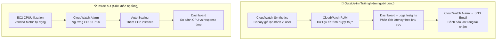
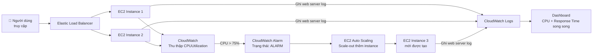
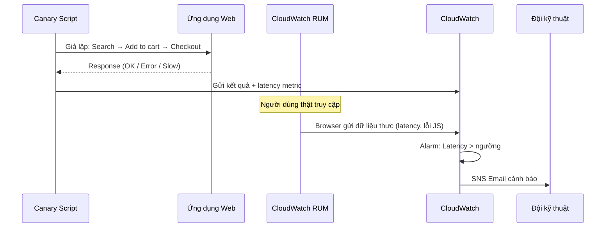
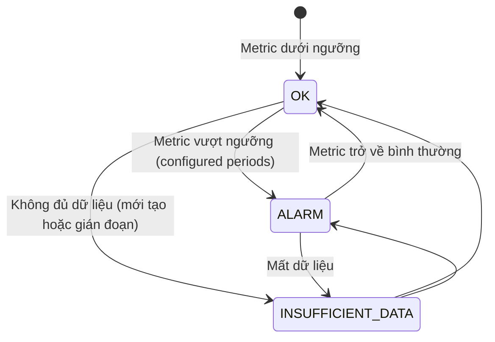

# Amazon CloudWatch: Getting Started

## 1. Overview & The "Why"

**Amazon CloudWatch** là dịch vụ giám sát và quan sát toàn diện (Observability) của AWS, giúp thu thập, phân tích và phản hồi dữ liệu từ ứng dụng, hạ tầng và mạng lưới — dù chạy trên AWS, on-premises, hybrid, hay multi-cloud.

**Vấn đề thực tế:** Hệ thống phân tán ngày càng phức tạp, sự cố có thể xảy ra bất kỳ lúc nào ở bất kỳ tầng nào. Không có công cụ giám sát tập trung, đội vận hành sẽ "mù" — không biết lỗi ở đâu, ảnh hưởng bao nhiêu người dùng, và cần xử lý gì trước.

> **Analogy:** CloudWatch giống như **trung tâm điều phối giao thông** của một thành phố lớn — camera từ mọi nút giao (EC2, Lambda, RDS...) đều truyền tín hiệu về đây. Khi có tắc đường (bottleneck), trung tâm lập tức phát cảnh báo và điều phối lại luồng xe (Auto Scaling).

---

## 2. Core Components & Keywords

| Thuật ngữ                         | Ý nghĩa                                                                         |
| --------------------------------- | ------------------------------------------------------------------------------- |
| **Metrics**                       | Dữ liệu số theo thời gian — CPU, RAM, Network, custom metrics                   |
| **Logs**                          | Bản ghi sự kiện từ ứng dụng/hệ thống, tổ chức theo Log Groups và Log Streams    |
| **Traces**                        | Hành trình của một request qua các service (tích hợp từ AWS X-Ray)              |
| **Alarms**                        | Bộ cảnh báo kích hoạt hành động tự động khi metric vượt ngưỡng                  |
| **Dashboards**                    | Giao diện trực quan hóa tập trung — metric + log trên cùng một màn hình         |
| **Synthetics / Canaries**         | Script tự động giả lập hành vi người dùng để kiểm tra API, URL định kỳ          |
| **RUM (Real User Monitoring)**    | Thu thập dữ liệu từ trình duyệt người dùng thật — latency, lỗi client-side      |
| **Logs Insights**                 | Công cụ truy vấn log bằng ngôn ngữ chuyên dụng — nhanh, mạnh                    |
| **Metric Insights / Metric Math** | Truy vấn SQL-like hoặc phép toán để tính toán, kết hợp nhiều metric             |
| **CloudWatch Agent**              | Cần cài lên EC2 để thu thập metric OS-level (RAM, disk) — không có sẵn mặc định |

> **Quan trọng:** `CPUUtilization` là **vended metric** — AWS tự thu thập. Nhưng **RAM** và **disk usage** bên trong OS **không có sẵn** — phải cài `CloudWatch Agent`.

---

## 3. Visual Theory & Architecture

### 3.1 Hai cách tiếp cận giám sát

**Giải thích:**

- **Outside-in** bắt đầu từ góc nhìn người dùng: giả lập hành vi → đo lường thực tế → cảnh báo khi trải nghiệm xấu đi.
- **Inside-out** bắt đầu từ hạ tầng: theo dõi tài nguyên → kích hoạt tự động hóa → xác nhận hiệu quả trên dashboard.
- Hai cách bổ sung cho nhau — hạ tầng ổn chưa chắc người dùng thấy nhanh, và ngược lại.

---

### 3.2 Luồng kiến trúc Inside-out (E-commerce Flash Sale)

**Giải thích từng bước:**

1. **Người dùng → ELB → EC2:** Lưu lượng được phân phối đều qua Load Balancer.
2. **CloudWatch thu thập CPUUtilization** tự động, không cần cấu hình gì thêm.
3. **Alarm kích hoạt** khi CPU vượt 75% — gọi Auto Scaling thêm server mới.
4. **CloudWatch Logs** nhận log từ web server để đo thời gian phản hồi thực tế.
5. **Dashboard** đặt hai biểu đồ cạnh nhau để xác nhận: thêm server có thực sự giảm latency không?

---

### 3.3 Luồng Outside-in (Synthetics + RUM)

**Giải thích:**

- **Canary** chạy liên tục theo lịch, phát hiện lỗi ngay cả khi không có user thật.
- **RUM** bổ sung dữ liệu từ user thật — phân biệt vấn đề theo trình duyệt, vùng địa lý.
- Kết hợp hai nguồn này cho phép phân biệt: lỗi hạ tầng backend hay lỗi rendering client-side?

---

## 4. Detailed Deep Dive

### 4.1 Metrics — Phân loại và cách thu thập

| Loại Metric        | Nguồn                          | Ví dụ                                        |
| ------------------ | ------------------------------ | -------------------------------------------- |
| **Vended Metrics** | AWS tự động thu thập, miễn phí | `CPUUtilization`, `NetworkIn`, `DiskReadOps` |
| **Custom Metrics** | Ứng dụng tự đẩy qua API/SDK    | Số đơn hàng/phút, queue depth                |
| **Agent Metrics**  | Cần cài CloudWatch Agent       | RAM usage, disk space, process count         |

### 4.2 Alarms — Các trạng thái

- **Hành động có thể kích hoạt từ ALARM:** Gửi SNS notification, gọi Auto Scaling, reboot/stop EC2, gọi Lambda.
- **Composite Alarms:** Kết hợp nhiều alarm với logic AND/OR để giảm false positives.

### 4.3 CloudWatch Logs — Cấu trúc tổ chức

- **Log Group:** Tập hợp log từ cùng một ứng dụng/dịch vụ (ví dụ: `/aws/lambda/my-function`)
- **Log Stream:** Luồng log từ một instance/container cụ thể trong group đó
- **Metric Filters:** Trích xuất metric từ log (ví dụ: đếm số lần xuất hiện `ERROR` trong log)
- **Logs Insights:** Truy vấn phân tích nhanh — hỗ trợ filter, stats, sort, limit

### 4.4 CloudWatch Synthetics — Canary Blueprints

| Blueprint                | Mục đích                                                          |
| ------------------------ | ----------------------------------------------------------------- |
| **Heartbeat monitoring** | Kiểm tra URL có load được không, chụp screenshot                  |
| **API Canary**           | Test REST API — kiểm tra request/response                         |
| **Broken link checker**  | Quét toàn bộ link trong trang, phát hiện link hỏng                |
| **Visual monitoring**    | So sánh screenshot hiện tại với baseline để phát hiện UI thay đổi |
| **Canary recorder**      | Record lại thao tác browser thực tế rồi chuyển thành script       |

---

## 5. Practical Scenarios & Integration

### Kịch bản 1: E-commerce — Phát hiện checkout bị lỗi trước khi khách hàng phàn nàn

**Vấn đề:** Trang thanh toán bị lỗi do deploy code mới, nhưng server vẫn trả về HTTP 200 (lỗi ẩn trong JS).

**Giải pháp:**

1. **Canary** chạy mỗi 5 phút, thực hiện quy trình checkout đầy đủ
2. Khi bước thanh toán thất bại, Canary ghi nhận lỗi và đẩy metric `SuccessPercent = 0` về CloudWatch
3. **Alarm** kích hoạt ngay → gửi SNS đến Slack/Email của đội dev
4. **RUM** xác nhận thêm: bao nhiêu user thật bị ảnh hưởng, trình duyệt nào bị nhiều nhất
5. Đội dev rollback code trong vài phút, trước khi support nhận được ticket đầu tiên từ khách hàng

### Kịch bản 2: Tối ưu chi phí EC2 bằng CloudWatch metrics

**Vấn đề:** Chi phí EC2 hàng tháng tăng cao, không rõ server nào đang chạy rỗi.

**Giải pháp:**

1. Xem metric `CPUUtilization` trung bình 2 tuần qua cho toàn bộ fleet EC2
2. Dùng **Metric Math** để tính phần trăm instance có CPU < 5% trong giờ làm việc
3. Lọc danh sách, hạ kích thước (right-size) hoặc tắt các instance idle
4. Thiết lập **CloudWatch Dashboard** cho team quản lý chi phí — cập nhật tự động hàng ngày

### Infrastructure as Code

Với **Terraform**, bạn khai báo các resource chính: `aws_cloudwatch_metric_alarm` (cấu hình ngưỡng, metric, action), `aws_cloudwatch_log_group` (nơi lưu log, retention policy), và `aws_cloudwatch_dashboard` (nội dung dashboard dưới dạng JSON). Tất cả được version control và deploy tự động, đảm bảo giám sát nhất quán giữa các môi trường dev/staging/production.

---

## 6. Exam Essentials & Pro Tips

### Các "bẫy" thường gặp

- ❗ **RAM không có trong default metrics** — phải cài `CloudWatch Agent` để lấy memory usage
- ❗ **Alarm không hồi tố** — Alarm chỉ theo dõi từ lúc tạo, không đánh giá dữ liệu lịch sử
- ❗ **Synthetics ≠ RUM** — Synthetics là test giả lập (proactive), RUM là dữ liệu user thật (reactive)
- ❗ **Log Groups phải tạo riêng** — Lambda/ECS tự tạo, nhưng EC2 cần agent và cấu hình
- ❗ **Metric resolution:** Default là 1 phút (Standard), có thể bật **High-Resolution** xuống 1 giây nhưng tốn tiền hơn

### Best Practices

**Hiệu năng & Độ tin cậy:**

- Dùng **Composite Alarms** để tránh false alarm — chỉ cảnh báo khi nhiều điều kiện cùng xảy ra
- Đặt `EvaluationPeriods` ≥ 3 trước khi trigger alarm — tránh kích hoạt từ spike ngắn thoáng qua

**Chi phí:**

- Đặt **Log retention policy** hợp lý (7 ngày, 30 ngày, 90 ngày) — lưu log mãi mãi rất tốn tiền
- Dùng **Log Insights** theo nhu cầu, không query thường xuyên trên log lớn không cần thiết
- Tận dụng **AWS Free Tier**: 10 custom metrics, 3 dashboards, 1M API requests miễn phí/tháng

**Bảo mật:**

- **Không log PII** (số điện thoại, mật khẩu, thẻ tín dụng) — dùng **CloudWatch Logs Data Protection** để tự động mask dữ liệu nhạy cảm
- Phân quyền IAM chi tiết: Dev chỉ được `logs:GetQueryResults`, Ops mới được `cloudwatch:PutMetricAlarm`
- Mã hóa Log Groups bằng **AWS KMS** cho dữ liệu nhạy cảm

**Vận hành:**

- **Tránh Alarm Fatigue:** Chỉ tạo alarm cho các chỉ số thực sự cần hành động — quá nhiều cảnh báo khiến đội bỏ sót lỗi nghiêm trọng
- Thiết kế Dashboard theo audience: Dashboard cho Dev (chi tiết kỹ thuật) khác Dashboard cho Manager (business metrics)
- Dùng **CloudWatch Anomaly Detection** thay vì đặt ngưỡng cứng — tự động học pattern và cảnh báo khi bất thường
