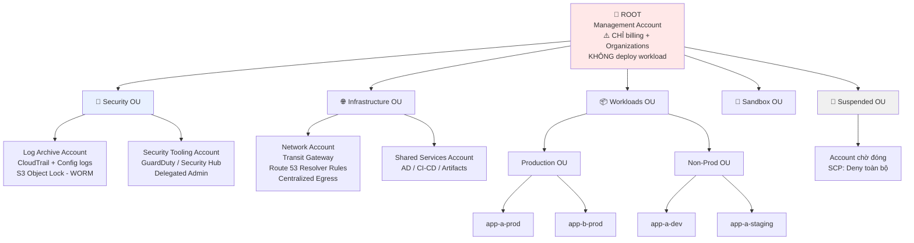
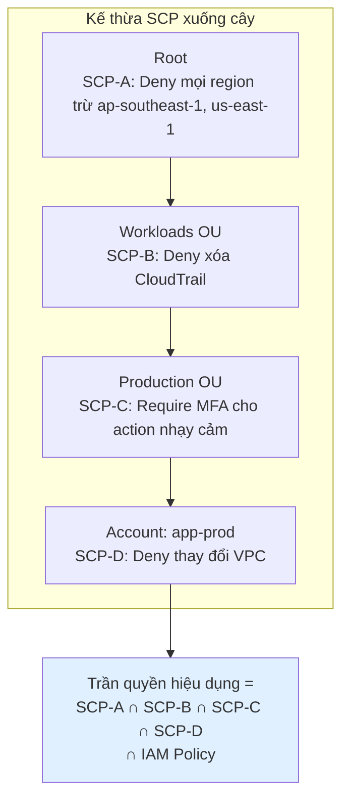
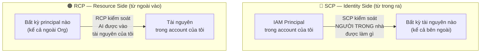
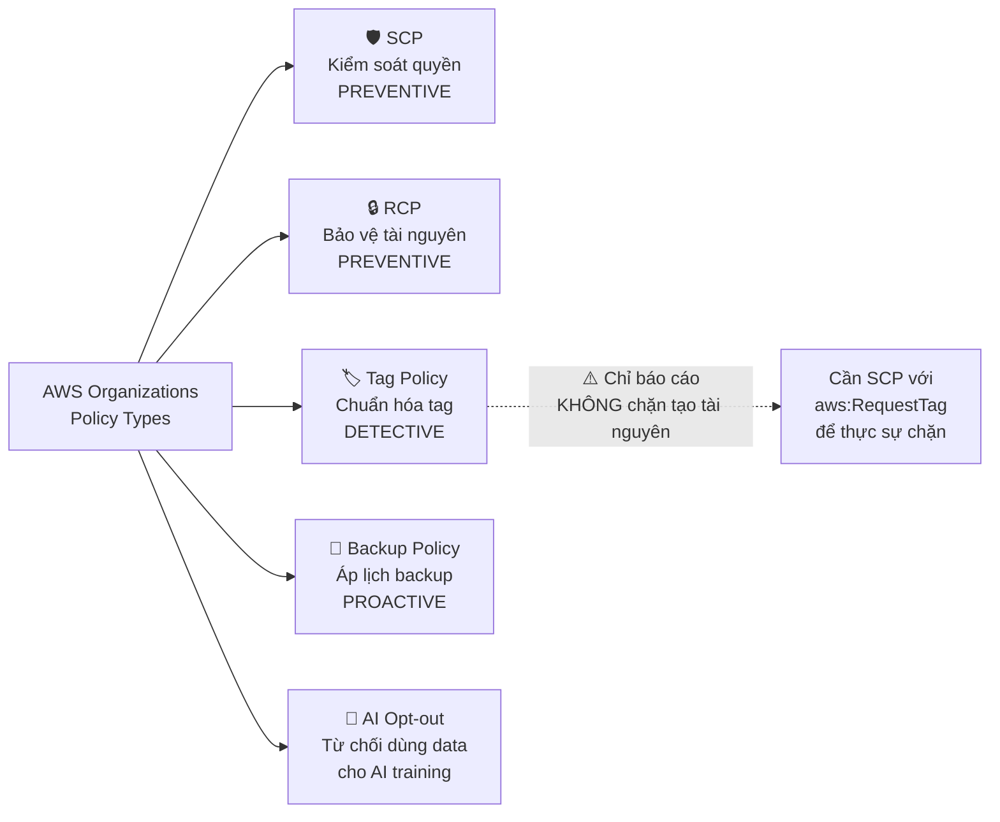
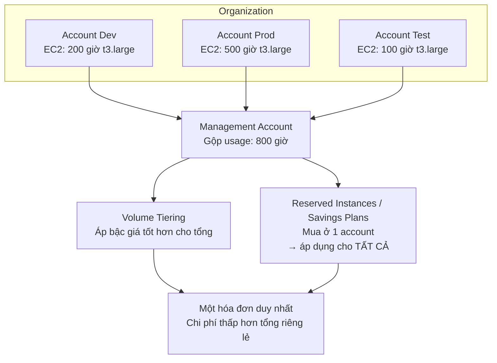
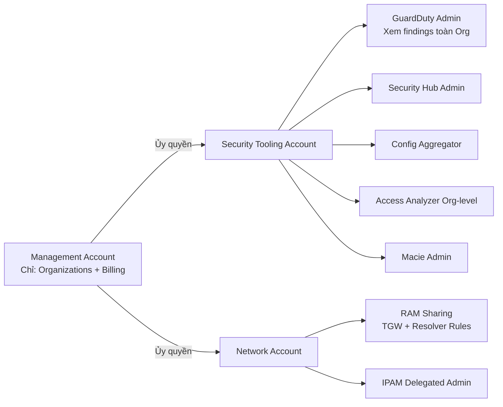
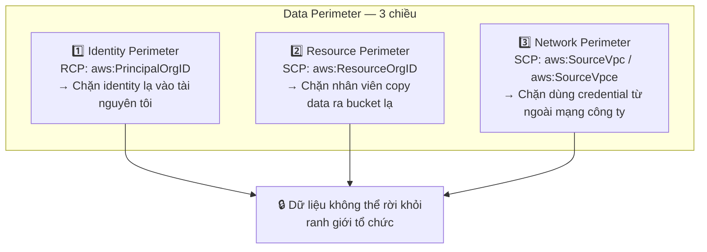

# AWS Organizations Deep Dive: Multi-Account Architecture & Policy Governance

> Tài liệu này mở rộng phần AWS Organizations đã đề cập trong **[Cloud Governance](./Cloud_Governance.md)**, đi sâu vào kiến trúc multi-account, cơ chế policy, và vận hành thực tế.

---

## 1. Overview & The "Why"

**AWS Organizations** là dịch vụ quản lý tập trung nhiều tài khoản AWS trong một cấu trúc phân cấp — cung cấp **billing hợp nhất**, **kiểm soát chính sách tập trung**, và **tự động hóa việc tạo account**.

### Tại sao lại cần nhiều account thay vì một account lớn?

Đây là câu hỏi nền tảng. Nhiều người mới bắt đầu nghĩ: "Dùng VPC và IAM để tách biệt trong một account là đủ rồi?" Câu trả lời là **không**, vì bốn lý do:

| Lý do                        | Giải thích                                                                                                             |
| ---------------------------- | ---------------------------------------------------------------------------------------------------------------------- |
| **Blast Radius (bán kính thiệt hại)** | Account là **ranh giới cách ly mạnh nhất** trong AWS. Một IAM policy sai trong account Dev không thể chạm tới Production |
| **Service Quotas**           | Quota (số EC2, số VPC, số Lambda concurrent) tính **theo account**. Một team dùng hết quota sẽ chặn cả công ty         |
| **Billing rõ ràng**          | Account là đơn vị phân bổ chi phí tự nhiên nhất — không phụ thuộc vào việc tag có đầy đủ hay không                     |
| **Compliance & Audit**       | PCI-DSS, HIPAA yêu cầu cách ly rõ ràng. Tách account là cách chứng minh dễ nhất với auditor                            |

> **Analogy:** Một account AWS giống như **một căn hộ**. Bạn có thể dùng vách ngăn (VPC, IAM) để chia phòng trong căn hộ, nhưng hỏa hoạn vẫn lan khắp. AWS Organizations giống như **một tòa chung cư** — mỗi team một căn hộ riêng, tường chống cháy giữa các căn, nhưng vẫn có ban quản lý chung, một hóa đơn điện nước tổng, và nội quy áp cho toàn tòa nhà.

---

## 2. Key Concepts & Keywords

| Thuật ngữ                       | Ý nghĩa                                                                                    |
| ------------------------------- | ------------------------------------------------------------------------------------------- |
| **Management Account**          | (Trước là Master/Payer) Account tạo ra Organization — **không bị SCP áp**, chịu hóa đơn tổng |
| **Member Account**              | Account thành viên, bị quản lý bởi policy của Organization                                   |
| **Root**                        | Nút gốc của cây Organization (không liên quan tới "root user")                              |
| **OU (Organizational Unit)**    | Nhóm logic chứa account hoặc OU con — tối đa **5 cấp lồng nhau**                            |
| **SCP**                         | Service Control Policy — trần quyền cho **IAM principal** trong account                      |
| **RCP**                         | Resource Control Policy — trần quyền cho **truy cập vào tài nguyên** trong account            |
| **Tag Policy**                  | Chuẩn hóa tag key/value trên toàn Organization                                              |
| **Backup Policy**               | Áp chính sách AWS Backup tập trung                                                          |
| **AI Services Opt-out Policy**  | Từ chối cho AWS dùng dữ liệu của bạn để cải thiện AI services                               |
| **Delegated Administrator**     | Ủy quyền quản trị một service (GuardDuty, Config, Security Hub) cho member account            |
| **Trusted Access**              | Cho phép service AWS hoạt động xuyên suốt Organization                                       |
| **Consolidated Billing**        | Gộp hóa đơn — chia sẻ volume discount và Reserved Instance/Savings Plans                     |
| **Control Tower**               | Lớp tự động hóa phía trên Organizations — Landing Zone, Guardrails, Account Factory          |
| **SRA**                         | AWS Security Reference Architecture — kiến trúc chuẩn AWS khuyến nghị                        |

---

## 3. Visual Theory & Architecture

### 3.1 Kiến trúc Multi-Account chuẩn (theo AWS SRA)



**Giải thích các quyết định thiết kế:**

- **Management Account trống rỗng.** Đây là nguyên tắc số một. Vì SCP không áp được lên nó, mọi tài nguyên đặt ở đây đều nằm ngoài tầm kiểm soát của guardrail. Nó cũng là mục tiêu tấn công giá trị nhất — compromise nó là compromise cả tổ chức.
- **Log Archive Account** là account "chỉ ghi, không xóa". Bật **S3 Object Lock (WORM)** và SCP chặn mọi `s3:Delete*`. Kể cả admin bị compromise cũng không xóa được bằng chứng.
- **Security Tooling Account** làm Delegated Administrator cho GuardDuty, Security Hub, Config, Macie, Access Analyzer — đội bảo mật không cần quyền vào Management Account.
- **Network Account** sở hữu Transit Gateway và Route 53 Resolver Rules, share qua **AWS RAM** cho các account khác.
- **Suspended OU** với SCP `Deny *` — nơi "cách ly" account trước khi đóng hoặc khi phát hiện compromise.

---

### 3.2 SCP hoạt động như thế nào — Kế thừa và phép giao



**Quy tắc quan trọng nhất về SCP:**

> **SCP là bộ lọc, không phải nguồn cấp quyền.** Nó chỉ định nghĩa *quyền tối đa có thể có*. IAM policy vẫn phải cấp quyền riêng. Hành động chỉ được thực hiện khi **SCP cho phép VÀ IAM cho phép**.

**Hai chiến lược viết SCP:**

| Chiến lược       | Cách làm                                                         | Ưu / Nhược                                                        |
| ---------------- | ---------------------------------------------------------------- | ----------------------------------------------------------------- |
| **Deny List** (khuyến nghị) | Giữ `FullAWSAccess` + thêm SCP có statement `Deny` | Dễ quản lý, ít gãy. Service mới tự động được phép                 |
| **Allow List**   | Gỡ `FullAWSAccess`, chỉ liệt kê action được phép                 | Chặt chẽ hơn nhưng **rất dễ vỡ** — mỗi service mới phải cập nhật  |

> Với hầu hết tổ chức, **Deny List là lựa chọn đúng**. Allow List chỉ hợp lý cho môi trường compliance cực nghiêm ngặt và có đội chuyên trách.

---

### 3.3 SCP vs RCP — Hai chiều của bức tường



| Tiêu chí                       | **SCP**                                  | **RCP**                                        |
| ------------------------------ | ---------------------------------------- | ----------------------------------------------- |
| Kiểm soát                      | Hành động của IAM principal **trong** account | Truy cập **vào** tài nguyên trong account   |
| Chặn được principal ngoài Org? | ❌ Không                                  | ✅ Có                                           |
| Áp lên Management Account?     | ❌ Không                                  | ✅ **Có**                                       |
| Áp lên Service Principal?      | ❌ Không                                  | ✅ Có (S3 gọi Lambda, v.v.)                     |
| Service hỗ trợ                 | Hầu hết service                          | Giới hạn: S3, KMS, SQS, Secrets Manager, STS... |
| Effect hỗ trợ                  | Allow + Deny                             | **Chỉ Deny** (kèm `RCPFullAWSAccess` mặc định)  |

**RCP giải quyết bài toán SCP không làm được:** Một kẻ tấn công có credential từ account bên ngoài truy cập vào S3 bucket của bạn — SCP hoàn toàn không nhìn thấy request đó, vì principal không thuộc Organization. RCP thì chặn được.

**RCP mẫu — "Data Perimeter" cho toàn Organization:**

```json
{
  "Version": "2012-10-17",
  "Statement": [{
    "Sid": "EnforceOrgPerimeter",
    "Effect": "Deny",
    "Principal": "*",
    "Action": ["s3:*", "sts:AssumeRole", "kms:*", "sqs:*", "secretsmanager:*"],
    "Resource": "*",
    "Condition": {
      "StringNotEqualsIfExists": {
        "aws:PrincipalOrgID": "o-abc123xyz"
      },
      "BoolIfExists": {
        "aws:PrincipalIsAWSService": "false"
      }
    }
  }]
}
```

**Một policy này áp ở Root** ngăn mọi truy cập từ ngoài Organization vào các tài nguyên nhạy cảm — trên **tất cả** account, kể cả những bucket mà đội bảo mật chưa kịp review. Đây là ví dụ đẹp nhất của "guardrail mở rộng theo tổ chức".

---

### 3.4 Bốn loại Policy trong Organizations



> **Điểm dễ nhầm — Tag Policy KHÔNG bắt buộc tag.** Nó chỉ đánh dấu "non-compliant" trong báo cáo. Muốn **thực sự chặn** việc tạo tài nguyên không có tag, phải viết SCP:
> ```json
> {
>   "Effect": "Deny",
>   "Action": ["ec2:RunInstances", "rds:CreateDBInstance"],
>   "Resource": "*",
>   "Condition": { "Null": { "aws:RequestTag/CostCenter": "true" } }
> }
> ```

---

### 3.5 Consolidated Billing — Cơ chế chia sẻ tiết kiệm



**Ba lợi ích tài chính:**

1. **Volume Discount tự động** — S3, Data Transfer có bậc giá giảm dần theo lượng dùng. Gộp usage của 20 account đưa bạn lên bậc rẻ hơn.
2. **RI/Savings Plans sharing** — mua Savings Plans ở một account, tự động áp dụng cho account nào có usage khớp. Không cần dự đoán chính xác team nào cần bao nhiêu.
3. **Free Tier dùng chung** — Free tier tính cho toàn Organization (không phải mỗi account một suất).

> **Lưu ý vận hành:** Có thể **tắt RI sharing** cho từng account nếu muốn account đó không "ăn ké" RI của account khác — hữu ích khi các team hạch toán riêng biệt.

---

## 4. Detailed Deep Dive

### 4.1 SCP Patterns thực chiến

**A. Chặn Region không được phê duyệt (nền tảng của mọi Organization)**

```json
{
  "Version": "2012-10-17",
  "Statement": [{
    "Sid": "DenyUnapprovedRegions",
    "Effect": "Deny",
    "NotAction": [
      "iam:*", "organizations:*", "route53:*", "cloudfront:*",
      "waf:*", "support:*", "budgets:*", "sts:*", "s3:GetAccountPublic*"
    ],
    "Resource": "*",
    "Condition": {
      "StringNotEquals": {
        "aws:RequestedRegion": ["ap-southeast-1", "us-east-1"]
      }
    }
  }]
}
```

> **Bẫy quan trọng:** `NotAction` phải liệt kê các **global service** (IAM, Route 53, CloudFront, Organizations). Chúng có endpoint ở `us-east-1` nhưng bản chất là global — nếu không loại trừ, bạn sẽ khóa chính mình khỏi IAM và không thể sửa được nữa. **Đây là cách phổ biến nhất để "tự bắn vào chân" với SCP.**

**B. Bảo vệ hạ tầng audit (không ai được tắt giám sát)**

```json
{
  "Effect": "Deny",
  "Action": [
    "cloudtrail:StopLogging", "cloudtrail:DeleteTrail", "cloudtrail:UpdateTrail",
    "config:DeleteConfigurationRecorder", "config:StopConfigurationRecorder",
    "guardduty:DeleteDetector", "guardduty:DisassociateFromMasterAccount",
    "securityhub:DisableSecurityHub"
  ],
  "Resource": "*",
  "Condition": {
    "ArnNotLike": {
      "aws:PrincipalArn": "arn:aws:iam::*:role/OrgSecurityBreakGlassRole"
    }
  }
}
```

**C. Chặn tạo IAM User (bắt buộc dùng Identity Center)**

```json
{
  "Effect": "Deny",
  "Action": ["iam:CreateUser", "iam:CreateAccessKey", "iam:CreateLoginProfile"],
  "Resource": "*"
}
```

Đây là SCP có tác động lớn nhất tới bảo mật: nó **loại bỏ hoàn toàn credential dài hạn** khỏi tổ chức. Kết hợp với IAM Identity Center để cấp quyền qua federation.

**D. Bảo vệ Root User của member account**

```json
{
  "Effect": "Deny",
  "Action": "*",
  "Resource": "*",
  "Condition": {
    "StringLike": { "aws:PrincipalArn": "arn:aws:iam::*:root" }
  }
}
```

Mỗi member account vẫn có root user với email riêng. SCP này vô hiệu hóa hoàn toàn root của member account (SCP **áp được** lên root user của member — chỉ không áp được lên Management Account).

**E. Chặn rời khỏi Organization**

```json
{
  "Effect": "Deny",
  "Action": ["organizations:LeaveOrganization"],
  "Resource": "*"
}
```

Ngăn admin của member account tự tách account ra khỏi Organization để thoát mọi guardrail.

---

### 4.2 Giới hạn kỹ thuật cần nhớ

| Giới hạn                              | Giá trị                                              |
| ------------------------------------- | ---------------------------------------------------- |
| Số account trong Organization         | Mặc định 10, tăng được qua Support (thực tế hàng nghìn) |
| Độ sâu OU lồng nhau                   | **5 cấp** (không tính Root)                          |
| SCP gắn vào mỗi entity (Root/OU/Account) | **5 policy**                                      |
| Kích thước một SCP                    | **5,120 ký tự** (tính cả khoảng trắng)               |
| RCP gắn vào mỗi entity                | 5 policy                                             |
| Tag Policy / Backup Policy            | 10 policy mỗi entity                                 |

> **Giới hạn 5,120 ký tự là ràng buộc thực tế lớn nhất.** Chiến lược: viết SCP ngắn gọn (bỏ `Sid` nếu cần, gộp action bằng wildcard), và **chia nhỏ theo mục đích** thay vì gộp một SCP khổng lồ. Nhiều tổ chức lớn phải dùng công cụ sinh SCP tự động để tối ưu độ dài.

---

### 4.3 Delegated Administrator — Không dồn mọi thứ vào Management Account



**Nguyên tắc:** Mỗi service nên có delegated administrator ở account chuyên trách. Điều này cho phép đội bảo mật/mạng làm việc **mà không cần quyền vào Management Account** — giảm số người có quyền tối cao xuống mức tối thiểu.

Các service hỗ trợ delegated admin phổ biến: GuardDuty, Security Hub, Config, Macie, Inspector, Access Analyzer, CloudFormation StackSets, IAM Identity Center, Firewall Manager, Backup, Detective, IPAM, RAM.

---

### 4.4 AWS Control Tower — Khi nào cần?

Control Tower là lớp **tự động hóa** phía trên Organizations:

| Thành phần            | Chức năng                                                                    |
| --------------------- | ----------------------------------------------------------------------------- |
| **Landing Zone**      | Tự động dựng Security OU, Log Archive, Audit account, CloudTrail org-wide     |
| **Guardrails**        | Preventive (SCP) + Detective (Config Rule) + Proactive (CloudFormation Hooks) |
| **Account Factory**   | Tạo account mới theo template chuẩn, có thể tích hợp Service Catalog          |
| **Dashboard**         | Xem trạng thái tuân thủ toàn Organization ở một nơi                           |
| **Landing Zone Accelerator (LZA)** | Giải pháp mở rộng cho yêu cầu phức tạp (multi-region, compliance nặng) |

| | **Organizations thuần** | **Control Tower** |
|---|---|---|
| Kiểm soát chi tiết | ✅ Toàn quyền | ⚠️ Có "khuôn khổ" phải theo |
| Tốc độ khởi tạo | Chậm — tự dựng mọi thứ | ✅ Nhanh — vài giờ có landing zone |
| Phù hợp với | Đội có kinh nghiệm, yêu cầu đặc thù | Đa số tổ chức, đặc biệt khi mới bắt đầu |
| Rủi ro | Dễ thiếu sót guardrail quan trọng | Drift khi sửa tay ngoài Control Tower |

> **Cảnh báo về Drift:** Nếu bạn sửa SCP hoặc di chuyển account bằng tay (ngoài Control Tower), Control Tower báo **drift**. Phải sửa qua Control Tower hoặc chấp nhận `Re-register OU`. Đây là nguồn ma sát thường gặp khi đội đã quen làm việc với Terraform.

---

### 4.5 Tạo và di chuyển Account

**Ba cách đưa account vào Organization:**

1. **Tạo mới qua API/Console** (`CreateAccount`) — nhanh, nhưng account mới **không có** IAM user; truy cập qua `OrganizationAccountAccessRole` được tạo tự động.
2. **Mời account có sẵn** (`InviteAccountToOrganization`) — chủ account phải chấp nhận. **Không tự tạo `OrganizationAccountAccessRole`** — phải tạo thủ công.
3. **Account Factory (Control Tower)** — tạo theo template có sẵn baseline.

**Điểm quan trọng khi đóng account:**

- Account bị đóng vào trạng thái **SUSPENDED trong 90 ngày** trước khi xóa vĩnh viễn — vẫn tính vào quota số account.
- Trước khi đóng: chuyển account sang **Suspended OU** với SCP `Deny *`, gỡ mọi tài nguyên, backup dữ liệu cần lưu.
- Có thể đóng account trực tiếp từ Management Account qua API `CloseAccount` (giới hạn 10% số account/tháng).

---

### 4.6 Chi phí

**AWS Organizations bản thân nó hoàn toàn MIỄN PHÍ.** Bạn chỉ trả tiền cho tài nguyên dùng trong các account.

Chi phí gián tiếp cần biết:

- **AWS Control Tower** miễn phí, nhưng các service nó bật (CloudTrail, Config, S3 log storage) thì tính phí. Với Organization 50 account, chi phí Config + CloudTrail có thể lên vài trăm USD/tháng.
- **AWS Config** là nguồn chi phí ẩn lớn nhất — tính theo Configuration Item được ghi. Cân nhắc giới hạn resource type được record ở account sandbox.
- Mỗi account tăng thêm chi phí baseline (CloudTrail trail, Config recorder, GuardDuty detector).

---

## 5. Practical Scenarios

### Kịch bản 1: Startup 3 người → Enterprise 50 account

**Giai đoạn 1 (0-6 tháng):** 1 account, dùng IAM Role tách biệt.
→ Chấp nhận được, nhưng **bật Organizations ngay từ đầu** dù chỉ có 1 account.

**Giai đoạn 2 (6-18 tháng):** Tách thành 4 account cơ bản.
```
Root
├── Management (trống)
├── Security OU → Log Archive, Audit
└── Workloads OU → Prod, Dev
```
→ Bật CloudTrail org-wide, SCP chặn region, SCP bảo vệ CloudTrail.

**Giai đoạn 3 (18 tháng+):** Áp dụng Control Tower + Account Factory, mỗi ứng dụng một cặp account prod/non-prod, IAM Identity Center thay toàn bộ IAM User.

> **Bài học:** Chi phí **migration** từ 1 account sang multi-account tăng theo hàm mũ với thời gian. Tách sớm rẻ hơn tách muộn rất nhiều — vì tài nguyên không thể "di chuyển" giữa account, phải tạo lại.

---

### Kịch bản 2: Đội Dev cần tự do, nhưng công ty cần kiểm soát chi phí

**Thiết kế Sandbox OU:**

| Lớp kiểm soát   | Cấu hình                                                                    |
| --------------- | ---------------------------------------------------------------------------- |
| **SCP**         | Chỉ cho phép instance `t3.*`, `t4g.*`; chặn RDS Multi-AZ; chặn mọi region trừ 1 |
| **AWS Budgets** | $300/tháng/account, alert ở 50% / 80% / 100%                                 |
| **Budgets Actions** | Tự động apply SCP `Deny ec2:RunInstances` khi đạt 100%                    |
| **Lambda Janitor** | Chạy hàng đêm, terminate tài nguyên có tag `ExpiryDate` đã qua            |
| **Tag Policy + SCP** | Bắt buộc tag `Owner` và `ExpiryDate` khi tạo tài nguyên                  |
| **Không kết nối** | Sandbox VPC **không** peering với Prod — cách ly hoàn toàn                 |

**Kết quả:** Dev có "vườn chơi" thật sự, làm gì cũng được trong giới hạn — không cần xin phép, không thể gây thiệt hại.

---

### Kịch bản 3: Xây dựng Data Perimeter cho toàn Organization

**Mục tiêu:** Đảm bảo (1) chỉ identity trong Org truy cập tài nguyên của Org, (2) identity của Org chỉ truy cập tài nguyên của Org, (3) traffic chỉ đi qua đường mạng được phê duyệt.



**SCP cho Resource Perimeter (chống exfiltration):**

```json
{
  "Effect": "Deny",
  "Action": ["s3:PutObject", "s3:GetObject"],
  "Resource": "*",
  "Condition": {
    "StringNotEqualsIfExists": { "aws:ResourceOrgID": "${aws:PrincipalOrgID}" },
    "Bool": { "aws:PrincipalIsAWSService": "false" }
  }
}
```

Statement này ngăn nhân viên nội bộ (hoặc malware chạy dưới credential của họ) copy dữ liệu sang bucket S3 của account cá nhân — một trong những vector rò rỉ dữ liệu phổ biến nhất mà firewall truyền thống không nhìn thấy.

---

### Kịch bản 4: Phát hiện account bị compromise — Quy trình cách ly

1. **Cách ly ngay:** Di chuyển account sang **Quarantine OU** có SCP `Deny *` (chỉ chừa `iam:*` cho forensics role).
2. **Thu hồi session:** `aws iam put-role-policy` với `AWSRevokeOlderSessions`, hoặc gắn policy Deny với `aws:TokenIssueTime` < thời điểm hiện tại — vô hiệu hóa **mọi credential tạm đang hoạt động**.
3. **Điều tra:** CloudTrail log đã nằm an toàn ở Log Archive Account (immutable, kẻ tấn công không xóa được). Dùng **Amazon Detective** để dựng lại timeline.
4. **Rà soát ngang:** Kiểm tra `sts:AssumeRole` từ account này sang account khác — kẻ tấn công có lateral movement không?
5. **Khôi phục:** Dựng lại account mới từ IaC, không "dọn dẹp" account cũ (không bao giờ chắc chắn đã sạch).

> **Điều này chỉ khả thi nhờ kiến trúc multi-account.** Trong một account đơn, bạn không có nơi nào an toàn để giữ log, và không thể "cách ly" một phần hệ thống.

---

## 6. Exam Essentials & Pro Tips

### 🔑 Điểm mấu chốt

- **AWS Organizations miễn phí.**
- **Management Account KHÔNG bị SCP áp** — nhưng **BỊ RCP áp**.
- **SCP không cấp quyền** — chỉ giới hạn. Cần IAM policy cấp quyền song song.
- **SCP áp được lên root user của member account**, không áp lên root của Management Account.
- **Tag Policy không chặn** — chỉ báo cáo. Cần SCP với `aws:RequestTag` để chặn thật.
- **Tối đa 5 cấp OU, 5 SCP/entity, 5120 ký tự/SCP.**
- **Consolidated Billing** chia sẻ volume discount + RI/Savings Plans tự động.
- **Account đóng ở trạng thái SUSPENDED 90 ngày.**
- **`OrganizationAccountAccessRole`** tự tạo khi `CreateAccount`, KHÔNG tự tạo khi `InviteAccount`.

### ⚠️ Bẫy thường gặp

| Bẫy                                                              | Hậu quả                                                          |
| ---------------------------------------------------------------- | ---------------------------------------------------------------- |
| SCP chặn region mà không loại trừ global services                | **Tự khóa mình khỏi IAM** — không sửa được gì nữa                |
| Deploy workload vào Management Account                           | Tài nguyên nằm ngoài mọi guardrail, blast radius cực lớn        |
| Dùng Allow List SCP                                              | Service mới bị chặn, gãy liên tục, tốn công bảo trì             |
| Nghĩ SCP cấp quyền                                               | Gỡ IAM policy vì "SCP đã cho phép rồi" → Access Denied           |
| Quên `FullAWSAccess` khi thêm SCP mới                            | Chặn toàn bộ account ngoài ý muốn                                |
| Nghĩ SCP chặn được kẻ tấn công từ account ngoài                  | SCP không thấy principal ngoài Org — phải dùng RCP               |
| Sửa SCP bằng tay khi dùng Control Tower                          | Drift — Control Tower báo lỗi và có thể ghi đè                   |
| Không test SCP trước khi áp lên Root                             | Có thể làm gãy production toàn tổ chức trong vài giây            |
| Vượt 5120 ký tự SCP                                              | Không lưu được, phải refactor gấp                                |

### 🎯 Thứ tự triển khai khuyến nghị

1. Bật Organizations, tạo cấu trúc OU cơ bản (Security / Infrastructure / Workloads / Sandbox).
2. Tách Log Archive + Security Tooling account. Bật CloudTrail org-wide ghi vào Log Archive với Object Lock.
3. Áp SCP nền tảng: chặn region, bảo vệ CloudTrail/Config, chặn LeaveOrganization.
4. Triển khai IAM Identity Center, SCP chặn `iam:CreateUser`.
5. Ủy quyền delegated admin cho GuardDuty/Security Hub/Config về Security Tooling account.
6. Áp Tag Policy + SCP bắt buộc tag cho cost allocation.
7. Xây dựng Data Perimeter bằng RCP + SCP.
8. Cân nhắc Control Tower nếu chưa dùng, hoặc LZA nếu yêu cầu phức tạp.
9. Quản lý toàn bộ bằng IaC (Terraform/CloudFormation StackSets), review qua Pull Request.

> **Nguyên tắc vàng khi test SCP:** Luôn áp lên **một Sandbox OU trước**, chạy ít nhất một tuần, rồi mới mở rộng lên Workloads OU, cuối cùng mới lên Root. SCP áp sai ở Root có thể làm tê liệt toàn bộ tổ chức trong vài giây — và nếu bạn tự khóa mình khỏi IAM thì chỉ còn cách gọi AWS Support.

---

## 7. Liên kết kiến thức

- **[Cloud Governance](./Cloud_Governance.md)** — Config, Security Hub, Tagging Strategy, FinOps
- **[IAM Deep Dive v2](../02_Security_Identity/IAM_DeepDive_v2.md)** — Policy Evaluation Logic, Permissions Boundary, ABAC
- **[Amazon Route 53 Deep Dive](../03_Networking/Amazon_Route53_DeepDive.md)** — Chia sẻ Resolver Rule qua RAM, DNS multi-account
- **[Amazon Macie](../02_Security_Identity/Amazon_Macie_Sensitive_Data.md)** — Macie delegated admin cho toàn Organization
- **[Cost Optimization](../10_Cost_Optimization/)** — Consolidated Billing và phân bổ chi phí
