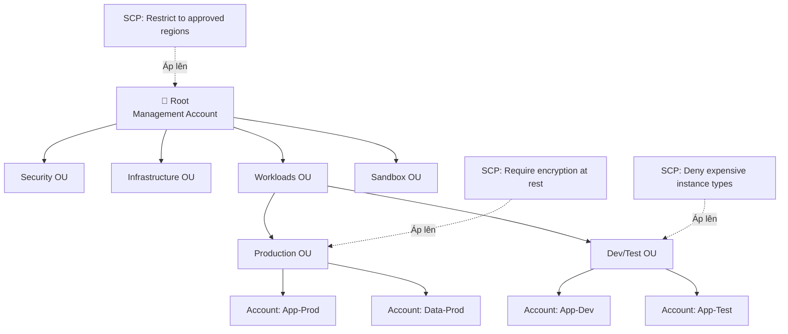
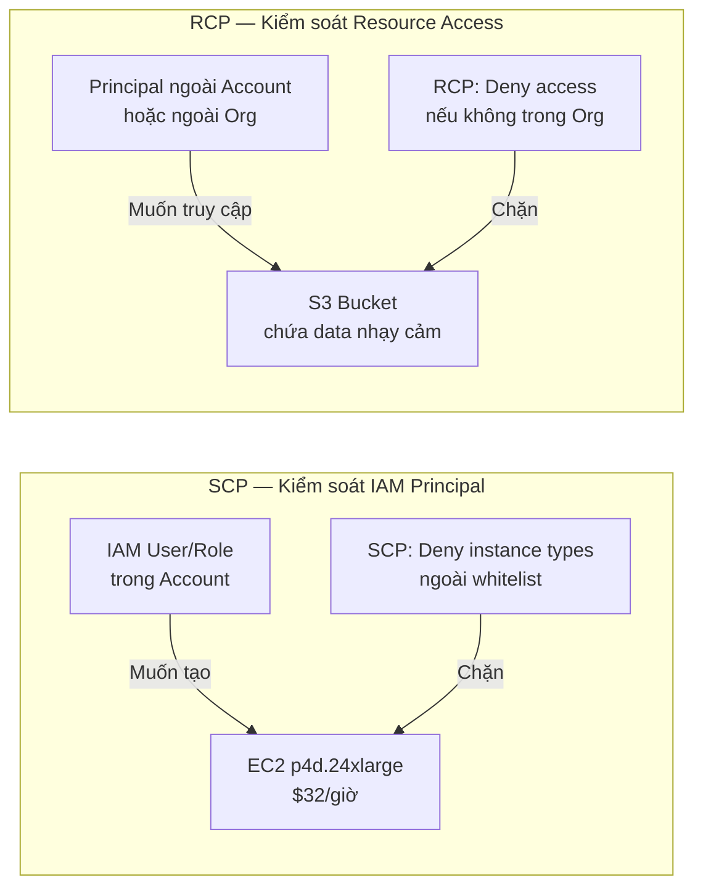
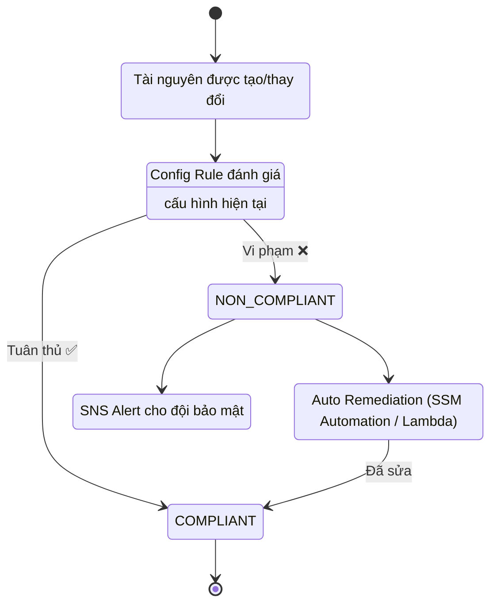
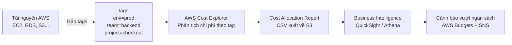

# Cloud Governance: Cân bằng Bảo mật và Chi phí

## 1. Overview & The "Why"

**Cloud Governance** là tập hợp các chính sách, kiểm soát và quy trình giúp tổ chức vận hành cloud một cách **an toàn, tuân thủ và tiết kiệm chi phí** — đồng thời không cản trở tốc độ phát triển của các đội kỹ thuật.

**Vấn đề thực tế:** Càng nhiều team dùng cloud, càng khó kiểm soát: ai đang tạo tài nguyên gì, ở đâu, tốn bao nhiêu tiền, có tuân thủ bảo mật không? Không có governance, hóa đơn AWS tăng bất ngờ và rủi ro bảo mật xuất hiện từ các tài nguyên "ma" không ai quản lý.

> **Analogy:** Cloud Governance giống như **bộ luật giao thông của một thành phố** — không cấm xe chạy, nhưng quy định làn đường, tốc độ, và biển cấm. Các đội dev vẫn tự do triển khai, nhưng trong giới hạn an toàn đã được định sẵn.

---

## 2. Core Components & Keywords

| Thuật ngữ                         | Ý nghĩa                                                                       |
| --------------------------------- | ----------------------------------------------------------------------------- |
| **Cost-Aware Governance**         | Tích hợp chi phí vào mọi quyết định quản trị, không chỉ bảo mật               |
| **AWS Organizations**             | Quản lý nhiều tài khoản AWS trong một cấu trúc phân cấp thống nhất            |
| **SCP (Service Control Policy)**  | Chính sách kiểm soát _những gì có thể làm_ — áp lên OU/Account                |
| **RCP (Resource Control Policy)** | Kiểm soát _ai có thể truy cập tài nguyên_ từ bên ngoài account                |
| **AWS Control Tower**             | Landing Zone tự động — thiết lập môi trường multi-account theo best practices |
| **AWS Config**                    | Ghi lại và đánh giá cấu hình tài nguyên — phát hiện drift và vi phạm          |
| **Conformance Pack**              | Bộ quy tắc Config đóng gói sẵn theo tiêu chuẩn (CIS, PCI-DSS, NIST...)        |
| **Cost Allocation Tags**          | Nhãn gắn vào tài nguyên để phân bổ chi phí theo team/project/env              |
| **Tag Policy**                    | Chính sách trong Organizations bắt buộc định dạng tag nhất quán               |
| **AWS Security Hub**              | Tập trung hóa findings bảo mật từ nhiều dịch vụ AWS vào một nơi               |
| **Well-Architected Framework**    | 6 trụ cột thiết kế cloud của AWS, trong đó có Cost Optimization và Security   |

---

## 3. Visual Theory & Architecture

### 3.1 Cấu trúc AWS Organizations cho Governance

**Giải thích:**

- **Root → OU → Account** tạo ra phân cấp để áp dụng chính sách có chọn lọc.
- **SCP** gắn vào OU sẽ ảnh hưởng xuống tất cả account con — kiểm soát tập trung mà không cần vào từng account.
- **Sandbox OU** thường được nới lỏng SCP để dev tự do thử nghiệm, nhưng có giới hạn ngân sách.

---

### 3.2 Luồng kiểm soát SCP vs RCP

**Giải thích:**

- **SCP** = kiểm soát _hành động của người dùng_ trong account (Identity-side).
- **RCP** = kiểm soát _ai được phép truy cập tài nguyên_ bất kể họ ở đâu (Resource-side).
- Dùng cả hai để tạo lớp bảo vệ kép: ngăn nội bộ lạm dụng tài nguyên đắt tiền VÀ ngăn bên ngoài truy cập dữ liệu nhạy cảm.

---

### 3.3 Vòng đời AWS Config — Phát hiện và Xử lý vi phạm

**Giải thích:**

- Config liên tục ghi lại trạng thái tài nguyên (Configuration Item).
- Khi phát hiện vi phạm (ví dụ: S3 bucket bật public access, EC2 không có tag bắt buộc), có thể **tự động remediate** hoặc gửi cảnh báo.
- Conformance Pack đóng gói nhiều rules liên quan thành một bộ tiêu chuẩn — deploy một lần cho toàn bộ Organization.

---

### 3.4 Luồng Cost Allocation với Tags

**Giải thích:**

- Tags là nền tảng của mọi báo cáo chi phí. Không có tag nhất quán = không thể biết team nào tốn tiền nhất.
- **Tag Policy** trong Organizations bắt buộc định dạng tag (ví dụ: `Environment` không được viết thành `env` hay `Env`).
- Dữ liệu chi phí chảy từ tài nguyên → Cost Explorer → BI tools → alerts tự động.

---

## 4. Detailed Deep Dive

### 4.1 AWS Well-Architected Framework — Góc nhìn Cost Governance

| Trụ cột                    | Liên quan đến Governance                                        |
| -------------------------- | --------------------------------------------------------------- |
| **Cost Optimization**      | Right-sizing, Reserved Instances, xóa tài nguyên rỗi            |
| **Security**               | IAM least privilege, encryption, detective controls             |
| **Operational Excellence** | Tự động hóa, IaC, giảm manual toil                              |
| **Reliability**            | Multi-AZ, backup — nhưng phải cân bằng với chi phí              |
| **Performance Efficiency** | Chọn đúng loại tài nguyên cho workload                          |
| **Sustainability**         | Giảm carbon footprint = giảm tài nguyên lãng phí = giảm chi phí |

### 4.2 SCP — Các pattern kiểm soát chi phí phổ biến

| Pattern SCP                         | Mục đích                                                                         |
| ----------------------------------- | -------------------------------------------------------------------------------- |
| Deny instance types ngoài whitelist | Ngăn dev tạo EC2 cực đắt trong non-prod                                          |
| Require tag khi tạo tài nguyên      | Bắt buộc có tag trước khi tạo — không tag = không được tạo                       |
| Restrict to approved regions        | Chỉ cho phép dùng `us-east-1`, `eu-west-1` — tránh tài nguyên "lạc" ở region đắt |
| Deny deletion of Config/CloudTrail  | Bảo vệ audit trail — không ai tắt được giám sát                                  |
| Limit max budget per account        | Kết hợp với AWS Budgets để tự động suspend account khi vượt ngưỡng               |

> **Quan trọng:** SCP **không cấp quyền** — chỉ giới hạn quyền đã có. IAM vẫn phải cấp phép riêng. SCP và IAM policy cùng phải cho phép thì hành động mới thực hiện được.

### 4.3 AWS Config Rules — Loại và Cách hoạt động

| Loại Rule                 | Nguồn                                   | Ví dụ                                                                   |
| ------------------------- | --------------------------------------- | ----------------------------------------------------------------------- |
| **AWS Managed Rules**     | AWS cung cấp sẵn (~200+ rules)          | `ec2-instance-no-public-ip`, `s3-bucket-server-side-encryption-enabled` |
| **Custom Rules (Lambda)** | Bạn viết logic bằng Lambda              | Kiểm tra naming convention theo quy định nội bộ                         |
| **Custom Rules (Guard)**  | AWS CloudFormation Guard — DSL đơn giản | Kiểm tra IaC template trước khi deploy                                  |
| **Conformance Pack**      | Bộ nhiều rules + remediation            | `Operational-Best-Practices-for-CIS-AWS`                                |

### 4.4 Thiết kế Tagging Strategy

**Các tag bắt buộc (Mandatory):**

- `Environment` — `production` / `staging` / `development`
- `Team` — tên đội sở hữu tài nguyên
- `Project` — tên project/product
- `CostCenter` — mã trung tâm chi phí cho kế toán

**Các tag tùy chọn (Recommended):**

- `Owner` — email người tạo
- `ExpiryDate` — ngày xóa tài nguyên tạm thời (rất hữu ích cho sandbox)
- `DataClassification` — `public` / `internal` / `confidential`

> **Lưu ý:** Tag Keys phân biệt hoa thường — `Environment` ≠ `environment`. Tag Policy trong Organizations giải quyết vấn đề này bằng cách định nghĩa chuẩn hóa bắt buộc.

### 4.5 Security Hub — Tập trung hóa Findings

Security Hub nhận findings từ:

- **Amazon GuardDuty** — Threat detection
- **Amazon Inspector** — Vulnerability scanning
- **AWS Config** — Configuration compliance
- **IAM Access Analyzer** — Unintended external access
- **Third-party tools** — Splunk, Palo Alto, CrowdStrike...

Tất cả được chuẩn hóa theo format **ASFF (Amazon Security Finding Format)** và tính điểm mức độ nghiêm trọng để ưu tiên xử lý.

---

## 5. Practical Scenarios & Integration

### Kịch bản 1: Ngăn chi phí bùng nổ trong môi trường Dev/Test

**Vấn đề:** Developer vô tình để chạy EC2 `p3.16xlarge` (GPU, ~$24/giờ) suốt cuối tuần cho một thử nghiệm nhỏ.

**Giải pháp Governance:**

1. **SCP** trên Dev OU: Deny `ec2:RunInstances` nếu instance type không trong whitelist (`t3.*`, `m5.*`, `c5.*`)
2. **AWS Config Rule**: `ec2-instance-type-check` — phát hiện và alert nếu có instance ngoài danh sách
3. **AWS Budgets**: Thiết lập budget $500/tháng cho Dev account, gửi SNS khi đạt 80%
4. **Tag Policy**: Bắt buộc tag `ExpiryDate` khi tạo EC2 trong Dev — Lambda tự động stop instance quá hạn
5. **Kết quả**: Instance đắt tiền bị chặn ngay từ API call, không bao giờ chạy được trong Dev

### Kịch bản 2: Audit toàn bộ tài nguyên không tuân thủ bảo mật + tốn tiền

**Vấn đề:** Sau 2 năm scale, không ai biết có bao nhiêu S3 bucket public, RDS không mã hóa, hoặc EC2 rỗi.

**Giải pháp:**

1. **AWS Config Conformance Pack** `Operational-Best-Practices-for-Cost-Optimization` — scan toàn bộ tài nguyên
2. **Security Hub** tổng hợp findings từ Config + GuardDuty + Inspector vào một dashboard
3. **Config Advanced Query** (SQL-like): Truy vấn tất cả EC2 có `CPUUtilization < 5%` trong 2 tuần — ứng viên để right-size hoặc terminate
4. **Remediation tự động**: S3 bucket public access bị phát hiện → Lambda tự động bật `BlockPublicAccess`
5. **Cost Allocation Report**: Sau khi tag đầy đủ, xuất báo cáo hàng tháng phân bổ chi phí theo team → mỗi team tự chịu trách nhiệm với hóa đơn của mình (**FinOps culture**)

### Infrastructure as Code

Toàn bộ governance infrastructure nên được quản lý bằng IaC:

- **Terraform** hoặc **CloudFormation StackSets** để deploy SCP, Config Rules, Tag Policies đồng loạt qua toàn bộ Organization
- **AWS CDK** để viết Conformance Pack và custom Config Rules bằng Python/TypeScript
- Lưu trữ trong Git → mọi thay đổi chính sách đều có audit trail qua Pull Request

---

## 6. Exam Essentials & Pro Tips

### Các "bẫy" thường gặp

- ❗ **SCP không cấp quyền** — Management Account không bị ảnh hưởng bởi SCP (luôn có full access)
- ❗ **Config ghi nhận, không ngăn chặn** — Config phát hiện vi phạm SAU KHI tài nguyên được tạo, không phải trước. Muốn ngăn trước phải dùng SCP hoặc IAM
- ❗ **Tag sau khi tạo không tính** — Nhiều dịch vụ chỉ phân bổ chi phí theo tag nếu tag tồn tại từ đầu tháng
- ❗ **Control Tower ≠ Organizations** — Control Tower dùng Organizations phía dưới, nhưng bổ sung Landing Zone, Guardrails và Account Factory tự động
- ❗ **RCP là tính năng mới hơn SCP** — RCP kiểm soát resource-side, SCP kiểm soát identity-side — hai cơ chế khác nhau hoàn toàn

### Best Practices

**Chi phí:**

- Áp dụng **FinOps culture** — mỗi team nhìn thấy chi phí của mình qua tag và chịu trách nhiệm
- Dùng **AWS Budgets Actions** để tự động apply SCP "deny all" khi account vượt ngân sách
- Review **Cost Allocation Report** hàng tháng — tìm tài nguyên untagged (thường là chi phí ẩn lớn)

**Bảo mật:**

- Nguyên tắc **Least Privilege** cho cả SCP và IAM — bắt đầu từ Deny All, mở dần theo nhu cầu thực tế
- Không bao giờ cho phép xóa CloudTrail, Config Recorder, hoặc Security Hub qua SCP
- Dùng **AWS Control Tower Guardrails** phân loại: Preventive (SCP) vs Detective (Config) vs Proactive (CloudFormation hooks)

**Vận hành:**

- **Tách biệt Management Account** — chỉ dùng để quản lý Organizations và billing, không deploy workload vào đây
- **Tag everything from Day 1** — Retroactive tagging cực kỳ tốn công, rất khó đầy đủ
- Thiết lập **Config Aggregator** ở Management Account để xem compliance của toàn bộ Organization từ một nơi
