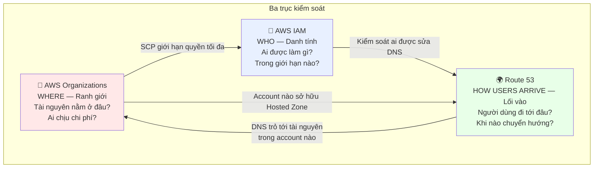
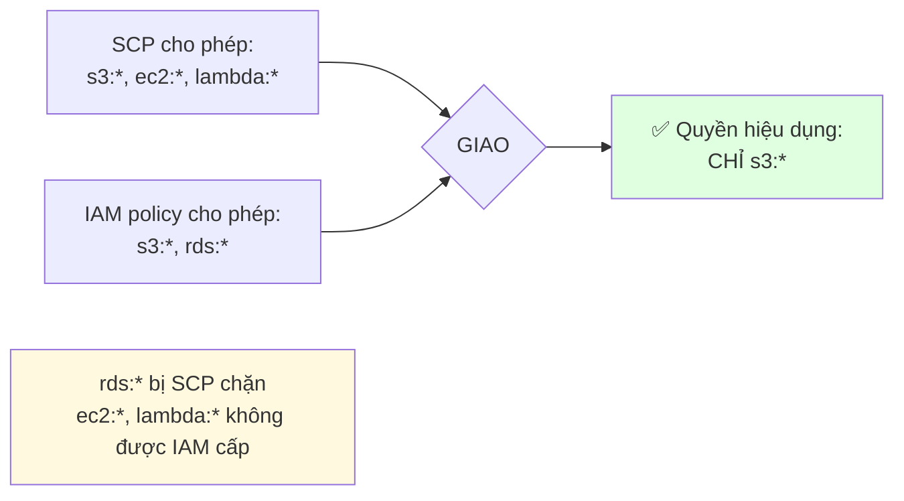
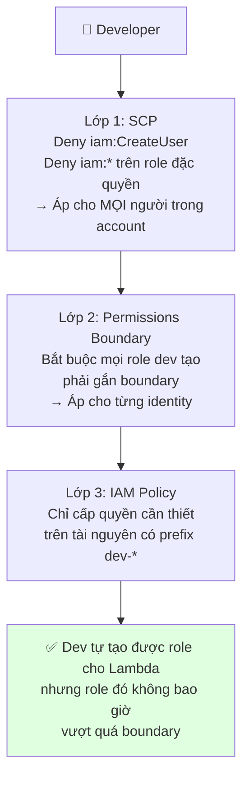
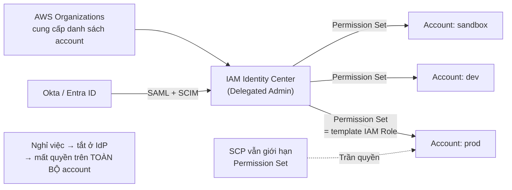
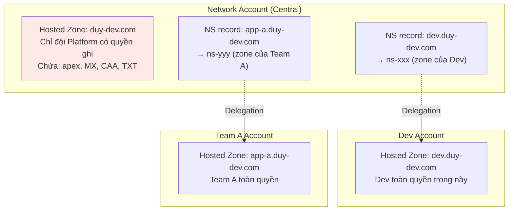
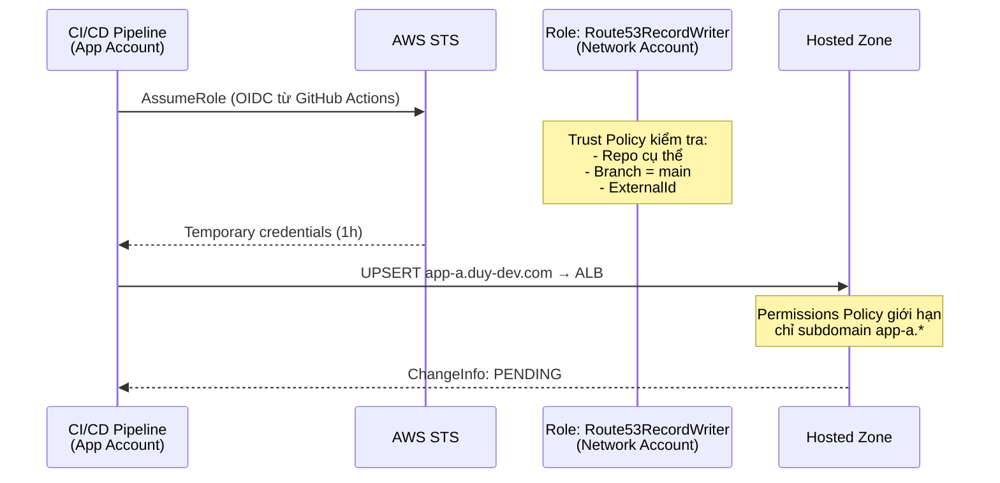
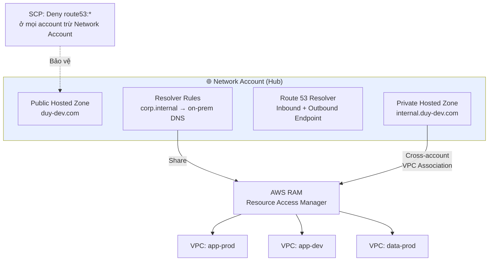
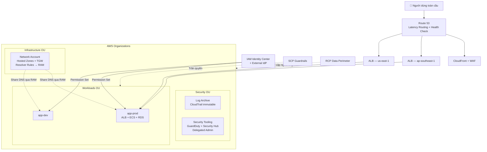
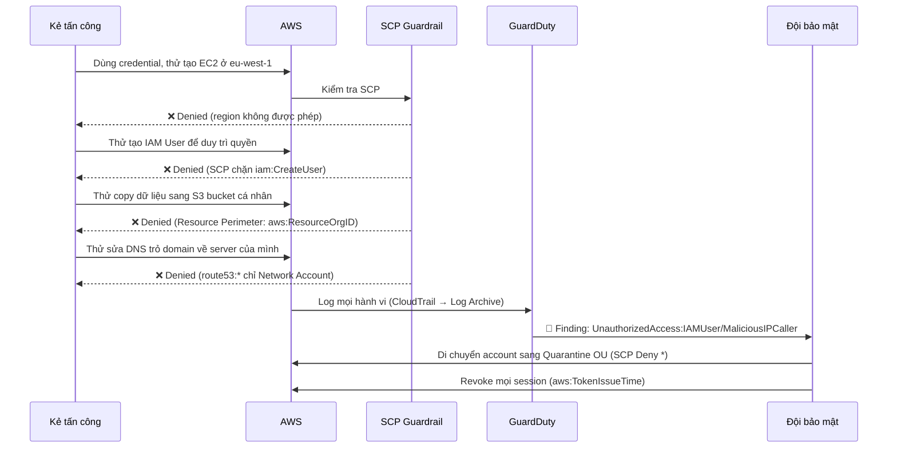

# Phân tích Tích hợp: Route 53 + IAM + AWS Organizations

> **Ba dịch vụ, một câu chuyện.** Tài liệu này không lặp lại lý thuyết của từng dịch vụ — nó phân tích **cách ba dịch vụ này giao nhau** trong kiến trúc thực tế, và những vấn đề chỉ xuất hiện khi chúng làm việc cùng nhau.
>
> Đọc trước: [Route 53 Deep Dive](../03_Networking/Amazon_Route53_DeepDive.md) · [IAM Deep Dive v2](../02_Security_Identity/IAM_DeepDive_v2.md) · [AWS Organizations Deep Dive](./AWS_Organizations_DeepDive.md)

---

## 1. Ba trục của một kiến trúc AWS trưởng thành



**Cách hiểu đơn giản:**

| Dịch vụ           | Câu hỏi nó trả lời                    | Nếu thiếu thì sao?                                                       |
| ----------------- | -------------------------------------- | ------------------------------------------------------------------------ |
| **Organizations** | *Ranh giới ở đâu?*                     | Một sai lầm ở Dev có thể phá hủy Production. Không biết team nào tốn tiền |
| **IAM**           | *Ai được làm gì?*                      | Ai cũng làm được mọi thứ, hoặc không ai làm được gì                      |
| **Route 53**      | *Người dùng đi vào bằng đường nào?*    | Hệ thống chạy tốt nhưng người dùng không tới được, hoặc tới nhầm chỗ     |

**Một sự thật ít được nhắc:** Ba dịch vụ này đều là **global service** (không thuộc region cụ thể) và đều có endpoint chính ở `us-east-1`. Chúng cùng nằm ở "tầng điều khiển" của AWS, khác biệt hoàn toàn với EC2/S3/RDS ở "tầng tài nguyên". Điều này có hệ quả thực tế: **SCP chặn region phải loại trừ cả ba** (`iam:*`, `organizations:*`, `route53:*`), nếu không bạn sẽ tự khóa mình khỏi chính công cụ kiểm soát của mình.

---

## 2. Điểm giao 1: Organizations ↔ IAM

### 2.1 SCP là "trần" của IAM — không phải "sàn"

Đây là quan hệ quan trọng nhất giữa hai dịch vụ:



**Ba hệ quả thực tế:**

1. **Debug Access Denied phải bắt đầu từ SCP, không phải IAM.** Đa số thời gian bị lãng phí vì kỹ sư soi IAM policy trong khi thủ phạm là một SCP ở OU cha mà họ không có quyền xem.
2. **Không thể "cấp quyền khẩn cấp" bằng cách gắn `AdministratorAccess`.** Nếu SCP chặn, admin cũng bó tay. Phải có **break-glass procedure** rõ ràng.
3. **SCP không thấy được từ trong account.** Member account không có quyền `organizations:DescribePolicy` mặc định. Nên cấp read-only quyền này cho đội platform để họ tự debug.

### 2.2 Ba lớp phòng thủ chống Privilege Escalation

Bài toán: cho phép developer tự chủ mà không để họ leo thang lên admin.



**Tại sao cần cả ba lớp?**

- Chỉ có IAM policy → dev sửa được policy của chính mình.
- Chỉ có Boundary → dev xóa boundary khỏi role rồi leo thang.
- **SCP là lớp duy nhất dev không thể chạm tới** (nó nằm ở Organization, ngoài tầm với của mọi principal trong account).

Cụ thể, SCP bắt buộc kèm với Permissions Boundary:

```json
{
  "Effect": "Deny",
  "Action": ["iam:CreateRole", "iam:PutRolePolicy", "iam:AttachRolePolicy"],
  "Resource": "*",
  "Condition": {
    "StringNotEquals": {
      "iam:PermissionsBoundary": "arn:aws:iam::*:policy/DevBoundary"
    }
  }
}
```

SCP này áp cho **toàn bộ account** — kể cả admin của account cũng không thể tạo role thiếu boundary. Đây là điều IAM policy đơn thuần không làm được.

### 2.3 IAM Identity Center — nơi hai dịch vụ hợp nhất



Identity Center **chỉ hoạt động khi có Organizations**. Nó dịch "user trong IdP" thành "IAM Role trong từng member account". SCP vẫn là trần quyền phía trên Permission Set — nghĩa là **bạn có ba lớp cùng lúc**: IdP group → Permission Set → SCP.

**Đây là mô hình đúng cho enterprise:** không còn IAM User, không còn access key dài hạn, offboarding một cú click.

---

## 3. Điểm giao 2: IAM ↔ Route 53

### 3.1 Ai được sửa DNS? — Rủi ro bị đánh giá thấp

DNS là **single point of failure có sức tàn phá cao nhất**. Xóa nhầm một record A ở zone apex làm sập toàn bộ website — và mất TTL giây/phút để phục hồi (thậm chí lâu hơn vì cache của resolver).

**Vấn đề với IAM và Route 53:** quyền Route 53 rất khó phân quyền chi tiết. `route53:ChangeResourceRecordSets` áp ở cấp **Hosted Zone**, không phải cấp **record**. Không có cách nào nói "user này chỉ được sửa `api.duy-dev.com`" bằng ARN thông thường.

**Giải pháp — dùng condition key đặc thù của Route 53:**

```json
{
  "Version": "2012-10-17",
  "Statement": [{
    "Effect": "Allow",
    "Action": "route53:ChangeResourceRecordSets",
    "Resource": "arn:aws:route53:::hostedzone/Z1234567890ABC",
    "Condition": {
      "ForAllValues:StringEquals": {
        "route53:ChangeResourceRecordSetsRecordTypes": ["A", "AAAA", "CNAME"],
        "route53:ChangeResourceRecordSetsActions": ["CREATE", "UPSERT"]
      },
      "ForAllValues:StringLike": {
        "route53:ChangeResourceRecordSetsNormalizedRecordNames": ["*.dev.duy-dev.com"]
      }
    }
  }]
}
```

**Ý nghĩa từng điều kiện:**

- `...RecordTypes` — chỉ cho phép sửa A/AAAA/CNAME. **Không được đụng vào NS, SOA, MX, CAA** — những record mà sửa sai sẽ mất domain hoặc mất email.
- `...Actions` — chỉ `CREATE` và `UPSERT`, **không có `DELETE`**. Dev tạo được record mới nhưng không xóa được record hiện có.
- `...NormalizedRecordNames` — chỉ trong subdomain `dev.duy-dev.com`. Zone apex và `api.` được bảo vệ.

> Đây là một trong những cấu hình IAM có tỷ lệ "lợi ích / công sức" cao nhất mà rất ít tổ chức áp dụng.

### 3.2 Subdomain Delegation — Phân quyền bằng kiến trúc

Khi condition key vẫn chưa đủ, giải pháp mạnh hơn là **tách hosted zone**:



**Lợi ích:**

- **Blast radius tự nhiên** — Team A xóa sạch zone của họ cũng không ảnh hưởng tới zone apex hay team khác.
- **Không cần IAM condition phức tạp** — mỗi team là admin trong hosted zone của họ, ranh giới là **account boundary**, thứ mạnh hơn nhiều so với IAM condition.
- **Audit rõ ràng** — CloudTrail của mỗi account chỉ chứa thay đổi DNS của team đó.

Đây chính là ví dụ điển hình của việc **dùng Organizations để giải quyết bài toán IAM**: khi phân quyền trong một account trở nên phức tạp, hãy tách account.

### 3.3 Cross-Account Route 53 với Terraform/CI-CD

Pattern phổ biến khi ứng dụng ở Account App cần tạo record trong zone ở Account Network:



**Trust Policy cho GitHub Actions OIDC (không cần access key):**

```json
{
  "Effect": "Allow",
  "Principal": { "Federated": "arn:aws:iam::222222222222:oidc-provider/token.actions.githubusercontent.com" },
  "Action": "sts:AssumeRoleWithWebIdentity",
  "Condition": {
    "StringEquals": {
      "token.actions.githubusercontent.com:aud": "sts.amazonaws.com",
      "token.actions.githubusercontent.com:sub": "repo:my-org/app-a:ref:refs/heads/main"
    }
  }
}
```

> **Điểm nhấn bảo mật:** `sub` khóa chặt tới đúng repo và đúng branch. Không có secret nào lưu trong GitHub. Nếu chỉ khóa tới `repo:my-org/*` thì bất kỳ repo nào trong org cũng deploy được — một lỗi cấu hình rất phổ biến.

---

## 4. Điểm giao 3: Organizations ↔ Route 53

### 4.1 Mô hình DNS tập trung cho Multi-Account



**Bốn quyết định thiết kế:**

1. **Một Network Account sở hữu toàn bộ DNS.** Không để mỗi team tạo hosted zone riêng cho cùng một domain — đó là công thức cho DNS conflict.
2. **Resolver Rules share qua AWS RAM cho toàn Organization.** Tạo rule một lần ở Network Account, mọi VPC trong Org đều dùng được. Không share thì mỗi account phải tự tạo Resolver Endpoint (~$90/tháng mỗi cặp ENI).
3. **Private Hosted Zone associate cross-account** với VPC ở account khác. Quy trình 2 bước: `CreateVPCAssociationAuthorization` ở account chứa zone → `AssociateVPCWithHostedZone` ở account chứa VPC.
4. **SCP bảo vệ:** `Deny route53:*` ở mọi account trừ Network Account — ngăn team tự tạo hosted zone trùng lặp gây phân giải sai.

```json
{
  "Sid": "OnlyNetworkAccountManagesDNS",
  "Effect": "Deny",
  "Action": [
    "route53:CreateHostedZone",
    "route53:DeleteHostedZone",
    "route53:ChangeResourceRecordSets",
    "route53domains:*"
  ],
  "Resource": "*",
  "Condition": {
    "ArnNotLike": {
      "aws:PrincipalArn": "arn:aws:iam::*:role/NetworkAdminRole"
    }
  }
}
```

> Áp SCP này ở **Workloads OU** (không phải Root) để Network Account trong Infrastructure OU vẫn hoạt động bình thường.

### 4.2 Chi phí — Góc nhìn Consolidated Billing

Route 53 là ví dụ hay về việc **Organizations giúp tối ưu chi phí một cách không hiển nhiên**:

| Tình huống                                        | Không có Organizations             | Có Organizations                                     |
| ------------------------------------------------- | ---------------------------------- | ---------------------------------------------------- |
| 20 team, mỗi team một hosted zone cho subdomain   | 20 × $0.50 = $10/tháng             | Tập trung: 1 zone chính + delegation → ~$3/tháng     |
| Resolver Endpoint cho hybrid DNS                  | Mỗi account 2 ENI = 20 × $90       | 1 cặp ENI share qua RAM = **$90 tổng**               |
| Query volume                                      | Mỗi account tính bậc riêng         | Gộp usage → lên bậc giá rẻ hơn                       |
| Health Check                                      | Trùng lặp giữa các team            | Tập trung, tái sử dụng qua Calculated Health Check   |

Riêng khoản Resolver Endpoint đã tiết kiệm **~$1,700/tháng** cho một tổ chức 20 account. Đây là loại tối ưu không thể có nếu không tập trung hóa qua Organizations + RAM.

---

## 5. Kịch bản tổng hợp: Từ zero tới production-ready

### Kiến trúc mục tiêu



### Checklist triển khai theo thứ tự

| # | Bước                                                                       | Dịch vụ chính           |
| - | -------------------------------------------------------------------------- | ----------------------- |
| 1 | Bật Organizations, dựng OU: Security / Infrastructure / Workloads / Sandbox | Organizations           |
| 2 | Tách Log Archive + Security Tooling account, CloudTrail org-wide + Object Lock | Organizations + IAM  |
| 3 | SCP nền tảng: chặn region (**nhớ loại trừ `route53:*`, `iam:*`**), bảo vệ CloudTrail | Organizations   |
| 4 | Triển khai IAM Identity Center, SCP `Deny iam:CreateUser`                  | IAM + Organizations     |
| 5 | Dựng Network Account, chuyển toàn bộ Hosted Zone về đây                    | Route 53 + Organizations|
| 6 | Share Resolver Rules qua RAM, associate Private Hosted Zone cross-account   | Route 53 + RAM          |
| 7 | SCP `Deny route53:*` ở Workloads OU                                        | Route 53 + Organizations|
| 8 | IAM condition key giới hạn record type/name cho team tự quản subdomain      | IAM + Route 53          |
| 9 | Permissions Boundary cho developer role, SCP bắt buộc boundary             | IAM + Organizations     |
| 10 | Route 53 Latency Routing + Health Check + Evaluate Target Health           | Route 53                |
| 11 | RCP Data Perimeter với `aws:PrincipalOrgID`                               | Organizations + IAM     |
| 12 | Toàn bộ quản lý bằng IaC, review qua Pull Request                          | Cả ba                   |

---

## 6. Kịch bản sự cố: Cách ba dịch vụ phối hợp khi có chuyện

### Tình huống: Credential của một developer bị lộ trên GitHub



**Điểm rút ra:** Không có lớp nào trong số này đơn lẻ ngăn được tấn công. Nhưng **kết hợp lại**, kẻ tấn công có credential hợp lệ vẫn không làm được gì đáng kể — mọi hướng leo thang đều bị SCP chặn, mọi hành vi đều được ghi lại ở nơi họ không xóa được, và việc cách ly chỉ là di chuyển account sang OU khác.

Đây chính là **defense in depth** đúng nghĩa: IAM là lớp cấp quyền, Organizations là lớp giới hạn không thể vượt qua, Route 53 được bảo vệ vì nó là "cửa chính" của toàn hệ thống.

---

## 7. Ma trận so sánh nhanh

| Câu hỏi                                       | Route 53                        | IAM                                | Organizations                     |
| --------------------------------------------- | ------------------------------- | ---------------------------------- | --------------------------------- |
| **Scope**                                     | Global                          | Global                             | Global                            |
| **Chi phí**                                   | Có (zone, query, health check)  | Miễn phí                           | Miễn phí                          |
| **Đơn vị kiểm soát**                          | Hosted Zone                     | Principal + Resource               | Account + OU                      |
| **Cơ chế "chặn" mạnh nhất**                   | Health Check unhealthy          | Explicit Deny                      | SCP / RCP                         |
| **Ai không bị nó kiểm soát**                  | Người dùng dùng IP trực tiếp    | Root Management Account            | Management Account (với SCP)      |
| **Lỗi cấu hình tệ nhất**                      | Xóa record apex / DNSSEC hỏng   | `NotAction` + `Allow`              | SCP chặn region không loại trừ global service |
| **Thời gian phục hồi sau lỗi**                | Phút (phụ thuộc TTL)            | Tức thì                            | Tức thì (nếu chưa tự khóa mình)   |
| **Công cụ debug**                             | `dig`, Route 53 query logging   | Policy Simulator, `decode-authorization-message` | `describe-effective-policy` |

---

## 8. Mười điểm cần nhớ khi ba dịch vụ giao nhau

1. **Cả ba đều là global service** — SCP chặn region phải loại trừ `iam:*`, `organizations:*`, `route53:*`, `cloudfront:*`, `sts:*`.
2. **Debug Access Denied theo thứ tự:** SCP → Explicit Deny → Boundary → Resource Policy → Condition → Identity Policy.
3. **SCP là lớp duy nhất principal trong account không thể chạm tới** — dùng nó cho những gì tuyệt đối không được phép.
4. **Route 53 không phân quyền theo record ARN** — dùng condition key `route53:ChangeResourceRecordSetsRecordTypes/Actions/NormalizedRecordNames`.
5. **Khi IAM condition trở nên quá phức tạp, hãy tách account hoặc tách hosted zone.** Account boundary mạnh hơn mọi IAM policy.
6. **Tập trung DNS ở Network Account + share qua RAM** — tiết kiệm chi phí đáng kể và tránh DNS conflict.
7. **`aws:PrincipalOrgID` trong RCP** là câu lệnh có tỷ lệ lợi ích/công sức cao nhất trong toàn bộ AWS security.
8. **DNS failover vô nghĩa nếu dữ liệu chỉ ở một Region** — Route 53 phải đi kèm Aurora Global Database hoặc DynamoDB Global Tables.
9. **Identity Center chỉ hoạt động khi có Organizations** — và SCP vẫn là trần quyền phía trên Permission Set.
10. **Quản lý cả ba bằng IaC.** Thay đổi SCP, IAM policy và DNS record đều phải đi qua Pull Request — đây là ba thứ mà "sửa nhanh trên console" gây ra nhiều sự cố production nhất.

---

## 9. Liên kết kiến thức

| Tài liệu                                                                     | Nội dung                                          |
| ---------------------------------------------------------------------------- | ------------------------------------------------- |
| [Amazon Route 53 Deep Dive](../03_Networking/Amazon_Route53_DeepDive.md)     | Routing policies, Health Check, Resolver, ARC     |
| [IAM Deep Dive v2](../02_Security_Identity/IAM_DeepDive_v2.md)               | Policy evaluation, Boundary, ABAC, Identity Center|
| [AWS Organizations Deep Dive](./AWS_Organizations_DeepDive.md)               | Multi-account, SCP/RCP, Control Tower             |
| [Cloud Governance](./Cloud_Governance.md)                                    | Config, Security Hub, Tagging, FinOps             |
| [Edge Services](../03_Networking/Edge_services.md)                           | CloudFront, Global Accelerator                    |
| [Amazon VPC v2](../03_Networking/Amazon_VPC_v2.md)                           | Nền tảng mạng cho Private Hosted Zone             |
