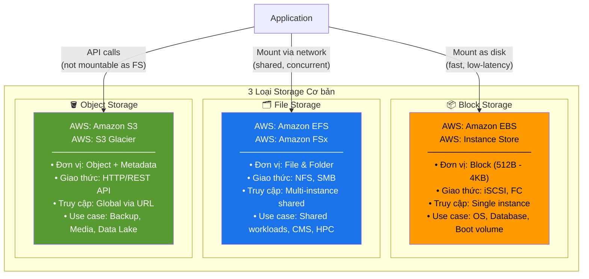
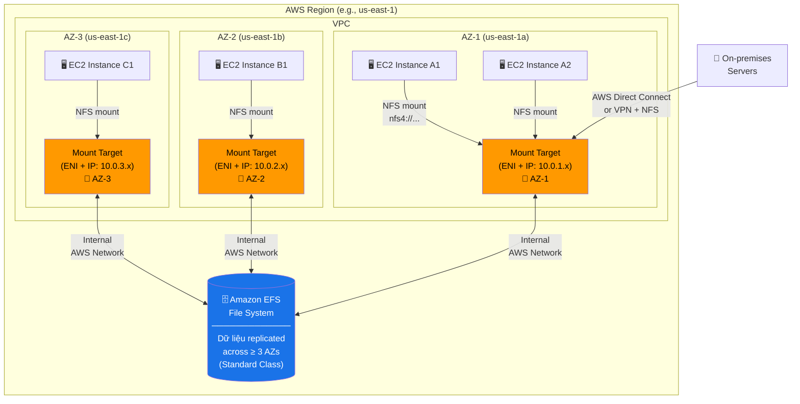
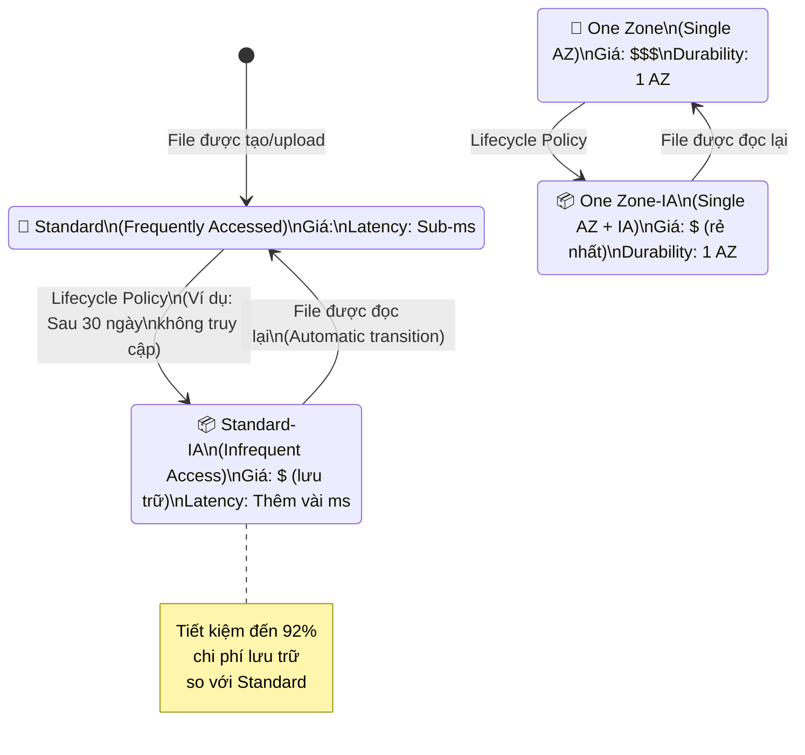
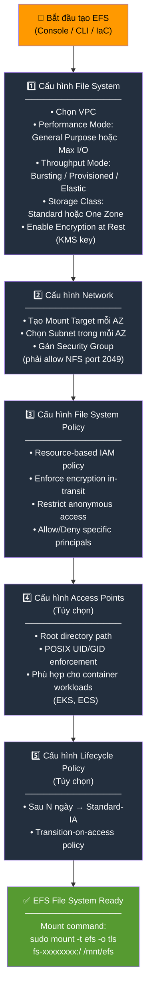
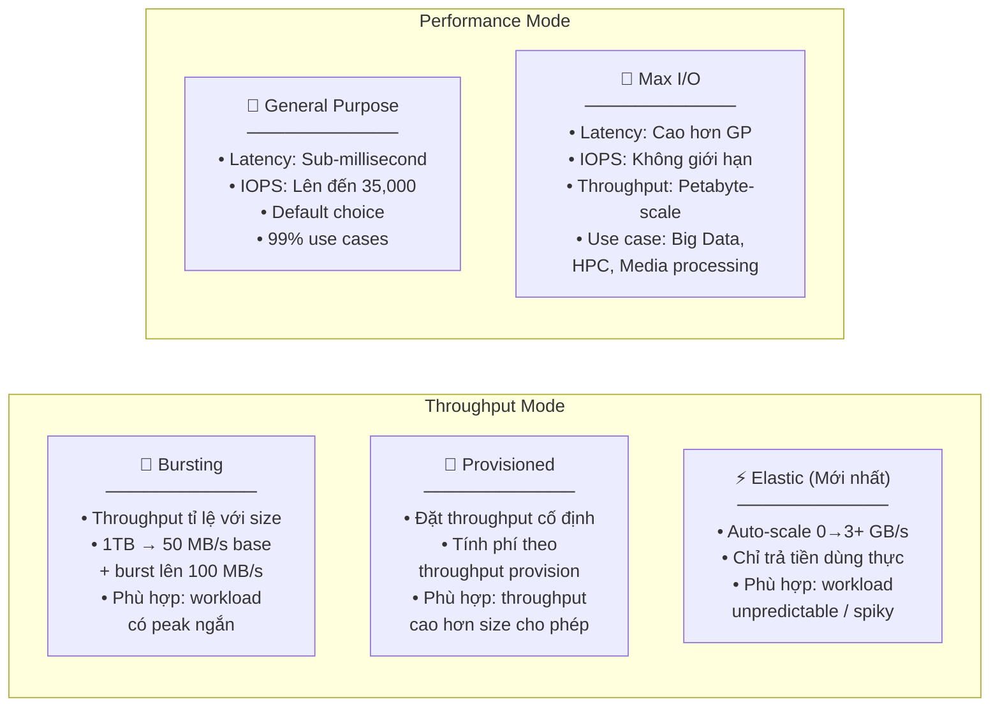
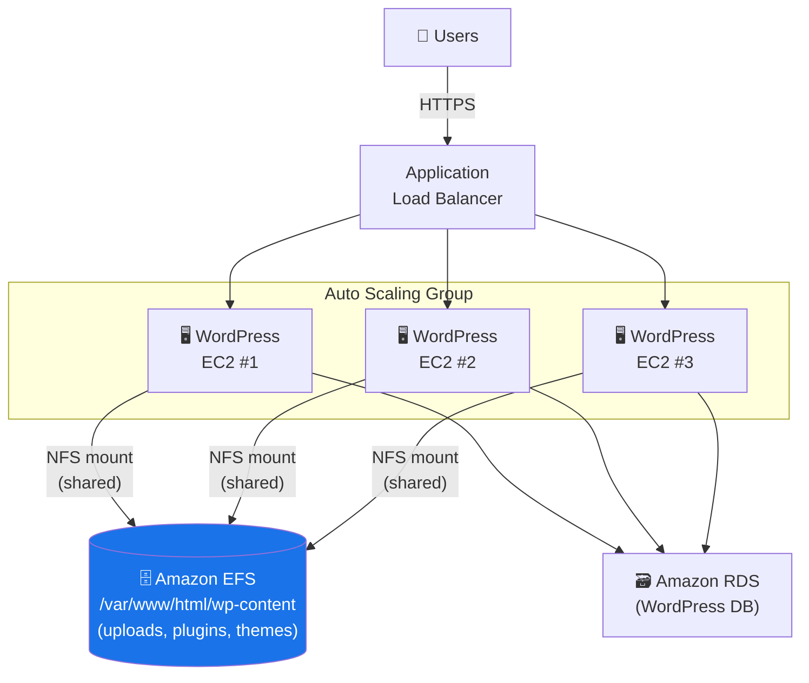

# Amazon Elastic File System (Amazon EFS)

> **Phạm vi:** Tài liệu này bao gồm toàn bộ nội dung Amazon EFS Primer — từ khái niệm file storage, kiến trúc EFS, tích hợp với AWS services, đến các use cases thực chiến. Được thiết kế cho Cloud Architects, Storage Administrators, Application Developers và Data Scientists.

---

## 1. Overview & The "Why"

### Định nghĩa

**Amazon Elastic File System (Amazon EFS)** là dịch vụ file storage **serverless, fully managed, elastic** được thiết kế cho các workload trên AWS Cloud và môi trường on-premises. EFS cung cấp giao thức **NFS (Network File System)** tiêu chuẩn, cho phép hàng nghìn instance đồng thời truy cập cùng một file system với **throughput tự động co giãn theo nhu cầu** — từ vài KB/s đến hàng chục GB/s.

### Vấn đề thực tế cần giải quyết

Trước khi có EFS, các ứng dụng cần shared file storage trên AWS phải đối mặt với các vấn đề nan giải:

- **Capacity planning sai:** Phải đoán trước dung lượng cần dùng — quá lớn thì lãng phí tiền, quá nhỏ thì ứng dụng bị crash khi đầy disk.
- **Shared access phức tạp:** `EBS` (Elastic Block Store) chỉ gắn được vào **một EC2 instance tại một thời điểm** — không chia sẻ được giữa nhiều server.
- **Quản lý hạ tầng nặng nề:** Self-managed NFS server đòi hỏi patching, scaling, backup thủ công — tốn kém nhân lực.
- **Không tự động co giãn:** Storage truyền thống yêu cầu downtime hoặc migration khi cần mở rộng.

**EFS giải quyết tất cả:** Tự động grow/shrink theo từng file, không cần provision, hỗ trợ concurrent access từ hàng nghìn clients, và AWS quản lý toàn bộ hạ tầng phía dưới.

### Analogy

> **Hãy tưởng tượng EFS như một kho tài liệu dùng chung tại văn phòng — nhưng thông minh hơn nhiều.**
>
> - **EBS** = Tủ hồ sơ cá nhân khóa riêng — chỉ một người dùng được, phải mua tủ đủ lớn từ đầu.
> - **S3** = Kho lưu trữ thùng carton — cất đồ lâu dài, rẻ, nhưng phải "đặt hàng trước" mỗi lần lấy (không mount được như ổ đĩa).
> - **EFS** = Kệ tài liệu chia sẻ mở ở giữa văn phòng — **ai cũng vào lấy được ngay**, kệ tự động thêm ngăn khi đầy và bớt ngăn khi trống, bạn chỉ trả tiền cho số tài liệu đang cất, không phải cho toàn bộ kệ.

---

## 2. Core Components & Keywords

| Từ khóa | Bản chất |
|---|---|
| **NFS (Network File System)** | Giao thức chuẩn Linux/Unix cho phép mount file system qua mạng. EFS dùng NFSv4.0 và NFSv4.1. |
| **Mount Target** | Endpoint mạng (có địa chỉ IP) được tạo trong mỗi AZ để EC2 trong AZ đó kết nối vào EFS. |
| **Access Point** | Entry point ứng dụng cụ thể vào EFS, cho phép enforce POSIX user/group identity và root directory. |
| **Storage Class** | Phân tầng lưu trữ: `Standard`, `Standard-IA`, `One Zone`, `One Zone-IA` — tối ưu chi phí. |
| **Lifecycle Policy** | Quy tắc tự động di chuyển file sang Infrequent Access (IA) tier sau N ngày không truy cập. |
| **Throughput Mode** | Cách EFS tính throughput: `Bursting` (theo size), `Provisioned` (đặt cố định), `Elastic` (auto-scale). |
| **Performance Mode** | `General Purpose` (latency thấp) vs `Max I/O` (throughput cao, latency cao hơn). |
| **EFS File Sync / DataSync** | Dịch vụ di chuyển file từ on-premises hoặc S3 vào EFS nhanh chóng. |
| **POSIX Permissions** | Hệ thống phân quyền Unix tiêu chuẩn (user/group/other + rwx) — EFS hỗ trợ đầy đủ. |
| **Elastic Throughput** | Mode mới nhất — throughput tự động scale từ vài MB/s đến GB/s theo workload thực tế, không cần cấu hình. |
| **Infrequent Access (IA)** | Storage tier cho file ít được truy cập — rẻ hơn tới 92% so với Standard, truy cập có thêm phí. |
| **One Zone Storage** | EFS lưu dữ liệu trong **một AZ duy nhất** — rẻ hơn ~47%, phù hợp dev/test hoặc workload chịu được AZ failure. |

---

## 3. Visual Theory & Architecture

### 3.1 Phân loại Storage: Block vs Object vs File



**Giải thích sơ đồ:** Ba loại storage phục vụ các nhu cầu khác nhau và **không thay thế lẫn nhau**:
- **Block Storage (EBS):** Nhanh nhất, latency thấp nhất, nhưng chỉ một instance attach được — lý tưởng cho database và OS.
- **File Storage (EFS):** Nhiều instance cùng mount và đọc/ghi đồng thời qua giao thức NFS — lý tưởng cho workload chia sẻ.
- **Object Storage (S3):** Không mount được như ổ đĩa, truy cập qua API — lý tưởng cho lưu trữ quy mô petabyte.

---

### 3.2 Kiến trúc EFS: Multi-AZ với Mount Targets



**Giải thích sơ đồ:**
1. **EFS File System** là thực thể trung tâm — dữ liệu được tự động replicate qua **ít nhất 3 Availability Zones** (với Standard class), đảm bảo durability 99.999999999% (11 nines).
2. **Mount Target** là "cổng vào" EFS trong mỗi AZ — mỗi AZ cần một Mount Target riêng với địa chỉ IP thuộc subnet của AZ đó.
3. **EC2 instances** trong mỗi AZ mount vào Mount Target **gần nhất** (cùng AZ) để tối ưu latency — không nên mount qua AZ khác.
4. **On-premises servers** có thể mount EFS qua Direct Connect hoặc VPN — mở rộng shared storage ra ngoài Cloud.

---

### 3.3 EFS Storage Classes & Lifecycle Management



**Giải thích sơ đồ:**
1. File mới tạo mặc định vào **Standard** (hoặc **One Zone** nếu chọn One Zone file system).
2. **Lifecycle Policy** tự động chuyển file sang tier `IA` (Infrequent Access) sau số ngày cấu hình (7, 14, 30, 60, 90 ngày).
3. Khi file trong IA tier được truy cập, EFS **tự động chuyển ngược** về Standard tier (có thể cấu hình `transition-on-access` behavior).
4. **One Zone** vs **Standard**: Chọn Standard để có high availability (≥3 AZs), chọn One Zone cho dev/test hoặc workload không cần multi-AZ durability — rẻ hơn ~47%.

---

### 3.4 Vòng đời tạo EFS File System



**Giải thích sơ đồ:** Quy trình tạo EFS đi qua 5 bước tuần tự. Quan trọng nhất là **bước 2 (Network)** — Security Group gán cho Mount Target phải có **inbound rule cho TCP port 2049** từ Security Group của các EC2 instance muốn kết nối. Thiếu rule này là lỗi phổ biến nhất khi mount thất bại.

---

### 3.5 EFS Performance Modes so sánh



> **Lưu ý quan trọng:** **Elastic Throughput** là lựa chọn khuyến nghị cho hầu hết workload mới vì không cần capacity planning và tối ưu chi phí. `Max I/O` mode chỉ dùng khi workload yêu cầu throughput cực cao và chấp nhận latency cao hơn.

---

## 4. Detailed Deep Dive

### 4.1 EFS vs Các Dịch vụ Storage AWS Khác

| Tiêu chí | Amazon EFS | Amazon EBS | Amazon S3 | Amazon FSx |
|---|---|---|---|---|
| **Loại Storage** | File (NFS) | Block | Object | File (NFS/SMB/Lustre) |
| **Giao thức** | NFSv4 | iSCSI | REST API | NFS / SMB / Lustre / OpenZFS |
| **Concurrent Access** | ✅ Hàng nghìn clients | ❌ 1 instance (Multi-Attach limited) | ✅ Không giới hạn | ✅ Nhiều clients |
| **Elasticity** | ✅ Auto grow/shrink | ❌ Phải resize thủ công | ✅ Unlimited | ✅ (tùy loại) |
| **OS Support** | Linux only | Linux + Windows | Any (API) | Linux + Windows (tùy loại) |
| **Serverless** | ✅ Fully managed | ❌ Cần attach/manage | ✅ Fully managed | ✅ Fully managed |
| **Use case chính** | Shared Linux workloads | DB, OS boot volume | Backup, archive, data lake | Windows shares, HPC, Lustre |
| **Pricing model** | Per GB stored + access | Per GB provisioned | Per GB stored + requests | Per GB provisioned |

### 4.2 Amazon FSx — Khi nào dùng thay EFS?

**Amazon FSx** là họ file system managed services hỗ trợ nhiều giao thức khác nhau:

| Amazon FSx For | Giao thức | Best For |
|---|---|---|
| **FSx for Windows File Server** | SMB (Windows) | Windows workloads, Active Directory, .NET apps |
| **FSx for Lustre** | Lustre (HPC) | Machine learning, HPC, video rendering — tích hợp S3 |
| **FSx for NetApp ONTAP** | NFS, SMB, iSCSI | Multi-protocol, tiering, SnapMirror replication |
| **FSx for OpenZFS** | NFS, OpenZFS | Migrate from on-prem ZFS, low-latency NFS |

> **Quy tắc lựa chọn:** Nếu workload Linux và cần **shared NFS đơn giản, elastic, serverless** → dùng **EFS**. Nếu cần **Windows shares (SMB)** → FSx for Windows. Nếu cần **HPC/ML throughput cực cao** → FSx for Lustre.

---

### 4.3 EFS Security — Nhiều lớp bảo vệ

#### 4.3.1 Encryption

| Loại | Cơ chế | Ghi chú |
|---|---|---|
| **Encryption at Rest** | AWS KMS (AES-256) | Bật khi tạo FS, không thể bật sau khi tạo |
| **Encryption in Transit** | TLS 1.2 | Bật bằng tham số `-o tls` khi mount |

#### 4.3.2 Access Control — 3 lớp

```
Lớp 1: IAM Policy
    └── Kiểm soát: Ai có thể mount? Ai có thể tạo/xóa FS?
    └── Actions: elasticfilesystem:ClientMount, elasticfilesystem:ClientWrite

Lớp 2: EFS Resource Policy (File System Policy)
    └── Resource-based policy đính kèm trực tiếp vào FS
    └── Ví dụ: "Chỉ cho phép mount với TLS", "Chỉ cho phép access qua Access Point"

Lớp 3: POSIX Permissions + Access Points
    └── Sau khi mount: Linux user/group permissions (chmod, chown)
    └── Access Points: enforce UID/GID cụ thể cho từng ứng dụng
```

#### 4.3.3 Network Security

- **Security Groups** gán cho **Mount Target**: phải cho phép TCP port `2049` (NFS) inbound từ Security Group của EC2.
- Không expose Mount Target ra public internet — chỉ truy cập từ trong VPC hoặc qua Direct Connect/VPN.

---

### 4.4 EFS với AWS Lambda

Lambda có thể mount EFS file system — đây là tính năng đặc biệt cho phép Lambda functions:
- Đọc/ghi file lớn hơn giới hạn `/tmp` (512MB → 10GB).
- **Chia sẻ dữ liệu** giữa nhiều Lambda invocations đồng thời (warm cache, shared model files).
- Triển khai ML model lớn (vài GB) mà không cần đóng gói vào deployment package.

**Yêu cầu:**
- Lambda phải chạy trong **VPC** (cùng VPC với EFS Mount Target).
- Lambda execution role cần permission `elasticfilesystem:ClientMount`.
- Cấu hình `mountPoints` trong Lambda function settings.

---

### 4.5 EFS với Container Services (ECS & EKS)

```
ECS Task / EKS Pod
    └── Volume Mount: /data → EFS Access Point
        └── EFS Access Point (enforce UID 1000, GID 1000, root path /app-data)
            └── EFS File System (shared across all tasks/pods)
```

**Lợi ích trong container workloads:**
- **Stateful containers** có thể lưu trữ persistent data mà không gắn kết với node cụ thể.
- Khi container khởi động lại hoặc di chuyển sang node khác → data vẫn còn nguyên.
- **Access Points** giúp cô lập data giữa các ứng dụng khác nhau trên cùng EFS.

---

### 4.6 EFS DataSync — Di chuyển dữ liệu vào EFS

**AWS DataSync** là dịch vụ chuyên dụng để migrate và sync dữ liệu vào/ra EFS:

| Tính năng | Chi tiết |
|---|---|
| **Tốc độ** | Nhanh hơn công cụ open-source (rsync) đến 10 lần |
| **Nguồn hỗ trợ** | NFS (on-premises), SMB, HDFS, S3, FSx, EFS khác |
| **Integrity check** | Tự động verify checksum sau khi transfer |
| **Scheduling** | Chạy theo lịch (hourly, daily) để sync liên tục |
| **Agent** | Cài DataSync Agent on-premises (VMware/EC2) kết nối về AWS |

---

## 5. Practical Scenarios & Integration

### Scenario 1: WordPress CMS trên Auto Scaling Group — Shared Media Storage

**Bài toán:** Một website WordPress chạy trên Auto Scaling Group với nhiều EC2 instances. Khi user upload ảnh, file cần accessible từ **tất cả instances** đồng thời (không chỉ instance đã nhận upload).

**Kiến trúc giải pháp:**



**Lợi ích:**
- Mọi instance đều thấy file upload ngay lập tức — không cần sync.
- Auto Scaling thêm instances mới sẽ tự động mount EFS và có đầy đủ media files.
- Tách biệt storage khỏi compute — scale độc lập.

**Infrastructure as Code (Terraform):**

```hcl
# EFS File System
resource "aws_efs_file_system" "wordpress" {
  creation_token   = "wordpress-shared-storage"
  performance_mode = "generalPurpose"
  throughput_mode  = "elastic"
  encrypted        = true
  kms_key_id       = aws_kms_key.efs.arn

  lifecycle_policy {
    transition_to_ia = "AFTER_30_DAYS"
  }

  lifecycle_policy {
    transition_to_primary_storage_class = "AFTER_1_ACCESS"
  }

  tags = {
    Name        = "wordpress-efs"
    Environment = "production"
  }
}

# Mount Target mỗi AZ
resource "aws_efs_mount_target" "wordpress" {
  for_each = toset(var.subnet_ids)

  file_system_id  = aws_efs_file_system.wordpress.id
  subnet_id       = each.value
  security_groups = [aws_security_group.efs_sg.id]
}

# Security Group cho Mount Target (cho phép NFS từ EC2 SG)
resource "aws_security_group" "efs_sg" {
  name   = "efs-mount-target-sg"
  vpc_id = var.vpc_id

  ingress {
    from_port       = 2049
    to_port         = 2049
    protocol        = "tcp"
    security_groups = [aws_security_group.wordpress_ec2_sg.id]
  }
}

# EFS File System Policy (Enforce TLS)
resource "aws_efs_file_system_policy" "wordpress" {
  file_system_id = aws_efs_file_system.wordpress.id

  policy = jsonencode({
    Version = "2012-10-17"
    Statement = [{
      Effect    = "Deny"
      Principal = { AWS = "*" }
      Action    = "*"
      Resource  = aws_efs_file_system.wordpress.arn
      Condition = {
        Bool = { "aws:SecureTransport" = "false" }
      }
    }]
  })
}
```

---

### Scenario 2: Machine Learning Training Pipeline — Shared Dataset Storage

**Bài toán:** Data science team cần nhiều EC2 instances (GPU instances) đồng thời đọc cùng một dataset lớn (500GB) để huấn luyện ML model theo cách phân tán. Dataset được cập nhật định kỳ từ S3.

**Kiến trúc giải pháp:**

```
[Data Pipeline]
S3 (raw data) → AWS DataSync → EFS (training-data/)
                                        │
                    ┌───────────────────┼───────────────────┐
                    ▼                   ▼                   ▼
           EC2 p3.8xlarge      EC2 p3.8xlarge      EC2 p3.8xlarge
           (GPU Training #1)   (GPU Training #2)   (GPU Training #3)
                    │                   │                   │
                    └───────────────────┴───────────────────┘
                                   Mount: /mnt/dataset (read-only)
                                   Mount: /mnt/checkpoints (read-write, per-instance via Access Points)

[Access Points]
├── /dataset        → Read-only, UID: 0 (all instances share)
├── /checkpoints/1  → Read-write, UID: 1001 (instance 1 only)
├── /checkpoints/2  → Read-write, UID: 1002 (instance 2 only)
└── /results        → Read-write (shared, final model output)
```

**Kết quả:** Tất cả GPU instances đọc dataset đồng thời qua EFS — không cần copy dataset vào từng instance (tiết kiệm hàng giờ setup time). DataSync sync dữ liệu mới từ S3 vào EFS theo lịch hàng ngày.

---

### Scenario 3: Serverless Data Processing với AWS Lambda

**Bài toán:** Lambda function cần xử lý video files lớn (vài GB) — vượt quá giới hạn `/tmp` của Lambda (512MB theo mặc định).

**Giải pháp:**
1. Video upload vào S3 → trigger Lambda.
2. Lambda mount EFS (qua Access Point `/processing`).
3. Lambda download video từ S3 vào `/mnt/efs/processing/`.
4. Xử lý video (transcode, thumbnail, analysis).
5. Upload kết quả lên S3, xóa file tạm trên EFS.

```python
# Lambda handler với EFS mount tại /mnt/efs
import boto3, subprocess, os

def handler(event, context):
    s3_key = event['Records'][0]['s3']['object']['key']
    local_path = f"/mnt/efs/processing/{os.path.basename(s3_key)}"
    output_path = f"/mnt/efs/output/{os.path.basename(s3_key)}"

    # Download từ S3 vào EFS
    s3 = boto3.client('s3')
    s3.download_file('my-bucket', s3_key, local_path)

    # Xử lý (ví dụ: ffmpeg transcode)
    subprocess.run(['ffmpeg', '-i', local_path, output_path])

    # Upload kết quả
    s3.upload_file(output_path, 'output-bucket', f"processed/{os.path.basename(s3_key)}")

    # Cleanup
    os.remove(local_path)
    os.remove(output_path)
```

---

## 6. Exam Essentials & Pro Tips

### 🎯 Các "bẫy" thường gặp trong kỳ thi

| Tình huống câu hỏi | Câu trả lời SAI | Câu trả lời ĐÚNG |
|---|---|---|
| Cần shared file storage cho **nhiều EC2 Linux** instances | Amazon EBS | **Amazon EFS** |
| Cần shared storage cho **Windows** workloads với **Active Directory** | Amazon EFS | **Amazon FSx for Windows File Server** |
| EFS mount **thất bại** từ EC2 | Kiểm tra IAM role | Kiểm tra **Security Group của Mount Target** (TCP 2049 có được allow không) |
| Muốn **bật encryption at rest** cho EFS đang dùng | Bật trong settings | **Không thể** — phải tạo FS mới với encryption bật từ đầu, migrate data |
| EFS **tốn phí cao** dù dữ liệu ít truy cập | Dùng S3 thay thế | Bật **Lifecycle Policy** để chuyển sang Standard-IA (tiết kiệm 92%) |
| Lambda cần xử lý file > 512MB | Tăng memory Lambda | Mount **Amazon EFS** vào Lambda (Lambda phải trong VPC) |
| Cần throughput cao cho **HPC/ML** không cần shared | Amazon EFS Max I/O | **Amazon FSx for Lustre** (tích hợp S3, throughput vượt trội) |
| **One Zone EFS** bị mất dữ liệu | Đây là bug | **By design** — One Zone chỉ lưu 1 AZ, nếu AZ fail thì mất data |

---

### 💡 Best Practices

#### Cost Optimization

- **Luôn bật Lifecycle Policy** — đặt `AFTER_30_DAYS` chuyển sang IA để tiết kiệm tới 92% chi phí lưu trữ cho file ít dùng.
- Dùng **One Zone storage** cho môi trường development và test — rẻ hơn 47% so với Standard.
- Chọn **Elastic Throughput mode** thay vì Provisioned cho workload không ổn định — tránh trả phí cho throughput không dùng.
- Monitor `StorageBytes` metric theo tier để biết tỷ lệ dữ liệu trong IA vs Standard, từ đó điều chỉnh lifecycle policy.

#### Security (IAM & Encryption)

- **Luôn bật Encryption at Rest** (KMS) khi tạo EFS — không thể bật sau.
- **Enforce TLS** bằng EFS File System Policy: `Deny` action khi `aws:SecureTransport = false`.
- Dùng **Access Points** thay vì mount root directory trong container workloads — cô lập data giữa các ứng dụng.
- Áp dụng **Least Privilege**: IAM policy chỉ grant `elasticfilesystem:ClientMount` (read-only) trừ khi cần write.
- Đặt Mount Target trong **private subnet** — không expose ra internet.

#### Performance

- Tạo **một Mount Target mỗi AZ** và mount EC2 vào Mount Target **cùng AZ** — giảm latency và tránh phí data transfer cross-AZ.
- Dùng **EFS mount helper** (`amazon-efs-utils`) thay vì `mount -t nfs4` thủ công — tự động handle TLS, retry logic, và CloudWatch metric push.
- **Parallel access** là điểm mạnh của EFS — thiết kế ứng dụng để nhiều workers đọc đồng thời thay vì sequential.
- Với workload HPC cần throughput cực cao và latency sub-ms nhất quán → cân nhắc **FSx for Lustre**.

---

### 📋 Bảng quyết định nhanh: Chọn Storage Service nào?

| Yêu cầu | Dịch vụ |
|---|---|
| Shared file storage, Linux, nhiều instances | **Amazon EFS** |
| Single-instance, low-latency, database/OS | **Amazon EBS** |
| Large-scale archive, backup, data lake | **Amazon S3** |
| Windows file shares, Active Directory | **Amazon FSx for Windows** |
| HPC, ML training, tích hợp S3 | **Amazon FSx for Lustre** |
| Multi-protocol (NFS+SMB+iSCSI), enterprise features | **Amazon FSx for NetApp ONTAP** |
| Migrate on-premises file data vào EFS | **AWS DataSync** |
| Lambda cần xử lý file lớn hơn 10GB | **EFS + Lambda trong VPC** |

> **Quy tắc vàng cho kỳ thi:** Mỗi khi đề bài có từ **"shared"**, **"concurrent"**, **"multiple EC2"**, và **"Linux"** → đáp án gần như chắc chắn là **Amazon EFS**. Nếu thêm từ **"Windows"** hoặc **"SMB"** → chuyển sang **FSx for Windows File Server**.