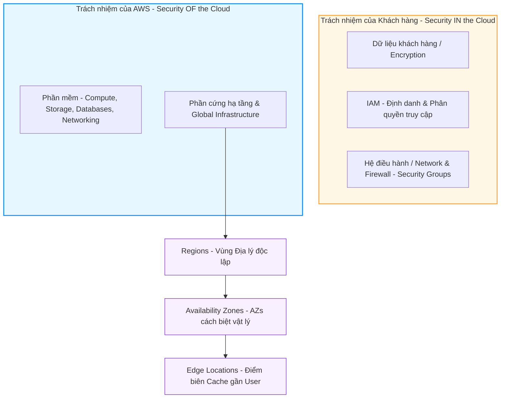

# 🏛️ Phase 1: Foundations & Core Concepts (Nền tảng & Khái niệm cốt lõi)

Mọi kiến trúc AWS bền vững đều được xây dựng trên một nền tảng lý thuyết vững chắc. Phase này phân tích sâu mối liên kết giữa các khái niệm cốt lõi: **Cloud Computing Model**, **AWS Global Infrastructure**, **Shared Responsibility Model**, và **AWS Well-Architected Framework**.

---

## 🏛️ Sơ đồ Phân chia Trách nhiệm & Hạ tầng toàn cầu

---

## 🔍 Phân tích chi tiết mối quan hệ giữa các khái niệm

### 1. Mô hình Điện toán Đám mây (IaaS vs PaaS vs SaaS) và Shared Responsibility Model
Mức độ quản lý hạ tầng của bạn phụ thuộc trực tiếp vào mô hình dịch vụ đám mây được chọn:
- **IaaS (Infrastructure as a Service - ví dụ: EC2):** Bạn chịu trách nhiệm cấu hình từ Hệ điều hành (OS updates), cấu hình tường lửa mạng (Security Groups, NACLs) đến quản lý dữ liệu. AWS chỉ chịu trách nhiệm về lớp hypervisor ảo hóa và phần cứng vật lý bên dưới.
- **PaaS (Platform as a Service - ví dụ: RDS, Elastic Beanstalk):** AWS đảm nhận việc vá lỗi OS, quản lý sao lưu (backups) và tự động thay thế phần cứng lỗi. Trách nhiệm của bạn giảm xuống chỉ còn cấu hình tham số database, quản lý quyền truy cập và dữ liệu.
- **SaaS (Software as a Service - ví dụ: Amazon Bedrock - API-only):** AWS chịu trách nhiệm gần như toàn bộ ứng dụng và hạ tầng. Bạn chỉ quản lý input/output dữ liệu và phân quyền gọi API qua IAM.

### 2. Sự phối hợp của Hạ tầng toàn cầu (Global Infrastructure) để đảm bảo High Availability (HA)
- **Vùng (Region) và Vùng khả dụng (Availability Zone - AZ):** 
  - Một Region bao gồm nhiều AZ cách độc lập về mặt địa lý, sử dụng nguồn điện, mạng, và làm mát riêng biệt để tránh rủi ro thiên tai diện rộng.
  - Các AZ được nối với nhau qua đường truyền quang học tốc độ cao với độ trễ siêu thấp.
  - **Mối liên hệ thực tế:** Để thiết kế hệ thống chịu lỗi cao (Fault-tolerant), các ứng dụng (chạy trên EC2) và Database (như RDS Multi-AZ) phải được triển khai đồng thời trên tối thiểu **2 AZ** khác nhau trong cùng 1 Region.
- **Điểm biên (Edge Location):**
  - Nằm tách biệt với các Region, phân bố khắp thế giới gần với người dùng cuối nhất.
  - **Mối liên hệ thực tế:** CloudFront CDN lưu trữ bộ nhớ đệm (cache) tại Edge Locations để phục vụ nội dung tĩnh trực tiếp từ đây, giảm thiểu request phải đi xuyên lục địa về Region gốc (Origin).

### 3. Áp dụng AWS Well-Architected Framework vào thiết kế thực tế
6 trụ cột cốt lõi hướng dẫn việc đưa ra quyết định kiến trúc:
1. **Operational Excellence (Vận hành xuất sắc):** Thực hiện hạ tầng dưới dạng code (IaC với CloudFormation/CDK) để tự động hóa và giám sát liên tục với CloudWatch.
2. **Security (Bảo mật):** Phân quyền tối thiểu với IAM và mã hóa dữ liệu ở mọi trạng thái (KMS mã hóa S3/RDS).
3. **Reliability (Độ tin cậy):** Thiết kế hệ thống tự động hồi phục khi gặp sự cố (ASG tự động thay thế EC2 lỗi, RDS tự failover).
4. **Performance Efficiency (Hiệu năng):** Sử dụng các dịch vụ serverless (Lambda, Fargate) để tự động thích ứng với nhu cầu tính toán.
5. **Cost Optimization (Tối ưu chi phí):** Sử dụng AWS Cost Explorer, cấu hình Auto Scaling để giảm tài nguyên thừa, chọn đúng loại EC2 (Spot Instances vs On-Demand).
6. **Sustainability (Bền vững):** Tối ưu hóa hiệu suất ứng dụng để giảm thiểu lượng tài nguyên phần cứng vật lý tiêu thụ, giảm phát thải carbon.
