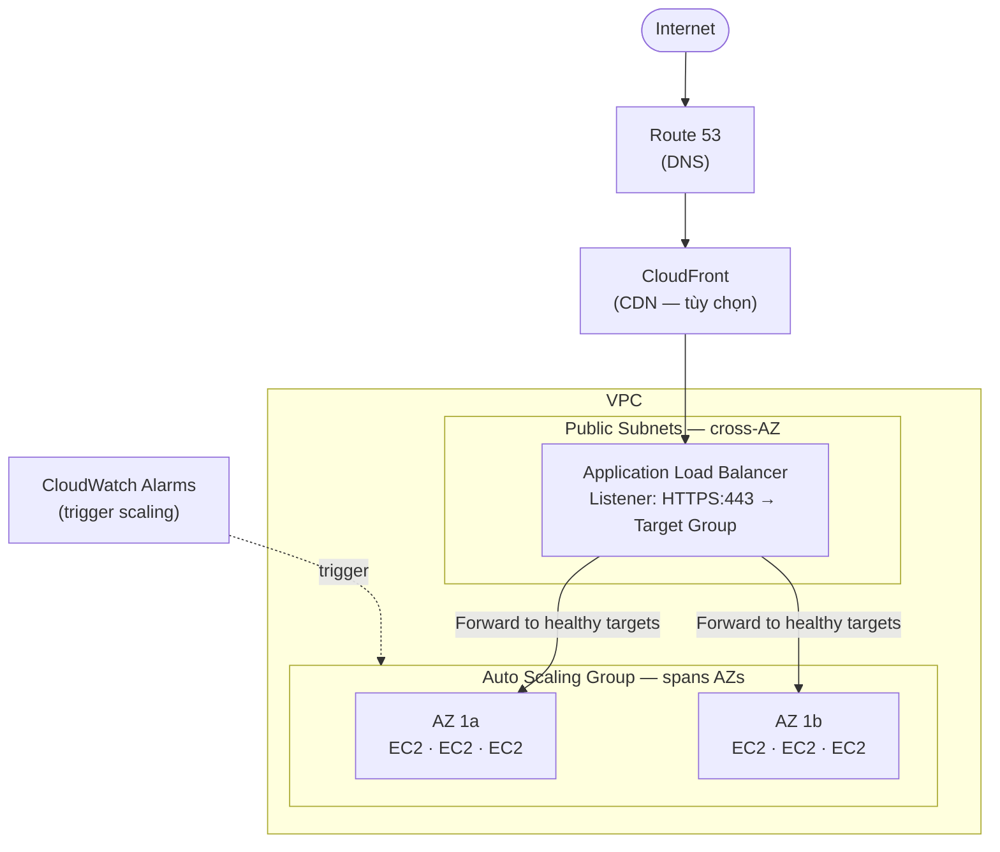
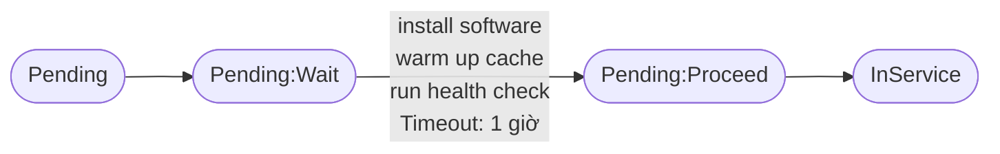
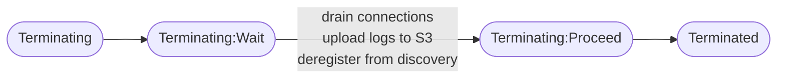
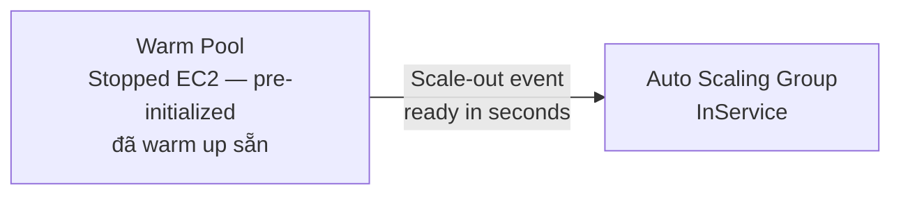
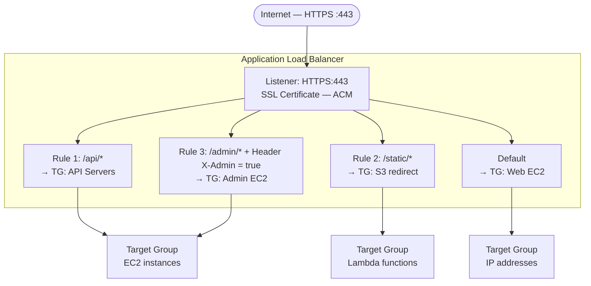
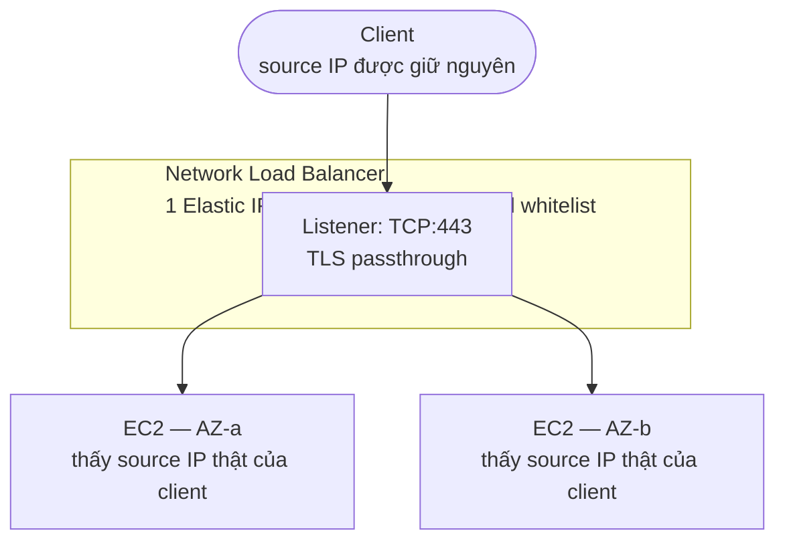
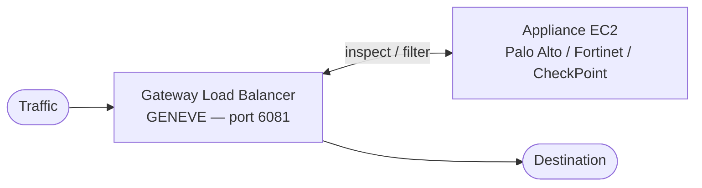
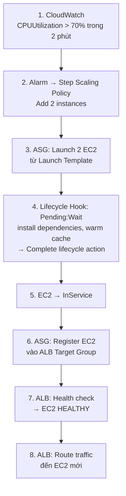
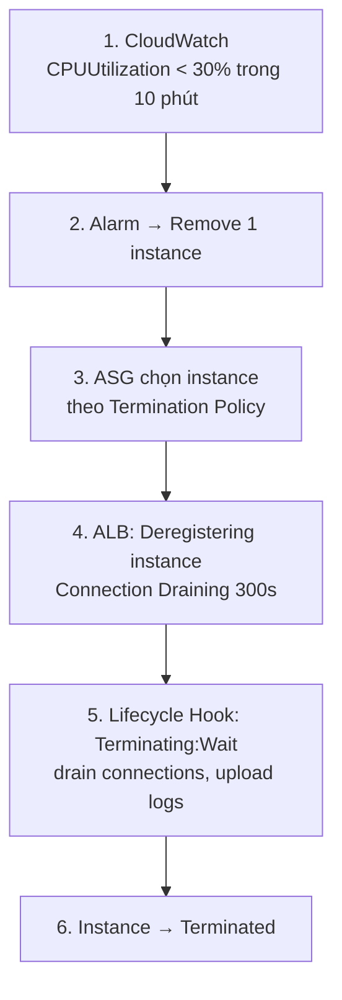

# Auto Scaling & Load Balancing — EC2 Scaling Ecosystem

> **ASG + ALB/NLB** là bộ đôi không thể tách rời trong mọi production architecture.  
> ASG quyết định **bao nhiêu** EC2 chạy; Load Balancer quyết định **traffic đi đâu**.

---

## 1. Big Picture — Luồng traffic hoàn chỉnh



---

## 2. Auto Scaling Group (ASG)

### 2.1 Cấu hình cốt lõi

```
ASG Configuration:
  ├── Launch Template (or Launch Config - legacy)
  │     ├── AMI ID
  │     ├── Instance Type (hoặc Instance Type Mix với Spot)
  │     ├── Key Pair, Security Groups
  │     ├── IAM Instance Profile
  │     ├── EBS Volumes
  │     └── User Data Script
  │
  ├── Min size: Số EC2 tối thiểu luôn chạy (e.g., 2)
  ├── Desired capacity: Số EC2 mong muốn hiện tại (e.g., 4)
  ├── Max size: Số EC2 tối đa (e.g., 10)
  │
  ├── VPC + Subnets (multi-AZ: ASG tự distribute đều)
  └── Load Balancer Target Group (để register EC2 vào)
```

### 2.2 Launch Template vs Launch Configuration

| | Launch Template | Launch Configuration |
|---|---|---|
| **Status** | Được khuyến nghị | Legacy, không nên dùng |
| **Versioning** | Có (v1, v2, v3...) | Không |
| **Spot + On-Demand mix** | Có | Không |
| **Multiple instance types** | Có | Không |
| **IMDSv2 support** | Có | Có |

### 2.3 Scaling Policies

```
4 loại Scaling Policy:

1. SIMPLE SCALING
   ─────────────
   CloudWatch Alarm: CPU > 70% → Add 2 instances
   CloudWatch Alarm: CPU < 30% → Remove 1 instance
   Cooldown period: 300 giây (không scale tiếp trong thời gian này)
   [Vấn đề: chậm, phản ứng theo bước cố định]

2. STEP SCALING
   ────────────
   CPU 70-80%: Add 1 instance
   CPU 80-90%: Add 2 instances
   CPU > 90%:  Add 3 instances
   [Tốt hơn Simple: phản ứng proportional với mức độ tải]

3. TARGET TRACKING SCALING ← Phổ biến nhất
   ─────────────────────────
   Target: Giữ CPU ở 50%
   ASG tự tính toán cần add/remove bao nhiêu instance
   Không cần định nghĩa alarm thủ công
   [Khuyến nghị: dễ dùng, phản ứng nhanh]

4. SCHEDULED SCALING
   ──────────────────
   8:00 AM Mon-Fri: Set min=10, desired=10 (giờ cao điểm)
   8:00 PM Mon-Fri: Set min=2, desired=2 (giờ thấp điểm)
   [Dùng khi traffic pattern có thể dự đoán]
```

### 2.4 Instance Refresh

Khi cần update Launch Template (AMI mới, user data mới):

```bash
# Khởi động rolling replacement
aws autoscaling start-instance-refresh \
  --auto-scaling-group-name my-asg \
  --preferences '{
    "MinHealthyPercentage": 90,
    "InstanceWarmup": 300
  }'
```

ASG sẽ dần thay thế các instance cũ bằng instance mới từ Launch Template mới nhất.

### 2.5 Lifecycle Hooks

**Launch lifecycle:**



**Terminate lifecycle:**



### 2.6 Warm Pools

> **Cold Start Problem:** EC2 mới boot → install → warm up → mất 5–10 phút.



> **Chi phí Warm Pool:** Chỉ tính EBS (EC2 ở trạng thái Stopped, không tính compute).

---

## 3. Application Load Balancer (ALB) — Layer 7

### 3.1 Kiến trúc ALB



### 3.2 Listener Rules

ALB có thể route dựa trên:
- **Path:** `/api/v2/*` vs `/web/*`
- **Host header:** `api.example.com` vs `app.example.com`
- **HTTP headers:** `X-Custom-Header: value`
- **HTTP method:** `GET`, `POST`
- **Query string:** `?platform=mobile`
- **Source IP:** CIDR ranges
- **Combination:** `AND` điều kiện

### 3.3 Target Groups

```
Target Group types:
  ├── Instances (EC2 instance ID)
  ├── IP addresses (on-premise servers via VPN/DX)
  ├── Lambda functions
  └── ALB (nested ALB)

Health Check config:
  ├── Protocol: HTTP/HTTPS
  ├── Path: /health
  ├── Port: traffic-port hoặc override
  ├── Healthy threshold: 2 lần liên tiếp OK
  ├── Unhealthy threshold: 3 lần liên tiếp FAIL
  └── Timeout/Interval: 5s timeout, 30s interval
```

### 3.4 Sticky Sessions (Session Affinity)

```
Sticky Sessions:
  User request 1 → ALB → EC2 A → Set cookie AWSALB
  User request 2 → ALB → reads AWSALB → route về EC2 A (sticky)
  
Types:
  ├── ALB-generated cookie (AWSALB): Managed by ALB
  └── Application-based cookie: App tự set cookie name
  
Cảnh báo: Sticky sessions làm mất cân bằng tải.
  Tốt nhất: Thiết kế stateless app + dùng ElastiCache cho sessions.
```

### 3.5 Connection Draining (Deregistration Delay)

```
Khi EC2 bị remove khỏi Target Group:
  
  IN FLIGHT REQUESTS ────►  EC2 (deregistering)
  NEW REQUESTS ──────────X  EC2 (đã remove khỏi rotation)
  
  Deregistration delay: 300 giây (default)
  → ALB tiếp tục route in-flight requests đến instance cũ
  → Sau 300 giây (hoặc khi xong): Terminate instance
  
  Giảm xuống 30-60 giây cho auto-scaling agility.
```

### 3.6 ALB Access Logs & Metrics

```
Access Logs (lưu vào S3):
  timestamp client:port target:port request elb_status_code ...

Key CloudWatch Metrics:
  ├── RequestCount: Số request/phút
  ├── TargetResponseTime: P50/P95/P99 latency
  ├── HTTPCode_ELB_5XX: ALB-generated errors
  ├── HTTPCode_Target_5XX: Backend errors  
  ├── HealthyHostCount: Số target healthy
  └── UnHealthyHostCount: Số target unhealthy
```

---

## 4. Network Load Balancer (NLB) — Layer 4

### 4.1 NLB vs ALB — Khi nào dùng gì?

| Tiêu chí | ALB (Layer 7) | NLB (Layer 4) |
|---|---|---|
| **Protocol** | HTTP, HTTPS, WebSocket | TCP, UDP, TLS, TCP_UDP |
| **Latency** | ~400ms | ~100μs (microseconds) |
| **Static IP** | Không (dùng DNS) | Có (1 Elastic IP/AZ) |
| **Source IP preservation** | X-Forwarded-For header | Native (thấy IP thật của client) |
| **SSL Termination** | Có | Có (TLS passthrough hoặc terminate) |
| **Sticky sessions** | Cookie-based | Source IP hash |
| **WebSocket** | Có | Có |
| **gRPC** | Có | Không native |
| **Giá** | Cao hơn | Thấp hơn cho high-throughput |

**Khi nào dùng NLB:**
- Game server, VoIP, IoT (UDP)
- Database connections (MySQL port 3306)
- Cần static IP cho whitelist (firewall rules)
- Extreme performance (millions req/s)
- TLS passthrough (không muốn terminate tại LB)
- AWS PrivateLink (bắt buộc phải dùng NLB)

### 4.2 NLB Architecture



### 4.3 Gateway Load Balancer (GWLB) — Bonus

**Use case:** Chạy network appliances (firewall, IDS/IPS) inline với traffic.



**Dùng khi:** Triển khai Palo Alto, Fortinet, CheckPoint inline.

---

## 5. ASG + ALB Integration

### 5.1 Scale-out Flow



### 5.2 Scale-in Flow (Graceful)



### 5.3 Termination Policies

ASG chọn instance nào để terminate theo thứ tự:

```
Default Termination Policy (theo thứ tự kiểm tra):
  1. AZ nào có nhiều instance nhất
  2. Instance nào dùng Launch Config cũ nhất
  3. Instance nào gần hết billing hour nhất
  4. Random
  
Custom: OldestInstance, NewestInstance, ClosestToNextInstanceHour
```

---

## 6. Best Practices Checklist

### ASG
- [ ] Luôn deploy trên **tối thiểu 2 AZ** (high availability)
- [ ] Min size ≥ 2 (không để single point of failure)
- [ ] Dùng **Target Tracking** policy thay vì Simple Scaling
- [ ] Kết hợp **Spot + On-Demand** trong Launch Template (cost saving)
- [ ] Bật **Instance Refresh** để update AMI an toàn (không downtime)
- [ ] Giảm **Deregistration Delay** xuống 30-60s nếu app start nhanh

### ALB
- [ ] Bật **HTTPS** với AWS Certificate Manager (miễn phí SSL cert)
- [ ] Redirect **HTTP → HTTPS** bằng listener rule
- [ ] Bật **Access Logs** → S3 để audit
- [ ] Cấu hình **Health Check** path là `/health` riêng (không dùng `/`)
- [ ] Dùng **WAF** (Web Application Firewall) attach vào ALB
- [ ] Bật **Deletion Protection** để không xóa nhầm

---

## 7. Quick Reference

```
ALB:
  Idle timeout: 60 giây (default), max 4000s
  Max target groups per rule: 5
  Max listeners: 50
  Max rules per listener: 100
  Max certificates per listener: 25

NLB:
  Elastic IPs: 1/AZ (cross-zone disabled mặc định)
  Cross-zone load balancing: Off by default (khác ALB luôn bật)

ASG:
  Max instances/ASG: 2,500
  Max ASGs/region: 200
  Cooldown default: 300 giây
  Health check grace period: 300 giây (để instance boot xong)
```
