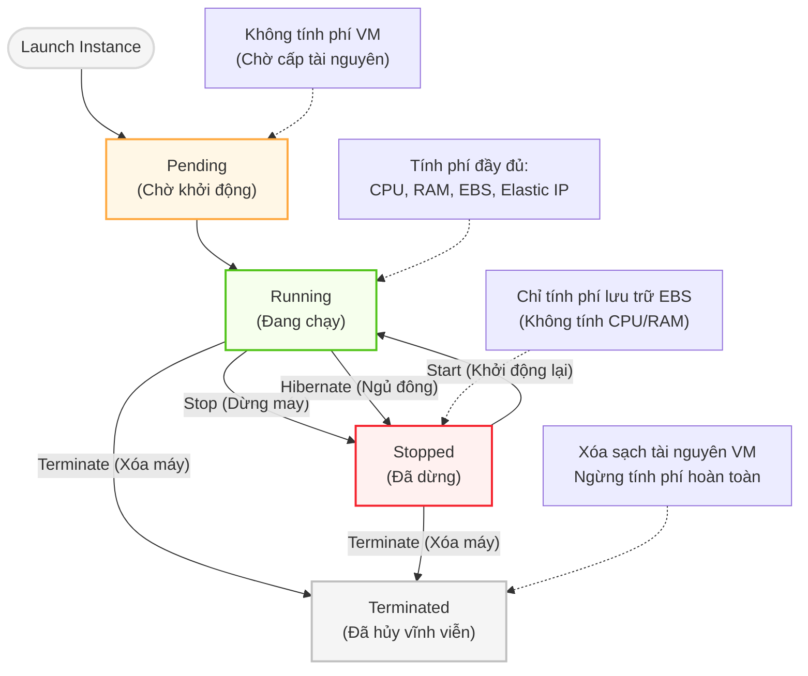
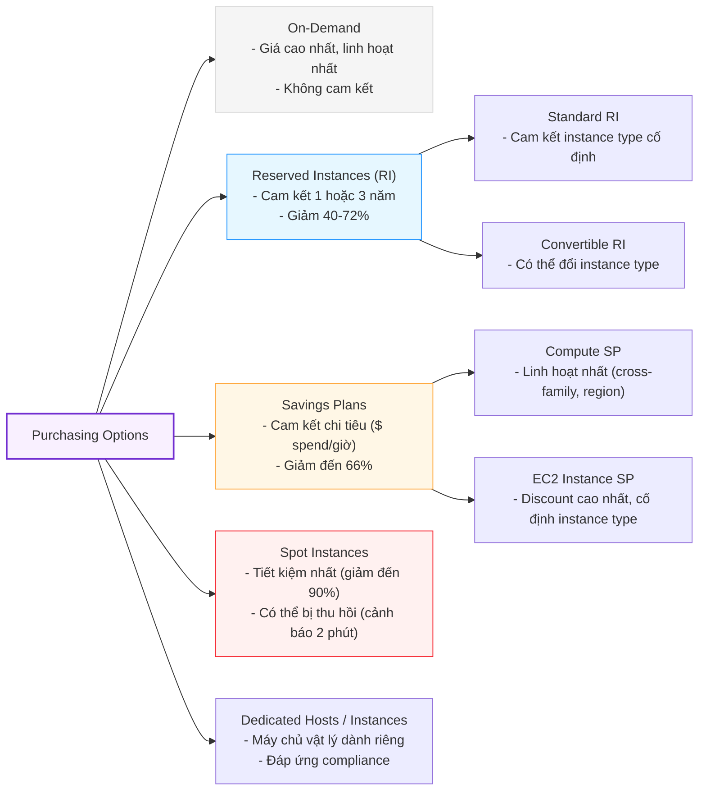

# 🖥️ Amazon EC2 — Elastic Compute Cloud Deep Dive

> **Scope:** Region → AZ-level | **Pricing scope:** Per-second (Linux) / Per-hour (Windows)

---

## 1. Tổng quan & Vòng đời Instance

EC2 là máy chủ ảo (Virtual Machine) chạy trên hạ tầng vật lý của AWS. Điểm mấu chốt cần nắm là **trạng thái ảnh hưởng trực tiếp đến chi phí và dữ liệu**.



### So sánh Stop vs Terminate vs Hibernate

| Hành động | RAM | EBS root | EBS data | IP Public | Chi phí |
|---|---|---|---|---|---|
| **Stop** | Mất | Giữ | Giữ | Mất (dynamic IP) | Chỉ tính EBS |
| **Terminate** | Mất | Xóa* | Phụ thuộc cấu hình | Mất | Không |
| **Hibernate** | Save vào EBS | Giữ | Giữ | Mất | Tính EBS (lưu RAM) |
| **Reboot** | Giữ | Giữ | Giữ | Giữ | Bình thường |

> *Root EBS mặc định có `DeleteOnTermination=true`. Có thể tắt khi launch.

---

## 2. Instance Types — Họ máy chủ

```
EC2 Instance Name Format:  m  6  g  .  2xlarge
                           │  │  │      └── Size (nano/micro/.../48xlarge)
                           │  │  └── Attributes (g=graviton, a=AMD, n=NVMe)
                           │  └── Generation (số càng cao càng mới)
                           └── Family (loại workload)
```

| Family | Ví dụ | Tối ưu cho |
|---|---|---|
| **General Purpose** | `t3`, `m6i` | Web server, dev/test, nhỏ-vừa |
| **Compute Optimized** | `c6i`, `c7g` | CPU-intensive: video encode, HPC, ML inference |
| **Memory Optimized** | `r6i`, `x2idn` | Database in-memory, Redis, SAP HANA |
| **Storage Optimized** | `i4i`, `d3en` | IOPS-heavy DB, Hadoop, data warehousing |
| **Accelerated** | `p4d`, `g5` | ML training (GPU), Graphics |
| **Graviton (ARM)** | `m7g`, `c7g` | 40% rẻ hơn Intel, hiệu quả điện năng cao |

---

## 3. Purchasing Options — Chiến lược giá



### Khi nào dùng gì?

| Scenario | Nên dùng |
|---|---|
| Production web app chạy 24/7 | Reserved Instances hoặc Savings Plans |
| Batch job, CI/CD, render | Spot Instances |
| Development/testing | On-Demand hoặc Spot |
| ML training job hàng giờ | Spot + checkpointing |
| Compliance yêu cầu isolated hardware | Dedicated Host |

---

## 4. AMI — Amazon Machine Image

AMI là **blueprint** để tạo EC2 instance. Một AMI = OS + Pre-installed software + EBS snapshot(s).

```
Custom AMI Workflow:
  Base EC2 → Install software → Create AMI → Launch nhiều EC2 từ AMI
  
AMI scope: Regional (phải copy sang region khác nếu cần)
```

**Các loại AMI:**
- **AWS-managed:** Amazon Linux 2023, Ubuntu, Windows Server...
- **AWS Marketplace:** Phần mềm thương mại (Red Hat, Cisco, Fortinet)
- **Community AMIs:** Public AMIs từ community
- **Custom AMI:** Do bạn tạo từ EC2 đang chạy

---

## 5. User Data — Bootstrapping Script

Script chạy **một lần duy nhất** lúc instance first boot, với quyền root:

```bash
#!/bin/bash
# Chạy với quyền root, một lần khi launch
yum update -y
yum install -y httpd
systemctl start httpd
systemctl enable httpd
echo "<h1>Hello from EC2 $(hostname -f)</h1>" > /var/www/html/index.html
```

> **Gotcha:** User Data chạy khi launch, KHÔNG chạy lại khi Stop/Start.  
> Để chạy lại → dùng `cloud-init` config hoặc AWS Systems Manager Run Command.

---

## 6. IMDSv2 — Instance Metadata Service

EC2 có một endpoint nội bộ để đọc metadata (IP, role credentials, AZ...):

```bash
# IMDSv2 (bắt buộc dùng token - bảo mật hơn IMDSv1)
TOKEN=$(curl -X PUT "http://169.254.169.254/latest/api/token" \
  -H "X-aws-ec2-metadata-token-ttl-seconds: 21600")

# Đọc AZ hiện tại
curl -H "X-aws-ec2-metadata-token: $TOKEN" \
  http://169.254.169.254/latest/meta-data/placement/availability-zone

# Đọc IAM Role credentials (SDK tự động làm điều này)
curl -H "X-aws-ec2-metadata-token: $TOKEN" \
  http://169.254.169.254/latest/meta-data/iam/security-credentials/<role-name>
```

---

## 7. Security Groups — Firewall Layer

| Đặc điểm | Security Group | NACL |
|---|---|---|
| Áp dụng ở đâu | ENI (card mạng của EC2) | Subnet boundary |
| Stateful/Stateless | **Stateful** | **Stateless** |
| Default | Deny all inbound, Allow all outbound | Allow all |
| Rule type | Allow only | Allow + Deny |
| Số rules | 60 inbound + 60 outbound | Unlimited |

```mermaid
flowchart TD
    subgraph SG [Stateful Security Group (ENI Level)]
        direction TB
        Client1([Client]) -->|"Inbound: Allow Port 80"| Instance1["EC2 Instance"]
        Instance1 -->|"Outbound Response: Tự động ALLOWED\n(Không cần Outbound rule)"| Client1
    end

    subgraph NACL [Stateless NACL (Subnet Level)]
        direction TB
        Client2([Client]) -->|"1. Inbound: Cần Rule ALLOW Port 80"| Subnet["Subnet Instances"]
        Subnet -->|"2. Outbound: BẮT BUỘC có Rule ALLOW Port 1024-65535"| Client2
    end

    style SG fill:#f6ffed,stroke:#52c41a,stroke-width:2px
    style NACL fill:#fff1f0,stroke:#f5222d,stroke-width:2px
```

---

## 8. Placement Groups

| Type | Cách bố trí | Dùng cho |
|---|---|---|
| **Cluster** | Cùng rack vật lý, cùng AZ | HPC, low-latency networking (10 Gbps+) |
| **Spread** | Khác rack vật lý, tối đa 7 instance/AZ | Critical instances, không muốn lỗi domino |
| **Partition** | Nhóm các instance theo partition, mỗi partition khác rack | Kafka, HDFS, Cassandra |

---

## 9. Quick Reference — Key Facts

| Item | Value |
|---|---|
| Billing minimum | 60 giây (Linux) |
| Max EBS volumes/instance | 28 (varies by type) |
| Max Elastic IPs/account | 5 (có thể xin tăng) |
| Max instances/AZ mặc định | 32 vCPU (On-Demand) |
| IMDSv2 token TTL | 6 giờ tối đa |
| User Data max size | 16 KB |
