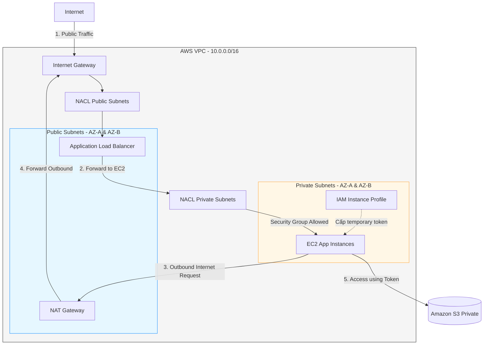

# 🌐 Phase 2: Core Compute, Networking & IAM (Hạ tầng Máy chủ, Mạng & Quản lý Định danh)

Giai đoạn đầu tiên và quan trọng nhất khi bắt tay vào xây dựng hạ tầng thực tế trên AWS. Phase này tập trung vào 3 dịch vụ xương sống: **Virtual Private Cloud (VPC)**, **Elastic Compute Cloud (EC2)**, và **Identity and Access Management (IAM)**.

---

## 📚 Tài liệu trong Phase này

| File | Nội dung |
|---|---|
| [EC2_DeepDive.md](./EC2_DeepDive.md) | Vòng đời instance, instance types, pricing (On-Demand/RI/Spot), AMI, User Data, IMDSv2, Security Groups, Placement Groups |
| [EC2_Storage_EBS_EFS_FSx.md](./EC2_Storage_EBS_EFS_FSx.md) | EBS volume types (gp3/io2/st1/sc1), snapshots, EFS Multi-AZ NFS, FSx for Windows/Lustre/ONTAP, storage decision matrix |
| [AutoScaling_ALB_NLB.md](./AutoScaling_ALB_NLB.md) | ASG (Launch Template, scaling policies, lifecycle hooks, warm pools), ALB (rules, target groups, sticky sessions), NLB vs ALB |
| [IAM_Role_EC2_Integration.md](./IAM_Role_EC2_Integration.md) | Instance Profile, IMDSv2 credential flow, Trust Policy, cross-account role, SSM Session Manager, security best practices |

---

## 🗺️ Sơ đồ AWS Scope — EC2 Ecosystem

```
Region (ap-southeast-1)
├── CloudWatch           ← Region-level monitoring
├── IAM / STS            ← Region-level (global service, but API regional)
│
└── VPC
    ├── Application Load Balancer   ← VPC-level, cross-AZ
    │
    ├── Auto Scaling Group          ← Spans multiple AZs
    │   ├── AZ: ap-southeast-1a
    │   │   └── Public Subnet
    │   │       ├── EC2 Instance ──► EBS Volume (AZ-local)
    │   │       └── EC2 Instance ──► EBS Volume
    │   │
    │   └── AZ: ap-southeast-1b
    │       └── Public Subnet
    │           ├── EC2 Instance ──► EBS Volume
    │           └── EC2 Instance ──► EBS Volume
    │
    ├── EFS (Multi-AZ Shared NFS)   ← Tất cả EC2 mount chung
    └── FSx (Windows/Lustre)        ← Managed File System
```

---

## 🏛️ Sơ đồ thiết kế bảo mật hạ tầng cốt lõi



---

## 🔍 Phân tích chi tiết mối quan hệ giữa các dịch vụ

### 1. Thiết kế mạng VPC (Subnets, Routing, NACL vs Security Groups)
- **VPC** cung cấp một mạng lưới cô lập logic. Ta chia nhỏ VPC thành các **Subnets** khác nhau để quản lý chính sách bảo mật:
  - **Public Subnets:** Có bảng định tuyến (Route Table) chứa tuyến đường `0.0.0.0/0` trỏ trực tiếp đến **Internet Gateway (IGW)**.
  - **Private Subnets:** Bảng định tuyến trỏ `0.0.0.0/0` đến **NAT Gateway** (nằm ở Public Subnet).
- **Security Groups (SG) vs Network ACLs (NACL):**
  - **Security Group (Tường lửa lớp Instance):** Hoạt động ở mức card mạng ảo (ENI) của EC2. Đây là tường lửa **Stateful** (nếu bạn cho phép chiều đi vào, chiều đi ra tương ứng sẽ tự động được mở mà không cần khai báo lại). Cấu hình thường cho phép ALB gửi traffic tới EC2.
  - **NACL (Tường lửa lớp Subnet):** Hoạt động ở biên của Subnet. Đây là tường lửa **Stateless** (phải khai báo tường minh cả chiều đi vào và chiều đi ra, bao gồm cả việc cho phép các cổng Ephemeral Ports `1024-65535` quay lại).

### 2. EC2 Compute (AMIs, Storage & Launch Configuration)
- **AMI (Amazon Machine Image):** Đóng vai trò là template chứa hệ điều hành, cấu hình phần mềm được đóng gói sẵn để khởi tạo nhanh máy chủ.
- **EBS (Elastic Block Store) Volumes:**
  - EBS cung cấp ổ đĩa block gắn trực tiếp vào EC2 qua mạng SAN nội bộ của AWS.
  - **Mối liên hệ hiệu năng/chi phí:** Ta chọn `gp3` cho các ứng dụng thông thường nhờ tỷ lệ IOPS/GiB tối ưu và độc lập với dung lượng đĩa, hoặc chọn `io2` (Provisioned IOPS) cho các CSDL chịu tải cực lớn.
- **User Data Scripts:** Kịch bản script chạy bằng quyền root đúng một lần duy nhất lúc máy chủ EC2 được khởi tạo (Bootstrapping) để cài đặt tự động Docker, Web Server, hoặc kéo code mới nhất về.

### 3. IAM (Identity & Access Management) và Bảo mật EC2
- **IAM Policies:** Định nghĩa quyền truy cập. 
  - **Identity-based Policies:** Gắn trực tiếp vào User, Group hoặc Role (Ví dụ: "Role này được phép đọc file từ S3").
  - **Resource-based Policies:** Gắn trực tiếp trên chính tài nguyên đó (Ví dụ: "Bucket S3 này cho phép IP của EC2 này đọc dữ liệu").
- **Instance Profile & sts:AssumeRole:**
  - Không bao giờ lưu trữ file config AWS Credentials (`.aws/credentials`) chứa access keys cứng trên ổ đĩa EC2.
  - Thay vào đó, tạo một IAM Role và đính kèm vào EC2 thông qua **IAM Instance Profile**.
  - **Cơ chế:** Dịch vụ AWS Security Token Service (STS) sẽ tự động sinh temporary credentials và truyền vào EC2 qua API **IMDSv2** (`http://169.254.169.254/latest/meta-data/iam/security-credentials/<role_name>`). SDK ứng dụng tự động đọc token này để xác thực an toàn.
