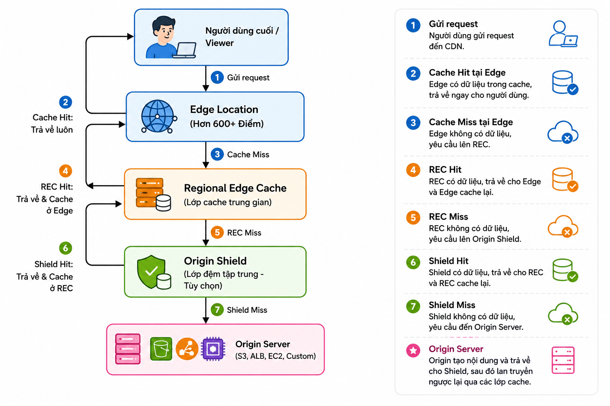
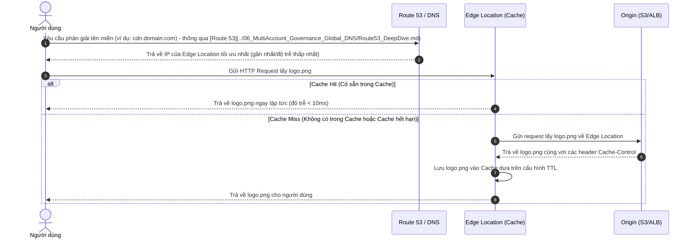

# 🌐 AWS CloudFront — Deep Dive & Content Delivery Network (CDN)

> **Amazon CloudFront** là dịch vụ Content Delivery Network (CDN) tốc độ cao do AWS cung cấp. Dịch vụ này giúp phân phối dữ liệu, video, ứng dụng và API trên phạm vi toàn cầu với độ trễ cực thấp, tốc độ truyền tải cao và bảo mật nghiêm ngặt.
>
> CloudFront hỗ trợ cả giao thức IPv4 và IPv6, tích hợp sâu vào hệ sinh thái AWS để tối ưu hóa hiệu năng và chi phí.

---

## 1. Bản chất của CDN (Content Delivery Network)

CDN (Mạng phân phối nội dung) là hệ thống các máy chủ (servers) được phân bổ tại nhiều vị trí địa lý khác nhau để cùng cộng tác phân phối nội dung (văn bản, hình ảnh, video, API...) đến người dùng cuối một cách nhanh chóng nhất.

Ý tưởng cốt lõi của CDN là đưa nội dung tới gần người dùng nhất thông qua các **Point of Presence (PoPs)** thay vì bắt tất cả các yêu cầu quay về máy chủ gốc (**Origin Server**).

### Nội dung Tĩnh (Static) vs. Nội dung Động (Dynamic)
*   **Static Content (Nội dung tĩnh):** Dữ liệu không thay đổi theo thời gian hoặc theo tác động của người dùng (Ví dụ: hình ảnh, CSS, JS, các file patch/install). CloudFront sẽ lưu cache (lưu trữ tạm thời) các nội dung này tại các Edge Location để phục vụ ngay lập tức.
*   **Dynamic Content (Nội dung động):** Dữ liệu thay đổi dựa vào đầu vào của người dùng hoặc được cá nhân hóa (Ví dụ: trang giỏ hàng, kết quả tìm kiếm, dữ liệu API thời gian thực). CloudFront không cache các nội dung này (hoặc chỉ cache trong thời gian cực ngắn) mà sử dụng mạng lưới đường truyền tối ưu hóa của AWS (**Amazon Backbone Network**) để tăng tốc độ truyền tải từ Origin Server đến người dùng.

---

## 2. Kiến trúc Mạng lưới Toàn cầu của CloudFront

Kiến trúc phân phối của Amazon CloudFront bao gồm 3 thành phần chính hoạt động theo mô hình phân tầng:

### A. Edge Locations (Điểm biên)
Là các trung tâm dữ liệu đặt tại các thành phố lớn trên thế giới. Đây là nơi tiếp nhận request đầu tiên từ người dùng cuối, thực hiện cache nội dung và xử lý các logic biên (Edge Computing) với độ trễ chỉ vài mili-giây. Hiện nay AWS có hơn **600+ Edge Locations** và **13 Regional Edge Caches** trên toàn thế giới.

### B. Regional Edge Caches (Bộ nhớ đệm biên khu vực)
Nằm giữa Edge Location và Origin Server. Khi Edge Location bị cache miss (không tìm thấy file trong cache), nó sẽ hỏi Regional Edge Cache trước khi truy cập về Origin. 
*   **Mục đích:** Regional Edge Caches có dung lượng lưu trữ lớn hơn nhiều so với Edge Location, giúp giữ cache lâu hơn và giảm đáng kể số lượng request trực tiếp về Origin Server của doanh nghiệp.

### C. Origin Shield (Lớp bảo vệ máy chủ gốc - Tùy chọn)
Là một lớp đệm cache tập trung nằm gần máy chủ gốc nhất. 
*   **Cơ chế hoạt động:** Thay vì tất cả các Regional Edge Caches trên toàn cầu gửi request trực tiếp về Origin khi bị cache miss, toàn bộ request sẽ được hội tụ về Origin Shield. Chỉ khi Origin Shield bị cache miss thì request mới được gửi tới Origin Server.
*   **Lợi ích:** Giảm tải tối đa cho Origin Server (giảm I/O, giảm băng thông), tăng Cache Hit Ratio tổng thể và cải thiện hiệu năng mạng.

---

## 3. Quy trình Hoạt động của CloudFront

Hãy tưởng tượng một người dùng yêu cầu một tệp hình ảnh `logo.png` từ một trang web sử dụng CloudFront:

---

## 4. Phân biệt Cache Policy và Origin Request Policy

Đây là hai khái niệm cực kỳ quan trọng khi cấu hình hành vi (Behavior) của CloudFront:

| Tiêu chí | Cache Policy | Origin Request Policy |
| :--- | :--- | :--- |
| **Vai trò chính** | Xác định các tham số tạo thành **Cache Key** để lưu trữ và tìm kiếm cache. | Xác định các thông tin sẽ được **gửi tiếp về Origin** khi xảy ra Cache Miss. |
| **Các tham số cấu hình** | Headers, Cookies, Query Strings. | Headers, Cookies, Query Strings. |
| **Ảnh hưởng Cache** | **Có.** Nếu thay đổi tham số trong Cache Key (ví dụ: query string `?user=1`), CloudFront sẽ coi đó là 2 object khác nhau và tạo cache riêng. | **Không.** Không làm thay đổi Cache Key, giúp tối ưu hóa Cache Hit Ratio. |
| **Cách dùng điển hình** | Chỉ đưa vào những tham số ảnh hưởng trực tiếp đến nội dung hiển thị của file (ví dụ: `?size=large` để tải ảnh to). | Gửi thông tin định danh thiết bị, ngôn ngữ hoặc token bảo mật về Origin để xử lý logic nội bộ mà không cần phân tách cache. |

> [!TIP]
> **Quy tắc vàng:** Để có Cache Hit Ratio cao nhất, hãy giữ **Cache Policy** càng tinh gọn càng tốt (chỉ cache theo URL mặc định nếu có thể). Sử dụng **Origin Request Policy** để chuyển tiếp dữ liệu cần thiết cho server backend xử lý.

---

## 5. Bảo mật trong Amazon CloudFront

CloudFront tích hợp sẵn nhiều lớp bảo mật để bảo vệ nội dung và hệ thống backend:

1.  **Chống DDoS toàn diện:** Tích hợp mặc định với **AWS Shield Standard** để chống các cuộc tấn công DDoS ở tầng Lớp mạng (Layer 3/4).
2.  **Tường lửa ứng dụng web:** Tích hợp với **AWS WAF (Web Application Firewall)** để chặn các cuộc tấn công tầng ứng dụng (SQL Injection, Cross-Site Scripting - XSS) ngay tại Edge.
3.  **Bảo vệ S3 Origin với OAC (Origin Access Control):**
    *   Giúp đóng hoàn toàn quyền truy cập công khai (Public Access) của S3 Bucket. S3 chỉ chấp nhận các yêu cầu được ký số (signed requests) từ chính CloudFront Distribution được chỉ định thông qua Bucket Policy (Xem thêm chi tiết về các loại lưu trữ S3 tại [S3_Storage_Classes.md](S3_Storage_Classes.md)).
    *   OAC là phiên bản nâng cấp hoàn toàn cho **OAI (Origin Access Identity)** cũ, hỗ trợ các vùng AWS mới (Opt-in regions), hỗ trợ SSE-KMS với khóa tự quản lý, và hỗ trợ các dịch vụ khác như Lambda Function URLs.
4.  **Field-Level Encryption (Mã hóa mức độ trường):** Cho phép mã hóa các trường dữ liệu nhạy cảm (như số thẻ tín dụng) bằng khóa công khai (public key) ngay tại Edge Location trước khi request đến ứng dụng. Chỉ có service backend sở hữu khóa riêng tư (private key) mới giải mã được.
5.  **Geo Restriction (Chặn theo địa lý):** Cho phép thiết lập Whitelist hoặc Blacklist để giới hạn quyền truy cập nội dung từ các quốc gia cụ thể dựa trên địa chỉ IP.
6.  **Signed URLs & Signed Cookies (Liên kết/Cookie có chữ ký):**
    *   **Signed URLs:** Cung cấp liên kết tạm thời có giới hạn thời gian cho từng file riêng lẻ (Ví dụ: link tải file cài đặt phần mềm sau khi thanh toán).
    *   **Signed Cookies:** Cung cấp quyền truy cập tạm thời cho nhiều file hoặc toàn bộ thư mục (Ví dụ: người dùng đăng nhập hệ thống học trực tuyến và có quyền xem toàn bộ video bài giảng trong khóa học đó).

---

## 6. Lập trình tại Biên (Edge Computing): CloudFront Functions vs. Lambda@Edge

AWS cung cấp hai giải pháp để thực thi mã nguồn ngay tại Edge của CloudFront để tùy chỉnh Request/Response:

| Tiêu chí | CloudFront Functions | Lambda@Edge |
| :--- | :--- | :--- |
| **Môi trường chạy** | 600+ Edge Locations (tối ưu hóa tốc độ tối đa) | 13 Regional Edge Caches |
| **Thời gian thực thi tối đa** | **< 1 mili-giây** | 5 giây (Viewer) / 30 giây (Origin) |
| **Ngôn ngữ hỗ trợ** | JavaScript (ECMAScript 5.1 tương thích một phần) | Node.js, Python |
| **Quyền truy cập mạng/file** | Không (Chỉ xử lý tính toán thuần túy trên request/response) | Có (Có thể gọi API bên ngoài, truy cập DB...) |
| **Dung lượng code tối đa** | 10 KB | 1 MB (Viewer) / 50 MB (Origin) |
| **Các điểm kích hoạt (Triggers)** | - Viewer Request - Viewer Response | - Viewer Request / Viewer Response - Origin Request / Origin Response |
| **Chi phí** | Rất rẻ ($0.1 mỗi 1 triệu requests) | Đắt hơn ($0.6 mỗi 1 triệu requests + thời gian chạy) |
| **Trường hợp sử dụng phù hợp** | - URL rewrite/redirect đơn giản - Thêm/bớt/sửa Header HTTP - Chuẩn hóa Cache Key (Query string, cookie) - Kiểm tra Authorization token đơn giản | - Tương tác với DB (DynamoDB, RDS - xem thêm [database_service.md](../04_Databases_Caching/database_service.md)) hoặc các AWS Services khác - Xử lý/chỉnh sửa Body của request/response - Resize hình ảnh tự động (Image optimization) - A/B Testing phức tạp |

---

## 7. Giám sát & Báo cáo Hoạt động (Monitoring)

CloudFront cung cấp các báo cáo thống kê và giám sát toàn diện thông qua CloudWatch và CloudFront Console:
*   **Request & Data Transfer Trends:** Biểu đồ lượng request và dung lượng data transfer out theo thời gian.
*   **Error Rate:** Thống kê tỷ lệ lỗi HTTP (4xx, 5xx) giúp phát hiện sự cố ở Origin.
*   **Cache Statistics:** Thống kê tỷ lệ Cache Hit/Miss, số lượng byte được phục vụ từ cache.
*   **Access Logs:** Nhật ký truy cập chi tiết lưu trên S3 (hoặc Kinesis Data Firehose để phân tích thời gian thực).
*   **Báo cáo Business Insights:**
    *   *Popular Objects:* Các tài nguyên được truy cập nhiều nhất.
    *   *Viewer:* Thống kê địa điểm địa lý, trình duyệt (Browser), hệ điều hành (OS), loại thiết bị (Mobile, Desktop, Tablet).
    *   *Referrer:* Các nguồn/trang web điều hướng lượng truy cập đến CDN của bạn.

---

## 8. Các Phương pháp Tối ưu hóa Hiệu năng & Chi phí (Best Practices)

### A. Tăng Cache Hit Ratio
*   Tránh đưa các tham số không cần thiết vào Cache Key (sử dụng Origin Request Policy thay thế).
*   Chuẩn hóa URL (ví dụ: chuyển tất cả query parameter về chữ thường, sắp xếp thứ tự tham số giống nhau) bằng CloudFront Functions trước khi so khớp cache.
*   Thiết lập thời gian cache (`Max-age`, `s-maxage` trong header `Cache-Control`) hợp lý từ Origin Server.

### B. Invalidation (Làm mới Cache) vs. Versioned File Names
Khi cập nhật file mới lên Origin (ví dụ: upload file `style.css` mới), làm sao để người dùng nhận được file mới ngay lập tức thay vì dùng file cũ đang cache ở Edge?
1.  **Cách 1: Invalidations (Khuyên dùng khi bắt buộc):** CloudFront gửi yêu cầu xóa cache của file cụ thể trên toàn thế giới. 
    *   *Nhược điểm:* Tốn thời gian lan truyền (vài giây đến vài phút), và AWS tính phí nếu số lượng invalidation lớn hơn 1000 đường dẫn mỗi tháng.
2.  **Cách 2: Versioning File Names (Best Practice):** Đổi tên file mỗi khi cập nhật (Ví dụ: `style.v1.css` thành `style.v2.css`).
    *   *Ưu điểm:* Người dùng lập tức tải file mới do URL thay đổi (Cache Miss của URL mới), hoàn toàn miễn phí và không cần thực hiện lệnh invalidation.

### C. Sử dụng nén dữ liệu (Compression)
Bật tính năng tự động nén bằng **Gzip** hoặc **Brotli** trong CloudFront Behavior để giảm kích thước tệp tải xuống, cải thiện tốc độ tải trang cho người dùng và giảm chi phí truyền dữ liệu (Data Transfer Out).

---

## 9. Các liên kết liên quan trong hệ thống

Để củng cố kiến thức về mạng phân phối nội dung và các hạ tầng liên quan trên AWS, hãy tham khảo thêm các tài liệu sau:
*   [S3_Storage_Classes.md](S3_Storage_Classes.md): Tìm hiểu các phân hạng lưu trữ S3 dùng làm Origin cho CloudFront.
*   [database_service.md](../04_Databases_Caching/database_service.md): Tìm hiểu về cơ sở dữ liệu quan hệ (RDS/Aurora) làm nguồn dữ liệu động.
*   [ElastiCache.md](../04_Databases_Caching/ElastiCache.md): So sánh giải pháp Caching ở Edge (CloudFront) và Caching ở Database (ElastiCache).
*   [ECS_ECR.md](../05_Containers_Serverless/ECS_ECR.md): Tìm hiểu cách deploy ứng dụng web container chạy đằng sau CloudFront.
