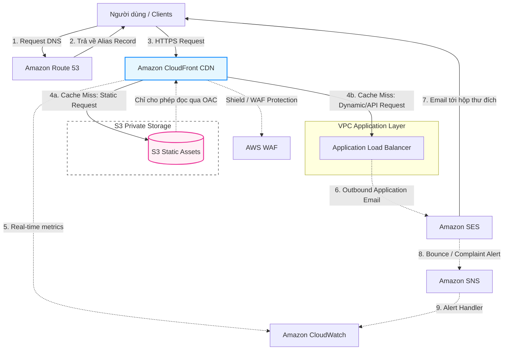

# 📦 Phase 3: Storage, Content Delivery & SES (Lưu trữ, CDN, Email & Giám sát)

Giai đoạn tối ưu hóa trải nghiệm người dùng cuối, phân phối nội dung tĩnh/động toàn cầu với độ trễ thấp và thiết lập các dịch vụ truyền thông bổ trợ: **S3**, **CloudFront CDN**, **Route 53**, **SES (Email)**, và **CloudWatch (Monitoring)**.

---

## 🏛️ Sơ đồ luồng phân phối dữ liệu tĩnh/động & Phản hồi từ Email

---

## 🔍 Phân tích chi tiết mối quan hệ giữa các dịch vụ

### 1. Phân giải tên miền và CDN (Route 53 & CloudFront)
- **Hosted Zones & Alias Records:** Route 53 quản lý các bản ghi DNS. Thay vì dùng bản ghi CNAME truyền thống (gây trễ DNS do phải phân giải tên miền CDN trung gian), Route 53 hỗ trợ bản ghi **Alias Record** trỏ trực tiếp đến CloudFront Distribution. Route 53 nhận diện IP biên CloudFront ở mức nội bộ và phân giải ngay trong lần truy vấn đầu tiên.
- **Routing Policies:** Cấu hình Health Checks trên Route 53 kết hợp DNS Failover để tự động chuyển hướng traffic sang một khu vực dự phòng (Secondary Region) nếu CDN/ALB chính gặp sự cố.

### 2. Phân phối nội dung tĩnh an toàn (CloudFront & S3 via OAC)
- **Origin Access Control (OAC):** Đây là cơ chế bảo mật tiêu chuẩn để bảo vệ S3 Bucket đứng sau CloudFront.
  - **Why:** Nếu S3 để public, người dùng có thể bypass CDN (không qua WAF, không qua Edge Cache) dẫn đến rủi ro lộ dữ liệu và tốn chi phí băng thông S3 Egress cực lớn.
  - **Cơ chế:** S3 Bucket được khóa hoàn toàn (Block Public Access). Khi CloudFront chuyển tiếp (forward) request từ client tới S3, nó sẽ tự động ký nhận yêu cầu bằng khóa IAM tạm thời của Service Principal `cloudfront.amazonaws.com`. S3 kiểm tra chữ ký này qua Bucket Policy và trả về file nếu hợp lệ.

### 3. Tối ưu hóa Bộ nhớ đệm và Lưu trữ (CloudFront & S3 Lifecycle)
- **S3 Storage Classes & Lifecycle Policies:**
  - File tĩnh tải lên S3 được phân phối qua CloudFront.
  - **Mối liên kết:** Các file media cũ ít truy cập sau 30 ngày sẽ được S3 tự động chuyển từ `Standard` sang `S3-IA` (Infrequent Access) hoặc `Glacier` (Archive) nhờ **Lifecycle Policies** nhằm giảm tới 70-90% chi phí lưu trữ. CloudFront Edge location vẫn giữ bản cache của các file này, chỉ khi cache hết hạn (TTL expire) thì CloudFront mới cần gửi request giải nén từ Glacier về.

### 4. Giám sát hệ thống (CloudWatch & CloudFront/ALB)
- **CloudWatch** thu thập các chỉ số thời gian thực từ CloudFront và ALB:
  - **Metrics:** Cache Hit Rate (tỷ lệ tìm thấy trong cache), 4xx/5xx Error Rates, Latency.
  - **Alarm Action:** Nếu tỷ lệ lỗi 5xx của ALB vượt quá 5% trong 2 phút, CloudWatch Alarm kích hoạt SNS để gửi tin nhắn cảnh báo tới dev qua Slack/Discord hoặc tự động rollback phiên bản app lỗi.

### 5. Simple Email Service (SES) và Xử lý phản hồi (SES & SNS)
- Khi ứng dụng trong VPC (EC2/Fargate) gửi email hàng loạt hoặc email giao dịch (hóa đơn, mật khẩu) qua SES, ta cần kiểm soát **Sender Reputation** (độ uy tín của domain gửi thư).
- **Mối liên kết:**
  1. Hộp thư đích báo lỗi (Bounce - địa chỉ không tồn tại) hoặc đánh dấu Spam (Complaint).
  2. SES bắt được tín hiệu và kích hoạt thông báo qua **Amazon SNS**.
  3. SNS kích hoạt một Lambda function chạy ngầm để ghi nhận địa chỉ email lỗi này vào database và đánh dấu không gửi thư đến địa chỉ đó nữa, giữ cho tỷ lệ Bounce Rate của tài khoản luôn dưới 5% (tránh bị AWS khóa quyền gửi email).
