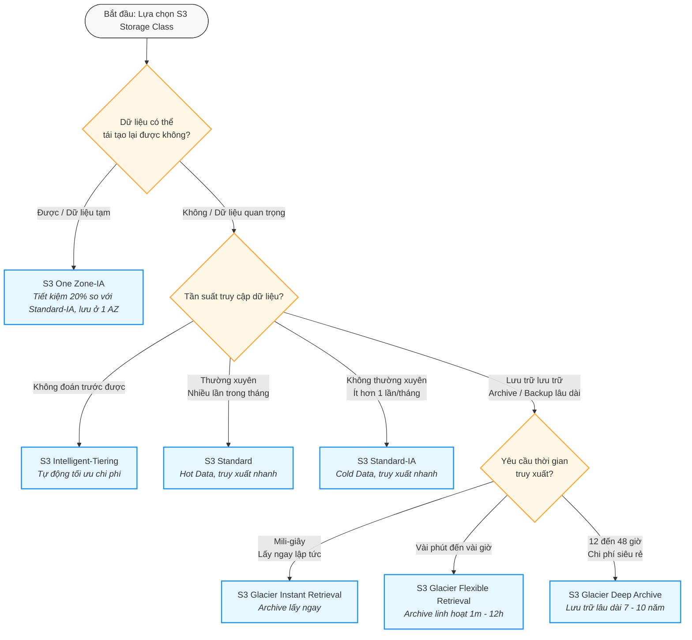
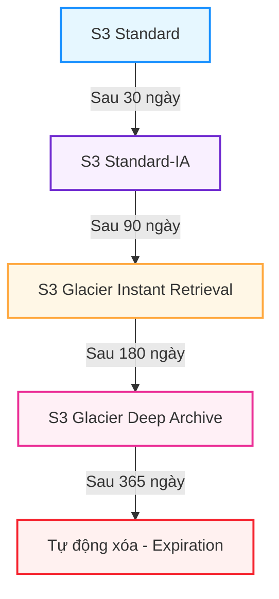

# 🗄️ AWS S3 Storage Classes — Deep Dive & Cost Optimization

> **Amazon S3 (Simple Storage Service)** cung cấp nhiều phân hạng lưu trữ (Storage Classes) được tối ưu hóa cho các nhu cầu truy cập, tần suất sử dụng và ngân sách khác nhau.  
> Hiểu rõ sự khác biệt giữa các loại S3 là yếu tố cốt lõi giúp thiết kế giải pháp lưu trữ tối ưu chi phí (FinOps) trên AWS.

---

## 1. Cây quyết định chọn S3 Storage Class (Decision Tree)

Dưới đây là sơ đồ giúp bạn nhanh chóng xác định loại S3 phù hợp cho dữ liệu của mình:

---

## 2. Chi tiết các loại S3 Storage Classes

### 2.1. S3 Standard (Frequent Access)
- **Mô tả:** Phân hạng mặc định khi tải file lên S3.
- **Đặc trưng:** Độ trễ cực thấp (millisecond), throughput cao. Tự động sao lưu trên tối thiểu **3 Availability Zones (AZs)**.
- **Trường hợp sử dụng:** 
  - Static assets của web/mobile application (hình ảnh, CSS, JS).
  - Dữ liệu đang được xử lý tích cực (Hot Data).
  - Big Data Analytics, phân phối nội dung (CDN).
- **Chi phí:** Giá lưu trữ (storage price) cao nhất nhưng **không tốn phí truy xuất (retrieval fee)** và không yêu cầu thời gian lưu trữ tối thiểu.

### 2.2. S3 Intelligent-Tiering
- **Mô tả:** Dịch vụ lưu trữ tự động tối ưu hóa chi phí duy nhất bằng cách chuyển dữ liệu giữa các tier dựa trên hành vi truy cập thực tế.
- **Đặc trưng:**
  - Không có phí truy xuất (Retrieval fee) và không có phí chuyển đổi tầng dữ liệu.
  - Sử dụng 2 tier mặc định: **Frequent Access tier** và **Infrequent Access tier** (giá giống Standard-IA).
  - Tự động chuyển file sang Infrequent Access sau 30 ngày không có truy cập. Nếu có truy cập lại, file tự quay lại Frequent Access.
  - Có phí giám sát và tự động hóa nhỏ hàng tháng (`$0.0025 per 1,000 objects` - không áp dụng cho object dưới 128KB).
- **Trường hợp sử dụng:** Dữ liệu có hành vi truy cập **không thể đoán trước** hoặc thay đổi liên tục mà bạn không muốn tự quản lý lifecycle.

### 2.3. S3 Standard-IA (Infrequent Access)
- **Mô tả:** Lưu trữ cho dữ liệu ít truy cập nhưng yêu cầu truy xuất ngay lập tức khi cần.
- **Đặc trưng:**
  - Chi phí lưu trữ rẻ hơn Standard khoảng 40%.
  - **Tốn phí khi truy xuất dữ liệu** (Data Retrieval Fee - tính trên mỗi GB).
  - Yêu cầu dung lượng object tối thiểu là **128 KB** (object nhỏ hơn vẫn bị tính phí là 128 KB) và thời gian lưu tối thiểu là **30 ngày** (xóa trước 30 ngày vẫn bị tính tiền đủ 30 ngày).
- **Trường hợp sử dụng:** Backup dữ liệu, tài liệu lưu trữ của doanh nghiệp cần truy cập nhanh khi có audit.

### 2.4. S3 One Zone-IA
- **Mô tả:** Giống như Standard-IA nhưng dữ liệu chỉ được lưu trữ trong **duy nhất 1 Availability Zone (AZ)** thay vì 3 AZs.
- **Đặc trưng:**
  - Chi phí lưu trữ rẻ hơn Standard-IA thêm 20%.
  - Độ bền vẫn đạt 11 số 9 ($99.999999999\%$), nhưng nếu AZ chứa dữ liệu bị phá hủy vật lý (động đất, hỏa hoạn...), dữ liệu sẽ **bị mất hoàn toàn**.
  - Áp dụng các quy tắc về dung lượng tối thiểu (128 KB) và thời gian lưu tối thiểu (30 ngày).
- **Trường hợp sử dụng:** Dữ liệu dự phòng của bản backup chính, dữ liệu dễ dàng tạo lại được (transcoded media, thumbnail).

### 2.5. S3 Glacier Instant Retrieval
- **Mô tả:** Phân hạng archive mới nhất, cung cấp chi phí cực thấp cho dữ liệu lưu trữ lâu dài nhưng cần lấy ra ngay lập tức (mili-giây).
- **Đặc trưng:**
  - Tiết kiệm tới 68% so với Standard-IA.
  - Truy xuất tức thì (millisecond retrieval).
  - Phí truy xuất dữ liệu cao hơn Standard-IA.
  - Kích thước object tối thiểu **128 KB**, thời gian lưu trữ tối thiểu **90 ngày**.
- **Trường hợp sử dụng:** Hồ sơ y tế (medical images), thông tin giao dịch lịch sử của ngân hàng cần tra cứu ngay khi khách hàng yêu cầu đột xuất.

### 2.6. S3 Glacier Flexible Retrieval (trước đây là S3 Glacier)
- **Mô tả:** Phân hạng lưu trữ lưu trữ (Cold Data) truyền thống, không cần truy cập ngay lập tức.
- **Đặc trưng:**
  - Chi phí lưu trữ rẻ hơn Glacier Instant Retrieval.
  - Có 3 lựa chọn truy xuất (Retrieval Options):
    - **Expedited (Khẩn cấp):** Lấy dữ liệu trong 1 - 5 phút (phí cao).
    - **Standard (Mặc định):** Lấy dữ liệu trong 3 - 5 giờ.
    - **Bulk (Hàng loạt):** Lấy dữ liệu trong 5 - 12 giờ (**Miễn phí phí truy xuất**).
  - Không có kích thước tối thiểu, thời gian lưu tối thiểu **90 ngày**.
- **Trường hợp sử dụng:** Sao lưu hàng tuần/hàng tháng, các file log cũ để audit định kỳ.

### 2.7. S3 Glacier Deep Archive
- **Mô tả:** Lớp lưu trữ rẻ nhất của AWS.
- **Đặc trưng:**
  - Tiết kiệm lên tới 75% so với Glacier Flexible Retrieval (chỉ khoảng ~$0.00099/GB/tháng).
  - Thời gian truy xuất lâu nhất:
    - **Standard:** 12 giờ.
    - **Bulk:** 48 giờ.
  - Thời gian lưu trữ tối thiểu **180 ngày**.
- **Trường hợp sử dụng:** Dữ liệu lưu trữ bắt buộc theo luật pháp (regulatory compliance) của chính phủ, tài chính, y tế (giữ lại 7-10 năm và hiếm khi đọc).

---

## 3. Bảng so sánh các thông số kỹ thuật & Chi phí

| Tiêu chí | S3 Standard | S3 Intelligent-Tiering | S3 Standard-IA | S3 One Zone-IA | S3 Glacier Instant Retrieval | S3 Glacier Flexible | S3 Glacier Deep Archive |
| :--- | :--- | :--- | :--- | :--- | :--- | :--- | :--- |
| **Độ bền thiết kế (Durability)** | 99.999999999% (11 9s) | 99.999999999% (11 9s) | 99.999999999% (11 9s) | 99.999999999% (11 9s) | 99.999999999% (11 9s) | 99.999999999% (11 9s) | 99.999999999% (11 9s) |
| **Số AZ tối thiểu (AZs)** | $\ge$ 3 | $\ge$ 3 | $\ge$ 3 | 1 | $\ge$ 3 | $\ge$ 3 | $\ge$ 3 |
| **SLA sẵn sàng (Availability SLA)** | 99.9% | 99.0% | 99.0% | 98.5% | 99.0% | 99.0% | 99.0% |
| **Thời gian truy xuất (Retrieval Time)** | Milliseconds | Milliseconds | Milliseconds | Milliseconds | Milliseconds | Minutes to hours | 12 to 48 hours |
| **Phí truy xuất (Retrieval fee)** | Không | Không | Có (trên mỗi GB) | Có (trên mỗi GB) | Có (cao hơn) | Có (Free nếu chọn Bulk) | Có (Khá cao) |
| **Dung lượng tối thiểu / Object** | Không | Không (auto-tiering $\ge$ 128KB) | 128 KB | 128 KB | 128 KB | Không | Không |
| **Thời gian lưu tối thiểu** | Không | Không | 30 ngày | 30 ngày | 90 ngày | 90 ngày | 180 ngày |
| **Giá lưu trữ ước tính (Oregon Region)** | ~$0.023 / GB | Biến động | ~$0.0125 / GB | ~$0.010 / GB | ~$0.004 / GB | ~$0.0036 / GB | ~$0.00099 / GB |

---

## 4. Quản lý vòng đời dữ liệu (S3 Lifecycle Policies)

S3 Lifecycle Rules giúp bạn tự động hóa việc chuyển đổi lớp lưu trữ (Transition) hoặc xóa dữ liệu (Expiration) nhằm tối ưu chi phí mà không cần tác động thủ công.

### 4.1. Sơ đồ dịch chuyển vòng đời tối ưu (S3 Transition Path)

### 4.2. Các quy tắc quan trọng khi cấu hình Lifecycle Policies:
1. **Quy tắc một chiều (Waterfall model):** Bạn chỉ có thể chuyển dữ liệu từ lớp có chi phí lưu trữ cao hơn, truy xuất nhanh hơn sang lớp rẻ hơn, truy xuất chậm hơn. Không thể làm ngược lại qua Lifecycle (ví dụ: Không thể tạo rule tự động chuyển từ *Standard-IA* sang *Standard*).
2. **Hạn chế số ngày tối thiểu:**
   - Để chuyển từ **Standard** sang **Standard-IA/One Zone-IA**, object phải lưu ở Standard tối thiểu **30 ngày**.
   - Nếu bạn chuyển file sang Glacier trước thời hạn lưu tối thiểu của lớp trước đó, bạn sẽ bị AWS phạt phí xóa/chuyển đổi sớm (Early deletion charge).
3. **Quản lý phiên bản (Noncurrent Version Lifecycle):** Nếu bật **S3 Versioning**, bạn có thể cấu hình rule riêng biệt để chuyển hoặc xóa các phiên bản cũ (Noncurrent versions) của file, tránh việc phình to dung lượng do ghi đè file liên tục.

---

## 5. Các lưu ý đặc biệt khi thiết kế hệ thống với S3 (FinOps & Architecting)

- **Tránh "bẫy" Small Objects trên IA/Glacier:** 
  - Nếu lưu hàng triệu file ảnh nhỏ (kích thước vài KB) lên Standard-IA hoặc Glacier, bạn vẫn bị tính tiền như thể mỗi file nặng 128KB. Đồng thời, Glacier có phí quản lý metadata (Glacier metadata overhead: 8KB to 32KB per object). 
  - **Giải pháp:** Zip/nén nhiều file nhỏ thành 1 file lớn trước khi chuyển sang IA hoặc Glacier.
- **Multipart Upload Cleanup:** 
  - Khi upload file lớn lên S3 bị lỗi nửa chừng, các phần đã upload thành công vẫn nằm trên S3 và bị tính phí âm thầm. 
  - **Giải pháp:** Cấu hình Lifecycle Rule với hành động `AbortIncompleteMultipartUpload` sau 7 ngày để tự động xóa dọn dẹp các phần file lỗi này.
- **S3 Versioning Cost:** Bật Versioning rất tốt cho bảo mật (tránh xóa nhầm, ransomware), nhưng mỗi phiên bản mới được lưu trữ sẽ nhân thêm dung lượng và nhân thêm tiền.
- **Cross-Region Replication (CRR):** Nhân bản sang Region khác nhân đôi chi phí lưu trữ và phát sinh thêm chi phí **Data Transfer Out (DTO)** giữa các Region. Hãy cân nhắc kỹ.
