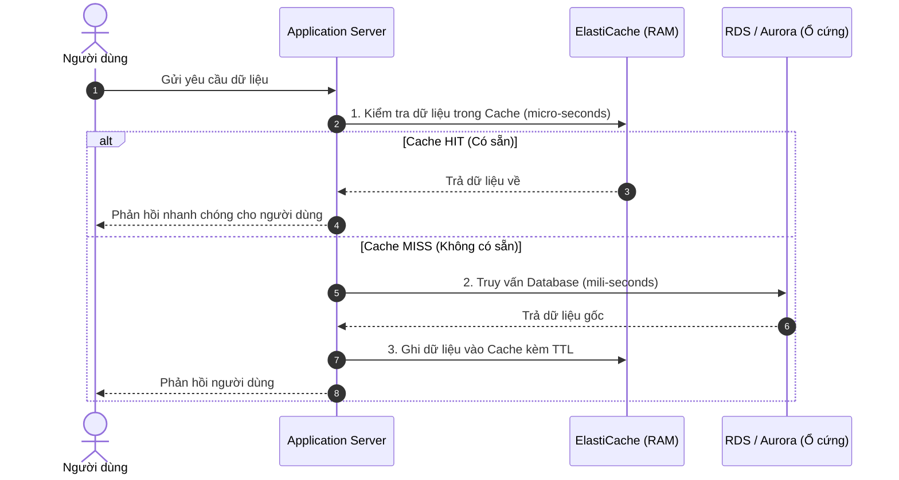
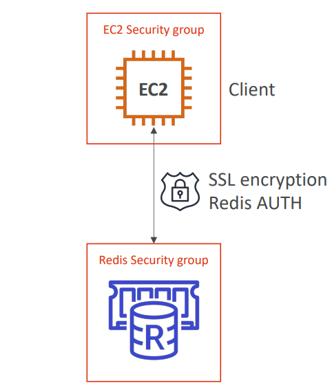
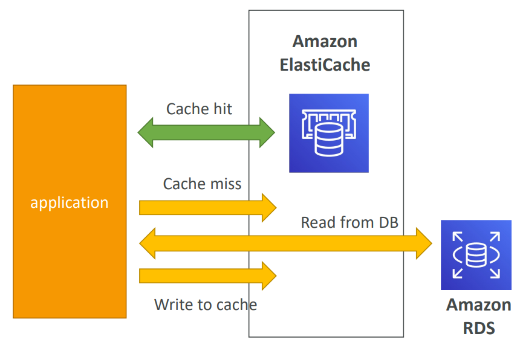
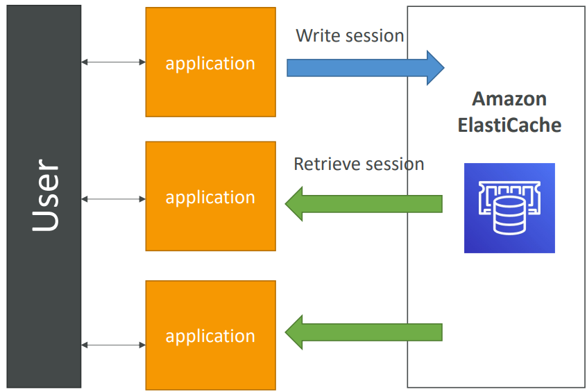

# ⚡ Amazon ElastiCache — Deep Dive & In-Memory Caching

> **Amazon ElastiCache** là dịch vụ lưu trữ dữ liệu trong bộ nhớ (in-memory data store) được quản lý hoàn toàn bởi AWS, tương thích với hai công cụ mã nguồn mở phổ biến là **Redis** và **Memcached**.
>
> Bằng cách lưu trữ dữ liệu thường xuyên truy cập trên RAM thay vì đĩa cứng, ElastiCache giúp ứng dụng đạt độ trễ ở mức **micro-giây** (sub-millisecond latency), giảm tải tối đa cho các cơ sở dữ liệu quan hệ phía sau và tăng khả năng mở rộng của toàn hệ thống.

---

## 1. Tổng quan về Bộ nhớ Cache và ElastiCache

### A. Bộ nhớ Cache là gì?
Cache là bộ nhớ đệm chứa dữ liệu tạm thời, nằm chờ yêu cầu từ ứng dụng hoặc phần cứng. Dữ liệu trong cache thường là kết quả của các phép tính toán phức tạp, hoặc các bản sao của dữ liệu gốc nằm ở các database có tốc độ truy xuất chậm hơn.

### B. Vai trò của Amazon ElastiCache trong Kiến trúc Cloud
Khi ứng dụng có lượng truy cập lớn, việc truy vấn trực tiếp vào cơ sở dữ liệu quan hệ (RDS, Aurora...) cho mỗi request sẽ gây quá tải CPU, nghẽn I/O và làm tăng độ trễ. ElastiCache đứng giữa ứng dụng và database để giải quyết bài toán này.



### C. Lợi ích khi sử dụng dịch vụ Managed của AWS
*   **Ứng dụng trở thành Stateless (Không trạng thái):** Lưu trữ Session tập trung trên ElastiCache giúp các Web Server/Lambda có thể chia sẻ chung thông tin đăng nhập của người dùng. Nếu một Web Server bị sập, người dùng không bị mất session.
*   **Tự động hóa hoàn toàn (Fully Managed):** AWS tự động thực hiện maintenance, OS patching, backup/restore, giám sát và tự động khôi phục khi có sự cố (failover) mà không làm gián đoạn ứng dụng.
*   **Cân nhắc thiết kế:** Dịch vụ lưu trữ RAM có chi phí khá cao và yêu cầu thay đổi mã nguồn ứng dụng để tích hợp logic kiểm soát cache (cache-aside, write-through).

---

## 2. So sánh chuyên sâu: Redis vs. Memcached

Việc lựa chọn đúng Engine ảnh hưởng lớn đến kiến trúc dữ liệu của ứng dụng:

### A. ElastiCache for Redis


*   **Tính sẵn sàng cao:** Được triển khai Multi-AZ, hỗ trợ tự động phát hiện và chuyển đổi dự phòng (Auto-Failover) sang Standby Node khi Node chính gặp sự cố.
*   **Mở rộng quy mô đọc:** Cung cấp Read Replicas (tối đa 5 replicas) giúp phân phối tải đọc hiệu quả.
*   **Độ bền vững dữ liệu:** Đảm bảo độ bền dữ liệu bằng tính năng AOF Persistence hoặc chụp ảnh nhanh (Snapshot).
*   **Sao lưu:** Hỗ trợ tính năng Backup và Restore toàn diện.

### B. ElastiCache for Memcached


*   **Cơ chế lưu trữ:** Dữ liệu được phân mảnh (sharding) tự động trên nhiều node độc lập.
*   **Độ bền dữ liệu:** Không có tính bền vững (Non-persistent) - mất sạch dữ liệu lưu trong RAM khi khởi động lại node.
*   **Không sao lưu/nhân bản:** Không hỗ trợ cơ chế nhân bản (Replication), sao lưu (Backup) hoặc khôi phục (Restore).
*   **Hiệu năng đa luồng:** Thiết kế đa luồng (Multi-threaded), tận dụng tốt tài nguyên CPU đa nhân trên các node lớn.

### C. Bảng so sánh nhanh

| Đặc điểm | Amazon ElastiCache for Redis | Amazon ElastiCache for Memcached |
| :--- | :--- | :--- |
| **Cấu trúc dữ liệu** | Rất đa dạng (Strings, Hashes, Lists, Sets, Sorted Sets, Geospatial, Streams). | Chỉ hỗ trợ kiểu **Key-Value đơn giản** (chỉ lưu String). |
| **Multi-threaded** | Không (Kiến trúc Single-threaded kế thừa từ Redis core). | **Có** (Multi-threaded), tận dụng tốt CPU nhiều nhân trên 1 instance. |
| **Tính sẵn sàng cao** | **Multi-AZ với Auto-Failover**, hỗ trợ Read Replicas (tối đa 5 replicas). | Không hỗ trợ nhân bản (Replication). |
| **Phân mảnh dữ liệu** | Hỗ trợ qua Redis Sharding (Redis Cluster). | Tự động phân mảnh dữ liệu trên nhiều node (Sharding). |
| **Độ bền dữ liệu** | Hỗ trợ ghi đĩa (Persistence) qua AOF hoặc Snapshots. | Không hỗ trợ (Non-persistent). Mất dữ liệu khi restart node. |
| **Backup & Restore** | **Có hỗ trợ** (Snapshot lưu trên S3). | Không hỗ trợ. |

> [!TIP]
> **Khi nào chọn Redis:** Khi bạn cần lưu trữ cấu trúc dữ liệu phức tạp, cần tính sẵn sàng cao (High Availability), tính năng Backup/Restore hoặc xây dựng các bài toán Leaderboard, Pub/Sub.
> 
> **Khi nào chọn Memcached:** Khi bạn cần một bộ nhớ cache phẳng, cực kỳ đơn giản để lưu trữ object nhỏ, cần kiến trúc đa luồng (Multi-threaded) để xử lý lượng traffic đọc/ghi cực lớn mà không cần quan tâm đến độ bền vững dữ liệu.

---

## 3. Bảo mật trong ElastiCache



*   **VPC Isolations:** ElastiCache được triển khai bắt buộc trong **VPC Private Subnet**, không thể truy cập trực tiếp từ Internet.
*   **Security Groups:** Sử dụng Security Group để giới hạn cổng truy cập (mặc định Port `6379` cho Redis và `11211` cho Memcached), chỉ cho phép các ứng dụng (EC2, Lambda) hợp lệ kết nối.
*   **Mã hóa dữ liệu:** Hỗ trợ mã hóa dữ liệu trên đường truyền (In-Transit Encryption - TLS) và mã hóa dữ liệu tĩnh (At-Rest Encryption - KMS).
*   **Xác thực Client:**
    *   *Redis:* Hỗ trợ **Redis AUTH** (cấu hình password/token khi kết nối) kết hợp với tích hợp quyền **IAM Authentication**.
    *   *Memcached:* Hỗ trợ xác thực dựa trên giao thức **SASL**.

---

## 4. Các chiến lược lưu bộ nhớ đệm (Caching Strategies)

### A. Lazy Loading / Cache-aside (Tải lười)
Ứng dụng chỉ ghi dữ liệu vào Cache khi xảy ra Cache Miss.
*   *Ưu điểm:* Tiết kiệm RAM vì chỉ lưu dữ liệu thực sự được truy cập. Node sập không gây crash ứng dụng (ứng dụng tự động chuyển hướng đọc DB).
*   *Nhược điểm:* Ba lần truy xuất đối với dữ liệu mới (Read Cache -> Miss -> Read DB -> Write Cache). Dữ liệu có thể bị lỗi thời (stale data) nếu nguồn DB thay đổi nhưng cache chưa hết hạn.

### B. Write-through (Ghi trực tiếp)
Ứng dụng ghi dữ liệu đồng thời vào cả Database và Cache mỗi khi có thao tác ghi mới.
*   *Ưu điểm:* Dữ liệu trong Cache luôn được cập nhật mới nhất, không bị lỗi thời.
*   *Nhược điểm:* Tốn dung lượng RAM để lưu cả những dữ liệu hiếm khi được đọc. Thao tác ghi bị chậm hơn do phải ghi song song 2 nơi.

### C. Thiết lập TTL (Time to Live) và Chính sách thu hồi (Eviction Policy)
*   **TTL (Thời gian sống):** Luôn gán TTL cho mọi key để giải phóng RAM tự động.
*   **Eviction Policy:** Khi bộ nhớ RAM bị đầy, ElastiCache sẽ xóa dữ liệu cũ theo cấu hình:
    *   *LRU (Least Recently Used):* Xóa key ít được truy cập gần đây nhất.
    *   *LFU (Least Frequently Used):* Xóa key có tần suất truy cập thấp nhất.

---

## 5. Lập trình mô hình dữ liệu Redis (Redis Data Modeling)

Khác với cơ sở dữ liệu quan hệ, Redis tổ chức dữ liệu dạng phẳng (**Flat Keyspace**). Thiết kế key và chọn kiểu dữ liệu phù hợp là yếu tố quyết định hiệu năng:

### A. Quy tắc đặt tên Key
Sử dụng dấu hai chấm (`:`) làm ký tự phân tách để nhúng ngữ cảnh vào tên key (phục vụ mô phỏng cấu trúc bảng):
```
object-type:id:field
```
*   *Ví dụ:* `user:9876:profile`, `product:456:price`
*   *Lưu ý:* Key tối đa `512 MB`. Nên giữ key ngắn gọn và dễ hiểu. Không có cảnh báo ghi đè, hãy dùng `EXISTS` để kiểm tra trước.

### B. Độ phức tạp thời gian (Time Complexity)
Luôn chú ý đến độ phức tạp của các câu lệnh để tránh làm nghẽn luồng xử lý đơn nhân của Redis:
*   **O(1):** Nhanh nhất (Ví dụ: `SET`, `GET`, `LPUSH`, `RPOP`).
*   **O(log n):** Tốt (Ví dụ: `ZRANK` trên Sorted Set).
*   **O(n):** Chậm dần khi tập dữ liệu lớn, tránh dùng trong luồng xử lý chính (Ví dụ: `HGETALL`, `LINDEX`, `KEYS *`).
*   **O(n²):** Tốn tài nguyên nhất (Ví dụ: `SINTER` giao giữa nhiều set lớn).

### C. Phân tích các kiểu dữ liệu cốt lõi (Data Types)

| Kiểu dữ liệu | Đặc điểm | Lệnh cơ bản | Trường hợp sử dụng tiêu biểu |
| :--- | :--- | :--- | :--- |
| **Strings** | Lưu chuỗi byte bất kỳ (text, JSON, binary) lên đến 512MB. | `SET`, `GET`, `INCR` | Cache kết quả API JSON, bộ đếm số lượt xem (counter). |
| **Hashes** | Lưu tập hợp field-value (giống một object). | `HSET`, `HGET`, `HMGET` | Lưu thông tin User Profile, thuộc tính của sản phẩm. |
| **Lists** | Linked list các chuỗi, duy trì thứ tự chèn đầu/cuối. | `LPUSH`, `RPOP`, `LRANGE` | Xây dựng hàng đợi công việc (Task Queue - FIFO). |
| **Sets** | Tập hợp không trùng lặp, không duy trì thứ tự. | `SADD`, `SISMEMBER` | Tracking các giá trị duy nhất (Unique Visitor IDs). |
| **Sorted Sets** | Set không trùng lặp, sắp xếp tự động bằng trường *score*. | `ZADD`, `ZRANK`, `ZREVRANGE` | Bảng xếp hạng game (Leaderboard), lọc sản phẩm bán chạy. |
| **Geospatial** | Lưu trữ tọa độ địa lý (kinh độ, vĩ độ). | `GEOADD`, `GEODIST`, `GEORADIUS` | Tìm tài xế gần nhất, tính khoảng cách giao hàng. |
| **Streams** | Nhật ký append-only log, phục vụ nhiều consumer. | `XADD`, `XREADGROUP`, `XACK` | Thu thập dữ liệu IoT, xử lý luồng sự kiện thời gian thực. |

---

## 6. Các kịch bản kiến trúc thực tế (Architectural Scenarios)

### Kịch bản 1: Giảm tải cơ sở dữ liệu (Cache-aside Pattern)
Dùng để tối ưu homepage hiển thị danh sách sách mới cập nhật của hệ thống nhà sách, giảm tải đọc trực tiếp cho MySQL/PostgreSQL RDS.


<p align="center"><i> Sơ đồ cơ chế DB Cache </i></p>


*   **Kiểu dữ liệu:** `String`
*   **Định dạng Key:** `cache:homepage:new_books`
*   **Hành vi:** Đọc cache -> Hit (trả về) -> Miss (đọc RDS -> ghi lại cache kèm TTL `EXPIRE 3600`).

---

### Kịch bản 2: Bộ lưu trữ Session tập trung (Session Store)
Duy trì trạng thái đăng nhập của người dùng qua nhiều Lambda Instance hoặc Web Servers đằng sau Application Load Balancer.


<p align="center"><i> Sơ đồ cơ chế Session Store tập trung </i></p>


*   **Kiểu dữ liệu:** `Hash`
*   **Định dạng Key:** `session:<token>`
*   **Hành vi:** Đọc/Ghi thuộc tính session của user bất kỳ lúc nào (`HGET`/`HSET`) với TTL mặc định `EXPIRE 1800`.

---

### Kịch bản 3: Bảng xếp hạng thời gian thực (Real-time Leaderboard)
Cập nhật thứ hạng người chơi game trực tuyến ngay lập tức khi họ ghi điểm mà không cần query tính toán `SUM`/`ORDER BY` nặng nề trên SQL Database.


*   **Kiểu dữ liệu:** `Sorted Set`
*   **Các lệnh chính:** `ZADD` để ghi điểm, `ZRANK`/`ZREVRANGE` lấy vị trí/top người chơi với độ phức tạp chỉ `O(log n)`.

---

### Kịch bản 4: Thu thập dữ liệu cảm biến (IoT Data Streaming)
Hệ thống tiếp nhận luồng dữ liệu thời tiết gửi về liên tục từ hàng nghìn cảm biến IoT trên toàn quốc, cho phép nhiều consumer xử lý song song bất đồng bộ.


*   **Kiểu dữ liệu:** `Streams`
*   **Các lệnh chính:** `XADD` ghi nhận sự kiện cảm biến dạng log bất biến. Sử dụng các Consumer Group để đọc, xử lý cảnh báo và lưu trữ lịch sử bất đồng bộ.

---

## 7. Các liên kết liên quan trong hệ thống

Để có cái nhìn toàn diện hơn về các giải pháp lưu trữ và phân phối dữ liệu trên AWS, hãy tham khảo thêm các tài liệu sau:
*   [database_service.md](database_service.md): Tìm hiểu về dịch vụ cơ sở dữ liệu quan hệ (RDS, Aurora) và NoSQL (DynamoDB, DocumentDB).
*   [CloudFront_CDN.md](../03_Storage_ContentDelivery_SES/CloudFront_CDN.md): Tìm hiểu giải pháp Caching tại các Edge Location cho người dùng cuối (phân phối tĩnh/động).

---
*(Tài liệu được tổng hợp dựa trên hướng dẫn tối ưu in-memory database của AWS và tài liệu chuyên sâu từ Viblo).*
