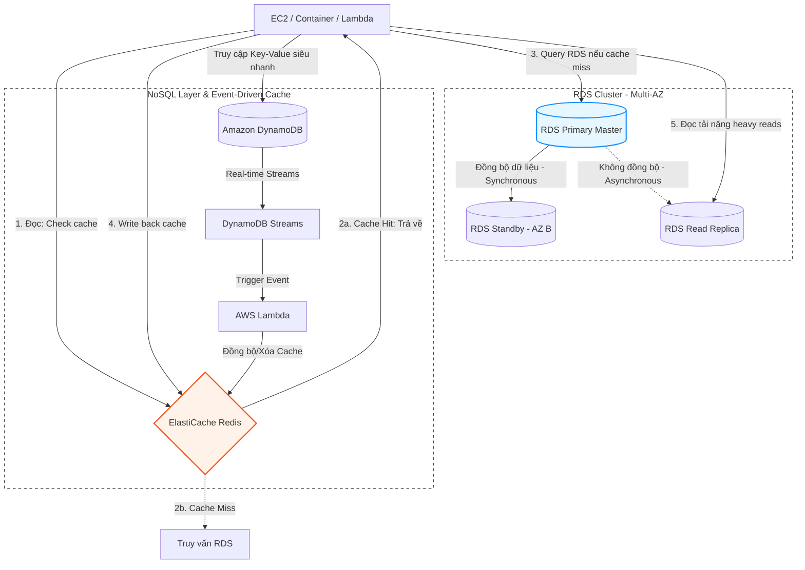

# 🗄️ Phase 4: Databases & Caching (Cơ sở dữ liệu & Bộ nhớ đệm)

Giai đoạn tối ưu hóa tầng dữ liệu (Data Tier) để đảm bảo tốc độ đọc/ghi siêu tốc, phân chia tải cho database và thiết kế cơ chế lưu trữ phân tán hiệu quả: **RDS**, **DynamoDB**, và **ElastiCache (Redis/Memcached)**.

---

## 🏛️ Sơ đồ thiết kế tầng dữ liệu (Multi-AZ RDS & Cache Integration)

---

## 🔍 Phân tích chi tiết mối quan hệ giữa các dịch vụ

### 1. Ứng dụng Compute và RDS (Quản lý Connection Pool & Security)
- **RDS Security Group:** Phải được chặn hoàn toàn, chỉ cho phép cổng kết nối của DB (như `3306` cho MySQL, `5432` cho PostgreSQL) đi vào từ **Security Group ID của EC2/ECS**.
- **RDS Proxy (Giải pháp chống tràn kết nối):**
  - Khi dùng Lambda, mỗi request sinh ra một thực thể mới, mở một kết nối TCP riêng biệt tới RDS. Nếu có 1000 Lambda chạy đồng thời, RDS sẽ bị cạn kiệt tài nguyên RAM/CPU cho việc giữ kết nối (Max Connections Limit).
  - **Mối liên kết:** Lambda kết nối thông qua **RDS Proxy**. Proxy này thực hiện "Connection Pooling" để gom hàng ngàn kết nối ảo từ Lambda và tái sử dụng một số lượng nhỏ kết nối thực tế tới RDS, giữ cho database hoạt động ổn định.

### 2. Mẫu thiết kế Cache-Aside (ElastiCache & RDS)
Đây là kiến trúc phổ biến nhất để tối ưu hóa hiệu năng hệ thống:
- **Read Path (Đường đọc):**
  1. Ứng dụng kiểm tra dữ liệu trong **ElastiCache Redis**.
  2. *Cache Hit:* Dữ liệu được trả về ngay (< 1ms).
  3. *Cache Miss:* Ứng dụng truy vấn trực tiếp từ **RDS**, trả về cho người dùng và ghi ngược dữ liệu đó vào Redis kèm theo thời gian sống (TTL - Time To Live) để lần truy vấn tiếp theo không bị miss.
- **Write Path (Đường ghi):**
  1. Ứng dụng cập nhật dữ liệu mới vào **RDS**.
  2. Ứng dụng **xóa bản ghi cache tương ứng** trong Redis. Lần đọc tiếp theo của client sẽ bị Cache Miss và ứng dụng tự động kéo dữ liệu mới nhất từ RDS lên cache.

### 3. DynamoDB, DynamoDB Streams và Caching (Đồng bộ phi tập trung)
- **DynamoDB** là CSDL NoSQL quản lý hoàn toàn (Fully Managed), phân tán trên nhiều AZ mặc định.
- **DynamoDB Streams & Lambda:** 
  - Khi có hành động thay đổi dữ liệu (Insert, Update, Delete) trên DynamoDB, một log stream thời gian thực (**DynamoDB Streams**) sẽ ghi nhận.
  - **Mối liên kết:** Log stream này kích hoạt **AWS Lambda**. Lambda đọc dữ liệu thay đổi và thực hiện cập nhật hoặc xóa cache trong **ElastiCache Redis** hoặc đồng bộ hóa chỉ mục tìm kiếm sang **Amazon OpenSearch**. Cơ chế này chạy ngầm và không làm tăng thời gian phản hồi của API chính (Decoupled Architecture).

### 4. Khả năng phục hồi dữ liệu (Backup, Restore & Multi-AZ Failover)
- **RDS Multi-AZ:** Khi cấu hình Multi-AZ, AWS duy trì một máy chủ database Standby ở một AZ khác. 
  - **Cơ chế failover:** Khi Primary bị lỗi, AWS tự động thay đổi bản ghi DNS (CNAME Endpoint) trỏ sang thực thể Standby. Ứng dụng của bạn không cần thay đổi cấu hình kết nối, chỉ cần triển khai cơ chế kết nối lại (Retry Logic).
- **DynamoDB Point-in-Time Recovery (PITR):** Cho phép bạn khôi phục dữ liệu về bất kỳ thời điểm nào trong vòng 35 ngày qua một cách chính xác từng giây, bảo vệ dữ liệu khỏi các lỗi xóa nhầm do con người hoặc lỗi ứng dụng.
