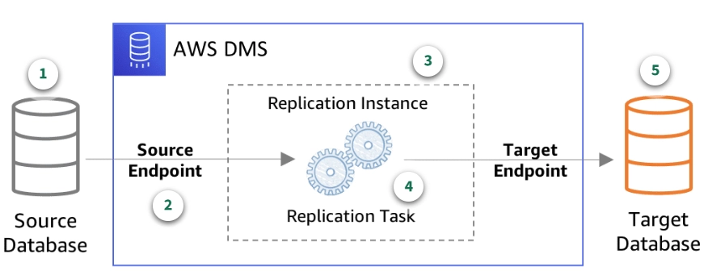

# CONCEPT 2: AWS DATABASE SERVICES

## 1. Triết lý Thiết kế: Purpose-Built Databases của AWS

Triết lý của AWS là **không dùng một cơ sở dữ liệu (database) duy nhất cho mọi bài toán**. Thay vào đó, họ cung cấp các **"purpose-built databases"** — mỗi loại được thiết kế tối ưu hóa cho một cấu trúc dữ liệu và mức độ truy cập cụ thể, giúp đạt hiệu năng, độ trễ và khả năng mở rộng tốt nhất.

Để xác định loại database phù hợp, trước tiên cần phân loại bản chất của dữ liệu:

*   **Structured Data (Dữ liệu có cấu trúc):** Dữ liệu được định nghĩa rõ ràng trong các bảng với hàng và cột cố định (Ví dụ: thông tin giao dịch ngân hàng, thông tin tài khoản). Phù hợp với **RDS, Aurora**.
*   **Semi-structured Data (Dữ liệu bán cấu trúc):** Lược đồ linh hoạt (schema-less), sử dụng các thẻ hoặc cặp key-value để định danh dữ liệu (Ví dụ: dữ liệu JSON, XML). Phù hợp với **DynamoDB, DocumentDB**.
*   **Unstructured Data (Dữ liệu phi cấu trúc):** Các tệp tin không có mô hình dữ liệu định sẵn (Ví dụ: hình ảnh, video, tệp PDF). Dữ liệu này **không lưu trực tiếp trong DB** mà lưu trên **Amazon S3** và lưu đường dẫn (URL) trong DB.

---

## 2. Nhóm Cơ sở dữ liệu Quan hệ (Relational/SQL)

Được sử dụng khi dữ liệu có cấu trúc chặt chẽ (schema cố định), yêu cầu tính toàn vẹn dữ liệu cực cao (giao dịch ACID) và thực hiện các câu lệnh truy vấn liên kết (`JOIN`) phức tạp.

### A. Tính chất ACID (Cốt lõi của SQL)
*   **Atomicity (Tính nguyên tử):** Giao dịch là "tất cả hoặc không có gì" (tất cả các bước thành công hoặc hoàn tác toàn bộ).
*   **Consistency (Tính nhất quán):** Dữ liệu luôn hợp lệ theo các ràng buộc định sẵn trước và sau giao dịch.
*   **Isolation (Tính cô lập):** Các giao dịch thực hiện đồng thời độc lập với nhau, không gây sai lệch dữ liệu chéo.
*   **Durability (Tính bền vững):** Khi đã xác nhận (commit), dữ liệu sẽ được lưu vĩnh viễn dù hệ thống có gặp sự cố.

### B. Phân tích chi tiết các dịch vụ chủ chốt

#### Amazon RDS (Relational Database Service)
Dịch vụ cơ sở dữ liệu quan hệ được AWS quản lý tự động (Managed Service).
*   **Cơ chế hoạt động:** RDS chạy trên các EC2 Instance được AWS quản lý và ẩn đi đối với người dùng. Dữ liệu được lưu trữ trên các ổ cứng **Amazon EBS (Elastic Block Store)** gắn trực tiếp vào server đó.
*   **High Availability (Multi-AZ):** 
    *   AWS sẽ tự động triển khai thêm một **Standby Instance** (thực thể dự phòng) ở một Availability Zone (AZ) khác.
    *   Mọi thao tác ghi ở DB chính (Primary) sẽ được sao chép **đồng bộ (Synchronous Replication)** sang Standby Instance. Cơ chế này đảm bảo dữ liệu ở hai bên luôn trùng khớp tuyệt đối trước khi báo ghi thành công cho ứng dụng.
    *   **Failover (Khôi phục sự cố):** Nếu Primary sập (do lỗi phần cứng, mất điện AZ), AWS sẽ cập nhật bản ghi DNS của DB Endpoint trỏ sang IP của Standby Instance. Quá trình failover tự động này diễn ra trong khoảng **30 - 60 giây** mà không làm thay đổi Connection String của ứng dụng.
*   **Read Replicas (Bản sao chỉ đọc):**
    *   Hỗ trợ tối đa **5 Read Replicas** để giảm tải đọc cho DB chính.
    *   Cơ chế sao chép là **không đồng bộ (Asynchronous Replication)**. Do đó, có khả năng xảy ra độ trễ sao chép (replication lag) trong các khoảng thời gian tải cao.
    *   Mỗi Read Replica chạy trên một EC2 và có ổ đĩa EBS riêng. Nếu DB chính sập, bạn có thể thăng cấp (promote) một Read Replica thành một database độc lập mới (nhưng có thể mất một phần dữ liệu do cơ chế không đồng bộ).

  

<i> Hình 1: Cơ chế Read Replicas của Amazon RDS để giảm tải đọc </i>

#### Amazon Aurora
Giải pháp cơ sở dữ liệu quan hệ cao cấp thế hệ mới, được AWS thiết kế tối ưu hóa 100% cho môi trường đám mây (Cloud-Native), tương thích hoàn toàn với MySQL và PostgreSQL.

*   **Tách biệt Compute & Storage (Kiến trúc Cloud-Native):**
    *   Khác với RDS (gắn cứng EBS vào máy chủ), Aurora tách biệt hoàn toàn lớp tính toán (Database Instance làm nhiệm vụ chạy câu lệnh SQL) và lớp lưu trữ (Shared Storage Volume dùng chung cho cả cluster).
    *   Khi ghi dữ liệu, thay vì gửi cả block dữ liệu lớn qua mạng, Aurora chỉ gửi các **Log Records (redo logs)** trực tiếp xuống lớp lưu trữ. Điều này giúp giảm thiểu đáng kể băng thông mạng và tăng tốc độ ghi gấp **5 lần** so với MySQL tiêu chuẩn và **3 lần** so với PostgreSQL tiêu chuẩn.
*   **Lớp lưu trữ chia sẻ tự phục hồi (Shared Storage Volume):**
    *   Dữ liệu được lưu trong một **Cluster Volume ảo** được xây dựng trên hàng trăm ổ đĩa SSD liên kết.
    *   Dung lượng lưu trữ tự động co giãn (auto-scale) khi dữ liệu tăng lên mà không cần cấu hình trước hay làm gián đoạn hệ thống, tối đa lên tới **128 TiB**.
    *   Dữ liệu được tự động nhân bản thành **6 bản sao** trải đều trên **3 Availability Zones (AZs)** (mỗi AZ lưu 2 bản sao).
    *   **Cơ chế Quorum:** Để đảm bảo tính nhất quán, Aurora yêu cầu **4/6 bản sao** xác nhận ghi thành công và **3/6 bản sao** để đọc thành công. Nếu một ổ đĩa hoặc toàn bộ 1 AZ bị sập, Aurora tự động quét và sửa lỗi (self-healing) dựa trên các bản sao còn lại mà không ảnh hưởng hiệu năng.
*   **Khả năng mở rộng đọc (Read Scalability):**
    *   Hỗ trợ tối đa lên tới **15 Read Replicas**.
    *   Do tất cả các Replicas đều đọc chung từ một lớp lưu trữ **Shared Storage Volume**, các Replicas này không cần lưu trữ dữ liệu riêng. Cơ chế sao chép diễn ra ở tầng RAM của các instance, giảm độ trễ sao chép xuống mức tối thiểu (thường **< 10ms**).
*   **Failover siêu tốc:** 
    *   Nếu Primary Instance bị sập, Aurora sẽ tự động chọn một trong các Read Replicas để thăng cấp lên làm Primary.
    *   Do dùng chung lớp lưu trữ, không cần sao chép hay đồng bộ lại dữ liệu của đĩa. Quá trình failover diễn ra cực nhanh, thường **dưới 30 giây** (thậm chí dưới 12 giây nếu ứng dụng sử dụng driver thông minh của AWS).
*   **Aurora Serverless (v2):** Tự động scale tài nguyên tính toán (CPU & RAM) theo thời gian thực để đáp ứng lượng traffic trồi sụt, tối ưu hóa chi phí.
*   **Aurora Global Database:** Tự động sao chép không đồng bộ dữ liệu sang các Region phụ với độ trễ < 1 giây, phục vụ bài toán khôi phục thảm họa toàn cầu (Disaster Recovery).

---

### C. So sánh chuyên sâu: RDS vs Amazon Aurora

Để giúp bạn lựa chọn đúng giải pháp cho bài toán thiết kế hệ thống, dưới đây là bảng so sánh chi tiết giữa hai dịch vụ:

| Tiêu chí | Amazon RDS | Amazon Aurora |
| :--- | :--- | :--- |
| **Kiến trúc lưu trữ** | Gắn ổ đĩa EBS độc lập cho từng instance. | Shared Storage Volume ảo dùng chung, tách biệt Compute. |
| **Dung lượng lưu trữ** | Phải cấu hình trước dung lượng (Tối đa 64 TB). | Tự động mở rộng theo nhu cầu (Tối đa 128 TB). |
| **Cơ chế sao lưu (Backup)** | Gây ảnh hưởng nhẹ đến hiệu năng (I/O) nếu không dùng Multi-AZ. | Hoàn toàn không ảnh hưởng đến hiệu năng (backup trực tiếp từ lớp storage lên S3). |
| **Nhân bản (Replication)** | Tối đa 5 Read Replicas. Có độ trễ sao chép (replication lag). | Tối đa 15 Read Replicas. Độ trễ cực thấp (< 10ms). |
| **Tốc độ Failover** | Từ 30 đến 60 giây (Cập nhật DNS). | Thường dưới 30 giây (Không cần chuyển dịch dữ liệu ổ đĩa). |
| **Khả năng chịu lỗi** | Mất Primary thì chuyển sang Standby (Multi-AZ). | Tự động nhân bản 6 bản sao trên 3 AZ. Tự sửa lỗi dữ liệu. |
| **Hỗ trợ Engine** | Rộng rãi (MySQL, PostgreSQL, MariaDB, Oracle, SQL Server). | Chỉ tương thích với MySQL và PostgreSQL. |
| **Chi phí** | Phù hợp với tải nhỏ/vừa, chi phí dự đoán được trước. | Chi phí cơ bản cao hơn một chút, tối ưu cho tải Enterprise lớn nhờ giảm I/O. |

---

## 3. Nhóm NoSQL (Key-Value & Document)

Được sử dụng khi bạn cần tính linh hoạt tối đa trong cấu trúc dữ liệu (schema-less) hoặc yêu cầu khả năng mở rộng ngang (Horizontal Scaling) vô hạn để chịu tải lượng traffic cực lớn với độ trễ cực thấp.

### A. Chi tiết các dịch vụ chủ chốt

#### Amazon DynamoDB (Key-Value)
Database dạng Key-Value chuẩn Serverless hàng đầu của AWS.
*   **Đặc điểm:** Mang lại tốc độ phản hồi cực nhanh, tính bằng mili giây một con số (single-digit millisecond latency) ở bất kỳ quy mô dữ liệu nào (hàng Terabyte hay Petabyte).
*   **Cơ chế khóa chính (Primary Key):**
    *   **Partition Key (Hash Key - Bắt buộc):** Đi qua hàm băm (Hash Function) để quyết định phân vùng vật lý (Partition) nào sẽ lưu trữ dữ liệu. Khi truy vấn, bạn bắt buộc phải cung cấp Partition Key để hệ thống trỏ thẳng tới phân vùng chứa dữ liệu.
    *   **Sort Key (Range Key - Tùy chọn):** Dùng để sắp xếp dữ liệu có cùng Partition Key, hỗ trợ truy vấn dải (range query) hoặc so sánh (`>`, `<`, `between`).
*   **DynamoDB Accelerator (DAX):** Bộ nhớ đệm in-memory tích hợp sẵn cho DynamoDB, giúp giảm độ trễ truy vấn từ mili giây xuống **micro giây** cho các ứng dụng có lượng đọc cực kỳ lớn.
*   **Cơ chế hoạt động & Scale đa vùng (DynamoDB Global Tables):**
    *   **Hoạt động dựa trên DynamoDB Streams:** Khi một bản ghi được ghi cục bộ vào Region A, sự thay đổi được ghi nhận tức thì vào Stream của bảng.
    *   **Sao chép không đồng bộ:** Các tác nhân nhân bản chạy ngầm (Replication Agents) của AWS liên tục đọc Stream này và đẩy thay đổi sang các Region khác (Region B, C...) với độ trễ dưới 1 giây.
    *   **Đa hoạt động Active-Active (Multi-Region Write):** Cho phép ghi trực tiếp lên bất kỳ Region nào, hệ thống tự động đồng bộ chéo.
    *   **Giải quyết xung đột LWW (Last Writer Wins):** Nếu có 2 bản ghi trùng lặp diễn ra đồng thời ở 2 Region, DynamoDB dựa vào timestamp ở mức độ mili giây (mili-second timestamp) để giữ lại bản ghi mới nhất.
    *   **Đồng bộ phân tách phân vùng (Partition Auto-Split):** Khi dung lượng lưu trữ cục bộ lớn hơn 10 GB hoặc traffic vượt ngưỡng, DynamoDB tự động chia nhỏ phân vùng đĩa (Partition Split). Quá trình này tự động đồng bộ trên toàn bộ các Region để giữ hiệu năng đồng đều.

  

<i> Hình 2: DynamoDB Global Tables - Cơ chế sao chép đa vùng Active-Active </i>

#### Amazon DocumentDB (Document)
Dịch vụ lưu trữ dữ liệu dưới dạng tài liệu JSON-like, tương thích hoàn toàn với MongoDB API.
*   **Trường hợp sử dụng:** Lý tưởng khi phát triển ứng dụng lưu trữ hồ sơ người dùng (user profile), danh mục sản phẩm phức tạp, hoặc hệ thống quản lý nội dung (CMS).
*   **Đích đến di chuyển (Migration Target):** Nếu doanh nghiệp đang vận hành hệ thống chạy trên MongoDB (ví dụ: MongoDB Atlas) và muốn chuyển dịch (migrate) hoàn toàn lên đám mây AWS để dễ dàng tích hợp và bảo mật tốt hơn, DocumentDB chính là lựa chọn tiêu chuẩn.
*   **Khóa chính trong DocumentDB (`_id`):**
    *   Mọi document bắt buộc phải có một trường tên là **`_id`** làm khóa chính để định danh duy nhất.
    *   Nếu ứng dụng không truyền trường này khi chèn (Insert), DocumentDB tự động sinh một mã `ObjectId` ngẫu nhiên duy nhất để gán vào.
    *   **Linh hoạt truy vấn:** Khác với DynamoDB (bắt buộc phải query qua Partition Key), DocumentDB cho phép bạn truy vấn bằng bất cứ trường dữ liệu nào (ví dụ: `email`, `status`) mà không bắt buộc phải truyền khóa chính `_id`.

---

### B. So sánh chuyên sâu cơ chế lõi: DynamoDB vs DocumentDB

Mặc dù cùng thuộc nhóm NoSQL, cơ chế vận hành hệ thống và quản lý tài nguyên bên dưới của hai dịch vụ này hoàn toàn khác biệt:

| Tiêu chí | Amazon DynamoDB | Amazon DocumentDB |
| :--- | :--- | :--- |
| **Mô hình dữ liệu** | Key-Value / Wide-Column. | Document (JSON / BSON lồng nhau). |
| **Hạ tầng cơ bản** | **Serverless hoàn toàn**. Bạn chỉ làm việc với bảng dữ liệu, AWS tự động ẩn và quản lý hạ tầng bên dưới. | **Cluster-based (Kiến trúc tương tự Aurora)**. Bạn cần chọn loại Compute Instance (CPU/RAM) và quản lý số lượng node. |
| **Cơ chế lưu trữ (Storage)** | **Phân tán độc lập (Shared-Nothing)**. Dữ liệu chia nhỏ thành hàng ngàn phân vùng đĩa SSD độc lập và nhân bản 3 bản sao ở các AZ. | **Lưu trữ dùng chung (Shared Storage)**. Tách biệt hoàn toàn CPU xử lý và dùng chung một ổ đĩa ảo Cluster Volume (replicate 6 bản sao trên 3 AZ). |
| **Cơ chế nhân bản (Replication)** | Thực hiện ở cấp độ phân vùng vật lý. Các chỉ mục phụ (GSI) bản chất là bảng vật lý riêng biệt được đồng bộ bất đồng bộ. | Các Replica Compute node không có ổ đĩa riêng, trỏ chung vào Cluster Volume. Dữ liệu thay đổi được đồng bộ qua RAM với độ trễ cực thấp (< 10ms). |
| **Khả năng truy vấn (Query)** | Đơn giản. Phải biết trước access patterns để thiết kế khóa chính. Truy vấn phi-khóa rất tốn kém (Scan/GSI). | Rất mạnh mẽ. Hỗ trợ ad-hoc query linh hoạt và Aggregation Pipeline phức tạp trên mọi trường JSON. |
| **Khả năng mở rộng (Scale)** | Tự động mở rộng ngang (Horizontal Scale Out) không giới hạn bằng cách tăng số lượng phân vùng vật lý. | Scale dọc (Vertical Scale Up) bằng cách nâng cấp cấu hình Instance hoặc scale ngang khả năng đọc bằng cách thêm tối đa 15 replica nodes. |
| **Scale đa vùng** | Active-Active toàn cầu qua Global Tables. | Active-Passive qua DocumentDB Global Clusters. |

---

## 4. Nhóm Phân tích và Big Data (Analytics)

Chuyên dụng cho các hệ thống OLAP (Online Analytical Processing) - xử lý các truy vấn phân tích phức tạp trên tập dữ liệu lịch sử khổng lồ.

### Amazon Redshift (Data Warehouse)
Hệ thống Kho dữ liệu (Data Warehouse) quy mô Petabyte trên Cloud.
*   **Bản chất:** Sử dụng cơ chế **Columnar Storage** (lưu trữ theo cột) thay vì theo hàng như RDS giúp nén dữ liệu cực tốt và tối ưu hóa các truy vấn phân tích cột (ví dụ: Tính tổng doanh thu của cả năm).
*   **Tính năng Zero-ETL:** Hỗ trợ đẩy trực tiếp dữ liệu từ Amazon Aurora hoặc Amazon DynamoDB sang Redshift theo thời gian thực mà không cần xây dựng các pipeline ETL (Extract, Transform, Load) phức tạp.
*   **Redshift Serverless:** Tự động scale dung lượng phân tích dựa trên khối lượng công việc truy vấn, không cần quản lý cluster.

---

## 5. Các nhóm chuyên biệt khác (Specialized Databases)

### Amazon ElastiCache (In-memory)
Dịch vụ lưu trữ dữ liệu trực tiếp trên bộ nhớ RAM, mang lại tốc độ truy cập ở mức **micro giây**.
*   **Redis Engine:** Hỗ trợ cấu trúc dữ liệu phức tạp (Lists, Sets, Sorted Sets), tính năng bền vững dữ liệu (persistence), pub/sub và tính sẵn sàng cao.
*   **Memcached Engine:** Đơn giản hơn, chuyên dùng làm cache phẳng cho key-value nhỏ, không yêu cầu độ bền vững cao.
*   **Trường hợp sử dụng:** Làm bộ nhớ đệm (caching) giảm tải cho DB quan hệ, lưu trữ session (Session Store), hoặc bảng xếp hạng game (Leaderboards) thời gian thực.

### Amazon Neptune (Graph)
Dịch vụ cơ sở dữ liệu đồ thị được quản lý hoàn toàn, tối ưu hóa cho dữ liệu có mối liên hệ chằng chịt, phức tạp.
*   **Thành phần:** Gồm các nút (entities) và các cạnh (relationships) liên kết các nút.
*   **Ngôn ngữ hỗ trợ:** Gremlin, openCypher (tương thích Neo4j), và SPARQL.
*   **Trường hợp sử dụng:** Hệ thống gợi ý (recommendation engines), phát hiện gian lận tài chính (fraud detection), và mạng xã hội.

### Amazon Timestream (Time-series)
Cơ sở dữ liệu chuỗi thời gian (Time-series) không máy chủ (Serverless), chuyên thu thập và xử lý hàng nghìn tỷ sự kiện mỗi ngày theo trình tự thời gian.
*   **Đặc điểm:** Tự động phân lớp dữ liệu (lưu dữ liệu gần đây trên RAM để truy vấn nhanh, đẩy dữ liệu cũ xuống Storage giá rẻ để tối ưu chi phí).
*   **Trường hợp sử dụng:** Lưu trữ dữ liệu cảm biến IoT, log hệ thống ứng dụng, và clickstream của người dùng.

### Các dịch vụ bổ sung khác
*   **Amazon Ledger (QLDB):** Cơ sở dữ liệu sổ cái có tính năng mã hóa, bất biến (immutable), không thể thay đổi dữ liệu lịch sử. Phù hợp cho chuỗi cung ứng, hệ thống tài chính cần audit log tuyệt đối an toàn.
*   **Amazon Keyspaces:** Dịch vụ cơ sở dữ liệu Apache Cassandra tương thích hoàn toàn, không máy chủ.

---

## 6. Ma trận quyết định chọn Cơ sở dữ liệu AWS (Decision Matrix)

Công cụ dưới đây giúp bạn đối chiếu nhanh các yêu cầu của hệ thống để chọn đúng dịch vụ database trên AWS:

| Loại cấu trúc dữ liệu | Yêu cầu hiệu năng/Tính chất | Trường hợp sử dụng tiêu biểu | Dịch vụ AWS khuyến nghị |
| :--- | :--- | :--- | :--- |
| **Structured (Bảng quan hệ)** | Giao dịch ACID, truy vấn `JOIN` phức tạp | Giao dịch tài chính, ERP, CRM, Thương mại điện tử | **Amazon RDS** hoặc **Amazon Aurora** |
| **Key-Value (Khóa - Giá trị)** | Độ trễ mili giây một con số ở quy mô cực lớn | Giỏ hàng e-commerce, cấu hình ứng dụng, metadata | **Amazon DynamoDB** |
| **JSON/Document (Tài liệu)** | Schema linh hoạt, truy vấn phân cấp cấu trúc | Hồ sơ người dùng, CMS, migrate từ MongoDB | **Amazon DocumentDB** |
| **In-Memory (Bộ nhớ RAM)** | Độ trễ micro giây, giảm tải cho DB chính | Session store, Cache DB, Leaderboard game | **Amazon ElastiCache** (Redis/Memcached) |
| **Graph (Mối quan hệ đồ thị)** | Truy vấn mối quan hệ đa tầng, liên kết chằng chit | Phát hiện gian lận, mạng xã hội, gợi ý kết bạn | **Amazon Neptune** |
| **Time-Series (Chuỗi thời gian)** | Ghi tốc độ cao, phân tích dữ liệu theo trình tự thời gian | Log hệ thống, dữ liệu cảm biến IoT, clickstream | **Amazon Timestream** |
| **Analytical/Columnar (Theo cột)** | Phân tích OLAP trên hàng Petabyte dữ liệu | Kho dữ liệu (Data Warehouse), báo cáo BI | **Amazon Redshift** |
| **Immutable Ledger (Sổ cái)** | Bất biến, lưu trữ vết lịch sử không thể sửa xóa | Lịch sử giao dịch ngân hàng, theo dõi chuỗi cung ứng | **Amazon QLDB** (hoặc Sổ cái quản lý) |

---

## 7. Di chuyển Cơ sở dữ liệu lên AWS (Database Migration)

Khi cần dịch chuyển cơ sở dữ liệu từ On-premises hoặc các cloud khác lên AWS, hai công cụ sau được sử dụng kết hợp:

1.  **AWS Schema Conversion Tool (SCT):** 
    *   **Chức năng:** Tự động chuyển đổi cấu trúc lược đồ (schema), view, trigger, stored procedure từ database nguồn sang định dạng tương thích với database đích trên AWS (Ví dụ: Chuyển đổi Oracle PL/SQL sang Aurora PostgreSQL pgSQL).
2.  **AWS Database Migration Service (DMS):**
    *   **Chức năng:** Thực hiện việc sao chép dữ liệu thực tế từ nguồn sang đích.
    *   **Ưu điểm:** Hỗ trợ tính năng di chuyển liên tục (Continuous Data Replication) bằng CDC (Change Data Capture). Database nguồn vẫn hoạt động bình thường trong suốt quá trình đồng bộ, giúp hệ thống đạt downtime gần như bằng 0 (Near-Zero Downtime) khi cắt chuyển (cutover).

  

<i> Hình 3: Quy trình di chuyển cơ sở dữ liệu với AWS DMS </i>

---

## 8. So sánh Kiến trúc: Server-Based vs Serverless

| Đặc điểm | Server-Based (Provisioned) | Serverless |
| :--- | :--- | :--- |
| **Quản lý tài nguyên** | Chọn cấu hình CPU, RAM, dung lượng ổ đĩa cố định | AWS tự động quản lý và phân bổ tài nguyên |
| **Mô hình chi phí** | Trả tiền theo giờ hoạt động của instance (dù có dùng hay không) | Chỉ trả tiền cho dung lượng lưu trữ và số request thực tế |
| **Khả năng co giãn** | Phải cấu hình auto-scaling hoặc nâng cấp instance thủ công | Tự động tăng/giảm quy mô theo tải thực tế (thậm chí về 0) |
| **Dịch vụ đại diện** | Amazon RDS, Redshift Provisioned, ElastiCache | DynamoDB, Aurora Serverless v2, Timestream |
