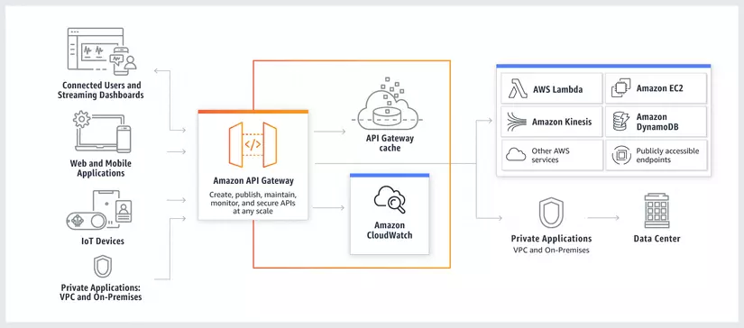
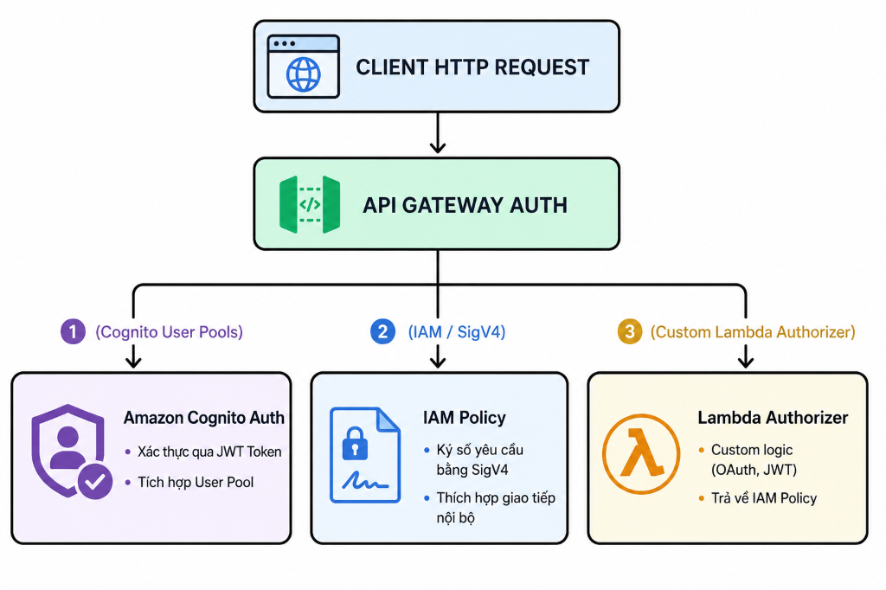

# 🌐 Amazon API Gateway — Deep Dive API Management

> **Amazon API Gateway** là một dịch vụ được quản lý hoàn toàn (Fully Managed Service) của AWS giúp các lập trình viên dễ dàng tạo, xuất bản, duy trì, giám sát và bảo mật các API ở mọi quy mô. Nó đóng vai trò là "cửa trước" (front door) tiếp nhận toàn bộ các yêu cầu gọi API từ ứng dụng khách, sau đó định tuyến và phân phối đến các dịch vụ backend một cách an toàn và hiệu quả.

---

## 1. Vai trò của API Gateway trong Hệ thống

Khi xây dựng kiến trúc Microservices hoặc Serverless, các ứng dụng khách (Mobile App, Web App, IoT...) cần tương tác với hàng chục dịch vụ backend khác nhau. Nếu kết nối trực tiếp sẽ dẫn đến sự phụ thuộc lớn, phức tạp trong việc xác thực, và khó kiểm soát lưu lượng.

API Gateway giải quyết vấn đề này bằng cách làm **lớp trung gian duy nhất**:

*   **Tính sẵn sàng cao & Auto-scale:** Tự động co giãn để xử lý hàng trăm nghìn API requests đồng thời tại một thời điểm mà không cần quản trị hạ tầng.
*   **Bóc tách & Chuyển đổi dữ liệu:** Bóc tách thông tin đầu vào từ Path Parameter, Query String, Headers, Request Body để chuyển tiếp đến backend. Hỗ trợ thay đổi định dạng dữ liệu trả về cho client.
*   **Tích hợp đa dạng:** Định tuyến yêu cầu đến AWS Lambda, các máy chủ EC2, container chạy trong cụm ECS, endpoint công khai (HTTP endpoints) hoặc trực tiếp đến các dịch vụ AWS khác (như ghi thẳng dữ liệu vào Kinesis, DynamoDB, S3).

---

## 2. Phân loại các Loại API trong API Gateway

Amazon API Gateway hỗ trợ 3 loại hình thiết lập API chính phù hợp với từng nhu cầu nghiệp vụ:

### A. HTTP APIs
*   **Mục đích:** Thiết kế tối giản, chuyên dùng để xây dựng các API RESTful với hiệu năng cực cao và độ trễ cực thấp.
*   **Đặc điểm:** Tối ưu hóa chi phí (rẻ hơn đến 70% so với REST API), hỗ trợ xác thực qua OIDC/OAuth 2.0 và JWT bản xứ.

### B. REST APIs
*   **Mục đích:** Cung cấp đầy đủ các tính năng quản lý API nâng cao cấp doanh nghiệp (Enterprise-grade).
*   **Đặc điểm:** Tích hợp sâu với tường lửa AWS WAF, quản lý khóa truy cập (API Keys) & Usage Plans, xác thực bằng IAM (SigV4), tùy biến ánh xạ dữ liệu (Mapping Templates), và hỗ trợ Endpoint Private trong VPC.

### C. WebSocket APIs
*   **Mục đích:** Xây dựng các ứng dụng giao tiếp hai chiều thời gian thực (Real-time, Full-duplex) như ứng dụng chat, bảng điều khiển cập nhật trực tiếp (dashboard), hay game nhiều người chơi.
*   **Đặc điểm:** Duy trì một kết nối liên tục (persistent connection) giữa Client và API Gateway. Khi có dữ liệu mới, server có thể chủ động đẩy về client mà không cần client phải gửi request thăm dò (polling).

---

## 3. Sơ đồ kiến trúc & Cơ chế hoạt động

Luồng đi của dữ liệu từ ứng dụng client qua API Gateway đến các dịch vụ backend được mô tả qua kiến trúc sau:

<i> Sơ đồ tích hợp toàn diện của Amazon API Gateway với các dịch vụ backend </i>

### Các loại Endpoint của API Gateway:
1.  **Edge-Optimized Endpoints (Tối ưu hóa Biên):**
    *   Sử dụng mạng lưới **Amazon CloudFront** để định tuyến lưu lượng truy cập qua các Edge Location gần người dùng nhất, giảm thiểu độ trễ mạng quốc tế. Phù hợp cho các ứng dụng có người dùng trải rộng toàn cầu.
2.  **Regional Endpoints (Khu vực):**
    *   API được triển khai trực tiếp tại một Region cụ thể. Phù hợp khi người dùng cuối nằm trong cùng khu vực địa lý với backend, hoặc khi bạn tự quản lý CDN riêng (như Cloudflare, Akamai) đứng trước API Gateway.
3.  **Private Endpoints (Nội bộ):**
    *   API chỉ có thể truy cập được từ bên trong mạng nội bộ **VPC** của bạn thông qua cổng kết nối **Interface VPC Endpoints (AWS PrivateLink)**. Đảm bảo an toàn tuyệt đối cho các dịch vụ nội bộ không muốn lộ diện ra internet.

---

## 4. Quản lý lưu lượng và Thắt cổ chai (Throttling)

Để tránh việc hệ thống backend bị quá tải (DDoS) hoặc kiểm soát chi phí gọi dịch vụ quá lớn, API Gateway sử dụng thuật toán **Token Bucket** để giới hạn số lượng request.

Có hai tham số cấu hình chính:
*   **Rate (Tốc độ):** Số lượng yêu cầu (requests) tối đa được phép đi qua API Gateway trong mỗi giây (ví dụ: 100 requests/giây).
*   **Burst (Bùng nổ):** Dung lượng tối đa của "bucket" chứa token tại một thời điểm cụ thể (cho phép xử lý đột biến lượng request vượt quá Rate trong tích tắc).

> [!WARNING]  
> Nếu tốc độ hoặc dung lượng yêu cầu gửi lên từ Client vượt quá giới hạn **Rate** hoặc **Burst**, API Gateway sẽ tự động chặn request và phản hồi lỗi **`HTTP 429 Too Many Requests`**.

### Các cấp độ cấu hình Throttling:
*   *Account-level:* Giới hạn mặc định trên toàn bộ tài khoản ở một Region cụ thể (mặc định là 10,000 rps).
*   *Stage-level:* Giới hạn áp dụng cho từng môi trường (như Dev, Prod).
*   *Method-level:* Giới hạn riêng cho từng Method HTTP cụ thể (ví dụ: method `GET` cho phép 1000 rps, nhưng method `POST` ghi dữ liệu chỉ cho phép 50 rps).
*   *Client-level (API Keys):* Giới hạn riêng cho từng đối tượng khách hàng sử dụng API Key tương ứng.

---

## 5. Xác thực và Phân quyền (Authentication & Authorization)

API Gateway cung cấp 3 cơ chế xác thực chính để bảo vệ tài nguyên hệ thống:

<i> Sơ đồ 3 cơ chế xác thực chính của Amazon API Gateway </i>

1.  **Amazon Cognito User Pools:**
    *   Tích hợp trực tiếp với dịch vụ định danh Cognito của AWS. Người dùng đăng nhập qua Cognito sẽ nhận được một thẻ mã hóa **JWT Token**. API Gateway sẽ tự động kiểm tra tính hợp lệ của token này trước khi cho phép yêu cầu đi tiếp.
2.  **AWS IAM Authorization (SigV4):**
    *   Sử dụng cơ chế ký số Signature Version 4 của AWS. Yêu cầu HTTP phải được ký bằng cặp Access Key/Secret Key của IAM User/Role. Rất thích hợp cho các ứng dụng di động gốc sử dụng Cognito Federated Identities hoặc giao tiếp an toàn giữa các dịch vụ nội bộ AWS với nhau.
3.  **AWS Lambda Authorizers (Custom Authorizers):**
    *   Cơ chế linh hoạt nhất. API Gateway sẽ chuyển token xác thực (ví dụ Bearer token, Cookie) sang một hàm Lambda đặc biệt do bạn tự viết. Hàm Lambda này sẽ phân tích token, kết nối database kiểm tra quyền, và trả về một **IAM Policy** cho biết client có quyền gọi method đó hay không. Kết quả IAM Policy này có thể được lưu trữ (cached) để tránh gọi hàm Lambda authorizer liên tục.

---

## 6. Khóa truy cập (API Keys) & Kế hoạch sử dụng (Usage Plans)

Tính năng này giúp bạn vận hành hệ thống API như một sản phẩm thương mại (SaaS) và phân phối quyền sử dụng cho đối tác:

*   **API Keys (Khóa API):** Là một chuỗi ký tự ngẫu nhiên được cấp phát cho từng khách hàng cụ thể. Khách hàng phải đính kèm key này vào header `x-api-key` trong mỗi request.
*   **Usage Plans (Kế hoạch sử dụng):** Thiết lập quy định về:
    *   *Throttling:* Tốc độ gọi (Rate & Burst) dành riêng cho nhóm khách hàng này.
    *   *Quota (Hạn ngạch):* Tổng số lượng request tối đa được phép gọi trong ngày, tuần hoặc tháng (ví dụ: Gói Basic chỉ được gọi tối đa 10,000 request/tháng).
*   **Liên kết hoạt động:** Khách hàng (API Key) được gán vào một Usage Plan cụ thể. API Gateway sẽ tự động theo dõi, giới hạn và báo cáo lưu lượng sử dụng của từng khách hàng.

---

## 7. Quy trình Phát triển và Triển khai API

### A. API Stages & Deployments
*   Mỗi lần thay đổi cấu hình API (thêm path, đổi HTTP method), bạn phải thực hiện một hành động **Deploy** để lưu lại một bản chụp bất biến (Deployment Snapshot).
*   **Stages (Giai đoạn):** Là các môi trường cụ thể chứa bản Deploy đó. Bạn có thể định nghĩa nhiều Stage khác nhau (như `dev`, `test`, `prod`) chạy song song, mỗi Stage trỏ đến một phiên bản Deploy cấu hình và trỏ đến backend tương ứng.

### B. Canary Releases (Triển khai Canary)
*   Tính năng cho phép bạn triển khai một bản cấu hình API mới bên cạnh phiên bản cũ trên cùng một Stage và cấu hình tỷ lệ phân phối lưu lượng (ví dụ: chỉ chuyển 5% lượng traffic của người dùng sang bản API mới để theo dõi lỗi, 95% còn lại vẫn chạy bản API cũ ổn định). Khi đã chắc chắn bản mới hoạt động tốt, bạn nâng tỷ lệ lên 100% để hoàn tất cập nhật.

### C. Swagger / OpenAPI Integration & SDK Generation
*   **Nhập/Xuất API:** Hỗ trợ nhập (Import) hoặc xuất (Export) toàn bộ cấu trúc định nghĩa API dưới dạng file tiêu chuẩn **OpenAPI (Swagger)**, giúp đồng bộ nhanh tài liệu API với các công cụ phát triển local (như Postman).
*   **Tự động sinh SDK:** Cho phép tự động sinh ra thư viện mã nguồn (SDK) bằng các ngôn ngữ phổ biến (Android, iOS/Swift, JavaScript, Java, Ruby) dựa trên định nghĩa API của bạn, giúp việc tích hợp trên ứng dụng client trở nên vô cùng nhanh chóng.

---

## 8. Các liên kết liên quan trong hệ thống

Để củng cố kiến thức về Serverless Compute và các dịch vụ bổ trợ phân phối dữ liệu đi kèm, hãy tham khảo các tài liệu sau:
*   [Lambda_Serverless.md](Lambda_Serverless.md): Tìm hiểu cách viết và vận hành mã nguồn backend Serverless kết nối với API Gateway.
*   [ECS_ECR.md](ECS_ECR.md): Tìm hiểu giải pháp điều phối Container (ECS) đứng đằng sau API Gateway thông qua các VPC Links nội bộ.
*   [database_service.md](../04_Databases_Caching/database_service.md): Tìm hiểu giải pháp thiết kế cơ sở dữ liệu quan hệ (RDS) và NoSQL (DynamoDB) kết nối từ ứng dụng backend.
*   [ElastiCache.md](../04_Databases_Caching/ElastiCache.md): Ứng dụng Redis/Memcached làm cache đệm giảm tải cho ứng dụng web.
*   [CloudFront_CDN.md](../03_Storage_ContentDelivery_SES/CloudFront_CDN.md): Giải pháp phân phối nội dung và bảo mật nâng cao tại các Edge Location toàn cầu.

---
*(Tài liệu được biên soạn dựa trên AWS API Gateway Developer Guide và bài viết phân tích chuyên sâu về API Gateway từ Viblo).*
