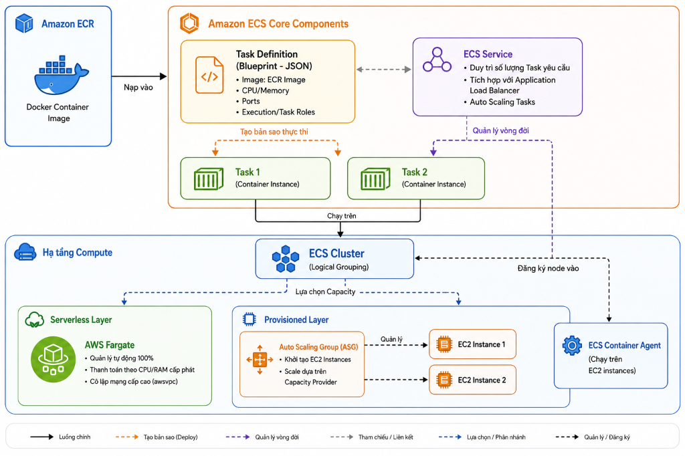
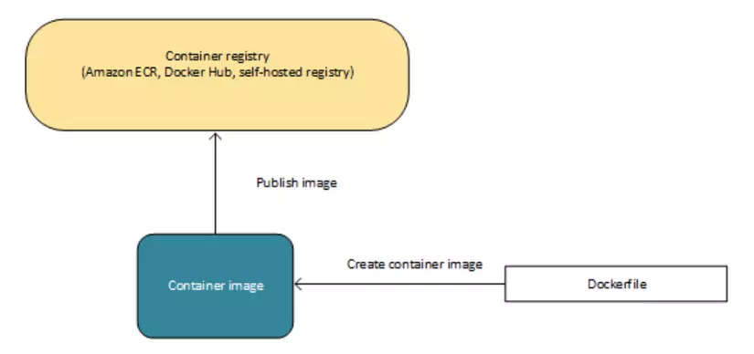
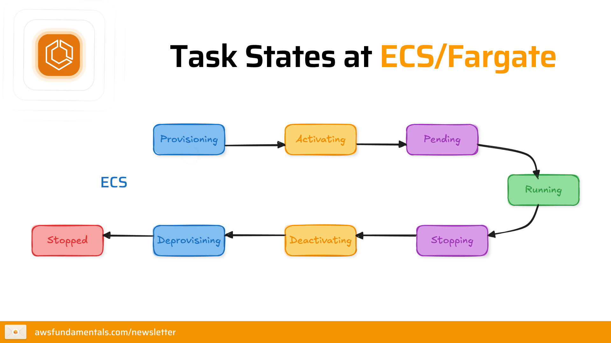
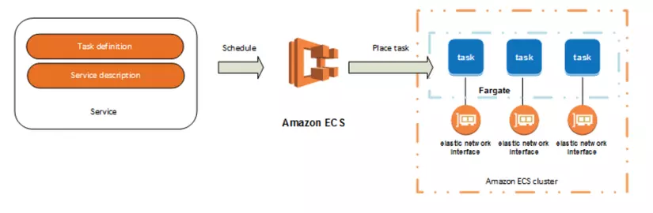
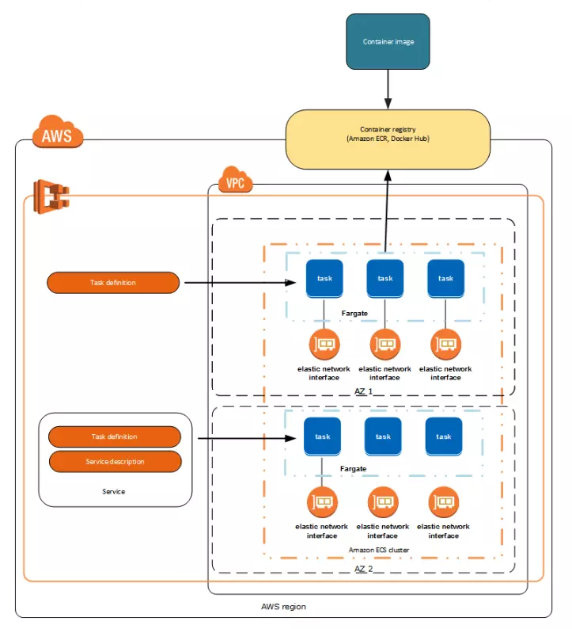

# 🐳 Amazon ECS & ECR — Deep Dive Container Orchestration

> **Amazon Elastic Container Service (ECS)** là dịch vụ điều phối container (Container Orchestration) có tính sẵn sàng cao, hiệu năng mạnh mẽ và khả năng mở rộng quy mô cực kỳ linh hoạt do AWS cung cấp. Dịch vụ này giúp đơn giản hóa việc chạy, dừng và quản lý các Docker Container trên một cụm máy chủ ảo (Cluster).
>
> Đi đôi với ECS là **Amazon Elastic Container Registry (ECR)** — dịch vụ lưu trữ và quản lý các Docker Container Images an toàn và bảo mật cao.

---

## 1. Bản chất của Container và Image

Trước khi đi sâu vào ECS, cần làm rõ mối quan hệ giữa các thành phần cơ bản:
*   **Docker Image:** Là một khuôn mẫu chỉ đọc (read-only template) được build từ một `Dockerfile`. Image chứa mã nguồn ứng dụng, thư viện, biến môi trường và tất cả các cấu hình cần thiết để ứng dụng hoạt động.
*   **Docker Container:** Là một thực thể chạy (instantiation) của Docker Image. Container chạy độc lập, cô lập với hệ điều hành máy chủ và các container khác.

---

## 2. Amazon ECR (Elastic Container Registry) — Deep Dive

Amazon ECR là một Registry quản lý Docker container được bảo mật cao và tích hợp sâu với IAM.

### A. Các thành phần chính của ECR
1.  **Registry:** Mỗi tài khoản AWS được cung cấp một Private Registry mặc định. Ngoài ra, ECR còn hỗ trợ Public Registry để phân phối các image công khai.
2.  **Authorization Token:** Để thực hiện lệnh push/pull image từ máy khách local hoặc từ EC2, bạn phải có authorization token thông qua lệnh:
    ```bash
    aws ecr get-login-password --region <region> | docker login --username AWS --password-stdin <aws_account_id>.dkr.ecr.<region>.amazonaws.com
    ```
3.  **Repository:** Là nơi chứa các Docker Images liên quan đến một dự án cụ thể.

### B. Bảo mật và Quản lý ECR
*   **Repository Policies (Resource-based Policies):** Tương tự như S3 Bucket Policy, chính sách này được áp dụng trực tiếp lên từng Repository để quy định chi tiết Account/User nào có quyền push hoặc pull image (cross-account access).
*   **Image Scanning:** Tính năng quét lỗ hổng bảo mật tự động của ECR:
    *   *Basic Scanning:* Sử dụng công cụ mã nguồn mở Clair để tìm kiếm lỗ hổng CVE phổ biến.
    *   *Enhanced Scanning:* Tích hợp với **Amazon Inspector** để tự động quét liên tục mỗi khi có thay đổi trong image.
*   **Lifecycle Policies:** Giúp cấu hình các rule tự động dọn dẹp các Image cũ, không được gắn tag (untagged images) hoặc các image được upload quá một khoảng thời gian nhất định để tiết kiệm chi phí lưu trữ trên ECR.
*   **Cross-Region Replication:** ECR hỗ trợ tự động nhân bản image sang các Region khác, giúp container ở các Region đích có thể kéo image về với tốc độ nhanh nhất (giảm độ trễ mạng).

---

## 3. Bản đồ khái niệm cốt lõi của Amazon ECS

Mối quan hệ giữa các thành phần trong ECS được mô tả qua sơ đồ sau:


<p align="center"><i> Sơ đồ mối quan hệ giữa các cấu phần cốt lõi trong Amazon ECS </i></p>


### Phân tích chi tiết các Keywords:

#### A. Clusters (Cụm điều phối)
Là một nhóm logic các Task hoặc Service. Cluster đóng vai trò làm ranh giới bảo mật và tài nguyên.
*   Cluster là thành phần thuộc về **Region cụ thể**.
*   Một Cluster có thể chạy đồng thời cả hai loại hình hạ tầng là **AWS Fargate** và **EC2 instances**.

#### B. Task Definitions (Bản thiết kế JSON)
Là một file cấu hình dạng JSON mô tả một hoặc nhiều Container (tối đa 10) tạo nên ứng dụng của bạn. Nó đóng vai trò như bản blueprint định nghĩa các thông số kỹ thuật.


<p align="center"><i> Các tham số cấu hình chính trong Task Definition </i></p>

*   **Các tham số quan trọng trong Task Definition:**
    *   *Docker Image:* Image nào sẽ được kéo về từ ECR.
    *   *CPU & Memory:* Lượng tài nguyên cấp phát cho từng container hoặc toàn bộ Task.
    *   *Networking Mode:* Cách thức thiết lập card mạng (bridge, host, none, hoặc **awsvpc**).
    *   *Port Mappings:* Ánh xạ cổng từ container ra bên ngoài.
    *   *Storage Volumes:* Cấu hình ổ cứng lưu trữ (EBS, EFS, hoặc lưu trữ tạm thời).

#### C. Tasks (Thực thể Container chạy thực tế)
Là một thực thể chạy thực tế trong Cluster được khởi tạo từ một Task Definition cụ thể.
*   Mỗi Task là một nhóm các container chạy sát cánh cùng nhau (sidecar pattern).
*   *Lưu ý vòng đời:* Một Task khi kết thúc nhiệm vụ sẽ tự động dừng (Stop) và không được tái khởi động tự động nếu không được quản lý bởi Service.


<p align="center"><i> Sơ đồ chuyển đổi trạng thái vòng đời của một ECS Task </i></p>

#### D. Services (Trình duy trì và vận hành dài hạn)
Là cấu hình điều phối chịu trách nhiệm duy trì và chạy một số lượng Task cố định theo yêu cầu.
*   **Self-healing:** Nếu một Task bị sập (crash) hoặc lỗi phần cứng bên dưới, ECS Service sẽ tự động phát hiện, hủy Task lỗi và khởi tạo Task mới thay thế.
*   **Load Balancing:** Tích hợp trực tiếp với **Application Load Balancer (ALB)** để phân phối lưu lượng truy cập (traffic) đều giữa các Tasks đang chạy.
*   **Service Auto Scaling:** Tự động tăng hoặc giảm số lượng Tasks đang chạy dựa trên các chỉ số hiệu năng (CPU/Memory utilization) thu được từ CloudWatch.


<p align="center"><i> Cơ chế lên lịch (Scheduling) và phân phối Task trong ECS </i></p>

#### E. ECS Container Agent
Là một chương trình chạy trên mỗi EC2 instance trong cụm ECS Cluster (nếu dùng EC2 launch type).
*   **Nhiệm vụ:** Kết nối, giao tiếp trực tiếp với ECS Control Plane để đăng ký instance vào Cluster, nhận lệnh khởi chạy/dừng container từ ECS và báo cáo trạng thái tài nguyên của instance.
*   **Cấu hình Cluster:** Tên cluster đích cần kết nối được lưu trong file cấu hình `/etc/ecs/ecs.config` thông qua đoạn script User Data khi khởi tạo EC2:
    ```bash
    echo ECS_CLUSTER=my-ecs-cluster >> /etc/ecs/ecs.config
    ```

---

## 4. Các loại hình hạ tầng (Launch Types): EC2 vs. AWS Fargate

Khi triển khai các Tasks trên ECS, bạn có thể lựa chọn chạy trên hai loại hạ tầng compute khác nhau:

| Tiêu chí | EC2 Launch Type (Provisioned) | AWS Fargate Launch Type (Serverless) |
| :--- | :--- | :--- |
| **Quản lý hạ tầng** | **Bạn tự quản lý**. Phải tự duy trì, vá lỗi hệ điều hành và cập nhật ECS Agent cho các EC2 instances. | **AWS quản lý hoàn toàn (Serverless)**. Bạn không cần bận tâm đến EC2 server bên dưới. |
| **Chế độ mạng phù hợp** | Bridge, Host, awsvpc, None. | **Bắt buộc dùng `awsvpc`**. Mỗi Task nhận được 1 ENI và 1 IP riêng biệt trong VPC. |
| **Khả năng cách ly** | Các Task chạy chung trên một EC2 instance chia sẻ chung nhân Kernel của OS. | **Cách ly hoàn toàn**. Mỗi Task chạy trên một máy ảo microVM chuyên biệt, không dùng chung tài nguyên kernel. |
| **Cách tính phí** | Trả tiền theo số giờ hoạt động của instance EC2 (dù dùng hết CPU/RAM của máy hay không). | Trả tiền theo số giây hoạt động của Task dựa trên lượng CPU và Memory được yêu cầu. |
| **Mở rộng quy mô** | Phải cấu hình Auto Scaling Group (ASG) cho EC2 bên dưới để tăng dung lượng cụm. | Tự động co giãn theo nhu cầu, tốc độ khởi động nhanh hơn. |

### Cấu hình EC2 Launch Type: Launch Configurations & Auto Scaling Groups (ASG)
Khi dùng EC2 launch type, bạn sử dụng **EC2 Auto Scaling Groups (ASG)** kết hợp với **Launch Configurations** hoặc **Launch Templates** để tự động khởi tạo các instance máy chủ. 
*   **ECS capacity provider:** Liên kết ASG với ECS Cluster. Khi cụm ECS thiếu tài nguyên để chạy các Task mới, Capacity Provider sẽ phát tín hiệu yêu cầu ASG scale-out (thêm EC2 instance). Ngược lại, khi các instance rảnh rỗi, nó sẽ tự động dọn dẹp các instance để tiết kiệm chi phí.

---

## 5. Phân biệt các IAM Roles trong ECS (Task Execution Role vs. Task Role)

Đây là điểm cực kỳ quan trọng để đảm bảo quy tắc đặc quyền tối thiểu (Least Privilege) khi thiết kế ứng dụng container trên AWS:

### A. Task Execution Role (Quyền hạ tầng)
Quyền cấp cho **ECS/Fargate Agent** để thực hiện các hành động chuẩn bị khởi chạy container.
*   *Mục đích:* Tương tác với hạ tầng AWS trước khi container chạy.
*   *Ví dụ cụ thể:*
    *   Quyền kết nối ECR để kéo image về (`ecr:GetDownloadUrlForLayer`, `ecr:BatchGetImage`).
    *   Quyền gửi log của container về CloudWatch Logs (`logs:CreateLogStream`, `logs:PutLogEvents`).
    *   Quyền truy cập Secrets Manager/Parameter Store để lấy database password và nạp vào biến môi trường cho container.

### B. Task Role (Quyền ứng dụng)
Quyền cấp cho chính **mã nguồn ứng dụng đang chạy bên trong container**.
*   *Mục đích:* Cho phép code của bạn tương tác với các AWS services khác ở thời điểm runtime.
*   *Ví dụ cụ thể:*
    *   Code Python của bạn cần ghi file hình ảnh người dùng upload lên **Amazon S3**.
    *   Ứng dụng Node.js cần ghi nhận log giao dịch vào bảng **Amazon DynamoDB**.
    *   Ứng dụng Java đọc tin nhắn gửi đến từ hàng đợi **Amazon SQS**.

---

## 6. Sơ đồ kiến trúc triển khai tổng quan (ECR & ECS Integration)

Sự kết hợp hoàn hảo giữa quy trình phân phối Image từ ECR và điều phối chạy container trên ECS được mô tả trong kiến trúc sau:


<p align="center"><i> Luồng hoạt động hoàn chỉnh từ khâu Push Image lên ECR đến khâu điều phối chạy Task trên ECS </i></p>

---

## 7. Các liên kết liên quan trong hệ thống

Để củng cố kiến thức về các hạ tầng tính toán và dịch vụ dữ liệu liên quan trên AWS, hãy tham khảo các tài liệu sau:
*   [database_service.md](../04_Databases_Caching/database_service.md): Tìm hiểu cách kết nối ứng dụng trong container với cơ sở dữ liệu RDS và DynamoDB.
*   [ElastiCache.md](../04_Databases_Caching/ElastiCache.md): Tìm hiểu giải pháp Caching dữ liệu in-memory giảm tải cho container app.
*   [CloudFront_CDN.md](../03_Storage_ContentDelivery_SES/CloudFront_CDN.md): Giải pháp phân phối nội dung tĩnh/động từ container đến người dùng toàn cầu.

---
*(Tài liệu được biên soạn dựa trên AWS Documentation và tài liệu tổng quan hệ thống ECS từ Viblo).*
