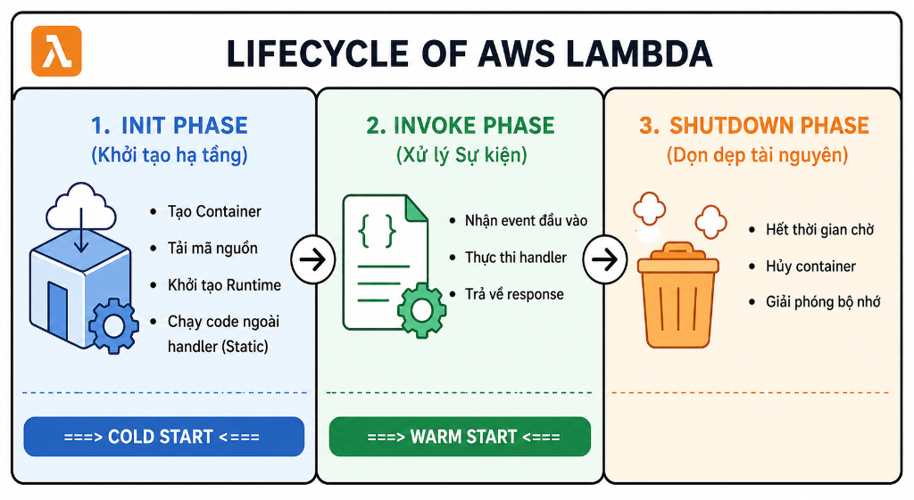
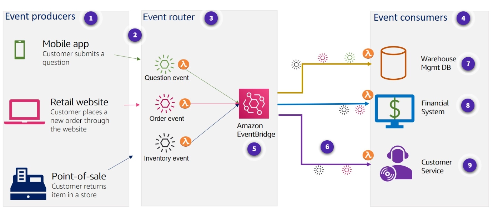
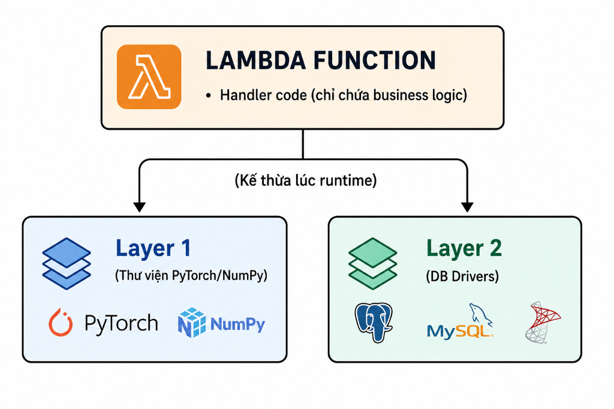
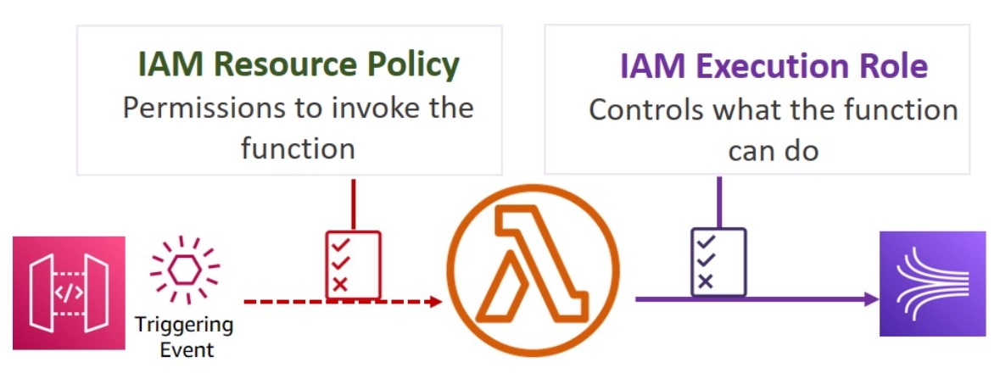

# ⚡ AWS Lambda & Serverless Architecture — Deep Dive

> **AWS Lambda** là dịch vụ tính toán không máy chủ (Serverless Compute) hướng sự kiện (Event-driven) được quản lý hoàn toàn bởi AWS. Dịch vụ này cho phép bạn chạy mã nguồn mà không cần dự phòng hoặc quản lý máy chủ ảo, tự động co giãn theo lưu lượng truy cập và chỉ tính phí cho thời gian thực thi thực tế.

---

## 1. Vòng đời môi trường thực thi (Execution Environment Lifecycle)

Khi hàm Lambda được kích hoạt, AWS sẽ tạo ra một môi trường thực thi cô lập (Execution Environment) để chạy mã nguồn. Vòng đời này trải qua 3 giai đoạn chính:

<i> Sơ đồ 3 giai đoạn vòng đời môi trường thực thi của AWS Lambda </i>

### A. Init Phase (Giai đoạn Khởi tạo)
Đây là giai đoạn chuẩn bị hạ tầng, bao gồm:
*   Tạo container chứa mã nguồn.
*   Tải mã nguồn của hàm từ S3 hoặc ECR.
*   Khởi tạo môi trường Runtime (Python, Node.js, Java...).
*   Thực thi các đoạn mã nằm **ngoài handler function** (ví dụ: import thư viện, khởi tạo kết nối Database, AWS SDK clients).
*   **Cold Start:** Nếu không có container nào rảnh rỗi (idle), AWS phải chạy lại toàn bộ Init Phase từ đầu. Quá trình này gây ra độ trễ khởi động ban đầu.

<i> Hiện tượng Cold Start xảy ra khi Lambda phải khởi tạo môi trường thực thi mới </i>

### B. Invoke Phase (Giai đoạn Thực thi)
*   AWS truyền sự kiện (Event) vào hàm Lambda và thực thi mã nguồn bên trong hàm **handler**.
*   **Warm Start:** Sau khi thực thi xong, môi trường thực thi không bị hủy ngay lập tức mà được đưa vào trạng thái **Idle** trong vài phút. Nếu có request mới đến, Lambda sẽ tái sử dụng container này để chạy ngay lập tức, bỏ qua giai đoạn Init giúp giảm độ trễ tối đa (< 10ms).

<i> Sơ đồ chi tiết vòng đời môi trường thực thi của AWS Lambda </i>

### C. Shutdown Phase (Giai đoạn Dừng hoạt động)
*   Khi không có yêu cầu nào gửi đến trong một khoảng thời gian (Idle), AWS sẽ tiến hành hủy môi trường thực thi này.
*   Runtime dừng hoạt động, giải phóng các kết nối mạng, file log và tiến hành hủy container.

---

## 2. Phân tích 3 cơ chế gọi hàm (Invocation Types)

Cách thức kích hoạt Lambda phụ thuộc hoàn toàn vào dịch vụ hoặc nguồn sự kiện đầu vào:

### A. Đồng bộ (Synchronous Invocation)
*   **Cơ chế:** Client gửi yêu cầu đến Lambda và **bắt buộc đứng đợi** cho đến khi hàm thực thi xong để nhận kết quả phản hồi (Response) hoặc thông báo lỗi (Error).
*   **Xử lý lỗi (Retry):** Nếu hàm bị lỗi hoặc timeout, Client sẽ nhận trực tiếp thông tin lỗi và phải tự lập trình cơ chế thử lại (Retry logic) trên ứng dụng của mình.
*   **Các dịch vụ tích hợp điển hình:** 
    *   *Amazon API Gateway / Application Load Balancer (ALB):* Đợi Lambda xử lý xong để trả về trang HTML hoặc JSON cho người dùng.
    *   *Amazon Cognito, AWS Step Functions.*

<i> Luồng hoạt động của cơ chế gọi hàm Đồng bộ </i>

### B. Bất đồng bộ (Asynchronous Invocation)
*   **Cơ chế:** Client gửi sự kiện đến Lambda, AWS Lambda ghi nhận sự kiện vào một **hàng đợi nội bộ (Internal Queue)** do AWS quản lý và lập tức trả về mã trạng thái `202 Accepted` cho Client. Client không cần đợi hàm chạy xong.
*   **Xử lý lỗi (Retry):** AWS Lambda tự động quản lý hàng đợi này và sẽ tự động thử lại tối đa **2 lần** nếu hàm chạy bị lỗi. 
*   **Tính năng bổ sung:**
    *   *Dead Letter Queue (DLQ) / Destinations:* Nếu thử lại hết số lần vẫn lỗi, sự kiện lỗi sẽ được chuyển đến **SQS** hoặc **SNS** để kỹ sư phân tích sau, tránh mất mát dữ liệu.
*   **Các dịch vụ tích hợp điển hình:**
    *   *Amazon S3:* Kích hoạt xử lý ảnh khi có file tải lên.
    *   *Amazon SNS / Amazon EventBridge.*

<i> Luồng hoạt động của cơ chế gọi hàm Bất đồng bộ </i>

### C. Ánh xạ nguồn sự kiện (Event Source Mapping - Polling)
*   **Cơ chế:** Dành cho các dịch vụ lưu trữ dữ liệu dạng hàng đợi hoặc dạng luồng (streams). AWS Lambda sẽ thiết lập một trình thăm dò (**Poller**) chạy ngầm để liên tục đọc dữ liệu từ nguồn, gom thành các gói dữ liệu (**Batches**) rồi gửi vào hàm Lambda của bạn để xử lý.
*   **Các dịch vụ tích hợp điển hình:**
    *   *Amazon SQS, Amazon Kinesis, Amazon DynamoDB Streams, Amazon MSK (Managed Streaming for Kafka).*

---

## 3. Kiến trúc hướng sự kiện (EDA) và Amazon EventBridge

Trong kiến trúc hướng sự kiện (Event-Driven Architecture), các thành phần giao tiếp với nhau thông qua việc phát và nhận các sự kiện độc lập.

<i> Mô hình kiến trúc hướng sự kiện tổng quan với AWS Lambda </i>

### Amazon EventBridge — Bộ định tuyến sự kiện (Event Router)
EventBridge là một dịch vụ Serverless Event Bus giúp kết nối các ứng dụng với nhau bằng cách định tuyến dữ liệu sự kiện từ nguồn phát đến đúng đích xử lý.
*   **Event Buses (Xe buýt sự kiện):** 
    *   *Default Event Bus:* Nhận các sự kiện thay đổi trạng thái của chính các dịch vụ AWS (ví dụ: EC2 bị sập, Auto Scaling kích hoạt).
    *   *Custom Event Bus:* Do bạn tự định nghĩa để định tuyến các sự kiện nội bộ của ứng dụng.
*   **Rules (Quy tắc lọc):** Định nghĩa cấu trúc JSON của sự kiện để lọc. Khi sự kiện khớp với Rule, EventBridge sẽ tự động định tuyến sự kiện đó tới các đích chỉ định (ví dụ: kích hoạt Lambda).
*   **EventBridge Scheduler:** Tính năng tạo và lên lịch các tác vụ chạy theo thời gian (cron-job) với độ chính xác cao và quy mô hàng triệu lịch trình khác nhau.

---

## 4. Lambda Runtimes & Custom Runtimes

*   **Managed Runtimes:** AWS cung cấp và bảo trì sẵn các môi trường chạy cho các ngôn ngữ phổ biến như Node.js, Python, Java, .NET, Ruby. AWS chịu trách nhiệm cập nhật các bản vá bảo mật và nâng cấp phiên bản hệ điều hành bên dưới.
*   **Custom Runtimes:** Nếu muốn chạy các ngôn ngữ không được hỗ trợ sẵn (ví dụ: Go, Rust, C++), bạn có thể tự đóng gói môi trường chạy bằng cách sử dụng **AWS Lambda Runtime API** hoặc chạy ứng dụng dưới dạng **Docker Container Image**.

---

## 5. Lambda Layers — Chia sẻ thư viện dùng chung

> **Lambda Layers** là cơ chế đóng gói các thư viện phụ thuộc (dependencies), mã nguồn dùng chung hoặc các tệp cấu hình bên ngoài deployment package chính của hàm Lambda.

<i> Sơ đồ cấu trúc kế thừa thư viện dùng chung qua Lambda Layers </i>

*   **Tối ưu dung lượng gói triển khai:** Giới hạn của gói deployment Lambda là **50MB** (dạng file zip nén) và **250MB** (khi giải nén). Bằng cách đưa các thư viện nặng (như `pandas`, `numpy`, hay database drivers) vào Layer, code chính của hàm sẽ rất nhẹ, giúp việc chỉnh sửa code trực tiếp trên Console và deploy diễn ra rất nhanh.
*   **Cơ chế hoạt động:** Khi chạy, Lambda sẽ giải nén các Layer vào thư mục `/opt` bên trong container thực thi.
*   **Giới hạn:** Mỗi hàm Lambda được sử dụng tối đa **5 Layers** đồng thời. Thứ tự khai báo các Layer rất quan trọng (layer khai báo sau có thể ghi đè các tệp trùng tên của layer khai báo trước).

---

## 6. Lambda Versions và Aliases

Tính năng giúp quản lý mã nguồn trong môi trường CI/CD chuyên nghiệp:

*   **Versions (Phiên bản):** Mỗi khi bạn xuất bản (publish) một version, AWS sẽ tạo ra một bản sao **bất biến (immutable)** của cả mã nguồn và cấu hình của hàm Lambda tại thời điểm đó (đánh số 1, 2, 3...). Bạn không thể chỉnh sửa một phiên bản đã xuất bản.
*   **Aliases (Bí danh):** Là một con trỏ (pointer) trỏ đến một Version cụ thể và có tính **thay đổi được (mutable)** (ví dụ đặt tên alias là `DEV`, `STAGING`, `PROD`).
*   **Traffic Shifting (Điều phối lưu lượng):** Bạn có thể cấu hình cho một Alias trỏ đến 2 Version khác nhau theo tỷ lệ phần trăm (ví dụ: Alias `PROD` gửi 90% traffic đến Version 1 và 10% đến Version 2). Đây là cơ sở để thực hiện triển khai **Canary Deployments** (thử nghiệm phiên bản mới an toàn).

---

## 7. Lambda SnapStart — Tối ưu hóa khởi động cho Java

Đối với các ứng dụng viết bằng Java, hiện tượng Cold Start thường rất nghiêm trọng (có thể lên tới vài giây) do quá trình khởi chạy máy ảo Java Virtual Machine (JVM) và tải các framework lớn (như Spring Boot) mất nhiều thời gian.

*   **Cơ chế SnapStart:**
    1.  Khi bạn publish một phiên bản của hàm Java có bật SnapStart, Lambda sẽ chạy toàn bộ giai đoạn **Init Phase** trước.
    2.  Sau khi Init xong, Lambda sẽ chụp một bản chụp nhanh (**Snapshot**) trạng thái của bộ nhớ RAM và CPU của môi trường đó.
    3.  Snapshot này được mã hóa và lưu trữ trong bộ nhớ cache có độ trễ cực thấp.
    4.  Khi có cuộc gọi hàm đầu tiên (Cold Start), thay vì phải chạy lại JVM và nạp thư viện từ đầu, Lambda lập tức khôi phục (**Restore**) lại trạng thái từ Snapshot và thực thi hàm.
*   **Hiệu quả:** Giảm thời gian Cold Start của Java xuống **dưới 200 mili-giây** (nhanh hơn gấp 10 lần).

---

## 8. Amazon API Gateway — Cửa ngõ kết nối API

Amazon API Gateway là dịch vụ quản lý API hoàn chỉnh, giúp lập trình viên dễ dàng tạo, phát hành, bảo trì và bảo mật các API HTTP, REST và WebSocket.

### A. Tích hợp giữa API Gateway và AWS Lambda
*   **Lambda Proxy Integration (Tích hợp ủy quyền):** API Gateway chuyển tiếp nguyên vẹn toàn bộ HTTP Request (headers, query strings, body) dưới dạng cấu hình JSON trực tiếp vào hàm Lambda. Hàm Lambda có nhiệm vụ xử lý và tự định dạng cấu trúc JSON trả về (bao gồm statusCode, headers, body) để gửi ngược lại cho khách hàng. Đây là phương pháp phổ biến và dễ cấu hình nhất.
*   **Lambda Custom Integration (Tích hợp tùy biến):** Bạn phải định nghĩa các quy tắc ánh xạ (Mapping Templates) bằng ngôn ngữ VTL (Velocity Template Language) để chuyển đổi dữ liệu yêu cầu trước khi gửi cho Lambda và ngược lại.

### B. So sánh các loại API Gateway

| Đặc điểm | HTTP API | REST API | WebSocket API |
| :--- | :--- | :--- | :--- |
| **Mục đích** | Các API HTTP cơ bản, tối ưu chi phí và độ trễ. | API RESTful nâng cao, đầy đủ tính năng doanh nghiệp. | Giao tiếp hai chiều thời gian thực (Real-time). |
| **Tính năng** | JWT Authorizer, OIDC, CORS. | API Keys, Usage Plans, Request Validation, Private API Endpoints, WAF. | Kết nối hai chiều liên tục giữa client và server. |
| **Độ trễ & Chi phí** | Cực kỳ thấp, rẻ hơn đến 70% so với REST API. | Trung bình, đắt hơn do có nhiều tính năng quản lý. | Tính phí dựa trên số phút kết nối và số tin nhắn truyền tải. |

---

## 9. Phân phối Edge Computing: Lambda@Edge vs. CloudFront Functions

Khi tích hợp tính toán logic trực tiếp trên CDN (CloudFront) tại các trạm biên (Edge Locations) để tối ưu hóa trải nghiệm người dùng gần nhất, AWS cung cấp hai giải pháp:

| Tiêu chí | CloudFront Functions | Lambda@Edge |
| :--- | :--- | :--- |
| **Ngôn ngữ hỗ trợ** | Chỉ hỗ trợ **JavaScript (ECMAScript 5.1)** | Hỗ trợ **Node.js** và **Python** |
| **Trình kích hoạt (Triggers)** | - Viewer Request - Viewer Response | - Viewer Request / Viewer Response - Origin Request / Origin Response |
| **Dung lượng code tối đa** | Rất nhỏ (tối đa **10 KB**) | Lớn (1MB cho Viewer event, 50MB cho Origin event) |
| **Khả năng kết nối** | **Không.** Không có quyền truy cập Internet, ổ đĩa hoặc kết nối với các dịch vụ AWS khác. | **Có.** Có thể gọi API ngoài, truy cập Database, Secrets Manager... |
| **Thời gian thực thi tối đa** | < 1 mili-giây (siêu nhanh) | 5 giây (Viewer) / 30 giây (Origin) |
| **Chi phí** | Rất rẻ (chỉ bằng 1/6 so với Lambda@Edge) | Cao hơn |
| **Trường hợp sử dụng** | - URL redirects/rewrites đơn giản - Thêm/bớt/sửa Header HTTP cơ bản - Chuẩn hóa Cache Key | - Xử lý/chỉnh sửa Body của request/response - Resize hình ảnh tự động (Image Optimization) - Xác thực token JWT phức tạp bằng DB |

---

## 10. Quyền hạn và Bảo mật trong AWS Lambda

Bảo mật của AWS Lambda hoạt động dựa trên mô hình trách nhiệm chung thông qua hai chính sách IAM chính:

*   **IAM Execution Role (Quyền thực thi của hàm):** 
    *   Xác định những tài nguyên nào **hàm Lambda được phép truy cập** khi đang thực thi mã nguồn.
    *   *Ví dụ:* Quyền đọc tệp từ S3 (`s3:GetObject`), quyền ghi log vào CloudWatch Logs (`logs:PutLogEvents`), quyền ghi dữ liệu vào DynamoDB.
*   **Resource-based Policy (Quyền kích hoạt hàm):**
    *   Xác định những dịch vụ hoặc tài khoản AWS nào **được phép kích hoạt (invoke)** hàm Lambda này.
    *   *Ví dụ:* Cho phép một S3 Bucket cụ thể kích hoạt Lambda mỗi khi có file tải lên, hoặc cho phép một API Gateway cụ thể kích hoạt Lambda.

<i> Phân biệt IAM Execution Role (Quyền truy cập ra ngoài) và Resource-based Policy (Quyền kích hoạt vào trong) của Lambda </i>

---

## 11. Các liên kết liên quan trong hệ thống

Để củng cố và mở rộng kiến thức về các dịch vụ điện toán và lưu trữ dữ liệu đi kèm, hãy tham khảo các tài liệu sau:
*   [ECS_ECR.md](ECS_ECR.md): Tìm hiểu giải pháp container hóa ứng dụng (microservices) quy mô lớn với ECS và Fargate.
*   [database_service.md](../04_Databases_Caching/database_service.md): Tìm hiểu cách kết nối Lambda đến các cơ sở dữ liệu quan hệ (RDS/Aurora) và NoSQL (DynamoDB).
*   [ElastiCache.md](../04_Databases_Caching/ElastiCache.md): Ứng dụng Redis làm cache đệm lưu trữ Session cho Lambda Stateless.
*   [CloudFront_CDN.md](../03_Storage_ContentDelivery_SES/CloudFront_CDN.md): Giải pháp phân phối nội dung tĩnh/động kết hợp với Lambda@Edge tại các Edge Location toàn cầu.

---
*(Tài liệu được tổng hợp dựa trên AWS Lambda Developer Guide và các kiến thức tối ưu hóa Serverless thực tế).*
